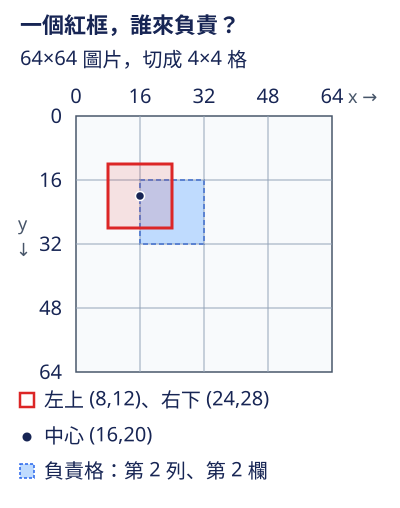

# 從一個小 CNN，走到你看得懂的 YOLO

如果你會寫一點 Python／PyTorch，知道神經網路與 CNN 的基本概念，就可以從這裡開始。我們先用小 CNN 回答「整張圖是哪一類」，再用 ResNet 的捷徑連接理解網路如何加深，接著學會同時回答「圖裡有哪些物件，各自在什麼位置」。

主角是 **MiniYOLO**：為了理解物件偵測而做的小型 PyTorch 模型。沿途每次只引入一個主要變化，看看它解決什麼問題、帶來什麼好處，又增加什麼成本。

[從第一節開始](lessons/00-warmup.md){ .md-button .md-button--primary }
[檢視完整閱讀路線](learning-path.md){ .md-button }

## 這裡怎麼學

從第一節依序讀：**超短暖身 → 小 CNN → ResNet → 圖片偵測 → YOLO 的演化 → 影片與部署**。已有基礎時，可以照[完整閱讀路線](learning-path.md)選擇起點。

42 個小節各有網頁與 Colab notebook。只看網頁也能學習：先讀直覺與小例子，再對照程式和結果，最後試著回答練習題，需要時看參考答案。想動手就點該節的 Colab 按鈕，在雲端執行 Python；程式可單獨執行，不必先跑上一節，但理解上仍會用到該節列出的前置知識。公式會交代符號與單位，用到數學時再一起回想。

## 先看一個偵測的小問題

假設圖片裡有一個紅色矩形，我們已經用紅框標出它的位置。模型如何知道「哪個輸出位置要學這個框」？第 7 章的簡化模型把圖片切成格子，讓**物件中心所在的格子負責預測**。先用下面的示意圖看懂這個規則。

{ width="400" }

座標寫成 `(x,y)`，從圖片左上角 `(0,0)` 開始，x 向右、y 向下，單位是畫素。紅框的中心是 `(16,20)`；每格寬、高都是 16 畫素，因此中心落在**第 2 列、第 2 欄**，程式從 0 起算的索引是 `(列=1,欄=1)`。中心的 x 恰好在分界線 16 上，這裡約定交給右側那一格。框本身可以跨過幾個格子，負責格子仍由中心決定。

不必現在記住這組座標。之後的[訓練目標（target）](lessons/07-targets.md)會用同一個例子，逐步把標註轉成模型要學的數值。

偵測還有三件需要分清楚的事，後面會分節實作：

1. **訓練：**把圖片交給模型，用已知的標註計算預測誤差（loss），再更新參數，讓模型學會找物件。
2. **推論：**把新圖片交給訓練好的模型，取得預測框與類別。若同一物件出現重複框，再用 NMS（非極大值抑制）篩掉重疊候選；產生預測不需要提供答案。
3. **評估：**用有標註、未參與訓練的圖片，對照預測與答案，檢查模型找對了多少。這時不更新參數。

模型有了這條基本管線後，再逐步研究 YOLO 各分支怎麼改進它，從早期版本一路到 YOLOv12、YOLO26。每一節都會說明借用了哪個機制、做了哪些簡化；YOLO 由不同團隊發展，版本號也不等於適合所有任務的排名。

## 先了解這版的證據

你會先用已知答案的小例子檢查座標、框與計算，再用 CPU 確認模型能產生預測、計算誤差、更新參數。另有合成幾何圖形的短訓練，確認小模型能學會這個受控任務；真實照片的辨識效果仍待實驗。

核心練習可用 CPU 執行，無需下載大型資料；影片與部署章另有工具需求，各節會列出。已有L4短訓練、checkpoint恢復與TensorRT數值核對；真實資料長訓練與不同架構的完整品質／效能對照仍待安排。[驗證範圍與後續實驗](status.md)列出已完成與待做的項目。

教材程式與 Colab 固定在同一個程式版本，方便你對照網頁裡的例子與結果。

## 已備妥的資料與操作

- [資料來源、授權與下載](preparation/data.md)：Fashion-MNIST 已查覈並發布至 LFS；偵測資料的使用與再散佈條件分開列出。
- [GitHub Pages／Colab／LFS 操作](preparation/publish.md)：維護網站與下載資料的步驟。
- [公開課程研究](planning/course-research.md)與[讀者回饋](planning/feedback.md)：這份課綱吸收了哪些安排。
- [Colab 環境檢查](https://colab.research.google.com/github/birdhackor/learn_to_yolo/blob/main/notebooks/00_environment_check.ipynb)：只檢視 Python、PyTorch 與 GPU 資訊。
