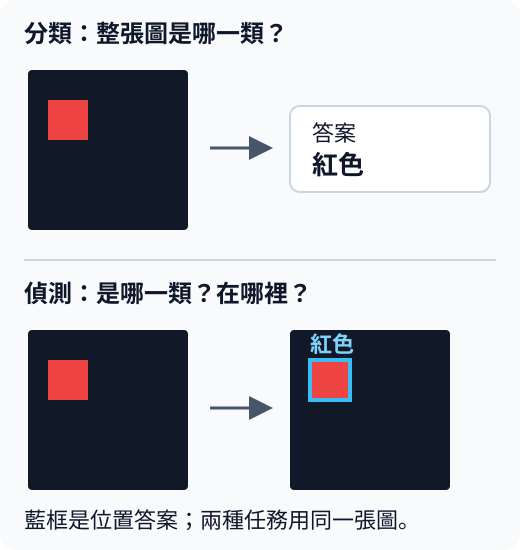

# 從一個小 CNN，走到你看得懂的 YOLO

把一張圖片交給模型，它能回答「這張圖是紅色方塊」。如果我們還想知道方塊在哪裡呢？模型就要多給一個框，標出位置。

這是本教材要帶你走過的改變：從**整張圖的分類**，走到**物件的類別與位置**。後者叫物件偵測（object detection）。

{ width="520" }

上圖是兩種任務的答案示意。藍框表示希望模型找出的位置；它是人事先畫好的範例答案。

YOLO 是一系列物件偵測模型。本教材用 PyTorch 寫很小的模型，讓你親手看懂它們怎麼算、怎麼學，以及不同版本為什麼改設計。我們把這些教學用偵測器稱為 **MiniYOLO**。

[從第 0 章暖身開始](lessons/00-warmup.md){ .md-button .md-button--primary }
[檢視完整閱讀路線](learning-path.md){ .md-button }

## 這裡怎麼學

整條路線圍繞四個問題：

1. **模型怎麼從圖片學會分類？**第 0–3 章從一次參數更新開始，接上小 CNN，再認識 ResNet 的捷徑連接。
2. **除了類別，怎麼學會位置與多個物件？**第 4–8 章加入框，走過資料、訓練、推論與評估；第 7 章把這些接成可訓練的小偵測器，第 8 章接自己的圖片與資料。
3. **YOLO 各版本在解決什麼問題？**第 9–16 章用簡化實驗看 anchor、多尺度、anchor-free、不同 head 與 loss 等改動，連同收益與代價一起理解。
4. **怎麼把模型用起來？**第 17–20 章有結業任務，以及影片、tracking 和部署選修。

每一節都先從一個具體問題與小例子開始，再看程式、結果和練習。**只讀網頁也能學習**；想動手時，點頁首的 Colab 按鈕，在 Google 的線上 Python 環境執行。42 節各有獨立 notebook，不必先跑上一節的程式；閱讀需要的前文會在各節開頭指出。

## 開始前與實驗範圍

需要會基本 Python，也看得懂 `class` 的寫法。跑過一次 PyTorch、聽過神經網路和卷積會比較輕鬆。數學不必熟背：第 0 章會用數字回想梯度，之後公式都會連到例子。更完整的先備知識與選讀路線見[閱讀路線](learning-path.md)。

各節實驗使用 CPU，資料由程式畫出。你會先用紅、藍等彩色幾何圖形，檢查模型是否真的更新、框是否找對，再用小實驗理解各種機制。這些受控題目讓我們容易看清每一步；真實照片上的偵測效果仍需要另外訓練與評估，詳見[驗證範圍](status.md)。

??? note "第一次執行程式"

    Colab 執行程式需要 Google 帳號；各節 notebook 的第一格會準備環境，最後一格是可修改的完整實驗。[第 0 章](lessons/00-warmup.md)有操作步驟。

    網頁與 notebook 中已保存的結果是教材的實際執行紀錄。你重跑之後，計時或訓練數字可能略有不同；手算例子則可逐項核對。

??? note "查資料或維護教材"

    - [術語快速查](glossary.md)：遇到名詞時查它在本書的意思。
    - [GPU／checkpoint 實測](validation/gpu-smoke.md)：另做的 L4 短訓練與存檔續訓檢查。
    - [全套實驗與審查](validation/curriculum.md)：逐節執行紀錄與驗證方法。
    - [資料來源與授權](preparation/data.md)、[網站發布步驟](preparation/publish.md)：資料及維護操作。
    - [公開課程研究](planning/course-research.md)與[讀者心得](planning/feedback.md)：課程安排的參考。
    - [Colab 環境檢查](https://colab.research.google.com/github/birdhackor/learn_to_yolo/blob/main/notebooks/00_environment_check.ipynb)：檢視 Python、PyTorch 與 GPU 資訊。
