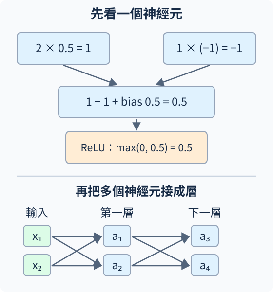
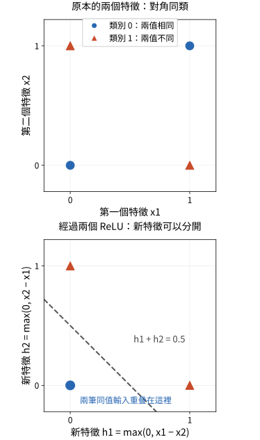
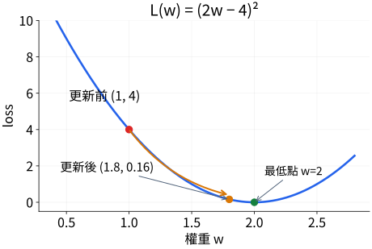

# A.0 神經網路與第一次學習：從神經元到梯度下降

<details class="chapter-a-toc">
<summary>本頁目錄</summary>
<ul>
<li><a href="#_1">神經元先把輸入加權，再決定輸出</a></li>
<li><a href="#_2">用矩陣一起計算一層</a></li>
<li><a href="#_3">非線性如何幫模型給出需要的答案</a></li>
<li><a href="#_4">先把訓練縮成一個旋鈕</a></li>
<li><a href="#_5">梯度告訴我們往哪個方向調</a></li>
<li><a href="#_6">梯度下降法：往反方向走，再重新計算</a></li>
<li><a href="#pytorch">把手算對應到 PyTorch</a></li>
<li><a href="#_7">停一下：你能解釋這兩個變化嗎</a></li>
<li><a href="#_8">實際執行紀錄</a></li>
</ul>
</details>

[在 Colab 執行本節](https://colab.research.google.com/github/birdhackor/learn_to_yolo/blob/lessons-v0.6.1/notebooks/00-warmup.ipynb){ .md-button }

在[全書開頭](../index.md)，我們看到讓電腦辨識圖片的一個轉折：讓網路從資料中學。現在先不碰圖片，回答最基本的問題：**神經網路是一個什麼樣的計算器，而「學習」究竟改了什麼？**

本節先用兩個輸入看懂神經元，再把訓練縮成一個可手算的權重。你只需要順著本文讀；頁末的操作補充可等到想跑程式時再看。

## 神經元先把輸入加權，再決定輸出

假設收到兩個數字 $x_1=2, x_2=1$。我們替它們各配一個可調的**權重（weight）**，例如 $w_1=0.5, w_2=-1$，再加一個可調常數 **bias（偏置）** $b=0.5$：

\[
\begin{aligned}
z&=w_1x_1+w_2x_2+b\\
&=0.5\times2+(-1)\times1+0.5\\
&=0.5.
\end{aligned}
\]

這些可調的數字統稱模型的**參數（parameter）**。權重決定各輸入的影響，bias 調整整體起點。例如輸入全為 0，這個加權結果仍是 b。這裡的 z 是中間結果，還不一定是最後的預測。

**感知機（perceptron）**是早期神經網路的基本模型：先做這類加權加總，再用硬閾值決定輸出，例如 z>0 回答 1，否則回答 0。現代神經網路保留加權加總的想法，常把硬閾值換成適合多層學習的**啟動函數（activation function）**。

本書先用 **ReLU（Rectified Linear Unit，整流線性單元）**：正數保留，負數變成 0，寫成 $a=\max(0,z)$。上例 z=0.5，所以 a=0.5；若 z=−0.5，輸出就變成 0。它不是經典感知機的 0／1 閾值。

{ width="560" }

圖的上半是單個神經元，下半是把它們排成層，再接到下一層。圖中的箭頭表示數字往哪裡送；每條可學的連接有自己的權重。

## 用矩陣一起計算一層

一個神經元給一個數，多個神經元一起算，就給一列數字。把同一層的權重排成矩陣 W，輸入排成向量 x，便能一次寫出這一層的計算：

\[
\begin{bmatrix}z_1\\z_2\end{bmatrix}
=\begin{bmatrix}0.5&-1\\1&1\end{bmatrix}
\begin{bmatrix}2\\1\end{bmatrix}
+\begin{bmatrix}0.5\\0\end{bmatrix}
=\begin{bmatrix}0.5\\3\end{bmatrix}.
\]

第一列就是剛才的神經元，第二列是另一個神經元。矩陣乘法只是把許多次「對應相乘、再相加」一起記下來。

只做 $Wx+b$，嚴格說是**仿射運算**；沒有 bias 的 $Wx$ 才是線性運算。機器學習通常把這種乘加層簡稱為線性層。

## 非線性如何幫模型給出需要的答案

先看一個只用兩個特徵的分類任務；這裡的特徵就是輸入數字 $x_1,x_2$，各自只能是 0 或 1。答案規則是：兩者相同，類別為 0；兩者不同，類別為 1。

| $x_1$ | $x_2$ | 所需類別 |
| --- | --- | --- |
| 0 | 0 | 0 |
| 1 | 1 | 0 |
| 1 | 0 | 1 |
| 0 | 1 | 1 |

這個「兩者不同才回答 1」的規則叫 **XOR（exclusive OR，互斥或）**。我們希望模型正確分出這四種輸入。

若只算 $z=w_1x_1+w_2x_2+b$，再用 $z>0$ 判為類別 1、否則判為 0，門檻 $z=0$ 在輸入平面上是一條直線。四個輸入點形成正方形，同類別的點位於相對角落；一條直線無法把兩類分開。

只增加乘加層也無法改變這個限制。例如把 $z=2x+1$、$y=3z-2$ 串起來，合併後仍是 $y=6x+1$。疊很多層，也仍能合併成一次乘加；最後用一道門檻分類，仍無法分開上面的四個點。

ReLU 可以改變送給下一層的表示。這次用兩個神經元，分別保留兩種方向的正差值：

\[
h_1=\max(0,x_1-x_2),\qquad h_2=\max(0,x_2-x_1).
\]

接著將 $h_1+h_2>0.5$ 判為類別 1，否則判為 0：

| 原始輸入 $(x_1,x_2)$ | 新表示 $(h_1,h_2)$ | $h_1+h_2$ | 判定類別 |
| --- | --- | --- | --- |
| (0, 0) | (0, 0) | 0 | 0 |
| (1, 1) | (0, 0) | 0 | 0 |
| (1, 0) | (1, 0) | 1 | 1 |
| (0, 1) | (0, 1) | 1 | 1 |

{ width="520" }

上圖的藍圓是兩值相同的類別 0，紅三角是兩值不同的類別 1。下圖改畫新特徵：兩個藍點重疊在原點，紅點則在虛線的另一側。

原本位於相對角落的兩個類別，現在變成能由 $h_1+h_2=0.5$ 分開的兩組數。ReLU 的**非線性**在這裡把原本不能用一道直線門檻分開的輸入，轉成下一層能分開的表示。

從函數形狀也能看見這個改變。把 ReLU 放在兩層乘加中間，$y=3\max(0,2x+1)-2$：x=−1 時 y=−2，x=0 時 y=1，x=1 時 y=7。不同區段有不同的變化率，無法用同一條直線表示。

**NN（Neural Network，神經網路）**把神經元組成網路；**DNN（Deep Neural Network，深度神經網路）**則有多層計算。中間的非線性讓多層網路能表示更複雜的輸入與答案關係。最後一層依任務產生數字或類別分數，不必每層都用 ReLU。

上面的權重是人指定的能力示意，沒有進行訓練。影像與語音中的複雜模式，也常無法只靠原始輸入的乘加結果和一道門檻分開，因此需要非線性建立有用的表示。不是每個任務都如此；能表示答案，也不保證訓練一定會學會。接著讓資料告訴我們該怎麼改參數。

## 先把訓練縮成一個旋鈕

為了把每一步看清楚，暫時只留下**一個權重 w**，不加 bias、不用 ReLU，模型做 $\hat y=wx$。這不是完整 DNN，而是在拆解所有這類網路共同的訓練步驟。

固定輸入 $x=2$、人給的答案 $y=4$，目前 w=1，所以預測 $\hat y=2$。符號 $\hat y$ 讀作 y hat，用來區分模型預測與正確答案 y。訓練這一步只改 w，資料 x、y 不改。

我們需要一個數字評分錯多少，叫 **loss（損失）**。這次用 **MSE（Mean Squared Error，均方誤差）**：把每個預測與答案的差平方，再取平均。本例只有一個預測，平均後就是這一項：

\[
L=(\hat y-y)^2=(2-4)^2=4.
\]

預測 2 或 6 都離答案 4 差 2，loss 都是 4。這很適合現在的數值預測：距離多遠就是錯多少。下一節換成類別答案時，我們會重新選擇評分方式。

## 梯度告訴我們往哪個方向調

把 w 想成旋鈕，先試著從 1 轉到 1.01。預測變成 2.02，loss 變成 3.9204。**w 增加一點，loss 減少了**，所以附近應該往增加 w 的方向走。

導數描述這個局部變化率：loss 改變多少，除以 w 改變多少。試算得到

\[
\frac{3.9204-4}{1.01-1}=-7.96.
\]

把變動縮得更小，數值趨近 −8。對參數而言，這個變化率就是它的**梯度（gradient）**，記成 $g=\partial L/\partial w$。負號表示 w 增加一點會讓 loss 下降；正號則表示應往減小 w 的方向調。模型有多個參數時，計算某個參數的梯度，是固定其他參數，只看改動它時 loss 的局部變化；因此每個參數都有自己的梯度。

不用每個權重都試轉一次，還可以沿計算順序求導。令誤差 $e=\hat y-y$，平方 $e^2$ 的局部變化率是 $2e$：誤差離 0 越遠，平方值對小變動越敏感。本例 e=−2，增加預測會讓誤差靠近 0，所以這一段的變化率是 $2(\hat y-y)=-4$。而 w 改變預測的變化率是 x=2，把兩段相乘：

\[
g=2(\hat y-y)\times x=-4\times2=-8.
\]

這叫**連鎖律（chain rule）**。網路雖然層數更多，仍能沿計算路徑把各段的變化率接起來。**反向傳播（backpropagation）**就是從 loss 往回計算各參數梯度的過程；PyTorch 會替我們做，算完尚未修改權重。

## 梯度下降法：往反方向走，再重新計算

核心方法現在可以命名了：**梯度下降法（gradient descent）**。先依目前參數求梯度，再往梯度的反方向更新，反覆讓 loss 變小。**學習率（learning rate）** $\eta$ 控制一步走多遠；這次取 0.1：

\[
w_{\text{new}}=w-\eta g=1-0.1(-8)=1.8.
\]

減掉負數就是增加。新預測為 $1.8\times2=3.6$，新 loss 為 $(3.6-4)^2=0.16$。

{ width="560" }

圖中橫軸是 w，縱軸是 loss。−8 描述起點附近的斜率，並不是要把 w 直接設成 −8。走到 1.8 後，坡度也變了；下一步應重新計算梯度，而不是重複使用 −8。

| | 更新前 | 更新後 |
| --- | --- | --- |
| w | 1 | 1.8 |
| 預測 | 2 | 3.6 |
| loss | 4 | 0.16 |

方向正確也可能走太遠：如果學習率改成 0.6，新 w=5.8，loss=57.76，反而比原來大。梯度只是局部方向，不保證任何步長都會下降。

## 把手算對應到 PyTorch

`Linear(1,1,bias=False)` 每筆讀 1 個數、輸出 1 個數，只乘權重。`[[2.0]]` 外層表示一批只有 1 筆，內層表示每筆只有 1 個輸入，所以形狀為 `[1,1]`。這些數值陣列在 PyTorch 叫 **tensor（張量）**；`torch` 是程式匯入的 PyTorch 套件名稱。完整程式先建立模型、設定 w=1，然後執行：

``` { .python data-excerpt="lesson_cases/00-warmup.py" }
optimizer = torch.optim.SGD(model.parameters(), lr=0.1)
x, target = torch.tensor([[2.0]]), torch.tensor([[4.0]])
model.train()
optimizer.zero_grad(set_to_none=True)
prediction = model(x)
loss = ((prediction - target) ** 2).mean()
loss.backward()
gradient = model.weight.grad.item()
before = model.weight.item()
optimizer.step()
after = model.weight.item()
```

**optimizer（優化器）**負責按更新規則修改參數。這裡的 **SGD（Stochastic Gradient Descent，隨機梯度下降）**一般用抽到的一筆或一小批資料估計梯度；本例只有一筆固定資料，沒有抽樣，但更新式仍是剛才的負梯度步驟。`model.parameters()` 把要更新的權重交給它。

`model.train()` 設定模型處於訓練模式。接下來 `zero_grad()` 清掉既有梯度；`model(x)` 是**前向計算（forward）**，產生預測；loss 比較預測和答案；`backward()` 計算梯度，並累加到參數的 `.grad`；最後 `step()` 才更新參數。取出 `.item()` 是把只有一個值的 tensor 轉成一般 Python 數字，便於印出。

清除梯度是為了避免本步和舊步混在一起。例如，假設某個參數的 `.grad` 留著舊梯度 −8，這次 `backward()` 又算出 −3；若沒有先清除，累加後會是 −11。一般逐步更新時，這一步應使用新算出的 −3，所以每步開始前先呼叫 `zero_grad()`。

程式輸出與手算一致：

```text
prediction=2.00, loss=4.00, gradient=-8.00
weight: 1.00 -> 1.80; new_prediction=3.60; new_loss=0.16
```

實際訓練會重複「前向 → loss → 反向 → 更新」。多層網路有很多權重與 bias，每個參數都會收到自己的梯度；一筆或一批資料產生一個總 loss，再據此一起更新。下一節換成 CNN 時，計算器變大，這個循環仍相同。

這次只有一筆資料、一次更新，證明的是更新規則與程式對得上。能回答這一筆，還不能證明模型在其他輸入上也可靠；A.2 會接著檢查這件事。

## 停一下：你能解釋這兩個變化嗎

1. **拿掉所有中間 ReLU，只堆疊乘加層，會得到更複雜的非線性關係嗎？**先回想兩層合併的例子。
2. **只呼叫 `backward()`，不呼叫 `step()`，下一次預測會自動變好嗎？**區分計算方向與真的改參數。

??? note "核對想法"

    1. 不會。多層仿射運算仍可合併成一層；ReLU 的分段作用才改變這個限制。
    2. 不會。梯度被算出並存下來，但 w 仍是 1。要執行更新，預測才會變成 3.6。

??? note "動手跑一次，或試第二步"

    點頁首 Colab，從上到下執行各格；第一格下載固定版本程式，最後一格是完整實驗。按格子左側播放鍵，或使用 Shift+Enter。看到上面的輸出，就能和手算核對。

    想手算第二步：在 w=1.8 時重新求梯度，得到 $g=2(3.6-4)\times2=-1.6$。同樣學習率更新到 w=1.96，預測 3.92，loss=0.0064。若修改初始化或學習率，要同步修改完整實驗中核對原答案的 assert；assert 是特定設定的檢查，不是訓練規則。

??? note "評估模式與停止記錄梯度"

    `model.eval()` 切換到評估模式，會改變某些層的行為；它不會停止自動求導。`torch.no_grad()` 才讓這段計算不記錄求導路徑。完整程式更新後用兩者重新計算結果；A.2 評估新資料時會再用到。

    若重新建立模型，也要建立連到新參數的 optimizer。舊 optimizer 仍握著舊模型的參數，不會自動認出同名的新模型。

接著讀 [A.1：CNN 如何讀圖](01-small-cnn.md)。

<!-- curriculum-evidence:start -->

## 實際執行紀錄

本節的完整程式於 2026-10-07 在 AMD EPYC 9V74 80-Core Processor（2 個執行緒）上用 PyTorch 2.9.1+cpu 執行，程式裡的 assert 全部通過。下面是那次印出的原始輸出；輸出裡若有計時或訓練得到的數字，換一台電腦會略有不同。每個數字的意思，以本頁正文的說明為準。[完整紀錄（JSON）](https://github.com/birdhackor/learn_to_yolo/blob/main/artifacts/checks/curriculum/00-warmup.json)

??? example "展開本次實際輸出"

    ```text
    x_shape=(1, 1), weight_shape=(1, 1)
    prediction=2.00, loss=4.00, gradient=-8.00
    weight: 1.00 -> 1.80; new_prediction=3.60; new_loss=0.16
    eval still tracks gradients; replacement optimizer points to replacement model
    ```

<!-- curriculum-evidence:end -->
