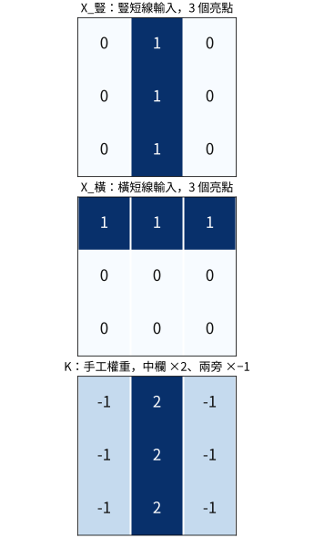
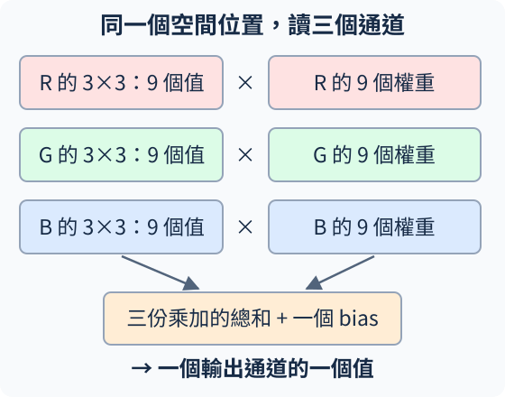
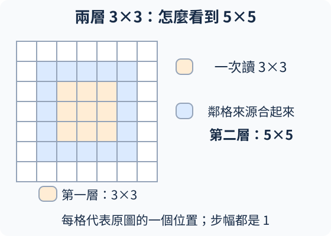
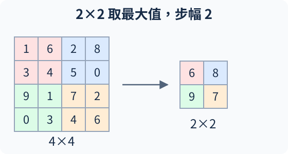

# A.1 CNN 如何讀圖：從局部乘加到分類答案

<details class="chapter-a-toc">
<summary>本頁目錄</summary>
<ul>
<li><a href="#_1">先看材料與答案</a></li>
<li><a href="#_2">為什麼附近像素值得一起讀</a></li>
<li><a href="#_3">從一個神經元，變成會掃圖的濾鏡</a></li>
<li><a href="#33-rgb-27">3×3 為什麼到了 RGB 變成 27 個值</a></li>
<li><a href="#_4">縮小圖片之前，先看每一層看到多遠</a></li>
<li><a href="#pooling">Pooling：把鄰近位置收成一格</a></li>
<li><a href="#_5">從一張特徵圖，收成兩個類別分數</a></li>
<li><a href="#softmax">Softmax：分數怎麼變成機率</a></li>
<li><a href="#mse">為什麼這次用交叉熵，沒有沿用 MSE</a></li>
<li><a href="#forty-steps">三步檢查流程，再看能不能學會</a></li>
<li><a href="#_6">停一下：三個改動會怎樣</a></li>
<li><a href="#_7">實際執行紀錄</a></li>
</ul>
</details>

[在 Colab 執行本節](https://colab.research.google.com/github/birdhackor/learn_to_yolo/blob/lessons-v0.6.1/notebooks/01-small-cnn.ipynb){ .md-button }

[A.0](00-warmup.md)先教了加權加總、ReLU 與梯度下降。現在把輸入換成圖片：**紅矩形回答 0，藍矩形回答 1。**我們沿著「圖裡的數字 → 局部特徵 → 整圖分數 → 分類 loss」走一次，看看網路怎麼讀圖，也看看它怎麼學。

這次用 **CNN（Convolutional Neural Network，卷積神經網路）**。它仍是神經網路，只是用「讀取附近一小塊、在不同位置共用權重」的方式，利用圖片的空間結構。

## 先看材料與答案

每張圖是 32×32 黑底，矩形都是 12×12，只改顏色與位置。一共 8 張，答案依序是 `[0,1,0,1,0,1,0,1]`。0、1 是類別名稱的編號，不代表紅比藍少一個單位。


圖號用來找圖片，類別編號才是要學的答案。圖 1／4、圖 3／6 各自有相同位置、不同顏色：只記位置，不能把這批圖全答對。這是受控的小題目，先讓我們看清模型有沒有利用顏色。

RGB 圖可以看成疊在一起的三張數值表：R 紅、G 綠、B 藍，各叫一個 **channel（通道）**。同一位置的三個值決定顏色。本例黑是 `[0,0,0]`，紅是 `[1,0,0]`，藍是 `[0,0,1]`，數值介於 0 與 1。

把 8 張圖一起送入，叫一個 **batch（一批資料）**。PyTorch 把圖片存為 **tensor（張量，多維數值陣列）**，卷積層的軸順序是 **NCHW**：圖片張數 N、通道 C、高 H、寬 W。

| 資料 | 形狀 | 意義 |
| --- | --- | --- |
| 一張 RGB 圖 | `[3,32,32]` | 3 張 32×32 的通道表 |
| 一批 8 張圖 | `[8,3,32,32]` | 外面多一個圖片軸 |
| 正確答案 | `[8]` | 每張一個類別編號 |

圖片用浮點數 `float32`；答案編號用整數 `long`。後面寫 `[N,C,H,W]` 或 `[B,C,H,W]`，N、B 都指一批的張數。

## 為什麼附近像素值得一起讀

圖片裡的線索不只在於有多少亮點，也在於它們怎麼排列。先看兩個 3×3 灰階小塊，1 是亮、0 是黑：

\[
X_{\text{豎}}=\begin{bmatrix}0&1&0\\0&1&0\\0&1&0\end{bmatrix},\qquad
X_{\text{橫}}=\begin{bmatrix}1&1&1\\0&0&0\\0&0&0\end{bmatrix}.
\]

兩塊都有 3 個亮點，總和同為 3、平均同為 1/3，但一塊是豎短線，另一塊是橫短線。只留下總和或平均，這個排列差別就不見了；一起讀附近像素，並讓不同相對位置乘不同權重，就能對排列產生不同反應。

用 A.0 的乘加示意：人先指定下面的權重，暫不加 bias。

\[
K=\begin{bmatrix}-1&2&-1\\-1&2&-1\\-1&2&-1\end{bmatrix}.
\]

{ width="480" }

豎短線的三個 1 都乘到中欄的 2，結果是 6；橫短線則得到 $-1+2-1=0$。這組權重由人指定，只示意讀取排列的機制，並非模型學出的結果。像這樣的局部反應可以提供邊緣或筆畫的線索，後面的層再把線索組合起來；局部讀取就是把這項工作先安排在附近一小塊內。

本節紅藍小題單靠顏色統計也能解。短線例子說明 CNN 如何利用相鄰關係，紅藍實驗則讓我們檢查讀圖流程與顏色學習。

## 從一個神經元，變成會掃圖的濾鏡

A.0 的線性層為每個輸出讀取全部輸入。對圖片，我們先只讀附近一小塊。例如單通道圖的一個 3×3 區域，遇到一套 3×3 權重：

\[
X=\begin{bmatrix}1&2&0\\0&1&0\\2&0&1\end{bmatrix},\qquad
K=\begin{bmatrix}1&0&-1\\0&1&0\\1&0&1\end{bmatrix}.
\]

把對應位置相乘再加總，加上 bias=0.5，得到 (1+1+2+1+0.5=5.5)。這仍是神經元的乘加，只是輸入換成附近 9 個值。再把這套權重往旁邊移，就能算下一個位置。


這套可學的權重叫 **filter（濾鏡）**，也常叫 **kernel（卷積核）**。**卷積（convolution）**讓同一套權重在各位置重複使用。如果某套權重學會對一種局部圖樣有反應，把圖樣移到別處，它仍能用相同讀法找到它；反應會出現在新的位置。

一個濾鏡掃完整張圖，得到一張 **feature map（特徵圖）**，記下各位置的反應。多個濾鏡各學一套讀法，產生多個輸出通道。原圖的通道是 RGB，後面的通道則是學出來的特徵，不必再代表某個顏色。

## 3×3 為什麼到了 RGB 變成 27 個值

剛才故意只畫一個通道，先看懂空間乘加。現在回到 RGB：同一個 3×3 位置有三層數字。**一般卷積的一個輸出濾鏡，也有對應 R、G、B 的三層權重。**

{ width="560" }

看圖時沿三條路讀：R 的 9 個值乘 R 權重、G 的 9 個值乘 G 權重、B 的 9 個值乘 B 權重。把三份結果加起來，再加**一個** bias，得到這個輸出通道的一個值。

因此常說的 **3×3 只是在說空間尺寸**。完整的一個濾鏡是 `[3,3,3]`：輸入通道 × 高 × 寬，共 27 個權重。若要 4 個輸出通道，就要 4 套濾鏡，PyTorch 權重形狀是 `[4,3,3,3]`，再各配一個 bias，共 $4\times27+4=112$ 個參數。這裡說的是預設 `groups=1` 的一般卷積。

**那能不能三個通道共用同一個 3×3？可以另外設計，但會限制讀法。**先縮成 1×1 看差別：用通道權重 `[1,0,-1]`，純紅得到 1，純藍得到 −1，可以區分顏色。若三個通道強制用同一個權重 q，再把結果相加，兩者都得到 q，因為紅與藍的 R+G+B 都是 1。

3×3 也一樣：對各通道綁定相同權重再相加，會丟掉這種通道差異。標準卷積讓三層權重各自學習，才有自由選擇怎麼組合顏色。**跨位置共用一套濾鏡**，與**跨通道強迫權重相同**，是不同的約束。若各通道分開算、不加總，則又是另一種設計；現在先把一般卷積弄清楚。

## 縮小圖片之前，先看每一層看到多遠

卷積之後接 A.0 的 ReLU，保留正反應、把負反應變成 0，讓多層乘加具備非線性。接著可以繼續卷積：第一層某個位置看原圖 3×3，第二層看第一層附近 3×3，而這些位置各自又看了原圖的一小塊。

把來源合起來，第二層一個值就可能受原圖 **5×5** 影響。這個「某個輸出能受到輸入多大範圍影響」的區域，叫 **receptive field（感受野）**。

{ width="560" }

圖中橘色 3×3 是第一層一個值能讀的範圍，藍色 5×5 是第二層合起來的範圍。兩個小卷積讓網路看到更大區域，中間還多一次 ReLU。這是 **VGG** 採用的設計方向之一；VGG 名稱來自牛津大學 **Visual Geometry Group（視覺幾何研究團隊）**。本節只借用堆疊小卷積的習慣，不是完整 VGG16。

## Pooling：把鄰近位置收成一格

**Pooling（池化）**彙整局部區域。本節用 **max pooling（最大池化）**：每個 2×2 取最大值，然後往旁邊移 2 格。看這個單通道例子：

{ width="560" }

四塊各取最大值，結果是 `[[6,8],[9,7]]`。高、寬各減半，通道數不變。後面的層少算一些位置，也能透過這些彙整值接到較大範圍；代價是精細位置丟掉了，例如同一塊裡最大值移一格，池化結果可能不變。

這裡順便分清三個設定：**kernel size** 是每次看多大；**stride（步幅）**是下一次移幾格；**padding（補邊）**是在四周補值。本節卷積用 3×3、stride=1、padding=1（外圍補 0），讓高寬維持不變；池化用 2×2、stride=2、不補邊，讓 32 變 16，再讓 16 變 8。

在本節的卷積與池化設定中，用 I 表示一個方向的輸入長度、P 表示該方向每側的 padding、K 表示 kernel size、S 表示 stride。該方向的輸出長度為

\[
\left\lfloor\frac{I+2P-K}{S}\right\rfloor+1.
\]

$\lfloor\ \rfloor$ 表示向下取整。代入池化便是 $\lfloor(32-2)/2\rfloor+1=16$。後面遇到改步幅的 ResNet，也用相同方式核對形狀。

## 從一張特徵圖，收成兩個類別分數

本節小 CNN 的讀圖路線是兩次「卷積、ReLU、卷積、ReLU、池化」，接著把每個通道的整張特徵圖取平均。這叫 **GAP（Global Average Pooling，全域平均池化）**：8 個通道各得到一個平均值，所以每張圖剩 8 個數。

平均保留「整張圖有多強的這種反應」，收起「反應在哪裡」。這次只問紅或藍，這樣的摘要有用；以後要找框，就不能只靠這份沒有空間排列的摘要。

最後用線性層把 8 個特徵變成 2 個分數，順序固定是紅、藍。這些尚未轉成機率的分數叫 **logits**。

| 位置 | 一批資料的形狀 | 每張圖發生什麼 |
| --- | --- | --- |
| 輸入 | `[8,3,32,32]` | RGB |
| 前兩層卷積 | `[8,4,32,32]` | 4 種局部特徵 |
| 第一次池化 | `[8,4,16,16]` | 空間減半 |
| 後兩層卷積 | `[8,8,16,16]` | 8 種特徵 |
| 第二次池化 | `[8,8,8,8]` | 再減半 |
| GAP 與攤平 | `[8,8]` | 每張 8 個平均值 |
| 線性分類層 | `[8,2]` | 每張紅、藍各一個分數 |

每一層都沿用前文的運算。`nn` 是 `torch.nn` 的簡稱，提供網路層；模型繼承 `nn.Module`，讓 PyTorch 收集其中可學的參數。建立模型後，`model(x)` 會呼叫它的 `forward(x)`，執行我們定義的讀圖路線。對應的模型程式是：

``` { .python data-excerpt="lesson_cases/01-small-cnn.py" }
class SmallCNN(nn.Module):
    def __init__(self, width=4):
        super().__init__()
        self.features = nn.Sequential(
            nn.Conv2d(3, width, 3, padding=1), nn.ReLU(),
            nn.Conv2d(width, width, 3, padding=1), nn.ReLU(), nn.MaxPool2d(2),
            nn.Conv2d(width, width * 2, 3, padding=1), nn.ReLU(),
            nn.Conv2d(width * 2, width * 2, 3, padding=1), nn.ReLU(), nn.MaxPool2d(2),
        )
        self.pool = nn.AdaptiveAvgPool2d(1)
        self.head = nn.Linear(width * 2, 2)

    def forward(self, x):
        return self.head(self.pool(self.features(x)).flatten(1))
```

`Sequential` 把列出的層依序接起來。`AdaptiveAvgPool2d(1)` 把每個通道平均到 1×1；`flatten(1)` 保留圖片軸，將剩下的 `[8,1,1]` 攤成 8 個數。`head` 是最後把特徵轉成任務答案的部分。

## Softmax：分數怎麼變成機率

假設一張圖的 logits 是 `[2,1]`。2、1 不是機率，也不用合計為 1；它們只是這次對兩類的分數。**Softmax** 把分數 (z_i) 轉成機率：先取指數，再除以各類指數的總和。

\[
p_i=\frac{e^{z_i}}{\sum_j e^{z_j}}.
\]

e 約為 2.718；i 指目前這類，j 遍歷所有類。因此紅的機率是 $e^2/(e^2+e^1)\approx0.731$，藍約 0.269。每個機率為正，合計為 1；分數較高的類也有較高機率。兩個分數相同時，各是 0.5。

如果只想回答類別，取最大分數所在欄位的索引即可，這個動作叫 **argmax**；`[2,1]` 得到 0，按 `[紅,藍]` 的順序還原成紅。Softmax 不改變大小順序，所以不必為了選類別再算一次機率。但訓練還要評分：即使都猜對，對正確答案相信 51% 與 99% 也不一樣。

## 為什麼這次用交叉熵，沒有沿用 MSE

A.0 預測數值 4，用差多少來評分。現在答案 0、1 只是類別編號：把紅改叫 7、藍改叫 3，不應讓紅藍的「距離」變成 4。因此我們不把類別編號當成一個要逼近的數量。

本節採用 **cross entropy（交叉熵）**：看模型給**正確類別**多少機率，loss 為 $L=-\ln p_{\text{正確}}$。ln 是自然對數；正確類別機率越接近 1，loss 越接近 0。

| 給正確類別的機率 | 交叉熵 loss | 解讀 |
| --- | --- | --- |
| 0.9 | 約 0.105 | 很相信正確答案 |
| 0.5 | 約 0.693 | 兩類一樣相信 |
| 0.1 | 約 2.303 | 大部分信心放在錯誤答案 |

以 `[2,1]` 為例，若答案是紅，loss 約 0.313；若答案是藍，loss 約 1.313。**同樣分數，要對照正確答案才知道錯多少。**透過 loss 的梯度，網路便能調整各層權重，讓正確類別的相對分數提高。

程式中的整數 `labels` 是 **logits 輸出欄位的索引**：若有 C 個類別欄位，就用 0 到 C−1。這裡欄位順序是 `[紅,藍]`，所以紅用 0、藍用 1。若外部把紅、藍命名為 7、3，送進 loss 前仍要映射成 0、1；預測時，再把 argmax 得到的索引 0、1 按同一對照還原成外部名稱 7、3。

MSE 也能搭配適當的類別表示用於分類，並非數學上禁止；這裡選交叉熵，是因為它直接評分模型對正確類別的相信程度。PyTorch 的 `cross_entropy` **直接接原始 logits**，內部用數值穩定的 log-softmax 等計算完成這個評分；不用先手動 softmax。

``` { .python data-excerpt="lesson_cases/01-small-cnn.py" }
optimizer.zero_grad(set_to_none=True)
logits = model(images)
loss = nn.functional.cross_entropy(logits, labels)
loss.backward()
optimizer.step()
```

這就是 A.0 的訓練循環：換了模型、資料與 loss，仍先預測、評分、算梯度、更新。這裡 8 張圖的交叉熵取平均，再更新全部可學權重。

## 三步檢查流程，再看能不能學會 { #forty-steps }

完整 notebook 固定 seed=7（隨機初始化的起點），使用 CPU、SGD、學習率 0.1，對同一批圖更新 3 次。更新前的 loss 依序約 0.6942、0.6941、0.6940；權重確實改變了，但最後 8 張都猜成藍，只有 4/8 答對。


圖中 GT 表示正確類別，pred 是預測。loss 稍降只說明這次更新降低了訓練代價，還不能說「會分類了」。三步是讓流程與形狀可以核對的小檢查。

接著選一組可讓模型學會這 8 張圖的設定，做 **40 次更新**的學習示範：從同樣 seed 的初始權重重來，資料不變，改用 **Adam（Adaptive Moment Estimation，自適應矩估計）**，學習率 0.01。Adam 也是優化器，利用過去梯度的平均與梯度平方的平均，調整各參數的步幅。這次步數、優化器與學習率都改了，效果差異不能歸因於其中某一項。


這次初始 loss 約 0.694159，最後一點印出 0.000000，40 次更新後 8/8 全對。相同位置的紅、藍也能分開，表示這批答案利用了顏色差異。紀錄同時檢查梯度有限、整體非零，以及權重真的改變。

這支持模型能學會**這 8 張圖**；本實驗沒有評估新圖，不能據此推論其他圖片的能力。顯示為 0 的 loss 也有浮點捨入因素。A.2 接著教怎麼分開「流程沒壞」「訓練題學會了」與「新題也會」。

## 停一下：三個改動會怎樣

1. 三個顏色通道綁同一組權重並加總，還能分開同位置的純紅與純藍嗎？
2. logits 全部加 10，原本 `[2,1]` 變 `[12,11]`，類別與 softmax 機率會變嗎？
3. 類別 0／1 改名為 7／3，能直接把 `[7,3]` 當這個兩類模型的 `labels` 嗎？

??? note "核對想法"

    1. 這種綁定且加總的第一層會把兩種輸入算成相同反應，後面無法再找回丟掉的差別。
    2. 不會。大小順序相同，softmax 的分子、分母都多同一倍 (e^{10})，約掉後機率相同。相對分數才決定這裡的機率。
    3. 分類問題本身沒變，但 API 的編號必須對應輸出欄位 0／1。要先把名稱 7／3 映射成欄位編號，不能當成數值大小訓練。

??? note "選讀：最後一層的感受野與計算成本"

    前文的 3×3 → 5×5 是理解用的直覺。把池化也納入，完整模型依序是：卷積 3、卷積 5、池化 6、卷積 10、卷積 14、池化 16。所以最後 8×8 特徵圖的一格，理論上對應原圖 16×16，鄰格中心相距原圖 4 格。靠邊時部分範圍落在補 0 的邊界外。

    程式總共有 1158 個參數。每張圖的卷積與線性層有 479248 次 MAC（multiply-accumulate，乘後累加）：一個輸出值要做輸入通道數 × kernel 高 × kernel 寬次乘加。這個計數未含 ReLU、池化、bias 加法等，不能直接當成實測時間。

??? note "選讀：重跑 40 步與設計來源"

    在本節 Colab 跑過環境格後，新增程式格執行：

    ```python
    !python scripts/run_learning_extensions.py --section 01-small-cnn
    from IPython.display import SVG, display
    display(SVG(filename='artifacts/runs/learning/01-small-cnn/learning.svg'))
    ```

    第一行的 `!` 表示執行系統指令；另兩行顯示曲線。結果寫在 `artifacts/runs/learning/01-small-cnn/`，內含逐步數字的 `report.json`。在本機則從專案根目錄執行同一指令，不加 `!`。

    本文設計來源：[VGG 原論文](https://arxiv.org/abs/1409.1556)。API 說明：[Conv2d](https://docs.pytorch.org/docs/2.9/generated/torch.nn.Conv2d.html)、[CrossEntropyLoss](https://docs.pytorch.org/docs/2.9/generated/torch.nn.CrossEntropyLoss.html)。[40 步保存紀錄](https://github.com/birdhackor/learn_to_yolo/blob/main/artifacts/checks/curriculum/01-small-cnn-learning.json)可查每一步的數字。

接著讀 [A.2：訓練診斷](02-diagnostics.md)。

<!-- curriculum-evidence:start -->

## 實際執行紀錄

本節的完整程式於 2026-10-07 在 AMD EPYC 9V74 80-Core Processor（2 個執行緒）上用 PyTorch 2.9.1+cpu 執行，程式裡的 assert 全部通過。下面是那次印出的原始輸出；輸出裡若有計時或訓練得到的數字，換一台電腦會略有不同。每個數字的意思，以本頁正文的說明為準。[完整紀錄（JSON）](https://github.com/birdhackor/learn_to_yolo/blob/main/artifacts/checks/curriculum/01-small-cnn.json)

??? example "展開本次實際輸出"

    ```text
    Conv2d: (8, 4, 32, 32)
    Conv2d: (8, 4, 32, 32)
    MaxPool2d: (8, 4, 16, 16)
    Conv2d: (8, 8, 16, 16)
    Conv2d: (8, 8, 16, 16)
    MaxPool2d: (8, 8, 8, 8)
    parameters=1158; multiply-accumulates/image=479248
    step=0, loss=0.6942
    step=1, loss=0.6941
    step=2, loss=0.6940
    predictions=[1, 1, 1, 1, 1, 1, 1, 1], labels=[0, 1, 0, 1, 0, 1, 0, 1], error_indices=[0, 2, 4, 6]
    Three-step smoke test only; accuracy here is not held-out performance.
    panel=artifacts/01-small-cnn.png
    ```

<!-- curriculum-evidence:end -->
