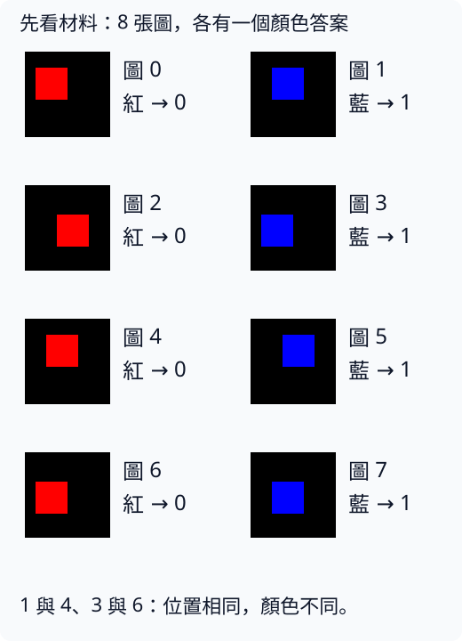
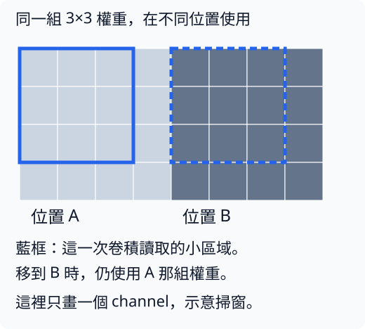
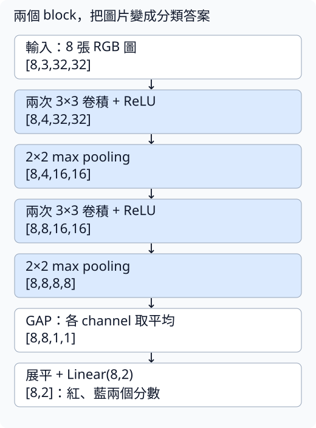
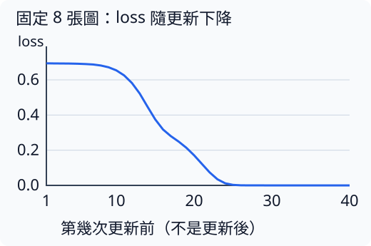
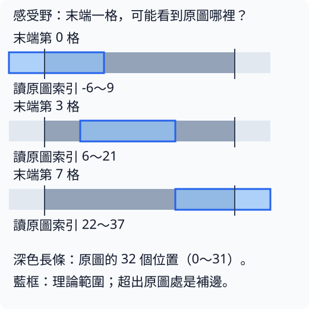

# 1 VGG 風格小 CNN：讓局部圖樣重複使用

[在 Colab 執行本節](https://colab.research.google.com/github/birdhackor/learn_to_yolo/blob/lessons-v0.5.0/notebooks/01-small-cnn.ipynb){ .md-button }

上一節讓一個權重學會把 2 變成 4。現在換成圖片：**看到紅矩形，回答 0；看到藍矩形，回答 1。** 我們要做的 CNN（卷積神經網路）怎麼讀圖？為什麼同一套權重能用在不同位置？這是本節的主要問題。

先看完整的 8 張材料。每張是 32×32 的黑底圖，矩形都是 12×12，只改顏色與位置。圖號用來辨認圖片，類別編號才是模型要學的答案。



注意圖 1 和圖 4：矩形位置相同，答案卻不同。圖 3 和圖 6 也是如此。因此只記住「矩形在哪裡」不可能把 8 張全答對；模型需要利用顏色。這個安排是為了看懂小實驗，還不是對真實圖片的能力測試。

本節借用 VGG 的設計習慣：堆疊小的 3×3 卷積，中間逐步縮小高寬。模型只有四層卷積，不是完整 VGG16。先走完讀圖與一次更新，再看兩個 CPU 實驗：3 步確認流程，40 步檢查是否能分對這批圖。

## 圖片與答案怎麼存

RGB 圖可以看成三張疊在一起的數值表：紅、綠、藍各一張。每一張叫一個 **channel（通道）**。本節顏色數值介於 0 和 1；黑色是 `[0,0,0]`，純紅是 `[1,0,0]`，純藍是 `[0,0,1]`。

8 張圖片合成一個 **batch（一批）**，PyTorch 卷積接收的形狀是 `[8,3,32,32]`：

|軸編號|放什麼|本例長度|
|---|---|---|
|0|圖片|8|
|1|channel：R、G、B|3|
|2|高：列|32|
|3|寬：欄|32|

這個順序叫 **NCHW**：N 張圖、C 個 channel、高 H、寬 W。後文有時以 B 表示 batch 大小，意思和 N 相同。圖片用 `float32`，也就是 32 位元浮點數；答案則是 8 個整數 `[0,1,0,1,0,1,0,1]`，用 PyTorch 的 `long` 型別存。

模型最後會給每張圖兩個分數，順序固定為「紅、藍」，整批輸出形狀是 `[8,2]`。這些還沒轉成機率的分數叫 **logits**。取分數較大的位置，就是預測類別；這個動作叫 `argmax`。例如 `[2,1]` 的答案是 0。

訓練時把 logits 和正確類別交給 `cross_entropy`（交叉熵）。它衡量模型有多不相信正確答案：正確類別的機率越高，loss 越小。**直接交入 logits**，不用先做 softmax。這次先抓住這個用途，完整公式放在頁尾選讀。

## 卷積為什麼能重複使用權重

暖身節的 `Linear` 是全連線層：每個輸出讀取全部輸入，對不同位置使用不同權重。卷積（convolution）先看一小塊鄰近區域，再用**同一套權重**去看下一塊。這套權重叫 **filter（濾鏡）**，也常叫 kernel（卷積核）。



上圖只畫一個 channel，幫你看掃窗的位置。實際 RGB 輸入有三個 channel：一個濾鏡同時讀 R、G、B 各一個 3×3 小塊，共 27 個值。把它們分別乘權重、相加，再加一個 bias，就得到這個位置的一個輸出數值。

第一層用 4 個不同濾鏡，產生 4 個輸出 channel。每個濾鏡只要 27 個權重與 1 個 bias，所以共有 `4×(27+1)=112` 個參數。即使掃過整張圖，也不增加權重數。輸出的 channel 是訓練出來的特徵，不再固定代表紅、綠、藍。

若用全連線層把 3072 個圖片數值變成同樣多的輸出（`4×32×32=4096`），光權重就要 `3072×4096`，約 1258 萬個。卷積省參數的原因是**局部連接加上權重共用**，不是圖片比較小。

## 小 CNN 怎麼把圖片變成答案

本節的 **block** 是「兩次卷積接 ReLU，再一次 pooling」。兩個 block 串起來叫 **backbone（提取特徵的主幹）**；最後把特徵變成類別分數的部分叫 **head**。



沿著圖往下走，先注意兩件事：channel 從 3 變成 4、8；高寬從 32 變成 16、8。下面逐步說明各操作負責什麼。

### ReLU：讓多層不只是在做乘加

ReLU 把負值變 0，正值保留：\(\mathrm{ReLU}(x)=\max(0,x)\)。例如 `[-2,3]` 變成 `[0,3]`。

如果每層都只做乘權重再加總，多層合起來仍是乘加。像 `2x+1` 的結果再乘 3、減 2，還是 `6x+1`。中間加入 ReLU，多層才能表示這類單次乘加做不到的變化；這叫加入**非線性**。

### Pooling：讓後面的層少看一些位置

2×2 **max pooling（最大池化）**把每個 2×2 小塊縮成一個數：只留下最大值。例如 `1、3、2、0` 留下 3。視窗每次移 2 格，叫 **stride（步幅）2**，所以高寬都減半。

卷積則每次移 1 格，用 3×3 視窗。本例在四周補一圈 0，叫 **padding（填充）1**，讓卷積前後的高寬不變。於是「兩次卷積 → pooling」把 `[8,3,32,32]` 變成 `[8,4,16,16]`；第二個 block 再變成 `[8,8,8,8]`。

多層堆疊也讓一個特徵讀到更大的原圖區域。這個可能影響它的範圍叫 **感受野（receptive field）**。最後 8×8 特徵圖的一格，理論感受野是 16×16；靠邊的格子有部分範圍超出原圖。先記住「較深的特徵能結合較大範圍」，尺寸與邊界手算放在選讀區。

### GAP：這次只回答顏色，先收起位置

**全域平均池化（global average pooling，GAP）**把每個 channel 的 8×8 共 64 個數平均成一個。若兩個位置的值是 2、6，平均是 4；交換它們，平均還是 4。平均這一步本身不保留「哪個值在哪裡」。

本節只要回答紅或藍，位置不是答案的一部分，所以先用 GAP 得到每圖 8 個特徵，再由 `Linear(8,2)` 變成兩個分數。這個 head 只有 `8×2+2=18` 個參數；若直接攤平 8×8×8 個值，要 1026 個。

省下的代價是空間資訊被收起來。要回答「物件在哪裡」，我們就得重新保留它；[第 4 章](04-localization.md)會處理這個問題。

## 對照程式，再做一次更新

下面是完整程式裡的模型定義，和 `lesson_cases/01-small-cnn.py` 相同（完整程式開頭有 `import torch` 與 `from torch import nn`）。參數 `width` 是模型的寬度，指 channel 數，不是圖片的寬 W：`SmallCNN(width=4)` 讓第一個 block 有 4 個 channel，第二個 block 有 8 個。程式裡只加了中文註解，標出 batch 8、width 用預設 4 時各層的輸出 shape。

``` { .python data-excerpt="lesson_cases/01-small-cnn.py" }
class SmallCNN(nn.Module):
    def __init__(self, width=4):
        super().__init__()
        self.features = nn.Sequential(
            # 第 1 層卷積：3 → 4 個 channel，輸出 [8,4,32,32]
            nn.Conv2d(3, width, 3, padding=1), nn.ReLU(),
            # 第 2 層卷積：4 → 4，輸出 [8,4,32,32]；pooling 後 [8,4,16,16]
            nn.Conv2d(width, width, 3, padding=1), nn.ReLU(), nn.MaxPool2d(2),
            # 第 3 層卷積：4 → 8，輸出 [8,8,16,16]
            nn.Conv2d(width, width * 2, 3, padding=1), nn.ReLU(),
            # 第 4 層卷積：8 → 8，輸出 [8,8,16,16]；pooling 後 [8,8,8,8]
            nn.Conv2d(width * 2, width * 2, 3, padding=1), nn.ReLU(), nn.MaxPool2d(2),
        )
        self.pool = nn.AdaptiveAvgPool2d(1)  # GAP：[8,8,8,8] → [8,8,1,1]
        self.head = nn.Linear(width * 2, 2)  # 線性層：8 個輸入 → 2 個類別分數

    def forward(self, x):
        return self.head(self.pool(self.features(x)).flatten(1))  # [8,2] logits
```

本節的 `width` 指 channel 的寬度，不是圖片寬度：預設 4，所以兩個 block 分別有 4、8 個 channel。`nn.Sequential` 依順序執行各層；`forward` 就是上圖的路線。`flatten(1)` 把 GAP 的 `[8,8,1,1]` 變成 `[8,8]`，保留第 0 軸的 8 張圖片。

建立模型與 optimizer，再訓練一步。下面這段是為了說明而改寫的示意，不是完整程式的原文。在 Colab 先執行過完整程式那一格（`SmallCNN`、`make_batch()` 才有定義），就能把它貼進新的程式格執行：

```python
images, labels = make_batch()  # 8 張圖與標籤
model = SmallCNN()  # width 用預設的 4
optimizer = torch.optim.SGD(model.parameters(), lr=0.1)  # SGD，學習率 0.1

optimizer.zero_grad(set_to_none=True)
features = model.features(images)                    # [8,8,8,8]
summary = model.pool(features).flatten(1)             # [8,8]
logits = model.head(summary)                          # [8,2]
loss = torch.nn.functional.cross_entropy(logits, labels)
loss.backward()
optimizer.step()
```

`features`、`summary`、`logits` 這三行是把 `forward` 拆開寫，好看出每段的 shape；三行合起來，就等於完整程式裡的 `logits = model(images)`。`flatten(1)` 從第 1 軸開始展平，把 `[8,8,1,1]` 變成 `[8,8]`。完整程式把訓練一步重複 3 次；每次印出的 loss 都是該次更新前算的，所以 step=0 的 loss 用的是初始權重。

模型合計 **1158 個參數**，每張圖的卷積與線性層約做 **479248 次乘加（MAC）**。這是計算量粗估，不包含 ReLU、pooling 與資料搬移，也不能直接換成執行秒數。手算表放在頁尾；先看更新後的結果。

## 三步後：流程能跑，還沒學會分類

完整程式固定 `torch.manual_seed(7)`，用 SGD、學習率 0.1，在這 8 張圖上更新三次。seed（亂數種子）固定隨機初始權重，讓重跑能從相同起點開始。這三次的 loss 都在各次更新前量：

```text
step=0, loss=0.6942
step=1, loss=0.6941
step=2, loss=0.6940
```

程式確認圖片形狀與數值、每層輸出、參數數量、首層梯度是有限值，並確認首層權重真的改變。這些表示一次訓練流程接通了。那模型答對了嗎？


**GT** 是正確答案（Ground Truth），**pred** 是模型預測。三步後 8 張圖全部猜 1，也就是藍色；紅圖 0、2、4、6 全錯。上圖呈現前四張。

一開始兩類分數很接近，類別 1 略高，機率約 0.52；三步小更新還不足以讓紅、藍分數分開。這提醒我們：**參數有更新，不等於分類已學好。** 圖上的圖片都是訓練用的資料，也不是獨立測試。

## 訓練 40 步：模型能學會這 8 張圖嗎 { #forty-steps }

接著用同一種模型、同樣 8 張圖、同一個 seed，**重新從初始權重開始**更新 40 次。這次使用 Adam、學習率 0.01。Adam 也是 optimizer，會利用過去的梯度調整更新。步數和 optimizer 同時改了，所以不能把差異只歸功於步數。

|觀察|結果|
|---|---|
|第 1 點 loss：還沒更新|0.694159|
|第 40 點 loss：第 40 次更新前|0.000000|
|40 次更新後，這 8 張訓練圖的正確率|8/8 = 1.00|
|未參與訓練的資料|沒有評估|



看曲線：前 8 點幾乎持平，第 9～23 點明顯下降，後面貼近 0。最後預測是 `[0,1,0,1,0,1,0,1]`，全部答對。圖 1／4、圖 3／6 各自位置相同而顏色不同，模型能給出不同答案，因此結果利用了顏色差異；只看位置做不到這件事。

這次紀錄也確認梯度有限、每步梯度的整體長度非零，且訓練前後權重確實改變。它支持「模型能學會這 8 張圖」，**不支持「新圖也都能分對」**。要談泛化，就需要未參與訓練的資料。曲線中的 0 受到 float32 捨入影響，也不代表任意圖片都能完美分類。

三步與 40 步是兩次不同實驗：前一張錯誤圖板屬於三步；40 步全對是另一個結果。[40 步完整紀錄](https://github.com/birdhackor/learn_to_yolo/blob/main/artifacts/checks/curriculum/01-small-cnn-learning.json)提供每一步的數字。

## 自主練習與常見錯誤

常見錯誤：

- 軸的順序弄錯，分兩種情況。直接輸入 `[8,32,32,3]`：第一層卷積會把 32 當成 channel 數，立刻報錯，訊息裡有 `expected input[8, 32, 32, 3] to have 3 channels, but got 32 channels instead`；看到它，先查軸的順序：整批 `[N,H,W,C]` 要用 `permute(0,3,1,2)` 變成 `[N,C,H,W]`（括號裡的數字個數要等於軸數，單張圖用的 `permute(2,0,1)` 不能直接用在 4 軸的 tensor 上）。用 `reshape` 硬改成 `[8,3,32,32]`：形狀對了、不會報錯，但每個 channel 裡的數字已經錯亂。這時訓練若表現不好，最容易誤以為要調學習率；請先查軸，別先調學習率。
- 若 loss 報標籤越界（訊息類似 `IndexError: Target 2 is out of bounds.`：標籤裡出現 2，但模型只有類別 0、1），先確認類別 id 是 0／1。
- 把 softmax 後的機率再交給 `cross_entropy`。它內部還會再做一次 softmax，等於做了兩次。程式不會報錯，但兩類時機率被壓在約 0.27～0.73 之間，loss 最低只能到約 0.31，永遠降不到 0。例如 [0.9, 0.1] 再做一次 softmax，會變成約 [0.69, 0.31]。

自主練習（計算量延伸）：先讀下方選讀區〈手算參數、乘加與記憶體〉，再把完整程式的模型寬度從 4 改成 8，其餘的資料、三步訓練及 seed 都不變。要改的是完整程式裡建立模型的那一行：Colab 在「本節可修改的完整實驗」下面那一格，本機是 `lesson_cases/01-small-cnn.py`。把 `model = SmallCNN()` 改成 `model = SmallCNN(width=8)`。執行前，先用本節的公式手算：

- (a) 四層卷積與 head 各有幾個參數？總參數是多少，約是原本 1158 的幾倍？
- (b) 每張圖的乘加數是多少？

完整程式裡有一行斷言（assert）`assert params == 1158 and macs == 479248`，它還在核對寬度 4 的答案。只改寬度就執行，程式會先印出新的總參數與乘加數，接著在這行出現 AssertionError；這是預期中的錯誤。確認印出的數字和你的手算一致後，把斷言裡的 1158、479248 換成新的值，再執行一次，就能跑完三步訓練。不要刪掉斷言來讓錯誤消失。

??? note "參考答案"

    各層 channel 變成 8／16。

    (a) 四層卷積及 head 的參數依序是 224、584、1168、2320、34，合計 **4330**；參數約 3.74 倍，不是 2 倍。第 2～4 層卷積的輸入與輸出 channel 都加倍，參數約變 4 倍；第 1 層的輸入固定是 3 個顏色、head 的輸出固定是 2 類，都只約變 2 倍。大部分參數在第 2～4 層，所以合計接近 4 倍，但不到 4 倍。

    (b) MAC 依序是 221184、589824、294912、589824、32，合計 **1695776**。

    斷言要改成 `assert params == 4330 and macs == 1695776`。觀察錯誤圖板可以，但 3 步、單一 seed、8 張圖，不足以判定寬模型比較準。

## 選讀：手算與操作細節

到這裡，主要路線已走完。以下可在做練習、轉入真實圖檔或想核對公式時再讀。

??? note "手算參數、乘加與記憶體"

    先算參數。本例卷積有 bias、濾鏡的高與寬相等，每層參數數量是 \(C_{out}(C_{in}k^2+1)\)，其中 \(C_{in},C_{out}\) 是輸入／輸出 channel 數，k 是 kernel 邊長（濾鏡的高、寬）：每個輸出 channel 有一個濾鏡（\(C_{in}k^2\) 個權重），最後的 1 是它的 bias。第一層為 \(4(3\times9+1)=112\)。四層卷積依序是 112、148、296、584；head 是 `Linear(8,2)`，8×2 個權重加 2 個 bias，共 18，等於公式中 k=1 的情況。合計完整模型共 **1158** 個參數。注意：和暖身節不同，這裡的 Linear 有 bias。

    再算計算量。一次乘加（multiply–accumulate，縮寫 MAC）是「一個值乘權重、累加到答案」，不是把一次乘法和一次加法分別計成兩次；這裡也不把 bias 的加法列入 MAC。卷積的乘加數是輸出位置數×輸出 channel 數×每個輸出讀取的值數。第一層為 \(32\times32\times4\times(3\times9)=110592\)。其餘三層為 147456、73728、147456，線性層為 \(8\times2=16\)，相加得每張圖 **479248** 次乘加；整個 batch 8 張共 479248×8＝3833984 次。這個數只包含卷積與線性層，不含 ReLU、pooling 與資料搬移，所以它只是計算量的粗估，不能直接換算成執行時間。完整程式會算出 1158 與 479248 並印出，再用斷言（assert）核對。

    記憶體也可以估。第一層中間特徵 `[8,4,32,32]` 共 8×4×32×32＝32768 個數，float32 每個占 4 bytes，所以數值本身就需 131072 bytes＝128 KiB（1 KiB=1024 bytes）；訓練還需儲存更多中間結果、梯度與參數。

    更寬（width 更大）可以表達更多特徵，但相鄰卷積的輸入與輸出 channel 都增加時，成本常接近寬度的平方。原因是一層卷積的乘加數＝輸出高×輸出寬×\(C_{out}\)×\(C_{in}\)×\(k^2\)：\(C_{in}\)、\(C_{out}\) 都加倍，乘加數就變成 2×2＝4 倍。例如第 2 層從 4→4 channel 改成 8→8，乘加數從 147456 變成 589824。更早下取樣（像 pooling 這樣縮小高寬）可以省計算，同時可能抹去細小物件；這會在偵測任務變得關鍵。

??? note "輸出高寬的公式"

    卷積和 pooling 的單軸輸出長度，都可以用同一個式子算（高、寬各算一次）：

    \[
    \left\lfloor\frac{H+2p-k}{s}\right\rfloor+1
    \]

    其中 H 是輸入長度、p 是 padding、k 是視窗邊長（卷積就是 kernel 邊長）、s 是 stride。\(\lfloor x\rfloor\) 表示不超過 x 的最大整數，也就是高中課本的高斯符號 [x]。理由：補完後長度是 H+2p。視窗起點可以放在 0、s、2s、…，但視窗不能超出邊界，所以最後一個起點最多是 H+2p−k。從 0 到 H+2p−k、每隔 s 一個起點，共 \(\lfloor(H+2p-k)/s\rfloor+1\) 個；每個起點產生一個輸出。代入本節：卷積的 H=32、p=1、k=3、s=1，得 (32+2−3)/1+1＝32；pooling 的 H=32、p=0、k=s=2，得 ⌊30/2⌋+1＝16。

    ??? note "公式的適用條件"

        本節的卷積與 pooling 都是最基本的設定，所以能直接套用本節的公式：

        - 卷積的 dilation=1，也就是濾鏡的 3×3 格子彼此緊鄰。若改用膨脹卷積（dilation 大於 1，濾鏡的格子之間隔開取值），需改輸出長度的公式，不能直接套上面這一式。
        - pooling 使用預設 ceil_mode=False，算輸出長度時無條件捨去，就是上式的高斯符號。若改用向上取整的 pooling（ceil_mode=True），同樣要改公式。
        - 卷積使用 groups=1：channel 不分組，每個輸出 channel 都讀取全部的輸入 channel。後面的參數公式 \(C_{out}(C_{in}k^2+1)\) 以此為前提。

??? note "感受野怎麼從 1 長到 16，以及邊界怎麼回推"

    以下的「間距」指相鄰特徵位置在原圖上隔多少畫素，不是視窗大小。從原圖開始，感受野大小與間距都是 1。

    |經過的層|感受野大小|間距|
    |---|---|---|
    |第一個 3×3 卷積|3|1|
    |第二個 3×3 卷積|5|1|
    |第一個 2×2 pooling|6|2|
    |第三個 3×3 卷積|10|2|
    |第四個 3×3 卷積|14|2|
    |第二個 2×2 pooling|16|4|

    規則是：視窗邊長 k，每層讓範圍增加 `(k−1)×原本間距`；stride 2 再把間距加倍。例如第一個 pooling 把兩個相鄰、各看 5 格的特徵合起來；它們只錯開 1 格，總範圍是 6，不是 10。

    

    若要核對圖中的端點，可以反過來從最終第 0 格找它讀過哪些位置。每次 3×3 卷積向兩邊各擴 1 格；2×2 pooling 的第 j 格讀前一層第 2j、2j+1 格。表中端點都包含：

    |反推到哪裡|可能讀取的索引範圍|
    |---|---|
    |第二次 pooling 之前|0～1|
    |第四個卷積之前|−1～2|
    |第三個卷積之前|−2～3|
    |第一次 pooling 之前|−4～7|
    |第二個卷積之前|−5～8|
    |第一個卷積之前：原圖|−6～9|

    這是包含補邊位置的理論範圍；原圖只有 0～31，所以真正圖內的是 0～9，共 10 個畫素。最終第 i 格的範圍同理是 `4i−6` 到 `4i+9`；i=3 是 6～21，完全在原圖裡。高、寬各算一次，角落最多涉及 10×10 的原圖範圍，中央 4×4 格的 16×16 範圍則整個在圖內。這不表示每個畫素影響同樣強。

??? note "手算一次：濾鏡怎麼對邊緣起反應"

    為了好算，只看一種顏色、一個位置，也不加 bias。設濾鏡三列都是 \([-1,0,1]\)，視窗下的 3×3 小塊三列都是 \([0,0,1]\)：左邊暗、右邊亮。對應位置相乘再全部相加，每列是 \(0\times(-1)+0\times0+1\times1=1\)，三列共 3。若小塊全亮（9 格都是 1），每列是 \(-1+0+1=0\)，結果是 0。

    所以這個濾鏡遇到「左暗右亮」的邊緣，輸出才大；在一片同色的區域，輸出是 0。本節模型的濾鏡不是人工設計的，而是訓練時用梯度調整出來的權重。

    深度學習說的卷積就是這樣直接對應相乘，PyTorch 文件稱為 cross-correlation；數學課本的卷積會先把濾鏡上下左右翻轉。兩者只差在濾鏡方向，而權重是訓練出來的，所以不影響模型能學到什麼。

??? note "交叉熵怎麼讀兩類分數"

    softmax 把一張圖的兩個 logits \(z_0,z_1\) 換成機率：

    \[
    p_i=\frac{e^{z_i}}{e^{z_0}+e^{z_1}}\quad(i=0,1)
    \]

    兩個機率都在 0 與 1 之間，合計為 1；分數越大，機率越大。交叉熵取「正確類別 y 的機率」的負對數 \(-\ln p_y\)，再對 8 張圖平均。正確類別的機率越接近 1，loss 越接近 0；機率越小，loss 越大。兩類機率都是 0.5 時，loss 是 \(-\ln 0.5=\ln 2\approx0.693\)，這是兩類問題「完全沒概念、各猜一半」的水準。本節模型一開始給每張圖的兩類機率都約 0.5（類別 1 略高，約 0.52），所以頁尾執行紀錄裡 step=0 的 loss 0.6942 約等於 \(\ln 2\)：模型還在亂猜。預測類別時，取分數較大的那一類；這個操作叫 argmax（取最大值所在的位置）。

`permute(2,0,1)` 是重新排列軸，把 HWC 變成 CHW。程式給軸編號時從 0 數起，本書用阿拉伯數字寫軸的編號時也照這個數法：第 0 軸是最前面那一軸，第 1 軸是第二個軸。括號裡的三個數依序說明：新的第 0、1、2 軸，分別取舊的第 2 軸（顏色）、第 0 軸（高）、第 1 軸（寬）。`reshape` 不能代替它：`reshape` 只改容器形狀，數字的先後順序不變，可能把顏色與位置混在一起（見下方例子）。完整程式畫圖時要反過來把 CHW 變回 HWC，所以寫 `permute(1,2,0)`。

??? note "例子：1×2 的小圖，permute 和 reshape 差在哪"

    設一張圖只有 1 列、2 個畫素，HWC 的 shape 是 `[1,2,3]`。數字按順序排是 r1、g1、b1、r2、g2、b2：先放第 1 個畫素的三個顏色，再放第 2 個畫素的。

    - `permute(2,0,1)` 之後 shape 是 `[3,1,2]`，三個 channel 依序是 [r1,r2]、[g1,g2]、[b1,b2]：每個 channel 只裝同一種顏色。
    - `reshape(3,1,2)` 的 shape 也是 `[3,1,2]`，但它照原本的順序每 2 個切一段，得到 [r1,g1]、[b1,r2]、[g2,b2]：第一個「紅色 channel」裡混進了綠色。

    兩種做法 shape 相同，也都不會報錯，但 reshape 的內容已經錯了。

??? note "loss 為什麼剛好是 0，梯度卻不是 0"

    交叉熵 \(-\ln p_y\) 只有在正確類別的機率 \(p_y\) 等於 1 時才是 0。數學上（不計捨入），softmax 給的機率永遠小於 1；用 float32 算出來，卻可能被捨入成剛好 1。loss 會算出 0，也是 float32 的捨入造成的。

    關鍵是正確類別的分數遠大於另一類。用一個示意的數字：假設正確類別的分數比另一類大 20，錯誤類別的機率約 \(e^{-20}\approx2\times10^{-9}\)。把正確類別的分數記為 \(z_y\)，另一類就是 \(z_y-20\)。代入前面 softmax 的式子，分子、分母同除以 \(e^{z_y}\)，得到正確類別的機率與 loss：

    \[
    p_y=\frac{e^{z_y}}{e^{z_y}+e^{z_y-20}}=\frac{1}{1+e^{-20}},\qquad
    -\ln p_y=\ln\left(1+e^{-20}\right)\approx\ln\left(1+2\times10^{-9}\right)
    \]

    計算 loss 時會用到 \(1+2\times10^{-9}\) 這個數，但 float32 在 1 附近只分得出約 \(1.2\times10^{-7}\) 的差，它被捨入成 1；\(\ln 1=0\)，所以 loss 算出來就是 0。

    梯度則直接由錯誤類別的機率（約 \(2\times10^{-9}\)）算出來：把兩類的分數差記為 d（這裡 d＝20），\(-\ln p_y=\ln(1+e^{-d})\)，對 d 微分得 \(-e^{-d}/(1+e^{-d})\)，正好是錯誤類別機率的負值。這是未捨入的數學微分。PyTorch 實際對兩個 logits 反傳時，正確類那一項會因「機率減 1」的捨入成為 0，錯誤類那一項約為 `2.061×10⁻⁹`，仍存得下，所以整體梯度長度可以大於 0。因此 40 步實驗後段 loss 已是 0、梯度的 L2 長度仍大於 0，兩件事並不矛盾。

??? note "想自己重跑 40 步，或查看梯度數字"

    想自己重跑：先執行本節 Colab notebook 最上面準備環境的程式格（它會下載固定版本的課程程式、安裝指定版本的套件，並切換到程式目錄），再新增一個程式碼儲存格（code cell），貼上下面三行執行。notebook 裡〈本節可修改的完整實驗〉那一格的「可選：40 步學習實驗」也列了這三行。

    ```python
    !python scripts/run_learning_extensions.py --section 01-small-cnn
    from IPython.display import SVG, display
    display(SVG(filename='artifacts/runs/learning/01-small-cnn/learning.svg'))
    ```

    第一行開頭的 `!` 表示把這行當成終端機指令執行。這支腳本只把結果寫到 `artifacts/runs/learning/01-small-cnn/`，不會覆寫網站用的紀錄與圖：`report.json` 是完整結果（JSON 格式的文字檔），`learning.svg` 是 loss 曲線。JSON 是一種用純文字寫資料的格式，每一項依序寫欄位名稱、冒號與值，例如 `"seed": 7`。腳本執行時也會印出同樣的 JSON，只省略每一步的 loss。後兩行把這張曲線顯示在 notebook 裡。在本機則於專案根目錄執行 `python scripts/run_learning_extensions.py --section 01-small-cnn`（不加 `!`），再用瀏覽器打開 `artifacts/runs/learning/01-small-cnn/learning.svg`。對照上面的表：`models.cnn` 底下的 `initial_loss`、`last_pre_update_loss` 是表中箭頭兩邊的 loss，`train_accuracy`、`validation_accuracy` 是後兩欄，`predicted_classes` 是 40 次更新後的預測，`min_gradient_l2`、`max_gradient_l2` 是梯度 L2 長度的最小、最大值；`machine`、`code`、`dependencies_sha256` 記錄執行的電腦與程式版本，可以先略過。重跑得到的 loss 小數可能和紀錄略有不同，這是正常的。原始完整紀錄：[40 步結果](https://github.com/birdhackor/learn_to_yolo/blob/main/artifacts/checks/curriculum/01-small-cnn-learning.json)。


    每步梯度的 L2 長度，是所有參數梯度平方相加、再開根號。這 40 次的長度最小約 \(1.4\times10^{-18}\)，最大約 0.80。大於 0 表示有非零梯度；程式另比較訓練前後的參數，確認權重改變。梯度大小本身不代表分類好不好。

??? note "與原版 VGG 的關係"

    歷史機制：[VGG 原始論文](https://arxiv.org/abs/1409.1556) 研究堆疊小型 3×3 卷積的深層分類網路（VGG 取自作者所在的牛津大學研究團隊 Visual Geometry Group）。本節沿用它的幾條設計規則（3×3 卷積重複堆疊、2×2 的 max pooling、每次 pooling 後 channel 加倍，前文已說明；原版加倍到 512 為止），但縮得很小：只有兩組卷積（block，前文已說明），channel 數分別是 4 和 8；原版疊了很多層卷積（例如 VGG16 有 13 層卷積層，另有 3 層全連線層），本節只有 4 層卷積；原版末端是三層很大的全連線層（輸出 4096、4096、1000 個值），本節改成全域平均池化（global average pooling，GAP，前文已解釋）再接一層很小的線性層。GAP 不是標準 VGG 分類 head 的設計；以 GAP 取代大型分類全連線層的做法見 [Network in Network](https://arxiv.org/abs/1312.4400) 論文。它是教學用的 CNN，不是 VGG16 的重現；VGG16 是原論文中編號 D 的版本，有 16 個權重層（就是前面的 13＋3 層）。同一篇論文的 C 版也是 16 層，但其中 3 層卷積用 1×1，不是一般說的 VGG16。

<!-- curriculum-evidence:start -->

## 實際執行紀錄

本節的完整程式於 2026-10-05 在 INTEL(R) XEON(R) PLATINUM 8573C（2 個執行緒）上用 PyTorch 2.9.1+cpu 執行，程式裡的 assert 全部通過。下面是那次印出的原始輸出；輸出裡若有計時或訓練得到的數字，換一台電腦會略有不同。每個數字的意思，以本頁正文的說明為準。[完整紀錄（JSON）](https://github.com/birdhackor/learn_to_yolo/blob/main/artifacts/checks/curriculum/01-small-cnn.json)

??? example "展開本次實際輸出"

    ```text
    Conv2d: (8, 4, 32, 32)
    Conv2d: (8, 4, 32, 32)
    MaxPool2d: (8, 4, 16, 16)
    Conv2d: (8, 8, 16, 16)
    Conv2d: (8, 8, 16, 16)
    MaxPool2d: (8, 8, 8, 8)
    parameters=1158; multiply-accumulates/image=479248
    step=0, loss=0.6942
    step=1, loss=0.6941
    step=2, loss=0.6940
    predictions=[1, 1, 1, 1, 1, 1, 1, 1], labels=[0, 1, 0, 1, 0, 1, 0, 1], error_indices=[0, 2, 4, 6]
    Three-step smoke test only; accuracy here is not held-out performance.
    panel=artifacts/01-small-cnn.png
    ```

<!-- curriculum-evidence:end -->
