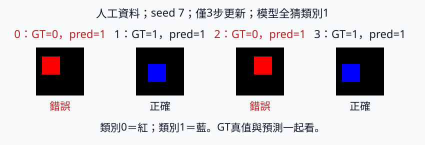
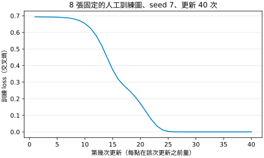

# 1 VGG 風格小 CNN：讓局部圖樣重複使用

[在 Colab 執行本節](https://colab.research.google.com/github/birdhackor/learn_to_yolo/blob/lessons-v0.4.0/notebooks/01-small-cnn.ipynb){ .md-button }

本節做一個很小的 CNN（卷積神經網路），分辨 32×32 的圖裡畫的是紅矩形還是藍矩形。讀完本節，你能說明卷積為什麼比全連線層省參數，能手算這個模型每層的輸出 shape、參數量與計算量，也能分辨「參數有更新」和「學會分類」是兩件事。前置只需[暖身節](00-warmup.md)的內容：知道 forward（把輸入算成輸出）、loss 和一次參數更新；不必先懂完整的 VGG。

一張 32×32 RGB 圖有 3072 個數值。全連線層（也叫線性層，就是暖身節的 `Linear`）的每個輸出都連到全部輸入，對不同輸入位置使用不同權重。卷積（convolution）則先看鄰近的小區域，並在不同位置重複使用同一套小權重；這套小權重叫濾鏡（filter），也常叫 kernel 或卷積核。因此「紅色邊緣出現在左邊或右邊」可以由同一個濾鏡處理。差別有多大？要從 3072 個輸入算出和第一層卷積一樣多的輸出（第一層卷積輸出 4 個 channel、每個 32×32，共 4×32×32＝4096 個數；channel 就是通道，下文說明），全連線層約需 3072×4096≈1258 萬個權重；第一層卷積只要 112 個參數（後面會算），因為每個輸出只讀鄰近的一小塊（R、G、B 各一個 3×3 區塊，共 27 個值），而且同一組權重在 32×32 個位置重複使用。

歷史機制：[VGG 原始論文](https://arxiv.org/abs/1409.1556) 研究堆疊小型 3×3 卷積的深層分類網路（VGG 取自作者所在的牛津大學研究團隊 Visual Geometry Group）。本節沿用它的幾條設計規則（3×3 卷積重複堆疊、2×2 的 max pooling、每次 pooling 後 channel 加倍，下文都會說明；原版加倍到 512 為止），但縮得很小：只有兩組卷積（block，下文說明），channel 數分別是 4 和 8；原版疊了很多層卷積（例如 VGG16 有 13 層卷積層，另有 3 層全連線層），本節只有 4 層卷積；原版末端是三層很大的全連線層（輸出 4096、4096、1000 個值），本節改成全域平均池化（global average pooling，GAP，下文解釋）再接一層很小的線性層。GAP 不是 VGG 的設計，出自 [Network in Network](https://arxiv.org/abs/1312.4400) 論文。它是教學用的 CNN，不是 VGG16 的重現；VGG16 是原論文中編號 D 的版本，有 16 個權重層（就是前面的 13＋3 層）。同一篇論文的 C 版也是 16 層，但其中 3 層卷積用 1×1，不是一般說的 VGG16。

可以用頁首的按鈕在 Colab 執行，或在本機執行 `PYTHONPATH=. python lesson_cases/01-small-cnn.py`。資料是程式畫的 8 張 32×32 圖，編號 0～7，每張在黑底上畫一個 12×12 的矩形：偶數號是紅色，奇數號是藍色。8 張合成一個 batch。本節做兩個實驗，都在 CPU 上執行：完整程式只訓練 3 步，目的是確認形狀正確、首層權重的梯度是有限值、這些權重確實有更新，不是訓練出可用的分類器；本頁後段的〈[訓練 40 步](#forty-steps)〉再用同樣的資料與模型更新 40 次，看模型能不能學會分這 8 張圖。

## 先約定圖片怎麼進模型

一般圖片陣列的軸順序是 HWC：高、寬、顏色。PyTorch 的卷積則使用 NCHW：batch、channel、高、寬；N 就是其他頁寫的 B（一個 batch 的圖片張數）。channel（通道）是圖的一層：每個位置在每個 channel 上各有一個數，channel 數就是同一個位置有幾個數。RGB 圖的 3 個 channel 就是 R、G、B 三層；卷積層的每個輸出 channel，是一個濾鏡算出的一張圖。本例 `images.shape=[8,3,32,32]`。dtype（資料型別）為 float32，也就是 32 位元浮點數，每個數占 4 bytes；RGB 值在 0 到 1。一般圖檔常用 uint8（0～255 的 8 位元整數）存顏色，應先轉成 float32（PyTorch 寫 `.float()`）再除 255：模型權重是 float32，輸入也要是 float32；轉成 64 位元的 float64 一樣會報型別不合的錯。

`permute(2,0,1)` 是重新排列軸，把 HWC 變成 CHW。程式給軸編號時從 0 數起，本書用阿拉伯數字寫軸的編號時也照這個數法：第 0 軸是最前面那一軸，第 1 軸是第二個軸；暖身節說的「第一軸」「第二軸」，換成這種寫法就是第 0 軸、第 1 軸。括號裡的三個數依序說明：新的第 0、1、2 軸，分別取舊的第 2 軸（顏色）、第 0 軸（高）、第 1 軸（寬）。`reshape` 不能代替它：`reshape` 只改容器形狀，數字的先後順序不變，可能把顏色與位置混在一起（見下方例子）。完整程式畫圖時要反過來把 CHW 變回 HWC，所以寫 `permute(1,2,0)`。

??? note "例子：1×2 的小圖，permute 和 reshape 差在哪"

    設一張圖只有 1 列、2 個畫素，HWC 的 shape 是 `[1,2,3]`。數字按順序排是 r1、g1、b1、r2、g2、b2：先放第 1 個畫素的三個顏色，再放第 2 個畫素的。

    - `permute(2,0,1)` 之後 shape 是 `[3,1,2]`，三個 channel 依序是 [r1,r2]、[g1,g2]、[b1,b2]：每個 channel 只裝同一種顏色。
    - `reshape(3,1,2)` 的 shape 也是 `[3,1,2]`，但它照原本的順序每 2 個切一段，得到 [r1,g1]、[b1,r2]、[g2,b2]：第一個「紅色 channel」裡混進了綠色。

    兩種做法 shape 相同，也都不會報錯，但 reshape 的內容已經錯了。

類別 0 是紅矩形、1 是藍矩形。標籤 shape `[8]`，dtype 是 long（64 位元整數）；`cross_entropy` 的類別標籤要用這種整數。分類 head（模型最後輸出答案的部分）輸出 `[8,2]` **logits**，也就是尚未轉成機率的分數：每張圖兩個數，依序是類別 0、類別 1 的分數。`cross_entropy` 計算交叉熵（cross entropy）；它接收 logits，內部處理 softmax。

softmax 把一張圖的兩個 logits \(z_0,z_1\) 換成機率：

\[
p_i=\frac{e^{z_i}}{e^{z_0}+e^{z_1}}\quad(i=0,1)
\]

兩個機率都在 0 與 1 之間，合計為 1；分數越大，機率越大。交叉熵取「正確類別 y 的機率」的負對數 \(-\ln p_y\)，再對 8 張圖平均。正確類別的機率越接近 1，loss 越接近 0；機率越小，loss 越大。兩類機率都是 0.5 時，loss 是 \(-\ln 0.5=\ln 2\approx0.693\)，這是兩類問題「完全沒概念、各猜一半」的水準。本節模型一開始給每張圖的兩類機率都約 0.5（類別 1 略高，約 0.52），所以頁尾執行紀錄裡 step=0 的 loss 0.6942 約等於 \(\ln 2\)：模型還在亂猜。預測類別時，取分數較大的那一類；這個操作叫 argmax（取最大值所在的位置）。

## 一個 block 做了什麼

Block 是一小組連續的層。本節的一個 block 是「兩次 Conv–ReLU（卷積接 ReLU），再一次 pooling（縮小高寬，下文說明）」。Backbone 是提取特徵的主幹，本節就是兩個 block 疊起來；head 是把特徵轉成任務答案的末端。本節的 head 是一個線性層（Linear），輸出兩個類別分數。

卷積層（程式裡的 `Conv2d`）用濾鏡讀取局部資料，乘權重並加總。濾鏡每次蓋住的那一小塊叫視窗；後面的 pooling 每次讀取的一小塊，也叫視窗。卷積的視窗從左上角開始，每次往右或往下移 1 格，每到一處算一次。kernel=3（程式裡的 `kernel_size`）指濾鏡的高、寬都是 3。一個輸出 channel 有一個濾鏡，共 \(C_{in}\times3\times3\) 個權重，\(C_{in}\) 是輸入的 channel 數。RGB 輸入時是 3×3×3＝27 個：一個輸出 channel 讀取 R、G、B 各一個 3×3 區塊，共 27 個值乘 27 個權重，再相加並加 bias；不是每次只處理一種顏色。每個輸出 channel 都有自己的濾鏡；channel 是不同的特徵表示，不一定對應某個顏色或物件。

??? note "手算一次：濾鏡怎麼對邊緣起反應"

    為了好算，只看一種顏色、一個位置，也不加 bias。設濾鏡三列都是 \([-1,0,1]\)，視窗下的 3×3 小塊三列都是 \([0,0,1]\)：左邊暗、右邊亮。對應位置相乘再全部相加，每列是 \(0\times(-1)+0\times0+1\times1=1\)，三列共 3。若小塊全亮（9 格都是 1），每列是 \(-1+0+1=0\)，結果是 0。

    所以這個濾鏡遇到「左暗右亮」的邊緣，輸出才大；在一片同色的區域，輸出是 0。本節模型的濾鏡不是人工設計的，而是訓練時用梯度調整出來的權重。

    深度學習說的卷積就是這樣直接對應相乘，PyTorch 文件稱為 cross-correlation；數學課本的卷積會先把濾鏡上下左右翻轉。兩者只差在濾鏡方向，而權重是訓練出來的，所以不影響模型能學到什麼。

ReLU 是 \(\mathrm{ReLU}(x)=\max(0,x)\)：把負值變成 0、正值不變，用來加入非線性。為什麼需要非線性？沒有 ReLU，兩層卷積疊起來仍然只是「乘權重再加總」，可以合併成一個線性運算。就像 \(f(x)=2x+1\)、\(g(x)=3x-2\) 合成後 \(g(f(x))=6x+1\)，仍是一次函數，疊再多層也一樣。中間夾著 ReLU，多層疊起來才能表達更複雜的圖樣。

2×2 max pooling（最大池化）以 stride 2 保留每區最大值，把高寬縮成一半。stride（步幅）是視窗每次移動幾格。2×2 的視窗每次移 2 格，等於把特徵圖（feature map：卷積層輸出的 `[C,H,W]` 數值，每個 channel 是一張 H×W 的圖）切成不重疊的 2×2 小塊，每塊只留最大值。例如小塊裡的四個值是 1、3、2、0，就只留下 3。所以 32×32 變成 16×16。前面卷積的視窗每次移 1 格，就是 stride=1。

padding（填充）是在輸入四周補值。本節卷積用 padding=1，在四周補一圈 0；配合 kernel=3、stride=1，讓 32×32 維持 32×32。

卷積和 pooling 的單軸輸出長度，都可以用同一個式子算（高、寬各算一次）：

\[
\left\lfloor\frac{H+2p-k}{s}\right\rfloor+1
\]

其中 H 是輸入長度、p 是 padding、k 是視窗邊長（卷積就是 kernel 邊長）、s 是 stride。\(\lfloor x\rfloor\) 表示不超過 x 的最大整數，也就是高中課本的高斯符號 [x]。理由：補完後長度是 H+2p。視窗起點可以放在 0、s、2s、…，但視窗不能超出邊界，所以最後一個起點最多是 H+2p−k。從 0 到 H+2p−k、每隔 s 一個起點，共 \(\lfloor(H+2p-k)/s\rfloor+1\) 個；每個起點產生一個輸出。代入本節：卷積的 H=32、p=1、k=3、s=1，得 (32+2−3)/1+1＝32；pooling 的 H=32、p=0、k=s=2，得 ⌊30/2⌋+1＝16。

??? note "公式的適用條件"

    本節的卷積與 pooling 都是最基本的設定，所以能直接套用本節的公式：

    - 卷積的 dilation=1，也就是濾鏡的 3×3 格子彼此緊鄰。若改用膨脹卷積（dilation 大於 1，濾鏡的格子之間隔開取值），需改輸出長度的公式，不能直接套上面這一式。
    - pooling 使用預設 ceil_mode=False，算輸出長度時無條件捨去，就是上式的高斯符號。若改用向上取整的 pooling（ceil_mode=True），同樣要改公式。
    - 卷積使用 groups=1：channel 不分組，每個輸出 channel 都讀取全部的輸入 channel。後面的參數公式 \(C_{out}(C_{in}k^2+1)\) 以此為前提。

| 位置 | Tensor shape | 空間意義 |
| --- | --- | --- |
| 輸入 | `[8,3,32,32]` | 原圖畫素 |
| 兩次 Conv–ReLU | `[8,4,32,32]` | 每點 4 個特徵 |
| 第一次 pooling | `[8,4,16,16]` | 更疏的空間網格 |
| 兩次 Conv–ReLU | `[8,8,16,16]` | 每點 8 個特徵 |
| 第二次 pooling | `[8,8,8,8]` | 共 64 個位置 |
| GAP | `[8,8,1,1]` | 每個 channel 只剩 1 個值 |
| 展平 `flatten(1)` | `[8,8]` | 每圖 8 個特徵 |
| 線性層（head） | `[8,2]` | 每圖一組類別分數 |

感受野（receptive field）是某個特徵可能受原圖多大範圍影響。高、寬各算一次，下面只看一個方向。規則是：每經過一層 k×k 的視窗，範圍增加 (k−1)×間距。間距是目前特徵圖的一格相當於原圖幾個畫素；每經過一層 stride 2 的層，間距就加倍。後面章節把這個間距叫特徵圖的 stride（見[術語表](../glossary.md)）。

代入本節：一開始一格就是一個畫素，範圍 1、間距 1。兩個 3×3 卷積各加 (3−1)×1＝2，範圍 1→3→5。第一次 pooling 的 2×2 視窗讀相鄰兩格；這兩格各看原圖 5 個畫素，彼此只錯開 1 個畫素，合起來是 5＋1＝6，不是加倍成 10。pooling 之後間距變 2，所以接下來兩個 3×3 卷積各加 (3−1)×2＝4，範圍 6→10→14。第二次 pooling 再加 (2−1)×2＝2，到 16，間距變 4。所以最後每一格理論上能看到 16×16 的範圍，比本例 12×12 的矩形還大。不過靠圖邊的格子，這個範圍有一部分落在 padding 補的 0 上，不在原圖裡：角落那格只看得到原圖 10×10；8×8 的 64 格中，只有中央 4×4 格的 16×16 整個落在原圖內：逐層往回推，最後某一列的第 i 格（i＝0～7）看的是原圖第 4i−6 到 4i+9 個畫素；i＝0 時只有 0～9 這 10 個在圖內，要整段落在 0～31 之內則需 2≤i≤5，每個方向只有 4 格。這是理論範圍，不表示其中每個畫素影響同樣強。VGG 論文就用這種算法說明為什麼堆疊 3×3：兩層 3×3 的範圍等於一層 5×5、三層等於 7×7，但參數比較少（channel 數都是 C 時，三層 3×3 共 \(27C^2\) 個權重，一層 7×7 要 \(49C^2\)），層與層之間還多了 ReLU。

全域平均池化（GAP）將每個 channel 的 8×8 共 64 個位置平均成一個值。例如同一個 channel 的兩個位置是 2、6，平均變 4；平均本身就沒有保留它們誰在左誰在右。程式裡的 `AdaptiveAvgPool2d(1)` 就是 GAP：它把每個 channel 縮成 1×1；接著展平（flatten），去除這兩個長度 1 的空間軸，再交給 head。

丟掉位置對本節有什麼影響？本節的類別是用顏色定義的（紅＝0、藍＝1），回答時不需要知道矩形在哪。資料也安排成只看位置無法把 8 張全部分對。紅、藍兩類各有 2 張矩形畫在較高的位置、2 張畫在較低的位置：較高的頂邊在第 6 列，較低的頂邊在第 11 列，低 5 個畫素（列和程式一樣從 0 數起）。所以只看矩形的上下位置，猜不出類別。另外，編號 1（藍）和 4（紅）的矩形位置完全相同、只差顏色，編號 3（藍）和 6（紅）也是。（編號 0～7 的矩形，頂邊列／左緣欄依序是 6/4、6/8、11/12、11/4、6/8、6/12、11/4、11/8，可以自己對照。）任何只看矩形在哪裡、不看顏色的判斷方法，對這樣一對圖必定給同一個答案，每一對都會錯一張，所以最多猜對 6 張；能把 8 張完全分開的線索只有顏色。完整程式的 `make_batch()` 用兩個斷言（assert）核對這份資料：每類矩形的頂邊都是 2 張在第 6 列、2 張在第 11 列，而且至少有一張紅圖和一張藍圖的矩形蓋住完全相同的畫素。

平均後 head 只要 8×2＋2＝18 個參數；若不平均、直接把 8×8×8＝512 個值展平，head 要 512×2＋2＝1026 個。代價是平均這一步本身分不出位置：要回答「物件在哪裡」時，不宜只靠 GAP 之後的特徵；第 4 章〈[單物件分類與定位](04-localization.md)〉會看到這點。

## 短程式與實際成本

下面是完整程式裡的模型定義，和 `lesson_cases/01-small-cnn.py` 相同（完整程式開頭有 `import torch` 與 `from torch import nn`）。參數 `width` 是模型的寬度，指 channel 數，不是圖片的寬 W：`SmallCNN(width=4)` 讓第一個 block 有 4 個 channel，第二個 block 有 8 個。程式裡只加了中文註解，標出 batch 8、width 用預設 4 時各層的輸出 shape。

``` { .python data-excerpt="lesson_cases/01-small-cnn.py" }
class SmallCNN(nn.Module):
    def __init__(self, width=4):
        super().__init__()
        self.features = nn.Sequential(
            # 第 1 層卷積：3 → 4 個 channel，輸出 [8,4,32,32]
            nn.Conv2d(3, width, 3, padding=1), nn.ReLU(),
            # 第 2 層卷積：4 → 4，輸出 [8,4,32,32]；pooling 後 [8,4,16,16]
            nn.Conv2d(width, width, 3, padding=1), nn.ReLU(), nn.MaxPool2d(2),
            # 第 3 層卷積：4 → 8，輸出 [8,8,16,16]
            nn.Conv2d(width, width * 2, 3, padding=1), nn.ReLU(),
            # 第 4 層卷積：8 → 8，輸出 [8,8,16,16]；pooling 後 [8,8,8,8]
            nn.Conv2d(width * 2, width * 2, 3, padding=1), nn.ReLU(), nn.MaxPool2d(2),
        )
        self.pool = nn.AdaptiveAvgPool2d(1)  # GAP：[8,8,8,8] → [8,8,1,1]
        self.head = nn.Linear(width * 2, 2)  # 線性層：8 個輸入 → 2 個類別分數

    def forward(self, x):
        return self.head(self.pool(self.features(x)).flatten(1))  # [8,2] logits
```

`nn.Conv2d(3, width, 3, padding=1)` 括號裡依序是輸入 channel 數、輸出 channel 數、kernel 邊長與 padding；沒寫 stride 時預設是 1，所以本節卷積的 s＝1。`nn.MaxPool2d(2)` 是 2×2 的視窗；沒有指定 stride 時，預設等於視窗大小，也就是 2。`nn.Sequential` 把各層依序串起來。`__init__` 建立這些層，`forward` 寫資料依序經過它們的路線；呼叫 `model(images)` 時，執行的就是 `forward`。`class SmallCNN(nn.Module)` 定義一種新的模型，括號裡的 `nn.Module` 表示它是一種 PyTorch 模型；`super().__init__()` 先讓 `nn.Module` 做好內部準備，之後才能掛上各層。`self` 指正在建立的這個模型：存成 `self.features`、`self.head` 這類屬性的層才算模型的一部分，`model.parameters()` 也才找得到它們的權重。

建立模型與 optimizer，再訓練一步。下面這段是為了說明而改寫的示意，不是完整程式的原文。在 Colab 先執行過完整程式那一格（`SmallCNN`、`make_batch()` 才有定義），就能把它貼進新的程式格執行：

```python
images, labels = make_batch()  # 8 張圖與標籤
model = SmallCNN()  # width 用預設的 4
optimizer = torch.optim.SGD(model.parameters(), lr=0.1)  # SGD，學習率 0.1

optimizer.zero_grad(set_to_none=True)
features = model.features(images)                    # [8,8,8,8]
summary = model.pool(features).flatten(1)             # [8,8]
logits = model.head(summary)                          # [8,2]
loss = torch.nn.functional.cross_entropy(logits, labels)
loss.backward()
optimizer.step()
```

`features`、`summary`、`logits` 這三行是把 `forward` 拆開寫，好看出每段的 shape；三行合起來，就等於完整程式裡的 `logits = model(images)`。`flatten(1)` 從第 1 軸開始展平，把 `[8,8,1,1]` 變成 `[8,8]`。完整程式把訓練一步重複 3 次；每次印出的 loss 都是該次更新前算的，所以 step=0 的 loss 用的是初始權重。

先算參數。本例卷積有 bias、濾鏡的高與寬相等，每層參數數量是 \(C_{out}(C_{in}k^2+1)\)，其中 \(C_{in},C_{out}\) 是輸入／輸出 channel 數，k 是 kernel 邊長（濾鏡的高、寬）：每個輸出 channel 有一個濾鏡（\(C_{in}k^2\) 個權重），最後的 1 是它的 bias。第一層為 \(4(3\times9+1)=112\)。四層卷積依序是 112、148、296、584；head 是 `Linear(8,2)`，8×2 個權重加 2 個 bias，共 18，等於公式中 k=1 的情況。合計完整模型共 **1158** 個參數。注意：和暖身節不同，這裡的 Linear 有 bias。

再算計算量。一次乘加（multiply–accumulate，縮寫 MAC）是「一個值乘權重、累加到答案」，不是把一次乘法和一次加法分別計成兩次；這裡也不把 bias 的加法列入 MAC。卷積的乘加數是輸出位置數×輸出 channel 數×每個輸出讀取的值數。第一層為 \(32\times32\times4\times(3\times9)=110592\)。其餘三層為 147456、73728、147456，線性層為 \(8\times2=16\)，相加得每張圖 **479248** 次乘加；整個 batch 8 張共 479248×8＝3833984 次。這個數只包含卷積與線性層，不含 ReLU、pooling 與資料搬移，所以它只是計算量的粗估，不能直接換算成執行時間。完整程式會算出 1158 與 479248 並印出，再用斷言（assert）核對。

記憶體也可以估。第一層中間特徵 `[8,4,32,32]` 共 8×4×32×32＝32768 個數，float32 每個占 4 bytes，所以數值本身就需 131072 bytes＝128 KiB（1 KiB=1024 bytes）；訓練還需儲存更多中間結果、梯度與參數。

更寬（width 更大）可以表達更多特徵，但相鄰卷積的輸入與輸出 channel 都增加時，成本常接近寬度的平方。原因是一層卷積的乘加數＝輸出高×輸出寬×\(C_{out}\)×\(C_{in}\)×\(k^2\)：\(C_{in}\)、\(C_{out}\) 都加倍，乘加數就變成 2×2＝4 倍。例如第 2 層從 4→4 channel 改成 8→8，乘加數從 147456 變成 589824。更早下取樣（像 pooling 這樣縮小高寬）可以省計算，同時可能抹去細小物件；這會在偵測任務變得關鍵。

## 核對與看錯誤

完整程式用 `make_batch()` 產生 8 張圖時就先核對資料：`make_batch()` 裡的兩個斷言檢查前面說的位置安排，接著確認 `images` 的 shape 是 `[8,3,32,32]`、dtype 是 float32、數值都在 0 到 1 之間。然後印出每層卷積與 pooling 的輸出 shape（共 6 行，對應表中第 2～5 列），再核對參數和乘加數。三步訓練的每一步都先清掉上一步的梯度，再算 loss 與更新；每一步也檢查首層權重的梯度是有限值（不是 NaN 這種算壞了的「非數字」，也不是無限大），最後確認首層權重確實改變。推論時使用 `model.eval()` 與 `torch.no_grad()`，對 `[8,2]` logits 每列用 `argmax(1)` 選類別：`argmax(1)` 沿第 1 軸（類別軸）找最大值的位置，所以每張圖得到 0 或 1。最後印出預測、標籤與 `error_indices`（分錯的圖的編號），並把圖板寫入 `artifacts/01-small-cnn.png`：紅色標題就是分類錯誤。輸出裡那行英文 `Three-step smoke test only; …` 是提醒：這只是確認流程能跑的三步檢查（smoke test），這裡的對錯不代表在獨立資料（held-out）上的表現；`panel=` 那行是圖板存檔的位置。圖板不會自動顯示：Colab 要新增一個程式格，執行 `from IPython.display import Image, display` 與 `display(Image(filename='artifacts/01-small-cnn.png'))`；本機則用看圖程式打開專案根目錄下的這個檔案。讀圖時先確認矩形顏色與 GT（正確標籤）一致，再看預測；若全部猜同一類，不能宣稱模型學會了。



頁尾的執行紀錄裡，三步後模型全猜類別 1，錯誤索引是 0、2、4、6。上圖按比例重畫圖板的前四張（編號 0～3）；GT 是真值，pred 是預測類別。為什麼全猜 1？初始權重是隨機的小數，每張圖又大多是黑底，8 張圖算到 GAP 時幾乎一樣；兩類分數的差主要來自 head 的 bias，本例類別 1 的 bias 比較大，所以每張圖的類別 1 機率都略高（約 0.52）。三步的小更新還不足以讓紅圖、藍圖的分數分開，argmax 便每張都選類別 1。這個失敗正提醒我們：參數更新成功與分類學好是兩件事。

這個結果是在亂數種子（seed）固定為 7 時得到的。seed 決定亂數從哪裡開始。本例圖片是程式固定畫的，seed 只影響模型的隨機初始權重：完整程式開頭用 `torch.manual_seed(7)` 把它固定為 7，每次重跑起點都一樣；換一個 seed 就換一組起點，結果可能不同。所以只跑一個 seed，分不出差異來自設定還是運氣。

此圖板使用**同一批訓練資料**，只是展示完整的推論流程。要判斷泛化（對沒看過的資料也做得好），需要獨立資料與較完整的訓練。不要把人工畫圖的簡單程度，當成真實圖片也容易的證據。

## 訓練 40 步：模型能學會這 8 張圖嗎 { #forty-steps }

三步只確認流程能跑；這個實驗看模型能不能真的學會。它由 `scripts/run_learning_extensions.py` 執行，直接取用完整程式裡的 `make_batch()` 與 `SmallCNN`：同樣 8 張圖、同一種模型，亂數種子同為 7，所以起點和三步實驗相同（重新開始，不是接著三步的結果繼續練），在 CPU 上更新 40 次。上面三步用 SGD（學習率 0.1），這裡改用 Adam（學習率 0.01）。Adam 也是一種 optimizer，會依每個參數過去梯度的大小，自動調整每一步走多遠。步數和 optimizer 同時改了，所以兩個實驗結果的差異，不能全歸功於步數。下表的第一個 loss 0.694159，就是三步實驗 step=0 的 0.6942。

|模型|loss：第 1 點（還沒更新）→ 第 40 點（第 40 次更新前）|訓練正確率（accuracy）|獨立驗證資料（validation）正確率|
|---|---|---|---|
|cnn|0.694159 → 0.000000|1.00|未評估|

這個實驗另存一份紀錄：[40 步結果](https://github.com/birdhackor/learn_to_yolo/blob/main/artifacts/checks/curriculum/01-small-cnn-learning.json)（JSON 檔，欄位怎麼對照見下方「想自己重跑」那段），cnn 是本節模型在裡面的名稱。正確率是預測類別等於正確標籤的比例，在 40 次更新全部做完後量：1.00 表示 8 張訓練圖全對。沒有另外準備不參與訓練的驗證圖，所以最後一欄是「未評估」，這份紀錄裡的 `validation_accuracy` 是 `null`（沒有值）。



讀圖：每一點都在該次更新之前量，所以第 1 點是還沒更新時的 loss，第 40 點是第 40 次更新之前的值；縱軸的訓練 loss 是這 8 張圖交叉熵的平均。前 8 點幾乎持平，第 9～23 點快速下降，之後貼著 0。圖上分不出「極小」和「剛好是 0」；這份 40 步紀錄的 `loss_history`（每一點的 loss）裡，從第 31 點起 loss 剛好是 0（原因見下方摺疊說明）。40 次更新全部做完後的預測不在曲線上，另外評估，見下方。

`run_learning_extensions.py` 每次更新前還會檢查梯度：把 1158 個參數的梯度排成一個長向量，算它的長度，稱為 L2 長度。這就是高中向量長度 \(\sqrt{x^2+y^2}\) 推廣到 1158 維：所有梯度平方相加，再開根號。L2 長度大於 0，表示至少有參數收到非零梯度。這 40 次的梯度都是有限值（不是 NaN 或無限大），L2 長度也都大於 0（最小約 \(1.4\times10^{-18}\)，最大約 0.80），權重確實改變。L2 長度只表示收到梯度；程式另外比較訓練前後的參數，確認 40 步整體有改變。梯度大小不代表學得好不好。曲線只評估固定的這批訓練圖；不能據此宣稱模型對真實圖片的泛化效果，也不能推論到更深的架構。

40 次更新後的預測為 `[0,1,0,1,0,1,0,1]`，這 8 張訓練圖全對。前面說過，編號 1 與 4、3 與 6 這兩對圖的矩形位置完全相同、只差顏色；模型對每一對都給了不同的答案，可見它的答案確實隨顏色改變，這是只看位置做不到的。最後的 loss 用 float32 算出來剛好是 0，不只是印成 0：正確類別的分數遠大於另一類，再加上 float32 的捨入（見下方摺疊說明）。這不表示任意新圖都能完美分類。前面那張錯誤圖板是三步實驗的結果；這裡的全對是 40 步實驗的結果，兩者要分開看。

??? note "loss 為什麼剛好是 0，梯度卻不是 0"

    交叉熵 \(-\ln p_y\) 只有在正確類別的機率 \(p_y\) 等於 1 時才是 0。數學上（不計捨入），softmax 給的機率永遠小於 1；用 float32 算出來，卻可能被捨入成剛好 1。loss 會算出 0，也是 float32 的捨入造成的。

    關鍵是正確類別的分數遠大於另一類。用一個示意的數字：假設正確類別的分數比另一類大 20，錯誤類別的機率約 \(e^{-20}\approx2\times10^{-9}\)。把正確類別的分數記為 \(z_y\)，另一類就是 \(z_y-20\)。代入前面 softmax 的式子，分子、分母同除以 \(e^{z_y}\)，得到正確類別的機率與 loss：

    \[
    p_y=\frac{e^{z_y}}{e^{z_y}+e^{z_y-20}}=\frac{1}{1+e^{-20}},\qquad
    -\ln p_y=\ln\left(1+e^{-20}\right)\approx\ln\left(1+2\times10^{-9}\right)
    \]

    計算 loss 時會用到 \(1+2\times10^{-9}\) 這個數，但 float32 在 1 附近只分得出約 \(1.2\times10^{-7}\) 的差，它被捨入成 1；\(\ln 1=0\)，所以 loss 算出來就是 0。

    梯度則直接由錯誤類別的機率（約 \(2\times10^{-9}\)）算出來：把兩類的分數差記為 d（這裡 d＝20），\(-\ln p_y=\ln(1+e^{-d})\)，對 d 微分得 \(-e^{-d}/(1+e^{-d})\)，正好是錯誤類別機率的負值。這個數不必和 1 相加，float32 存得下，所以梯度極小但不為 0。因此 40 步實驗後段 loss 已是 0、梯度的 L2 長度仍大於 0，兩件事並不矛盾。

想自己重跑：先執行本節 Colab notebook 最上面準備環境的程式格（它會下載固定版本的課程程式、安裝指定版本的套件，並切換到程式目錄），再新增一個程式碼儲存格（code cell），貼上下面三行執行。notebook 裡〈本節可修改的完整實驗〉那一格的「可選：40 步學習實驗」也列了這三行。

```python
!python scripts/run_learning_extensions.py --section 01-small-cnn
from IPython.display import SVG, display
display(SVG(filename='artifacts/runs/learning/01-small-cnn/learning.svg'))
```

第一行開頭的 `!` 表示把這行當成終端機指令執行。這支腳本只把結果寫到 `artifacts/runs/learning/01-small-cnn/`，不會覆寫網站用的紀錄與圖：`report.json` 是完整結果（JSON 格式的文字檔），`learning.svg` 是 loss 曲線。JSON 是一種用純文字寫資料的格式，每一項依序寫欄位名稱、冒號與值，例如 `"seed": 7`。腳本執行時也會印出同樣的 JSON，只省略每一步的 loss。後兩行把這張曲線顯示在 notebook 裡。在本機則於專案根目錄執行 `python scripts/run_learning_extensions.py --section 01-small-cnn`（不加 `!`），再用瀏覽器打開 `artifacts/runs/learning/01-small-cnn/learning.svg`。對照上面的表：`models.cnn` 底下的 `initial_loss`、`last_pre_update_loss` 是表中箭頭兩邊的 loss，`train_accuracy`、`validation_accuracy` 是後兩欄，`predicted_classes` 是 40 次更新後的預測，`min_gradient_l2`、`max_gradient_l2` 是梯度 L2 長度的最小、最大值；`machine`、`code`、`dependencies_sha256` 記錄執行的電腦與程式版本，可以先略過。重跑得到的 loss 小數可能和紀錄略有不同，這是正常的。原始完整紀錄：[40 步結果](https://github.com/birdhackor/learn_to_yolo/blob/main/artifacts/checks/curriculum/01-small-cnn-learning.json)。

## 常見錯誤、自主練習與答案

常見錯誤：

- 軸的順序弄錯，分兩種情況。直接輸入 `[8,32,32,3]`：第一層卷積會把 32 當成 channel 數，立刻報錯，訊息裡有 `expected input[8, 32, 32, 3] to have 3 channels, but got 32 channels instead`；看到它，先查軸的順序：整批 `[N,H,W,C]` 要用 `permute(0,3,1,2)` 變成 `[N,C,H,W]`（括號裡的數字個數要等於軸數，單張圖用的 `permute(2,0,1)` 不能直接用在 4 軸的 tensor 上）。用 `reshape` 硬改成 `[8,3,32,32]`：形狀對了、不會報錯，但每個 channel 裡的數字已經錯亂。這時訓練若表現不好，最容易誤以為要調學習率；請先查軸，別先調學習率。
- 若 loss 報標籤越界（訊息類似 `IndexError: Target 2 is out of bounds.`：標籤裡出現 2，但模型只有類別 0、1），先確認類別 id 是 0／1。
- 把 softmax 後的機率再交給 `cross_entropy`。它內部還會再做一次 softmax，等於做了兩次。程式不會報錯，但兩類時機率被壓在約 0.27～0.73 之間，loss 最低只能到約 0.31，永遠降不到 0。例如 [0.9, 0.1] 再做一次 softmax，會變成約 [0.69, 0.31]。

自主練習：把完整程式的模型寬度從 4 改成 8，其餘的資料、三步訓練及 seed 都不變。要改的是完整程式裡建立模型的那一行：Colab 在「本節可修改的完整實驗」下面那一格，本機是 `lesson_cases/01-small-cnn.py`。把 `model = SmallCNN()` 改成 `model = SmallCNN(width=8)`。執行前，先用本節的公式手算：

- (a) 四層卷積與 head 各有幾個參數？總參數是多少，約是原本 1158 的幾倍？
- (b) 每張圖的乘加數是多少？

完整程式裡有一行斷言（assert）`assert params == 1158 and macs == 479248`，它還在核對寬度 4 的答案。只改寬度就執行，程式會先印出新的總參數與乘加數，接著在這行出現 AssertionError；這是預期中的錯誤。確認印出的數字和你的手算一致後，把斷言裡的 1158、479248 換成新的值，再執行一次，就能跑完三步訓練。不要刪掉斷言來讓錯誤消失。

??? note "參考答案"

    各層 channel 變成 8／16。

    (a) 四層卷積及 head 的參數依序是 224、584、1168、2320、34，合計 **4330**；參數約 3.74 倍，不是 2 倍。第 2～4 層卷積的輸入與輸出 channel 都加倍，參數約變 4 倍；第 1 層的輸入固定是 3 個顏色、head 的輸出固定是 2 類，都只約變 2 倍。大部分參數在第 2～4 層，所以合計接近 4 倍，但不到 4 倍。

    (b) MAC 依序是 221184、589824、294912、589824、32，合計 **1695776**。

    斷言要改成 `assert params == 4330 and macs == 1695776`。觀察錯誤圖板可以，但 3 步、單一 seed、8 張圖，不足以判定寬模型比較準。

<!-- curriculum-evidence:start -->

## 實際執行紀錄

本節的完整程式於 2026-10-05 在 INTEL(R) XEON(R) PLATINUM 8573C（2 個執行緒）上用 PyTorch 2.9.1+cpu 執行，程式裡的 assert 全部通過。下面是那次印出的原始輸出；輸出裡若有計時或訓練得到的數字，換一台電腦會略有不同。每個數字的意思，以本頁正文的說明為準。[完整紀錄（JSON）](https://github.com/birdhackor/learn_to_yolo/blob/main/artifacts/checks/curriculum/01-small-cnn.json)

??? example "展開本次實際輸出"

    ```text
    Conv2d: (8, 4, 32, 32)
    Conv2d: (8, 4, 32, 32)
    MaxPool2d: (8, 4, 16, 16)
    Conv2d: (8, 8, 16, 16)
    Conv2d: (8, 8, 16, 16)
    MaxPool2d: (8, 8, 8, 8)
    parameters=1158; multiply-accumulates/image=479248
    step=0, loss=0.6942
    step=1, loss=0.6941
    step=2, loss=0.6940
    predictions=[1, 1, 1, 1, 1, 1, 1, 1], labels=[0, 1, 0, 1, 0, 1, 0, 1], error_indices=[0, 2, 4, 6]
    Three-step smoke test only; accuracy here is not held-out performance.
    panel=artifacts/01-small-cnn.png
    ```

<!-- curriculum-evidence:end -->
