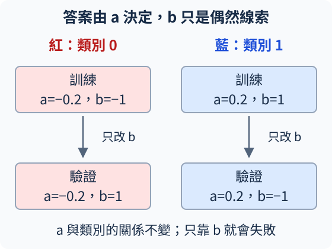

# A.2 訓練診斷：有更新、學會舊題、答對新題是三件事

<details class="chapter-a-toc">
<summary>本頁目錄</summary>
<ul>
<li><a href="#loss">故障一：loss 算得出來，前面的層卻收不到梯度</a></li>
<li><a href="#2">故障二：兩類模型收到類別 2</a></li>
<li><a href="#_1">評估新題之前，先把資料的工作分開</a></li>
<li><a href="#_2">故障三：參數有學，卻學了靠不住的線索</a></li>
<li><a href="#cnn">回到 CNN：下一步該查什麼</a></li>
<li><a href="#_3">停一下：別把三種問題混成一種</a></li>
<li><a href="#_4">實際執行紀錄</a></li>
</ul>
</details>

[在 Colab 執行本節](https://colab.research.google.com/github/birdhackor/learn_to_yolo/blob/lessons-v0.6.1/notebooks/02-diagnostics.ipynb){ .md-button }

[A.1](01-small-cnn.md)的 CNN 跑了三步，權重有變，卻仍答錯一半；另一個 40 步實驗能把訓練圖全答對。我們接著問：**怎麼判斷模型卡在哪裡，哪些結果才支持它學會了？**

先把檢查順序排好：資料與答案是否正確 → loss 能否把梯度送到該學的參數 → 參數是否真的更新 → 能否學會少量訓練題 → 未參與訓練的新題是否也會。順序有用，因為前面的錯誤會讓後面的成績難以解讀。

本節用兩個數字作輸入，省下看圖的複雜度，刻意安排三個故障：梯度被截斷、類別編號不合法、學到了偶然線索。每個例子都能單獨指出「哪一段出了問題」。

## 故障一：loss 算得出來，前面的層卻收不到梯度

先把兩個線性層接起來。`body` 是前面的特徵處理，讀 2 個數、輸出 3 個數；`head` 是最後的分類部分，把 3 個數轉成紅／藍兩個 logits。兩層都交給 SGD，學習率 0.2。

``` { .python data-excerpt="lesson_cases/02-diagnostics.py" }
body, head = nn.Linear(2, 3), nn.Linear(3, 2)
optimizer = torch.optim.SGD(list(body.parameters()) + list(head.parameters()), lr=0.2)
x, labels = torch.tensor([[-0.2, -1.0], [0.2, 1.0]]), torch.tensor([0, 1])
optimizer.zero_grad(set_to_none=True)
loss = nn.functional.cross_entropy(head(body(x).detach()), labels)
loss.backward()
```

問題在 `detach()`。PyTorch 會記錄哪些運算接到哪些參數，形成**計算圖**，讓反向傳播有路可走；`detach()` 保留目前數值，但切斷之前的求導連接。這次 head 仍能算分數與 loss，梯度卻回不到 body。

| 路線 | body 的權重梯度 | head 的權重梯度 |
| --- | --- | --- |
| `body(x).detach()` 再送 head | `None` | 有值 |
| `body(x)` 直接送 head | 有值 | 有值 |

`None` 表示這次沒有算出這個參數的梯度，與「算到了但數值恰好為 0」不同。若 body 本來就刻意凍結，這可能是設計；但這次兩層都應該學，就違反了預期。

修正時拿掉預測路上的 detach，然後檢查更新前後的權重：

``` { .python data-excerpt="lesson_cases/02-diagnostics.py" }
optimizer.zero_grad(set_to_none=True)
before = body.weight.detach().clone()
loss = nn.functional.cross_entropy(head(body(x)), labels)
loss.backward()
assert body.weight.grad is not None and body.weight.grad.abs().sum() > 0
optimizer.step()
assert not torch.equal(before, body.weight)
```

這裡保存 `before` 的 detach 是合理的：它只是在計算路徑之外取一份數值紀錄，沒有截斷 loss。`clone()` 再複製一份獨立儲存，否則保存的參照可能跟著原權重一起變，失去比較意義。`assert` 用來確認預期成立，不是額外的學習步驟。

診斷要連看三件事：**loss 接到參數、梯度是有限值、step 後參數真的改變。**任何本來應該學習的層若收不到梯度（`None`），都值得檢查是否被截斷、未接到 loss 或設定有誤。某個參數在某一步梯度為 0 或很小，則不自動代表故障。

## 故障二：兩類模型收到類別 2

A.1 說過，兩個輸出欄位的編號是 0、1。本節刻意給 `[0,2]`：第一筆合法，第二筆沒有對應欄位。

``` { .python data-excerpt="lesson_cases/02-diagnostics.py" }
bad_labels = torch.tensor([0, 2])
valid_labels = ((bad_labels >= 0) & (bad_labels < 2)).all()
assert not valid_labels
```

`&` 讓每個答案同時符合「至少 0」和「小於 2」，`.all()` 再檢查每筆都成立。完整程式在呼叫 loss 前抓出問題，所以你會看到明確的檢查結果。

遇到這種情況，先核對資料的類別映射、圖片和答案是否配對、logits 是否 `[一批張數,類別數]`。把學習率調小，無法替類別 2 生出不存在的輸出欄位。

## 評估新題之前，先把資料的工作分開

**訓練資料（training data）**用來計算梯度並更新權重。**驗證資料（validation data）**不參與更新，用來看未練過的題目答得如何，也能協助選設定。**測試資料（test data）**則留到設定確定後評估成果，避免把選擇過程也算成獨立考試。

**泛化（generalization）**是在合理的新資料上仍能使用學到的規則。訓練題全對只是一個起點。若新資料與訓練資料重複，或同一影片的近乎相同畫面分到兩組，分數容易過度樂觀；切分必須對應你希望模型面對的新情境。

評估時這樣算：

``` { .python data-excerpt="lesson_cases/02-diagnostics.py" }
model.eval()
with torch.no_grad():
    train_loss = nn.functional.cross_entropy(model(train_x), train_y).item()
    val_loss = nn.functional.cross_entropy(model(validation_x), validation_y).item()
```

`eval()` 切換評估模式，`no_grad()` 停止記錄這段求導路徑；兩者用途不同。這個例子只有線性層，切模式不改它的公式，但這是後面評估其他網路時也會用的流程。兩組分數都用**同一次更新後的權重**計算，才能直接對照。

## 故障三：參數有學，卻學了靠不住的線索

把輸入的兩個數叫 a、b。a 的正負才決定答案：負是紅（0），正是藍（1）；b 是偶然出現的另一個線索，與正確答案沒有必然關係。

| 資料 | a：真正線索 | b：偶然線索 | 答案 |
| --- | --- | --- | --- |
| 訓練紅 | −0.2 | −1 | 0 |
| 訓練藍 | 0.2 | 1 | 1 |
| 驗證紅 | −0.2 | 1 | 0 |
| 驗證藍 | 0.2 | −1 | 1 |

訓練時兩個線索完全綁在一起，b 的數值幅度又大。驗證時只把 b 反過來，a 與答案的關係不變。可以想像訓練照片裡紅物件剛好都有同一種角落記號；換一批照片，記號就不可靠了。



本實驗用沒有 bias 的 `Linear(2,2)`，權重從 0 開始，SGD 學習率 0.2，更新 20 次。訓練與驗證各 8 筆，但各自只有兩種不同輸入、每種重複 4 次，所以不是 16 個多樣的獨立情境。

| 已完成更新次數 | 訓練 loss | 驗證 loss |
| --- | --- | --- |
| 1 | 0.5945 | 0.7937 |
| 10 | 0.2244 | 1.5204 |
| 20 | 0.1236 | 2.0153 |

最後訓練正確率 8/8，驗證 0/8。權重約為紅 `[-0.195,-0.975]`、藍 `[0.195,0.975]`。例如驗證紅 `[-0.2,1]`，藍分數約 $0.195(-0.2)+0.975(1)=0.936$，紅分數約 −0.936，因此猜錯成藍：**b 的影響壓過 a。**

在這個零初始化與完全綁定的資料安排下，模型沿兩個線索一起更新，最後依賴了會反轉的 b。這不是 optimizer 沒動，而是訓練材料沒有要求它分清「真正規則」與「偶然相關」。更多相同模式的資料，仍不能補上這個缺口。

這是刻意設計的**分布改變（distribution shift）**示範：兩組資料的線索關係不同。它讓我們清楚看見訓練題全對也可能失敗；一般任務若出現驗證變差，仍要查切分、資料差異與模型等因素，不能只憑一條曲線斷定原因。

## 回到 CNN：下一步該查什麼

把同一套順序用在 A.1：先看實際圖片與類別，接著確認梯度和更新，再讓模型試著學會極少量資料。這個**小資料擬合檢查**是為了找流程或最佳化問題，並不是最後成果；通過後才增加資料，觀察不參與更新的圖片。

如果資料與更新都沒錯，少量訓練題仍學不好，就回頭看學習率、網路結構與梯度傳遞。**梯度消失**指反向訊號經過多層後變得很小，前面的參數難以調整；但一次梯度小、loss 慢降，都不足以單獨確診。更深的網路也可能遇到其他最佳化困難。接下來 ResNet 會改變訊號通過網路的路徑，讓我們看一種有幫助的設計。

## 停一下：別把三種問題混成一種

1. body 的梯度是 None、head 有值，先改資料量還是先查連接？
2. 訓練 8/8、驗證 0/8，能宣稱模型完全沒有學嗎？
3. 在保存權重的 `before` 使用 detach，與在預測途中使用 detach，有何差別？

??? note "核對想法"

    1. 先查 body 到 loss 的連接，以及是否刻意凍結；增加資料不會接回被截斷的路徑。
    2. 它已學會訓練題的關係，但該關係不適用於這組驗證資料。要改善資料對真正線索的涵蓋，並重新評估。
    3. 前者只是取出紀錄，不改變預測到 loss 的路線；後者把梯度該經過的路切掉了。

??? note "選讀：為什麼 b 的權重剛好是 a 的五倍"

    訓練輸入總有 b=5a。在本例的線性模型裡，同一類別權重對 b 的梯度就是對 a 的五倍；兩者從 0 開始、使用相同 SGD 步長，因此一直保留這個比例。這是本例可核對的原因，不代表任意網路都必然挑數值較大的線索。

    可以另外生成 a 不變、b 有正有負的訓練題，讓「只看 b」不能答對全部，再用獨立資料評估。這是改變資料提供的證據，不只是重複原本兩題。

接著讀 [A.3.1：ResNet 的原樣捷徑](03-identity.md)。

<!-- curriculum-evidence:start -->

## 實際執行紀錄

本節的完整程式於 2026-10-07 在 AMD EPYC 9V74 80-Core Processor（2 個執行緒）上用 PyTorch 2.9.1+cpu 執行，程式裡的 assert 全部通過。下面是那次印出的原始輸出；輸出裡若有計時或訓練得到的數字，換一台電腦會略有不同。每個數字的意思，以本頁正文的說明為準。[完整紀錄（JSON）](https://github.com/birdhackor/learn_to_yolo/blob/main/artifacts/checks/curriculum/02-diagnostics.json)

??? example "展開本次實際輸出"

    ```text
    broken graph: body.weight.grad=None, head.weight.grad exists
    repaired graph: body gradient nonzero and body parameter changed
    label preflight: [0, 2] invalid for two classes; expected IDs 0 or 1
    step=0: train_loss=0.5945, validation_loss=0.7937
    step=9: train_loss=0.2244, validation_loss=1.5204
    step=19: train_loss=0.1236, validation_loss=2.0153
    train_accuracy=1.00; validation_accuracy=0.00
    learned weights=[[-0.19503173232078552, -0.9751587510108948], [0.19503173232078552, 0.9751587510108948]]
    Synthetic distribution shift demonstrates: tiny-set overfit is not generalization.
    ```

<!-- curriculum-evidence:end -->
