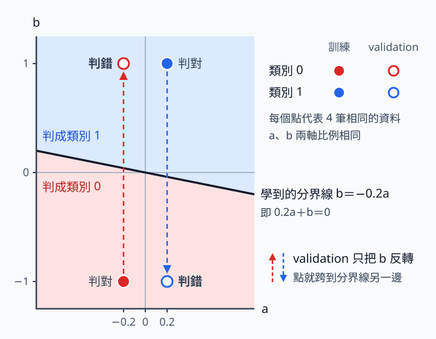

# 2 訓練診斷：loss 不降時，先查哪裡、再查哪裡

[在 Colab 執行本節](https://colab.research.google.com/github/birdhackor/learn_to_yolo/blob/lessons-v0.4.0/notebooks/02-diagnostics.ipynb){ .md-button }

「loss 不動」不是一個完整診斷。可能是標籤錯、梯度斷、沒有更新、學習率（learning rate，程式裡的 lr）不合適，也可能是資料太難。先查能直接核對的事項，比同時換 optimizer、模型與資料更容易找出原因。讀完本節，你會知道 loss 不降時依序該查哪四件事，也會看過三種刻意製造的失敗。前置是看得懂 tensor shape，知道 forward／backward／step 各做什麼；本節不需要記住 CNN 架構。

可以用頁首的按鈕在 Colab 執行，或在本機執行 `PYTHONPATH=. python lesson_cases/02-diagnostics.py`。CPU 小實驗有三個刻意製造的失敗：先是兩個程式錯誤（梯度被切斷、標籤越界），再用 8 筆人工資料（每筆只有兩個數字 a、b）訓練 20 步：訓練資料全對，刻意改過的 validation 卻全錯。它不是影像模型的效果測試，而是刻意安排的診斷案例。網頁上的程式只是片段；本節說的「完整程式」，就是 Colab 裡「本節可修改的完整實驗」下面那一格程式，內容和 `lesson_cases/02-diagnostics.py` 相同。

## 四個檢查步驟，各自回答不同問題

1. **一個 batch 的圖片與標籤：資料和標籤對嗎？** 標籤（label）是每筆資料的正確類別 id。畫出資料，核對類別、顏色、shape、dtype（數字的型別）、畫素範圍。本節的模型每筆輸出 2 個分數交給 cross entropy，label 要用整數型別 long（PyTorch 的 64 位元整數），類別從 0 編起：兩類就是 0 和 1，不是 1 和 2。換成別的 loss，規定可能不同：例如模型每筆只輸出 1 個分數、改用 `BCEWithLogitsLoss`（BCE＝binary cross entropy，二元交叉熵）時，label 要用浮點數（float）的 0.0／1.0，shape 也要和輸出相同：輸出是 `[B,1]` 時，label 也要是 `[B,1]`。之後做偵測還要把框畫出來檢查：沒有物件的圖能不能正常處理、框有沒有超出圖片邊界、圖片翻轉或縮放後框有沒有跟著移動。
2. **一次 forward／loss／backward／step：梯度有流到每個要學的參數、參數真的改了嗎？** logits 是尚未轉成機率的原始類別分數，shape `[B,C]`；label 的 shape 是 `[B]`；B 是 batch 筆數，C 是類別數。loss 和梯度都必須是有限數字（finite）：不能是 inf 或 -inf（正、負無限大），也不能是 NaN（Not a Number，例如 0/0 這種算不出的值）。完整程式在失敗三的訓練迴圈裡，每一步都用斷言（assert）檢查 `torch.isfinite(model.weight.grad).all()`，也就是梯度的每個數都有限。梯度一旦出現 NaN，step 會把 NaN 寫進參數，之後的訓練就無效了。每個預期要學的部分都至少挑一個參數，檢查三件事：grad 不是 None、不全為 0、step 後數值真的改變。失敗一的模型分成 body 和 head 兩段，兩段都要挑；只查一個參數，可能漏掉失敗一那種只有前半段沒在學的情況。
3. **少量資料 overfit：程式和模型背得下幾筆資料嗎？** 平常 overfit（過擬合：把訓練資料學到幾乎背起來，換新資料卻可能變差）是壞事，除錯時卻可以反過來用：程式正確、模型夠大時，通常背得下幾筆資料；背不下來，多半是程式或設定出錯。做法是刻意反覆訓練幾筆資料，讓模型充分擬合、記住它們，藉此檢查訓練管線（從資料到參數更新的整套程式）。失敗三的例子就做到 train accuracy 1.00，不只是 loss 小降一點。若仍失敗，優先查：
    - 監督（label／target 有沒有對上每筆輸入）
    - 容量（模型是不是太小）
    - 學習率（太大會亂跳或變成 NaN，太小幾乎不動）
    - 訓練路徑（每步是否都有 zero_grad→forward→loss→backward→step、有沒有被 detach、optimizer 拿到的是不是目前模型的參數）
4. **held-out 評估：學到的規律在沒看過的資料上成立嗎？** 在 held-out 資料上推論。held-out（獨立資料）是刻意保留、不參與參數更新的資料，validation 和 test 都屬於這類。`eval()` 切換成評估模式；`no_grad` 暫停記錄反傳所需的運算。反傳就是反向傳播（backward）：從 loss 往回算出各參數的梯度。validation 是用來監測、挑設定的驗證集，test 是留到最後的測試集。超參數（hyperparameter）是學習率、步數、模型寬度這類由人事先決定、不靠梯度學出的設定。不要用 test 反覆挑超參數：反覆看 test 成績挑設定，test 就間接參與了選擇，分數會偏樂觀，不再代表沒看過的資料。

前兩個檢查步驟只需要一小批資料，用 CPU 就能做完。在 GPU 上，label 越界常只報 device-side assert 這類看不出原因的訊息；而且出現這種錯誤後，同一個行程（正在執行的這支程式）就不能再用 GPU，連把資料搬回 CPU 都會再報同一個錯。這時要先重新啟動（Colab 是重新啟動工作階段），讓模型和那批資料一開始就放在 CPU 上，再重跑 forward 和 loss；CPU 會直接報出原因，例如失敗二的 `IndexError: Target 2 is out of bounds.`。更省事的做法，是訓練前先在 CPU 上用失敗二的方法檢查整份 label。不要先改一堆設定，卻沒有記錄哪一步讓問題消失。

下面三個失敗照完整程式的執行順序排列，不是照檢查順序；實際除錯仍從步驟 1 查起。

## 失敗一：反傳成功，前半模型卻沒有學（對應檢查步驟 2）

案例把模型拆成兩段：body（前半段，`Linear(2,3)`，把每筆 2 個數變成 3 個，角色類似第 1 章的 backbone）與 head（後半段，`Linear(3,2)`，再變成 2 個類別分數）。完整程式先故意寫錯一次，再用斷言確認錯誤真的發生。以下摘自完整程式，中文註解是本頁加的；`body`、`head`、`optimizer`、2 筆輸入 `x` 與標籤 `labels` 都在這段之前建立：

``` { .python data-excerpt="lesson_cases/02-diagnostics.py" }
optimizer.zero_grad(set_to_none=True)  # 先把梯度清成 None
# 錯在 .detach()：它讓梯度傳不回 body（nn 就是 torch.nn）
loss = nn.functional.cross_entropy(head(body(x).detach()), labels)
loss.backward()
# 故意寫錯的結果：body 沒有梯度，head 有
assert body.weight.grad is None and head.weight.grad is not None
print("broken graph: body.weight.grad=None, head.weight.grad exists")
```

`detach()` 保留數值，但把計算圖從這裡剪斷。計算圖是 forward 時 PyTorch 記下的紀錄：哪些數經過哪些運算得到 loss。反傳就沿著這份紀錄往回算梯度；紀錄被剪斷，梯度就傳不回 body，所以叫斷圖。上面的斷言確認的正是這個結果：head 收到了梯度，`body.weight.grad` 卻是 None。照這樣訓練下去，head 仍然可以學，整體 loss 甚至可能下降，body 卻一直不會更新。

`None` 和「有梯度但數值很小」不同：`None` 通常表示該參數沒有接進本次反傳，或本次沒用到。這個判斷要配合每步開頭的 `zero_grad(set_to_none=True)`：梯度先清成 None，backward 後仍是 None 的參數，就是這次沒接上的。若改用 `set_to_none=False`，曾有梯度的參數會被清成全 0，這時要改查梯度是否全為 0。

拿掉 detach 後，完整程式這樣確認 body 真的在學：檢查 body 的梯度不是 None 也不全為 0，並比較更新前後的副本。

``` { .python data-excerpt="lesson_cases/02-diagnostics.py" }
optimizer.zero_grad(set_to_none=True)
# 存更新前的副本：detach 剪離計算圖、clone 複製數字；這裡用 detach 沒錯
before = body.weight.detach().clone()
# 這次沒有 detach
loss = nn.functional.cross_entropy(head(body(x)), labels)
loss.backward()
# body 的梯度不是 None，而且不全為 0
assert body.weight.grad is not None and body.weight.grad.abs().sum() > 0
optimizer.step()
# 更新後 body 的權重真的變了
assert not torch.equal(before, body.weight)
print("repaired graph: body gradient nonzero and body parameter changed")
```

detach 本身沒有錯：存副本、記錄數值時就該用它，像上面的 `before`。錯在把要訓練的那一段從計算圖剪掉。

只看 loss 抓不到「模型有一部分參數根本沒在學」這種局部凍結（凍結：讓某些參數不更新）。但有時這是故意的：backbone 若已用大量資料訓練好（pretrained，預訓練），只想訓練 head，就會刻意凍結它，這時用 detach 切斷，或把它的參數設成不需要梯度（`requires_grad=False`），都是合理的做法。所以 grad 是 None 算不算錯，要看原本打不打算訓練那一段。本節模型從零訓練，body 應該要學。

## 失敗二：標籤格式錯了，卻去調學習率（對應檢查步驟 1）

兩類模型的 label 若是 `[0,2]`，2 就越界了，因為輸出只有索引 0 與 1。案例示範在算 loss 之前先檢查 \(0\le y<C\)（y 是每筆 label 的類別 id），並直接印出錯誤原因。完整程式的檢查如下，這裡的 label 是故意放錯的：

``` { .python data-excerpt="lesson_cases/02-diagnostics.py" }
bad_labels = torch.tensor([0, 2])
# 每個 label 都要 >= 0 且 < 2（類別數 C=2）；.all() 要求全部成立
valid_labels = ((bad_labels >= 0) & (bad_labels < 2)).all()
# 本例故意放錯，所以斷言「檢查沒過」；自己的程式裡應要求它成立
assert not valid_labels
print("label preflight: [0, 2] invalid for two classes; expected IDs 0 or 1")
```

如果沒先檢查，直接把這種 label 交給 cross_entropy，CPU 上會直接報 `IndexError: Target 2 is out of bounds.`；GPU 上則常只看到 device-side assert 這類難懂的訊息。會報錯的還算好抓。更容易被誤當成學習率問題的，是不報錯的情況：例如合併兩份資料時，兩邊的類別對照表不一致（一份的 0 代表紅、另一份的 0 代表藍），程式照跑，loss 卻常停在偏高的地方。

降低學習率修不好類別 id。把 C 改成 3 也未必對：如果資料只有兩類、只是從 1 開始編（1 和 2），該做的是把 label 減 1，而不是多開一個永遠用不到的類別 0。所以應先核對類別對照表，也就是每個類別 id 代表什麼。

還要留意 loss 收到的是哪一種數值：cross entropy 要的是 logits，不是 argmax 的結果。argmax 回傳分數最大那一類的編號，例如 `[0.3, 1.2]` 的 argmax 是 1，結果是整數。logits 稍微改一點，argmax 通常不變。這就像階梯函數：在平台上斜率是 0，梯度沒辦法告訴參數該往哪邊調。在 PyTorch 裡更直接：argmax 的結果是整數 tensor，沒有接在計算圖上；單獨拿它算 loss，backward 會直接報錯，和別的 loss 項相加時，這部分的梯度也傳不回模型。而且 cross_entropy 要的是 `[B,C]` 的分數，不是 `[B]` 的類別編號。所以畫圖、顯示預測類別時可以用 argmax，但不能拿它算 loss；算 loss 時保留原始分數。

## 失敗三：少量資料記住了，新資料仍全錯（對應檢查步驟 3 與 4）

讓每筆資料有兩個特徵 \((a,b)\)：a 是較弱但穩定的物件訊號，b 是更強的角落背景訊號。用照片來想：一批訓練照片裡，碰巧類別 0 的右下角都偏暗、類別 1 都偏亮。a 像物體本身的特徵，數值小，但換一批新照片規律仍成立；b 像角落亮度，數值大，但只是訓練集碰巧如此，新照片可能反過來。這種在訓練資料裡和類別有關、卻不是物體本身造成的關係，叫虛假相關（spurious correlation）。它不一定只在訓練集成立：如果整批照片都是這樣拍的，從同一批切出的 validation 也有同樣的規律，validation 分數可能看不出問題。本例是刻意讓 validation 反轉 b，才看得出來。

「弱／強」指絕對值大小：\(|a|=0.2\)、\(|b|=1\)。「穩定」指正負號和類別的關係：a 在訓練和 validation 都是類別 0 為負、類別 1 為正；b 在訓練資料也是這樣，到了 validation 卻反過來。訓練資料如下，validation 只反轉 b：

| 類別 | 訓練特徵 | validation（held-out）特徵 |
| --- | --- | --- |
| 0 | `[-0.2,-1]` | `[-0.2,+1]` |
| 1 | `[+0.2,+1]` | `[+0.2,-1]` |



看圖時注意：黑線是模型學到的分界線 \(b=-0.2a\)（下面會說明怎麼算出來），幾乎是水平的，所以判成哪一類主要看 b。validation 只把 b 反轉（虛線箭頭），點就跨到分界線另一邊，兩類全判錯。

模型是沒有 bias 的線性分類器：輸入 `[8,2]`（8 筆 × 2 個特徵 a、b）→ 輸出 `[8,2]`（8 筆 × 2 個類別分數）。完整程式用 `x.repeat(4, 1)` 把失敗一那 2 筆輸入沿第 0 軸接成 4 份，得到 `[8,2]`，順序是類別 0、1、0、1……；`labels.repeat(4)` 同樣得到 `[0,1,0,1,0,1,0,1]`，每筆都對得上自己的標籤。所以 8 筆裡只有兩種不同輸入。權重全 0 開始，用 SGD、學習率 0.2。

模型會靠哪個特徵？訓練資料裡 a、b 的正負號都和類別完全一致，光看訓練資料，分不出該信哪一個。差別在大小：\(|b|\) 是 \(|a|\) 的 5 倍。而且每筆訓練輸入都在通過原點的同一條直線上（都是 `[0.2, 1]` 的倍數），所以學到的權重裡，b 的權重固定是 a 的 5 倍，訓練再久也不會改用 a。可以對照頁尾執行紀錄的 learned weights：每一列 a 的權重約 ±0.195，b 約 ±0.975。

??? note "為什麼 b 的權重固定是 a 的 5 倍"

    線性層權重的梯度，和第 0 章暖身的 \(2(\hat y-y)\times x\) 是同一種形式：「某個係數 × 輸入」。原因是連鎖律：類別 k 的分數是 \(z_k=w_k\cdot x\)（\(w_k\) 是權重的第 k 列），所以 \(\partial L/\partial w_k=(\partial L/\partial z_k)\,x\)；不論 loss 怎麼算，係數都是 \(\partial L/\partial z_k\)，整批的梯度就是各筆「係數 × 輸入」的和。本例每筆訓練輸入不是 `[0.2, 1]` 就是 `[-0.2, -1]`，都是 `[0.2, 1]` 的倍數，所以權重每一列的梯度也都是 `[0.2, 1]` 的倍數。例如第一步的梯度，類別 0 那一列是 `[0.1, 0.5]`（在失敗三訓練迴圈的 `loss.backward()` 之後加一行 `print(model.weight.grad)`，縮排和那行對齊；第一次印出的就是）。

    權重從 0 開始，每一步減掉「學習率 × 梯度」，等於每次加上 `[0.2, 1]` 的某個倍數；加幾次都還是 `[0.2, 1]` 的倍數。所以 b 的權重永遠是 a 的 5 倍，訓練幾步都一樣。

    這個結論靠的是本例的三個條件：

    1. 權重從 0 開始。
    2. 每一步直接減掉「學習率 × 梯度」；本例用的 SGD 就是這樣更新。
    3. 每筆訓練輸入都是 `[0.2, 1]` 的倍數。

    光是 a、b 同號還不夠：訓練點若不在同一條通過原點的直線上，這個比例就可能隨訓練改變。改用 Adam 這類會替每個參數各自調整步伐的 optimizer，比例就不再是 5 倍。

代入 validation 就知道為什麼全錯。依學到的權重，類別 1 的分數約是 \(0.975\times(0.2a+b)\)，類別 0 的分數正好是它的相反數，所以 \(0.2a+b>0\) 時判成類別 1。兩類分數相等的地方是 \(0.2a+b=0\)，也就是圖中的黑線 \(b=-0.2a\)：黑線上方判成類別 1，下方判成類別 0。validation 類別 0 的點 `[-0.2,+1]` 代入得 \(0.2\times(-0.2)+1\times1=0.96>0\)，被判成類別 1；類別 1 的點 `[+0.2,-1]` 得 \(-0.96\)，被判成類別 0。兩類全錯。

每次 `step()` 之後，程式用同一組新權重重算 train 和 validation loss。若 train 用更新前 forward 時順便得到的值，validation 用更新後的值，兩個數字來自不同的權重，放在一起比會誤導。第 1 章的 40 步曲線是在更新前量的；兩種記法都可以，只要互相比較的數字來自同一時間點。step 從 0 計：step=0 已是第 1 次更新之後，step=19 是第 20 次更新之後。

| 時間點 | train loss | validation loss |
| --- | --- | --- |
| 更新前（權重全 0；程式沒印） | 0.693 | 0.693 |
| step=0（第 1 次更新後） | 0.5945 | 0.7937 |
| step=9 | 0.2244 | 1.5204 |
| step=19（第 20 次更新後） | 0.1236 | 2.0153 |

??? note "cross entropy 怎麼算"

    第 1 章提過，cross entropy 接收 logits，在內部先做 softmax。算法是：先用 softmax 把每筆的 logits 換成各類別的機率，單筆 loss 是 \(-\ln p\)，p 是模型給正確類別的機率；整批再取平均。p 越接近 1，loss 越接近 0；p 越小，loss 越大。

    用它來讀上表：

    - 更新前權重全 0，兩類分數相同，機率各 0.5，loss 是 \(-\ln 0.5=\ln 2\approx0.693\)。這就是兩類問題裡「完全沒概念、各猜一半」的水準。
    - step=0：train 0.5945 已低於 0.693；validation 0.7937 卻高於 0.693，第一次更新就讓 validation 變差。
    - step=19：本例同一組資料裡每筆的機率都一樣，平均 loss 可以直接換回機率。train loss 0.1236 表示正確類別的機率約 \(e^{-0.1236}\approx0.88\)；validation loss 2.0153 表示只有約 \(e^{-2.0153}\approx0.13\)，模型很有把握地答錯。

20 步後可核對 `train_accuracy=1.00`、`validation_accuracy=0.00`，且 validation loss 上升。這個差異是人工設計的分佈變化（distribution shift：新資料的規律和訓練資料不同，這裡是 b 和類別的關係反過來），不能聲稱真實資料一定有相同問題。它證明「少量資料學會了」只是訓練管線與容量大致沒問題的線索，還沒證明泛化。

## 收益、代價，以及何時可以停

這套檢查順序把三類問題分開：檢查步驟 1、2 抓資料與程式問題；步驟 3 抓「連幾筆訓練資料都背不下來」的問題，原因照步驟 3 列的順序查（監督、容量、學習率、訓練路徑），不要一背不下來就先調學習率；步驟 4 抓泛化問題，也就是訓練資料學會了，沒看過的資料卻不行。代價是要先花時間畫圖、存下梯度，並把 loss 的各項分開記錄；收益是每次決定下一步都有明確理由。

梯度消失（vanishing gradient）是指梯度往前面的層傳時越來越小，前面的層幾乎學不動。只看到一次很小的梯度，還不能直接下這個結論。

??? note "梯度很小時，怎麼判斷是不是梯度消失"

    1. 和參數本身的大小比：看每一步參數實際改變了多少（step 前後的差）相對於參數本身有多大，不要只看梯度的絕對值。用本節這種預設設定的 SGD 時，這個差就是「學習率 × 梯度」；用 Adam 時不是。
    2. 逐層（layer）印出梯度大小，看是不是只有靠近輸入的層特別小。
    3. 換幾批資料、連看好幾個 step，排除單次的巧合。

總 loss 下降，也可能掩蓋其中某一項停滯。後面的定位與偵測模型，總 loss 是幾項相加：分類（類別猜得對不對）、框（位置準不準），偵測還有背景（沒有物件的位置有沒有被誤判成物件）。總和在降，可能只是其中一項在降、另一項完全沒動，所以要分開記錄。

本節做到這幾件事就可以停：抓到斷開的計算圖、確認修好後 body 真的更新、用 label 檢查擋下越界的 2、看到人工資料的 train／validation 落差。若少量資料 overfit 都失敗，就不值得用大資料、長時間訓練去掩蓋它。

## 自主練習與答案

**練習 1：** 在訓練集新增 8 筆：4 筆 `[-0.3,+1]` 標 0、4 筆 `[+0.3,-1]` 標 1。這 8 筆的 b 和類別的關係正好反過來；a 用 ±0.3，和原 validation 的 a=±0.2 數值不同。validation 維持原樣。先預測：訓練 20 步後，模型會依賴 a 還是 b？

動手驗證時，在完整程式 `train_x, train_y = x.repeat(4, 1), labels.repeat(4)` 那行之後加上下面三行程式（`#` 開頭的註解可以不打；縮排和那行對齊）：

```python
# 新增的 8 筆：兩種點各 4 筆，順序是標 0、標 1 交錯
extra_x = torch.tensor([[-0.3, 1.0], [0.3, -1.0]]).repeat(4, 1)
# torch.cat 沿第 0 軸（筆數那一軸）把新資料接在原資料後面
train_x = torch.cat([train_x, extra_x])
# labels.repeat(4) 是 [0,1,0,1,0,1,0,1]，對上 extra_x 的順序
train_y = torch.cat([train_y, labels.repeat(4)])
```

完整程式最後的 `assert train_acc == 1.0 and val_acc == 0.0` 寫死了原題的預期結果；做這個練習時要改成 `assert train_acc == 1.0 and val_acc == 1.0`，否則程式會在最後報錯。其他斷言（例如梯度是有限數字、body 參數真的更新）照舊保留。

??? note "參考答案"

    會改成依賴 a，因為 b 不再穩定提供答案。同樣從全 0 的權重開始、用 SGD 與學習率 0.2 訓練 20 步，程式印出 `train_accuracy=1.00; validation_accuracy=1.00`，改過的最後一個斷言也會通過。最後那行英文結語是原題固定印出的文字，練習版本照樣會印；看到它，就代表所有斷言都通過、程式跑完了。

    但 a 的幅度較小，20 步後模型並不很有信心。`learned weights` 那一行的 a 欄約 ±0.47、b 欄只剩約 ±0.01，模型幾乎只靠 a；step=19 的 train／validation loss 約 0.58／0.62，離完全沒概念的 0.693 不遠；正確類別的機率只有約 0.55。全對不等於有信心。

    原 validation 只用於評估，不要把它原封不動加入訓練；否則即使 accuracy 改善，也只是看過同一筆資料，不能再稱 held-out。本練習仍只是二維人工資料的單一小例子，不代表真實圖片的泛化。

**練習 2：** 若 `body.weight.grad` 是 None，下一步先查什麼？

??? note "參考答案"

    先確認 body 本來就該學，不是刻意凍結。接著查計算圖有沒有被切斷：有沒有 detach、body 的計算是不是包在 `no_grad` 裡、body 的參數有沒有真的參與 forward；也查 body 的參數是不是被設成不需要梯度（`requires_grad=False`），可以用 `print([p.requires_grad for p in body.parameters()])` 確認。不是先增加模型寬度。

官方說明文件：[PyTorch zero_grad](https://pytorch.org/docs/stable/generated/torch.optim.Optimizer.zero_grad.html)（`set_to_none` 與 None 梯度）、[CrossEntropyLoss](https://pytorch.org/docs/stable/generated/torch.nn.CrossEntropyLoss.html)（label 的格式）。

<!-- curriculum-evidence:start -->

## 實際執行紀錄

本節的完整程式已於 2026-10-02 用 PyTorch 2.9.1+cpu 在 CPU 上執行過，程式裡的 assert 檢查全部通過。下面是那次印出的原始輸出；每個數字的意思，以本頁正文的說明為準。[完整紀錄（JSON）](https://github.com/birdhackor/learn_to_yolo/blob/main/artifacts/checks/curriculum/02-diagnostics.json)

??? example "展開本次實際輸出"

    ```text
    broken graph: body.weight.grad=None, head.weight.grad exists
    repaired graph: body gradient nonzero and body parameter changed
    label preflight: [0, 2] invalid for two classes; expected IDs 0 or 1
    step=0: train_loss=0.5945, validation_loss=0.7937
    step=9: train_loss=0.2244, validation_loss=1.5204
    step=19: train_loss=0.1236, validation_loss=2.0153
    train_accuracy=1.00; validation_accuracy=0.00
    learned weights=[[-0.19503173232078552, -0.9751587510108948], [0.19503173232078552, 0.9751587510108948]]
    Synthetic distribution shift demonstrates: tiny-set overfit is not generalization.
    ```

<!-- curriculum-evidence:end -->
