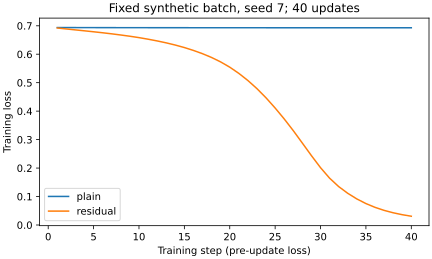

# 3.3 Plain／residual 對照：先控制比較條件

[在 Colab 執行本節](https://colab.research.google.com/github/birdhackor/learn_to_yolo/blob/lessons-v0.6.1/notebooks/03-comparison.ipynb){ .md-button }

Residual 有直接路徑，是否就一定比 plain 更準？讀完你會知道：公平的對照要固定哪些條件、輸出怎麼讀，以及這種小實驗能寫出什麼程度的結論。前置是知道卷積與交叉熵；本節會重述 shortcut 的公式。

這裡的 plain 指沒有 shortcut、把 block 一個接一個疊起來的普通網路，每個 block 只輸出 \(F(x)\)；residual（殘差）網路則是每個 block 輸出 \(x+F(x)\)，也就是 [identity shortcut 那節](03-identity.md)的 residual block。「residual 是否一定更準」不能只比較兩個不同模型最後的 loss 來回答，因為很多條件都可能影響結果：容量（模型能表示多複雜規則的能力，大致隨層數、channel 數增加）、初始化、資料、訓練步數，以及計分方式（用 loss、accuracy 或其他指標判斷好壞）。所以本節只改「是否加入同 shape 的 shortcut」，做一次每個數字都能回頭核對來源的小比較。

設計來源是 [ResNet 原始論文](https://arxiv.org/abs/1512.03385)對 plain 與 residual 的研究。本節用 4 個 channel、3 個 block 與人工色塊，和原版的主要差別是：沒有 BatchNorm（Batch Normalization，批次正規化）；深度淺得多；每個 block 末端沒有 activation（原版 plain 接在第二個卷積之後，residual 接在相加之後）；用 PyTorch 預設初始化（原版是 He 初始化，見〈結果怎麼讀〉）；只用固定 learning rate 的簡單 SGD（原版另有 momentum、weight decay，learning rate 也會逐步調小）；stem 只有一個 3×3 卷積，也沒有分段下採樣（全程 16×16）。BatchNorm（批次正規化）在原版每個卷積後都有，訓練時它用同一批資料算出的平均與標準差，把每個 channel 的數值調到穩定的尺度；activation 是層與層之間的非線性函數，本節指 ReLU。本節是局部的機制對照，不是重現論文在 ImageNet（約 128 萬張訓練照片、1000 類）上的結果。論文的 plain 網路也有 BatchNorm；本節沒有它，所以結果只代表本設定，加回後會怎樣，本節沒有測。

可以用頁首的按鈕在 Colab 執行，或在本機執行 `PYTHONPATH=. python lesson_cases/03-comparison.py`。兩種方式跑的是同一份完整程式：Colab 裡「本節可修改的完整實驗」下方那格，內容就是 `lesson_cases/03-comparison.py`；網頁上只摘錄了其中幾段。CPU、16×16 輸入、訓練 8 張／validation 4 張，兩個模型各用 SGD 更新 3 步。3 步只確認梯度傳得到 stem、參數有更新，而且斷言全部通過、每一行都印得出來，不拿來替架構排名；兩者學不學得會，要看後面〈訓練 40 步〉那段：同樣的模型與資料，更新 40 次。

## 唯一主要改動是什麼

兩個模型用相同的 stem、3 個結構相同的主分支 F，以及相同的分類 head。Stem 是輸入端的第一層，把 3 個 channel 變成 4 個；head 是一個 Linear（全連線層），把每個 channel 的空間平均（小 CNN 那一節的全域平均池化 GAP）轉成 2 類 logits。整個資料流如下，B 是圖片數：

輸入 `[B,3,16,16]` → stem（3×3 卷積＋ReLU）`[B,4,16,16]` → 3 個 block（都保持 `[B,4,16,16]`）→ 每個 channel 取空間平均 `[B,4]` → Linear `[B,2]`

第 k 個 block（k＝1、2、3）收到輸入 \(x\) 後，plain 輸出 \(F_k(x)\)，residual 輸出 \(x+F_k(x)\)。三個 \(F_k\) 結構相同、權重各自獨立，都是 Conv–ReLU–Conv：兩個 3×3 卷積都保持 `[B,4,16,16]`，block 輸出後不再接 ReLU。兩個模型所有可學參數完全相同，只有 residual 多了逐值加法。以下摘自完整程式，中文註解是本頁加的：

``` { .python data-excerpt="lesson_cases/03-comparison.py" }
correction = self.branch(x)  # self.branch 就是 F：Conv–ReLU–Conv
# self.residual 為 True 時回傳 x+F(x)；為 False 時只回傳 F(x)
return x + correction if self.residual else correction
```

`self.residual` 是建模型時給的 True／False（plain 給 False，residual 給 True）。最後一行是 Python 的條件運算式 `A if 條件 else B`；它的優先順序比 `+` 低，所以 `x + correction` 會分成一組，整行等於 `(x + correction) if self.residual else correction`。plain 時，correction 就是整個 block 的輸出。

原版兩種網路在每個 block 最後都有一個 ReLU：plain 接在第二個卷積（與 BatchNorm）之後，residual 接在相加之後，所以兩者的 ReLU 數量相同。本節兩邊都拿掉這個 ReLU（與 identity shortcut 那節一致），兩個模型的 ReLU 位置完全相同：stem 之後一個、每個 F 的兩個卷積之間一個，block 輸出後都不接 ReLU。若只替 residual 加回，兩個模型就同時差了「有沒有 shortcut」和「多一個 ReLU」兩件事，結果不同時分不清是誰造成的；要照原版，就得兩邊一起加回，這個版本本節沒有測。若加入 projection，模型還會多出參數；那是另一個問題，應另做對照。

## 固定什麼，才能解讀觀察

公平比較就像理化實驗的控制變因。操縱變因只有「有沒有 shortcut」；控制變因是初始權重、資料、optimizer 與 learning rate、步數、ReLU 位置；應變變因是每步的 loss 與 stem 梯度，以及最後的 validation accuracy。另外也把參數數、乘加數（MAC）、加法次數與時間等成本一起記下來。

資料是程式畫的色塊圖。每張 16×16 黑底圖上有一個 8×8 的純紅（類別 0）或純藍（類別 1）方塊。8 張訓練圖各不相同：方塊的上緣都離圖的頂端 3 個畫素，左緣離左邊 2、3、4 或 5 個畫素，每個位置各有一張紅、一張藍。4 張 validation 是把其中左緣離左邊 4、5 個畫素的那 4 個方塊（兩紅兩藍）往下移 2 列，上緣離頂端 5 個畫素；它們沒有參與更新，完整程式也用斷言（assert）檢查它們都不和任何一張訓練圖相同。

兩類用的位置刻意完全相同。如果紅方塊總在某些位置、藍方塊總在另一些位置，模型只看位置也能答對，答對了也說明不了它看的是顏色。完整程式的 `data()` 畫完圖後，從圖上讀回每個方塊的上緣與左緣，再用斷言檢查紅、藍兩類的位置清單排序後完全相同，也就是每個位置紅、藍出現的次數一樣；訓練與 validation 兩組都檢查。方塊又都是 8×8，所以只剩顏色能分出類別。這是很容易的人工資料，4 張 validation 也不能代表真實圖片。

每一步都把同一批 8 張訓練圖一次全部送入（不抽樣、不打亂），兩個模型完全一樣；SGD、learning rate 0.1、交叉熵與 3 次更新也完全一致。不過 optimizer 是兩個模型各建一個，分別引用各自的參數，不能共用同一個 optimizer 輪流訓練。

初始權重要相同，得先懂 seed。seed（亂數種子）固定後，每次執行產生的整串亂數都一樣；建模型時，各層依序從這串亂數取值當初始權重。完整程式只在開頭設一次 seed，接著連續建立兩個模型，residual 取到的是後面的亂數，權重和 plain 不同。就算在建每個模型前各重設同一個 seed，也要兩個模型建立各層的順序與大小完全相同才會對上；本例剛好相同，但只要其中一個多一層（例如 projection），後面每一層都會錯開。

所以完整程式不靠 seed 讓權重相同：先建 plain，再用 `residual.load_state_dict(plain.state_dict())` 把權重整份複製給 residual，並用斷言逐一檢查每個參數數值相等。`state_dict` 是記錄每個參數名稱（例如 `stem.weight`）與數值的字典。

完整程式把一次更新寫成函式 `train_step`：清掉上一步的梯度、forward、算交叉熵、backward、記下 stem 梯度的 L2 長度並檢查，最後 `optimizer.step()`，傳回這次更新前的 loss 與梯度長度。3 步就是呼叫它 3 次，每次印出一行。所以紀錄裡的 loss 是每次更新前量的；validation accuracy 是 3 次更新後量的；時間是 3 步合計，不含計時前的暖機（見下文的計時說明）。梯度記的是 stem 梯度的 L2 長度（L2 norm）：把各梯度值平方相加再開根號，用一個數字概括梯度有多大，就像向量 \((3,4)\) 的長度是 \(\sqrt{3^2+4^2}=5\)。完整程式只算 stem 卷積的權重，不含 bias。

為什麼量 stem？stem 在最前面、離 loss 最遠，梯度要往回穿過全部 3 個 block：plain 只能經過 6 個卷積，residual 每個 block 還多一條直接路徑（見 [identity shortcut 那節](03-identity.md)），所以比較 stem 的梯度，最能看出梯度傳不傳得到最前面。L2 長度大只表示這一步參數被推得比較用力，不代表方向比較好，也不代表模型比較準。

## 參數數量相同，計算仍略有不同

參數數可以逐層算出來：

- stem：有 bias 的 3×3 卷積，3→4 channel，\(4\times(3\times9+1)=112\)；
- 每個 F：兩個無 bias 的 3×3 卷積，4→4 channel，\(2\times4\times4\times9=288\)；
- head：含 bias 的 Linear，4→2，\(4\times2+2=10\)。

因此兩個模型都是 \(112+3\times288+10=986\) 個參數。參數數量相同，不代表兩個模型算的是同一件事：同一組參數值，兩個模型算出的結果不同。例如把所有 F 的權重都設為 0：plain 每個 block 都輸出全 0，head 只剩 bias，每張圖得到一樣的分數；residual 每個 block 輸出 \(x+0=x\)，stem 的特徵原樣送到 head，紅圖和藍圖得到不同的分數。

兩個模型卷積與 Linear 的乘加數相同。一次乘加是把一個值乘上權重、再累加到答案，算法與 [VGG 風格小 CNN](01-small-cnn.md) 那節相同：

\[
16\times16\times4\times3\times9
+6\times16\times16\times4\times4\times9
+4\times2=248840.
\]

第一項是 stem（27648），第二項是 3 個 block 共 6 個卷積（每個 36864），第三項是 head（8）；bias 的加法不計入。Residual 每張圖另多 \(3\times4\times16\times16=3072\) 次逐值加法。

這三個數（參數數、乘加數、加法次數）都由完整程式自己數出，再用斷言和上面的手算值核對，最後印出的也是數出的值。`main()` 裡對應的幾行如下（中文註解與 `...` 那行是本頁加的），`name` 是模型名稱 `"plain"` 或 `"residual"`，`train_x` 是 8 張訓練圖：

``` { .python data-excerpt="lesson_cases/03-comparison.py" }
# p 是一個參數 tensor，p.numel() 是它裡面的數值個數；全部加起來就是參數數
params = sum(p.numel() for p in model.parameters())
assert params == 986
macs, shortcut_adds = count_per_image(model, train_x)
assert macs == 248840
assert shortcut_adds == (3072 if name == "residual" else 0)
...  # 中間省略：暖機、訓練 3 步、量 validation accuracy 等
print(f"{name}: params={params}, MACs/image={macs}, shortcut_adds/image={shortcut_adds}, "
      f"validation_accuracy={acc:.2f}, 3_step_seconds={elapsed:.4f}")
```

??? note "選讀：程式怎麼逐層數成本（forward hook）"

    乘加數與加法次數交給函式 `count_per_image`，它用的是 forward hook。hook 原意是鉤子：forward hook 是「鉤」在某一層上的小函式，掛上之後，這一層每算完一次 forward，PyTorch 就呼叫它一次，並把這一層本身、這一層的輸入與輸出交給它。所以不必把模型拆開、自己一層層執行，只要照常讓整個模型跑一次 forward，掛了 hook 的層一算完，hook 就拿得到它的輸出。`count_per_image` 把同一個 `hook` 掛到每個卷積、Linear 與 Block 上，在 `torch.no_grad()` 下把傳進來的圖（這裡是 8 張訓練圖）送進模型，數完就把 hook 拿掉。以下摘自完整程式，中文註解是本頁加的：

    ``` { .python data-excerpt="lesson_cases/03-comparison.py" }
    def count_per_image(model, images):
        """Multiply-accumulates and shortcut additions per image, counted by forward hooks."""
        macs, shortcut_adds = [], []  # 兩個空清單：hook 數到的每一筆都放進來，最後再加總

        def hook(layer, inputs, output):  # PyTorch 傳入：剛算完的這一層、它的輸入、它的輸出
            values = output[0].numel()  # 這一層替第 0 張圖輸出幾個值
            if isinstance(layer, nn.Conv2d):  # 卷積：每個輸出值要 in_channels×3×3 次乘加
                macs.append(values * layer.in_channels * layer.kernel_size[0] ** 2)
            elif isinstance(layer, nn.Linear):  # Linear：每個輸出值要 in_features 次乘加
                macs.append(values * layer.in_features)
            elif isinstance(layer, Block) and layer.residual:  # x + F(x)：每個輸出值 1 次加法
                shortcut_adds.append(values)

        # 把同一個 hook 掛到每個卷積、Linear 與 Block 上，留下每個 handle
        handles = [layer.register_forward_hook(hook) for layer in model.modules()
                   if isinstance(layer, (nn.Conv2d, nn.Linear, Block))]
        with torch.no_grad():  # 只是數數，不需要梯度
            model(images)  # 跑一次 forward；掛了 hook 的層每算完一次，hook 就被呼叫一次
        for handle in handles:
            handle.remove()  # 數完就把 hook 拿掉
        return sum(macs), sum(shortcut_adds)
    ```

    `model.modules()` 逐一給出模型裡的每個模組：模型本身、stem、head、每個 Block，以及 Block 裡的卷積與 ReLU 等；`isinstance(layer, nn.Conv2d)` 檢查 `layer` 是不是卷積。`if … elif …` 由上往下檢查條件，只執行第一個成立的那一段（`elif` 是 else if 的縮寫）；三個條件都不成立時，也就是 `residual` 為 False 的 Block，就什麼都不記。`register_forward_hook` 掛上 hook，並傳回一個 handle（把手），之後用 `handle.remove()` 把 hook 拿掉。一次 forward 雖然送進 8 張圖，hook 只看第 0 張（`output[0]`），所以數出的是一張圖的數字（每張圖大小相同，哪一張都一樣）；規則和上面的手算相同。Block 那一條看的是 `layer.residual`：這個旗標為 True 時，forward 算的是 `x + correction`，每個輸出值記 1 次加法。也就是說，加法次數是依旗標記下的，程式並沒有去偵測 forward 裡實際做了幾次加法。這次 forward 只用來數數，不會改動任何參數。

乘加數不含 activation、空間平均與資料搬移，所以兩者「乘加數相同」不等於所有成本完全相同。Shortcut 要把輸入保留到相加為止，所以推論時的記憶體峰值（同一時刻最多占用多少記憶體）也要考慮：plain 的 block 輸入在第一個卷積算完後就能釋放，residual 卻要留到相加。訓練時則不同：第一個卷積在反向傳播時本來就要用這份輸入算梯度，有沒有 shortcut 都會保存，所以 identity shortcut 幾乎不增加訓練時的記憶體。

### 時間怎麼量才公平：暖機

時間也要量得公平。單次 CPU 時間容易受首次執行、快取（電腦暫存剛用過資料的高速記憶體）與系統負載影響。同一個程式裡，第一次執行某段計算常會多花一些只需要做一次的準備時間；若不處理，這筆時間會算到先計時的那個模型頭上。所以正式計時前要先暖機（warmup）：先不計時地跑幾次，把這些一次性的準備做掉，這幾次的時間丟掉不算。

完整程式在每個模型計時前各暖機一次。它先用 `copy.deepcopy(model)` 做出一個副本 `throwaway`：deepcopy（深層複製）把模型連同每一層、每個參數都另外複製一份，副本的權重和原模型相同，但之後改動其中一個，另一個不受影響（只寫 `throwaway = model` 不會複製，兩個名字指的是同一個模型）。程式替副本另建一個 SGD（optimizer 只會更新建立時交給它的參數），在副本上跑一次同樣的 `train_step`，不計時，之後就不再使用副本。若直接拿真正的模型暖機，它會多更新 1 次，起點就和另一個模型不同；用副本暖機，真正的模型仍從相同的初始權重開始，也仍只更新 3 次。斷言 `assert torch.equal(before, model.stem.weight)` 確認暖機之後，真正模型的 stem 權重沒有改變；`before` 是暖機前先存下的 stem 權重。

暖機之後，這仍是只量一次、只有 3 步的時間，還是會受快取與系統負載影響，所以兩個時間差距很小時，不能拿來說誰比較快。正式的速度比較應先暖機、多次量測（例如取中位數），固定 batch 與裝置，並分清 forward 和完整訓練步的時間。

## 可核對的輸出：3 步看得出什麼

完整程式用斷言檢查下面這些事，任何一項不成立，程式就停在那一行並出現 AssertionError：

- 資料：紅、藍兩類的方塊位置相同；4 張 validation 圖都不和任何一張訓練圖相同。
- 起點：residual 複製來的每個參數都和 plain 相等。
- 成本：參數數是 986，每張圖的乘加數是 248840，shortcut 加法數 plain 為 0、residual 為 3072。
- 暖機：暖機後，真正模型的 stem 權重沒有改變。
- 每一步：loss 與 stem 梯度都是有限值，也就是不是 inf（無限大）或 NaN（Not a Number，算壞了的非數字）；stem 梯度的 L2 長度大於 0。
- 3 步後：stem 權重確實改變。

所以兩個模型都應印出 `params=986`、`MACs/image=248840`；`shortcut_adds/image` 則是 plain 0、residual 3072。Validation accuracy 會印出來，但沒有斷言要求 residual 勝出，因為誰勝出不是算術上必然的結果。`3_step_seconds` 是 3 步合計的秒數，兩個都很小；單次量測下誰比較小，換一次執行就可能顛倒，所以本節不比較它，只示範要把時間記下來。最後一行英文的意思是：初始權重、資料、optimizer、步數都相同；只有 3 步、4 張 validation，不能替架構排名。

讀 loss 時先記住一個基準。一張圖的交叉熵是 \(-\ln p\)，\(p\) 是模型給正確類別的機率；整批的 loss 再對所有圖平均。兩類分類時，若每張圖都給兩類各 50%，\(p=0.5\)，loss 就是 \(-\ln 0.5=\ln 2\approx0.693\)。所以 loss 停在 0.693 附近、accuracy 是 0.50，表示模型還在猜。

對照頁尾的實際執行紀錄，先只看最前面的 stem 收到多少梯度。下表三欄是第 1、2、3 次更新各自 backward 後、更新權重前的 stem 權重梯度 L2 長度：

|模型|第 1 次|第 2 次|第 3 次|
|---|---|---|---|
|plain|0.000984|0.001001|0.001011|
|residual|0.146701|0.147590|0.146128|

每一步 residual 都約 0.15，plain 都約 0.001，相差約 150 倍；兩者都有梯度，但 plain 傳到最前層的量小得多。對應的 loss，residual 是 0.6921 → 0.6888 → 0.6855，plain 是 0.6938 → 0.6937 → 0.6936。3 次更新後兩者的 validation accuracy 卻同為 0.50（4 張）：梯度大小的差異已看得見，還不能據此判誰學得會。

## 訓練 40 步：plain 與 residual 學得動嗎

要看兩者能不能學會，就沿用上面全部設定（seed 7、CPU、同樣的初始權重、同樣 8 張訓練圖與 4 張 validation、SGD、learning rate 0.1），只把更新次數增加到 40。這個實驗由 `scripts/run_learning_extensions.py` 執行：它從完整程式匯入同一個 `data` 與 `Classifier`，訓練迴圈則寫在腳本裡；前 3 次的 loss 和上面 3 步實驗印出的一致。它每一步都檢查 loss 與全部參數的梯度是有限值、梯度的 L2 長度大於 0，40 次更新後也檢查權重確實改變。

|模型|loss（第 1 次更新前→第 40 次更新前）|40 次更新後的訓練 accuracy（8 張）|40 次更新後的 validation accuracy（4 張）|
|---|---|---|---|
|plain|0.693793 → 0.692948|0.50|0.50|
|residual|0.692138 → 0.030958|1.00|1.00|

表中的 accuracy 是 40 次更新全部完成後，用 eval 模式量的。



圖說：藍線是 plain，幾乎水平停在 0.693（\(\approx\ln 2\)，等於亂猜）；橘線是 residual，前 15 步緩降，約第 20～30 步急降，第 40 次更新前約 0.031。橫軸是第幾次更新，每個點是該次更新「前」、在同一批 8 張訓練圖上量到的 loss：第 1 點還沒更新，第 40 點是第 40 次更新前的值。

想自己重跑：先執行本節 Colab 最上面的環境格（下載教材程式、安裝套件的那一格；不需要先跑完整實驗，腳本會自己載入程式並訓練），再按「＋程式碼」（英文介面是「+ Code」）新增一格，貼上下面三行執行：

```python
!python scripts/run_learning_extensions.py --section 03-comparison
from IPython.display import SVG, display
display(SVG(filename='artifacts/runs/learning/03-comparison/learning.svg'))
```

開頭的 `!` 表示把這行交給系統命令列執行，不是當成 Python 程式。第一行跑完 40 步後印出結果摘要，並把完整結果（`report.json`）與圖（`learning.svg`）寫進 `artifacts/runs/learning/03-comparison/`，不會覆寫網站上的紀錄與圖；後兩行把剛畫好的圖顯示出來。摘要是一段 JSON；要對照上面的表格，看 `models` 底下 plain、residual 各自的 `initial_loss`（第 1 次更新前）、`last_pre_update_loss`（第 40 次更新前）、`train_accuracy` 與 `validation_accuracy`；`predicted_classes` 是 40 次更新後 8 張訓練圖各被猜成哪一類。在本機則於專案根目錄執行 `python scripts/run_learning_extensions.py --section 03-comparison`（不加 `!`），再用瀏覽器打開 `artifacts/runs/learning/03-comparison/learning.svg`。Colab 裡「本節可修改的完整實驗」那格說明也列著這三行，先跑完整實驗再執行也可以。原始完整紀錄：[40 步結果](https://github.com/birdhackor/learn_to_yolo/blob/main/artifacts/checks/curriculum/03-comparison-learning.json)。

### 結果怎麼讀

**觀察。** 兩個模型都是 986 個參數、同樣的起點、同樣用 SGD 與 learning rate 0.1。plain 40 步後 loss 幾乎沒動，一直貼著 \(\ln 2\approx0.693\)，8 張訓練圖全部猜成類別 1，訓練與 validation accuracy 都是 0.50。residual 第 40 次更新前的 loss 約 0.031，表示模型給正確類別的機率已接近 1；訓練 8 張與 validation 4 張全對。validation 的每個位置都有一紅一藍兩張圖，兩張只差在顏色，residual 兩張都答對，所以它確實是靠顏色分開兩類，方塊往下移 2 列也分得對。兩個模型每一步的梯度都是有限值、L2 長度不為 0，權重也確實改變；所以 plain 並不是程式沒在更新，而是更新幾乎沒有效果。

**機制。** 上面的梯度表回答「梯度到最前層時還有多少」；它沒有逐層量特徵幅度。從結構看，plain 的梯度必須穿過 6 個卷積與中間的 ReLU；本設定的預設初始權重偏小，又沒有 BatchNorm 把前向數值拉回穩定尺度，連續相乘可能讓特徵與梯度越傳越小。Head 收到的特徵若已接近 0，分數就主要由 bias 決定，這與 plain 幾乎給每張圖相同答案的現象一致。

residual 每個 block 多了把輸入直接加回的路徑，特徵與梯度都有一條不必穿過卷積權重的路（見 [identity shortcut 那節](03-identity.md)）。本次實測是 stem 梯度大得多、40 步學得動；初始化下的逐層縮小量則是下方選讀的粗略推算，不能當成已量出的每層數字。

**限制。** 這只代表本設定：沒有 BatchNorm、PyTorch 預設初始化、3 個 block、人工色塊，而且只有一個 seed，也只試了 learning rate 0.1。如開頭所說，加回 BatchNorm 會怎樣，本節沒有測；改用權重較大的初始化會怎樣，本節也沒有測。He 初始化的尺度估算放在下方選讀；這些替代設定仍需另做對照。

本節 plain 的 stem 梯度很小、loss 幾乎不降，符合梯度變小的現象，尚未逐層診斷；上面的結構分析與初始化估算提供了可能的機制。這和論文研究的退化不是同一件事：論文的 plain 網路有 BatchNorm、用 He 初始化，論文第 4.1 節指出 BatchNorm 讓前向訊號不會消失，也檢查過反向梯度的大小正常；18 層時 plain 與 ResNet 的錯誤率幾乎相同，差距到 34 層才出現，論文推測深層 plain 是收斂得極慢。所以本節的結果不能用來解釋論文裡的退化，也不能說 shortcut 的作用只是防止訊號消失。validation 全對只表示：方塊往下移 2 列、兩類位置又完全相同時，模型仍能只憑顏色答對這 4 張；離真實照片的泛化還很遠。曲線也只畫這批訓練圖的 loss。所以不能據此宣稱真實圖片或更深網路的泛化效果。

??? note "選讀：預設初始化為什麼可能使訊號縮小"

    以下用初始化時權重的分布估算尺度，假設權重彼此獨立、與輸入沒有相關，並把 ReLU 前的值近似看成正負對稱。這不是本次實驗逐層量出的特徵或梯度，也不保證訓練後仍成立。

    先看建立層時 PyTorch 自動給的隨機初始權重（預設初始化）：block 裡每個 4→4 的 3×3 卷積，一個輸出值是 4×9＝36 個「權重×輸入」相加，PyTorch 預設讓權重取自 \(-1/\sqrt{36}\) 到 \(1/\sqrt{36}\)，也就是 −1/6 到 1/6 的均勻分布（這個範圍內每個值出現的機會都一樣）。在 −a 到 a 均勻分布時，平方的平均是 \(a^2/3\)（可用積分算出），所以這裡只有 \((1/6)^2\div3=1/108\)。權重有正有負、彼此獨立，36 項相加後平方，交叉相乘的部分平均會互相抵消（例如 \((w_1x_1+w_2x_2)^2\) 展開後的 \(2w_1x_1w_2x_2\)，因為權重正負機會相同，平均是 0），所以每過一個卷積，數值平方的平均約縮成 36×1/108＝1/3，中間的 ReLU 把負值變成 0，又再少約一半。一個 block 合起來，平方的平均約縮成 1/18；數值大小看它的平方根，\(\sqrt{1/18}\approx0.24\)，約剩 1/4。

    例如 ResNet 論文用的 He 初始化（以作者何愷明 Kaiming He 命名）讓權重平方的平均是 2/36，搭配 ReLU 時，每層輸出的平方平均大致不變。

## 應如何下結論

合格的結論要寫出條件與實際數字，例如：「在 seed 7、8 張人工色塊、相同初始權重、SGD learning rate 0.1 的條件下，只訓練 3 步時，residual 的 stem 梯度 L2 長度約 0.15，plain 約 0.001；residual 印出的 loss 從 0.6921 降到 0.6855，plain 幾乎不變；兩者 validation accuracy 都是 0.50（4 張）。訓練 40 步時，plain 的 loss 仍停在 \(\ln 2\) 附近（第 1 次更新前 0.693793 → 第 40 次更新前 0.692948），40 次更新後訓練與 validation accuracy 都是 0.50；residual 第 40 次更新前的 loss 約 0.031，40 次更新後訓練 8 張與 validation 4 張全對。」3 步的數字取自頁尾的執行紀錄，40 步的取自上面的 40 步紀錄；換電腦重跑時，訓練後的小數可能從第 3、4 位起就不同，定性結論不受影響。

這段結論能支持的範圍是：在這個沒有 BatchNorm、只有 3 個 block、用 PyTorch 預設初始化、SGD learning rate 0.1、8 張人工色塊、只跑 seed 7 一次的設定下，plain 40 步內學不動，residual 學得動，而且是靠顏色分類。不能寫「ResNet 總是更準」，也不能說這解釋了論文裡深層 plain 網路的退化，或把單次梯度 L2 長度較大解釋成泛化較好。

收益是學會控制變因，並把參數數、乘加數等成本一起記下來；代價是這個快速實驗的證據很有限。40 步做到的只是給兩個模型相同、而且比 3 步多的訓練步數；需要比較效果時，還要使用更多獨立資料、跑多個 seed，並先定好評估規則，再決定是否保留 shortcut。

## 常見錯誤、自主練習與答案

常見錯誤是 plain 較窄、residual 較深，卻把差異全歸給 shortcut；或只讓其中一個模型多訓練幾次，直到它贏。另一種是用 validation 更新參數，失去獨立性。還有一種是資料裡有跟著類別變的其他線索，例如紅方塊總在某些位置、藍方塊總在另一些位置，模型靠位置也能答對；本節讓兩類共用相同位置，就是為了排除這個可能。

練習：把 block 數由 3 改成 1，其他設定不變。要改的是完整程式（Colab 裡「本節可修改的完整實驗」下方那格程式，或本機的 `lesson_cases/03-comparison.py`）`Classifier` 裡的 `self.blocks = nn.Sequential(*[Block(residual) for _ in range(3)])`：把其中的 `range(3)` 改成 `range(1)`。`main()` 裡控制訓練步數的 `for step in range(3)` 不要動。在本機請先複製一份再改（例如另存成 `lesson_cases/03-comparison-1block.py` 再執行它），或做完就改回：〈訓練 40 步〉的腳本會匯入原檔的 `Classifier`，原檔被改過時，它會默默改用 1 個 block 的模型，不會報錯。接著先手算新的參數數、乘加數與加法次數，把三行斷言 `assert params == 986`、`assert macs == 248840`、`assert shortcut_adds == (3072 if name == "residual" else 0)` 裡的 986、248840、3072 改成你算出的值。執行前也先預測兩個模型的 stem 梯度會怎樣變，再實跑核對。一樣不應把 3 步的勝負當成最終的架構選擇。

執行時，只要有一個數字算錯或忘了改，程式就停在第一個不成立的斷言，出現 AssertionError。三行依參數數、乘加數、加法數的順序檢查；plain 的加法數本來就是 0，所以加法數那一行要等 plain 跑完 3 步、輪到 residual 時才會失敗。這三行斷言都在 print 之前，所以失敗的那個值不會印出來；想核對時，可以在失敗的那行斷言前面暫時加一行 print，例如 `print(macs)`（縮排和下面那行斷言對齊，也就是開頭 8 個空格），看程式數出多少，再回頭檢查手算。不要刪掉斷言來讓錯誤消失。

??? note "參考答案"

    參數數為 \(112+288+10=410\)，乘加數為 \(27648+2\times36864+8=101384\)，residual 每張圖額外 \(4\times16\times16=1024\) 次加法。所以三行斷言改成 `assert params == 410`、`assert macs == 101384` 與 `assert shortcut_adds == (1024 if name == "residual" else 0)`。改對後，程式跑完兩個模型的 3 步，兩者都印出 `params=410`、`MACs/image=101384`，`shortcut_adds/image` 則是 plain 0、residual 1024。

    梯度的預測：只剩 1 個 block 時，plain 從 stem 到 head 只隔 2 個卷積，stem 梯度應明顯變大；residual 本來就有直接路徑，變化不大，所以兩者差距縮小。實際執行會看到：plain 的 stem 梯度比 3 個 block 時大了一個數量級以上，residual 的和 3 個 block 時差不多，兩者的差距因此大幅縮小；3 步後兩個模型的 validation accuracy 仍然一樣，3 步還不足以讓任何一個學會。小數會因電腦略有不同，這些趨勢不會。

    還要注意：少建 2 個 block 後，head 取到的是亂數串裡不同位置的值，初始權重也跟著變（stem 與第 1 個 block 不變）。這正是前面講 seed 時說的情況：層的數量或順序一變，後面的層取到的亂數就錯開。所以 1 個 block 和 3 個 block 的結果之間，差的不只是 block 數。

<!-- curriculum-evidence:start -->

## 實際執行紀錄

本節的完整程式於 2026-10-06 在 AMD EPYC 9V74 80-Core Processor（2 個執行緒）上用 PyTorch 2.9.1+cpu 執行，程式裡的 assert 全部通過。下面是那次印出的原始輸出；輸出裡若有計時或訓練得到的數字，換一台電腦會略有不同。每個數字的意思，以本頁正文的說明為準。[完整紀錄（JSON）](https://github.com/birdhackor/learn_to_yolo/blob/main/artifacts/checks/curriculum/03-comparison.json)

??? example "展開本次實際輸出"

    ```text
    plain step=0, loss=0.6938, stem_grad_norm=0.000984
    plain step=1, loss=0.6937, stem_grad_norm=0.001001
    plain step=2, loss=0.6936, stem_grad_norm=0.001011
    plain: params=986, MACs/image=248840, shortcut_adds/image=0, validation_accuracy=0.50, 3_step_seconds=0.0072
    residual step=0, loss=0.6921, stem_grad_norm=0.146701
    residual step=1, loss=0.6888, stem_grad_norm=0.147590
    residual step=2, loss=0.6855, stem_grad_norm=0.146128
    residual: params=986, MACs/image=248840, shortcut_adds/image=3072, validation_accuracy=0.50, 3_step_seconds=0.0070
    Same initial weights/data/optimizer/steps; 3 steps and 4 validation images do not rank architectures.
    ```

<!-- curriculum-evidence:end -->
