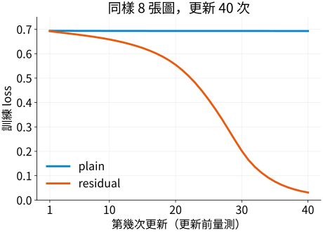

# A.3.3 有沒有捷徑：怎麼比較才知道差在哪裡

<details class="chapter-a-toc">
<summary>本頁目錄</summary>
<ul>
<li><a href="#_1">兩個模型只在哪裡不同</a></li>
<li><a href="#seed">起跑線相同，不只是寫同一個 seed</a></li>
<li><a href="#_2">先看三次更新：它們都有動嗎</a></li>
<li><a href="#40">再看 40 次：這個設定能學到什麼</a></li>
<li><a href="#_3">捷徑沒有參數，為什麼仍有成本</a></li>
<li><a href="#a">A 章走完之後，下一個問題是位置</a></li>
<li><a href="#_4">停一下：什麼改動會破壞比較</a></li>
<li><a href="#_5">實際執行紀錄</a></li>
</ul>
</details>

[在 Colab 執行本節](https://colab.research.google.com/github/birdhackor/learn_to_yolo/blob/lessons-v0.6.1/notebooks/03-comparison.ipynb){ .md-button }

[A.3.1](03-identity.md)讓我們理解原樣捷徑，[A.3.2](03-projection.md)處理了變形狀的捷徑。現在回到 A.1 的紅／藍分類：**在其餘條件相同時，多一條原樣捷徑，這個小網路的訓練會怎樣？**

這次只研究同形狀 block。一個普通 **plain** 模型的 block 學完整映射 H(x)，一個 **residual** 模型的 block 走 x+F(x)，由主分支 F 提供修正。比較要控制條件，否則看見不同結果，也不知道是捷徑、資料還是初始化造成的。

## 兩個模型只在哪裡不同

兩者先用一個 3×3 卷積把 RGB 變成 4 通道特徵，接 ReLU，再接 3 個 block。每個 block 都有兩層 3×3 卷積，中間 ReLU，保持 `[N,4,16,16]`。最後 GAP，把 4 個通道各取平均，再用線性層給紅、藍分數。

下面是同一份 block 程式，只有回傳式依開關改變：

``` { .python data-excerpt="lesson_cases/03-comparison.py" }
def forward(self, x):
    correction = self.branch(x)
    return x + correction if self.residual else correction
```

| 條件 | plain 與 residual 的安排 |
| --- | --- |
| 可學的層與初始權重 | 相同 |
| 資料與答案、呈現順序 | 相同 |
| loss | 兩類交叉熵 |
| optimizer／學習率 | SGD／0.1 |
| 更新次數 | 同樣 3 次，再另做同樣 40 次 |
| block 輸出 | plain 給 H(x)，residual 給 x+F(x) |

這個簡化模型沒有原版 ResNet 的 BatchNorm（批次正規化）、分階段下採樣與完整訓練設定，也沒有 block 相加後的 ReLU。結論針對這個機制實驗。

## 起跑線相同，不只是寫同一個 seed

先建立 plain，再建立 residual，隨機數產生器已往前走了；只在開頭設一次 seed，不會讓兩個模型自動拿到同一份權重。程式直接把 plain 的參數複製給 residual：

``` { .python data-excerpt="lesson_cases/03-comparison.py" }
plain, residual = Classifier(False), Classifier(True)
residual.load_state_dict(plain.state_dict())
for p, r in zip(plain.parameters(), residual.parameters()):
    assert torch.equal(p, r)
```

`state_dict()` 收集模型的權重等狀態，`load_state_dict()` 載入對應內容。每一對參數再逐項比對，才證明這次真的從同一組參數開始。輸出不必相同，因為 residual 已改了計算路線。

資料也重新安排：這次圖為 **16×16**，方塊 **8×8**，用更小的輸入比較 block，並另外準備沒參與更新的位置。兩類的方塊位置分布相同，讓位置不能單獨決定答案。

| 資料 | 張數 | 方塊位置（列／欄由 0 起算） | 用途 |
| --- | --- | --- | --- |
| 訓練 | 8，紅藍各 4 | 頂端列 3，左端欄 2–5 | 更新參數 |
| 驗證 | 4，紅藍各 2 | 頂端列 5，左端欄 4–5 | 檢查新位置 |

程式也檢查訓練與驗證圖片不完全重複。這是很小、仍然同樣黑底色塊的驗證集，能回答是否分對這幾個新位置，還不能代表真實照片。

## 先看三次更新：它們都有動嗎

兩個模型都在 CPU 用同一批訓練資料更新 3 次。程式不只看 loss，也檢查第一個卷積（程式名 `stem`）的梯度和權重變化。

**梯度的 L2 長度（norm）**把一層很多權重的梯度平方、相加、開根號，收成一個大小，讓我們觀察回到前層的訊號。本例實測：

| 模型 | 第 1 次更新前 loss | 第 3 次更新前 loss | 第 1 次 stem 梯度長度 | 更新後驗證正確率 |
| --- | --- | --- | --- | --- |
| plain | 0.6938 | 0.6936 | 0.000984 | 2/4 |
| residual | 0.6921 | 0.6855 | 0.146701 | 2/4 |

兩者梯度都有限、非零，stem 權重也真的變了。residual 在這個起點有較大的前層梯度，loss 降得較多；但三步後兩者驗證都只答對一半。梯度大不是成績保證，也不能因為 plain 梯度小，就斷定程式沒有訓練。

## 再看 40 次：這個設定能學到什麼

從相同初始權重重新開始，沿用資料、SGD 與學習率，只增加到 40 次更新。每步的圖點都量在**該次更新前**；最後正確率則量在 40 次全部更新後。



| 模型 | 初始 → 最後一點訓練 loss | 更新後訓練正確率 | 更新後驗證正確率 |
| --- | --- | --- | --- |
| plain | 0.693793 → 0.692948 | 4/8 | 2/4 |
| residual | 0.692138 → 0.030958 | 8/8 | 4/4 |

plain 的 loss 停在約 0.693，接近 A.1 中兩類各給 0.5 的交叉熵基準；正確率仍是一半。residual 的 loss 明顯下降，也分對這批訓練圖與四張新位置圖。紀錄檢查了兩者的梯度與權重變化，因此觀察可以表達成：**在這組起點、資料與更新設定裡，加捷徑的網路更容易學到這個分類題目。**

不能把它延伸成任意 residual 網路都優於 plain。這裡只有一個 seed、8 張訓練圖、4 張驗證圖；沒有比較不同資料、學習率或初始化。這也是 A.2 診斷順序的用法：先確認兩者有更新，再分開看學會訓練題與小驗證集的結果。

## 捷徑沒有參數，為什麼仍有成本

兩者都有 **986 個參數**，卷積與線性層每張圖都做 **248840 次 MAC（multiply-accumulate，乘後累加）**。原樣捷徑沒有權重，所以不增加參數或這部分 MAC；但 residual 還多了三個 block 的逐值加法：

\[
3\times4\times16\times16=3072\text{ 次加法／圖}.
\]

還需要在相加前保留 x。因此「參數一樣」不代表計算與記憶體完全一樣。

完整程式會先暖機：在正式計時前複製模型，替副本另建相同設定的 SGD，完整做一次前向、loss、反向與更新，再棄用副本。這樣先執行訓練步驟的首次啟動工作，同時保留正式模型的初始權重。之後才計時三次正式更新，包含前向、loss、反向、更新與記錄，不包含暖機。這段時間很短、容易受機器影響；它不是純推論速度，本文也不用它判斷誰比較快。

## A 章走完之後，下一個問題是位置

我們從神經元開始，知道多層非線性網路怎麼計算，也知道梯度下降如何改參數；接著用 CNN 讀局部區域、彙整成類別分數，並用資料、梯度、驗證拆開檢查學習。ResNet 的捷徑則改變特徵與梯度的傳遞路線。

現在兩個分類器最後都用 GAP 收起位置，回答紅或藍。若要回答「方塊在哪裡」，就得改變輸出與訓練答案。下一章從單物件的類別加框開始，再往同圖多物件前進。

## 停一下：什麼改動會破壞比較

1. 只對 residual 加一個相加後 ReLU，結果不同還能全歸因於捷徑嗎？
2. 為什麼相同參數數量，不代表相同實測速度？
3. 驗證 4/4，下一步應該怎麼確認結果是否可靠？

??? note "核對想法"

    1. 不能。除了捷徑，也改了非線性與負值保留方式，需要重新說明比較條件。
    2. residual 多加法，運算次序與記憶體使用也不同；速度還受硬體與實作影響。要明定計時範圍再量測。
    3. 增加獨立資料的多樣性，使用更多起點與對照設定，觀察結果是否穩定。四張答對只支持這四張。

??? note "選讀：重跑 40 步與原始來源"

    在本節 Colab 的環境格執行後，新增一格：

    ```python
    !python scripts/run_learning_extensions.py --section 03-comparison
    from IPython.display import SVG, display
    display(SVG(filename='artifacts/runs/learning/03-comparison/learning.svg'))
    ```

    這會重新訓練並把數字與圖寫到 `artifacts/runs/learning/03-comparison/`。本機在專案根目錄執行同一指令，不加 `!`。JSON 的 `initial_loss`、`last_pre_update_loss`、`train_accuracy`、`validation_accuracy` 對應本文表格。

    [40 步保存紀錄](https://github.com/birdhackor/learn_to_yolo/blob/main/artifacts/checks/curriculum/03-comparison-learning.json)與[ResNet 原論文](https://arxiv.org/abs/1512.03385)供核對；本節機制實驗沒有重現論文的整套網路與訓練結果。

接著可讀 [B／4.1：單物件分類與定位](04-localization.md)。

<!-- curriculum-evidence:start -->

## 實際執行紀錄

本節的完整程式於 2026-10-07 在 AMD EPYC 9V74 80-Core Processor（2 個執行緒）上用 PyTorch 2.9.1+cpu 執行，程式裡的 assert 全部通過。下面是那次印出的原始輸出；輸出裡若有計時或訓練得到的數字，換一台電腦會略有不同。每個數字的意思，以本頁正文的說明為準。[完整紀錄（JSON）](https://github.com/birdhackor/learn_to_yolo/blob/main/artifacts/checks/curriculum/03-comparison.json)

??? example "展開本次實際輸出"

    ```text
    plain step=0, loss=0.6938, stem_grad_norm=0.000984
    plain step=1, loss=0.6937, stem_grad_norm=0.001001
    plain step=2, loss=0.6936, stem_grad_norm=0.001011
    plain: params=986, MACs/image=248840, shortcut_adds/image=0, validation_accuracy=0.50, 3_step_seconds=0.0092
    residual step=0, loss=0.6921, stem_grad_norm=0.146701
    residual step=1, loss=0.6888, stem_grad_norm=0.147590
    residual step=2, loss=0.6855, stem_grad_norm=0.146128
    residual: params=986, MACs/image=248840, shortcut_adds/image=3072, validation_accuracy=0.50, 3_step_seconds=0.0091
    Same initial weights/data/optimizer/steps; 3 steps and 4 validation images do not rank architectures.
    ```

<!-- curriculum-evidence:end -->
