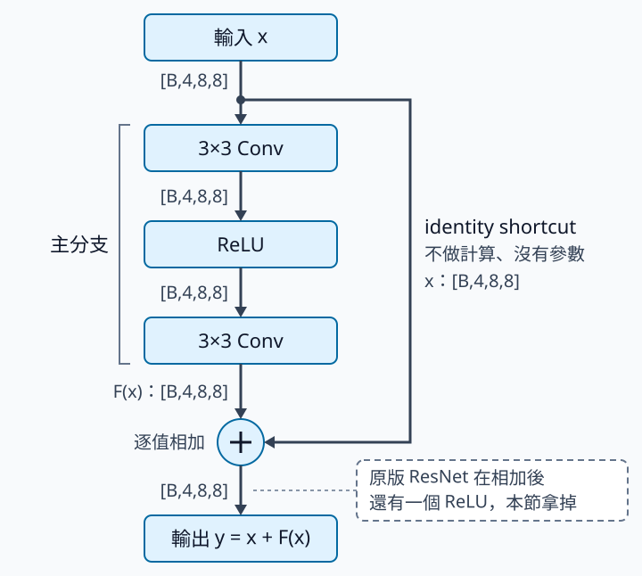

# 3.1 ResNet identity shortcut：先確定真的能原樣通過

[在 Colab 執行本節](https://colab.research.google.com/github/birdhackor/learn_to_yolo/blob/lessons-v0.4.0/notebooks/03-identity.ipynb){ .md-button }

照理說，網路加深不該變差：多加的幾層只要學成「輸出＝輸入」，深網路就能算出和原本淺網路一樣的結果，訓練誤差不該更高。但 [ResNet 原始論文](https://arxiv.org/abs/1512.03385)的圖 1 顯示，在 CIFAR-10 圖片分類資料上，56 層的普通（plain）網路連訓練誤差（訓練資料上的錯誤率）都比 20 層的高。論文把這種「更深反而連訓練誤差都較高」的現象稱為退化（degradation）。

一串普通卷積，每一層都把上一層的輸出整組換成新算出的數值。如果某一段目前不需要改變輸入，能否讓它直接通過，再慢慢學需要的修正？residual block（殘差區塊）的做法是：在主分支（branch）的卷積旁邊多接一條 shortcut（捷徑），把輸入原封不動加到主分支的輸出上，輸出變成「原本的值＋學到的修正」。

identity（恆等）指輸出與輸入完全相同，就像 \(f(x)=x\)。identity shortcut 就是不做計算、沒有參數，只把輸入原樣送到加號的 shortcut。本節先確定輸入真的能原樣通過：主分支輸出全為 0 時，整個 block 也是 identity，連負數都不例外；接著看 shortcut 讓梯度多了哪一項。讀完你能手算 residual block 的輸出、shape 與參數數量，並說出梯度裡多出的那個 1 從哪裡來。

前置只需會用[小 CNN 那一節](01-small-cnn.md)的公式算卷積輸出大小，並知道兩個 tensor 怎麼逐值相加；梯度部分會用到[暖身節](00-warmup.md)的連鎖律（chain rule）。兩條路 shape 不同的情況留到[下一節](03-projection.md)。本節的 block 是把論文的設計簡化後的教學版：原版每個卷積後還有 BatchNorm（把每個 channel 的數值調到穩定尺度的層，[Plain／residual 對照](03-comparison.md)會再說明），相加後還有一個 ReLU，本節都拿掉了（拿掉相加後 ReLU 的理由見下文）。

可以用頁首的按鈕在 Colab 執行，或在本機執行 `PYTHONPATH=. python lesson_cases/03-identity.py`。CPU 實驗分兩部分。第一部分手動把主分支的權重全部設成 0，讓主分支輸出全為 0（下文稱「人工零分支」），檢查輸出是否等於輸入、輸入的梯度是否都是 1。第二部分另建一個權重隨機的 block，訓練 2 步，只確認權重真的會更新。兩部分都不是在比分類準確率。

## 把「修正」與「完整答案」分開

用 \(x\) 表示輸入，\(F(x)\) 表示主分支（兩層卷積）算出的修正，\(y\) 表示輸出：

\[
y=x+F(x).
\]

這裡的加法是逐個位置、逐個 channel 相加，不是把兩個 tensor 接起來（串接，concatenation）。例如 x 是 [1,2]、F(x) 是 [10,20]：相加得 [11,22]，長度不變；串接得 [1,2,10,20]，長度變長。若 x 與 F(x) 都是 `[B,4,8,8]`，y 仍為 `[B,4,8,8]`；B 是 batch 筆數。兩者沿 channel 串接，才會變成 8 個 channel。

先看四個數字。第一部分的 x 是一張 1 個 channel 的 2×2 小圖 `[[-2,-1],[0,1]]`，shape 是 `[1,1,2,2]`，印出時攤平成一列 `[-2.0, -1.0, 0.0, 1.0]`。這個 block 只有 1 個 channel，主分支的 18 個權重全部設成 0，所以 F(x) 全為 0，y 仍是 `[-2,-1,0,1]`：負數也原樣通過，整個 block 是 identity。上面的 `[B,4,8,8]` 與下文的 288 個參數，屬於第二部分（B=2、4 個 channel、8×8 的隨機例子）。

若相加後再接 ReLU，結果就不同：\(y=\mathrm{ReLU}(x+F(x))=\mathrm{ReLU}([-2,-1,0,1])=[0,0,0,1]\)，負的 −2、−1 都變成 0。這時只能說 shortcut 是 identity：它把 x 原封不動送到加號，F(x)=0 時相加後、ReLU 前的值也還是 x。但整個 block 的輸出已不等於 x，不能說整個 block 對任意 x 都是 identity。原版 ResNet 的 block 相加後有 ReLU，正是這種情況。

本節拿掉相加後的 ReLU，才能用正負輸入精確檢查「整個 block 是 identity」；這和原版不同，也不等於完整的原版 ResNet 配置。手算時要先確認相加後有沒有 ReLU，否則結果會和程式的斷言（assert）對不上。

## 相加前，兩條路的 shape 必須完全相同

x 進入 block 後分成兩條路：主分支依序經過 3×3 卷積、ReLU、3×3 卷積，算出 F(x)；shortcut 不做計算，把 x 原樣送到加號。兩條路在加號會合，逐值相加得到 y，所以兩邊的 shape 必須完全相同。



看圖時注意每段線旁的 shape：主分支每一步都維持 `[B,4,8,8]`，所以算出的 F(x) 和 shortcut 原樣送來的 x shape 相同，可以在加號逐值相加。右下的虛線框指向加號之後那段線：原版 ResNet 在這裡還有一個 ReLU，本節拿掉了。

本例每個卷積 kernel=3、padding=1、stride=1，channel 數保持不變。代入小 CNN 那一節的輸出長度公式，\(\lfloor(8+2\times1-3)/1\rfloor+1=8\)，8×8 維持 8×8。所以兩條路的 shape 相同：

| 路徑 | 輸入 | 輸出 |
| --- | --- | --- |
| shortcut 直接通過 | `[B,4,8,8]` | `[B,4,8,8]` |
| 主分支：3×3 Conv → ReLU → 3×3 Conv | `[B,4,8,8]` | `[B,4,8,8]` |
| 相加 | 兩個同 shape 的 tensor | `[B,4,8,8]` |

如果主分支把 channel 改成 8，或用 stride=2 縮到 4×4（\(\lfloor(8+2\times1-3)/2\rfloor+1=4\)），直接把 x 加上去就不再合法。遇到這種情況，下一節的做法是 projection（投影）：在 shortcut 上加一個可學的 1×1 卷積，把 x 轉成和主分支輸出相同的 shape，再相加。這裡的 projection 指「可學的線性轉換」，不是數學課裡把向量投到某個方向的正射影。

PyTorch 某些 shape 可以 broadcast（廣播）：相加時，若某一軸有一邊長度是 1，PyTorch 會自動把它複製成另一邊的長度再加，不會報錯。例如 `[B,4,8,8]` 加 `[B,4,1,1]`，得到 `[B,4,8,8]`。上面兩種情況（channel 4 對 8、8×8 對 4×4）對不上的軸都沒有長度 1，PyTorch 會直接報錯。危險的是縮成 1×1 這種不報錯的情況（見練習 2）。能 broadcast 不代表符合設計，所以這種 block 應該用 assert 明確核對兩條路的完整 shape。

## 程式只多一個加號，學習目標卻不同

以下摘自完整程式 `lesson_cases/03-identity.py`，中文註解是本頁加的：

```python
class IdentityBlock(nn.Module):
    def __init__(self, channels):  # 建立 block 時執行一次
        super().__init__()  # nn.Module 的固定寫法
        # 主分支：3×3 卷積 → ReLU → 3×3 卷積，兩個卷積都不用 bias
        self.branch = nn.Sequential(nn.Conv2d(channels, channels, 3, padding=1, bias=False),
                                    nn.ReLU(),
                                    nn.Conv2d(channels, channels, 3, padding=1, bias=False))

    def forward(self, x):  # 寫 block(x) 時實際執行的計算
        # 普通（plain）block 寫成 return self.branch(x)；這裡只多了「x +」
        return x + self.branch(x)  # self.branch(x) 就是 F(x)；相加後沒有 ReLU
```

`nn.Sequential` 把幾層依序串起來：輸入先進第一層，結果再交給下一層。第一部分用 `IdentityBlock(1)`，第二部分用 `IdentityBlock(4)`。

主分支是兩個無 bias 的 3×3 卷積，中間一個 ReLU。參數數沿用小 CNN 那一節的公式 \(C_{out}(C_{in}k^2+1)\)；本例 `bias=False`，所以去掉 +1。4 個 channel 時，每層 \(4\times4\times9=144\)，兩層共 \(2\times4\times4\times9=288\) 個參數；第一部分只有 1 個 channel，共 \(2\times1\times1\times9=18\) 個。shortcut 沒有參數。加了 shortcut 並不會省掉主分支的卷積計算，反而多一次逐值加法；推論時 x 也要保留在記憶體裡，等主分支算完、相加後才能釋放。訓練時則幾乎不多占記憶體：第一個卷積算權重梯度本來就要用到它的輸入 x（就像暖身節 \(\hat y=wx\) 裡，w 的梯度含有因子 x），有沒有 shortcut 都得把 x 存著（見 [Plain／residual 對照](03-comparison.md)）。

若這一段最理想的轉換是 \(H(x)\)，主分支只需學 \(F(x)=H(x)-x\)。H(x) 沒有人直接給答案，是由整個網路的訓練間接決定；這裡的 H 是函數名稱，不是小 CNN 那一節輸出長度公式裡代表輸入長度的 H。「理想輸出減掉輸入後剩下的差」英文叫 residual（殘差），這就是 residual block 名字的由來；用它堆成的網路叫 ResNet（Residual Network，殘差網路）。

當 \(H(x)\) 接近 \(x\)，也就是這一段最好幾乎什麼都不做時，修正可能比較好學。論文的理由是：用一疊非線性層（例如 Conv→ReLU→Conv）去逼近「輸出＝輸入」，訓練可能有困難；residual block 只要把主分支的權重推向 0，就得到 \(y\approx x\)，再從這裡微調。這是論文提出的假說。論文網路裡這幾層的輸入都剛經過 ReLU、沒有負數，普通層用特殊的權重還能原樣輸出；本節的 x 有正有負，這個沒有 bias、中間 channel 數和輸入相同的普通 block，不論權重怎麼設，都做不到對所有輸入原樣輸出：中間的 ReLU 會把一部分值變成 0，中間層又沒有多的位置保存這些被歸零的資訊。是否真的更容易，要在相同參數量、資料與訓練步數下做對照實驗判斷（見 [Plain／residual 對照](03-comparison.md)），不能僅因公式好看就保證準確率提升。

## 不背微積分也能看懂：梯度沿 shortcut 直接傳回

暖身節算的是 loss 對參數 w 的梯度；這裡改看 loss 對輸入 x 的梯度，也就是 x 稍微改變時 loss 的變化率。x 本身不會被更新，為什麼要看它？在深層網路裡，這個 block 的 x 是前一層的輸出。依連鎖律，前面各層參數的梯度，都要經過「loss 對 x 的梯度」才傳得回去。所以完整程式讓 x 也記錄梯度（`requires_grad=True`）。

把 x 增加很小一點 \(\Delta x\)，輸出變化是 \(\Delta x+[F(x+\Delta x)-F(x)]\)。第一項來自 shortcut，永遠存在；第二項來自主分支。把輸出變化除以 \(\Delta x\)，就是 y 對 x 的變化率：

\[
\frac{\Delta y}{\Delta x}=1+\frac{F(x+\Delta x)-F(x)}{\Delta x}.
\]

本節的 block 相加後沒有 ReLU，所以每個 block 往回傳的變化率都含一個不經過權重的 1，再加上主分支那一項。這是「梯度可沿 shortcut 直接傳遞」的直覺來源，但不表示全部梯度永遠等於 1：主分支的權重不是 0 時，還要加上主分支那一項。

人工零分支的實驗把 y 的所有值加起來當 loss。這個 loss 不是訓練誤差，也沒有目標值；它只是把 y 收成一個數，好呼叫 `backward()` 算梯度。本例的 loss 是 \(-2+(-1)+0+1=-2\)，可以是負的。選「全部相加」，是因為 loss 對每個 y 值的變化率都是 1，x 的梯度就直接反映 y 隨 x 的變化率。固定其他元素，只把 x 的某一個元素增加 0.001，y 的對應元素也增加 0.001，loss 也增加 0.001，因此每個輸入元素的梯度都是 1。完整程式第一部分的主要幾行如下（省略最後兩行 print）：

```python
block = IdentityBlock(1)  # 1 個 channel
with torch.no_grad():  # 手動改權重時不記錄梯度
    for p in block.parameters():
        p.zero_()  # 主分支所有權重設成 0，所以 F(x)=0
x = torch.tensor([[[[-2.0, -1.0], [0.0, 1.0]]]], requires_grad=True)  # shape [1,1,2,2]
y = block(x)
assert torch.equal(x, y)  # 斷言一：y 與 x 完全相同
y.sum().backward()  # loss = y 的總和
assert torch.equal(x.grad, torch.ones_like(x))  # 斷言二：x 的梯度全是 1
```

完整程式印出 `input_gradient=[1.0, 1.0, 1.0, 1.0]`，兩個斷言都通過。

把主分支所有權重都設成 0，只是為了**檢查機制**。這樣的主分支無法靠梯度下降開始學：兩層卷積的權重梯度都是 0，用梯度下降更新時會一直停在 0。所以正式網路不能把主分支全部設成 0；第二部分另建隨機初始化的 block，就是為了避免把這個人工測試當成訓練建議。

??? note "為什麼兩層的權重梯度都是 0？"

    回想暖身節的 \(\hat y=wx\)：w 的梯度含有因子 x，輸入是 0 時，w 就收不到梯度。

    - 第二層卷積：它的輸入是中間 ReLU 的輸出。第一層權重全是 0、又沒有 bias，所以第一層輸出全是 0，經過 ReLU 還是 0。輸入全是 0，第二層的權重梯度就是 0。
    - 第一層卷積：第一層的輸出要先乘上第二層的權重，才影響得到 loss；第二層權重全是 0，所以第一層的權重梯度也是 0。

    兩層都收不到梯度，梯度下降就不會改動它們。

第二部分只確認主分支末層的權重收得到非零梯度、真的會更新。輸入是 shape `[2,4,8,8]` 的隨機數，目標選最簡單的：同 shape 的全 0。誤差用 MSE（mean squared error，均方誤差）：每個輸出與 0 的差平方，再對 \(2\times4\times8\times8=512\) 個值取平均。因為 \(y=x+F(x)\)，要讓 y 接近 0，主分支得往 \(F(x)\approx-x\) 的方向學。這只是測試用的目標，和第一部分「F(x)=0 時 y=x」的檢查不同。

## 核對、常見錯誤與收益

identity shortcut 的收益有兩點：

1. 主分支權重為 0 時，整段就等於輸入。所以多疊的一段只要把主分支權重推向 0，就接近「什麼都不做」。
2. 反向計算梯度時，有一條不經過卷積權重的路，讓梯度沿 shortcut 直接傳回前面的層，也就是前面式子裡的那個 1。後面兩節把這條路叫「直接梯度路徑」（簡稱直接路徑）。

這兩點是 residual block 希望讓網路能疊得更深的理由。代價是主分支的計算一點也沒省，還多一次逐值加法；推論時 x 也要保留到相加後才能釋放（訓練時第一個卷積本來就要存 x 來算權重梯度，所以幾乎不多占記憶體）。identity shortcut 也只適用於兩條路 shape 相同的情況。

本節驗證了什麼、沒驗證什麼：

- **驗證了**：人工零分支時，這個相加後沒有 ReLU 的 block 對正負輸入都精確輸出 x，x 的梯度全是 1；權重隨機時，輸出 shape 是 `(2, 4, 8, 8)`，主分支末層的權重收得到非零梯度、2 步後真的改變。在完整程式裡，shape 是印出來的，其餘都用斷言核對；這些都通過，便完成本節的機制檢查。
- **沒驗證**：原版 ResNet（相加後有 ReLU 等完整配置）的行為；加了 shortcut 的深層網路是否就不再有最佳化問題（訓練時 loss 降不下來）；圖片分類會不會更準。第二部分只跑 2 步、目標又是人工的全 0，回答不了這些問題。要回答，得做條件相同的對照實驗，做法見 [Plain／residual 對照](03-comparison.md)。

常見錯誤包括：把相加（`x + self.branch(x)`）寫成串接（concatenation，`torch.cat`）；忘了相加後的 ReLU 會改掉負值；把「shortcut 沒有參數」誤讀成整個 block 沒有參數；看到 F(x)=0 的測試，就把正式網路全部初始化成 0。

## 自主練習與答案

兩題都改完整程式 `lesson_cases/03-identity.py`：在 Colab 直接改最後一格（就是同一份程式），在本機則先複製一份再改。兩題各自從原始程式開始。

**練習 1：相加後加 ReLU。**保留第一部分的人工 x，把 `forward` 裡的 `return x + self.branch(x)` 改成 `return torch.relu(x + self.branch(x))`。先預測 y 和 x 的梯度（注意 x=0 那一格），再執行。第一部分的兩個斷言 `assert torch.equal(x, y)` 與 `assert torch.equal(x.grad, torch.ones_like(x))` 會怎樣？修改斷言並解釋原因，別只刪除它。

??? note "參考答案"

    y 會變成 `[0,0,0,1]`，斷言一 `assert torch.equal(x, y)` 失敗，程式停在這裡。

    x 的梯度也變成 `[0,0,0,1]`：在正值 1 處，sum loss 對 x 的梯度為 1；負值處則為 0；x=0 那格正好在 ReLU 的折點，PyTorch 在這一點取 0。所以改好斷言一再執行，斷言二也會失敗。兩個斷言可以改成：

    ```python
    assert torch.equal(y, torch.relu(x))  # 負數變 0，其餘不變
    assert torch.equal(x.grad, (x > 0).float())  # 只有 x>0 處的梯度是 1
    ```

    原因：F(x)=0 時，shortcut 仍把 x 原樣送到加號；但相加後的 ReLU 把負數改成 0，整個 block 不再是 identity，x≤0 處的梯度也變成 0。

    第二部分用的是同一個類別，也多了這個 ReLU，所以印出的 loss 會和本頁執行紀錄不同，這是正常的；更新相關的斷言仍會通過。另外，第二行印出的英文 `F=0 preserves negative values too` 是寫死在 print 裡的字串，不會跟著改。

**練習 2：把主分支的 stride 改成 2。**只改第一個卷積：把 `__init__` 裡第一個 `nn.Conv2d(channels, channels, 3, padding=1, bias=False)` 改成 `nn.Conv2d(channels, channels, 3, stride=2, padding=1, bias=False)`。先預測第一部分（2×2 小圖）和第二部分（8×8）各會發生什麼事，再執行。

??? note "參考答案"

    shortcut 送來的 x 和主分支輸出的 shape 不再匹配：主分支輸出變小了，x 卻沒變。但兩部分的表現不一樣。

    - 第一部分：2×2 經 stride=2 變成 \(\lfloor(2+2\times1-3)/2\rfloor+1=1\)，主分支輸出 `[1,1,1,1]`。它和 `[1,1,2,2]` 的 x 相加時，長度 1 的軸被 broadcast，所以不報錯；F(x) 又全是 0，兩個斷言照樣通過，印出的兩行也和原本一樣。
    - 第二部分：8×8 變成 4×4。`[2,4,8,8]` 加 `[2,4,4,4]`，對不上的軸沒有長度 1，第一次 forward 就報錯停下：`RuntimeError: The size of tensor a (8) must match the size of tensor b (4) at non-singleton dimension 3`。

    第一部分正是「能 broadcast 不代表符合設計」的例子。想讓它也被擋下，可以在 `forward` 裡先算主分支、再核對 shape：

    ```python
    def forward(self, x):
        out = self.branch(x)
        assert out.shape == x.shape  # 兩條路 shape 不同就報錯停下
        return x + out
    ```

    這樣第一部分就會停在這個斷言。真的要縮小空間或改 channel 數，可以用[下一節](03-projection.md)的 projection。

<!-- curriculum-evidence:start -->

## 實際執行紀錄

本節的完整程式已於 2026-10-02 用 PyTorch 2.9.1+cpu 在 CPU 上執行過，程式裡的 assert 檢查全部通過。下面是那次印出的原始輸出；每個數字的意思，以本頁正文的說明為準。[完整紀錄（JSON）](https://github.com/birdhackor/learn_to_yolo/blob/main/artifacts/checks/curriculum/03-identity.json)

??? example "展開本次實際輸出"

    ```text
    x=[-2.0, -1.0, 0.0, 1.0], y=[-2.0, -1.0, 0.0, 1.0]
    input_gradient=[1.0, 1.0, 1.0, 1.0]; F=0 preserves negative values too
    step=0, shape=(2, 4, 8, 8), loss=1.0816
    step=1, shape=(2, 4, 8, 8), loss=1.0724
    random branch updated; this does not measure ResNet classification quality
    ```

<!-- curriculum-evidence:end -->
