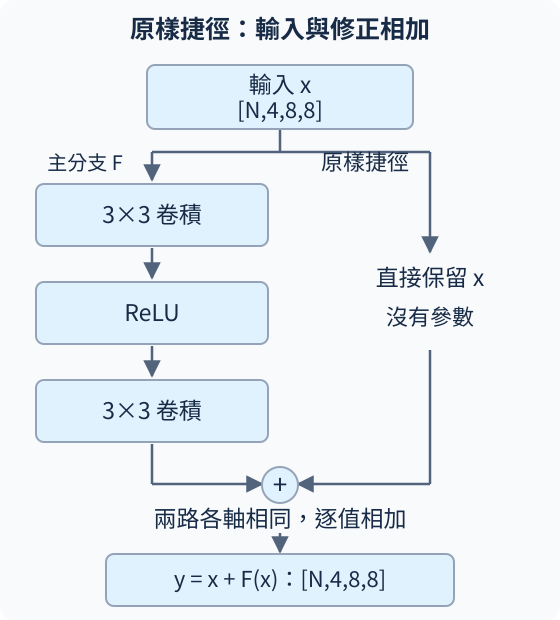

# A.3.1 ResNet 的原樣捷徑：讓網路學修正量

<details class="chapter-a-toc">
<summary>本頁目錄</summary>
<ul>
<li><a href="#_1">完整答案，改成原值加修正</a></li>
<li><a href="#_2">原樣相加，需要同一個形狀</a></li>
<li><a href="#0">第一個實驗：把修正設成 0，真的會原樣通過嗎</a></li>
<li><a href="#_3">為什麼多這條路，也影響反向傳播</a></li>
<li><a href="#_4">第二個實驗：主分支仍然會學</a></li>
<li><a href="#_5">停一下：加號不代表任何條件都成立</a></li>
<li><a href="#_6">實際執行紀錄</a></li>
</ul>
</details>

[在 Colab 執行本節](https://colab.research.google.com/github/birdhackor/learn_to_yolo/blob/lessons-v0.6.1/notebooks/03-identity.ipynb){ .md-button }

[A.1](01-small-cnn.md)把小卷積疊起來，讓特徵能結合較大範圍；[A.2](02-diagnostics.md)提醒我們，網路能否學得動還要檢查。順著這條路，會自然問：**一直加深，模型就一定更好嗎？**

2015 年 **ResNet（Residual Network，殘差網路）**論文觀察到一種困難：在其中的對照實驗，更深的普通網路，連訓練資料上的錯誤率都更高。作者稱它為**退化（degradation）**。這與「訓練很好、新資料很差」的問題不同，因為這裡連訓練題都沒有學好。

ResNet 的做法是保留一條較直接的路，把輸入送到後面，再由幾層網路提供修正。我們先研究最簡單的 **identity shortcut（原樣捷徑）**：輸入不經轉換，直接和另一條路的結果相加。

## 完整答案，改成原值加修正

把幾層卷積組成的小單位叫 **block（區塊）**。普通 block 直接學完整映射 $y=H(x)$；殘差 block 改成

\[
y=x+F(x).
\]

x 是 block 收到的特徵，H 是普通 block 學的完整映射，F 是殘差 block 可學的主分支，用來提供修正，y 是送到下一個 block 的特徵。這裡的輸出還不是紅／藍答案，而是分類前的中間表示。

假設同一個 block 收到不同輸入時，希望 5 變成 6、8 變成 9：兩者都需要加 1。普通 block 可以學共同規則 $H(x)=x+1$，直接給完整輸出 6 和 9；殘差 block 的捷徑已經提供 x，主分支只需學修正 $F(x)=1$，再得到 5+1=6、8+1=9。

普通網路也能學共同規則。殘差設計改變的是學習分工：捷徑直接提供已有的輸入值，主分支負責相對於它的修正。**Residual（殘差）**在這裡就是這個修正量。若理想做法是保持原樣，F 只要給 0，便有 y=x。

這些理想值是說明分工的假設。實際圖片分類只在網路最後用類別答案算 loss，再反向傳播調整各 block，並不替每個 block 另給「加 1」的教師答案。



看圖中的兩條路：一條經卷積學 F，另一條直接保留 x，最後逐值相加。這讓「暫時不必改的特徵」有明確的保留方式；是否因此學得更好，仍需要實驗，不能單靠這兩個假設證明。

## 原樣相加，需要同一個形狀

若輸入是 `[2,4,8,8]`，主分支也要給 `[2,4,8,8]`：一批 2 張、4 通道、每通道 8×8。加法對應同一張、同一通道、同一位置。

本節主分支用「3×3 卷積 → ReLU → 3×3 卷積」，兩個卷積都保持通道數、使用 padding=1 與 stride=1，因此高寬也不變。

``` { .python data-excerpt="lesson_cases/03-identity.py" }
class IdentityBlock(nn.Module):
    def __init__(self, channels):
        super().__init__()
        self.branch = nn.Sequential(nn.Conv2d(channels, channels, 3, padding=1, bias=False),
                                    nn.ReLU(),
                                    nn.Conv2d(channels, channels, 3, padding=1, bias=False))

    def forward(self, x):
        return x + self.branch(x)
```

捷徑本身沒有可學參數；主分支仍照常學習、照常計算。這個小 block 刻意省略原版的 BatchNorm（批次正規化）與相加後的 ReLU，讓「原樣通過」能直接核對。它是研究核心機制的簡化模型。

## 第一個實驗：把修正設成 0，真的會原樣通過嗎

先手動把主分支權重設成 0。因為這兩個卷積沒有 bias，F(x) 就是 0。輸入一張單通道 2×2 特徵圖：

\[
x=\begin{bmatrix}-2&-1\\0&1\end{bmatrix}.
\]

完整程式得到完全相同的 y，包含負數 −2、−1。**主分支內的 ReLU 不會碰到捷徑上的 x。**

``` { .python data-excerpt="lesson_cases/03-identity.py" }
x = torch.tensor([[[[-2.0, -1.0], [0.0, 1.0]]]], requires_grad=True)
y = block(x)
assert torch.equal(x, y)
y.sum().backward()
assert torch.equal(x.grad, torch.ones_like(x))
```

`requires_grad=True` 要求記錄輸入 x 的梯度。這次把 y 的全部值加成一個數，再求導，只是探查輸入如何影響輸出，沒有設定分類答案、沒有 optimizer 更新。每個輸入增加一點，總和便增加同樣多，所以輸入梯度都是 1。

## 為什麼多這條路，也影響反向傳播

A.0 用連鎖律把各段變化率乘起來。先用一個數看：如果主分支是 F(x)=0.1x，輸入每增加 1，這條分支的輸出只增加 0.1；沒有捷徑時，連過幾個這樣的分支，變化會連乘 0.1，往回的訊號也可能很小。

加上捷徑後，y=x+0.1x=1.1x，變化率變成 1+0.1。因為輸入走了兩條路，到相加處合流，反向時兩條路的貢獻也相加：

\[
\frac{dy}{dx}=1+\frac{dF}{dx}.
\]

1 來自原樣捷徑，另一項來自主分支。剛才 F=0，所以該探查的梯度剛好都是 1。真實 block 裡數字很多、分支不一定是 0，**總梯度不保證是 1，也不保證永遠不會消失**；例如 F(x)=−x 時，兩條路甚至會抵銷。

這個分析說明捷徑提供較直接的傳遞路徑。它不是把所有深網路訓練困難都歸因於梯度消失；原始 ResNet 論文的退化問題，也不等於只靠這一個原因就能解釋。

## 第二個實驗：主分支仍然會學

接著**另建一個正常隨機初始化的 block**，不沿用全零分支。輸入換成隨機特徵 `[2,4,8,8]`，目標是同形狀的全零 tensor。現在預測的是每個位置的數值，因此沿用 A.0 的 MSE，把 512 個數的平方誤差取平均。

SGD 學習率 0.05，在 CPU 更新 2 次，更新主分支的全部權重。這個合成目標只是檢查主分支能收到梯度並更新，不是圖片分類測試。

``` { .python data-excerpt="lesson_cases/03-identity.py" }
optimizer.zero_grad(set_to_none=True)
prediction = trained(inputs)
loss = nn.functional.mse_loss(prediction, target)
loss.backward()
assert trained.branch[2].weight.grad.abs().sum() > 0
optimizer.step()
```

兩次更新前 loss 約 1.0816、1.0724；最後一層卷積的梯度非零、權重前後不同。這次才有真的學習步驟。前一個全零算例只是驗證結構：兩層權重都設為零，在這個帶 ReLU 的設計裡還可能讓權重梯度也停在零，所以不應拿來當初始化建議。

到這裡我們知道：捷徑能原樣保留輸入、提供一條直接路徑，主分支則仍能學修正量。成本是主分支照算，另外多逐值加法。若下一個階段要縮小高寬、增加通道，原樣相加就辦不到，下一節處理這個問題。

## 停一下：加號不代表任何條件都成立

1. 在相加後補一個 ReLU，F=0 時，上面的負數還會原樣通過嗎？
2. 捷徑保證總梯度非零嗎？用 F(x)=−x 試想。

??? note "核對想法"

    1. 不會。相加後的 ReLU 會把負數截成 0。原始 ResNet 的一些 block 有這個操作，不能把本節無後置 ReLU 的等式直接套到它們。
    2. 不保證。y=x−x=0，變化率 1−1=0。捷徑增加直接項，但另一條路也影響總結果。

??? note "選讀：與原版 ResNet 的關係"

    [ResNet 原論文（2015）](https://arxiv.org/abs/1512.03385)提出殘差學習與深層訓練退化的對照；圖 1 顯示 CIFAR-10 上 56 層普通網路的訓練錯誤率高於 20 層。原模型包含 BatchNorm（批次正規化，用一批資料的統計調整特徵尺度），本節未加入。

    [Identity Mappings（2016）](https://arxiv.org/abs/1603.05027)進一步分析原樣捷徑與不在相加後套 activation 的直接路徑。本節保留兩層之間的 ReLU，但省略相加後的 activation，正是為了讓本節的原樣通過與梯度算例條件明確。

接著讀 [A.3.2：形狀不同時的投影捷徑](03-projection.md)。

<!-- curriculum-evidence:start -->

## 實際執行紀錄

本節的完整程式於 2026-10-07 在 AMD EPYC 9V74 80-Core Processor（2 個執行緒）上用 PyTorch 2.9.1+cpu 執行，程式裡的 assert 全部通過。下面是那次印出的原始輸出；輸出裡若有計時或訓練得到的數字，換一台電腦會略有不同。每個數字的意思，以本頁正文的說明為準。[完整紀錄（JSON）](https://github.com/birdhackor/learn_to_yolo/blob/main/artifacts/checks/curriculum/03-identity.json)

??? example "展開本次實際輸出"

    ```text
    x=[-2.0, -1.0, 0.0, 1.0], y=[-2.0, -1.0, 0.0, 1.0]
    input_gradient=[1.0, 1.0, 1.0, 1.0]; negatives_preserved=True
    step=0, shape=(2, 4, 8, 8), loss=1.0816
    step=1, shape=(2, 4, 8, 8), loss=1.0724
    random branch updated; this does not measure ResNet classification quality
    ```

<!-- curriculum-evidence:end -->
