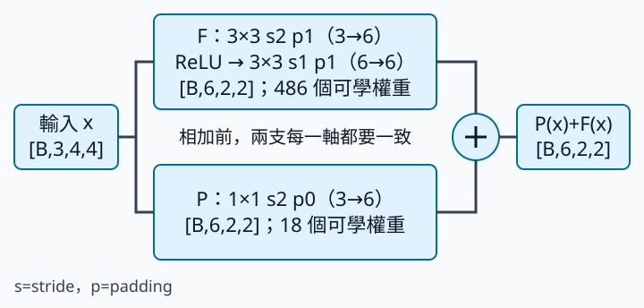

# ResNet projection shortcut：對齊形狀也在學轉換

從一個stage進入下一個stage時，我們常縮小特徵圖、增加channel。若主分支輸出 `[B,6,2,2]`，輸入卻是 `[B,3,4,4]`，直接相加不合法。Projection shortcut先把輸入轉成合適形狀，才加入主分支。前置只需知道NCHW與卷積stride；本頁也重新說明兩種shortcut的差異。

歷史機制來自 [ResNet 原始論文](https://arxiv.org/abs/1512.03385)：用可學的projection處理尺寸或channel不同的shortcut。本節省略BatchNorm與相加後activation，保留一個小型跨stage block；它不是完整ResNet效果重現。

[在 Colab 執行](https://colab.research.google.com/github/birdhackor/learn_to_yolo/blob/lessons-v0.1.0/notebooks/03-projection.ipynb)，或 `PYTHONPATH=. python lesson_cases/03-projection.py`。CPU實驗先用固定權重驗證一個channel混合數值，再用新建隨機block做2步更新。

## 先把兩支畫出來



B是一次輸入的圖片筆數；stage是一組通常保持相同空間解析度的blocks。主分支F第一層是3→6channel、3×3、padding1、stride2，把4×4變2×2；第二層是6→6channel、3×3、padding1、stride1，保留shape。Shortcut P是1×1卷積、padding0，同樣3→6channel、stride2。兩支輸出都為 `[B,6,2,2]`，相加得到：

\[
y=P(x)+F(x).
\]

同shape的identity用 \(P(x)=x\)，直接透過且沒有可學權重；本節的P需要學習，所以「shortcut保留資訊」不能解釋成「逐值複製原輸入」。甚至當F=0，y也只是P(x)，不是x。

## 1×1 卷積看不到鄰居，卻能混合channel

在某個位置，三個輸入channel的值是1、10、100。如果某個輸出channel的權重是1、2、3，輸出就是：

\[
1\times1+2\times10+3\times100=321.
\]

這與任何單一輸入值都不同。1×1的「1」指空間只看一個位置，不是隻讀一個channel。每個輸出channel都有一套跨輸入channel的權重。本例無bias，因此參數是 \(6\times3=18\) 個。

Stride2會讀取間隔2的位置。4×4輸入的1×1卷積在座標0、2取樣，輸出2×2；它不是2×2平均池化，也不保證保留所有細節。主分支3×3則同時看鄰近範圍，因此兩支即使shape一致，數值來源也不同。

## Shape與程式對照

```python
self.projection = nn.Conv2d(3, 6, 1, stride=2, bias=False)
main, shortcut = self.branch(x), self.projection(x)
assert main.shape == shortcut.shape
y = main + shortcut
```

projection的weight shape是 `[6,3,1,1]`；輸入為 `[1,3,4,4]`、輸出 `[1,6,2,2]`。人工部分將F全部設0、P除了第一輸出channel外設0，第一輸出channel每點應為321。這個已知答案幫你確認channel軸與stride，而不是用隨機數「大概看起來差不多」。

第二部分另建隨機block，用 `[2,3,4,4]` 輸入、`[2,6,2,2]` 零target，MSE反傳；程式確認P的gradient非零、兩步後權重改變。隨機分支纔是訓練路徑檢查，人工全0分支不作訓練建議。

## 收益與代價，要分開算

收益是主分支與shortcut可以跨stage相加，也能學習channel轉換。這個小block的兩個3×3卷積有486個參數，加P的18，總共 **504**。P還增加每圖72次乘加（MAC，一個乘積累加到答案）；相加另有24個位置值。這些數字不包含記憶體存取與activation，不能直接當作實際延遲。

空間縮小有助降低後續計算，代價是小物件細節可能消失。增加channel可提高表示容量，代價是更多參數與計算。把兩支shape改到能相加只是合法forward的條件，還沒有證明這個設計比plain network更準。

## 核對與常見錯誤

程式應印出四個shape、第一輸出channel為 `[[321,321],[321,321]]`，並透過P更新與504參數的assertion，至此即可停止。不要把1×1稱為「不做計算的通道」，不要只在主分支降取樣後將shortcut丟掉，也不要用任意reshape湊出同shape；那會改變位置與channel意義。

偶數輸入很容易對齊，但換成奇數也要重新確認卷積公式。若F用無padding的3×3、P仍用1×1，兩支可能不同，不能只靠stride相同推斷。

## 自主練習與答案

只把人工部分輸入4×4改成5×5，卷積設定不變，第二個隨機訓練檢查仍用4×4。答案：F第一層輸出 \(\lfloor(5+2-3)/2\rfloor+1=3\)，P輸出 \(\lfloor(5-1)/2\rfloor+1=3\)，所以兩支都是3×3。同步把人工部分的 `output.shape` assertion改為 `(1,6,3,3)`，`torch.full((2,2),321.0)` 改為 `torch.full((3,3),321.0)`。第一channel仍為321。再把P stride改1：P成5×5而F仍3×3，shape assertion應失敗；下一步是修正設計，不是移除assertion。
