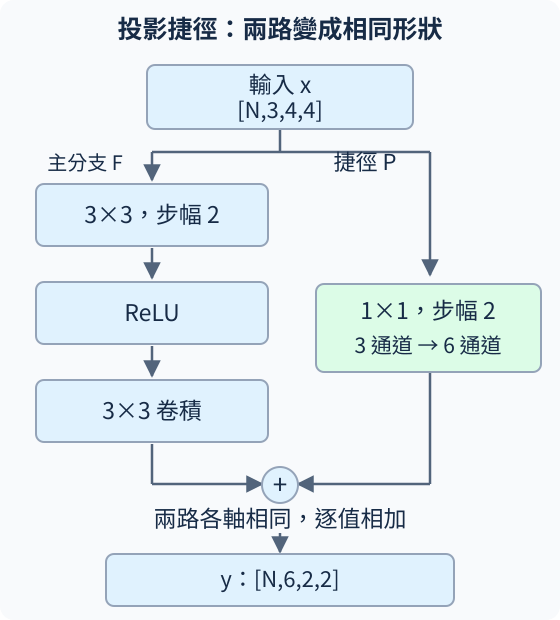

# A.3.2 形狀不同怎麼相加：投影捷徑也會學

<details class="chapter-a-toc">
<summary>本頁目錄</summary>
<ul>
<li><a href="#_1">兩條路各怎麼改形狀</a></li>
<li><a href="#11">1×1 只是不看鄰居，仍然能看所有通道</a></li>
<li><a href="#_2">核對程式：主分支與捷徑一起訓練</a></li>
<li><a href="#_3">第一個實驗：先手工指定權重，看它讀了什麼</a></li>
<li><a href="#p">第二個實驗：P 不是固定的尺寸修補</a></li>
<li><a href="#_4">停一下：分開空間、通道與原樣通過</a></li>
<li><a href="#_5">實際執行紀錄</a></li>
</ul>
</details>

[在 Colab 執行本節](https://colab.research.google.com/github/birdhackor/learn_to_yolo/blob/lessons-v0.6.1/notebooks/03-projection.ipynb){ .md-button }

[A.3.1](03-identity.md)的原樣捷徑要求 x 和 F(x) 形狀相同。現在希望下一階段**把空間縮小，並增加特徵通道**：從 `[1,3,4,4]` 變成 `[1,6,2,2]`。主分支已經改形狀，原輸入就不能直接加上去。

這次捷徑也放一個可學的轉換 P，先把 x 轉成對得上的形狀：

\[
y=F(x)+P(x).
\]

這叫 **projection shortcut（投影捷徑）**。在本節，「投影」指可學的線性轉換，不要求它是幾何課的垂直投影。它仍是較短的路，但已經不是原樣通過。

## 兩條路各怎麼改形狀

主分支第一個 3×3 卷積把 3 通道變成 6，stride=2、padding=1，讓高寬 4→2；接 ReLU，再接保持形狀的 3×3 卷積。

捷徑用 **1×1 卷積**把 3 通道變成 6，stride=2、不補邊，也讓高寬 4→2。兩路最後都是 `[1,6,2,2]`，再逐值相加。



依 A.1 的輸出公式，主分支長度是 $\lfloor(4+2-3)/2\rfloor+1=2$，捷徑則是 $\lfloor(4-1)/2\rfloor+1=2$。kernel 不同，也可以得到相同輸出尺寸。

## 1×1 只是不看鄰居，仍然能看所有通道

A.1 已把「空間尺寸」與「通道深度」分開。這裡一個 1×1 濾鏡的完整形狀是 `[3,1,1]`：同一位置讀 3 個通道值，用 3 個獨立權重相乘加總。

假設每個位置收到 `[1,10,100]`，第一個輸出通道的權重是 `[1,2,3]`，沒有 bias，得到

\[
1\times1+2\times10+3\times100=321.
\]

換另一套 3 個權重，就能產生另一個輸出通道。6 套排成 6×3 矩陣，便是 A.0 的矩陣乘加在每個空間位置重複使用。PyTorch 權重形狀為 `[6,3,1,1]`，一共 18 個參數。

因此 1×1 卷積能**混合通道**，只是不能單靠這一層讀周圍位置。stride=2 則讓它每次跳兩格取樣，減少輸出位置。

## 核對程式：主分支與捷徑一起訓練

``` { .python data-excerpt="lesson_cases/03-projection.py" }
class ProjectionBlock(nn.Module):
    def __init__(self):
        super().__init__()
        self.branch = nn.Sequential(nn.Conv2d(3, 6, 3, stride=2, padding=1, bias=False),
                                    nn.ReLU(), nn.Conv2d(6, 6, 3, padding=1, bias=False))
        self.projection = nn.Conv2d(3, 6, 1, stride=2, bias=False)

    def forward(self, x):
        main, shortcut = self.branch(x), self.projection(x)
        assert main.shape == shortcut.shape
        return main + shortcut
```

這次把兩路形狀檢查放進 forward：我們要求各軸完全一致，對應同一批資料與位置。PyTorch 的某些不同形狀還可能透過 broadcasting（廣播，把大小為 1 的軸擴展）算得出加法，但那不等於本節要的逐值對應。

## 第一個實驗：先手工指定權重，看它讀了什麼

先讓主分支為 0，捷徑也設為 0，只給第一個輸出通道 `[1,2,3]`。輸入的每個位置都放 `[1,10,100]`，得到第一個通道 `[[321,321],[321,321]]`，其餘通道都是 0。這核對了通道混合，但整張都相同，還看不出捷徑取了哪些位置。

再用一張**位置探針**：輸入通道 0 的第 row 列、第 col 欄放 $10\times row+col$，列與欄由 0 起算；其他通道都是 0。

\[
\begin{bmatrix}0&1&2&3\\10&11&12&13\\20&21&22&23\\30&31&32&33\end{bmatrix}
\quad\longrightarrow\quad
\begin{bmatrix}0&2\\20&22\end{bmatrix}.
\]

第一個輸出通道對通道 0 的權重是 1，因此結果直接顯示：**stride=2 讀的是列 0、2，欄 0、2。**這條 1×1 捷徑沒有平均其他位置；主分支的 3×3 仍可能讀到那些鄰近位置。

為什麼不能只驗 shape？若誤寫 stride=3，4×4 仍會得到 2×2，但探針變成 `[[0,3],[30,33]]`，讀的位置不同。相同尺寸只證明可以相加，沒有證明內容對應正確。這是小變化檢查比單純背形狀更有用的地方。

## 第二個實驗：P 不是固定的尺寸修補

接著另建隨機初始化 block，輸入 `[2,3,4,4]` 的隨機數，目標是 `[2,6,2,2]` 的零。因為仍是每格的數值目標，使用 MSE；SGD 學習率 0.05，在 CPU 更新 2 次。

``` { .python data-excerpt="lesson_cases/03-projection.py" }
optimizer = torch.optim.SGD(learned.parameters(), lr=0.05)
before = learned.projection.weight.detach().clone()
```

`learned.parameters()` 包含 F 與 P 的權重。完整程式每步確認 P 的梯度非零，更新後也確認 P 權重不同於 before。因此 **P 的讀法會隨 loss 調整**，不只是把陣列改形狀。

這個 block 共 504 個參數：主分支 $6\times3\times3\times3+6\times6\times3\times3=486$，捷徑 18。比原樣捷徑多了參數與運算，也不再保證輸入直接保留；反向傳播要經過 P 的權重，不會自帶 identity 的固定 1 項。

這兩步只驗證捷徑收到梯度並更新，沒有分類資料、沒有新圖評估，不能用來比較分類能力。下一節才把同形狀的 block 放進分類網路，正式比較有、沒有捷徑的兩條路線。

## 停一下：分開空間、通道與原樣通過

1. 1×1 卷積把 3 通道變成 6，需要 1 個權重還是 18 個？
2. shape 完全相同，為什麼仍要位置探針？
3. P 的權重全為 0，F 也為 0，輸出還會等於原輸入嗎？

??? note "核對想法"

    1. 沒有 bias 時是 18 個。1×1 只描述空間範圍，每個輸出通道仍需讀 3 個輸入通道。
    2. 不同步幅或取樣方式可能得到相同尺寸，卻讀取不同位置。探針把位置編進數值，能抓出這個差異。
    3. 不會，輸出全為 0。原樣捷徑是 x，這次捷徑是可學的 P(x)。

??? note "選讀：形狀改變也有其他處理方式"

    [ResNet 原論文](https://arxiv.org/abs/1512.03385)也討論用取樣與補零增加通道等方法。本節選可學的 1×1 projection，並不表示它是唯一能對齊形狀的設計。

    本節與 A.3.1 一樣省略 BatchNorm 與相加後的 ReLU，保留主分支兩層之間的 ReLU。若更換捷徑取樣方式，就要重新說明位置探針的預期；探針與本節不同不自動代表設計不好。

接著讀 [A.3.3：有沒有捷徑，如何公平比較](03-comparison.md)。

<!-- curriculum-evidence:start -->

## 實際執行紀錄

本節的完整程式於 2026-10-07 在 AMD EPYC 9V74 80-Core Processor（2 個執行緒）上用 PyTorch 2.9.1+cpu 執行，程式裡的 assert 全部通過。下面是那次印出的原始輸出；輸出裡若有計時或訓練得到的數字，換一台電腦會略有不同。每個數字的意思，以本頁正文的說明為準。[完整紀錄（JSON）](https://github.com/birdhackor/learn_to_yolo/blob/main/artifacts/checks/curriculum/03-projection.json)

??? example "展開本次實際輸出"

    ```text
    input=(1, 3, 4, 4), main=(1, 6, 2, 2), projection=(1, 6, 2, 2), output=(1, 6, 2, 2)
    first output channel=[[321.0, 321.0], [321.0, 321.0]]; 1*1 + 2*10 + 3*100 = 321
    position probe (input channel 0 = 10*row + col): first output channel=[[0.0, 2.0], [20.0, 22.0]]
    step=0, loss=0.3553
    step=1, loss=0.3350
    projection changed; block parameters=504; no classification-quality claim
    ```

<!-- curriculum-evidence:end -->
