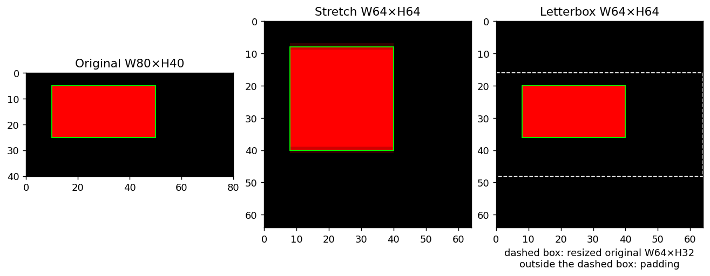

# B.4.2 座標轉換與還原：框跟圖片一起移動

[在 Colab 執行本節](https://colab.research.google.com/github/birdhackor/learn_to_yolo/blob/lessons-v0.6.1/notebooks/04-coordinates.ipynb){ .md-button }

上一節把框畫在 32×32 圖上，模型也按這個固定尺寸設計。換成寬 80、高 40 的照片，得先整理成模型所需的尺寸；同一個 batch 的圖也需要相同大小才能疊成 tensor。本節獨立練習幾何轉換，選 **64×64 畫布**作示範；若要接上一節的定位器，則須選它需要的 32×32。尺寸改了，標註的位置也必須跟著改；模型在輸入上預測的框，最後還得畫回原圖。

本節只處理這趟幾何往返，不訓練模型。沿著同一個紅色矩形，看看拉伸和補邊各改了什麼，怎樣記下轉換，才不會回程時把框畫錯位置。

## 圖片變大小，框的數字也要跟著變

原圖是黑底 RGB 圖，寬 W=80、高 H=40，tensor 為 `[3,40,80]`，順序是通道、高、寬。紅色矩形的真值 xyxy 框是 `[10,5,50,25]` px，寬 40、高 20。沿用上一節的半開區間，它蓋住 x=10～49、y=5～24 的畫素，寬高不加 1。

要放進 64×64，有兩種直接的安排。**Stretch（拉伸）**各軸縮到指定長度，不補邊；**letterbox**先盡量保持長寬比縮放，再在空出的地方補邊。補邊後整張 64×64 稱為**輸入畫布**，既包含原圖內容，也包含新增的邊。

先算 stretch：水平比例 \(s_x=64/80=0.8\)，垂直比例 \(s_y=64/40=1.6\)。x 座標乘 0.8、y 乘 1.6，框便成為 `[8,8,40,40]`；原本寬 40、高 20 的紅矩形，被拉成 32×32 正方形。

letterbox 希望整張圖放得進去，又不任意拉長其中一軸，所以先取

\[
s=\min(64/80,64/40)=0.8.
\]

取 1.6 會讓寬變成 128、超出畫布；取 0.8 則縮成寬 64、高 32。剩下 32 列，上下各補 16。框先乘 0.8 得 `[8,4,40,20]`，再把兩個 y 各加 16，得 `[8,20,40,36]`。


從左邊原圖的綠框追到右邊：綠框始終框住同一個紅色物件。右圖中間的深色帶是縮放後的原圖，上下灰帶是補邊。灰色只是圖解的標示，實際程式補的是 0（黑色）。



最右格的白色虛線圈出縮放後的原圖範圍，y 從 16 到 48；線外黑色才是補邊。它只是顯示標記，不改畫素值。逐格比較同一紅矩形：stretch 拉高了物件，letterbox 保留原來的長寬比，三個綠框則都跟著各自的圖片轉換。可[查看原尺寸對照圖](../assets/diagrams/04-coordinates-panel.png)核對刻度。

保留形狀也有代價。stretch 後物件占 32×32=1024 個畫素；letterbox 後只有 32×16=512 個，4096 格畫布中有 2048 格是補邊。letterbox 用一部分輸入空間換取長寬比；它不是無代價地保留所有原圖細節。訓練與推論的補邊值也要一致，模型才會看到相同的前處理方式。

## 同一個框，現在在哪個座標空間

兩種框都叫 xyxy，也都可用 px 表示，卻不在同一張圖上。原圖的 `[10,5,50,25]` 與輸入畫布的 `[8,20,40,36]` 指的是同一物件；後者再除以 64，才是**相對輸入畫布**的正規化座標。

| 框所在空間 | xyxy | 數字相對哪張圖 |
| --- | --- | --- |
| 原圖 | `[10,5,50,25]` px | 寬 80、高 40 的原圖 |
| Letterbox 輸入 | `[8,20,40,36]` px | 64×64，含補邊的畫布 |
| 輸入正規化 | `[0.125,0.3125,0.625,0.5625]` | 畫布座標各除以 64 |

因此「值在 0～1」還不夠，必須知道它相對哪個空間。把最後一列直接乘原圖 W、H，會得到 `[10,12.5,50,22.5]`：x 碰巧正確，y 卻縮回原圖中央，因為上下補邊沒有被扣掉。

回程要依序撤銷去程。用 \(x,y\) 表示原圖座標、\(x',y'\) 表示畫布座標，\(p_x,p_y\) 是左方與上方補邊量：

\[
x'=s_xx+p_x,\qquad y'=s_yy+p_y;
\]

\[
x=(x'-p_x)/s_x,\qquad y=(y'-p_y)/s_y.
\]

x1、x2 都走 x 的式子，y1、y2 都走 y 的式子。本例 letterbox 的 sx=sy=0.8、px=0、py=16，所以 y1=(20−16)/0.8=5、y2=(36−16)/0.8=25。若先除 0.8 再減 16，y1 會變成 9，順序錯了。

手上若是表格最後一列的比例，完整回程就是：先乘 64 得 `[8,20,40,36]`；減補邊 `[0,16,0,16]` 得 `[8,4,40,20]`；再除 0.8，還原 `[10,5,50,25]`。**先回到畫布畫素，再去補邊、去縮放。**

??? note "選讀：為什麼直接乘原圖寬高，有時看似沒錯"

    沒補邊的 stretch，畫布框 `[8,8,40,40]` 除以 64，等於原圖框各軸除以 W、H，都是 `[0.125,0.125,0.625,0.625]`，因此可直接乘回。letterbox 的垂直比例則是 (0.8y+16)/64，乘 H=40 得 0.5y+10，不是 y；代入 y=5、25 就得到錯誤的 12.5、22.5。水平方向沒有補邊，0.8×80=64，才會碰巧抵消。

裁切也不能代替回程。假設預測 y1=10，位在上方補邊，還原後是 (10−16)/0.8=−7.5。若使用時要框留在原圖內，可以**還原後**再把 x 夾到 0～W、y 夾到 0～H，此例得到 0。只在畫布上夾到 0～64，10 本來就在範圍內，什麼也沒改。本節的 `undo()` 只還原，不做這項裁切。

## 把每張圖的去程記下來

回程需要的資訊屬於**這張圖**。若下一張圖寬高不同，比例與補邊也可能不同；一個 batch 不能全部套第一張的紀錄。程式把它們保存成 metadata（變換紀錄）：比例 `[sx,sy,sx,sy]`、補邊 `[left,top,left,top]`、原圖與實際縮圖的高寬。

框計算使用浮點數，因為比例和結果可能有小數。以 `[N,4]` 存 N 個框，下面每一列都做同樣的轉換：

```python
# sx、sy、left、top 已由這張圖算好；四個數沿用 xyxy 順序
scales = torch.tensor([sx, sy, sx, sy])
padding = torch.tensor([left, top, left, top])
input_boxes = original_boxes * scales + padding
original_boxes_again = (input_boxes - padding) / scales
```

這些是逐元素運算。`scales`、`padding` 為 `[4]`，PyTorch 會將它們套到 `[N,4]` 的每一列，稱為 **broadcast（廣播）**：先把 `[4]` 看成 `[1,4]`，長度 1 的圖片框軸再延伸成 N。主例 `[[10,5,50,25]]` 就依序成為 `[[8,4,40,20]]`、`[[8,20,40,36]]`。

沒有物件時仍保留每框四個數的形狀，寫成 `torch.empty(0,4)`，轉換後也是 `[0,4]`。`torch.tensor([])` 卻是 `[0]`，與 `[4]` 的長度 0、4 都不是 1，不能廣播，會報 shape 錯誤。

??? note "操作選讀：完整程式的兩個函式與整數框"

    `letterbox(image, boxes, size=64)` 接 `[3,H,W]` 圖片與 `[N,4]` 原圖框，回傳畫布、畫布框、metadata 字典。四個鍵是 `scale_xyxy`、`padding_xyxy`、`original_hw`、`resized_hw`；`hw` 一律先高後寬。`undo(boxes, metadata)` 算 `(boxes-padding_xyxy)/scale_xyxy`，輸入必須是畫布 px，比例先乘 64。

    `letterbox()` 若收到整數框，先轉 float32。原因是比例向量用 `boxes.new_tensor(...)` 建立，會沿用框的 dtype：整數 dtype 會把 0.8 截成 0。未轉換時，框乘完只剩 `[0,16,0,16]`，回程每項都成為 0÷0，得到 NaN（Not a Number，非有效數值）。程式另外確認整數標註的回程為有限數、能還原原框。直接寫 `torch.tensor([0.8])` 預設是 float32，不會有這個沿用 dtype 的問題。

## 往返成功，還得問框有沒有貼齊縮圖

主例寬高乘 0.8 都是整數。換成寬 83、高 37，理想比例 64/83≈0.7711，寬變 64，高卻是 28.53，圖片必須取整成 **29×64**。實際水平比例是 64/83，垂直比例是 29/37≈0.7838，兩軸有小差異。上下總共補 35 列，上 17、下 18；縮圖下緣在 y′=17+29=46。

若框仍用同一個理想比例，原圖下緣 y=37 會落在哪裡？

| 框的比例約定 | 畫布下緣 y′ | 同一比例去、回可還原？ | 貼齊真正縮圖下緣 46？ |
| --- | --- | --- | --- |
| x、y 都用 64/83 | 17＋37×64/83≈45.53 | 可以 | 差約半個畫素 |
| x 用 64/83，y 用 29/37 | 17＋37×29/37=46 | 可以 | 可以 |


圖中 y 向下，藍色虛線 45.53 比內容下緣略高；綠線 46 才與縮圖邊界一致。本節採第二列，框和 metadata 都記**實際尺寸比例** `new_w/W`、`new_h/H`。這樣去程對齊 resize 的尺寸，回程也使用同一份紀錄。其他實作可能保留理想比例並容忍取整差異，要先確認其約定。

這也解釋了兩種檢查的用途：自己乘某個比例，再除同一比例，可以往返成功；只有另外對照真正縮放的圖片，才知道框是否跟圖片一起變了。

??? note "選讀：取整與浮點誤差"

    程式用 Python `round()` 取最接近的整數，剛好 0.5 時取偶數。例如寬 128、高 57，理想縮圖高 28.5 會取 28。補邊總量若是奇數，left／top 用整數除法向下取整，另一邊多 1：35//2=17，所以此例上 17、下 18。

    往返用 `torch.allclose`，容許 float32 的微小誤差。0.8 實際存成約 0.800000011920929；奇數例的 `[7,3,70,31]` 還原後印成 `[7.0,2.9999992847442627,70.0,31.000001907348633]`。`.tolist()` 轉成 Python 清單才顯示這麼多位，直接印 tensor 通常看成四位小數。這是數值精度，不是框被移動了一個畫素。

## 實際程式檢查了什麼

在 Colab 執行，或本機跑 `PYTHONPATH=. python lesson_cases/04-coordinates.py`，只用 CPU 做幾何計算。主例應印出 `original_hw=(40,80)`、`resized_hw=(32,64)`、letterbox 框 `[[8,20,40,36]]`、restored 框 `[[10,5,50,25]]`，以及 stretch 框 `[[8,8,40,40]]`。圖上的 `W80×H40` 是先寬後高，和 `hw` 順序不同。

| 檢查 | 核對什麼 | 本次判準 |
| --- | --- | --- |
| 往返 | 主例、整數標註、奇數尺寸、空框能轉回原框 | `torch.allclose` 容許極小誤差；空框仍為 `[0,4]` |
| 圖與框對齊 | 主例畫布上的紅區是否等於 `[8,20,40,36]` | 從圖片量出四邊，與轉換框精確比對 |

主例四邊剛好在整數格線上，紅區可精確等於框；經插值後的任意物件邊緣不一定如此。以上通過只說明這些幾何例子接對，沒有模型預測或定位效果。三格圖存成 `artifacts/04-coordinates.png`。

??? note "選讀：用 where() 量紅區，及插值後的 0.5 門檻"

    輸出的 `red_pixel_box=[8, 20, 40, 36], equal to the letterbox box` 一行，報告的是另一項檢查：框有沒有對準圖片內容。`letterbox()` 回傳畫布 `canvas` 和畫布上的框 `transformed` 之後，完整程式用下面三行直接從畫布量出紅色物件的範圍，再和框比對；斷言通過，才會印出這一行：

    ``` { .python data-excerpt="lesson_cases/04-coordinates.py" }
    ys, xs = torch.where(canvas[0] > .5)
    red_pixel_box = [xs.min().item(), ys.min().item(), xs.max().item() + 1, ys.max().item() + 1]
    assert red_pixel_box == transformed[0].tolist()
    ```

    `canvas[0]` 是畫布的紅色 channel，`canvas[0] > .5` 逐格判斷紅色值是否大於 0.5，得到 64×64、每格是 True 或 False 的 tensor。只給一個條件時，`torch.where` 回傳兩個 tensor，分別是所有 True 位置的列號和欄號；圖片索引是 y 在前，所以先得到 `ys`，再得到 `xs`。`.item()` 把只含一個數的 tensor 取成普通的 Python 數字。本例紅色畫素的 x 是 8～39、y 是 20～35；照本頁開頭的半開區間約定，右下角用最後一個畫素的編號加 1，寫成框就是 `[8,20,40,36]`。`transformed[0].tolist()` 是第一個（也是唯一一個）框 `[8.0, 20.0, 40.0, 36.0]`，兩者相同，表示框跟著圖片一起移動之後，仍剛好框住物件。這裡可以用 `==` 直接比較，不必像往返那樣用 `torch.allclose`，因為本例框的四個邊都剛好落在畫素之間的格線上，四個座標都是整數；邊若落在兩條格線之間（例如前面用理想比例算出的 45.53），量出來的整數範圍就不可能和它完全相等。Python 比較時也把 8 和 8.0 當成相等（印出的畫素編號是整數，所以沒有 `.0`）。

    挑紅色畫素用的是「大於 0.5」，而不是「等於 1」，因為縮放時每個新畫素是原圖鄰近畫素的加權平均，物件邊緣可能出現介於 0 和 1 之間的值，例如對照圖 stretch 那一格，紅色物件上下緣的暗紅細線；0.5 是 0 和 1 的正中間，過半才算紅色。letterbox 這張畫布剛好沒有這種中間值，只有 0 和 1。


## 自主練習與答案

**練習 1：高比寬大的直立圖。** 把原圖改成高 H=80、寬 W=40，框改成 `[5,10,25,50]`。先自己算，再展開答案：

1. letterbox 的比例 \(s\) 是多少？
2. 縮放後的寬、高各是多少？
3. 補邊補在哪個方向？各補多少？
4. 畫布上的新框是什麼？
5. 回程怎麼算？
6. 如果改用 stretch，\(s_x\)、\(s_y\) 各是多少？框變成什麼？

??? note "參考答案"

    1. \(s=\min(64/40,64/80)=\min(1.6,0.8)=0.8\)。
    2. 寬 40×0.8=32、高 80×0.8=64，也就是縮成寬 32、高 64。
    3. 寬還剩 64−32=32，所以左右各補 16；上下不補。
    4. x 乘 0.8 再加 16，y 只乘 0.8：x1=5×0.8+16=20、y1=10×0.8=8、x2=25×0.8+16=36、y2=50×0.8=40，新框是 `[20,8,36,40]`。
    5. x 先減 16，再除 0.8；y 直接除 0.8，因為上方沒有補邊。
    6. \(s_x=64/40=1.6\)、\(s_y=64/80=0.8\)，框變成 `[8,8,40,40]`，剛好和主例的 stretch 結果一樣。

想用程式核對練習 1，可以不動原本的程式。先照 notebook 的順序，執行環境格和「本節可修改的完整實驗」那一格，`letterbox()` 和 `undo()` 才會存在；再在 notebook 最後新增一格，貼上下面的程式執行。這樣就不必去改完整程式的 `main()`：它用斷言（assert）把主例的預期答案寫死了。

第二行把紅色 channel 中 y=10～49、x=5～24 的範圍塗成 1，正好對應框 `[5,10,25,50]`。圖片索引是 y 在前，框的 xyxy 卻是 x 在前，這裡最常寫反，上一節也提醒過這個順序差別。從 `torch.where` 開始的三行，用和完整程式一樣的方法量出畫布上紅色物件的範圍，再和新框比對。

```python
portrait = torch.zeros(3, 80, 40)  # [channel, 高, 寬]
portrait[0, 10:50, 5:25] = 1  # [channel, y 範圍, x 範圍]；channel 0 是紅色
portrait_box = torch.tensor([[5., 10., 25., 50.]])
portrait_canvas, mapped, meta = letterbox(portrait, portrait_box)
assert meta['resized_hw'] == (64, 32)  # (高, 寬)
assert torch.allclose(mapped, torch.tensor([[20., 8., 36., 40.]]))
assert torch.allclose(undo(mapped, meta), portrait_box)
ys, xs = torch.where(portrait_canvas[0] > .5)  # 畫布上紅色畫素的列號、欄號
red_pixel_box = [xs.min().item(), ys.min().item(), xs.max().item() + 1, ys.max().item() + 1]
assert red_pixel_box == mapped[0].tolist()
stretched = portrait_box * torch.tensor([1.6, .8, 1.6, .8])  # 第 6 題的 stretch
assert torch.allclose(stretched, torch.tensor([[8., 8., 40., 40.]]))
print(f"red_pixel_box={red_pixel_box}")
```

全部斷言通過時，最後一行印出 `red_pixel_box=[20, 8, 36, 40]`，和第 4 題的新框相同。若第二行寫反成 `portrait[0, 5:25, 10:50]`，紅色物件就塗錯了地方（寬只有 40，`10:50` 實際只塗到第 39 欄），紅色畫素的框變成 `[24, 4, 48, 20]`，`assert red_pixel_box == mapped[0].tolist()` 這一行會報 AssertionError（斷言不成立時 Python 發出的錯誤）；其他斷言都不看畫素內容，抓不到這個錯。

??? note "想直接改原本的 main() 時"

    `main()` 是完整程式裡執行主例的函式，全文在「本節可修改的完整實驗」那一格（notebook 原本的最後一格）。若想直接改它來做練習 1，要一起改這幾處：

    - 原圖 `torch.zeros(3, 40, 80)` 改成 `torch.zeros(3, 80, 40)`。
    - 物件切片 `image[0, 5:25, 10:50]` 改成 `image[0, 10:50, 5:25]`。
    - 框 `[[10., 5., 50., 25.]]` 改成 `[[5., 10., 25., 50.]]`。
    - letterbox 的預期答案 `[[8., 20., 40., 36.]]` 改成 `[[20., 8., 36., 40.]]`。
    - stretch 比例 `[.8, 1.6, .8, 1.6]` 改成 `[1.6, .8, 1.6, .8]`；stretch 的預期答案 `[[8., 8., 40., 40.]]` 不用改。

    往返、紅色物件範圍、整數標註與空框的檢查不要刪掉。紅色物件範圍的檢查比對的是程式自己算出的框，不用改；照上面改完，會印出 `red_pixel_box=[20, 8, 36, 40], equal to the letterbox box`。物件切片若沒改、仍是 x 範圍寫在前面的 `image[0, 5:25, 10:50]`，這個檢查會報錯。對照圖也會自動跟著變：第一格的標題變成 `Original W40×H80`，letterbox 那格的白色虛線框改在 x 從 16 到 48，虛線框左右兩側是補邊。

**練習 2：為什麼不加 1？** 有些程式把框寬算成 x2−x1+1。本節的框為什麼不加 1？如果在本節的框上混用加 1，會改變什麼？

??? note "參考答案"

    本書採半開區間的約定：座標是畫素之間的格線，框寬就是 x2−x1。本例 x 從 10 到 50，蓋住第 10～49 號畫素，正好 40 個。加 1 屬於另一種約定：把 x2 記成「最後一個畫素的編號」，頭尾都算。

    如果在本書的框上混用加 1，本例寬會變 41、高變 21，面積是 41×21=861，而不是 40×20=800。IoU（交集面積除以聯集面積）也會跟著變：上一節兩個 12×12、交集 10×10 的框，IoU 是 100/188≈0.532；寬高都多算 1 後，兩框變 13×13、交集 11×11，IoU 變成 121/217≈0.558。

<!-- curriculum-evidence:start -->

## 實際執行紀錄

本節的完整程式於 2026-10-08 在 AMD EPYC 9V74 80-Core Processor（2 個執行緒）上用 PyTorch 2.9.1+cpu 執行，程式裡的 assert 全部通過。下面是那次印出的原始輸出；輸出裡若有計時或訓練得到的數字，換一台電腦會略有不同。每個數字的意思，以本頁正文的說明為準。[完整紀錄（JSON）](https://github.com/birdhackor/learn_to_yolo/blob/main/artifacts/checks/curriculum/04-coordinates.json)

??? example "展開本次實際輸出"

    ```text
    integer annotation converted to float; finite exact round trip passed
    original_hw=(40, 80), resized_hw=(32, 64)
    original=[[10.0, 5.0, 50.0, 25.0]], letterbox=[[8.0, 20.0, 40.0, 36.0]], restored=[[10.0, 5.0, 50.0, 25.0]]
    red_pixel_box=[8, 20, 40, 36], equal to the letterbox box
    stretch=[[8.0, 8.0, 40.0, 40.0]], padding=[0.0, 16.0, 0.0, 16.0]
    odd rounding: resized_hw=(29, 64), scales=[0.7710843086242676, 0.7837837934494019, 0.7710843086242676, 0.7837837934494019]
    odd original=[[7.0, 3.0, 70.0, 31.0]], restored=[[7.0, 2.9999992847442627, 70.0, 31.000001907348633]]
    odd-size and empty-box round trips passed; geometry only, no training required
    transform_panel=artifacts/04-coordinates.png
    ```

<!-- curriculum-evidence:end -->
