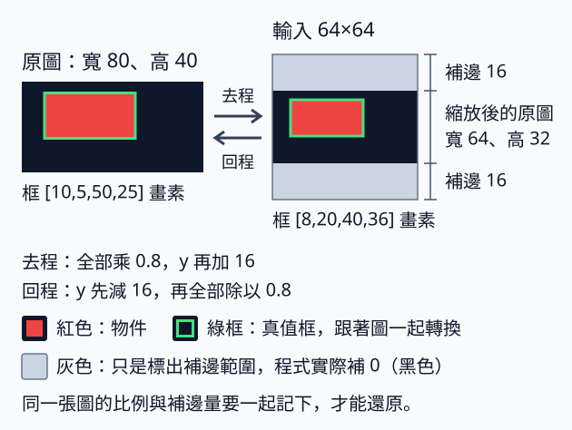
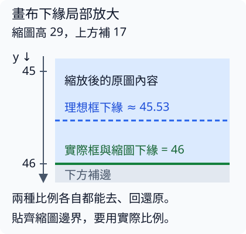

# 4.2 座標轉換與還原：框跟圖片一起移動

[在 Colab 執行本節](https://colab.research.google.com/github/birdhackor/learn_to_yolo/blob/lessons-v0.5.0/notebooks/04-coordinates.ipynb){ .md-button }

上一節的定位模型只能吃固定大小的圖片（那一節是 32×32）：它的框 head 把特徵圖攤平（flatten）成 1024 個數再計算；輸入若改成 64×64，攤平後變成 4096 個數，就接不上了。同一個 batch 的圖片也要疊成同一個 tensor，例如 `[B,3,64,64]`（B 是這批圖片的張數）。所以不管原圖多寬多高，都要先轉成固定大小；本節用 64×64，後面章節的 MiniYOLO 預設輸入也是 64×64。

圖片轉過去，框也要跟著轉。反過來，模型在 64×64 輸入上畫出的框，也不能直接畫回原圖（本節的例子是寬 80、高 40）：縮放與補邊改變了座標系。如果只記得圖片變成了正方形，忘了補邊（padding），框就會上下偏移。本節從這張非正方形圖片出發，確認兩件事：**往返**能不能還原原框，以及**框與縮圖是否對齊**。這是不同的檢查：一套比例乘了再除，可能還原成功，卻沒有貼齊真正 resize 後的圖片邊界。讀完你能自己算出每一步的框座標，並知道為什麼兩項都要核對。前置知識只需要知道：xyxy 的四個數是框的左上角與右下角座標。

可以用頁首的按鈕在 Colab 執行，或在本機執行 `PYTHONPATH=. python lesson_cases/04-coordinates.py`。本節在 CPU 上只做幾何變換，不需要訓練。程式除了主例（寬 80、高 40 那張圖），還檢查三種情況：整數標註（框用整數 tensor 給）、奇數尺寸與空框。全部通過，代表：主例轉到 64×64 輸入上的框，和本頁後面手算的答案一致；主例等比例縮放再補邊之後，框仍剛好框住縮放後的物件；主例和這三種情況都能轉過去再轉回來、還原原框。這些都只檢查幾何換算，不代表模型定位準確。

## 三個座標系，先寫上單位

原圖高 H=40、寬 W=80，是 RGB 圖片：tensor 的 shape 是 `[3,40,80]`，順序是 [channel, 高, 寬]；dtype 是 float32，值在 0 到 1 之間。這張圖是黑底（三個 channel 都是 0），上面有一個紅色長方形物件：物件範圍內的紅色 channel（channel 0）是 1。

真值框是 `[10,5,50,25]`，剛好框住這個紅色物件，單位是畫素（pixel）。x 向右、y 向下，採半開區間，所以框寬 40、高 20。這裡的半開區間是含頭不含尾（左閉右開）：x 從 10 到 50，蓋住第 10～49 號畫素，共 40 個，和 Python 切片 `10:50` 一樣。也可以把座標想成畫素之間的格線，而不是畫素的編號：x 從格線 10 到格線 50，所以寬就是 x2−x1=40。有些舊的標註格式把 x2 記成「最後一個畫素的編號」（頭尾都算），那時寬才是 x2−x1+1；本書的框不加 1。

框的計算一律用浮點數 tensor，因為縮放比例（scale，新長度÷原長度）可能是 0.8，乘完會有小數。

模型的輸入是 64×64 的**輸入畫布**：送進模型的整張圖，包含縮放後的原圖內容，有補邊時也包含補邊區。畫布上的框也可以用畫素表示，但那是畫布的畫素，不是原圖的畫素。畫布座標再除以 64，就得到 0～1 的正規化座標。這些數字是相對「64×64 畫布」的比例，不是相對原圖，不會自動對應回原圖：有補邊時，直接拿去乘原圖的寬高就會算錯（後面的「常見錯誤」有實例）。

下表把同一個框在三個座標系的值並排。第二列的 letterbox 是「等比例縮放，再在空出來的地方補邊」，名稱來自寬銀幕電影在電視上播放時，上下留的黑邊。第二、三列的數字怎麼算出來，下面馬上推導。

| 框所在空間 | xyxy | 意義 |
| --- | --- | --- |
| 原圖 | `[10,5,50,25]` 畫素 | 寬 80、高 40 原圖上的座標 |
| Letterbox 輸入 | `[8,20,40,36]` 畫素 | 64×64 畫布上的座標 |
| 輸入正規化 | `[0.125,0.3125,0.625,0.5625]` | 畫布座標每軸除以 64 |

## Stretch 與 letterbox 的差別

Stretch（直接拉伸）把原圖直接拉成 64×64：兩軸各自縮放，不補邊。水平方向比例 \(s_x=64/80=0.8\)，垂直方向 \(s_y=64/40=1.6\)。框變成 `[8,8,40,40]`：原本寬 40、高 20 的長方形變成 32×32 的正方形，物件形狀也被拉長了。

Letterbox 則讓兩軸用同一個比例，而且選能讓整張圖放進畫布的那一個：\(s=\min(64/80,64/40)=\min(0.8,1.6)=0.8\)。為什麼取較小的？如果取 1.6，寬會變成 80×1.6=128，超出 64；取 0.8，寬剛好 64、高 32，放得進畫布。所以原圖縮成寬 64、高 32。高度還剩 64−32=32 個畫素，就上下各補 16 個畫素（補邊：在空出的地方填固定值，湊滿畫布）；水平方向不用補。框先乘 0.8 變成 `[8,4,40,20]`，再把 y 加 16，得到 `[8,20,40,36]`。



箭頭右邊、標著「輸入 64×64」的方塊就是畫布：中間的深色長條是縮放後的原圖（寬 64、高 32），上下的灰色帶是補邊。紅色是物件，綠框是框。灰色只是為了標出補邊範圍；完整程式實際補的是 0（黑色），和原圖背景同色，單看顏色分不出哪裡是補邊。所以程式輸出的三格對照圖 `artifacts/04-coordinates.png`（原圖／stretch／letterbox），在 letterbox 那一格另外用白色虛線框出縮放後的原圖（寬 64、高 32，y 從 16 到 48），虛線框外就是補邊；虛線只畫在圖上，不改變畫布的值。

保持長寬比是 letterbox 的收益：物件形狀不變，例如圓不會被拉成橢圓。代價是畫布有一部分是補邊，物件分到的畫素較少。本例 stretch 後物件占 32×32=1024 個畫素，letterbox 後只占 32×16=512 個，整張畫布有一半（4096 個中的 2048 個）是補邊。還原時，兩種做法都要知道每張原圖的寬高；letterbox 另外還要記補邊量。補邊填的值也要和訓練時的前處理一致，否則推論時模型看到的補邊區，會和訓練時看到的不同。

## 逆變換要倒過來做

去程把原圖座標換成畫布座標；模型的框畫在畫布上，要用回程換回原圖。先講清楚符號：\(x,y\) 是原圖座標，\(x',y'\) 是畫布座標；\(s_x,s_y\) 是兩軸的縮放比例；\(p_x,p_y\) 是左方、上方補了幾個畫素，也就是程式裡的 `left`、`top`。框的 x1、x2 用 x 的式子，y1、y2 用 y 的式子。

若去程是 \(x'=s_x x+p_x,\ y'=s_y y+p_y\)，回程就是：

\[
x=(x'-p_x)/s_x,\qquad y=(y'-p_y)/s_y.
\]

本例 letterbox 代入 \(s_x=s_y=0.8\)、\(p_x=0\)、\(p_y=16\)；stretch 則是 \(s_x=0.8\)、\(s_y=1.6\)、\(p_x=p_y=0\)。y1 回程 \((20-16)/0.8=5\)，y2 回程 \((36-16)/0.8=25\)。順序是先扣補邊、再除比例。若先除 0.8 再扣 16，會得到 9 而不是 5。

把去程和回程寫成程式，下面是只留框換算的簡化寫法（`sx`、`sy`、`left`、`top` 假設已經算好）：

```python
# 依 x1,y1,x2,y2 排：x 用 sx、y 用 sy；本例 sx=sy=0.8、left=0、top=16
scales = torch.tensor([sx, sy, sx, sy])
padding = torch.tensor([left, top, left, top])
input_boxes = original_boxes * scales + padding
original_boxes_again = (input_boxes - padding) / scales
```

框的 shape 是 `[N,4]`，N 是這張圖的物件數；`scales` 和 `padding` 的 shape 是 `[4]`。這裡的 `*`、`+`、`-`、`/` 都是逐元素運算，不是矩陣乘法：shape `[4]` 會自動套到 `[N,4]` 的每一列。這是 PyTorch 的 broadcast（廣播）：`[4]` 先被看成 `[1,4]`，長度是 1 的那一軸再自動延伸成 N。例如 `[[10,5,50,25]]` 逐項乘 0.8 得 `[[8,4,40,20]]`，再加 `[0,16,0,16]` 得 `[[8,20,40,36]]`。

沒有物件的圖片（N=0），框要寫成 shape `[0,4]` 的 tensor，例如 `torch.empty(0, 4)`：0 個框、每框 4 個數。它和 `[4]` 運算後仍是 `[0,4]`，後面的程式照常運作。不要寫成 `torch.tensor([])`：它的 shape 是 `[0]`，看不出每框有 4 個數，拿它乘 shape `[4]` 的比例會直接報 shape 不合的錯（長度 0 和 4 都不是 1，broadcast 無法延伸）。

如果手上是畫布的正規化座標（上表第三列），還原到原圖的完整步驟是：

1. 乘 64，回到畫布畫素：`[0.125,0.3125,0.625,0.5625]` 變成 `[8,20,40,36]`。
2. 減去補邊 `[0,16,0,16]`，得 `[8,4,40,20]`。
3. 除以 0.8，得 `[10,5,50,25]`。

??? note "完整程式裡的 letterbox() 與 undo()"

    完整程式（Colab 裡的那份）把縮放圖片、補邊和上面程式裡的框換算包成兩個函式，後面的練習會直接呼叫：

    - `letterbox(image, boxes, size=64)`：輸入 `[3,H,W]` 的圖片和 `[N,4]` 的原圖框，回傳三樣東西：64×64 畫布、畫布上的框，以及這張圖的變換紀錄（metadata）。
    - 變換紀錄是一個字典（練習裡叫 `meta`），有四個鍵：`scale_xyxy` 是 `[sx,sy,sx,sy]`，`padding_xyxy` 是 `[left,top,left,top]`，`original_hw` 是原圖的（高, 寬），`resized_hw` 是縮放後、補邊前的（高, 寬）。
    - `undo(boxes, metadata)`：算的就是 `(boxes - padding_xyxy) / scale_xyxy`，把畫布框還原成原圖框；它不會另外裁切超出原圖的部分。輸入要是畫布畫素框；手上是正規化座標時，先乘 64 再交給它。

??? note "為什麼整數框要先轉成浮點數"

    有些標註的框是整數，轉成 tensor 後 dtype 也是整數（例如 int64）。完整程式用 `boxes.new_tensor([...])` 建立比例向量 `[sx,sy,sx,sy]`，而 `new_tensor` 會沿用框的 dtype。如果直接拿整數框來建，比例也會變成整數，0.8 被截成 0。

    假如沒有先轉換，本例的比例會變成 `[0,0,0,0]`，框乘完只剩補邊值 `[0,16,0,16]`；還原時每一項都是 0÷0，結果是 NaN（Not a Number，表示算不出有效數值），不是有限數。所以 `letterbox()` 一開始會先把整數框轉成 float32。完整程式也用斷言（assert）檢查：整數框還原後全是有限數，而且等於原框。

    自己直接寫 `torch.tensor([0.8])` 不會有這個問題，因為它預設就是 float32；問題只出在「沿用框的 dtype」這種寫法。

## 縮放後不是整數時，比例會微微改變

縮放（resize）後的圖片，寬高必須是整數畫素。以高 37、寬 83 的原圖（tensor `[3,37,83]`）為例，放進 64×64 時，理想比例是 \(64/83\approx0.7711\)。寬剛好變成 64，高卻是 37×(64/83)≈28.53，取整後是 29。實際縮圖因此是高 29、寬 64：水平比例 64/83≈0.7711，垂直比例 29/37≈0.7838，兩軸微微不同。

高度剩下 64−29=35 個畫素要補邊，程式上方補 17、下方補 18；縮圖內容的下緣因此是 y′=17+29=46。對同一條原圖下緣 y=37，兩種框換算會得到不同結果：

|框的比例約定|用同一套比例去、回|畫布上的下緣 y′|對齊縮圖下緣 46？|
|---|---|---|---|
|兩軸都用理想比例 64/83|都能還原原框|17+37×64/83≈45.53|差約半個畫素|
|x 用 64/83，y 用實際比例 29/37|都能還原原框|17+37×29/37=46|是|



本節選第二列：`letterbox()` 的框與 metadata 都使用**實際比例** `new_w/W`、`new_h/H`，讓框對齊真正 resize 的尺寸；往返再用同一份 metadata 還原。輸出的 `odd rounding:` 一行可核對 `resized_hw=(29,64)` 以及前兩個比例 64/83、29/37。因此「往返成功」和「縮圖邊界對齊」要分開看。其他實作可能保留理想比例並容忍取整誤差，使用時須確認它的約定。

??? note "選讀：round() 與奇數補邊的精確規則"

    完整程式把縮放後的寬高取整時用 Python 的 `round()`：一般取最接近的整數，但小數部分剛好是 0.5 時取偶數那一邊。例如寬 128、高 57，理想比例為 64/128，高變成 28.5，程式取 28；四捨五入會取 29。上面的 28.53 不在這個例外裡。

    補邊總量是奇數時，left／top 向下取整（無條件捨去），另一側多 1 個畫素：35//2=17，上 17、下 18。不要假定兩側永遠一樣多。關鍵也不在原圖尺寸的奇偶，而是縮放後的長度是否需要取整。

## 可核對輸出與常見錯誤

執行後應看到 original_hw `(40,80)`、resized_hw `(32,64)`、letterbox 框 `[[8,20,40,36]]`、restored（還原）框 `[[10,5,50,25]]`，以及 stretch 框 `[[8,8,40,40]]`、padding（補邊）`[0,16,0,16]`。`hw` 表示先高後寬，和 tensor `[C,H,W]` 的順序一樣：原圖高 40、寬 80，縮放後高 32、寬 64。輸出最後一行的 `transform_panel=artifacts/04-coordinates.png` 是對照圖存檔的位置；圖中每格的標題寫成 `Original W80×H40` 這樣，W 後面是寬、H 後面是高，順序和 `hw` 相反。

完整程式把兩項檢查分開報告：

|檢查目的|這次核對的答案|判斷方式|
|---|---|---|
|往返是否還原原框|主例還原 `[10,5,50,25]`；奇數尺寸例也還原原框|`torch.allclose` 容許浮點數的極小誤差|
|框是否貼齊縮放後的紅色物件|從畫布量出的紅區 `[8,20,40,36]` 等於 letterbox 框|本例四邊剛好是整數格線，可以精確比對|

奇數尺寸例還原後的 y1 印成 2.9999992847442627，而不是剛好 3，這是 float32 的小誤差。另一項紅區檢查則直接從圖片量答案；本例整數邊界可以完全相等，不能把這種精確相等要求套到所有經過插值的物件邊緣。

??? note "選讀：float32 往返誤差與 tolist()"

    完整程式用 `torch.allclose` 檢查往返，而不是比對印出來的文字是否一字不差。原因是 float32 存不下大多數小數的精確值，例如 0.8 實際存成 0.800000011920929，所以還原時可能有極小誤差。奇數例（高 37、寬 83）印出的 `odd original=[[7.0, 3.0, 70.0, 31.0]], restored=[[7.0, 2.9999992847442627, 70.0, 31.000001907348633]]` 就是一例：還原後 x1、x2 剛好回到 7 和 70，y1、y2 卻差了一點點，取到小數第 7 位是 2.9999993 和 31.0000019，而不是剛好 3 和 31。程式先用 `.tolist()` 把 tensor 轉成 Python 的數字清單再印，才看得到這麼多位；直接印 tensor 只顯示到小數第 4 位，會看成 3.0000 和 31.0000。`torch.allclose` 逐項比較兩個 tensor，每一項的差距都在容許誤差（tolerance）內，就算相等。

??? note "選讀：用 where() 量紅區，及插值後的 0.5 門檻"

    輸出的 `red_pixel_box=[8, 20, 40, 36], equal to the letterbox box` 一行，報告的是另一項檢查：框有沒有對準圖片內容。`letterbox()` 回傳畫布 `canvas` 和畫布上的框 `transformed` 之後，完整程式用下面三行直接從畫布量出紅色物件的範圍，再和框比對；斷言通過，才會印出這一行：

    ``` { .python data-excerpt="lesson_cases/04-coordinates.py" }
    ys, xs = torch.where(canvas[0] > .5)
    red_pixel_box = [xs.min().item(), ys.min().item(), xs.max().item() + 1, ys.max().item() + 1]
    assert red_pixel_box == transformed[0].tolist()
    ```

    `canvas[0]` 是畫布的紅色 channel，`canvas[0] > .5` 逐格判斷紅色值是否大於 0.5，得到 64×64、每格是 True 或 False 的 tensor。只給一個條件時，`torch.where` 回傳兩個 tensor，分別是所有 True 位置的列號和欄號；圖片索引是 y 在前，所以先得到 `ys`，再得到 `xs`。`.item()` 把只含一個數的 tensor 取成普通的 Python 數字。本例紅色畫素的 x 是 8～39、y 是 20～35；照本頁開頭的半開區間約定，右下角用最後一個畫素的編號加 1，寫成框就是 `[8,20,40,36]`。`transformed[0].tolist()` 是第一個（也是唯一一個）框 `[8.0, 20.0, 40.0, 36.0]`，兩者相同，表示框跟著圖片一起移動之後，仍剛好框住物件。這裡可以用 `==` 直接比較，不必像往返那樣用 `torch.allclose`，因為本例框的四個邊都剛好落在畫素之間的格線上，四個座標都是整數；邊若落在兩條格線之間（例如前面用理想比例算出的 45.53），量出來的整數範圍就不可能和它完全相等。Python 比較時也把 8 和 8.0 當成相等（印出的畫素編號是整數，所以沒有 `.0`）。

    挑紅色畫素用的是「大於 0.5」，而不是「等於 1」，因為縮放時每個新畫素是原圖鄰近畫素的加權平均，物件邊緣可能出現介於 0 和 1 之間的值，例如對照圖 stretch 那一格，紅色物件上下緣的暗紅細線；0.5 是 0 和 1 的正中間，過半才算紅色。letterbox 這張畫布剛好沒有這種中間值，只有 0 和 1。

常見錯誤有三種：

- **把畫布的正規化框直接乘原圖的 W、H。** 會得到 `[10,12.5,50,22.5]`，與真值的 y=5／25 不同：補邊並沒有消失。x 剛好對，是因為水平方向沒有補邊，而且 0.8×80=64，乘和除剛好抵消。垂直方向的畫布 64 列裡有 32 列是補邊：正規化的 y 是 (0.8y+16)/64，乘上 H=40 得 (0.8y+16)×40/64=0.5y+10，不是 y 本身，比例和位移都錯。代入 y=5 得 12.5、y=25 得 22.5，就是上面的錯誤結果。對照沒有補邊的 stretch：`[8,8,40,40]` 除以 64，和原圖框除以 W、H，結果都是 `[0.125,0.125,0.625,0.625]`，所以 stretch 這樣乘回去剛好正確。letterbox 要先乘 64 回到畫布畫素，再照前面「逆變換要倒過來做」的步驟減補邊、除比例。
- **batch 裡原圖尺寸不同，卻全部套用第一張的比例。** 每張圖都要存自己的變換紀錄（metadata：縮放比例、補邊量、原圖與縮放後尺寸，也就是 `letterbox()` 回傳的那個字典）。只用第一張的紀錄，其他尺寸的圖多半比例或補邊對不上，框就會還原錯。
- **用裁切代替還原。** 預測框可能有一部分落在補邊區。例如預測框的 y1=10，落在上方補邊（y=0～16）裡，還原得 (10−16)/0.8=−7.5，跑到原圖外面。一種明確的規則是：還原之後，再把 x 夾到 0～W、y 夾到 0～H，此例得 0（本節的 `undo()` 沒有做這一步）。只在畫布上把框夾到 0～64 沒有用，因為 10 本來就在範圍內，還原後仍是 −7.5。裁切只剪掉超出範圍的部分，不能取代「先減補邊、再除比例」。

## 自主練習與答案

**練習 1：高比寬大的直立圖。** 把原圖改成高 H=80、寬 W=40，框改成 `[5,10,25,50]`。先自己算，再展開答案：

1. letterbox 的比例 \(s\) 是多少？
2. 縮放後的寬、高各是多少？
3. 補邊補在哪個方向？各補多少？
4. 畫布上的新框是什麼？
5. 回程怎麼算？
6. 如果改用 stretch，\(s_x\)、\(s_y\) 各是多少？框變成什麼？

??? note "參考答案"

    1. \(s=\min(64/40,64/80)=\min(1.6,0.8)=0.8\)。
    2. 寬 40×0.8=32、高 80×0.8=64，也就是縮成寬 32、高 64。
    3. 寬還剩 64−32=32，所以左右各補 16；上下不補。
    4. x 乘 0.8 再加 16，y 只乘 0.8：x1=5×0.8+16=20、y1=10×0.8=8、x2=25×0.8+16=36、y2=50×0.8=40，新框是 `[20,8,36,40]`。
    5. x 先減 16，再除 0.8；y 直接除 0.8，因為上方沒有補邊。
    6. \(s_x=64/40=1.6\)、\(s_y=64/80=0.8\)，框變成 `[8,8,40,40]`，剛好和主例的 stretch 結果一樣。

想用程式核對練習 1，可以不動原本的程式。先照 notebook 的順序，執行環境格和「本節可修改的完整實驗」那一格，`letterbox()` 和 `undo()` 才會存在；再在 notebook 最後新增一格，貼上下面的程式執行。這樣就不必去改完整程式的 `main()`：它用斷言（assert）把主例的預期答案寫死了。

第二行把紅色 channel 中 y=10～49、x=5～24 的範圍塗成 1，正好對應框 `[5,10,25,50]`。圖片索引是 y 在前，框的 xyxy 卻是 x 在前，這裡最常寫反，上一節的常見錯誤也提醒過這一點。從 `torch.where` 開始的三行，用和完整程式一樣的方法量出畫布上紅色物件的範圍，再和新框比對。

```python
portrait = torch.zeros(3, 80, 40)  # [channel, 高, 寬]
portrait[0, 10:50, 5:25] = 1  # [channel, y 範圍, x 範圍]；channel 0 是紅色
portrait_box = torch.tensor([[5., 10., 25., 50.]])
portrait_canvas, mapped, meta = letterbox(portrait, portrait_box)
assert meta['resized_hw'] == (64, 32)  # (高, 寬)
assert torch.allclose(mapped, torch.tensor([[20., 8., 36., 40.]]))
assert torch.allclose(undo(mapped, meta), portrait_box)
ys, xs = torch.where(portrait_canvas[0] > .5)  # 畫布上紅色畫素的列號、欄號
red_pixel_box = [xs.min().item(), ys.min().item(), xs.max().item() + 1, ys.max().item() + 1]
assert red_pixel_box == mapped[0].tolist()
stretched = portrait_box * torch.tensor([1.6, .8, 1.6, .8])  # 第 6 題的 stretch
assert torch.allclose(stretched, torch.tensor([[8., 8., 40., 40.]]))
print(f"red_pixel_box={red_pixel_box}")
```

全部斷言通過時，最後一行印出 `red_pixel_box=[20, 8, 36, 40]`，和第 4 題的新框相同。若第二行寫反成 `portrait[0, 5:25, 10:50]`，紅色物件就塗錯了地方（寬只有 40，`10:50` 實際只塗到第 39 欄），紅色畫素的框變成 `[24, 4, 48, 20]`，`assert red_pixel_box == mapped[0].tolist()` 這一行會報 AssertionError（斷言不成立時 Python 發出的錯誤）；其他斷言都不看畫素內容，抓不到這個錯。

??? note "想直接改原本的 main() 時"

    `main()` 是完整程式裡執行主例的函式，全文在「本節可修改的完整實驗」那一格（notebook 原本的最後一格）。若想直接改它來做練習 1，要一起改這幾處：

    - 原圖 `torch.zeros(3, 40, 80)` 改成 `torch.zeros(3, 80, 40)`。
    - 物件切片 `image[0, 5:25, 10:50]` 改成 `image[0, 10:50, 5:25]`。
    - 框 `[[10., 5., 50., 25.]]` 改成 `[[5., 10., 25., 50.]]`。
    - letterbox 的預期答案 `[[8., 20., 40., 36.]]` 改成 `[[20., 8., 36., 40.]]`。
    - stretch 比例 `[.8, 1.6, .8, 1.6]` 改成 `[1.6, .8, 1.6, .8]`；stretch 的預期答案 `[[8., 8., 40., 40.]]` 不用改。

    往返、紅色物件範圍、整數標註與空框的檢查不要刪掉。紅色物件範圍的檢查比對的是程式自己算出的框，不用改；照上面改完，會印出 `red_pixel_box=[20, 8, 36, 40], equal to the letterbox box`。物件切片若沒改、仍是 x 範圍寫在前面的 `image[0, 5:25, 10:50]`，這個檢查會報錯。對照圖也會自動跟著變：第一格的標題變成 `Original W40×H80`，letterbox 那格的白色虛線框改在 x 從 16 到 48，虛線框左右兩側是補邊。

**練習 2：為什麼不加 1？** 有些程式把框寬算成 x2−x1+1。本節的框為什麼不加 1？如果在本節的框上混用加 1，會改變什麼？

??? note "參考答案"

    本書採半開區間的約定：座標是畫素之間的格線，框寬就是 x2−x1。本例 x 從 10 到 50，蓋住第 10～49 號畫素，正好 40 個。加 1 屬於另一種約定：把 x2 記成「最後一個畫素的編號」，頭尾都算。

    如果在本書的框上混用加 1，本例寬會變 41、高變 21，面積是 41×21=861，而不是 40×20=800。IoU（交集面積除以聯集面積）也會跟著變：上一節兩個 12×12、交集 10×10 的框，IoU 是 100/188≈0.532；寬高都多算 1 後，兩框變 13×13、交集 11×11，IoU 變成 121/217≈0.558。

<!-- curriculum-evidence:start -->

## 實際執行紀錄

本節的完整程式於 2026-10-05 在 INTEL(R) XEON(R) PLATINUM 8573C（2 個執行緒）上用 PyTorch 2.9.1+cpu 執行，程式裡的 assert 全部通過。下面是那次印出的原始輸出；輸出裡若有計時或訓練得到的數字，換一台電腦會略有不同。每個數字的意思，以本頁正文的說明為準。[完整紀錄（JSON）](https://github.com/birdhackor/learn_to_yolo/blob/main/artifacts/checks/curriculum/04-coordinates.json)

??? example "展開本次實際輸出"

    ```text
    integer annotation converted to float; finite exact round trip passed
    original_hw=(40, 80), resized_hw=(32, 64)
    original=[[10.0, 5.0, 50.0, 25.0]], letterbox=[[8.0, 20.0, 40.0, 36.0]], restored=[[10.0, 5.0, 50.0, 25.0]]
    red_pixel_box=[8, 20, 40, 36], equal to the letterbox box
    stretch=[[8.0, 8.0, 40.0, 40.0]], padding=[0.0, 16.0, 0.0, 16.0]
    odd rounding: resized_hw=(29, 64), scales=[0.7710843086242676, 0.7837837934494019, 0.7710843086242676, 0.7837837934494019]
    odd original=[[7.0, 3.0, 70.0, 31.0]], restored=[[7.0, 2.9999992847442627, 70.0, 31.000001907348633]]
    odd-size and empty-box round trips passed; geometry only, no training required
    transform_panel=artifacts/04-coordinates.png
    ```

<!-- curriculum-evidence:end -->
