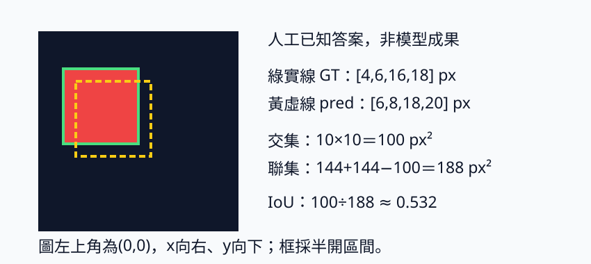
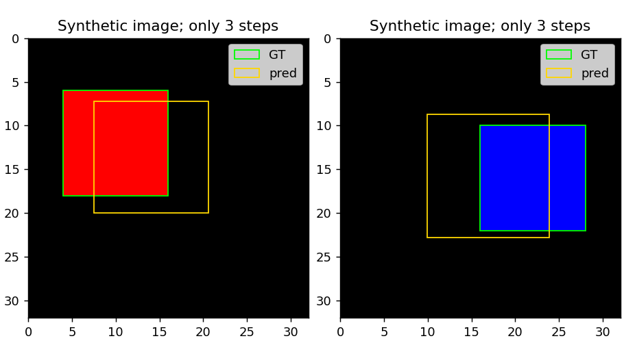
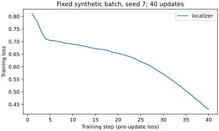

# 4.1 單物件分類與定位：類別之外，還要回答在哪裡

[在 Colab 執行本節](https://colab.research.google.com/github/birdhackor/learn_to_yolo/blob/lessons-v0.6.1/notebooks/04-localization.ipynb){ .md-button }

分類器回答「這張圖是紅或藍」，定位器還要指出矩形的位置。一張圖只有一個物件時，可以從同一個 backbone（抽取特徵的主幹）分出兩個 head（把特徵轉成答案的末端）：一個分類，另一個輸出四個框數字。讀完本節，你能在幾種框的寫法之間換算、手算框的誤差與重疊程度，並說明本節的框 head 為什麼要讀展平後的特徵，而不是只讀平均後的特徵。前置只需懂卷積與 loss；本節會從頭定義框、正規化和 IoU（兩框的重疊比例），不需要先讀後面的偵測章節。

本節是 MiniYOLO（本課程後面逐步做出的小型偵測模型）之前的簡化單物件模型，不是某個完整 YOLO 版本。本例每張圖剛好一個物件：沒有「只有背景、沒有任何物件」的空圖，也沒有一張圖好幾個物件的情況。這些從第 5 章〈[多物件輸出與責任分配](05-assignment.md)〉開始處理，第 7 章〈[Grid MiniYOLO 資料](07-data.md)〉會專門說明空圖。

可以用頁首的按鈕在 Colab 執行，或在本機執行 `PYTHONPATH=. python lesson_cases/04-localization.py`。資料是程式畫的兩張 32×32 人工圖，都是黑底：第 0 張有一個紅色正方形（類別 0），第 1 張有一個藍色正方形（類別 1）。本節做兩個實驗，都在 CPU 上執行：完整程式以 SGD 只更新 3 步，用來展示梯度確實傳到框 head，並畫出框疊圖（把真值框和預測框畫在原圖上的圖），不宣稱模型已學會定位；本頁後段的〈[訓練 40 步](#forty-steps)〉再用同樣的模型與兩張圖更新 40 次，看模型在這兩張訓練圖上能把類別與框學到什麼程度。

## 分類用的空間平均，為何留不住位置

Global average pooling（GAP，全域平均池化）把每個 channel 的所有位置取平均。這裡被平均的是特徵圖（feature map：卷積層輸出的 `[C,H,W]` 數值，每個 channel 是一張 H×W 的圖）。例如一張 4×4 特徵圖只有一格是 1，其餘是 0；不論 1 在左側或右側，平均都是 1/16=0.0625。完整程式先人工建立這樣的兩張特徵圖（左圖的 1 在第 1 列第 0 欄，右圖的 1 在第 1 列第 3 欄，列、欄都從 0 起算），再用斷言（assert）確認兩者平均相同，證明平均之後已分不出 1 在左邊還是右邊。

不過，「平均這一步分不出位置」不等於「只用 GAP 的模型一定不能定位」：平均之前的特徵值，可能已經因為圖邊、padding 或其他特徵而和位置有關（見下方摺疊說明）。這種線索間接又不可靠，所以本節用更直接的教學方式：讓框 head 讀取保留空間排列的特徵圖。代價是依賴固定的輸入尺寸，參數也比較多（後面會算）。

??? note "平均之前的特徵，為什麼可能已經帶著位置"

    平均這一步本身確實分不出 1 在哪一格；但卷積和 pooling 算出的特徵值，可能已經隨位置改變。以一般照片為例，貼近圖邊的 3×3 卷積窗會讀到 padding 補的 0，圖中央讀到的則是圖片本身的內容，算出的特徵值因此不同。2×2 max pooling 每個 2×2 區塊取一次最大值；物件平移 1 格時，物件邊緣落進哪個區塊會改變，特徵值也可能跟著變。

    本例是黑底圖，padding 補的 0 和背景一樣，所以只有物件碰到圖邊時，邊界才會讓特徵和物件放在中央時不同。這些線索都很間接，本節不依賴它們。

本例的 backbone 把輸入 `[B,3,32,32]` 先經過一層 3×3 卷積（3→4 channel、padding=1，尺寸仍是 32×32）和 ReLU，再用 2×2 max pooling 縮成 `[B,4,16,16]`；B 是一個 batch 的圖片數。接著分成兩個 head：

- 分類 head 先對空間取平均得到 `[B,4]`，再輸出 `[B,2]` 的 logits。logits 是還沒經過 softmax 或 sigmoid 的原始輸出；分類 head 的 logits 就是兩個類別的分數。
- 框 head 把 4×16×16 展平（flatten）成 1024 個數，再輸出 `[B,4]`。

下面是完整程式裡的模型 `Localizer`，和 `lesson_cases/04-localization.py` 相同，中文註解是本頁加的；`self.body` 就是 backbone：

``` { .python data-excerpt="lesson_cases/04-localization.py" }
class Localizer(nn.Module):
    def __init__(self):
        super().__init__()
        # backbone：3×3 卷積（3→4 channel，padding=1）→ ReLU → 2×2 max pooling
        self.body = nn.Sequential(nn.Conv2d(3, 4, 3, padding=1), nn.ReLU(), nn.MaxPool2d(2))
        self.class_head = nn.Linear(4, 2)  # 分類 head：平均後的 4 個數 → 2 個類別分數
        self.box_head = nn.Linear(4 * 16 * 16, 4)  # 框 head：展平的 1024 個數 → 4 個框數字

    def forward(self, images):
        features = self.body(images)  # [B,4,16,16]
        # 分類 head：mean((2, 3)) 對高、寬取平均 → [B,4]，再經 class_head → [B,2] logits
        # 框 head：flatten(1) 展平 → [B,1024]，再經 box_head → [B,4]，sigmoid 壓到 0～1
        return self.class_head(features.mean((2, 3))), self.box_head(features.flatten(1)).sigmoid()
```

展平保留了「第幾個數來自哪一格」的固定對應，這和空間平均不同。用上面的 4×4 例子來看：展平後的第 k 個數（k 從 0 起算）永遠來自同一格，k＝列×4＋欄。左圖的 1 在第 1 列第 0 欄，是第 4 個數；右圖的 1 在第 1 列第 3 欄，是第 7 個數。接在後面的 linear 層算的是 \(y=\sum_k w_k z_k+b\)（\(z_k\) 是第 k 個數），所以左圖得到 \(w_4+b\)，右圖得到 \(w_7+b\)。只要訓練讓 \(w_4\ne w_7\)，輸出就分得出左右。若先取平均，16 格只剩一個數 0.0625，linear 只能給它一個共用的權重，兩張圖的輸出一定相同。本節模型的特徵圖是 4 個 channel、各 16×16，展平成 1024 個數，道理相同。

分類 head 仍用平均，是因為分類只問紅或藍，方塊在哪裡都不影響答案。平均後只剩 4 個數，`class_head` 是 `Linear(4,2)`，只需 4×2＋2＝10 個參數；輸入尺寸改變時，平均後也仍是 `[B,4]`。

## 四個框數字究竟是哪四個

座標以圖左上角為原點，x 向右、y 向下，單位是畫素（pixel，簡寫 px）。`xyxy` 是左上角與右下角：\((x_1,y_1,x_2,y_2)\)。

本書的框都採半開區間：座標是畫素之間的邊界線。例如 \(x_1=4\)、\(x_2=16\) 的框蓋住第 4～15 號畫素（含 4、不含 16），共 16−4＝12 個，所以寬就是 \(x_2-x_1\)，不加 1。這和 Python 切片 `4:16` 含頭不含尾一樣；完整程式畫方塊時，也是用 `y1:y2, x1:x2` 這樣切。有些舊格式把最後一個畫素也寫進座標（兩端都含），寬才要算 \(x_2-x_1+1\)；本書不這樣算。

另一種寫法 `cxcywh` 是中心、寬高，由 xyxy 換算：

\[
\begin{aligned}
c_x&=(x_1+x_2)/2,\quad c_y=(y_1+y_2)/2,\\
w&=x_2-x_1,\quad h=y_2-y_1.
\end{aligned}
\]

第 0 張紅色方塊的真值框是 xyxy `[4,6,16,18]` px，轉成 cxcywh 是 `[10,12,12,12]` px。圖是 32×32，把 x 與 w 除以圖寬 32、y 與 h 除以圖高 32，得到 `[0.3125,0.375,0.375,0.375]`；這四個值沒有單位，是正規化後的目標（target）。第 1 張藍色方塊的真值框是 xyxy `[16,10,28,22]` px，照同樣步驟，得到 `[0.6875,0.5,0.375,0.375]`。非正方形圖片要分別除以寬 W 和高 H，不能一律除以同一個數。

為什麼要正規化？框 head 最後會經過 sigmoid（下一段說明），輸出只會落在 0 到 1 之間，所以目標也要換成相對於圖寬、圖高的比例，兩邊才能直接相減比較。而且不論圖多大，框都用同一種 0～1 的數字表示。

框 head 的 4 個 logits 和類別無關。它們經過 sigmoid \(\sigma(z)=1/(1+e^{-z})\) 壓到 0 與 1 之間，例如 \(\sigma(0)=0.5\)、\(\sigma(2)\approx0.88\)。壓完的 4 個數依序表示正規化的 cx、cy、w、h；這是四個座標比例，不是四種類別的機率。

還原成 px 時，左右界是 \(c_x\pm w/2\)，上下界是 \(c_y\pm h/2\)，再乘圖尺寸。例如正規化框 `[0.375,0.4375,0.375,0.375]`（後面算 MSE 時用的人工預測）：\(x_1=(0.375-0.1875)\times32=6\)、\(x_2=(0.375+0.1875)\times32=18\)，同理 \(y_1=8\)、\(y_2=20\)，回到 `[6,8,18,20]` px。

就算寬高都是正的，框也不一定落在圖內：sigmoid 只保證 cx、w 各自在 0 到 1 之間，中心靠邊時框仍可能越界。例如 cx＝0.05、w＝0.3 時，左界＝0.05−0.15＝−0.10，乘 32 是 −3.2 px，已經在圖外。若要預測框留在圖內，得在模型輸出框之後，另外把超出圖邊的座標截到 0 或圖寬、圖高，並明確寫成規則；第 7 章〈[完整圖片推論](07-inference.md)〉用的 `decode_grid` 就這樣做。把標註截進圖內，不會讓預測框留在圖內。原始標註（GT）若超出圖片，代表資料錯了，要回頭修資料，不能用截斷蓋過去；只有第 11 章〈[圖與框同步增強](11-augmentation.md)〉那種刻意裁圖的資料增強（訓練時刻意改動圖片，讓模型看到更多樣資料的做法）之後，才依明確規則截斷 GT，並刪掉露出太少的框。

## 分類 loss 與定位 loss 分開看

完整程式訓練 3 步。每一步兩個 head 各算自己的 loss，再加權相加成一個總 loss。以下摘自完整程式，中文註解是本頁加的；`model` 是 `Localizer()`，`optimizer` 是學習率 0.1 的 SGD，兩張圖 `images`（`[2,3,32,32]`）、類別 `labels`（`[0,1]`）與正規化的真值框 `targets` 都在這段之前建立：

``` { .python data-excerpt="lesson_cases/04-localization.py" }
for step in range(3):
    optimizer.zero_grad(set_to_none=True)  # 清掉上一步的梯度
    logits, boxes = model(images)  # logits [B,2]；boxes [B,4] 是正規化 cxcywh
    class_loss = nn.functional.cross_entropy(logits, labels)
    box_loss = nn.functional.mse_loss(boxes, targets)  # targets：正規化 cxcywh 的真值框 [B,4]
    loss = class_loss + 5 * box_loss  # 框 loss 乘權重 5 再相加
    loss.backward()
    assert model.box_head.weight.grad.abs().sum() > 0  # 框 head 收到的梯度不全是 0
    optimizer.step()
    print(f"step={step}, classification={class_loss.item():.4f}, "
          f"box={box_loss.item():.4f}, total={loss.item():.4f}")
```

類別是從紅、藍裡選一個，所以用交叉熵（cross entropy）；框座標是連續的數，希望越接近越好，所以用誤差平方。MSE 是 mean squared error（均方誤差）的縮寫：每個座標誤差平方，再對 batch 裡所有圖的四個座標取平均。程式裡的 `nn` 是完整程式開頭 `from torch import nn` 匯入的 `torch.nn`；`nn.functional.cross_entropy` 與 `nn.functional.mse_loss` 就是 PyTorch 現成的交叉熵與 MSE。很多程式把 `torch.nn.functional` 簡寫成 `F`，寫成 `F.cross_entropy`，是同一個函式。

手算一次：人工預測 xyxy `[6,8,18,20]` px（就是下方 IoU 圖裡的黃色虛線框），先轉成 cxcywh `[12,14,12,12]` px，再除以 32 得到 `[0.375,0.4375,0.375,0.375]`；真值正規化後是 `[0.3125,0.375,0.375,0.375]`。兩個中心誤差各 0.0625，寬高誤差 0，所以 box MSE 為 \(2(0.0625)^2/4=0.001953125\)。這個手算只看一張圖的一個框，所以對 4 個數平均；完整程式的 batch 有 2 張圖，`mse_loss` 會對 2×4＝8 個數平均。不能將 xyxy 直接與 cxcywh 目標相減。

分類 loss 和框 loss 的量尺不同：以執行紀錄的 step=0 為例，分類 0.7173、框 0.0185，相差約 39 倍。總 loss 對參數的梯度＝分類 loss 的梯度＋5×框 loss 的梯度，所以權重 5 把框 loss 推動參數的力道放大 5 倍。梯度是 loss 隨參數變化的斜率，不是 loss 值本身，所以一項 loss 在總和裡的數值占比，不等於它推動參數的力道占比：乘 5 後框項約 0.0925，只占 step=0 總 loss 0.8099 的約 11%；但前兩次更新讓總 loss 從 0.8099 降到 0.7576（約 0.052），其中約 0.047 來自框項（0.0925→0.0455），分類只降約 0.005。權重 5 是本節固定的示範設定，沒有證據說它最合適。完整程式每一步同時印出 classification、box 和 total，別把 total 降低當作兩項都改善。

??? note "為什麼一開始分類 loss 約 0.7，框 loss 只有約 0.02"

    分類：兩個類別的 logits 相等時（等於亂猜），softmax 給每一類 0.5，交叉熵是 \(-\ln 0.5=\ln 2\approx0.693\)。執行紀錄的 step=0 是 0.7173，差不多就是亂猜的水準。

    框：為了好估算，假設框 head 的 4 個 logits 都是 0（sigmoid 後都是 \(\sigma(0)=0.5\)）。兩張圖的目標是 `[0.3125,0.375,0.375,0.375]` 與 `[0.6875,0.5,0.375,0.375]`，和 0.5 的差距依序是 0.1875、0.125、0.125、0.125 與 0.1875、0、0.125、0.125。平方後對這 8 個數平均：

    \[
    \frac{2\times0.1875^2+5\times0.125^2+0^2}{8}=\frac{0.0703125+0.078125}{8}\approx0.0186,
    \]

    和執行紀錄 step=0 的 0.0185 差不多。正規化座標都在 0 到 1 之間，誤差本來就小，平方後更小，所以框 loss 一開始就比分類 loss 小一個數量級以上。

## IoU 回答重疊程度



圖中深色大方塊是整張 32×32 圖。GT 是真值標註（綠色實線框），pred 是預測（黃色虛線框），本圖的 pred 是人工設定的；圖右的框座標都是 xyxy。紅色方塊是物件本身，位置與綠色 GT 框相同；兩框重疊的 10×10 區域就是交集。

Intersection over Union（IoU，交併比）是交集面積除以聯集面積，0 表示沒有重疊，1 表示兩框完全一致。交集的寬是「兩框右界的較小者 − 兩框左界的較大者」，算出來小於 0 就取 0；交集的高同理，改用上下界。代入上圖：交集寬＝min(16,18)−max(4,6)＝16−6＝10，交集高＝min(18,20)−max(6,8)＝18−8＝10，交集面積 100 px²。聯集是兩框面積和減去交集，因為重疊部分不能算兩次：上圖兩框各 144 px²，聯集＝144＋144−100＝188 px²，IoU＝100/188，約 0.532。兩框不重疊時，寬或高的這個差會小於或等於 0，取 0 後交集是 0，IoU 也就是 0。

IoU 評估整個框的幾何重疊，和四個座標的 MSE 是不同的數字。例如同樣往右、往下各偏 2 px：12×12 的框（上圖）IoU＝100/188≈0.53；4×4 的框（GT `[4,6,8,10]` 對 pred `[6,8,10,12]`）交集只剩 2×2＝4、聯集 16＋16−4＝28，IoU≈0.14。但兩者的正規化 MSE 都是 0.001953125：MSE 只看座標差多少，不管框多大，IoU 會管。所以同樣偏幾個 px，小框的 IoU 通常掉得更多。本節的 loss 仍用 MSE，IoU 只拿來評估；把 IoU 做成 loss 的方法，見第 11 章〈[IoU 類 loss](11-iou-loss.md)〉。

## 核對、收益與代價

完整程式應輸出：兩張人工特徵圖的平均都是 0.0625、第 0 張圖的 target `[0.3125,0.375,0.375,0.375]`、`class_shape=(2, 2)`、`box_shape=(2, 4)`（shape 以 tuple 印出，就是本頁寫的 `[2,2]`、`[2,4]`）。程式也用斷言確認框 head 權重的梯度不全為 0、更新後權重確實改變，並輸出 `artifacts/04-localization.png` 的 GT／pred 疊圖；pred 來自只更新 3 步的模型，品質沒有保證。本節的 IoU 圖則是**人工固定框**，專門提供可手算的 IoU。



這張是程式實際產生的疊圖：左邊紅方塊、右邊藍方塊，綠框 GT 是真值，黃框 pred 是第三次更新後模型算出的框。先比四條邊：黃框和綠框仍有明顯偏差，尤其右圖的左界。它讓你核對「框 head 真的輸出位置」，並看出三步更新還不足以把這兩個訓練框擬合好；它不是前一張人工 IoU 算例，也不能代表未見圖片的表現。

頁尾的執行紀錄裡，三步的總 loss 約 0.8099→0.7576，分類 0.7173→0.7123，框 0.0185→0.0091。這些都是在該步更新「之前」量的：step=0、1、2 的總 loss 依序是 0.8099、0.7779、0.7576，所以 0.7576 是更新兩次後的值，第三次更新後沒有再量 loss。下方〈[訓練 40 步](#forty-steps)〉曲線的第 1 點，就是這裡的 step=0。這只是兩張訓練圖片的結果，沒有獨立的定位評估。

收益是把分類與定位接在同一次 forward 裡。代價是本例展平的框 head 有 4100 個參數：1024 個輸入接 4 個輸出，1024×4 個權重＋4 個 bias＝4100。若同樣 4 個 channel 先平均再接 linear，只剩 4 個輸入，4×4＋4＝20 個參數，但失去直接的位置對應。只要 pooling 後不是 16×16，展平的框 head 就對不上：例如輸入改成 64×64，pooling 後是 `[B,4,32,32]`，展平得 4096 個數，框 head 卻只收 1024 個，執行時會報形狀不合的錯誤；分類 head 先平均，仍是 `[B,4]`，不受影響。少數尺寸（例如 33×33）pooling 後仍是 16×16，不會報錯，但最後一列與一欄被 pooling 丟掉，同樣不該這樣用。所以不能只改圖片尺寸、不改模型。

## 訓練 40 步：模型能學會這兩張圖的類別與框嗎 { #forty-steps }

三步只確認梯度傳得到框 head；這個實驗看模型在這兩張圖上能把類別與框學到什麼程度。它由 `scripts/run_learning_extensions.py` 執行，直接取用完整程式裡的 `Localizer` 與 `to_xyxy`（把 cxcywh 換成 xyxy 的函式；腳本在 40 次更新後用它算出預測框），照完整程式的做法畫出同樣兩張圖、算出同樣的正規化 target，loss 也同樣是分類交叉熵＋5×框 MSE。完整程式和這支腳本都把亂數種子（seed）固定為 7；seed 決定模型的隨機初始權重，所以起點和三步實驗相同（重新開始，不是接著三步的結果繼續練），在 CPU 上更新 40 次。上面三步用 SGD（學習率 0.1），這裡改用 Adam（學習率 0.01）。Adam 也是一種 optimizer，會依每個參數過去梯度的大小，自動調整每一步走多遠。步數和 optimizer 同時改了，所以兩個實驗結果的差異，不能全歸功於步數。下表的第一個 loss 0.809883，就是三步實驗 step=0 的 0.8099。

手機上可左右滑動表格，查看完整欄位。

|模型|第 1 步（未更新）→ 第 40 次更新前的總 loss|訓練分類正確率（accuracy）|獨立驗證資料（validation）分類正確率|
|---|---|---|---|
|localizer|0.809883 → 0.430213|1.00|未評估|

localizer 是本節模型在紀錄裡的名稱。分類正確率是預測類別等於正確標籤的比例，在 40 次更新全部做完後量：1.00 表示兩張訓練圖的類別都分對。它只看類別，不管框準不準；框要看下方的 IoU。沒有另外準備不參與訓練的驗證圖，所以最後一欄是「未評估」，紀錄裡的 `validation_accuracy` 是 `null`。



讀圖：左右兩張小圖的橫軸都是第幾次更新，每一點都在該次更新之前量，所以第 1 點是還沒更新時的 loss（就是三步實驗的 step=0），第 40 點是第 40 次更新之前的值。左圖的藍色虛線是總 loss，紫線是分類 loss（交叉熵），紅線是框 loss 乘上權重 5 之後的框項；每一點的虛線都等於紫線加紅線，腳本也逐點核對這個等式。右圖只畫框 loss 本身（未乘 5 的 MSE），縱軸用它自己的刻度，左圖裡貼近 0、看不清楚的起伏，在這裡才看得出來。第 40 次更新之後沒有再量 loss；40 次更新全部做完後的模型，另外評估它預測的框，見下方。

起點和三步實驗相同：分類 0.7173，框項只有約 5×0.0185≈0.09。開頭 3 次更新，總 loss 從 0.81 陡降到 0.71，約 0.10；這一段主要是紅線在降，紫線只降一點。之後紅線貼近 0，虛線幾乎和紫線重合。整段總 loss 從 0.81 降到 0.43，約降了 0.38，大部分來自分類，這也能手算確認：框項一開始只有約 0.09，就算降到 0，也最多只能解釋這段降幅的四分之一左右。右圖的框 loss 在前 3 次更新急降，之後在很低的範圍內上下起伏，沒有跟著總 loss 一路往下。所以總 loss 一路下降，不代表框也一直在變好；框學得如何，要看下方的 IoU。

腳本每次更新前還會檢查：loss 和每個梯度都是有限的數，沒有 NaN（非數字）或無限大；梯度的 L2 長度（所有梯度平方相加再開根號，就像向量的長度）也大於 0。40 次更新後，再確認權重確實改變。曲線只評估固定的兩張訓練圖；不能據此宣稱模型對真實圖片的泛化效果（對沒參與訓練的資料也表現好），也不能推論到更深的架構。

40 次更新後，模型對兩張訓練圖預測的框（xyxy，px）約為 `[4.48,4.77,18.13,18.93]` 與 `[16.33,10.58,29.18,23.12]`，真值是 `[4,6,16,18]` 與 `[16,10,28,22]`。兩張訓練圖的框 IoU 為 `[0.6945, 0.7752]`。這是直接拿模型輸出的框和 GT 算的，和上面那張人工固定框的 IoU 手算圖是不同的證據。IoU 為 1 表示完全重合；上面人工往右、往下各偏 2 px 的例子是 0.532。這兩個值都比 0.532 高，但離 1 還有距離，而且只是訓練圖本身的結果。這兩張圖的顏色也不同，只讀平均特徵的框 head 也能靠顏色記住兩個框；所以這個實驗只說明本節模型能擬合這兩張圖，不能證明展平比平均好。要比較兩者，得用同色、只有位置不同的圖。

想自己重跑：先執行本節 Colab notebook 最上面準備環境的程式格（它會下載固定版本的課程程式、安裝指定版本的套件，並切換到程式目錄），再新增一個程式碼儲存格（code cell），貼上下面三行執行。notebook 裡〈本節可修改的完整實驗〉那一格的「可選：40 步學習實驗」也列了這三行。

```python
!python scripts/run_learning_extensions.py --section 04-localization
from IPython.display import SVG, display
display(SVG(filename='artifacts/runs/learning/04-localization/learning.svg'))
```

第一行開頭的 `!` 表示把這行當成終端機指令執行。這支腳本只把結果寫到 `artifacts/runs/learning/04-localization/`，不會覆寫網站用的紀錄與圖：`report.json` 是完整結果，`learning.svg` 是上面那種左右兩張小圖的 loss 圖。執行時印出的 JSON 和 `report.json` 相同，只省略逐步的 loss（總 loss、分類 loss、框 loss 與 5×框 loss 四串）。後兩行把圖顯示在 notebook 裡。重跑得到的 loss 與框座標小數可能和紀錄略有不同，這是正常的。原始完整紀錄：[40 步結果](https://github.com/birdhackor/learn_to_yolo/blob/main/artifacts/checks/curriculum/04-localization-learning.json)。

## 常見錯誤、自主練習與答案

常見錯誤：

- xyxy 與 cxcywh 混用。
- px 與正規化比例混用。
- 把框的順序寫成 y 在前。tensor 的索引是 `[列(y), 欄(x)]`，例如 `images[..., y1:y2, x1:x2]`，容易順手把座標也寫成 y 先。
- 疊圖時把標註框（GT）畫出來，就當成模型預測。要確認黃框真的來自模型輸出。

自主練習（紙筆題，不必改程式或重新訓練）：把上面的人工預測改成 GT 向右移 6 px、y 不變，也就是 xyxy `[10,6,22,18]`。請算 (a) 交集、聯集與 IoU；(b) 正規化 cxcywh 的 MSE。算完同時核對圖與數字，別只看 loss。

??? note "參考答案"

    (a) 交集寬＝min(16,22)−max(4,10)＝16−10＝6，交集高＝min(18,18)−max(6,6)＝12，交集 \(6\times12=72\)；聯集＝144＋144−72＝216；IoU＝72/216＝1/3。

    (b) 預測的 cxcywh 是 `[16,12,12,12]` px，正規化後只有 cx 和真值差 6/32，其他三個誤差都是 0，所以 MSE 為 \((6/32)^2/4=0.0087890625\)。

<!-- curriculum-evidence:start -->

## 實際執行紀錄

本節的完整程式於 2026-10-08 在 AMD EPYC 9V74 80-Core Processor（2 個執行緒）上用 PyTorch 2.9.1+cpu 執行，程式裡的 assert 全部通過。下面是那次印出的原始輸出；輸出裡若有計時或訓練得到的數字，換一台電腦會略有不同。每個數字的意思，以本頁正文的說明為準。[完整紀錄（JSON）](https://github.com/birdhackor/learn_to_yolo/blob/main/artifacts/checks/curriculum/04-localization.json)

??? example "展開本次實際輸出"

    ```text
    two different positions -> same global mean=0.0625
    step=0, classification=0.7173, box=0.0185, total=0.8099
    step=1, classification=0.7146, box=0.0127, total=0.7779
    step=2, classification=0.7123, box=0.0091, total=0.7576
    first_target_cxcywh=[0.3125, 0.375, 0.375, 0.375], class_shape=(2, 2), box_shape=(2, 4)
    predicted pixel xyxy=[[7.4885783195495605, 7.199568748474121, 20.595396041870117, 19.995590209960938], [9.941701889038086, 8.684192657470703, 23.892370223999023, 22.775699615478516]]
    overlay=artifacts/04-localization.png; no held-out detection claim
    ```

<!-- curriculum-evidence:end -->
