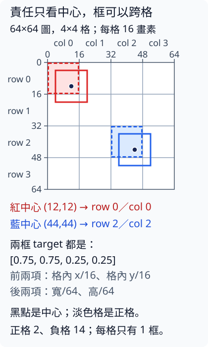

# 5 多物件輸出與責任分配：哪個預測負責哪個物件

[在 Colab 執行本節](https://colab.research.google.com/github/birdhackor/learn_to_yolo/blob/lessons-v0.4.1/notebooks/05-assignment.ipynb){ .md-button }

第 4 章的單物件定位器每張圖只輸出一個框，但真實圖片可能沒有物件，也可能有好幾個。只把 head 改成「輸出更多框」還不夠：訓練時還要告訴每個輸出位置該學哪個物件，以及哪些位置該學「這裡沒有物件」。本節用一張固定有兩個物件的圖，一步步把標註變成訓練用的 target，並決定每一格各算哪幾項 loss。讀完本節，你能手算一個框由哪一格負責、target 是哪四個數，也能說明為什麼同一格放不下兩個物件。前置只需懂 xyxy、中心寬高（cxcywh）與分類 loss，見第 4 章〈[單物件分類與定位](04-localization.md)〉。

先認識幾個本節常用的詞：

- 標註（annotation）：人工標好的正確答案，每個物件一個框和一個類別。
- slot（槽）：一個可以輸出一個框的位置。本模型把圖切成 4×4 格，每格剛好 1 個 slot，所以本節說的「格」「slot」「候選」都指同一件事，一張圖有 16 個；下面多半直接說「格」。
- 責任分配（assignment）：訓練時決定哪個候選負責哪個真實物件。
- 正格與負格：正格（正樣本）是分到物件的格，負格（負樣本）是要學背景的格。這裡的「樣本」指一格，不是一張圖。
- objectness：在本模型裡，表示這格是否分到物件的分數。
- logit：還沒轉成機率的原始實數。

格子（grid）與「中心所在的格負責」這兩個概念，參考 [YOLOv1 原始論文](https://arxiv.org/abs/1506.02640)。本節的 MiniYOLO 做了簡化，不是 YOLOv1 的重現，差別見下方摺疊說明。

??? note "本節的 MiniYOLO 和 YOLOv1 原版差在哪"

    YOLOv1 把圖切成格子，物件中心落在哪一格，就由那一格負責。原版每格預測多個框（論文的設定是 2 個），每個框各帶一個信心分數（confidence），loss 的設計也和本節不同。

    本節的 MiniYOLO 每格只輸出**一個框**。「這格有沒有物件」用一個單獨的 objectness 分數表示，不是把背景當成 softmax 裡的另一個類別。這一點原版也一樣：原版每個框的 confidence 就是這種獨立的分數，也沒有背景類別。差別在要學的目標：原版負責物件的那個框，confidence 要學預測框與真值框的 IoU（第 4 章），不是固定的 1；本節的 objectness 只學 1（正格）或 0（負格）。兩個物件類別本節用 softmax；原版每格一組類別機率，不經過 softmax：最後一層是線性輸出，類別機率和其他項一樣直接用平方誤差訓練。原版的每格多框、以 IoU 為目標的 confidence 與 loss 設計，本節都省略，所以不是 YOLOv1 的重現。每格只能放一個物件，所以也不保證多個物件都放得下（見後面〈容量限制必須讓人看得見〉）。

可以用頁首的按鈕在 Colab 執行，或在本機執行 `PYTHONPATH=. python lesson_cases/05-assignment.py`。程式在 CPU 上生成 target，再用兩個不對稱的框（中心的 x、y 不相等；其中一框的寬、高也不相等）核對負責的格和 target 沒有把 row／col、x／y 或寬高寫反，並確認同一格放進兩個物件時會明確報錯；最後用一組亂數當作人工特徵圖（feature map），讓 head 更新兩步。程式沒有用圖片訓練偵測器（detector），所以看不出偵測效果。

## 固定輸出，如何接變動數量標註

每張圖的標註有 `boxes`（shape [N,4]，單位 pixel，xyxy 格式）和 `labels`（shape [N]）。N 是這張圖的物件數，每張可以不同，也可以是 0。模型的 head 卻固定輸出 [B,S,S,5+C]：B 是一批的圖片數，S=4 是每軸格數，C=2 是類別數，所以本例是 [B,4,4,7]。中間兩個 S 依序是 row（列，往下數）和 col（欄，往右數）。

最後一軸的 7 個值（索引 0–6）依序是 tx、ty、tw、th（框的 4 個原始輸出，還沒經過 sigmoid）、objectness logit、class0 logit、class1 logit。所以後面程式的 `[..., :4]` 取索引 0–3，`[..., 4]` 取索引 4，`[..., 5:]` 取索引 5–6；其中 `...` 表示前面的軸全部保留。xy 經 sigmoid 表示格內中心偏移，wh 經 sigmoid 表示**整張圖**正規化寬高；obj 也經 sigmoid，類別經 softmax。這些是本節模型的定義，不能照搬成所有 YOLO 版本的解釋。

Backbone 提取特徵；neck 夾在 backbone 與 head 之間，負責整理或融合特徵；head 把特徵變成每一格的輸出。本節只驗證 head 與 target、loss 的對應。其他偵測器的整體做法，放在頁尾的延伸說明。

接法是：每張圖都固定準備 S×S 格的 target，每個物件只填進它中心所在的那一格，其他格標成「沒有物件」。N 改變的只是哪些格是正格，target 的 shape 不變，所以能和固定 shape 的輸出逐格比較。

## 每個物件都走這四步



圖中黑點是物件中心，淡色格就是負責的格：紅框由左上角那格（row0／col0）負責，藍框由 row2／col2 負責。

圖片 64×64，切成 4×4 格，每格 16 pixels。紅框 [4,4,20,20] 的中心是 (12,12)、寬高 (16,16)；藍框 [36,36,52,52] 的中心是 (44,44)、寬高也是 (16,16)。

1. 將中心除以 16，紅得到 (0.75,0.75)、藍得到 (2.75,2.75)。
2. 捨去小數（floor）決定負責的格：第 1 步得到的 x 值（中心 x÷16）取整數部分得 col（欄，往右數），y 值（中心 y÷16）取整數部分得 row（列，往下數）。所以紅由 row0／col0 負責、藍由 row2／col2 負責。存進 tensor 時，索引寫成 [圖片, row, col]，也就是先 y 後 x；[首頁](../index.md)的 `(列=1,欄=1)` 也是先寫列、再寫欄。box target 向量裡則仍是先 x 後 y。
3. 減掉整數的格索引，兩者的格內中心偏移都是 (0.75,0.75)。偏移從所在格的左上角量起，以格寬 16 為 1。
4. 寬高除以整圖 64，都是 (0.25,0.25)，不是除以格尺寸 16。

把四步寫成一般式，改 S 時直接代入。設格寬 \(g=64/S\)（本例 64/4＝16），中心 \((c_x,c_y)\) 與寬高 \(w,h\) 都以 pixel 為單位，\(\lfloor x\rfloor\) 表示把 x 捨去小數：

\[
\text{col}=\left\lfloor \frac{c_x}{g}\right\rfloor,\quad
\text{row}=\left\lfloor \frac{c_y}{g}\right\rfloor,\quad
\text{target}=\left[\frac{c_x}{g}-\text{col},\ \frac{c_y}{g}-\text{row},\ \frac{w}{64},\ \frac{h}{64}\right].
\]

完整程式（Colab 裡的那份）用 `build` 函式做這四步，核心是下面三行（摘自完整程式，中文註解是本頁加的；`...` 處略去的兩行是同格碰撞的檢查，見後面〈容量限制必須讓人看得見〉）。`center` 是框中心 (x,y)、`size` 是寬高 (w,h)，單位都是 pixel；`grid` 就是 S，`image_size` 是 64，`b` 是第幾張圖。

``` { .python data-excerpt="lesson_cases/05-assignment.py" }
# 步驟 1：中心 ÷ 64 × 4，等於除以格寬 16
grid_center = center / image_size * grid
# 步驟 2：floor 捨去小數，再轉成兩個 Python 整數；
#        第一個數來自 x，所以是 col；第二個來自 y，所以是 row
col, row = grid_center.floor().long().tolist()
...
# 步驟 3、4：把 [x 偏移, y 偏移, w/64, h/64] 存進第 b 張圖的 [row, col] 那一格
boxes[b, row, col] = torch.cat((grid_center - grid_center.floor(), size / image_size))
```

呼叫時寫 `build(標註 list, grid=S)`：list 裡每張圖一個 dict，含 `boxes` 和 `labels`；不寫 `grid` 時 S=4。處理每個物件之前，`build` 先用斷言（assert：條件不成立就報錯停下）檢查標註：x2、y2 要大於 x1、y1，四個座標都在 0 到 64 之間，類別在 0 到 C−1 之間。它依序回傳四個值：box target（[B,S,S,4]）、objectness（[B,S,S]，正格 1.0、負格 0.0）、class_ids（[B,S,S]）、positive（[B,S,S]，True 表示正格）。完整程式的 `main()`（執行整個案例的函式）把這四個值依序存成 `box_targets`、`objectness`、`class_ids`、`positive`。

因此兩個正格的 box target 都是 [0.75,0.75,0.25,0.25]，class target 分別是 0／1，objectness target 都是 1。兩個 target 相同不是錯：「在哪一格」由它存放的 [row, col] 位置記住，target 只記格內中心偏移，以及除以整圖 64 的寬高；這兩框的偏移和寬高剛好都相同。反過來，中心 x＝(col＋x 偏移)×16：紅是 (0＋0.75)×16＝12，藍是 (2＋0.75)×16＝44。這種還原叫解碼（decode），下一節〈[人工框解碼與 NMS](06-decode-nms.md)〉會正式做。

為什麼寬高除以整圖 64，中心卻以格寬 16 為單位？本模型的 wh 輸出經過 sigmoid，只能落在 0 到 1 之間。框可以比一格大，例如寬 40 pixels 除以 16 是 2.5，sigmoid 永遠輸出不了；除以整張圖的 64，圖內任何框的寬高都不會超過 1。中心偏移則本來就在 0 到 1 之間，因為中心一定在它負責的那一格裡。

紅框跨過格邊界也沒關係（它其實壓到 4 格）：責任只看中心，不看整個框是否完全放在格裡。本節規定一個物件只交給一格：中心一定只落在一格，規則唯一又簡單，每個物件也只有一份 target。中心剛好落在格線上時，floor 會交給右邊或下面那一格，和首頁的約定相同。「一個物件只交給一格」是本節的選擇，不是唯一做法：讓多個候選一起學同一個物件，學習訊號比較多，但推論時同一個物件也比較容易冒出好幾個框；第 12、13 章會處理這個取捨。

## 正、負、ignore 與 mask

完整程式的主例是一個有兩張圖的 batch（B=2）：第 1 張是上面的兩物件圖，第 2 張是 N=0 的空圖。第 1 張圖裡，物件中心落入的 2 格是正格；其餘 14 格是負格，objectness target 為 0，要學「這裡沒有物件」。空圖照樣有 [4,4] 的 target，只是 16 格全是負格。所以整批是正 2、負 30（14＋16）。

**本節沒有 ignore 格**。ignore 是其他 assignment 設計可能用到的第三種狀態，意思是「這個候選暫不計入某項 loss」，不能把它和背景 0 混在一起。差別在 loss：負格的 objectness target 是 0，loss 會把它的預測推向「沒有物件」；ignore 的候選在那項 loss 裡完全不算，輸出多少都不罰。

例如第 9 章會教 anchor（預設的框尺寸）：每格有多個 slot，各配一種 anchor。尺寸和物件最接近的 slot 當正樣本。尺寸接不接近用尺寸 IoU 衡量，它只比大小、不看位置。同一格的其他 slot 若和物件的尺寸 IoU 大於 0.2（第 9 章的規則），表示尺寸也還算接近，硬罰成背景不合理，就設成 ignore。ignore 不算 objectness loss，也沒有框、類別 loss。本節每格只有一個 slot，沒有這種狀態。

| 欄位 | Shape | 哪些位置進 loss |
| --- | --- | --- |
| box | [B,4,4,4] | 只有正格 |
| objectness | [B,4,4] | 正格與負格都計 |
| class_ids | [B,4,4] long | 只有正格 |
| positive | [B,4,4] bool | 決定框與類別 mask |

負格的 box 填 0 只是容器預設值，不是在教模型「背景框應該是四個 0」。負格 class_ids 填 `-1` 也不表示第 -1 類。

positive 是一張和格子同形狀的 True／False 表，標出哪些格要算框與類別的 loss；這種表叫做遮罩（mask）。對任何前三軸是 [B,4,4] 的 tensor t，`t[positive]` 都只取出 positive 為 True 的那幾格，依序排好：先照圖片順序，同一張圖裡再由上而下逐列、每列由左到右（形狀見下面程式的註解）。框與類別的 loss 都先這樣取出正格，再交給 loss 函式。class loss 若沒先用 positive 排除負格，負格的 `-1` 會讓 `cross_entropy` 報類別越界的錯誤（IndexError）。要親眼看到這個錯誤，可以先把類別 logit 攤平成 [32,2]（32 格、每格 2 個 logit）、class_ids 攤平成 [32]，再交給 `cross_entropy`。只拿掉下面 class loss 那一行的兩個 `[positive]` 還看不到它：`cross_entropy` 要求類別排在第二軸，這裡的類別 logit 卻在最後一軸，所以會先報 shape 不合的錯誤（RuntimeError）。

### head 輸出與三項 loss

loss 要拿 head 的輸出來算。完整程式的 head 是一個 1×1 卷積 `nn.Conv2d(4, 7, 1)`（1×1 卷積見第 3 章〈[ResNet projection shortcut](03-projection.md)〉）：4×4 的每一格都用同一組權重，把該格的 4 個特徵變成 7 個數。輸入的 `features` 是 `torch.randn` 產生的 [2,4,4,4] 亂數，用來代替 backbone 的輸出，所以 loss 的數字不代表模型學會了偵測。卷積照 PyTorch 的慣例輸出 [2,7,4,4]（7 在第二軸），程式再用 `permute(0, 2, 3, 1)` 重新排列軸（第 1 章），變成 [2,4,4,7]：中間兩軸是 row、col，每格的 7 個數排在最後一軸。這個結果叫 `prediction`。下面摘自完整程式，中文註解是本頁加的；`nn` 是程式開頭 `from torch import nn` 匯入的 `torch.nn`：

``` { .python data-excerpt="lesson_cases/05-assignment.py" }
# prediction: [2,4,4,7]；positive: [2,4,4]，其中 2 格是 True
# prediction[..., :4] → [2,4,4,4]；再用 [positive] 取出正格 → [2,4]（2 個正格 × 4 個框值）
box_loss = nn.functional.mse_loss(prediction[..., :4].sigmoid()[positive], box_targets[positive])
# prediction[..., 4] 和 objectness 都是 [2,4,4]：32 格全算
object_loss = nn.functional.binary_cross_entropy_with_logits(prediction[..., 4], objectness)
# prediction[..., 5:][positive] → [2,2]（2 個正格 × 2 個類別 logit）；class_ids[positive] → [2]，值是 [0,1]
class_loss = nn.functional.cross_entropy(prediction[..., 5:][positive], class_ids[positive])
loss = box_loss + object_loss + class_loss
```

最後一行把三項直接相加成總 loss，沒有像第 4 章那樣替框 loss 加權。

為什麼只有框先呼叫 `.sigmoid()`？`binary_cross_entropy_with_logits` 是二元交叉熵（binary cross entropy，BCE），用在「這格有沒有物件」這種是非題；名稱裡的 with_logits 表示它內部會先做 sigmoid，所以要傳原始 logit。`cross_entropy` 內部也會先做 softmax（第 1 章）。`mse_loss` 不做這種轉換，所以框要自己先 sigmoid，才能和 0 到 1 的 target 比較。有沒有物件是每格各自的是非題，所以用 sigmoid；類別是 C 個選 1 個、機率加起來要等於 1，所以用 softmax。

完整程式在算出 `prediction` 後還呼叫 `prediction.retain_grad()`，用來檢查梯度落在哪些 **head 輸出位置**。PyTorch 預設會替參數保留梯度（`.grad`），但中間算出來的值不保留；呼叫 `retain_grad()` 後，backward 完也能看到 loss 對每一格輸出值的梯度。

完整程式在每一步都用斷言確認：負格的框與類別梯度都是 0，objectness 梯度不是 0。原因是負格的框值和類別值沒有被 positive 挑進 loss，改動它們，loss 也不會變。objectness 那一項 32 格全算，每格 logit z 的梯度是 (sigmoid(z)−target)/32；負格的 target 是 0，梯度就是 sigmoid(z)/32，不是 0。

這些是 head 輸出位置的梯度，不是權重的梯度。head 的權重是所有格共用的：正格的框、類別、objectness 梯度，加上負格的 objectness 梯度，都會傳回這組權重，所以權重照樣更新（完整程式也確認了更新後權重確實改變）。負格的框輸出通常也會跟著變，只是 loss 不管它。不能因為某個負格的框梯度是 0（mask＝0），就推論整個卷積不學。

本節這三項 loss 的寫法假設整批至少有一個正格。如果整批都是空圖，`[positive]` 會取出 0 個數；`mse_loss` 和 `cross_entropy` 預設對取出的數取平均，0 個數的平均是 0/0，結果是 NaN（not a number，非數字），總 loss 也跟著變成 NaN。第 7 章〈[Grid MiniYOLO loss](07-loss.md)〉會處理這種情況：讓這兩項改回傳一個仍連著計算圖的 0。那一節也會比較取平均（mean）和加總（sum）這兩種把多格 loss 合成一個數的方式。

## 容量限制必須讓人看得見

這裡的「容量」指輸出最多能表示幾個物件：每格只有 1 個 slot，所以同一格最多 1 個物件，一張圖最多 16 個。這和前面章節說的模型表達能力不同。

把兩個同類紅框的中心放在 (12,12) 與 (6,6)，兩者都落進 row0／col0，但這格只有一個 slot。即使類別相同，也不能用一個框表示兩個獨立物件。`build` 寫入一格之前，會先檢查這格是不是已經是正格；是的話就丟出錯誤（raise ValueError），避免默默覆蓋其中一個 target。完整程式會接住這個錯誤，印出碰撞的位置。

要放下更多物件，可以讓一格有多個 slot（第 9 章）、把格子切得更細（更多候選位置）、同時用幾種解析度的特徵圖（不同尺度，第 10 章），或改用更複雜的 assignment。這些都可能改善容量，代價是更多候選，以及額外的配對規則與 loss 設計。slot 和類別是兩回事：每個 slot 都輸出完整的 2 個類別分數，任何類別的物件都能分給它，不是「紅色專用 slot、藍色專用 slot」。

Assignment 在**訓練時、算 loss 之前**（生成 target 時）決定誰負責誰；NMS（非極大值抑制：刪掉重複的框）則在**推論、解碼之後**才處理同一物件的多個重複預測，下一節會教。本節的中心規則只看標註，所以本節的程式在兩步更新的迴圈之前，替訓練用的那批圖呼叫一次 `build` 就夠了（另外兩次呼叫是不對稱框的核對和碰撞測試，不產生訓練用的 target）；課程的完整訓練程式 `miniyolo/train.py` 則在每個訓練步，替當步取出的那批圖重新生成 target。

兩個真實物件擠進同一格，是輸出容量不夠；多個格重複預測同一個物件，是另一個問題。NMS 只能刪候選，不能補回訓練 target 因容量不足而遺失的第二個物件，所以不能用 NMS 解決本節的同格碰撞。

常見錯誤有四種：

- row／col 和 x／y 軸顛倒。這種錯在主例看不出來，完整程式怎麼另外核對，見下一段。
- 把寬高除以格尺寸 16，而不是整圖 64。這時主例的 target 會變成 [0.75,0.75,1,1]，核對 `box_targets[0, 0, 0]` 的斷言會失敗。
- 讓負格也學框與類別。這時負格的框或類別梯度不再是 0，head 更新迴圈裡的梯度斷言會失敗；若直接拿負格的類別 target `-1` 去算，`cross_entropy` 還會先報錯（見〈正、負、ignore 與 mask〉）。
- 同一格被寫入第二個物件、覆蓋了第一個，卻沒有報錯。`build` 若寫入前不檢查這格是不是已經是正格，碰撞測試就收不到 ValueError，程式會丟出 AssertionError。

主例兩框的中心 x＝y、寬＝高，所以 row／col、x／y 偏移或寬、高寫反時，算出來的數字和正確的完全一樣。完整程式因此另外把兩個不對稱的框 [2,4,22,16]（類別 0）和 [36,12,52,28]（類別 1）放在同一張圖，呼叫 `build`，再用斷言核對它們負責的格、target 和類別；兩框各抓哪一種寫反，見下方摺疊說明。下面練習的藍框 [20,36,36,52] 中心的 x、y 也不相等，row、col 寫反就會落到另一格，參考答案裡的斷言會失敗。

??? note "完整程式的不對稱框核對：兩個框各抓哪一種寫反"

    完整程式把兩個框寫成同一張圖的標註 `odd`，呼叫 `build([odd])`（沒寫 `grid`，所以 S=4）：

    - 第一框 [2,4,22,16]，類別 0：中心 (12,10)、寬高 (20,12)。12/16＝0.75、10/16＝0.625，捨去小數後由 row0／col0 負責；寬高除以 64 是 0.3125、0.1875，所以 target 是 [0.75,0.625,0.3125,0.1875]。x、y 偏移寫反會得到 [0.625,0.75,…]；寬、高寫反，後兩個數會對調。但它在 row0／col0，row、col 寫反時格子不變。
    - 第二框 [36,12,52,28]，類別 1：中心 (44,20)、寬高 (16,16)。44/16＝2.75、20/16＝1.25，捨去小數後由 row1／col2 負責；格內偏移 (0.75,0.25)，寬高都是 16/64＝0.25，所以 target 是 [0.75,0.25,0.25,0.25]。算格子時把 row、col 寫反，它會落到 row2／col1；x、y 偏移寫反，target 會變成 [0.25,0.75,0.25,0.25]。它寬＝高，寬、高寫反只能靠第一框抓。

    程式用遮罩 `odd_positive` 取出這兩個正格的 target 和類別，順序和正格清單 `odd_cells` 相同（由上而下逐列，所以 [0,0] 在前），再斷言 `odd_cells == [[0, 0], [1, 2]]`、兩組 target 依序如上、類別依序是 0、1。上面三種寫反，各至少會讓其中一個斷言失敗。

    這些數都是分母為 2 的冪次的分數（例如 0.625＝5/8、0.1875＝3/16），float32 能精確存下，計算過程也沒有捨入誤差，所以斷言直接用 `==` 比較。大多數小數不是這樣，例如 0.8 在 float32 裡存不精確，所以第 4 章〈[座標轉換與還原](04-coordinates.md)〉核對往返時用的是容許極小誤差的 `torch.allclose`。執行時印出的 `asymmetric boxes: …` 那一行，就是這兩個正格的位置、target 與類別。第二框刻意不用下面練習的藍框，所以這一行不會先透露練習的答案。

## 核對、練習與答案

執行完整程式後，輸出依序是下面這幾行（頁尾的執行紀錄就是一次實際輸出）：

- `box_shape=…`：box target 的 shape 是 [2,4,4,4]，objectness 和 class_ids 都是 [2,4,4]。
- `positive_cells(row,col)=…`：第 1 張圖的正格 (row, col) 是 [[0,0],[2,2]]。程式用 `positive[0].nonzero()` 列出這張圖 positive 為 True 的格，順序和 `t[positive]` 一樣，由上而下逐列、每列由左到右；`first_target` 是第一個正格（紅框的 [0,0]）的 target [0.75,0.75,0.25,0.25]，`first_image_negative=14` 是第 1 張圖的負格數。
- `batch positives=…`：整批正 2、負 30（第 1 張 14＋空圖 16）、ignore 0。兩個正格都在第 1 張圖，空圖的 16 格全是負格。
- `asymmetric boxes: …`：[2,4,22,16] 和 [36,12,52,28] 兩框的核對，正格 [[0,0],[1,2]]，target 依序是 [0.75,0.625,0.3125,0.1875] 和 [0.75,0.25,0.25,0.25]，類別依序是 0、1。
- `capacity limit correctly raised: …`：同一格放兩個同類物件的那組測試明確報出碰撞，位置是 image=0、row=0、col=0。
- `step=0`、`step=1`：兩步 head 更新各自的三項 loss，都是在該步更新權重之前算的。
- 最後一行：負格只學 objectness，人工特徵上的 head 確實更新了。印得出這一行，表示前面所有斷言都通過了，包括迴圈裡的梯度斷言和最後檢查權重改變的斷言。

這幾個格數都是程式從 target 數出來的：objectness target 是 0 的格算負格，`first_image_negative` 只數第 1 張圖，`negatives` 數整批；`ignores` 數的是不是正格、objectness target 卻也不是 0 的格。本節每一格不是正格（target 1）就是負格（target 0），所以這個數是 0，程式也用斷言確認。這種數法只適用本節這種每一格都算 objectness loss 的設計：第 9 章的 ignore slot，objectness target 也是 0，要看另一個遮罩才知道它不算 loss。

兩步 head 更新核對的是梯度落在哪些格、權重有沒有改變，不是偵測效果。頁尾執行紀錄裡，box loss 約 0.0871→0.0861、obj 0.7031→0.6839、class 0.5235→0.4744，這些是在亂數人工特徵上算出的結果，換電腦重跑時小數末位可能略有不同。

自主練習：把藍框向左移 16 pixels，變成 [20,36,36,52]，紅框不動。先自己算，再展開參考答案：

1. 藍框的新中心是多少？
2. 它由哪個 row／col 負責？
3. 它的 box target 是什麼？
4. 若把 S 由 4 改成 8，候選由 16 格變成 64 格，每格 8 pixels。紅、藍兩框各由哪一格負責？格內偏移和寬高 target 是多少？第一張圖有幾個負格？

想用程式核對時，不要直接改 `main()` 裡的資料：`main()` 的斷言寫死了原題答案，資料一改就會失敗。請先執行本節的完整程式，讓 `build` 有定義，再另開一個 notebook 程式格（code cell），只呼叫 `build()`。參考答案裡附了可以直接貼上的程式。

??? note "參考答案"

    1. 中心是 ((20+36)/2, (36+52)/2)＝(28,44)。
    2. 28/16＝1.75、44/16＝2.75，捨去小數得 col1、row2，所以由 row2／col1 負責。若算成 row1／col2，就是把 row、col 寫反了。
    3. 偏移是 (0.75,0.75)，寬高仍是 16/64＝0.25，所以 target 仍是 [0.75,0.75,0.25,0.25]。
    4. S=8 時每格 64/8＝8 pixels。紅中心 (12,12)/8＝(1.5,1.5)，由 row1／col1 負責；藍中心 (28,44)/8＝(3.5,5.5)，x 得 col3、y 得 row5，所以由 row5／col3 負責，索引寫成 [5,3]。兩者的格內偏移都是 (0.5,0.5)，寬高 target 仍是 0.25。第一張圖的負格是 64−2＝62。

    下面的程式用斷言核對第 2～4 題的答案：

    ```python
    moved = {'boxes': torch.tensor([[4.,4.,20.,20.],[20.,36.,36.,52.]]),
             'labels': torch.tensor([0,1])}
    boxes, obj, cls, positive = build([moved])
    # nonzero() 列出所有 True 位置的索引，每組是 [row, col]
    assert positive[0].nonzero().tolist() == [[0,0],[2,1]]
    assert boxes[0, 2, 1].tolist() == [0.75, 0.75, 0.25, 0.25]  # 藍框那一格的 target
    dense_boxes, dense_obj, dense_cls, dense_positive = build([moved], grid=8)  # grid 就是 S
    assert dense_positive[0].nonzero().tolist() == [[1,1],[5,3]]
    assert dense_boxes[0, 1, 1].tolist() == [0.5, 0.5, 0.25, 0.25]  # 紅框
    assert dense_boxes[0, 5, 3].tolist() == [0.5, 0.5, 0.25, 0.25]  # 藍框
    # ~ 用在 bool tensor 上是逐格 not，把 True、False 互換（和 Python 的 ~True 得 -2 不同），
    # 所以 (~dense_positive[0]).sum() 是第一張圖的負格數
    assert (~dense_positive[0]).sum() == 62
    ```

    S=8 若保留主例的兩框（藍框不移），位置是 `[[1,1],[5,5]]`，兩個格內 xy 都是 (0.5,0.5)；若同一個 batch 另含空圖，整批負格是 126。

    上面只測 target，沒有動人工 head。若想讓完整程式的主例和 head 實驗都改用 S=8，`main()` 裡要一起改這幾處：主例那次呼叫寫成 `build([two, empty], grid=8)`；`features` 改成 `torch.randn(2, 4, 8, 8)`，`prediction.shape` 的斷言改成 `(2, 8, 8, 7)`；主例寫死的答案改成 S=8 的值：負格 126、正格 `positive[0, 1, 1]` 與 `positive[0, 5, 5]`、紅框那格 `box_targets[0, 1, 1]` 的 target [0.5,0.5,0.25,0.25]。這樣程式就能跑完，印出的 `positive_cells`、`first_target`、`first_image_negative`、`negatives` 會變成 [[1,1],[5,5]]、[0.5,0.5,0.25,0.25]、62、126，因為它們都是從 target 算出來的；不對稱框和碰撞那兩行不變，因為那兩次呼叫仍用預設的 S=4。

    S 只寫在主例那一次呼叫裡，不要改 `build` 的預設 `grid=4`：不對稱框的核對和碰撞測試呼叫 `build` 時都沒寫 `grid`，兩者都是照 S=4 設計的。改了預設，S=8 時不對稱的兩框落在 [[1,1],[2,5]]，`assert odd_cells == [[0, 0], [1, 2]]` 會先失敗；就算把不對稱框的答案都改成 S=8 的值，碰撞測試的兩框在 S=8 時也已不在同一格，程式會丟出 AssertionError。這不是 `build` 弄丟了物件，而是格子變細後兩框不再擠在同一格。

密網格的收益是更細的候選位置；代價是更多要學背景的格，計算也更多。

??? note "延伸：偵測器的幾種做法"

    - 滑動視窗（sliding window）：固定大小的窗在圖上逐位置移動，每個位置各跑一次分類器。
    - 兩階段（two-stage）：先找出可能有物件的候選區域（proposal），再對每一塊分類並修正框。
    - 單階段（single-stage，YOLO 屬於這類）：一次 forward 直接輸出所有候選框與分數。

    這些是整體流程的差異。不論哪一種做法，訓練時都要決定哪個輸出負責哪個物件，這就是 assignment；YOLO 這類單階段做法也不例外。

<!-- curriculum-evidence:start -->

## 實際執行紀錄

本節的完整程式於 2026-10-05 在 INTEL(R) XEON(R) PLATINUM 8573C（2 個執行緒）上用 PyTorch 2.9.1+cpu 執行，程式裡的 assert 全部通過。下面是那次印出的原始輸出；輸出裡若有計時或訓練得到的數字，換一台電腦會略有不同。每個數字的意思，以本頁正文的說明為準。[完整紀錄（JSON）](https://github.com/birdhackor/learn_to_yolo/blob/main/artifacts/checks/curriculum/05-assignment.json)

??? example "展開本次實際輸出"

    ```text
    box_shape=(2, 4, 4, 4), objectness_shape=(2, 4, 4), class_shape=(2, 4, 4)
    positive_cells(row,col)=[[0, 0], [2, 2]], first_target=[0.75, 0.75, 0.25, 0.25], first_image_negative=14
    batch positives=2, negatives=30, ignores=0
    asymmetric boxes: positive_cells(row,col)=[[0, 0], [1, 2]], targets=[[0.75, 0.625, 0.3125, 0.1875], [0.75, 0.25, 0.25, 0.25]], classes=[0, 1]
    capacity limit correctly raised: same-cell collision at image=0, row=0, col=0
    step=0, box=0.0871, obj=0.7031, cls=0.5235
    step=1, box=0.0861, obj=0.6839, cls=0.4744
    negative positions supervise objectness only; artificial-feature head update verified
    ```

<!-- curriculum-evidence:end -->
