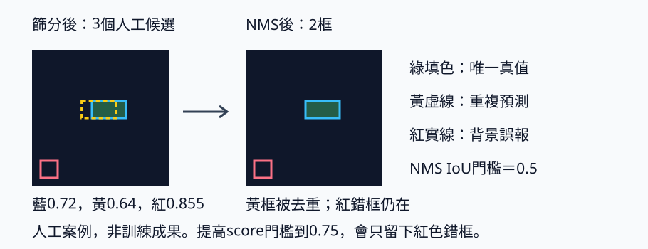

# 人工框解碼與 NMS：少一個框不一定更好

Head輸出的七個數字不是可以直接畫的xyxy框。先把格內偏移與尺寸換成圖上座標，再算score、篩選、去除重複，必要時還原到原圖。本節不用模型猜答案，而是人工指定logits，讓每一步都有已知結果。前置是xyxy與IoU；本頁也簡述grid輸出的各軸。

[在 Colab 執行](https://colab.research.google.com/github/birdhackor/learn_to_yolo/blob/lessons-v0.3.0/notebooks/06-decode-nms.ipynb)，或 `PYTHONPATH=. python lesson_cases/06-decode-nms.py`。CPU純推論幾何，不需反傳或訓練；所有框與分數是人工設計。NMS概念可對照 [Torchvision NMS檔案](https://pytorch.org/vision/stable/generated/torchvision.ops.nms.html)，案例自行實作，不需要安裝torchvision。

框的letterbox（等比例縮放再補邊）、metadata（還原所需紀錄）可回看[座標轉換](04-coordinates.md)。

## 解碼：數字的參考範圍不可混用

MiniYOLO每圖logits為[S,S,5+C]，本例S=4、C=2，最後軸為tx、ty、tw、th、obj、class0、class1。Logit是尚未轉成機率或座標比例的原始分數；sigmoid把一個logit轉成0到1的值，softmax將類別軸轉成加總1的比例。

某候選位於row1、col2，sigmoid(tx)=0.25、sigmoid(ty)=0.75。格尺寸是64/4=16pixels，所以：

\[
c_x=(2+0.25)\times16=36,\qquad
c_y=(1+0.75)\times16=28.
\]

sigmoid(tw)=0.25、sigmoid(th)=0.125表示整圖比例，寬16、高8pixels。左右界36±8、上下界28±4，得xyxy [28,24,44,32]。xy用格尺寸、wh用整圖尺寸，弄反會把框放錯或縮小4倍。

```python
center = (cell_xy + logits[..., :2].sigmoid()) / grid * image_size
size = logits[..., 2:4].sigmoid() * image_size
boxes = torch.cat((center - size/2, center + size/2), dim=-1)
```

cell_xy最後軸是(col,row)，而tensor索引是[row,col]。這也是為什麼案例用meshgrid的indexing="ij"後，另把col、row排成xy。

## Score不是precision

本課分數定義為 \(score=\sigma(obj)\times\max_c softmax(class)_c\)，並選最大類別作label。一個候選objectness0.9、最高類別比例0.8，score就是0.72。原始論文或其他版本可能採不同分數定義，不能把這裡的score解釋成所有detector的通用公式。

Score filtering先丟掉低於0.25的候選。它是模型自己的排序訊號；precision必須將一組預測與真值配對後才知道。Score0.855的框可以完全畫在背景，不能稱為85.5% precision，也不能在沒有校準證據時當成正確機率。

## NMS只處理候選之間的重複

Non-Maximum Suppression（NMS）先選最高分框，保留它，再刪除與它IoU大於門檻的其餘候選，對剩餘框重複。本課按類別分組做class-wise NMS，門檻0.5；相同框不同class不互相抑制。



正確位置附近兩候選分別是[28,24,44,32] score0.72與[23.2,24,39.2,32] score0.64。交集 \(11.2\times8=89.6\)，聯集166.4，IoU約0.5385，大於0.5，低分者被移除。另一個[4,52,12,60] score0.855在背景，不重疊，所以保留。

NMS本身不讀取真值、不修正框，也不知道那個高分框錯了。它可能誤刪兩個靠很近的真實同類物件，因此NMS門檻是速度／重複／重疊物件保留間的取捨。這個實作依序比較框，候選很多時有排序與pairwise IoU成本。

## 四種規則要分清楚

訓練assignment決定誰接收哪個target；NMS是推論時候選與候選去重；評估matching是預測與真值判TP／FP。三者即使用到IoU，用途也不同。

顯示score門檻決定畫哪些框；評估候選截斷決定評估器能看到哪些預測；NMS IoU門檻決定候選互相抑制；評估IoU門檻決定位置夠不夠準。比較模型時固定評估規則，不能把顯示畫得清爽當成AP提升。

本例提高score門檻到0.75，正確框0.72被刪，剩下高分背景框0.855。框數更少，結果卻更差。這是人工反例，不是建議所有資料使用更低門檻。

## 還原、核對與練習

若64×64來自letterbox，decoded框仍在輸入畫布，應依每圖metadata先扣padding再除scale，才畫回原圖。本例直接用64×64的人工座標，所以沒有額外還原。

可核對score列表[0.64,0.72,0.855]、duplicate IoU0.5385、NMS保留索引[2,1]；另一個相同框不同類別測試應兩個都保留，空輸入回空索引。完成這些檢查便證明推論步驟可接起來。

練習保留主案例的門檻與assertion，在其後分別做兩次獨立呼叫。案例已加入以下檢查，不必修改函式預設值：

```python
keep06 = class_nms(boxes, scores, labels, threshold=.6)
assert keep06.tolist() == [2, 1, 0]

boxes70, scores70, labels70 = decode(logits, score_threshold=.70)
assert torch.allclose(scores70, torch.tensor([.72, .855]), atol=1e-6)
```

第一個實驗仍使用原始logits在score門檻0.25產生的三候選；IoU0.5385沒有超過NMS門檻0.6，重複框留下，keep06索引指向原三框，順序[2,1,0]。第二個實驗從同一組原始logits重新decode，score門檻0.70留下0.72和0.855；boxes70等是新的兩候選陣列，不能套用原三框的索引。兩個實驗不累積設定。哪個比較好要看真值配對與需求，不由畫面上的框數單獨決定。

<!-- curriculum-evidence:start -->

## 本輪實際執行紀錄

本節範例已於 2026-10-02 使用 PyTorch 2.9.1+cpu 在 CPU 執行，程式中的斷言全部通過。以下是該次輸出；人工輸入、短步更新與模型效果的意義仍依本頁說明區分。[完整紀錄](https://github.com/birdhackor/learn_to_yolo/blob/main/artifacts/checks/curriculum/06-decode-nms.json)

??? example "展開本次實際輸出"

    ```text
    candidate_boxes=[[23.200000762939453, 24.0, 39.20000076293945, 32.0], [28.0, 24.0, 44.0, 32.0], [3.999999523162842, 52.0, 12.0, 60.0]]
    scores=[0.64, 0.72, 0.855], duplicate_IoU=0.5385
    NMS keep_indices=[2, 1], kept_scores=[0.855, 0.72]
    threshold .75 keeps only artificial false positive, score=0.855
    exercise NMS .6 keeps original candidate indices=[2, 1, 0]
    exercise score .70 keeps scores=[0.72, 0.855]
    identical boxes of different classes both survive class-wise NMS; empty input passed
    All logits are hand-constructed, not a trained detector.
    ```

<!-- curriculum-evidence:end -->
