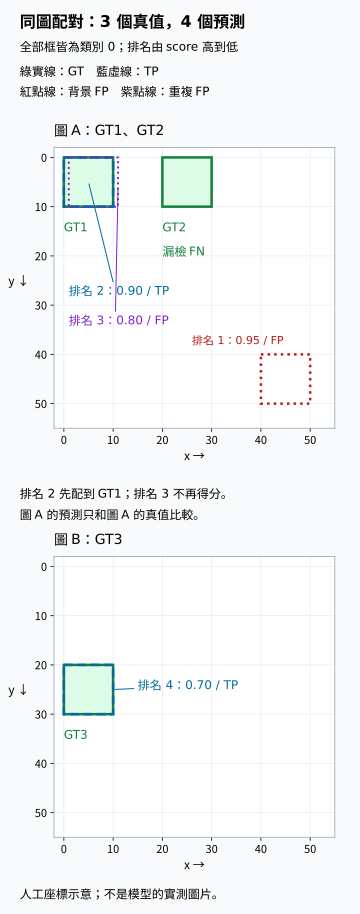

# B.6.2 人工框評估與 AP50：把預測逐筆算成證據

[在 Colab 執行本節](https://colab.research.google.com/github/birdhackor/learn_to_yolo/blob/lessons-v0.6.1/notebooks/06-evaluation.ipynb){ .md-button }

上一節的 NMS 刪掉重複框，卻留下高分誤報；提高顯示門檻，還可能把對框一起刪掉。要評估偵測器，我們得回答兩件事：**交出的框有幾個是對的，該找到的物件又找回多少？**只看框數或 score 都不能作答，必須把預測和正確標註放在一起。

這次用兩張圖、三個真值與四個人工預測，逐筆判斷對錯，再將不同 score 門檻下的結果合成 **AP50**。材料是人工設計的評分練習，不是任何已訓練模型的成績；採用本課程的簡化評估規則，下面會完整交代它。

## 一個真實物件，最多讓一個預測得分

先列出要找的物件，全部是類別 0：

| 圖片 | 真值（GT，ground truth） | xyxy（px） |
| --- | --- | --- |
| A | GT1 | `[0,0,10,10]` |
| A | GT2 | `[20,0,30,10]` |
| B | GT3 | `[0,20,10,30]` |

GT 和預測必須在同一座標空間比較。本例都是各自圖片上的 xyxy px；若預測還在 letterbox 畫布上，先按[當時的 metadata 還原](04-coordinates.md)，再算 IoU。框沿用半開區間，面積為 (x2−x1)(y2−y1)，不加 1。

評估 **matching（配對）**依序讓預測找 GT，這次規則是：

1. 每個類別收集**所有圖片**的預測，按 score 由高到低處理。
2. 每筆只找**同一張圖、同一類別、尚未被配對**的 GT，選其中 IoU 最高的一個。
3. IoU≥0.5 就配對成功，這個 GT 標成已被配對，之後不能再得分；若沒有達標 GT，這筆預測算誤報。
4. 處理完所有預測，仍未被配對的 GT 是漏檢。

配對成功稱為 **TP（True Positive，真陽性，正確偵測）**；畫了框卻未配對成功是 **FP（False Positive，假陽性，誤報）**；沒有被找到的 GT 是 **FN（False Negative，假陰性，漏檢）**。positive 指模型說「有物件」，true／false 指這個說法是否成功配對。偵測通常不數 TN（真陰性，背景也沒有預測），因為背景位置沒有固定的可數總量。

為什麼不讓重複框都算 TP？同一物件畫五個框便能得五分，單純複製輸出就能刷分。每個 GT 只能成功一次，才會讓「找到幾個」對應真實物件數。這也和 NMS 不同：NMS 只比較候選彼此；此處要用 GT 判斷。訓練的 assignment 則是替輸出安排該學的答案。

高分先配對，是為了模擬從高到低放寬顯示門檻：只有高分框時，先決定它們的結果；低分框加入後，不回頭改掉前面的配對。門檻會套到所有圖片，所以同類別的預測也在同一份排行榜中排序，卻各自只能配自己圖片的 GT。



上圖是 A，下圖是 B；綠框 GT1、GT2、GT3 是要找的物件，框旁排名 1～4 是**跨兩圖的 score 排名**。藍色 TP 框找到 GT1 與 GT3；紫框雖靠近 GT1，仍是重複 FP；右下紅框是背景 FP。GT2 沒有預測配對，所以漏檢。圖中的座標窗只是展示人工框的位置，不代表來源圖片的尺寸。

## 四筆預測，逐筆算對與錯

看同一批預測的兩種比例：**precision（精確率，P）**是目前納入的預測中，TP 占幾成；**recall（召回率，R）**是全部 GT 中，已被找到的占幾成。因此每納入一筆，P 的分母是當前預測數，R 的分母一直是 GT 總數 3。

手機上可左右滑動表格，查看每筆的配對理由與累積結果。

| 排名 | 圖／預測框 | Score | 判定 | 判定理由 | TP 累積 | FP 累積 | P | R |
| --- | --- | --- | --- | --- | --- | --- | --- | --- |
| 1 | A，[40,40,50,50] | 0.95 | FP | 背景誤報：和 GT1、GT2 的 IoU 都是 0 | 0 | 1 | 0 | 0 |
| 2 | A，[0,0,10,10] | 0.90 | TP | 配對 GT1（IoU=1） | 1 | 1 | 1/2 | 1/3 |
| 3 | A，[1,0,11,10] | 0.80 | FP | 重複框：GT1 已被配對，剩下的 GT2 IoU=0 | 1 | 2 | 1/3 | 1/3 |
| 4 | B，[0,20,10,30] | 0.70 | TP | 配對 GT3（IoU=1） | 2 | 2 | 1/2 | 2/3 |


第 3 筆 `[1,0,11,10]` 和 GT1 的 IoU=9/11≈0.818：兩框各 100 px²，交集 90，聯集 110。但它是 FP，因為 GT1 已被更高分的第 2 筆配走；剩下 GT2 與它沒有交集。圖 B 的第 4 筆只能找圖 B 的 GT，不會因座標相似去配圖 A。

四筆全部納入後，TP=2、FP=2、FN=1：

\[
P=\frac{TP}{TP+FP}=\frac24=0.5,\qquad
R=\frac{TP}{TP+FN}=\frac23\approx0.6667.
\]

這兩個數回答不同問題：一半預測正確，三個物件找回兩個。score 0.95 的第 1 筆卻是背景誤報，說明 score 是排序訊號，不是 precision。

若只留下 0.90 那框，P=1、R=1/3：交出的框全對，卻漏掉兩個物件。所以不能只報「預測有多可靠」，也要看找回多少。刪框時還要重新配對，而不是沿用原來的 TP／FP 標記。

??? note "選讀：刪對框，precision 也不一定下降"

    只刪排名 1 的背景 FP，P 由 1/2 升到 2/3，R 不變；只刪排名 4 的 TP，P、R 都變 1/3。但只刪排名 2 的 TP，GT1 重新空出來，排名 3 與它 IoU≈0.818，改算 TP，P 反而升為 2/3、R 不變。結果取決於剩下候選的重新配對，不只取決於被刪框原本的標記。

## 不替模型選死一個 score 門檻：畫 PR 曲線

剛才 P=0.5、R=2/3 是四筆全納入的結果。只納入第 1 筆、前 2 筆、前 3 筆，也各有一組 P、R，相當於將 score 門檻逐次放寬。評估器把候選由高分到低分逐筆納入，每次記一個 **PR（Precision–Recall，精確率－召回率）點**，才看得到整段取捨。

表格最後兩欄給出四個 (recall,precision)：(0,0)、(1/3,1/2)、(1/3,1/3)、(2/3,1/2)。PR 圖橫軸是 recall，縱軸是 precision；score 控制納入順序，不是橫軸。


橘點是逐筆結果：第 2、3 筆都有 R=1/3，因為第 3 筆只增加 FP；它的 P 從 1/2 降到 1/3。第 4 筆增加 TP，P 又回到 1/2、R 升到 2/3。灰虛線只是連起原始鋸齒，後面要算的面積使用藍色階梯。

本節採 **all-points interpolated AP（全點插值平均精確率）**。它先問：若要求至少某個 recall，所有能達到它的門檻中，最好 precision 是多少？這叫 **precision envelope（精確率包絡）**。用 \((r_k,p_k)\) 表示各 PR 點，在 recall 位置 r 的高度是

\[
\hat p(r)=\max_{k:r_k\ge r}p_k.
\]

也就是從當前位置往右，取看得到的最高 precision。第 3 筆的 P=1/3 可被更右邊的第 4 筆 1/2 抬高：多納入第 4 筆後，找回更多，precision 也更好。圖中藍箭頭表示這個包絡高度的改變，**第 3 筆仍然是 FP**，沒有被改成正確預測。

往右看的範圍越小，最大值只能不變或降低，所以包絡是只降不升的階梯。interpolated 指用這種規則補出各 recall 的高度，不是用直線內插；all-points 則使用所有 recall 改變的位置。

程式在前後補 (0,0)、(1,0)，讓面積涵蓋完整 recall 0～1，再由右往左取最大值。起點的 0 是占位，會被右側最大值取代；本例 recall>2/3 時，右側只剩終點 (1,0)，包絡只能為 0。這段正是 GT2 漏檢的影響。若原本已達 recall=1，補點帶來的區間寬度為 0，不改面積。

## 包絡的面積，就是這次 AP50

圖中藍線在 recall 0～2/3 高 1/2，2/3～1 高 0，所以淺藍面積為

\[
AP=(2/3)\times(1/2)+(1/3)\times0=1/3.
\]

**AP（Average Precision，平均精確率）**按 recall 增加量加權平均包絡高度。recall 的總寬度正好是 1，「寬×高」的總和就是平均高度，也就是面積。本次用 IoU≥0.5 判配對，因此叫 **AP50**，50 指配對 IoU 門檻，不是 score=0.5。

一般計算是在各 recall 增加處加總：

\[
AP=\sum_k(r_k-r_{k-1})\hat p(r_k).
\]

主例每段寬 1/3，右端包絡高度依序是 1/2、1/2、0，合計 1/6＋1/6=1/3。同 recall 的第 2、3 筆之間寬度是 0，沒有面積；相鄰 recall 間沒有其他點，往右看到的最佳高度就是右端點的包絡高度。

這個分數同時受排序、誤報與漏檢影響：高分 FP 先降低 P，沒被找到的 GT 讓右端一段高度為 0。但它不是一張圖片的「框得多準」，也不是最後一組 P、R 的簡單乘積。

??? note "選讀：AP 為什麼通常不等於最後的 P×R？"

    本例 AP 恰好等於最後的 P×R（0.5×2/3），因為包絡在 recall 0 到 2/3 一路都等於最後的 precision 0.5。一般來說，包絡在 recall 0 到最後的 R 之間至少是最後的 precision，所以 AP ≥ 最後的 P×R，只有包絡在這一段一路都等於最後的 precision 時才相等。光是包絡平坦還不夠：在主例最後再加一筆分數更低的 FP，包絡完全不變，AP 仍是 1/3，最後的 P×R 卻降成 0.4×2/3=4/15。本節的練習也是一個不相等的例子。


??? note "選讀：對照程式與其他 AP 面積算法"

    `interpolated_ap` 先補兩個端點，由右向左取最大 precision，再找 recall 改變的位置，逐段累加面積。以下是只表達公式、不能直接執行的虛擬碼：

    ```python
    ap = sum((recall_next - recall_previous) * precision_envelope_next)
    ```

    本節不算相鄰原始 PR 點的梯形面積，也不同於舊 Pascal VOC 的 11 點平均。舊方法在 recall=0,0.1,…,1 讀包絡：主例 0～0.6 的 7 點高 0.5，0.7～1 的 4 點高 0，得 3.5/11≈0.318，而非 1/3。比較工具輸出前，要確認相同 AP 定義。

## 評估看不到被提前刪掉的框

顯示時可為了使用需求選門檻，算 AP 卻需要保留足夠低分的候選，讓評估器真的能掃到後面的 recall。如果**交給評估前**只保留 score≥0.85，表中剩下第 1 筆 FP 與第 2 筆 TP；圖 B 的 0.70 正確框也已消失。

這時 recall 最多為 1/3，包絡只有 0～1/3 高 0.5，AP50=1/6。這叫**評估候選截斷**：它限制評估器能達到的範圍，不只是畫面上少幾個框。截斷 score 門檻、NMS 的候選彼此 IoU 門檻、評估的預測對 GT IoU 門檻，各有自己的用途，不能互換。

本例沒有做 NMS，刻意保留重複框來核對配對。正式比較時則要固定候選前處理、分數排序、配對規則、AP 算法與評估資料。空圖也可能貢獻 FP；漏標物件會把原本對的預測算成 FP，所以標註品質也是分數的一部分。小資料的一次差異不能證明某架構普遍更好。

## 類別與定位門檻，如何合成總分

多類別時先各算 AP，再取 **mAP（mean AP，各類 AP 的平均）**。各類都用 IoU≥0.5，便是 mAP50。例如兩個有 GT 的類別 AP50=1/3、1，mAP50=(1/3＋1)/2=2/3。

本節 `evaluate` 預設類別 0、1；主例只有類別 0 有 GT。類別 0 的 AP50=1/3，類別 1 記 **None**，不放進平均，因此 mAP50 也是 1/3。有 GT 但完全沒有預測，AP=0；整批沒有 GT，mAP=None，表示沒有可測的物件，不當成滿分。precision／recall 分母為 0 時，本節回報 0，其他工具可能標成未定義。

**COCO（Common Objects in Context，情境中的常見物件）**是公開偵測資料集。其常用 AP 將 IoU=0.50、0.55、…、0.95 十個門檻與類別平均，每個門檻又在 recall=0,0.01,…,1 的 101 點讀包絡；官方用 AP 一詞也涵蓋類別平均。因此這裡的單門檻、all-points 分數不能直接當成 COCO AP。若同一模型 AP50 很高、較嚴格的 AP75（IoU≥0.75）很低，框可能大致找到物件，位置卻不夠準。

Pascal VOC（Visual Object Classes，視覺物件類別）與 COCO 都有固定資料與官方評分規則，供公開 **benchmark（基準測試）**比較。本節除了 AP 算法，配對與特殊標註處理也有簡化，正式評分應用官方工具。

??? note "選讀：官方規則的來源"

    [Pascal VOC 官方評估說明](https://www.robots.ox.ac.uk/~vgg/projects/pascal/VOC/voc2012/htmldoc/index.html#SECTION00054000000000000000)的 4.4 節說明偵測評估，3.4.1 節說明 AP；另見 [COCO detection evaluation](https://cocodataset.org/#detection-eval)。實際配對順序、難以辨認物件、候選上限，以官方評分程式為準。

??? note "本書配對與官方 VOC／COCO 的差別"

    本書評估器先排除已被配對的 GT，再從剩下的 GT 中找 IoU 最高的。官方 VOC 則先在全部 GT 中找 IoU 最高的，再檢查它是否已被配對；若已被配對，這筆預測就算 FP。同一張圖有兩個高度重疊的 GT 時，兩種做法可能得到不同結果。

    數字例：同一張圖有 GT 甲 [0,0,10,10] 與 GT 乙 [1,0,11,10]，兩個預測都是 [0,0,10,10]，score 分別是 0.9 與 0.8。第 1 個預測和甲的 IoU=1，兩種做法都配給甲。第 2 個預測：

    - 本書：排除已被配對的甲，改找乙，IoU=9/11≈0.818，達標，所以兩個預測都是 TP。
    - 官方 VOC：在全部 GT 中 IoU 最高的仍是甲；甲已被配對，所以第 2 個預測算 FP。

    這是本書簡化過的配對規則，不能稱為完整的 VOC 評估器。COCO 官方程式（pycocotools）的基本配對順序則和本書一樣：先排除已被配對的 GT，再從剩下的 GT 中找 IoU 最高的（crowd、ignore 另有處理，見下）。所以上面的數字例交給 COCO 的程式、配對 IoU 門檻取 0.5 時，兩個預測也都是 TP。本書和 COCO 在配對上的差別，是 COCO 還有其他額外規則，例如：

    - crowd：一大群擠在一起、很難逐一標框的物件，標成一個 crowd 區域；配到它的預測不算 TP，也不算 FP。
    - ignore：像 crowd 這樣「評估時不計分」的 GT 或預測。VOC 標成 difficult 的物件也屬於這一類：不算進 GT 總數，配到它的預測不算 TP 也不算 FP。這和[第 5 章](05-assignment.md)訓練時「暫不給某項 loss」的 ignore 不是同一件事。
    - 候選數上限：每張圖、每個類別最多只計分數最高的 100 個預測。COCO 網站的說明寫成每張圖跨所有類別合計 100 個，但官方評分程式（pycocotools）實際上按類別分開計。

    這些細節的出處是官方評分程式。VOC 的程式是開發套件 [VOCdevkit_18-May-2011.tar](https://www.robots.ox.ac.uk/~vgg/projects/pascal/VOC/voc2012/VOCdevkit_18-May-2011.tar) 裡的 `VOCcode/VOCevaldet.m`：每筆預測先跑完同一張圖、同一類別的全部 GT，記下 IoU 最高的那個（程式裡的 `ovmax`、`jmax`），之後才檢查它是不是 difficult（`diff`）、是否已被配對（`det`）；GT 總數也只加上非 difficult 的物件。COCO 的程式是 pycocotools 的 `cocoeval.py`：其中的 [`evaluateImg`](https://github.com/cocodataset/cocoapi/blob/8c9bcc3cf640524c4c20a9c40e89cb6a2f2fa0e9/PythonAPI/pycocotools/cocoeval.py#L235-L296) 每次只處理一張圖的一個類別，先把預測截成分數最高的 `maxDet` 個（算 AP 時是 100），配對時跳過已被配對、又不是 crowd 的 GT；把 crowd 設成 ignore 的，是同一個檔案裡[準備資料的步驟](https://github.com/cocodataset/cocoapi/blob/8c9bcc3cf640524c4c20a9c40e89cb6a2f2fa0e9/PythonAPI/pycocotools/cocoeval.py#L106-L109)。

    所以正式 benchmark 應使用官方工具，不能只把 AP 的面積算法換掉，就當成官方分數。


## 用已知答案核對評估器

Colab 或本機 `PYTHONPATH=. python lesson_cases/06-evaluation.py` 在 CPU 上評分人工框，不做 backward。輸出前四行應和逐筆表格一致，接著是 `TP=2, FP=2, FN=1, mAP50=0.333333, ap_per_class=[0.333333,None]`；截斷實驗是 `mAP50=0.166667, recall=0.3333`。這些只是評分規則的核對，不是模型成績。

每圖的 GT 為 `[N,4]` boxes、`[N]` labels；預測為 `[M,4]` boxes、`[M]` scores 與 labels，N、M 都可為 0。程式還檢查有 GT 無預測時 AP=0、空圖有預測時仍計 FP、無 GT 的類別不進 mAP 平均。

## 自主練習與答案

拿掉排名 1 的背景誤報（score 0.95 那筆），GT 不變。請依序判斷剩下三筆是 TP 還是 FP，算出每一步的 P、R，再畫出包絡、算出 AP。這是手算題，不必改程式。

??? note "參考答案"

    依序是 TP、FP、TP：

    | Score | 判定 | P | R |
    | --- | --- | --- | --- |
    | 0.90 | TP | 1 | 1/3 |
    | 0.80 | FP | 1/2 | 1/3 |
    | 0.70 | TP | 2/3 | 2/3 |

    包絡：recall 0 到 1/3 高 1，1/3 到 2/3 高 2/3，2/3 到 1 高 0（每段寬 1/3）。AP=1/3×1+1/3×2/3=5/9≈0.556。完整程式（Colab 裡的那份）中的 `cleaned` 就是這個改動：評估它的結果存進 `clean_result`，斷言（assert）核對其中的 mAP 欄位 `clean_result["map"]` 是 5/9，並印出 `remove known high-score FP: mAP50=0.555556`。這裡同樣只有類別 0 有 GT，所以 mAP50 就是這題的 AP。

    這裡 AP=5/9，比最後的 P×R=2/3×2/3=4/9 大：包絡不是全平的，所以 AP 大於 P×R。

這個改動是靠 GT 才認出錯框，屬於人工檢查；部署時沒有 GT，不能這樣刪框來提高 AP。

<!-- curriculum-evidence:start -->

## 實際執行紀錄

本節的完整程式於 2026-10-08 在 AMD EPYC 9V74 80-Core Processor（2 個執行緒）上用 PyTorch 2.9.1+cpu 執行，程式裡的 assert 全部通過。下面是那次印出的原始輸出；輸出裡若有計時或訓練得到的數字，換一台電腦會略有不同。每個數字的意思，以本頁正文的說明為準。[完整紀錄（JSON）](https://github.com/birdhackor/learn_to_yolo/blob/main/artifacts/checks/curriculum/06-evaluation.json)

??? example "展開本次實際輸出"

    ```text
    rank=1, score=0.95, FP, precision=0.0000, recall=0.0000
    rank=2, score=0.90, TP, precision=0.5000, recall=0.3333
    rank=3, score=0.80, FP, precision=0.3333, recall=0.3333
    rank=4, score=0.70, TP, precision=0.5000, recall=0.6667
    TP=2, FP=2, FN=1, mAP50=0.333333, ap_per_class=[0.333333, None]
    candidate threshold .85: mAP50=0.166667, recall=0.3333
    remove known high-score FP: mAP50=0.555556
    no predictions => AP=0 when GT exists; no-GT class AP=None; background FP counted
    Artificial scoring exercise; not measured detector performance.
    ```

<!-- curriculum-evidence:end -->
