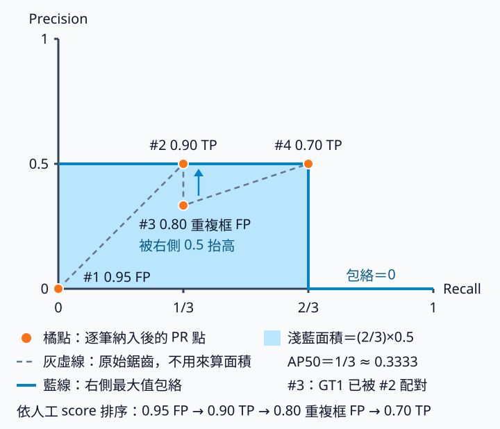

# 6.2 人工框評估與 AP50：把預測逐筆算成證據

[在 Colab 執行本節](https://colab.research.google.com/github/birdhackor/learn_to_yolo/blob/lessons-v0.6.0/notebooks/06-evaluation.ipynb){ .md-button }

模型在很多張圖上畫了一堆框，要怎麼變成一個能和別人比較的分數？把框疊在圖上看起來不錯，不表示漏檢少或背景誤報少。本節用 2 張圖、3 個真值框、4 個人工給定的預測框，一步步判斷哪些框算對、哪些算錯、漏了幾個，最後算出 AP50 這個總分。讀完後，你能手算一組框的評估結果，並拿它核對評估程式。

做法是：每個類別先把預測按 score 由高到低排好，再依序和同一張圖、同一類別的真值配對，判出哪些是正確偵測（TP）、哪些是誤報（FP）、哪些真值被漏掉（FN）；最後畫出 PR 曲線（後面說明），算曲線下的面積。前置只要 xyxy 框與 IoU，本節會先複習；不需要已訓練的模型。

可以用頁首的按鈕在 Colab 執行，或在本機執行 `PYTHONPATH=. python lesson_cases/06-evaluation.py`。全程在 CPU 上只做評估：所有框與 score 都是人工指定，不做 backward。本節的評估器是教學簡化版，AP 也只採其中一種算法；和官方評分程式差在哪裡，後文會說明。

## 配對（matching）是評估規則，不是訓練時的 assignment

真值（GT，ground truth）是人工標註的框；預測（pred）是模型輸出的框，本節改由人工給定。每張圖的 GT boxes 是 [N,4]、labels 是 [N]；預測的 boxes 是 [M,4]，scores 與 labels 是 [M]。N、M 每張圖可以不同，也可以是 0。類別編號（id）從 0 開始。

GT 和預測必須在同一種座標裡比較，通常是原圖的 pixel 座標（本書用 xyxy）。若預測還在 letterbox（等比縮放再補邊）後的輸入畫布上，要先用當時的變換紀錄（metadata：縮放比例、補邊量等）還原，做法見[座標轉換](04-coordinates.md)；否則 IoU 會算錯。

xyxy 的 [x1,y1,x2,y2] 表示左上角與右下角，x 向右、y 向下。本書使用半開區間，框寬是 x2−x1、框高是 y2−y1，不加 1。IoU 是兩框交集面積除以聯集面積，介於 0 與 1；兩框相同時為 1，沒有交集時為 0。例如稍後主例中的 [0,0,10,10] 與 [1,0,11,10]，各有 100 pixels² 面積、交集 90，IoU 為 \(90/(100+100-90)=9/11\approx0.818\)。

此處 IoU 門檻是 0.5。每個類別把**所有圖片的預測收集起來**，按 score 由高到低逐筆處理。每筆預測只找同一張圖、同一類別、還沒被配對的 GT，取其中 IoU 最高的一個。若這個 IoU 至少 0.5，就配對成功，記為 true positive（TP），這個 GT 從此是「已被配對的 GT」。否則這筆預測記為 false positive（FP）。全部處理完後，沒有被配對的 GT 記為 false negative（FN）。

這三個名字這樣讀：positive（陽性）指模型說「這裡有物件」，也就是畫了框；true／false 指這個說法對不對。所以 TP（真陽性）是配對成功的正確偵測。FP（假陽性）是畫了框卻沒有配對成功，也就是誤報（重複框也算）。FN（假陰性）是那裡真的有物件，模型卻等於說「沒有」：沒有任何框和這個 GT 配對成功，也就是漏檢。偵測不計算 TN（真陰性：沒有物件、也沒畫框的位置），因為這種背景位置數不完，所以後面的指標只用 TP、FP、FN。

為什麼讓高分的先挑 GT？按 score 由高到低處理，相當於模擬使用時把顯示門檻（只畫出 score 不低於它的框）從高往低慢慢放寬：門檻高時只看得到高分框，它們先配對；之後才放進來的低分框，不能改掉前面的結果。所以是高分的先挑，而不是 IoU 最高的先挑。顯示門檻是對所有圖片一起設的，所以同一類別要把所有圖片的預測排在同一張排行榜上。

一個 GT 最多只能配對成功一次。如果重複框也算 TP，同一個物件畫 5 次就有 5 個 TP，TP 甚至比 GT 還多，只要複製框就能刷分；所以每個 GT 最多讓一筆預測得分。重複框即使和已被配對的 GT 重疊很多，只要找不到別的 IoU 達標的 GT，仍算 FP。預測也只和同一張圖的 GT 比：例如圖 A 若有一個 [0,20,10,30] 的預測，即使座標和稍後主例中圖 B 的 GT3 一模一樣，也只能和圖 A 的 GT 比。NMS 是推論階段替候選框去重；評估配對則有 GT 參與。本節的例子故意保留重複候選，檢查評估器會不會把它錯算成第二個 TP。

上一節的顯示門檻決定畫面上畫出哪些框，後面的 PR 曲線會模擬把它設在不同高度。另外還有三種門檻，比較的對象各不相同：**評估候選截斷門檻**比較候選自己的 score，決定哪些候選交給評估器，被刪掉的候選，評估器完全看不到；**NMS 的 IoU 門檻**比較候選框彼此，決定是否抑制重複候選；**配對 IoU 門檻**比較候選與 GT，決定是否配對成功。三者各自設定。本例不執行 NMS；評估函式的 `match_iou_threshold=.5` 只控制預測與 GT 的配對，後面 score≥0.85 的實驗則是先用截斷門檻刪掉候選。

## 四個預測、三個真值

圖 A 有 GT1 [0,0,10,10] 及 GT2 [20,0,30,10]；圖 B 有 GT3 [0,20,10,30]，全都是類別 0。完整程式的 `evaluate` 預設 `num_classes=2`（類別 0、1）；類別 1 在兩張圖都沒有 GT，也沒有預測，用來示範 AP=None。

預測按 score 排序如下。排名 1 的 [40,40,50,50] 在 GT1、GT2 的右下方，和任何 GT 都不重疊；排名 3 的 [1,0,11,10] 只比 GT1 右移 1 pixel。表中 P=TP 累積÷排名，R=TP 累積÷3（GT 總數），意思見表格下方。

| 排名 | 圖／預測框 | Score | 判定 | 判定理由 | TP 累積 | FP 累積 | P | R |
| --- | --- | --- | --- | --- | --- | --- | --- | --- |
| 1 | A，[40,40,50,50] | 0.95 | FP | 背景誤報：和 GT1、GT2 的 IoU 都是 0 | 0 | 1 | 0 | 0 |
| 2 | A，[0,0,10,10] | 0.90 | TP | 配對 GT1（IoU=1） | 1 | 1 | 1/2 | 1/3 |
| 3 | A，[1,0,11,10] | 0.80 | FP | 重複框：GT1 已被配對，剩下的 GT2 IoU=0 | 1 | 2 | 1/3 | 1/3 |
| 4 | B，[0,20,10,30] | 0.70 | TP | 配對 GT3（IoU=1） | 2 | 2 | 1/2 | 2/3 |

第 3 筆和 GT1 的 IoU 有 0.818，仍算 FP：原因是 GT1 已經和第 2 筆配對，不是重疊不夠。GT2 沒有任何預測，所以 FN=1。

precision（精確率）是交給評估的預測中，TP 所占的比例，也就是「說有物件的框裡，對的占幾成」。recall（召回率）是全部 GT 中被找到的比例，也就是「該找的物件找回幾成」。本例 TP+FP=4 是預測總數，TP+FN=3 是 GT 總數：

\[
P=\frac{TP}{TP+FP}=\frac{2}{4}=0.5,\qquad
R=\frac{TP}{TP+FN}=\frac{2}{3}\approx0.6667.
\]

兩者的分母不同：recall 的分母是 GT 總數（本例固定是 3），precision 的分母是交給評估的預測數。所以模型少畫框時，recall 只會不變或下降；precision 則要看刪掉的是錯框還是對框。例如只刪排名 1 的錯框，P 由 1/2 升到 2/3、R 不變；只留 0.90 那一框，P=1、R=1/3；只刪排名 4 的正確框，P、R 都降到 1/3。但刪掉對框不一定讓 P 下降：只刪排名 2 的 0.90 時，GT1 空了出來，排名 3 的重複框改配 GT1（IoU=9/11≈0.818，達標）而算 TP，P 反而由 1/2 升到 2/3、R 不變。所以刪框後要重新配對，再看 P 怎麼變。

排名 1 的框 score 高達 0.95，卻是背景誤報。score 是模型自己的排序訊號（見[上一節](06-decode-nms.md)講 score 的那一小節），高分不保證正確，所以 score 不等於 precision。

本節先走完這套簡化規則的主例，再看頁尾的官方評分差異；它的數字不能當成正式 benchmark 成績。

## PR 曲線：評估器由高分往低分逐筆納入

上面的 P=0.5、R=2/3 是四筆全部納入時的結果。若只納入第 1 筆，或只納入前 2 筆、前 3 筆，每種情況都有自己的一組 recall 與 precision，就像使用時把顯示門檻設在不同高度。只報其中一組，等於替模型挑好了門檻。所以評估器在交進來的候選中，由高分往低分逐筆納入，每納入一筆就記下一個點；這些點畫成的曲線就是 PR 曲線（precision–recall 曲線）。最後再用曲線下的面積，把所有門檻總結成一個數字。

四個點直接取自表格的 R、P 兩欄，寫成與圖一致的 (recall, precision)：第 1 筆後 (0, 0)、第 2 筆後 (1/3, 1/2)、第 3 筆後 (1/3, 1/3)、第 4 筆後 (2/3, 1/2)。PR 圖的橫軸是 recall、縱軸是 precision；分數不是圖的橫軸，分數控制「目前納入到哪一筆」。



看圖時注意：recall=1/3 的兩個橘點，上面是第 2 筆、下面是第 3 筆；藍線是下面要講的包絡，它在 recall 2/3 到 1 那段貼著橫軸，表示高度是 0。

原始的 PR 點會鋸齒狀上下跳：多一個 FP，precision 就往下掉；遇到 TP 又回升，例如第 3 筆的 1/3 到第 4 筆又回到 1/2。All-points interpolated AP 先把鋸齒修平。理由是：如果多納入幾筆以後，recall 更高、precision 也不比現在低，那停在原處就沒有意義。所以在 recall 的每個位置 r，記下「往右走拿得到的最好 precision」：

\[
\hat p(r)=\max_{k:\ r_k\ge r} p_k
\]

其中 \((r_k, p_k)\) 是第 k 個 PR 點（含下文的兩個補點）。r 可以是 0 到 1 之間的任何數，但 \(\hat p\) 只會在 PR 點的 recall 位置改變高度，所以實際只需在各 PR 點計算。

修平後的曲線叫 precision envelope（包絡），是只降不升的階梯，可以減少排序小變動造成的鋸齒影響。第 3 筆的 1/3 可以由第 4 筆的 0.5 抬到 0.5，第 1 筆的 (0, 0) 也一樣被抬到 0.5；這是計分曲線的定義，不是更改某筆預測的真假。名稱裡的 interpolated（插值）指用右側最大值補出每個 recall 的高度，不是把點用直線連起來的內插；all-points 指每個 recall 改變的位置都算進來，不像後面提到的舊算法只取 11 個位置。

包絡要往右看，但最後一個 PR 點的右邊一定沒有點；面積也要從 recall=0 開始算。所以完整程式的 `interpolated_ap` 一律在最前面補 (recall=0, precision=0) 當起點、最後面補 (recall=1, precision=0) 當終點，再從右往左逐點取最大值。起點的 precision 0 只是占位，取最大值後會換成右側的最大值。本例 recall 超過 2/3 時，右側只剩補上的 (1, 0)，所以包絡是 0。若 recall 本來就到得了 1，補上的終點寬度是 0，不影響結果。

最後的包絡：recall 從 0 到 2/3，高 0.5；從 2/3 到 1，高 0。面積是 \((2/3)\times0.5=1/3\)。GT2 一直沒被找到，曲線最遠只到 recall 2/3；2/3 到 1 這段寬 1/3、高 0，就是漏檢讓 AP 少掉的部分。

這塊面積就是 AP（Average Precision，平均精確率）。為什麼叫「平均」？把包絡各段的高度按寬度加權平均，等於「寬×高」的總和除以總寬；recall 軸從 0 到 1，總寬正好是 1，所以面積就等於包絡的平均高度。本例前 2/3 高 0.5、後 1/3 高 0，平均高度是 1/3。

程式更一般地在 recall 增加處累加「recall 增加量×包絡 precision」：

\[
AP=\sum_k (r_k-r_{k-1})\,\hat p(r_k)
\]

主例拆成三段：recall 0 到 1/3，寬 1/3、高 1/2；1/3 到 2/3，寬 1/3、高 1/2；2/3 到 1，寬 1/3、高 0。合計 1/6+1/6+0=1/3。每段的高度取右端點的包絡值，因為相鄰兩個 recall 值之間沒有別的 PR 點，段內每個位置往右看到的最大值，都等於右端點的包絡值。寫成虛擬碼（pseudocode，只表達計算步驟、不能直接執行的示意程式）是：

```python
ap = sum((recall_next - recall_previous) * precision_envelope_next)  # 公式虛擬碼，名稱表示各段寬度與高度
```

這不是把相鄰點用直線連起來、算梯形面積的做法，也不是舊 Pascal VOC（Visual Object Classes，視覺物件類別）評比的 11 點平均；VOC 是公開的物件偵測資料集與評分基準。舊 VOC 只在 recall=0, 0.1, …, 1 這 11 個位置讀包絡高度再平均：主例在 0 到 0.6 的 7 個位置高 0.5，在 0.7 到 1 的 4 個位置高 0，平均 3.5/11≈0.318，不是 1/3。若比較不同工具，先確認 AP 定義。

??? note "選讀：AP 為什麼通常不等於最後的 P×R？"

    本例 AP 恰好等於最後的 P×R（0.5×2/3），因為包絡在 recall 0 到 2/3 一路都等於最後的 precision 0.5。一般來說，包絡在 recall 0 到最後的 R 之間至少是最後的 precision，所以 AP ≥ 最後的 P×R，只有包絡在這一段一路都等於最後的 precision 時才相等。光是包絡平坦還不夠：在主例最後再加一筆分數更低的 FP，包絡完全不變，AP 仍是 1/3，最後的 P×R 卻降成 0.4×2/3=4/15。本節的練習也是一個不相等的例子。

## AP50、mAP 與 COCO 多門檻

AP50 的 50 表示上述配對使用 IoU≥0.5。多類別時先分別算每類的 AP，再平均成 mAP（mean AP：m 是 mean，即各類別 AP 的平均）；每一類都用 IoU≥0.5 配對時，這個平均就是 mAP50。例如兩個有 GT 的類別 AP50 為 1/3 及 1，mAP50 就是 2/3。沒有 GT 的類別，本節把 AP 記為 None，不放進平均；有 GT 但沒有預測，AP=0。整個資料都沒有 GT 時，mAP 也記為 None，避免把「沒東西可測」當作滿分。

COCO（Common Objects in Context，情境中的常見物件）是另一個公開物件偵測資料集。它常報的 AP，是在 IoU 門檻 0.50、0.55、…、0.95 共 10 個門檻的平均；每個門檻在 recall=0, 0.01, …, 1 這 101 個位置讀包絡高度再平均，也對所有有 GT 的類別取平均，所以照本節的用語，它其實是 mAP（COCO 官方不區分 AP 與 mAP）。另外還有其他規則（見下方摺疊區）。因此不能把本節單一門檻、all-points 的數字直接當成 COCO AP。較高的 IoU 門檻要求更準的框：如果同一模型的 AP50 很高，但在 IoU 0.75 這類嚴格門檻下的 AP 很低，表示框大致找到了物件、位置卻不夠準，可能是定位問題。

本書這套配對規則是教學簡化版。常見的官方規則來自 Pascal VOC 與 COCO：它們是兩個常用的公開物件偵測資料集，各附官方評分程式。論文常拿它們的分數互相比較，這種固定資料與規則的公開評比叫 benchmark（基準測試）。規則文字見 [Pascal VOC 官方評估說明](https://www.robots.ox.ac.uk/~vgg/projects/pascal/VOC/voc2012/htmldoc/index.html#SECTION00054000000000000000)（VOC2012 開發套件文件的 4.4 節；AP 的算法在同一份文件的 3.4.1 節）與 [COCO detection evaluation](https://cocodataset.org/#detection-eval)；配對順序、VOC 標成 difficult（難以辨認）的物件怎麼計數、候選數上限這類細節，以官方評分程式為準。本書和它們差在哪裡，以及這些細節在程式裡的出處，見下方摺疊區。

??? note "本書配對與官方 VOC／COCO 的差別"

    本書評估器先排除已被配對的 GT，再從剩下的 GT 中找 IoU 最高的。官方 VOC 則先在全部 GT 中找 IoU 最高的，再檢查它是否已被配對；若已被配對，這筆預測就算 FP。同一張圖有兩個高度重疊的 GT 時，兩種做法可能得到不同結果。

    數字例：同一張圖有 GT 甲 [0,0,10,10] 與 GT 乙 [1,0,11,10]，兩個預測都是 [0,0,10,10]，score 分別是 0.9 與 0.8。第 1 個預測和甲的 IoU=1，兩種做法都配給甲。第 2 個預測：

    - 本書：排除已被配對的甲，改找乙，IoU=9/11≈0.818，達標，所以兩個預測都是 TP。
    - 官方 VOC：在全部 GT 中 IoU 最高的仍是甲；甲已被配對，所以第 2 個預測算 FP。

    這是本書簡化過的配對規則，不能稱為完整的 VOC 評估器。COCO 官方程式（pycocotools）的基本配對順序則和本書一樣：先排除已被配對的 GT，再從剩下的 GT 中找 IoU 最高的（crowd、ignore 另有處理，見下）。所以上面的數字例交給 COCO 的程式、配對 IoU 門檻取 0.5 時，兩個預測也都是 TP。本書和 COCO 在配對上的差別，是 COCO 還有其他額外規則，例如：

    - crowd：一大群擠在一起、很難逐一標框的物件，標成一個 crowd 區域；配到它的預測不算 TP，也不算 FP。
    - ignore：像 crowd 這樣「評估時不計分」的 GT 或預測。VOC 標成 difficult 的物件也屬於這一類：不算進 GT 總數，配到它的預測不算 TP 也不算 FP。這和[第 5 章](05-assignment.md)訓練時「暫不給某項 loss」的 ignore 不是同一件事。
    - 候選數上限：每張圖、每個類別最多只計分數最高的 100 個預測。COCO 網站的說明寫成每張圖跨所有類別合計 100 個，但官方評分程式（pycocotools）實際上按類別分開計。

    這些細節的出處是官方評分程式。VOC 的程式是開發套件 [VOCdevkit_18-May-2011.tar](https://www.robots.ox.ac.uk/~vgg/projects/pascal/VOC/voc2012/VOCdevkit_18-May-2011.tar) 裡的 `VOCcode/VOCevaldet.m`：每筆預測先跑完同一張圖、同一類別的全部 GT，記下 IoU 最高的那個（程式裡的 `ovmax`、`jmax`），之後才檢查它是不是 difficult（`diff`）、是否已被配對（`det`）；GT 總數也只加上非 difficult 的物件。COCO 的程式是 pycocotools 的 `cocoeval.py`：其中的 [`evaluateImg`](https://github.com/cocodataset/cocoapi/blob/8c9bcc3cf640524c4c20a9c40e89cb6a2f2fa0e9/PythonAPI/pycocotools/cocoeval.py#L235-L296) 每次只處理一張圖的一個類別，先把預測截成分數最高的 `maxDet` 個（算 AP 時是 100），配對時跳過已被配對、又不是 crowd 的 GT；把 crowd 設成 ignore 的，是同一個檔案裡[準備資料的步驟](https://github.com/cocodataset/cocoapi/blob/8c9bcc3cf640524c4c20a9c40e89cb6a2f2fa0e9/PythonAPI/pycocotools/cocoeval.py#L106-L109)。

    所以正式 benchmark 應使用官方工具，不能只把 AP 的面積算法換掉，就當成官方分數。

## 截斷、核對與代價

主例執行後，前四行依排名印出每一筆的 score、判定與 P、R，和前面的表格逐列對應；接著印出 `TP=2, FP=2, FN=1, mAP50=0.333333, ap_per_class=[0.333333, None]`。`ap_per_class` 依類別 0、1 的順序列出各類的 AP：類別 0 的 AP 是 1/3；類別 1 沒有 GT，AP=None，不放進平均，所以 mAP50 也是 1/3。本節的 precision／recall 在分母為 0 時回報 0，實務工具可能另標「未定義」。

若在評估前用評估候選截斷門檻只保留 score≥0.85 的候選，就只剩 0.95（FP）與 0.90（TP）；0.80 的重複框和圖 B 的 0.70 正確框都被截掉，評估器看不到。recall 最多只到 1/3，之後包絡為 0，AP50 從 1/3 降為 1/6（寬 1/3×高 0.5）。仍然只有類別 0 有 GT，所以印出的 mAP50 就是這個數：`candidate threshold .85: mAP50=0.166667, recall=0.3333`。這是**評估候選截斷**限制了能達到的 recall，不只是畫面上少幾個框。所以算 AP 時，截斷門檻通常設得很低；高門檻只用在顯示。

用 AP 評估的好處是：一個數字同時反映排序、誤報與漏檢。代價是排序規則、IoU 配對規則、其他計分規則與資料切分（哪些圖片拿來訓練、哪些拿來評估）都要固定，否則不同次的數字不能互相比較。空圖片仍可能貢獻 FP；漏標（標註時漏掉的物件）也會讓模型對它的正確預測被判成 FP，所以評估前先檢查標註。小資料的 AP 變動很大，不能靠一次小差異就推論某個架構普遍更好。

## 自主練習與答案

拿掉排名 1 的背景誤報（score 0.95 那筆），GT 不變。請依序判斷剩下三筆是 TP 還是 FP，算出每一步的 P、R，再畫出包絡、算出 AP。這是手算題，不必改程式。

??? note "參考答案"

    依序是 TP、FP、TP：

    | Score | 判定 | P | R |
    | --- | --- | --- | --- |
    | 0.90 | TP | 1 | 1/3 |
    | 0.80 | FP | 1/2 | 1/3 |
    | 0.70 | TP | 2/3 | 2/3 |

    包絡：recall 0 到 1/3 高 1，1/3 到 2/3 高 2/3，2/3 到 1 高 0（每段寬 1/3）。AP=1/3×1+1/3×2/3=5/9≈0.556。完整程式（Colab 裡的那份）中的 `cleaned` 就是這個改動：評估它的結果存進 `clean_result`，斷言（assert）核對其中的 mAP 欄位 `clean_result["map"]` 是 5/9，並印出 `remove known high-score FP: mAP50=0.555556`。這裡同樣只有類別 0 有 GT，所以 mAP50 就是這題的 AP。

    這裡 AP=5/9，比最後的 P×R=2/3×2/3=4/9 大：包絡不是全平的，所以 AP 大於 P×R。

這個改動是靠 GT 才認出錯框，屬於人工檢查；部署時沒有 GT，不能這樣刪框來提高 AP。

<!-- curriculum-evidence:start -->

## 實際執行紀錄

本節的完整程式於 2026-10-06 在 AMD EPYC 9V74 80-Core Processor（2 個執行緒）上用 PyTorch 2.9.1+cpu 執行，程式裡的 assert 全部通過。下面是那次印出的原始輸出；輸出裡若有計時或訓練得到的數字，換一台電腦會略有不同。每個數字的意思，以本頁正文的說明為準。[完整紀錄（JSON）](https://github.com/birdhackor/learn_to_yolo/blob/main/artifacts/checks/curriculum/06-evaluation.json)

??? example "展開本次實際輸出"

    ```text
    rank=1, score=0.95, FP, precision=0.0000, recall=0.0000
    rank=2, score=0.90, TP, precision=0.5000, recall=0.3333
    rank=3, score=0.80, FP, precision=0.3333, recall=0.3333
    rank=4, score=0.70, TP, precision=0.5000, recall=0.6667
    TP=2, FP=2, FN=1, mAP50=0.333333, ap_per_class=[0.333333, None]
    candidate threshold .85: mAP50=0.166667, recall=0.3333
    remove known high-score FP: mAP50=0.555556
    no predictions => AP=0 when GT exists; no-GT class AP=None; background FP counted
    Artificial scoring exercise; not measured detector performance.
    ```

<!-- curriculum-evidence:end -->
