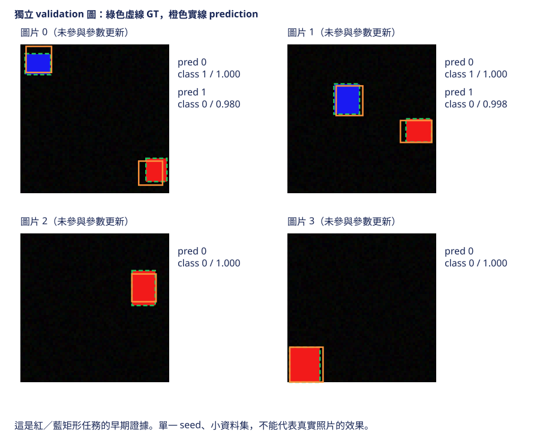

# 7.6 Grid MiniYOLO：獨立資料與評估證據

[在 Colab 執行本節](https://colab.research.google.com/github/birdhackor/learn_to_yolo/blob/lessons-v0.4.0/notebooks/07-heldout.ipynb){ .md-button }

本節要分清楚兩件事：「評估程式跑通」和「模型真的在沒看過的圖片上找到物件」。讀完後，你能用答案已知的例子核對評估器，也知道要宣稱模型有效時，還得固定並保存哪些東西。

前置：[完整推論](07-inference.md)（模型輸出怎麼變成框）、[AP50](06-evaluation.md)（TP、FP、FN 怎麼判定，AP 怎麼算）。

本節分三個部分：

1. 用答案已知的人工例子，核對評估器算得對不對。
2. 接上真正的模型：只訓練 3 步，就拿沒參與訓練的 held-out 圖片來評估。這一步只確認整條管線（模型→解碼→評估）能跑通，不看效果。
3. 本節最後的補充：看一次訓練 160 步的實驗，在 validation／test 上的評估結果。

評估程式能算出 AP（沒有報錯，也不是 NaN 這種算不出有效數值的結果），不代表模型學會了：剛初始化或只訓練幾步的模型也算得出 AP，在本節的資料上通常接近 0。要宣稱效果，還要保存資料切分、所用的模型權重（checkpoint：訓練時存下權重的檔案）、評估協議（事先固定、事後不改的評估規則：用哪些圖、各門檻、AP 算法），以及真值與預測框的疊圖（圖板）。

本節沿用本書的 grid 教學模型。AP 的算法和第 6 章相同：IoU 門檻 0.5、all-points 插值、每個類別各算一個 AP。本節的數字都由本書的簡化評估器算出，不是 benchmark（基準測試）成績。benchmark 成績用官方資料與官方評估工具算出，可以和別人公開比較。和官方 VOC／COCO 評估差在哪裡，見下方摺疊區。

??? note "和官方評估的差異"

    Pascal VOC 和 COCO 是兩個著名的公開物件偵測資料集，各有官方的評估規則與程式。AP 的定義可參照 [Pascal VOC evaluation](https://www.robots.ox.ac.uk/~vgg/projects/pascal/VOC/voc2012/htmldoc/index.html#SECTION00044100000000000000)（VOC2012 開發套件文件的 3.4.1 節）。本節和官方做法的差別：

    - **AP 面積的算法**：本節用 all-points 插值，每個 recall 改變的位置都算進來。VOC2007 用 11 點近似：只在 recall=0、0.1、…、1 這 11 個位置讀包絡高度再平均。VOC2010 起改用 all-points。COCO 則在每個 IoU 門檻下，只在 recall=0、0.01、…、1 這 101 個位置讀包絡高度再平均，也不是 all-points。
    - **IoU 門檻**：本節只用 0.5 一個門檻。COCO 的主要指標寫成 AP@[.50:.95]，是 IoU 門檻 0.50、0.55、…、0.95 共 10 個門檻的 AP 平均，也對各類別平均（照本書用語，其實是 mAP）。
    - **配對順序**：本書先排除已配對的真值（GT），再找 IoU 最高的；官方 VOC 則先在全部 GT 中找 IoU 最高的，再判斷它是否已配對；COCO 官方程式（pycocotools）的配對順序則和本書相同。同一張圖有互相重疊的 GT 時，兩種做法可能得到不同結果。[人工 AP 那一節](06-evaluation.md)列出了差異，以及它們在官方程式裡的出處。

    以上只列主要差異。COCO 另有 crowd 區域、每張圖每個類別最多計 100 個預測等規則，見[第 6 章的摺疊區](06-evaluation.md)；所以把本節評估器在這 10 個門檻各跑一次再平均，也不等於 COCO 的 AP@[.50:.95]。

## 人工失敗例先核對評估器

先複習第 6 章的名詞。GT（ground truth）是標註的真值。TP 是和真值正確配對的預測；FP 是沒有正確配對的誤報；FN 是沒被任何預測配對到的真值，也就是漏檢。precision=`TP/(TP+FP)`，表示留下的預測中有多少是對的；recall=`TP/(TP+FN)`，表示真實物件中找到了多少。PR 是 precision–recall 曲線；AP（average precision）是插值後 PR 曲線下的面積；mAP 是各類 AP 的平均，本節只平均有 GT 的類別。

評估時設 2 個類別（`num_classes=2`：class 0=紅、class 1=藍），但這組例子只有紅類的 GT 和預測。框以 pixel 座標 `[x1,y1,x2,y2]` 表示。兩張圖片各有一個紅類 GT：A 為 `[8,12,24,28]`，B 為 `[40,36,56,52]`。人工預測在 A 放三個框，B 完全漏掉。

這份 fixture（事先手寫、答案已知的測試輸入）直接交給評估器，不先做 NMS。它故意留一個和正確框完全相同的重複框，用來檢查「每個 GT 只能配對一次」；所以它不是 NMS 後的模型結果。完整程式（Colab 最後一格）在 `main()` 一開始用 `targets`、`predictions` 兩個變數寫出這份 fixture，再用斷言（assert）核對下面算出的答案。

| score 排序 | 框 | 位置與判定 | 累計 precision | 累計 recall |
| --- | --- | --- | --- | --- |
| 0.9 | `[8,12,24,28]` | A 的正確框，IoU=1，TP | 1 | 0.5 |
| 0.8 | `[0,0,4,4]` | A 的背景框，和 GT 沒有交集（IoU=0），FP | 0.5 | 0.5 |
| 0.7 | `[8,12,24,28]` | A 同一 GT 的重複框，IoU=1，但 GT 已被 0.9 的框用掉，FP | 1/3 | 0.5 |

B 的 GT 沒配到任何框，是 FN。GT 只能在同一張圖、同一類別裡被成功配對一次；A 的框不能拿去配 B。所以曲線最多只到 recall=0.5。

all-points 插值在每個 recall 位置，取「往更高 recall 看過去的最高 precision」；第 6 章稱這條修平後的曲線為包絡。本例 recall 0 到 0.5 的高度是 1。recall 0.5 到 1 呢？沒有任何預測能讓 recall 超過 0.5；依定義會在 recall=1 補一個 precision=0 的終點，所以這段高度是 0。面積是 `1×.5+0×.5=.5`，即 AP50=0.5。換句話說，漏掉 B 讓 AP 最多只有 0.5。

後兩個 FP 讓最後的 precision 降到 1/3，卻沒有降低這份例子的 AP：它們的分數 0.8、0.7 低於 TP 的 0.9，排在 TP 後面，recall 0 到 0.5 的包絡高度仍是 1。若背景框的分數改成 0.95、排到 TP 前面（順序變成 FP、TP、FP），這段高度只剩 0.5，AP50 會降到 0.25。

所以 AP=0.5 既不是最後的 precision（1/3），也不是 precision×recall（1/3×0.5=1/6）。第二類（藍色，class 1）沒有 GT，AP 回傳 None；本節 mAP 只平均有 GT 的類別，因而仍是 0.5。不要把沒有樣本的類別說成 AP=0 或 AP=1。

## 接上真正的獨立圖片管線

完整程式用 `ShapeDataset` 畫出兩組圖：seed=7 的 4 張 train，和 seed=901 的 4 張 held-out，每張一個物件，固定 64×64。seed（亂數種子）決定一串亂數從哪裡開始，矩形的位置、大小、顏色都由這串亂數決定。seed=901 畫出的 4 張和 seed=7 的 4 張是不同的圖；seed=901 這批不參與參數更新，稱為 held-out（保留下來、不拿來訓練的資料）。這 4 張只用來確認評估接得通，不拿來挑設定，也不當成最後的成績。

只用 train 圖，以 Adam 優化器更新 3 次參數，再以 `eval()`、`inference_mode()` 在 held-out 圖上推論。從推論到評估，依序經過三個門檻：

| 門檻 | 比較誰和誰 | 本例值 | 作用 |
| --- | --- | --- | --- |
| 候選截斷門檻 | 每個候選框自己的 score | 0.01 | 先刪掉分數極低的候選 |
| NMS 的 IoU 門檻 | 同圖、同類的預測框互相比較 | 0.5 | 刪掉低分的重複框 |
| 配對 IoU 門檻（matching IoU） | 預測框和同圖、同類、還沒被配對的 GT 比較 | 0.5 | 達到門檻就判 TP，並標記這個 GT 已配對 |

NMS（非極大值抑制）是 prediction 對 prediction，評估的 matching 是 prediction 對 GT；即使兩個門檻都是 0.5，也不是同一段程式。

評估時候選門檻設得很低，是讓低分但正確的框也進入排序，PR 曲線才走得到較高的 recall；若先用顯示用的高門檻刪框，AP 只會持平或變低。顯示給使用者看的門檻是另一回事。

完整程式裡，推論與評估是這幾行（網頁只加了中文註解）：

``` { .python data-excerpt="lesson_cases/07-heldout.py" }
model.eval()  # 切換成評估模式
with torch.inference_mode():  # 推論時不記錄計算圖
    # predicted：每張圖一個 dict，含 boxes、scores、labels
    predicted = decode_grid(model(heldout_images), image_size=64, score_threshold=.01, nms_iou=.5)
# heldout_anns：每張圖的 GT boxes／labels，不是 build_targets 的格子 target
result = evaluate_ap(predicted,heldout_anns,num_classes=2,iou_threshold=.5)
```

在 Colab 執行[本節 notebook](https://colab.research.google.com/github/birdhackor/learn_to_yolo/blob/lessons-v0.4.0/notebooks/07-heldout.ipynb)，或在 repo 根目錄執行 `PYTHONPATH=. python lesson_cases/07-heldout.py`。輸出有兩行（頁尾有本次的執行紀錄）：

- 第一行是人工 fixture，應核對 AP=0.5、precision=1/3、recall=0.5。
- 第二行是三步模型的冒煙測試（smoke test）。開頭的英文 `3-step held-out PIPELINE SMOKE, not trained detector evidence`，意思是「三步模型的 held-out 管線冒煙測試，不是已訓練偵測器的證據」。

冒煙測試只確認程式能從頭跑到尾、不報錯，不評好壞。這裡要確認的是：真實模型的輸出能直接交給 `evaluate_ap`。格式若不對，例如類別編號超出範圍、框的 x2 小於 x1，`evaluate_ap` 會直接報錯；此外完整程式只用斷言檢查 mAP 在 0 到 1 之間。三步模型幾乎還沒學，AP 是 0 或接近 0 都正常；本次 AP、precision、recall 全是 0.0，表示沒有任何預測框配對成功（同類且 IoU≥0.5）。評估器算得對不對，由前面的人工例子負責。

這兩行的數字都是程式執行結果，不能當作從頭訓練已成功的效能證據。

## 完成第 7 章還需要什麼

三步只能驗證程式可跑。完整的里程碑仍需要足夠的訓練，並在沒參與訓練的圖片上，觀察正確框、分類、漏檢和背景誤報。

正式紀錄至少要保存下面這些項目。其中「資料」和「評估設定」就是評估協議，要事先固定；「模型」和「結果」是要和協議一起保存的紀錄：

- **資料**：來源、各切分（split）的 seed，例如本節最後補充的 160 步實驗用 7／700／7000。
- **模型**：架構，以及所用的 checkpoint。
- **評估設定**：輸入尺寸、候選截斷門檻、NMS 的 IoU 門檻、配對 IoU 門檻、AP 算法。
- **結果**：每類 AP、執行時間，以及成功與失敗的疊圖。

合成圖的獨立 seed，只是用同一套隨機畫矩形的規則再畫出一批圖，所以只能支持同一套規則下的結論，不能外推到照片。

獨立切分的收益，是排除「模型只是記住訓練圖片」造成的錯覺；代價是可用的訓練資料變少，而且測試集小，結果的波動也大。

held-out 是統稱，validation 和 test 都屬於它（第 2 章〈[訓練診斷](02-diagnostics.md)〉講過）。若反覆用 held-out 的結果挑設定（學習率、門檻、步數等超參數），它就成了 validation。validation 可以多次看、用來挑設定；test 要等設定定案後只評一次。所以最終的 test 必須另外保留，不能每次都拿來改設定。

真實影片更需要按來源分組，而不是只隨機切圖片。同一段影片相鄰的畫面幾乎一樣；若隨機把它們分到 train 和 test，test 等於考看過的題目，分數會虛高。所以同一段影片（或同一次拍攝）要整段放在同一邊。

常見錯誤：

- **每張圖各算 AP 再平均。** AP 要把所有圖的同類預測一起按分數排序；分開算會忽略「某張圖的高分誤報排在別張圖的正確框前面」，也讓每張圖的份量一樣。（本節的人工例子剛好兩種算法都是 0.5，看不出差別。）
- **用顯示門檻截斷後算 AP，再和低門檻算出的 AP 比較。** 截斷後，能達到的最高 recall 可能變低；兩個 AP 的條件不同，不能直接比。
- **讓重複框重複配同一個 GT。** 同一個 GT 只能配一個 TP；重複框若找不到別的 GT 可配，就算 FP。
- **把沒有 GT 的類別記成 0，放進平均。** 這種類別的 AP 應記為 None，不放進平均。

## 自主練習

若把人工例子裡 0.8 與 0.7 這兩個 FP 刪掉，AP50 會是多少？precision、recall 又會變成多少？先手算，再展開答案；答案裡也附了貼進完整程式驗證的方法。

??? note "參考答案"

    AP50 仍是 0.5；precision 升為 1，recall 仍是 0.5。

    刪掉的兩個 FP 分數比 TP 低，本來就排在 TP 後面，不影響 recall 0 到 0.5 的包絡高度 1。B 仍漏檢，AP 仍停在前面說的上限 0.5。第 6 章的練習刪掉的是排在最前面的 FP，包絡才被抬高、AP 才上升。

    畫面更乾淨，未必代表找到物件的能力提升：recall 沒有變。

    用程式驗證：在完整程式（Colab 最後一格，或 `lesson_cases/07-heldout.py`）的 `main()` 裡，找到 `print('artificial evaluation fixture', metrics)` 這一行，在它下一行貼上下面這幾行。它們要放在 `main()` 裡面，所以每行前面要空 4 格，和 `print` 對齊：

    ```python
        # 圖 A 的 boxes、scores、labels 都只留第 1 筆（score 0.9 的正確框），等於刪掉兩個 FP；圖 B 不變
        # clone()：複製一份新的 tensor，避免動到原本 predictions 裡的資料
        cleaned = [{k: v[:1].clone() for k, v in predictions[0].items()}, predictions[1]]
        clean_metrics = evaluate_ap(cleaned, targets, num_classes=2, iou_threshold=.5)
        assert abs(clean_metrics['map']-.5)<1e-6
        # 上一行的 map 經過多步浮點運算，可能有捨入誤差，所以用容差比較
        # precision=1/1、recall=1/2 都是整數相除；商 1 和 0.5 能被浮點數精確表示，除出來剛好就是這兩個值，所以可以直接用 == 比較
        assert clean_metrics['precision']==1 and clean_metrics['recall']==.5
    ```

    執行後的輸出和原本一樣；沒有出現 `AssertionError`，就表示答案對了。

    原本的 predictions 與斷言都要保留，不要改掉：以後若改壞了程式，原例子的答案一變，斷言就會報錯。這種用舊例子的固定答案防止程式被改壞的檢查，叫回歸測試（regression test），和框的「回歸」無關。

## 補充：從評估角度看同一次 160 步實驗

這和[三步訓練與診斷](07-training.md)那一頁的 160 步補充實驗是同一次實驗。它用同一套模型與程式從頭訓練（沒有載入任何預先訓練好的權重），在 32 張 train 圖（seed 7）上更新 160 次參數；另用 seed 700、7000 各畫 16 張圖，當 validation 和 test。圖都是 64×64 的紅／藍矩形，每張有 0～2 個物件（含空圖）。訓練設定、執行命令和 [loss 曲線](../assets/diagrams/grid-learning-curve.svg)都在該頁；這裡不必重跑，只從評估的角度看實測結果。

| 固定評估協議下的結果 | 數值 |
| --- | --- |
| 更新前 validation mAP50 | 0.0018 |
| 更新後 validation mAP50 | 0.8036 |
| 訓練結束後的 test mAP50（只評一次） | 0.7749 |
| test precision／recall | 0.8824／0.7895 |

訓練程式在訓練前、後各評一次 validation，test 只在訓練結束後評一次；程式沒有根據 validation 自動挑設定，這組固定設定也沒有用 test 回頭修改模型。

再看細一點的數字：

- validation 16 張共 18 個物件，test 16 張共 19 個。
- test 的每類 AP 是紅 0.857、藍 0.693，兩者平均（約 0.775）就是表中的 test mAP50。
- precision 和 recall 是兩類合計。test 經過候選門檻與 NMS 後共有 17 個預測框，其中 15 個配對成功（TP 15、FP 2）；19 個物件找到 15 個（FN 4）。所以 precision=15/17≈0.8824、recall=15/19≈0.7895。

測試集這麼小，只要多找到或多漏掉一個物件，recall 就差約 5 個百分點（1/19≈0.053）；這次也只跑了一組 seed。所以 validation 0.80 和 test 0.77 的差距，或兩個設定之間差幾個百分點，都不能當成穩定的優劣。

這裡 mAP50 只平均有真值類別的 all-points 插值 AP，配對 IoU 門檻 0.5；decode 的候選截斷門檻是 score≥0.05，同類 NMS 的 IoU 門檻 0.5。它不是 COCO AP@[.50:.95]。160 步實驗用 `miniyolo.train` 的預設候選截斷門檻 0.05，前面三步案例用 0.01。兩個實驗各自事先固定門檻；同一實驗的訓練前後與 validation／test 都用同一組，跨實驗的 AP 不互相比較。



圖的讀法：綠色虛線是真值（GT），橙色實線是預測框；矩形本身的紅、藍才是兩個類別（class 0=紅、class 1=藍）。每張圖上方寫著圖片編號，以及這張圖有幾個真值、幾個預測。每個預測框旁有一個兩行的標籤。第一行「#k class c score s」是第 k 個預測（依 score 由高到低，從 0 編號）、預測類別 c 和 score s（取三位小數，1.000 是四捨五入的結果）。第二行是評估判定：先寫 TP 或 FP，後面是它和同類、還沒被配對的真值算出的最大 IoU，達到 0.5 就是 TP；若這張圖已沒有可配對的同類真值，第二行就寫「FP 沒有可配對的同類真值」。沒被任何預測配對到的真值，旁邊標 FN。

圖片 0 值得細看。左上藍色矩形的預測框 #0 上緣偏高，但和真值的 IoU 約 0.62，仍達到 0.5，標成 TP。右下紅色矩形的預測框 #1，標籤寫 class 0 score 0.980：分數很高，和紅色真值的 IoU 卻只有約 0.47，未達 0.5，所以標成 FP；那個紅色真值因此沒被配對到，標成 FN（漏檢）。分數高不代表位置夠準。圖片 0 的 #1 也是 validation 唯一的 FP：validation 的 16 張圖經過候選門檻與 NMS 後，共留下 16 個預測框，其中 15 個配對成功、1 個是 FP，所以下方實測 JSON 裡 validation 的 precision 是 0.9375=15/16。這裡分母的 16 是預測框數，只是剛好和圖片數相同。

這四張圖只是圖板，mAP 使用全部 16 張。其餘框都接近真值、mAP 從接近零上升，支持「這條管線能在受控任務上學得動」；它仍不能回答模型是否認得照片裡的行人，也沒有證明某個現代機制比較好。

原始設定與數值保留在 [實測 JSON](https://github.com/birdhackor/learn_to_yolo/blob/main/artifacts/checks/grid-learning.json)。

兩條操作路徑的目標不同：本節 notebook 的三步只驗證 held-out 評估接得通；160 步實驗才提供模型在合成資料上學到的結果。想重跑後者，可依[三步訓練頁的可選 Colab 操作](07-training.md)另開一格（cell）執行；不要把三步的輸出當成 160 步的 checkpoint。

<!-- curriculum-evidence:start -->

## 實際執行紀錄

本節的完整程式已於 2026-10-02 用 PyTorch 2.9.1+cpu 在 CPU 上執行過，程式裡的 assert 檢查全部通過。下面是那次印出的原始輸出；每個數字的意思，以本頁正文的說明為準。[完整紀錄（JSON）](https://github.com/birdhackor/learn_to_yolo/blob/main/artifacts/checks/curriculum/07-heldout.json)

??? example "展開本次實際輸出"

    ```text
    artificial evaluation fixture {'ap_per_class': {0: 0.5, 1: None}, 'map': 0.5, 'precision': 0.3333333333333333, 'recall': 0.5}
    3-step held-out PIPELINE SMOKE, not trained detector evidence {'ap_per_class': {0: 0.0, 1: 0.0}, 'map': 0.0, 'precision': 0.0, 'recall': 0.0}
    ```

<!-- curriculum-evidence:end -->
