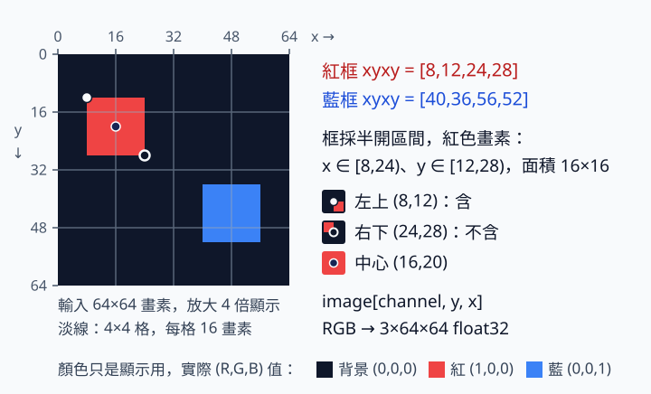

# 7.5 Grid MiniYOLO：把輸出接回圖片

[在 Colab 執行本節](https://colab.research.google.com/github/birdhackor/learn_to_yolo/blob/lessons-v0.4.0/notebooks/07-inference.ipynb){ .md-button }

模型對每張圖只輸出 4×4×7 個數字。本節把這些數字變回畫得出來的框、分數和類別，並用答案已知的人工輸入逐步核對。讀完你能手算一格輸出對應的 pixel 框和分數，也看得懂 `decode_grid` 回傳的結果：不論一張圖有 0 個、1 個還是多個物件，格式都一樣。

前置：[targets](07-targets.md)（框怎麼換成每格的答案）、[三步訓練](07-training.md)（GridDetector 模型）、[NMS](06-decode-nms.md)（刪掉重複的框）。推論的流程是：資料 → 模型 → 解碼（decode）→ 分數過濾 → 每個類別各自做 NMS。每一段都可能出錯，所以本節分兩步檢查：先讓剛建立、未訓練的小模型輸出走一次 decoder（做解碼的函式），只確認輸出格式接得上；再用人工填好、答案已知的 logits 核對每個框的數值。

這份人工填好的 logits 叫人工 fixture。fixture（測試用的固定輸入）在這裡指我們自己填好的假模型輸出，形狀和模型輸出一樣是 `[B,4,4,7]`。每個數字都由我們指定，不是模型算出來的，所以事先知道解碼後該得到哪些框；對不上，就表示 decoder 有錯（或 fixture 填錯了）。人工 fixture 是答案檢查，不是模型學會的證據。

本節沿用前幾節的 head 定義，只談推論。歷史背景是 [YOLOv1](https://arxiv.org/abs/1506.02640) 的 grid（格子）框與推論；第 7 章用的是簡化版，不是原版。

??? note "和 YOLOv1 原版差在哪"

    第 7 章採用自己的 7 維 head（每格輸出 7 個數）、sigmoid wh（寬高也先經過 sigmoid）和 `sigmoid(obj)×softmax(class)` 分數，不使用原論文的 confidence 定義。

    YOLOv1 讓每個框的 confidence 去學 Pr(Object)（有物件的機率）×預測框與真值框的 IoU：有物件時，目標就是這個 IoU；沒有物件時是 0。推論時再乘上類別條件機率（在有物件的前提下，屬於各類別的機率）。第 7 章的 objectness 只學 0 或 1：物件中心落在這格就是 1，否則是 0。

## 從格內值回到 pixel 框

模型輸出 `raw` 的形狀是 `[B,4,4,7]`，B 是 batch 的圖片數。`raw[b,gy,gx,:]` 的前三個索引依序是：b 是第幾張圖（0 到 B−1）、gy 是格子的列（由上往下數）、gx 是格子的欄（由左往右數），都從 0 起算，和 targets 那一節的寫法相同。最後七項依序為 `[tx,ty,tw,th,obj_logit,red_logit,blue_logit]`，logit 是尚未轉成機率的實數。class id `0=紅、1=藍`，softmax 只沿最後兩個類別通道計算。

`sigmoid(tx)`、`sigmoid(ty)` 是中心在這一格裡的位置（offset，偏移），以一格為尺；`sigmoid(tw)`、`sigmoid(th)` 是框相對整張 64×64 輸入的寬、高比例。四項都沒有單位，但分母不同。中心公式是 `cx=(gx+sigmoid(tx))×16`、`cy=(gy+sigmoid(ty))×16`；16=64/4 是格寬（pixel），和第 6 章的 `(2+0.25)×16` 是同一種算法。寬、高則是 `sigmoid(tw)×64`、`sigmoid(th)×64`。最後的框用輸入 pixel 的 `[x1,y1,x2,y2]` 邊界表示，x 向右、y 向下。



上圖是資料頁的真值圖，只用來對照紅框和藍框的位置（圖中的「畫素」就是本頁的 pixel）；圖上有 4×4 淡格線和紅框中心，但沒有標出負責格，也沒有解碼結果。負責格可以看首頁那張示意圖：

{ width="400" }

這張圖只畫了紅框。淺藍色虛線格是紅框的負責格，不是藍框。圖例的「第 2 列、第 2 欄」是從 1 數起；換成從 0 起算的索引，就是 gy=1、gx=1。

紅框的負責格是 (gx=1,gy=1)。假設這格輸出的前四項經 sigmoid 後是 `[0,.25,.25,.25]`（0 是理想值，講完 score 再說明）：

- 中心：`cx=(1+0)×16=16`，`cy=(1+0.25)×16=20`。
- 寬高：`(0.25,0.25)×64=(16,16)`，也就是 w=h=16。
- 邊界：`x1=cx−w/2=16−8=8`、`x2=16+8=24`；`y1=20−8=12`、`y2=20+8=28`。所以 xyxy=`[8,12,24,28]`，和資料頁的紅框真值相同。

每格的 score 是 sigmoid(obj) 乘上機率最大那一類的 softmax 機率。手算舉例（假設值，不是人工 fixture 的值）：若 sigmoid(obj)=0.8、紅類的 softmax 機率是 0.9，score=0.8×0.9=0.72。這個 score 只用來排序與過濾，不能稱為 precision（精確率）。

上面的 0 只是理想值。數學上，sigmoid 的輸出永遠大於 0：輸入越負，輸出越接近 0，但永遠到不了 0。所以人工 fixture 的格內 x 不填 0，而是改用一個很接近 0 的數，做法如下。

本節人工 fixture 的前四項填 `logit(clamp(target,1e-4,1-1e-4))`。target 是 targets 那一節算出的框答案，例如紅框的 `[0,.25,.25,.25]`。式子裡的兩個函式是：

- `logit(p)=ln(p/(1−p))` 是 sigmoid 的反函數：sigmoid(logit(p))=p。前面說的 logit 是「還沒轉成機率的數」；這個函式正好反過來，把機率 p 換回對應的 logit。例如 logit(0.8)=ln 4≈1.386。
- `clamp(t,a,b)` 把 t 夾進 [a,b]：小於 a 就改成 a，大於 b 就改成 b，在範圍內就不變。

因為 logit(0)=−∞，先把 0 夾成 1e-4（0.0001）。解碼後格內 x 是 0.0001 而不是 0，中心右移 0.0001×16=0.0016 pixel，所以輸出的紅框約是 `[8.0016,12,24.0016,28]`（見頁尾的實際輸出），驗證時採用 0.02 pixel 的容差。這個細節也說明：數學上，target 剛好是 0 或 1 時，有限的 logit 只能無限接近，無法剛好得到（電腦用浮點數計算時會有例外，例子見下面第 2 步）。

本節用的是套件裡的 `decode_grid`；之後的評估和自己的圖片推論，也都用這個函式。模型預測的框可能超出畫布，寬或高也可能變成 0，所以它比第 6 章頁面上的簡化 decode 多做兩步：

1. 把超出 0～64 的框邊截掉。例如左上角那格 (gx=0,gy=0) 的四個 sigmoid 輸出都是 0.5 時，中心是 (8,8)、寬高都是 32，算出 `[-8,-8,24,24]`，截完變成 `[0,0,24,24]`。
2. 丟掉寬或高 ≤0（x2≤x1 或 y2≤y1）的框。這只在 tw 或 th 的 logit 極負時出現：數學上 sigmoid 永遠大於 0，寬高也就大於 0；但電腦用有限精度的浮點數計算，寬或高小到比中心座標附近 float32 分得出的差還小時，cx−w/2 和 cx+w/2 會被捨入成同一個數，x2−x1 就變成 0。例如中心 x=24 時，float32 在 24 附近只分得出約 1.9×10⁻⁶ 的差；tw 的 logit 是 −18 時，sigmoid 仍約 1.5×10⁻⁸（不是 0），寬約 9.7×10⁻⁷ pixel，24−w/2 和 24+w/2 卻都被捨入成 24，這個框就被丟掉。logit 再更負（float32 約 −89 以下）時，連 sigmoid 本身都會算成 0。

這兩步只用於模型的預測。如果是標註（GT，真值框）超出圖片，代表資料錯了，要回頭修資料，不能用截斷（clamp）把錯誤蓋過去。

## 同一種輸出格式支援零／一／多物件

模型永遠輸出 `[B,4,4,7]`。decoder 把每一格當成一個候選，並替它選機率最大的類別，所以每張圖有 4×4=16 個候選；再經過分數過濾和 NMS，留下 N 個框。每張圖的 N 可以不同，也可以是 0。

`decode_grid` 回傳長度 B 的 list；`result[i]` 是第 i 張圖的 dict（字典：用鍵名取值，例如 `result[0]['boxes']`），有三個鍵：

- `boxes`：形狀 `[N,4]` 的 pixel xyxy 框；
- `scores`：形狀 `[N]`，由高到低排；
- `labels`：形狀 `[N]`，0=紅、1=藍。

本節把三張圖放進同一個 batch，`images` 的形狀是 `[3,3,64,64]`：

- 第 0 張：紅＋藍，2 個框；
- 第 1 張：只有紅，1 個框；
- 第 2 張：全黑，0 個框。

第 1 張是把原圖複製一份，再把藍色方塊的畫素設成 0，讓畫素和「只有紅框」的標註一致；不能只刪藍框的標註，卻留下藍色畫素。這些畫素只給未訓練模型那一步用；人工 fixture 只依標註填數字，不讀畫素。

```python
# model：剛建立、未訓練的 GridDetector；images：上面三張圖，形狀 [3,3,64,64]
# （完整程式把 result 取名為 smoke）
model.eval()
with torch.inference_mode():
    raw = model(images)  # [3,4,4,7]
    result = decode_grid(raw, image_size=64,
                         score_threshold=.25, nms_iou=.5)
```

這裡的 model 剛建立、還沒訓練。它的 head 把 obj 的 bias 設成 −2（見[三步訓練](07-training.md)），實際算出的 obj logit 約為 −2，sigmoid(−2)≈0.12；兩個類別的機率都約 0.5。每格的 score 約 0.12×0.5≈0.06，低於門檻 0.25，所以本次執行印出 `[0, 0, 0]`。這是預期內的結果，不是 decoder 壞了。這一步只檢查每張圖都回傳一個結果、`boxes` 的形狀是 `[N,4]`（這裡 N=0），不代表模型的好壞。

`eval()` 和 `inference_mode()` 用途不同。`eval()` 切換模型模式，只影響 Dropout、BatchNorm 這類在訓練和推論時行為不同的層。本模型沒有這些層，所以 `eval()` 在這裡不改變數字；仍要養成推論前呼叫的習慣，換成有這些層的模型才不會出錯。`inference_mode()` 和第 0 章學過的 `no_grad()` 一樣不記錄計算圖，但更嚴格：在裡面產生的 tensor，之後不能再拿去參與要算梯度的計算，換來一點速度。

decoder 在每個類別內依 score 排序做 NMS，所以兩個不同類別的框即使重疊，也不會互相刪掉。程式裡的兩個門檻各管一件事：score 門檻（`score_threshold=.25`，也就是全書說的顯示門檻）決定哪些候選留下；NMS 的 IoU 門檻（`nms_iou=.5`）決定哪些同類的重複候選被刪掉。

這兩個門檻都不是下一節評估時的 matching（配對）門檻：評估時，預測框和真值框的 IoU≥0.5 才算命中（TP，true positive：正確偵測）。NMS 和評估的 IoU 門檻即使都是 0.5，比較的對象也不同：NMS 比的是預測框和預測框，評估比的是預測框和真值框。

接著用人工 fixture 核對數值。它的填法是：先用 targets 那一節的 `build_targets` 找出每張圖的正格（負責物件的格子）；正格的前四項填前面說的 `logit(clamp(target,1e-4,1-1e-4))`，obj 填 10，正確類別填 10、另一類填 −10；其他格的 obj 都填 −20。所以正格的 score≈sigmoid(10)≈0.99995（類別機率幾乎是 1）。背景格兩個類別的 logit 都是 0，機率各 0.5，因此 score≈sigmoid(−20)×0.5≈10⁻⁹，遠低於門檻 0.25。三張圖的正格依序有 2、1、0 個，所以解碼後的 N 應該依序是 2、1、0；第 2 張的 `boxes` 是形狀 `[0,4]` 的空 tensor。

??? note "完整程式裡建立人工 fixture 的幾行"

    `anns` 是三張圖的標註；`raw` 是上面未訓練模型的輸出，這裡只借用它的形狀。

    ```python
    target = build_targets(anns,4,64,2)  # 4×4 格、64×64 圖、2 類
    fixture = torch.zeros_like(raw)      # 形狀和模型輸出一樣：[3,4,4,7]
    fixture[...,4] = -20                 # 先把每一格的 obj 都填 -20（背景）
    # 逐一取出正格；這裡的 y、x 就是正文的 gy、gx
    for b,y,x in target['positive'].nonzero().tolist():
        fixture[b,y,x,:4] = torch.logit(target['box'][b,y,x].clamp(1e-4,1-1e-4))
        fixture[b,y,x,4] = 10            # obj
        fixture[b,y,x,5:] = -10          # 兩個類別先都填 -10
        fixture[b,y,x,5+target['class_ids'][b,y,x].item()] = 10  # 正確類別改成 10
    ```

在 [Colab](https://colab.research.google.com/github/birdhackor/learn_to_yolo/blob/lessons-v0.4.0/notebooks/07-inference.ipynb) 執行，或在 repo 根目錄執行 `PYTHONPATH=. python lesson_cases/07-inference.py`。完整程式依序檢查四件事，可對照頁尾的實際輸出：

1. 未訓練模型：印出 `untrained model candidate counts (no quality claim) [0, 0, 0]`（no quality claim：不代表模型品質）。原因見上面的說明；這只證明輸出格式接得上。
2. 人工 fixture：印出 `artificial known-logit fixture counts [2, 1, 0]`，每個框和標註的誤差都在 0.02 pixel 以內。下一行 `fixture red box` 是第 1 張的紅框，約 `[8.0016,12,24.0016,28]`。
3. batch=1：只送一張圖，`decode_grid` 仍回傳長度 1 的 list。`squeeze()` 會刪掉所有長度為 1 的軸；若 decoder 用了它，batch=1 時 `[1,4,4,7]` 會變成 `[4,4,7]`，就分不出哪一軸是圖片。`decode_grid` 不這樣做，所以取單張圖的結果時寫 `result[0]`。這一項在完整程式裡只用斷言（assert）檢查，不印出東西。
4. 同類去重：在第 1 張紅框左邊的鄰格 (gx=0,gy=1) 再放一個紅框。它的 sigmoid(tx)=0.999，框約 `[7.98,12,23.98,28]`，和原框的 IoU≈0.998；它的 obj logit 是 9，比原框的 10 低一點，所以分數稍低。NMS 只刪 IoU「大於」門檻的框，而 IoU 最大是 1，所以門檻設成 1 等於不刪，兩框都留下；門檻改成 0.5 時，0.998 大於 0.5，分數較低的那個被刪掉，剩 1 框。輸出的 `same-class overlapping fixture NMS counts 2 -> 1` 就是這件事，表示同類去重真的發生了。

這些人工對照只檢查程式算得對不對，不代表模型學會。

## 圖片尺寸與顯示的最後一段

本節的輸入和原圖都是 64×64，所以 pixel 框可以直接疊回同一張圖。若使用非正方形照片，模型框仍在補邊（padding）後的 64×64 輸入座標上，要先做[座標轉換](04-coordinates.md)學過的還原：先減補邊、再除縮放比例。第 8 章〈[自己的圖片推論](08-own-images.md)〉會用套件函式 `undo_letterbox` 做這件事。

畫圖時有兩個常見的換算錯誤。一是把 normalized wh（0～1 的寬高比例，也就是 sigmoid(tw)、sigmoid(th)）當成 pixel。二是把 xyxy 當成 `(x,y,w,h)`：`(x,y,w,h)` 指左上角座標加寬高，有些畫圖函式要的是這種格式；從 xyxy 換算要算 w=x2−x1、h=y2−y1。`(x,y,w,h)` 也不是中心加寬高的 cxcywh。

人工紅／藍場景可對照[資料頁的靜態圖](07-data.md)。想看模型輸出真的疊回圖片的樣子，可以看[三步訓練](07-training.md)那一節 160 步實驗的驗證圖：圖中橙色的模型框，就是訓練後的模型輸出經過同一個 `decode_grid` 得到的。

收益是：訓練程式在 validation／test 資料（驗證集、測試集）上的評估、之後的評估和畫圖展示，都呼叫同一個 `decode_grid`（算 loss 時不經過 decode）；沒有框的圖、一次多張圖，輸出格式也都固定。代價是：固定 grid 每格只有一個框，兩個物件中心落在同一格時，可能漏掉其中一個；NMS 也不能補回模型根本沒預測出來的框。提高 score 門檻會讓畫面更乾淨，同時可能降低 recall（真實物件中被找到的比例）；必須用獨立評估判斷，不能憑畫出的框變少就說進步。

常見錯誤：

- **推論前沒呼叫 `eval()`**：有 Dropout／BatchNorm 的模型，輸出會和推論模式不同。本節的模型沒有這些層，所以看不出差別。
- **類別各自做 sigmoid，卻當成 softmax 那種互斥機率**：例如紅、藍的 logit 都是 2 時，sigmoid 各得 0.88，加起來 1.76；softmax 則得 0.5、0.5，加總為 1，表示只能選一類。各自 sigmoid 的結果不是這種機率。
- **NMS 不分類別**：紅框和藍框重疊超過門檻時，分數較高的那個會把另一個刪掉，即使兩者是不同類別的物件。
- **對空結果取 `[0]`**：某張圖沒有框時寫 `result[b]['boxes'][0]`，會出現 IndexError（索引超出範圍）。`result[0]` 則是取第 0 張圖；list 的長度固定是 B，所以安全。

自主練習（先自己想，再展開答案）：

人工 fixture 的 score 都接近 1（約 0.99995），門檻改成 0.75 也不會被刪，所以這題不改人工 fixture，另用一份練習用 fixture。它只在 (gx=1,gy=1) 放一個紅框：sigmoid(obj)=0.8、紅類 softmax=0.9，score=0.72，就是前面手算的假設值；其他格都是背景。

題目：用下面的練習用 fixture（score=0.72），把 score 門檻從 0.25 改成 0.75（NMS 的 IoU 門檻仍是 0.5），這個框會怎樣？提高 NMS 的 IoU 門檻能救回它嗎？

想用程式核對時，先依序執行 notebook 原本的程式格，再在最後新增一個程式碼儲存格（code cell），貼上下面建立練習用 fixture 的程式。核對用的解碼和斷言放在參考答案裡；想好答案再展開，把那幾行貼在這段程式後面執行。

```python
score_raw = torch.zeros(1,4,4,7)
# 先把 16 格的 obj logit 都設成 -20：sigmoid≈2×10⁻⁹，等於背景
score_raw[...,4] = -20
# [0,1,1] 是 b=0、gy=1、gx=1。x 不能填 0：logit(0)=-∞ 會被 decode_grid 拒絕（ValueError）。
# 本題只看 score，框的位置不重要；x 用 0.5，
# 所以框是 [16,12,32,28]，不是正文的 [8,12,24,28]
score_raw[0,1,1,:4] = torch.logit(torch.tensor([.5,.25,.25,.25]))
score_raw[0,1,1,4] = torch.logit(torch.tensor(.8))  # sigmoid 之後是 0.8
# 類別用 log：softmax(ln 0.9, ln 0.1)=(0.9,0.1)，因為 e^(ln p)=p，且 0.9+0.1=1
score_raw[0,1,1,5:] = torch.log(torch.tensor([.9,.1]))
```

??? note "參考答案"

    框在 NMS 之前就被刪掉了。`decode_grid` 先用 score 門檻過濾：0.72 小於 0.75，這個框過不了門檻，根本進不到 NMS。NMS 只處理留下來的候選，所以提高 NMS 的 IoU 門檻也救不回它。

    核對程式如下，貼在建立練習用 fixture 的程式後面執行。這段程式用 0.70 和 0.75 兩個 score 門檻各解碼一次；兩次呼叫只改 `score_threshold`，`nms_iou` 都是 0.5。

    ```python
    low = decode_grid(score_raw, image_size=64, score_threshold=.70, nms_iou=.5)[0]
    high = decode_grid(score_raw, image_size=64, score_threshold=.75, nms_iou=.5)[0]
    assert len(low['boxes']) == 1 and len(high['boxes']) == 0
    assert abs(low['scores'][0].item()-.72) < 1e-6
    ```

    門檻 0.70 和原本的 0.25 一樣低於 0.72，所以留下 1 個框（score 0.72）；門檻 0.75 時剩 0 個。兩個斷言都通過，表示結果和這份答案一致。

下一節〈[獨立資料評估](07-heldout.md)〉會把這些推論結果交給評估程式，和真值框做 matching（配對）。

<!-- curriculum-evidence:start -->

## 實際執行紀錄

本節的完整程式已於 2026-10-02 用 PyTorch 2.9.1+cpu 在 CPU 上執行過，程式裡的 assert 檢查全部通過。下面是那次印出的原始輸出；每個數字的意思，以本頁正文的說明為準。[完整紀錄（JSON）](https://github.com/birdhackor/learn_to_yolo/blob/main/artifacts/checks/curriculum/07-inference.json)

??? example "展開本次實際輸出"

    ```text
    untrained model candidate counts (no quality claim) [0, 0, 0]
    artificial known-logit fixture counts [2, 1, 0]
    fixture red box [8.00160026550293, 12.0, 24.00160026550293, 28.0]
    same-class overlapping fixture NMS counts 2 -> 1
    ```

<!-- curriculum-evidence:end -->
