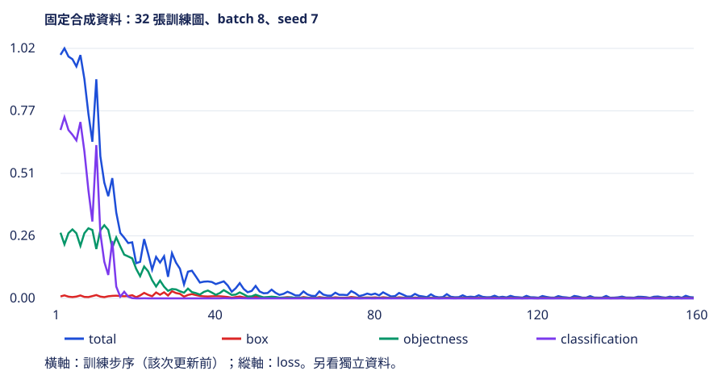

# Grid MiniYOLO：三步訓練與診斷

[在 Colab 執行本節](https://colab.research.google.com/github/birdhackor/learn_to_yolo/blob/lessons-v0.1.0/notebooks/07-training.ipynb){ .md-button }

前置：[資料](07-data.md)、[targets](07-targets.md)、[loss](07-loss.md)。我們已有畫素、責任與人工梯度答案，現在才接上 CNN 和 optimizer。目標是先證明 forward、backward、step 都真的執行，而後再規劃少量 overfit 和獨立資料評估。

起始分支是本書的 4×4 grid MiniYOLO。歷史上的 [YOLOv1](https://arxiv.org/abs/1506.02640) 是從整圖直接預測框的單階段設計；本節小 CNN、64×64 圖、每格單框與第 7 節 loss 都是教學簡化。本次只做 3 個 CPU optimizer steps，這不是原版訓練，也沒有宣稱完成第 7 章的泛化里程碑。

## 一個固定 batch 的完整更新

快速實驗生成 4 張圖，每張恰好一個矩形，影像 shape `[4,3,64,64]`，target 有 4 個正格、60 個負格。prediction的前三軸是圖片、格子列y、格子欄x；最後7項依序`tx,ty,tw,th,obj,class0,class1`，皆是logits（尚未轉成機率的實數）。`target['positive']` 是`[4,4,4]`布林mask，標出哪些格負責物件；`prediction[...,4]`取objectness那個通道，sigmoid後再用mask選正／負格。資料生成用 seed=7，模型也固定 `torch.manual_seed(7)`，CPU threads=2。每一步都重複這個 batch；改動只有模型參數。

```python
model = GridDetector(num_classes=2, grid_size=4, width=8)
optimizer = torch.optim.Adam(model.parameters(), lr=.01)
for step in range(3):
    optimizer.zero_grad(set_to_none=True)
    prediction = model(images)          # [4,4,4,7]
    parts = grid_loss(prediction, target)
    parts['total'].backward()
    optimizer.step()
```

逐步看：第 0 步 forward 產生 logits；loss 依 target mask 選擇監督；backward 填入每個參數的 `.grad`；step 才修改參數。`zero_grad` 清除上一輪梯度，不會重設參數。若重新建立 model，必須重新建立使用它參數的 optimizer；舊 optimizer 仍指向舊 tensor。

案例儲存第一個參數的更新前副本，最後斷言參數確實變了；每步檢查 total 有限、每個梯度tensor全為有限值且梯度總量大於零，避免無窮大總量也透過。列印 box、objectness、classification、total，以及正格／負格的 sigmoid(objectness) 均值。這些均值是在該次更新前的 prediction 上計算，不能誤以為是更新後重新 forward 的結果。

## 「全部背景」該如何查

假設訓練中 objectness 降了，框卻一個也不顯示。先看同一 batch 的疊圖和 target 正格數，確認沒有把 labels=0 當背景；再用第 7 節人工 loss 檢查正格是否有提升 objectness 的梯度；再看本節參數是否更新。只有前兩段都正確，才討論稀疏正格、學習率與權重。

正負均值都下降不一定立刻代表錯誤：60 個背景格可能先被學會。但若持續下降且正格沒有區分，就必須檢視分項 loss 與解碼後框，而不能只說 total 變小。訓練分數不等於 precision；它們是網路對這個 batch 的輸出。

執行 https://colab.research.google.com/github/birdhackor/learn_to_yolo/blob/lessons-v0.1.0/notebooks/07-training.ipynb 或在 repo 根目錄執行 `PYTHONPATH=. python lesson_cases/07-training.py`。應看到 step 0、1、2 三行有限分項值，最後是 `3 real CPU optimizer steps; parameters changed; no generalization claim`。精確 loss 隨 PyTorch／核心實作可能有末位差異，透過條件是有限梯度、參數更新、正格數與 shape 正確，不要求三點曲線單調。

## 少量 overfit 與泛化是後續兩個關卡

三步的收益是成本小、故障容易定位；代價是完全不足以判斷學習效果。後續可固定這 4 張，增加訓練步數，記錄分項 loss、正負分數與框，直到對這幾張資料的定位與分類明顯正確。若做不到，先修管線，不急著加更多資料。達成少量 overfit 後，再凍結設定，去獨立 seed／來源的圖片評估。

上面的三步快速檢查沒有「訓練後 AP 提升」或「未見資料成功偵測」數字。下方另列一次160步合成資料實驗，保存checkpoint、固定held-out協議與圖板，提供此受控任務能學動的初步證據。快速檢查列出實際的 batch=4、64×64、3 steps、CPU；完整效果比較的步數、時間與記憶體須另外量測，不能從三步外推。

自主練習：刪掉 `optimizer.step()`，哪些檢查仍可能透過？答案：forward、有限 loss 與非零梯度都可能透過，但參數差異斷言應失敗。這正是需要把 backward 與更新分開驗證的理由。

## 補充：一次已實測的合成資料短訓練

前面的三步案例只檢查程式。在相同核心上，另外做了 **160 次 CPU 參數更新**：train 32 張（seed 7）、validation 16 張（seed 700）、test 16 張（seed 7000），每張 64×64、batch 8、Adam learning rate .01、模型 width 8。模型從零初始化；這些圖片都是紅／藍矩形，物件中心刻意分在不同格，尚未包含同格衝突或真實照片的複雜背景。

```bash
python -m miniyolo.train --steps 160 --samples 32 --device cpu
```

此命令在 repository 根目錄執行，會存 checkpoint、逐步 loss、圖與完整報告。用網頁的實測圖先核對，不需要先重跑：



| 固定協議下的結果 | 數值 |
| --- | --- |
| 更新前 validation mAP50 | 0.0018 |
| 更新後 validation mAP50 | 0.8036 |
| 最後一次 test mAP50 | 0.7749 |
| test precision／recall | 0.8824／0.7895 |

這裡 mAP50 只平均有真值類別的 all-points interpolated AP，matching IoU=.5；decode候選 score≥.05、同類 NMS IoU=.5。它不是 COCO AP@[.50:.95]。這個固定設定未用 test 修改模型；只有一個 seed 與很小的測試集，不應把小數差異解讀成穩定的效能優勢。


綠色虛線是真值，橙色實線是模型框；顏色本身是圖中的兩類物件。第一張左上框明顯向上偏，表示分數高也不等於位置完全正確。這四張圖只是圖板，mAP使用全部16張。已有框接近真值、mAP從接近零上升，支援「這條管線能在受控任務學動」；它仍不能回答模型是否認得照片裡的行人，也沒有證明某個現代機制比較好。

原始設定與數值保留在 [實測 JSON](https://github.com/birdhackor/learn_to_yolo/blob/lessons-v0.1.0/artifacts/checks/grid-learning.json)。這次只計訓練 loop，在 AMD EPYC 9V74、PyTorch 2.9.1 CPU、2 threads 上約 0.62 秒；不包含程式啟動、資料建立、圖或評估。不同機器需自行量測，不能用此時間預估真實資料訓練。
