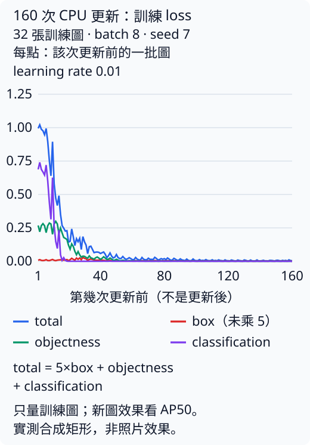
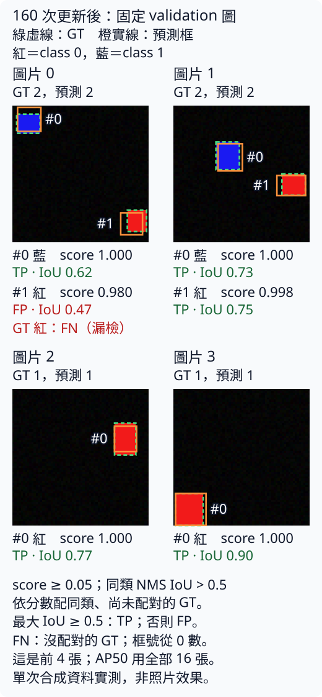

# 7.4 Grid MiniYOLO：三步訓練與診斷

[在 Colab 執行本節](https://colab.research.google.com/github/birdhackor/learn_to_yolo/blob/lessons-v0.6.1/notebooks/07-training.ipynb){ .md-button }

資料、target 和 loss 已經能各自核對。現在把人工 logits 換成 CNN 算出的預測，讓梯度真的改變權重。先重複使用同一批四張圖，只做三次更新：如果數字沒變，就能檢查究竟是沒算出梯度，還是 optimizer 沒有改參數。

讀完本節，你能追蹤 CNN 如何產生 4×4 格預測，讀懂更新前的 loss 與正負格分數，並按資料、梯度、更新的順序診斷沒有框的結果。三步先驗證更新流程；後面的 160 步實驗才提供受控任務的學習結果。

## 同一批圖，如何變成每格七個數

本節用 seed=7 生成四張 64×64 圖，每張恰有一個矩形。固定 batch 是 `[4,3,64,64]`，四個物件對應四個正格，其餘 60 格是背景。每一步都用同一批，資料不變，變的是模型權重。

`GridDetector(num_classes=2,grid_size=4,width=8)` 的 width 指第一層卷積有 8 個輸出通道。資料依序走過：

手機上可左右滑動表格，查看完整欄位。

| 層 | 輸出 shape | 作用 |
| --- | --- | --- |
| 輸入 | `[B,3,64,64]` | RGB 圖片 |
| 3×3 卷積（stride 2）＋ReLU | `[B,8,32,32]` | 邊長減半 |
| 3×3 卷積（stride 2）＋ReLU | `[B,16,16,16]` | 邊長再減半，channel 加倍 |
| 3×3 卷積（stride 2）＋ReLU | `[B,32,8,8]` | 邊長再減半，channel 加倍 |
| adaptive pool | `[B,32,4,4]` | 把 8×8 每 2×2 一區取平均，變成 4×4 |
| 3×3 卷積（stride 1）＋ReLU | `[B,32,4,4]` | shape 不變，再混合相鄰格的特徵 |
| 1×1 卷積（head） | `[B,7,4,4]` | 每一格各自把 32 個特徵組合成 7 個數；各格共用同一組權重 |
| permute | `[B,4,4,7]` | 只把 7 移到最後一軸，數值不變 |


adaptive pool 是 `AdaptiveAvgPool2d`，自動分區取平均到指定尺寸；第 1 章縮成 1×1，這裡保留 4×4。本例將 8×8 的每個 2×2 區域平均成一格，再混合相鄰格特徵。head 在每格共用相同的 1×1 卷積權重，把 32 個特徵變為七個 logits，permute 只換軸。

輸出 `[b,y,x]` 對應同位置的 target；最後七項仍為 `tx,ty,tw,th,obj,class0,class1`。框經 sigmoid 是座標比例，obj 經 sigmoid 是物件分數，類別經 softmax。完整定義見 [miniyolo/models.py](https://github.com/birdhackor/learn_to_yolo/blob/main/miniyolo/models.py)。

這個模型一次 forward 就從整張圖產生所有候選，是單階段（single-stage）偵測：不先挑候選區域再逐一分類。它參考 [YOLOv1](https://arxiv.org/abs/1506.02640) 的格子想法，但小 CNN、每格一框與本章 loss 都是自己的教學設定。

## 為什麼起始物件分數不是 0.5

上一節故意用全零 logits，便於手算。真正模型從隨機權重起步，還手動設定兩組 head bias：tw／th 為 −1.8，obj 為 −2。若權重乘特徵的貢獻很小，寬高約 `sigmoid(−1.8)×64≈9 pixel`，接近生成矩形的 8～15 pixel；objectness 約 `sigmoid(−2)=.1192`，比 .5 更接近多數格都是背景的情況。

這些是起始值，沒有載入預訓練權重，也沒有代表已經找到矩形。實際 logits 仍由特徵、權重與 bias 共同決定。

??? note "為什麼是 −1.8 和 −2？"

    head 是 1×1 卷積，每個輸出通道有一個 bias，所有格子共用。剛初始化時，卷積那一項（權重乘特徵再加總）很小，所以每格輸出的 logit 大約就等於 bias。本頁最下方執行紀錄裡，step 0 的正負格平均都是 0.1202，和 sigmoid(−2)≈0.1192 很接近，正好看得到這件事。

    - tw、th 的 bias −1.8：sigmoid(−1.8)≈0.14。框寬高是相對整張圖的比例，乘上 64 約 9 畫素；資料裡矩形的邊長是 8～15 畫素，起點和它們接近。
    - obj 的 bias −2：本節的 batch 共 64 格，只有 4 格有物件（約 6%），這就是「稀疏」。假設每格都輸出同一個機率 p，平均 BCE 是 [4×(−ln p)+60×(−ln(1−p))]/64。p=0.5 時是 0.693；p≈0.12 時約 0.25；最小值出現在 p=4/64 時，約 0.234。從 −2 起步，起點的 objectness loss 已經很接近這個最小值。
    - 其他通道（tx、ty 與兩個類別）沒有手動設定，bias 是接近 0 的小隨機值。


## 梯度算完，還要真的更新

下面摘錄 lesson case 的迴圈；單獨一行的 `...` 省略其他檢查，索引內的 `...` 則保留前面的軸：

``` { .python data-excerpt="lesson_cases/07-training.py" }
model = GridDetector(num_classes=2, grid_size=4, width=8)
optimizer = torch.optim.Adam(model.parameters(), lr=.01)
...                                     # 省略：複製第一個參數供最後比對、切到訓練模式
for step in range(3):
    optimizer.zero_grad(set_to_none=True)
    prediction = model(images)          # [4,4,4,7]
    ...                                 # 省略：shape 的斷言
    parts = grid_loss(prediction, target)
    ...                                 # 省略：total 是有限值的斷言
    parts['total'].backward()
    ...                                 # 省略：檢查梯度的斷言（見下方說明）
    optimizer.step()
    with torch.no_grad():               # 以下只是監看，不需要梯度
        obj = prediction[..., 4].sigmoid()                  # prediction 是這次更新「前」算出的
        pos_mean = obj[target['positive']].mean().item()    # 4 個正格的平均
        neg_mean = obj[~target['positive']].mean().item()   # 60 個負格的平均；~ 把 True／False 對調
    ...                                 # 省略：印出這一步的分項 loss 與兩個平均
```


每圈先清掉上一圈梯度，再 forward 產生預測，依 target 算三項 loss，backward 填入參數的 `.grad`，最後 `optimizer.step()` 修改參數。`zero_grad` 不會重設權重；重新建立 model 時，也要重建指向新參數的 optimizer。

Adam 同樣要到 step 才更新，與暖身的 SGD 在這一點相同。它另外保存過去梯度與梯度平方的移動平均，調整各參數的更新幅度；所以變化量不能直接當成「學習率×當步梯度」。這裡沿用固定 lr=.01 的小實驗設定，先讓每一段可核對，沒有比較它是否勝過 SGD。

??? note "Adam 第一步的幅度"

    第一步中，非零且不是極小值的梯度分量，會讓對應參數大約移動 .01，方向與梯度相反；零梯度分量不會這樣移動。完整規則見 [PyTorch Adam 文件](https://pytorch.org/docs/stable/generated/torch.optim.Adam.html)。

`torch.no_grad()` 之內只監看分數，不記錄梯度。它取 obj sigmoid 後，以 positive 與其反面 `~positive` 分出 4 個正格、60 個負格，各求平均。此處的 prediction 在 step 之前算出，故每行印出的是**該次更新前**的狀態；step 後沒有重新 forward。

程式也直接核對更新：迴圈前複製第一層卷積權重 `[8,3,3,3]`，三步後要求不同。每步檢查 prediction shape `[4,4,4,7]`、total 與所有梯度元素有限，所有梯度絕對值加總有限且大於 0；這個加總和第 1 章梯度 L2 不同。僅大於 0 擋不住無窮大。結束後再核對四個正格。

## 三行輸出應該怎樣讀

在 Colab 執行頁首 notebook，或在 repo 根目錄執行 `PYTHONPATH=. python lesson_cases/07-training.py`。step 0、1、2 依序印出 total、box、objectness、classification、正格與負格平均，最後為 `3 real CPU optimizer steps; parameters changed; no generalization claim`。

這句表示 CPU 上真的更新三次，參數已改變。通過條件是 shape、正格數、有限 loss／梯度與權重變化；不是三個 loss 點必須一路下降。保存紀錄中 box 從 .009 微升至 .0094，total 仍從 .9817 降至 .8323。

模型初始化也固定 `torch.manual_seed(7)`，CPU threads=2；seed 決定亂數起點，使圖與初始化可重現。執行緒數、PyTorch 版本或底層加總順序不同，末位小數可能不同。下面可選的核數只用來回查本頁紀錄：

??? note "核對 step 0 的數字"

    以下數字取自本頁最下方的執行紀錄；自己重跑時，末位可能略有不同。

    - **total**：5×0.009+0.2525+0.6842=0.9817，和印出的 total 相同。
    - **objectness**：step 0 時各格的 sigmoid(obj) 幾乎相同，正負格平均都是 0.1202。代入 BCE（負格用 1−0.1202=0.8798）：[4×(−ln 0.1202)+60×(−ln 0.8798)]/64≈0.2525。它遠小於〈[Grid MiniYOLO loss](07-loss.md)〉零 logits 的 0.693，這就是 obj bias 設成 −2 的效果。
    - **classification**：0.6842 接近 ln 2≈0.693，因為兩類的機率都還接近 0.5。
    - **三步的變化**：box 從 0.009 微升到 0.0094，total 仍從 0.9817 降到 0.8323。短短幾步內，各項 loss 不一定每步都下降，所以通過條件不要求單調。


## 自主練習：只反傳、不更新會發生什麼

自主練習：在 Colab 裡改「本節可修改的完整實驗」下面那一格程式；本機則改 `lesson_cases/07-training.py`，兩者是同一份程式。刪掉迴圈裡 `optimizer.step()` 那一行再執行：哪些檢查仍可能通過？哪一個會失敗？三行輸出會有什麼變化？

??? note "參考答案"

    shape、有限 loss、有限梯度、梯度總量大於 0 這幾個斷言都會通過，因為 backward 照樣算出梯度。step 0、1、2 三行印出的數字會完全相同：參數沒變、輸入也沒變，三次 forward 算的是同一件事。最後檢查「參數和更新前不同」的斷言會失敗，程式在那裡報 AssertionError 停下；排在它後面的正格數斷言不會執行，最後一行也不會印出。

    這正是要把 backward 與更新分開驗證的理由：算出梯度，不代表參數已經更新。


## 訓練後仍然沒有框，先查哪裡

框不是直接由 objectness 決定：score 還要乘上最大類別機率，再通過顯示門檻 .25。本例更新三步後正格 objectness 約 .12，最大類別機率約 .7，score 還不到 .1，所以畫不出框是預期結果。它尚不能診斷訓練失敗。

若訓練很久，objectness loss 持續下降，所有解碼 score 卻仍過不了門檻，才依序查：

1. 畫同批圖片與標註疊圖、數 target 正格。本批四物件都是 class 0；把 label 0 當背景會誤刪所有正格。
2. 用上一節人工 logits 核對正格 objectness 梯度為負，背景為正。
3. 比較更新前後權重，確認 step 真的生效。

三項成立後，再考慮學習率、各項權重或正格太少。正負格分數可能初期一起降低，因為它們共用 head 的 obj bias。step 0 時 objectness 約 .1202，這個 bias 的 BCE 梯度為 `(60×.1202+4×(.1202−1))/64≈+.058`，所以先下降，所有格都受影響。要讓正格高、負格低，還需要特徵區分兩者。

這三步只見到正格 .1202→.119→.12、負格 .1202→.1181→.1169；從 step 1 起稍有分開，不能當作正格已明顯回升。若長期仍不分開，要看分項 loss 與框，不能只看 total。正負格平均也不是 precision；precision 要解碼並和 GT 配對。

??? note "只學會背景，正格的平均為什麼也會下降？"

    所有格子共用同一組 head 權重和 obj bias：1×1 卷積在每一格用的是同一組數字。平均 BCE 對 obj bias 的梯度，等於各格「sigmoid(obj)−target」的平均。以 step 0 為例，正負格的 sigmoid(obj) 都是 0.1202：

    - 60 個負格（target 0）各貢獻 0.1202；
    - 4 個正格（target 1）各貢獻 0.1202−1=−0.8798；
    - 平均：(60×0.1202−4×0.8798)/64≈+0.058。

    負格往下推的力量大於正格往上拉的力量，梯度是正的，所以共用的 obj bias 會先被調低，所有格子（包括正格）的 objectness 都跟著降。共用的卷積權重也在改變；要等特徵能分出「有矩形的格子」和背景，正格才會回升。

    本頁的三步輸出只看得到開頭：負格平均 0.1202→0.1181→0.1169 一路下降；正格 0.1202→0.119→0.12 大致持平，step 2 只多 0.001，還不能算是上面說的回升。三步裡看得到的分開跡象，是從 step 1 起正格平均就略高於負格（0.119 對 0.1181、0.12 對 0.1169）；正格真正回升，要訓練更多步才看得到。


## 從確認更新，走到確認學會

固定少量圖反覆訓練到定位與分類幾乎全對，叫少量 overfit：先確認管線能把這幾張圖學好。若做不到，應先查流程。成功後，再用沒參與更新的資料評估；步數、學習率與門檻等設定先固定，不能看完 test 再改。

下面另有一次 160 步實驗，它用更多生成圖，直接觀察受控任務的學習結果，並非固定四張的 overfit 實驗。每張有 0～2 個紅藍矩形（含空圖），中心分居不同格，矩形完整在格內。train 32 張 seed=7、validation 16 張 seed=700、test 16 張 seed=7000；三批分開生成。

重新建立同架構的模型，以隨機權重起步，並保留前面設定的 wh／obj bias 初值；不接續三步實驗的權重。用 width 8、batch 8、Adam、lr=.01，在 CPU 更新 160 次。每步依固定順序取 8 張，四步看完 train，所以每張共看 40 次。評估 seed 與門檻事先固定，test 只在訓練結束評一次。checkpoint 保存模型參數、optimizer 狀態與設定，便於稍後載入。

## 160 步的曲線與框，支持什麼結果



藍線是 total=5×box+objectness+classification，紅線 box 尚未乘 5。紫色 classification 約第 16 步降到 .01 以下，綠色 objectness 約第 50 步接近 0，之後 total 主要是 5×box。每步換 minibatch，造成前段鋸齒。橫軸第 1 點是第一次更新前的 loss，只反映 train；獨立圖的效果另行計算：

| 固定評估規則下的結果 | 數值 |
| --- | --- |
| 更新前 validation mAP50 | 0.0018 |
| 更新後 validation mAP50 | 0.8036 |
| 訓練結束後的 test mAP50 | 0.7749 |
| test precision／recall | 0.8824／0.7895（15/17、15/19） |

沿用第 6 章的 all-points AP50，每類按 score 排序、同圖同類以 IoU≥.5 配對，再平均有 GT 的類別。候選先用 score≥.05 收集，同類 NMS 刪 IoU>.5 的重複框；.05 是評估截斷，與畫框 .25 不同。test 有 19 個 GT、17 個預測、15 個 TP，所以 precision 分母 17、recall 分母 19。validation 則為 18 個 GT、16 個預測、15 個 TP。



綠虛線是 GT，橙實線是篩選與 NMS 後的全部預測，物件填色紅=class 0、藍=class 1。各圖 #k 從 0 按 score 編號，對應下方同編號的類別、score、TP／FP 及可配對同類 GT 的最大 IoU；漏掉的 GT 另列 FN。

圖片 0 的藍框 #0 向上偏，IoU .62 仍是 TP；紅框 #1 的 score .980 很高，IoU .47 未到 .5，因此是 FP，紅 GT 同時是 FN。它是 validation 唯一 FP。四張圖只是圖板，mAP 使用全部 16 張；高分與正確定位要分開判斷。

未訓練時也有 mAP50=.0018：起始 9×9 框約得 `.12×.5=.06`，256 個候選全過 .05，NMS 未刪；其中三個偶然達到同類 IoU≥.5，precision=3/256、recall=3/18。這是偶然配對，訓練後 .8036／.7749 才支持「管線在受控矩形任務學得動」。

資料沒有同格衝突、照片或複雜背景，只有一個 seed、16 張 test；不能推論照片辨識，也不能用 .80 與 .77 的小差距比較架構。這是本書 AP50，不是 COCO 在十個 IoU 門檻與 101 個 recall 點等規則算出的 AP@[.50:.95]。一次 CPU 迴圈約 1.18 秒，不含啟動、資料、畫圖與評估，不能由三步或這次小實驗推估其他任務成本。〈[獨立資料與評估證據](07-heldout.md)〉會從配對與切分角度讀同一份結果。

### 想重跑或查檔案，再展開這裡

??? example "重跑 160 步與輸出檔案"

    在 repository 根目錄執行：

    ```bash
    python -m miniyolo.train --steps 160 --samples 32 --device cpu
    ```

    在 Colab 先執行 notebook 最上面的環境格，再另開 code cell 執行：

    ```python
    import subprocess, sys
    subprocess.run([sys.executable, '-m', 'miniyolo.train', '--steps', '160', '--samples', '32',
                    '--device', 'cpu', '--output', 'artifacts/runs/grid-learning'], check=True)
    from IPython.display import display
    from PIL import Image
    display(Image.open('artifacts/runs/grid-learning/loss.png'))
    ```

    `sys.executable` 使用目前的 Python；`check=True` 在命令失敗時停止。輸出都在 `artifacts/runs/grid-learning/`：

    | 檔案 | 用途 |
    | --- | --- |
    | `checkpoint.pt` | 模型參數、optimizer 狀態與設定，可載入推論或接著訓練 |
    | `history.json`、`loss.png` | 逐步 loss 與曲線 |
    | validation 的 PNG | 前 4 張 validation 的 RGB 輸入圖；真值與預測框見 `report.json` 及本頁圖板 |
    | `report.json` | 設定、機器與時間、validation／test 指標、逐步 loss、圖板的真值與預測 |

    PNG 顏色和網頁相同：藍 total、紅 box（未乘 5）、綠 objectness、紫 classification。optimizer step 是更新編號，各點在更新前量。不同機器的末位小數可能不同，以自己那次 `report.json` 為準。

??? note "本頁的圖與實測數字從哪裡來？"

    [保存的實測 JSON](https://github.com/birdhackor/learn_to_yolo/blob/main/artifacts/checks/grid-learning.json) 與重跑的 `report.json` 欄位相同。`scripts/render_learning_evidence.py` 只讀保存的報告：用 `loss_history` 畫曲線，用 validation seed 700 重建前 4 張圖、疊上已存的預測，再標 TP／FP／FN。自行重跑不會改變網頁上的圖。

    那次訓練迴圈約 1.18 秒，環境是 Intel Xeon Platinum 8573C、PyTorch 2.9.1+cpu、2 threads；計時不含啟動、資料、畫圖和評估。

<!-- curriculum-evidence:start -->

## 實際執行紀錄

本節的完整程式於 2026-10-08 在 AMD EPYC 9V74 80-Core Processor（2 個執行緒）上用 PyTorch 2.9.1+cpu 執行，程式裡的 assert 全部通過。下面是那次印出的原始輸出；輸出裡若有計時或訓練得到的數字，換一台電腦會略有不同。每個數字的意思，以本頁正文的說明為準。[完整紀錄（JSON）](https://github.com/birdhackor/learn_to_yolo/blob/main/artifacts/checks/curriculum/07-training.json)

??? example "展開本次實際輸出"

    ```text
    step 0 {'total': 0.9817, 'box': 0.009, 'objectness': 0.2525, 'classification': 0.6842} positive 0.1202 negative 0.1202
    step 1 {'total': 0.9248, 'box': 0.0091, 'objectness': 0.2508, 'classification': 0.6283} positive 0.119 negative 0.1181
    step 2 {'total': 0.8323, 'box': 0.0094, 'objectness': 0.2491, 'classification': 0.5362} positive 0.12 negative 0.1169
    3 real CPU optimizer steps; parameters changed; no generalization claim
    ```

<!-- curriculum-evidence:end -->
