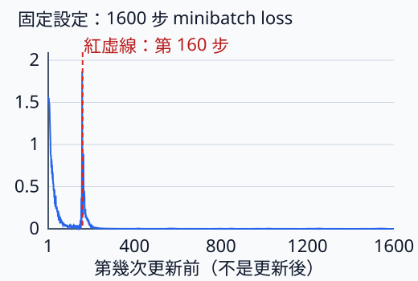
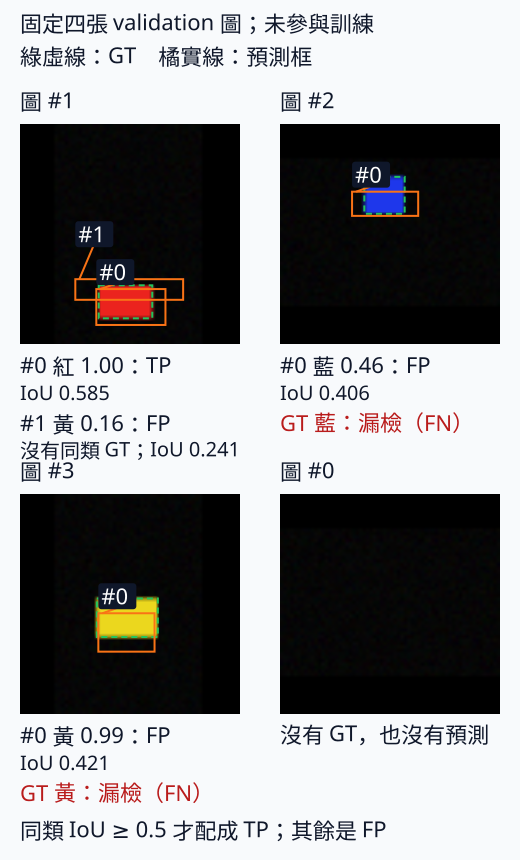

# B.8.2 用自己的資料：類別、標註與來源切分

[在 Colab 執行本節](https://colab.research.google.com/github/birdhackor/learn_to_yolo/blob/lessons-v0.6.1/notebooks/08-own-data.ipynb){ .md-button }

上一節能將圖片送進模型、把框還原；模型認得什麼，仍由訓練時的類別與標註決定。現在加入黃色矩形：要讓資料明確寫出黃色 id，重建三類 head，再只用 train 更新權重。還要把不同來源留給 validation、test，才能知道模型是否只記住熟悉的背景。

先用六張自己寫成 PNG 的小圖，接通標註→Dataset→batch→target→一次更新，再用完整實驗看 loss 下降與獨立偵測是否一致。讀完能把自己的圖片與原圖框寫入 JSON，按來源切分，沿用第 7 章訓練、評估與存檔。這裡的圖仍為人工合成，不代表照片效果。

## 黃色矩形的答案怎麼寫

本書的 JSON 標註是純文字的清單 `[ ]` 與鍵值 `{ }`。以下是一張 120×80 圖的紀錄，黃色矩形使用上一節的框位置 `[20,10,60,30]`：

```json
{
  "classes": ["red_rectangle", "blue_rectangle", "yellow_rectangle"],
  "images": [{
    "path": "video_A/0.png", "width": 120, "height": 80,
    "source_id": "video_A", "split": "train",
    "boxes": [[20, 10, 60, 30]], "labels": [2]
  }]
}
```


`classes` 的索引就是 class id：0 紅、1 藍、2 黃，因此 labels=[2]。width／height 是原圖尺寸，boxes 也是原圖 pixel xyxy 半開區間。不能先縮圖卻仍填原圖框；前處理會將兩者一起變換。這是本書自訂格式，不等同各種 YOLO 標註格式。

每框一列四個數，每列配一個 label。`boxes=[[20,10,60,30]]` 配空 labels 會被拒絕；`[[20,10],[60,30]]` 是兩列、每列兩數，也會被拒絕，不會偷偷 reshape 成一框。空圖寫 boxes=[]、labels=[]；Dataset 會建立 `[0,4]` 的空框與 `[0]` 的 long labels，避免 `torch.tensor([])` 只有 `[0]` 的框 shape。

## 哪些錯誤程式能找，哪些要看圖

建立 Dataset 時，先檢查所有 split，而非只查正在讀的 train。每筆 width／height 必須為正整數，空圖也一樣；每列四個有限座標，框／類別列數一致；`0≤x1<x2≤width`、`0≤y1<y2≤height`；id 為 0～類別數−1 的整數；圖檔都讀得到，實際尺寸也與紀錄相同。

id 檢查用 `type(label) is int`，不用一般 `isinstance`，因為 Python 的 bool 是 int 子類，`True==1`、`isinstance(True,int)` 都成立。JSON 誤寫 true 時，不能讓它悄悄變成藍色 id=1。

但「框在圖內」不代表「框對物件」。漏掉第三個物件、把框畫歪，仍可能通過全部檢查。先轉 RGB，再畫標註疊圖確認每個物件。漏標會讓沒有 target 的那個位置被教成背景，傷害不只是少一筆資料。

## 相近畫面不能分到考題兩邊

假設 video_A 的 A0、A1 幾乎一樣。A0 放 train、A1 放 test，模型只要記住 A0 的背景與姿態，就容易通過 A1。這是資料洩漏（leakage）：評估資料的相似資訊已混入訓練，分數不能代表新來源的能力。

因此同一個 source_id 整組進同一個 split。本節主例寫六張圖，每個來源一張黃矩形、一張空圖；各來源背景深淺（黑、深灰、灰）和物件位置、大小不同：

| source_id | 圖片 | split／用途 |
| --- | --- | --- |
| video_A | A0、A1 | train：更新權重 |
| video_B | B0、B1 | validation：挑學習率、步數、門檻等設定 |
| video_C | C0、C1 | test：設定定案後只評一次 |

真實 source 可是一支影片、同攝影機同日拍攝、一位病患或同一個物體，依任務選能擋住近似資訊的單位；只是換檔名，不會變成新來源。

`validate_annotations` 位於 `miniyolo/custom_data.py`，是格式檢查函式，不是 validation split。它記錄每個 source 第一次的 split，跨到另一組就拒絕，也拒絕重複 path；Dataset 建立時會呼叫。來源名卻不能保證畫素不同，所以主例另外逐張解碼 PNG 為 RGB，檢查完全相同圖片是否跨 split：

``` { .python data-excerpt="lesson_cases/08-own-data.py" }
split_of_image = {}
for r in records:
    with Image.open(root/r['path']) as image:
        key = (image.size,image.convert('RGB').tobytes())  # (寬, 高) 與全部畫素的 RGB 位元組
    assert split_of_image.setdefault(key,r['split']) == r['split'],'same image in two splits'
```


`setdefault` 第一次遇 key 時存入並回傳 split，以後回傳第一次的 split，與現在不同就表示同圖跨組。key 同時記 `(寬,高)` 和 RGB 位元組：120×80、80×120 的同色空圖會有相同畫素位元組，少尺寸會混成同圖。

這只抓完全相同，不會抓相近影格，因此仍要人工盤點來源。資料少時可按 source 做 k 折交叉驗證：保留 test，剩餘來源分 k 份，輪流一份 validation、其餘 train，做 k 次再平均；同 source 不能跨 fold。本節不執行交叉驗證。

## 路徑與原圖框，如何變成訓練 batch

`JsonDetectionDataset` 和第 7 章 ShapeDataset 一樣，`dataset[i]` 回傳第 i 張圖與標註，來源改為 JSON 與圖檔。path 相對 root；若沒給 root，使用 JSON 所在目錄。初始化先核對全部圖檔、尺寸與標註，再選 split，所以 validation 壞資料也不會因為只讀 train 而藏起來。

每圖 convert RGB、HWC uint8→CHW float32／255，再讓影像與框一起 letterbox 到 64×64。黃色框 `[20,10,60,30]` 變約 `[10.6667,15.375,32,26.125]`，仍為 class 2；y 乘 43/80 加上 padding 10，正是上一節的實際比例。回傳影像 `[3,64,64]` 與 boxes／labels dict，空框保留 `[0,4]`。

準備自己的 `my-data` 後，可使用下面寫法；Colab 主例則改讀程式產生的暫存圖：

```python
from miniyolo.custom_data import JsonDetectionDataset
from miniyolo.data import collate
from torch.utils.data import DataLoader

dataset = JsonDetectionDataset('my-data/annotations.json',root='my-data',split='train',image_size=64)
loader = DataLoader(dataset,batch_size=2,shuffle=False,collate_fn=collate)
images, annotations = next(iter(loader))  # 影像與同順序的 GT 標註（尚未轉成 target）
classes = dataset.classes  # 保留 JSON 中有順序的類別對照
```


DataLoader 取 batch_size 筆，交給 collate_fn 打包；shuffle=False 不改順序，`next(iter(loader))` 取第一批。影像疊成 `[B,3,64,64]`，各圖不同框數的標註保留長度 B 的 list。第 i 張圖必須對應第 i 份 GT，不能只重排其中一邊。此處 annotations 還是 letterbox 後的 GT，不是格子 target。

## 多一類，多了哪個輸出

每格原本四框數、一個 obj、兩個類別，共 7 項；黃色加入後成為 `5+3=8`，本批兩張 train 的 prediction 為 `[2,4,4,8]`。只新增黃色 class logit，框槽仍為一個；class id=2 現在能交給三類 CE。

head.weight 因此從 `[7,32,1,1]` 變為 `[8,32,1,1]`，不能直接載入兩類 checkpoint，也不能只改 labels=2 而保留兩類輸出。這裡從零重建 model、target 與指向新參數的 optimizer：

```python
import torch
from miniyolo.targets import build_targets
from miniyolo.models import GridDetector
from miniyolo.losses import grid_loss

# 接續上一段程式：images、annotations、classes 都來自上一段
model = GridDetector(num_classes=len(classes),grid_size=4,width=8)
target = build_targets(annotations,grid_size=4,image_size=64,num_classes=len(classes))
optimizer = torch.optim.Adam(model.parameters(),lr=.01)
optimizer.zero_grad(set_to_none=True)
loss = grid_loss(model(images),target)['total']
loss.backward()
optimizer.step()
```


target 讀的是前處理後 64×64 框；grid_size 是每邊格數，num_classes 由 JSON 的有序 classes 決定。若希望沿用其他層、只換 head 再訓練，那是微調（fine-tuning）的另一種做法；本節先從零接通完整流程。只換顯示名稱，舊權重仍在辨識舊類別。

## 執行六張圖的一次更新

在頁首 Colab 執行，或在 repo 根目錄執行 `PYTHONPATH=. python lesson_cases/08-own-data.py`。程式實際寫六張 PNG／JSON，核對來源與跨 split 畫素、每圖尺寸，讀 train 兩張，最後做一次有限 loss 的更新。輸出應有 `rejected source leakage`、各 split 兩筆、同步換算框及 head `(2,4,4,8)`。

它也故意送入錯誤資料：框列數／列長不符、bool id、空圖非正尺寸、非有限座標、實際圖片與紀錄尺寸不符，都要拒絕。這些是人工 fixture，確認輸入流程行為；檔案在暫存目錄，結束自動刪除，沒有六張照片的效果證據。

新增類別後，還要有標好的訓練樣本才能學，有獨立樣本才能評。先畫疊圖，少量 overfit，再看新來源誤報／漏檢，沿用第 7 章診斷順序；標註、檢查來源需要時間，單有八項輸出不能保證能力。

## 自主練習

自主練習：

練習 1：完整程式裡有一行 `bad = copy.deepcopy(records); bad[1]['split'] = 'test'`。`bad[1]` 就是 video_A 的 A1（`video_A/1.png`），A0 仍在 train。把 `'test'` 改成 `'validation'`，`validate_annotations` 能通過檢查嗎？

??? note "參考答案"

    不能，仍會印出 `rejected source leakage : source leakage`。video_A 已經以 train 出現過，A1 又出現在 validation，同一個 source_id 跨了 split，就是洩漏。改成 validation 或 test，結果都一樣。

練習 2：在完整程式的 `classes` 末尾加上 `'green_rectangle'`，新增「綠矩形」成為 class 3。head 輸出的最後一軸應是多少？哪個斷言（assert）要跟著改？

??? note "參考答案"

    最後一軸是 5+4=9。完整程式用 `len(classes)` 建 model 和 target，會自動變成 4 類，所以 `assert prediction.shape == (2,4,4,8)` 要改成 `(2,4,4,9)`。

    要讓模型學會綠矩形，光改程式還不夠：

    - 確認名稱與 id 的對照：`green_rectangle` 在 classes 的索引是 3，標註裡綠矩形的 labels 要寫 3。
    - 用 4 類重建 model、target 與 optimizer，再重新訓練。
    - train 要有標好的綠矩形才學得到；validation、test 也要有，才能評估這個新類別。

    只把 classes 裡某個舊名稱改成綠矩形是不行的：權重學到的仍是原本那一類。


## loss 已下降，偵測也變好了嗎

一次更新只接通流程。完整實驗用 `scripts/run_custom_data_learning.py` 生成 48 張非正方形 PNG 與 JSON：train 24、validation 12、test 12，每組三張空圖，紅藍黃各有 GT。每四張是一個 source，共 12 個，整組切分；跨 split PNG 與解碼 RGB 都無完全重複。這仍是合成來源，不取代照片來源盤點。

圖與框一起 letterbox 到 64×64，從零訓練。width 8、4×4 grid、三類，共 15,544 參數；batch 8、Adam、lr=.01、CPU 2 threads，預先固定跑滿 1600 步。初始化 seed 7，資料 train 7、validation 700、新 test 7001。

評估在三個 split 一致使用 score≥.1 候選截斷、同類 NMS IoU=.5、配對 IoU=.5、all-points AP50；mAP50 是三類平均，不是 COCO AP 0.50:0.95。資料、類別數與截斷和第 7 章不同，不跨頁比 AP 高低。

## 160 步的低末尾 loss，掩蓋了什麼

第一個短實驗的完整 train loss（24 張一起算）從 1.55017 降至 .16977，但 train mAP50=.00680、validation=0。資料塗色與 JSON、21 個 GT 對 21 正格、非零 target wh、負格框零梯度都已核對，沒有發現資料或 mask 接錯。



曲線來自下面的第二次完整實驗，前 160 步與短實驗逐值相同。藍線是每次更新前八張 minibatch 的 loss，起點約 1.56；完整 train 起點 1.55017 用全部 24 張，分母與材料不同。紅虛線標短實驗結束，第 158 步附近可見尖峰。

第 144～153 步大多約 .01～.04，第 158 步升到約 1.87，主要為分類項；box 在第 157、159～160 步也升至約 .02。短實驗評估正好在不穩段後，一個正格框高只剩約 .05 pixel。不能只用最後 total 判斷整段訓練，也不能從低 mAP 直接說框沒開始學。

## 1600 步背熟 train，獨立圖仍有落差

第二次由相同 seed 與初始化**獨立重新訓練總共 1600 步**，沒有接 160 步 checkpoint。train／validation、模型、Adam、lr 與門檻相同，所以前 160 步 loss 逐值一致。舊 test seed 7000 已看過，第二次改為事先固定 seed 7001，結束只評一次，使用最後一步模型；沒有用 test 選 seed、設定或 checkpoint。

手機上可左右滑動表格，查看完整欄位。

| 品質檢查 | 結果 | 如何理解 |
| --- | --- | --- |
| 完整 train loss，更新前→全部更新後 | 1.55017 → 0.000117048 | 同樣 24 張 train，loss 接近 0 |
| Train mAP50／precision／recall | 均為 1.0 | 21 個 GT 全部配對，沒有多餘框；小資料已 overfit |
| Validation mAP50 | 0.296296 | 不參與更新的圖，表現低很多 |
| 新 Test mAP50 | 0.777778 | 新 seed，只評一次的 test |

validation、test 各只有九個物件，.296 與 .778 不能當穩定泛化排名。提高候選截斷會刪低分框，AP 只會不變或下降；改門檻讓畫面更乾淨，不等於學得更好。



綠虛線是 GT，橘框是模型預測。各圖 #k 依 score 從高到低、從 0 編號，框旁標記與連線對應圖下同編號的類別、score、配對結果；不同圖重新編號。同類 GT 最多配一次、IoU≥.5 才是 TP，沒配成的預測為 FP，未配到 GT 為 FN。

- 紅圖：紅框 score 約 1.00、IoU 約 .58，為 TP；額外黃框 score 約 .16，沒有黃色 GT，為 FP，與紅 GT 的 IoU 約 .24。
- 藍圖：score 約 .46、IoU 約 .41，預測為 FP，藍 GT 同時為 FN。
- 黃圖：score 約 .99、IoU 約 .42，也為 FP+FN；高分不代表框準。
- 空圖：無 GT，也無預測。

圖與 AP 皆用 64×64 letterbox 座標。固定取每類第一張與第一張空圖，沒有按效果挑選；其餘 validation 也有誤報漏檢，不能由四張代替整組 mAP。各 split 完整 TP／FP／FN 保存在 report 的 `true_positives`／`false_positives`／`false_negatives`；[原合併紀錄圖](../assets/diagrams/08-custom-learning.svg)可供對照。

真實照片不能換 seed 生成新 test。第一次看 test 前定好設定；若看完再調，應另收新來源 test，或明說它已參與設定選擇。這份結果教的是：背熟 train、loss 下降與獨立偵測都要分開核對。

??? note "圖下說明的其他寫法"

    紅矩形圖中額外的黃色框，使用下面的「沒有同類 GT」寫法；換了資料或電腦，還可能看到其他情況：

    - 「FP（圖中沒有 GT）」：在空圖上畫了框。
    - 「FP（同類 GT 已被較高分的框配對）」：圖中這一類的 GT 都已被分數較高的框配走，這個框沒有 GT 可配。
    - 「FP（類別錯，IoU x）」：圖中沒有這一類的 GT，框卻和另一類的 GT 重疊到 IoU ≥ 0.5，也就是位置找對、類別判錯。
    - 「FP（沒有同類 GT，最大 IoU x）」：圖中沒有這一類的 GT，和其他 GT 的 IoU 也都不到 0.5；x 是其中最大的 IoU。
    - 一張圖超過 4 行時，第 4 行改寫成「……另有 N 項，見下方紀錄檔」，四張圖的下方再寫一行紀錄檔的路徑；完整清單在紀錄的 `validation_examples`。

## 選讀：重現實驗與保存狀態

下列內容供重現實驗與查輸出使用。品質解讀以上面的結果和圖為主。

??? note "自己跑 160 步，再獨立重新訓練總共 1600 步"

    只跑完整 1600 步實驗，在 repo 根目錄執行：

    ```bash
    python scripts/run_custom_data_learning.py --fixture --steps 1600 --fixture-test-seed 7001
    ```

    `--fixture` 生成合成資料，`--fixture-test-seed` 決定 test 圖。預設輸出在 `artifacts/runs/custom-data-learning/`，結束仍保留。Colab 的「可選」段落也使用這個命令，再顯示 `learning.svg`。這個簡短命令沒有與舊 160 步紀錄核對，圖上也沒有紅色虛線。

    若要核對前 160 步，依序做兩次**從零開始的獨立訓練**：

    ```bash
    python scripts/run_custom_data_learning.py --fixture --steps 160
    python scripts/run_custom_data_learning.py --fixture --steps 1600 --fixture-test-seed 7001 --output artifacts/runs/custom-data-learning-1600 --prior-diagnostic artifacts/runs/custom-data-learning/report.json
    ```

    第一行使用舊 test seed 7000，存到 `artifacts/runs/custom-data-learning/`。第二行的 `--prior-diagnostic` 只讀第一份報告來核對資料與設定，**不讀 checkpoint、不接續權重或 Adam 狀態**；它重設相同初始化再跑總共 1600 步，存到另一個 `custom-data-learning-1600/`。第二份圖才有第 160 步紅虛線。

    先前若跑過簡短命令，第一行會覆蓋同目錄的 checkpoint、report 與 learning.svg；第二行另存目錄。網站兩份紀錄也以這兩次獨立訓練產生（`scripts/record_evidence.py`），用 `--report`、`--diagram` 將紀錄和圖另存到 `artifacts/checks/curriculum/`、`docs/assets/diagrams/`。

    腳本核對比較條件：1600 步那次帶 `--prior-diagnostic` 指向 160 步紀錄，腳本就先用 160 步那次的 seed（train 7、validation 700、test 7000）重新產生那批資料，確認重建出的標註檔與解碼後的畫素，算出的 SHA-256 都和紀錄裡的相同（SHA 是 Secure Hash Algorithm（安全雜湊演算法）的縮寫；SHA-256 算出 256 位元的內容「指紋」，用來比對內容是否一致）。接著確認這次的 train／validation 圖與標註和那批逐筆相同、新的 test 沒有任何一張和舊 test 的畫素相同，模型、optimizer 與門檻的設定也和紀錄一樣。有一項不符，腳本就不開始訓練。

    [160 步失敗紀錄](https://github.com/birdhackor/learn_to_yolo/blob/main/artifacts/checks/curriculum/custom-data-160-step.json)與[完整 1600 步結果](https://github.com/birdhackor/learn_to_yolo/blob/main/artifacts/checks/curriculum/custom-data-learning.json)保留過程。`train_map50` 等輸出與表、圖的 mAP50，對應 report 各 split 的 `map`；各類 AP 在 `ap50_per_class_name`。


??? note "梯度、參數變化與 checkpoint 重新載入"

    | 檢查 | 本次結果 | 代表什麼 |
    |---|---|---|
    | 1600 步梯度 L2 | 每步有限且非零；0.024197–32.544746 | 所有梯度平方相加再開根號（第 1 章）；每步都有有限且非零的梯度；是否改變參數，還要看 optimizer.step 與參數差值 |
    | 參數變化 L2 | 17.216838 | 訓練前後所有參數差值的 L2 長度；大於 0 表示權重確實改變 |
    | checkpoint 重新載入 | 模型輸出、解碼後的框、Adam 狀態、亂數狀態在重新載入後都逐值相同 | 存檔再載入，沒有改動這些狀態 |

    每次迴圈會執行 optimizer.step；非零梯度描述反傳訊號，參數差值描述訓練前後改變。此處沒有逐步比較每個參數是否改變，不能只由非零梯度宣稱每一步都有實際參數變化。

    checkpoint（存檔）除了權重，還存了 optimizer 狀態、已完成的步數與亂數狀態，目的是之後能接著訓練。本節只核對本表最後一列的項目在重新載入後逐值相同；接著訓練的結果是否和不中斷時一樣，本節沒有確認；〈[GPU／checkpoint 實測](../validation/gpu-smoke.md)〉在雲端的 NVIDIA L4 GPU 上確認了這件事：第 7 章的 GridDetector 訓練到一半存檔，換一個新的 container 讀回後接著訓練，結果和不中斷的訓練逐值相同。

    - 格式：checkpoint 裡的 `format_version` 是 2（`load_checkpoint` 只接受這個格式來接著訓練），保存 model 權重、optimizer 狀態、步數、設定、類別名稱與亂數狀態。
    - Adam 狀態：Adam 替每個參數記住的過去梯度移動平均、梯度平方的移動平均，以及已更新的步數。不存它，接著訓練時 Adam 要從頭累積，更新幅度會和不中斷時不同。
    - 亂數狀態（RNG state）：RNG 是 Random Number Generator（亂數產生器），state 是它目前的內部狀態。本例存了 Python、NumPy 與 PyTorch 各自的狀態。存下來，之後的隨機步驟才能重現。
    - scheduler：依步數調整 learning rate 的規則。本例固定 learning rate，所以 scheduler 欄存成 None。
    - 重新載入後一致，核對的是這個 CPU 模型與狀態，不代表換到別的裝置也逐位相同。
    - [完整 1600 步結果](https://github.com/birdhackor/learn_to_yolo/blob/main/artifacts/checks/curriculum/custom-data-learning.json)保留全部 loss、資料與檔案的 SHA-256 指紋、四張 validation 圖的預測與配對，以及推論檢查。
    - 權重和資料沒有放進 Git：它們在 `.gitignore` 忽略的 `artifacts/runs/` 裡，也不在 Git LFS（Large File Storage，Git 存放大檔案的擴充功能）。


??? note "原圖推論 CLI 的相容性核對"

    對原始 PNG 推論的入口 `scripts/detect_image.py`，會用 checkpoint 裡有順序的 class_names 重建三類 head，再把預測還原到 80×120 或 120×80 的原圖；兩套座標不能直接比數值。腳本用它對紅矩形那張 validation 原圖推論兩次：一次在程式裡直接呼叫，一次另開一個程序（獨立執行的另一個 Python），像下文那樣在 repo 根目錄執行指令（指令記在紀錄的 `image_cli_compatibility.standalone_cli.command`）。兩次都用評估的門檻（score≥0.1、NMS 的 IoU 門檻 0.5）；還原到原圖的框、類別與分數，要和 letterbox 座標的預測換算回去的結果一致；`detect_image.py` 每次推論都會另存一份記錄框、類別與分數的 JSON，這兩次的兩份 JSON 除了路徑的寫法也要逐值相同，否則腳本報錯停下。


??? note "計時範圍：一次小實驗，不是效能測試"

    本次 CPU 訓練約 10.877 秒（紀錄的 `training_seconds`），只算訓練迴圈：每一步的 batch 索引、target 建立、前向／反向、有限梯度檢查、optimizer 與 loss 記錄。完整流程約 14.002 秒（`end_to_end_seconds`），另含資料生成與檢查（第二次獨立實驗還要用 160 步那次的 seed 重建那批資料來核對）、評估與訓練框的檢查、存檔、重新載入、原圖推論（包括另開程序執行 `scripts/detect_image.py`，連同那個程序的啟動與 import），以及其他輸出檔與 SVG；不含套件安裝、腳本自己的程序啟動與 import，以及最後寫出紀錄 JSON。這是一次小實驗的耗時，不是正式的效能測試。


## 換成自己的 JSON 與圖片

照下面的步驟準備資料：

1. 放檔案：圖片放在 `my-data/images/`，JSON 放在 `my-data/annotations.json`。JSON 裡的 `path` 相對 root 寫，例如 `images/example.png`。
2. 取得框座標：用標註工具（例如 CVAT 或 Label Studio）或看圖軟體，記下每個物件在原圖上左上角與右下角的 pixel 座標，也就是 `[x_min,y_min,x_max,y_max]`。本書的框採半開區間，座標是畫素之間的格線（見第 4 章〈[座標轉換與還原](04-coordinates.md)〉）。所以若讀到的是畫素編號（例如看圖軟體顯示的游標所在畫素），左上角記物件第一個畫素的編號，右下角要記物件最後一個畫素的編號再加 1。例如本節主例 `video_A/0.png` 的黃矩形，畫素的 x 是 20 到 59、y 是 10 到 29，要寫成 `[20,10,60,30]`；寫成 `[20,10,59,29]` 也會通過檢查，框的寬、高卻各少 1 pixel。
3. 轉換格式：若工具匯出的是 YOLO txt（每列是類別編號，以及 0–1 之間的中心 x、中心 y、寬、高），先乘回原圖的寬 W、高 H，再轉成 xyxy：`x_min=(cx−w/2)×W`、`x_max=(cx+w/2)×W`、`y_min=(cy−h/2)×H`、`y_max=(cy+h/2)×H`。類別編號也要對上 `classes` 的順序。
4. 填其餘欄位：照本節開頭的格式填 `width`、`height`（原圖尺寸）、`source_id`、`split`、`boxes`、`labels`。同一次拍攝（例如同一支影片）用同一個 source_id，再按 source_id 分配 split；train、validation、test 都至少要有一張圖。空圖寫 `boxes=[]`、`labels=[]`。
5. 先挑幾張圖畫上標註框檢查（疊圖），再在 repo 根目錄執行下面兩行指令。

```bash
python scripts/run_custom_data_learning.py --annotations my-data/annotations.json --root my-data --steps 1600 --output artifacts/runs/my-data
python scripts/detect_image.py --image my-data/images/example.png --checkpoint artifacts/runs/my-data/checkpoint.pt --output artifacts/runs/my-data/prediction.png
```

第一行會讀 JSON 裡有順序的 classes，檢查三個 split，訓練並保存 `checkpoint.pt`、`report.json`、`learning.svg` 和預測。第二行用存下來的模型，偵測你指定的原圖，存成疊上框的 PNG 和同名的 JSON。`--root my-data` 只用來找圖片；`--annotations` 後面的 JSON 路徑要寫完整，不會自動加上 root。這兩支 `scripts/` 裡的腳本會自己把 repo 根目錄加進 Python 找模組的路徑，所以不像本節的 `lesson_cases/08-own-data.py` 那樣要加 `PYTHONPATH=.`。

第二行畫框用的是顯示門檻 0.25（score 至少 0.25 才畫），不是評估時的候選截斷門檻 0.1，所以畫出的框可能比評估時同一張圖留下的候選少；想看評估用的那組候選，加上 `--score-threshold 0.1`。

這個入口適合少量已標註圖片。為了方便檢查，它把全部圖片載入 CPU 記憶體，不適合直接塞大型資料集。它也會拒絕跨 split 完全相同的 PNG／RGB。

建立 train 的 target 時，同一格有兩個物件會被拒絕，因為每格只負責一個框。64×64 的輸入切成 4×4 格，每格 16×16 pixel；兩個物件的框中心（letterbox 後）落在同一格，就會在開始訓練前報錯。錯誤訊息給出該圖在 train 中的序號與格子位置，格式是 `same-cell collision: image b, cell (row,col)`；b 依 JSON 裡 train 圖片的順序，從 0 起算。

用這個模型時，請挑物件少、彼此分開、縮小後仍夠大的圖，或先移除衝突的 train 圖。validation／test 照樣保留全部 GT 來評估，不為配合模型而刪除同格物件；模型的容量限制仍可能造成漏檢。第 9 章的 anchor 與第 10 章的多尺度能減少這類衝突，但不保證消除。

<!-- curriculum-evidence:start -->

## 實際執行紀錄

本節的完整程式於 2026-10-08 在 AMD EPYC 9V74 80-Core Processor（2 個執行緒）上用 PyTorch 2.9.1+cpu 執行，程式裡的 assert 全部通過。下面是那次印出的原始輸出；輸出裡若有計時或訓練得到的數字，換一台電腦會略有不同。每個數字的意思，以本頁正文的說明為準。[完整紀錄（JSON）](https://github.com/birdhackor/learn_to_yolo/blob/main/artifacts/checks/curriculum/08-own-data.json)

??? example "展開本次實際輸出"

    ```text
    rejected source leakage : source leakage
    rejected malformed box rows : box/label row counts differ
    rejected box row length with matching label count : each box row must have exactly four coordinates
    rejected boolean class id : class ids must be integer indices; bool is invalid
    rejected empty-image dimensions : width/height must be positive integers, including empty images
    rejected nonfinite coordinate : coordinates must be finite numbers
    rejected actual image/annotation size mismatch
    6 real PNG files loaded/verified; counts by split {'train': 2, 'validation': 2, 'test': 2}
    synchronized input box [[10.666666984558105, 15.375, 32.0, 26.125]]
    new class 2; head (2, 4, 4, 8) one training step 1.4407
    ```

<!-- curriculum-evidence:end -->
