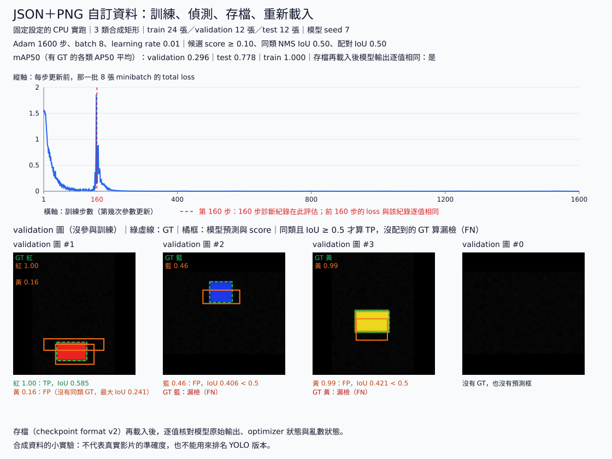

# 8.2 用自己的資料：類別、標註與來源切分

[在 Colab 執行本節](https://colab.research.google.com/github/birdhackor/learn_to_yolo/blob/lessons-v0.4.0/notebooks/08-own-data.ipynb){ .md-button }

前置：[自己的圖片推論](08-own-images.md)、[Grid MiniYOLO 資料](07-data.md)、[三步訓練與診斷](07-training.md)。你需要知道上一節的 letterbox 與 checkpoint 載入，以及第 7 章怎麼把標註打包成 batch、訓練 4×4 grid 的偵測器。

本節要解決兩個彼此獨立的問題：一是讓資料能表達新的類別，二是讓評估用的圖片來自模型沒見過的來源。讀完後，你能把自己的圖片和框寫成本書的標註格式、按來源切分 train／validation／test，再用同一套程式訓練、評估與存檔。先記住一件事：類別數改變後，模型必須重新訓練；只改顯示名稱，不能把「紅矩形」的權重變成認得「汽車」。

本節使用本書自訂的 JSON 標註格式。JSON 是用純文字記錄清單 `[ ]` 與鍵值 `{ }` 的通用資料格式。框座標沿用前面的原圖 pixel xyxy（左上角的 x、y 與右下角的 x、y），並新增 class 2 黃矩形。這是本書自己的格式，並不宣稱與各種 YOLO 標註格式相容。

本節有兩個實驗：

1. 主例（Colab 跑的就是它，不需下載資料）：程式自己畫 6 張小圖，寫成 PNG 與 JSON 檔：3 個來源各一張黃矩形、一張只有背景的空圖，三個來源的背景深淺（黑、深灰、灰）和黃矩形的位置、大小都不同。接著檢查格式、來源切分，以及跨 split 有沒有相同的圖，再讀成 batch，只拿 train 做一次參數更新，確認程式接得起來。
2. 後半的完整實驗：程式生成 48 張合成圖（24 張 train、12 張 validation、12 張 test），只拿 24 張 train 訓練 1600 步，再評估、存檔並重新載入。

兩者都是程式畫的合成圖，結果不代表模型在真實照片上的效果。

## 固定一種可以查核的格式

```json
{
  "classes": ["red_rectangle", "blue_rectangle", "yellow_rectangle"],
  "images": [{
    "path": "video_A/0.png", "width": 120, "height": 80,
    "source_id": "video_A", "split": "train",
    "boxes": [[20, 10, 60, 30]], "labels": [2]
  }]
}
```

`classes` 陣列的索引就是 class id，從 0 起算：0 是紅矩形、1 是藍矩形、2 是黃矩形，所以上例的 `"labels": [2]` 表示黃矩形。`width`、`height` 是還沒前處理的原圖尺寸，框也用原圖 pixel；若做 letterbox，影像和框必須一起變換。

`boxes` 和 `labels` 要一一對應：

- boxes 有幾列，labels 就要有幾個，每個框都要有類別。例如 `boxes=[[20,10,60,30]]` 配 `labels=[]` 會被拒絕。
- 每列剛好四個數 `[x_min,y_min,x_max,y_max]`。寫成 `[[20,10],[60,30]]`（兩列、每列兩個數）會被拒絕；程式不會先 reshape，替你拼成一個框。
- 沒有物件的圖寫 `boxes=[]`、`labels=[]`。Dataset 讀檔時會自動把空的 boxes 建成 shape `[0,4]` 的 tensor（`torch.empty(0,4)`），不必自己寫。這樣後面的程式拿到的框永遠是 `[N,4]`，空圖就是 N=0；若直接用 `torch.tensor([])`，shape 會是 `[0]`。

這些規則分成兩類：程式會自動擋下的，以及程式查不到、要你自己看的。

程式會自動擋下的（建立 Dataset 時就會檢查）：

1. 每筆紀錄的 width、height 都是正整數，空圖也一樣。
2. boxes 每列剛好是四個有限數字（不能是 NaN 或無限大），列數等於 labels 的個數。
3. 框在圖內且面積為正：`0≤x_min<x_max≤width`、`0≤y_min<y_max≤height`。
4. class id 是整數，且在 0 到「類別數−1」之間。程式寫成 `type(label) is int`，不用 `isinstance`。原因是 Python 的 bool 是 int 的子類別：`True == 1`，`isinstance(True, int)` 也成立。若 JSON 裡誤寫 `true`，用 isinstance 檢查，這個 true 會被當成 class 1 悄悄通過。
5. 所有 split 的圖片都讀得到，實際尺寸等於紀錄的 width、height。

程式查不到、要自己看的（把圖轉成 RGB，畫上標註框，也就是疊圖，用眼睛檢查）：

- 漏標：圖裡有物件，卻沒有對應的框。
- 框錯位：框的位置或大小和物件對不上。

程式只能查結構與範圍，不能替你知道一張圖有沒有漏掉第三個物件。漏標的傷害也不只是少一點訓練資料：訓練時，那個物件所在的位置會被當成背景來教。

## 按來源分組，先切分再調參

假設 video_A 連拍的兩張 A0、A1 幾乎相同。若 A0 在 train、A1 在 test，模型只要記住 A0 的背景和姿態，就能答對 A1。test 分數會虛高，量到的是記性，而不是泛化。test 的資訊經由相似畫面混進訓練，這種情形叫資料洩漏（leakage）。

所以要按來源切分：同一個 source_id 的圖，全部放在同一個 split。案例把 video_A 全放 train、video_B 全放 validation、video_C 全放 test，每組兩張。source_id 可以是一支影片、同一台攝影機同一天拍的一批、同一位病患，或同一個被拍的物體；依任務選一個能擋住相近畫面洩漏的單位。

切分固定後，train 用來更新權重；validation 用來挑設定（learning rate、訓練步數、門檻等超參數，不是權重）；test 等所有設定都決定後，只評估一次。

資料太少時，可以按來源做交叉驗證：test 仍另外保留；把剩下的 source 分成 k 份（每份叫一個 fold），輪流拿一份當 validation、另外 k−1 份當 train，做 k 次再平均結果。分份時，同一個 source_id 的圖必須放在同一份。本書不示範，只提醒這個原則。

案例的檢查函式 `validate_annotations`（在 `miniyolo/custom_data.py`，和 validation 資料無關）會記住每個 source_id 第一次出現在哪個 split；同一個來源若又出現在另一個 split，檢查就失敗。這個函式也拒絕重複的 path；建立 Dataset 時也會呼叫它。

這個檢查只看 source_id 與 path，不打開圖片：同一張圖改名複製、再標成另一個來源，它擋不到。所以主例的完整程式（Colab 裡的那份）在 `validate_annotations(records,classes)` 之後，另外打開每張 PNG、解碼成 RGB，記住每張圖第一次出現在哪個 split；同一張圖若又出現在另一個 split，assert 就失敗。下面這段摘自完整程式，`records` 是那 6 筆紀錄，`root` 是存放圖片的暫存資料夾：

``` { .python data-excerpt="lesson_cases/08-own-data.py" }
split_of_image = {}
for r in records:
    with Image.open(root/r['path']) as image:
        key = (image.size,image.convert('RGB').tobytes())  # (寬, 高) 與全部畫素的 RGB 位元組
    assert split_of_image.setdefault(key,r['split']) == r['split'],'same image in two splits'
```

字典的 `setdefault(key, split)`：這個 key 第一次出現時，存入並回傳這個 split；之後再遇到同一個 key，回傳第一次存的 split。兩者不同，就是同一張圖跨了 split。key 裡放了尺寸，因為 120×80 與 80×120 的同色空圖，畫素位元組完全相同，少了尺寸會被當成同一張。主例三個來源的背景深淺與黃矩形位置都不同，所以通過。這只抓得到畫素完全相同的圖；真實資料還要盤點來源，後半的完整實驗也比對了跨 split 完全相同的 PNG 與 RGB。

## 從圖片路徑到一個 batch

`JsonDetectionDataset` 位於 `miniyolo/custom_data.py`。它是 PyTorch 的 Dataset：給它編號 i，就回傳第 i 張影像與標註，和第 7 章的 `ShapeDataset` 一樣。建立時要給標註檔，也可以指定資料根目錄（root）。JSON 裡的 `path` 是相對 root 的圖片路徑；沒指定 root 時，就用 JSON 檔所在的目錄。

建立 Dataset 的那一行（初始化）會先檢查全部紀錄的類別、框、尺寸、來源與圖檔，再挑出指定的 split。所以就算只讀 train，validation 裡的錯誤資料也會在這時被抓出來。

讀每張圖時，先用 Pillow 的 `convert('RGB')` 轉成 RGB，再把 HWC 的 uint8 轉成 CHW 的 float32 並除以 255，最後把影像和 pixel xyxy 框一起 letterbox 到 64×64。120×80 圖上的 `[20,10,60,30]` 會變成約 `[10.6667,15.375,32,26.125]`，類別 2 不變。算法同上一節：x 乘 64/120；y 乘 43/80 再加上方 padding 10，例如 y1=10×43/80+10=15.375。Dataset 回傳 `[3,64,64]` 的影像，以及裝 boxes、labels 的字典；空圖的 boxes 仍是 `[0,4]`。

下面這段是換成自己資料時的寫法，要先準備好 my-data 資料夾（做法見本節最後）才跑得動；Colab 主例用的是程式產生的暫存資料。

```python
from miniyolo.custom_data import JsonDetectionDataset
from miniyolo.data import collate
from torch.utils.data import DataLoader

dataset = JsonDetectionDataset('my-data/annotations.json',root='my-data',split='train',image_size=64)
loader = DataLoader(dataset,batch_size=2,shuffle=False,collate_fn=collate)
images, annotations = next(iter(loader))  # 影像與同順序的 GT 標註（尚未轉成 target）
classes = dataset.classes  # 保留 JSON 中有順序的類別對照
```

`DataLoader` 每次從 dataset 取 batch_size 筆，交給 `collate_fn` 打包成一個 batch；`shuffle=False` 表示不打亂順序；`next(iter(loader))` 取出第一個 batch。

換成自己的資料時，只要改 JSON 和 root 兩處，不必像第 7 章那樣在程式裡寫死畫素位置（例如 `image[0, 12:28, 8:24] = 1`）。`collate` 把影像疊成 `[B,3,64,64]`；每張圖的物件數不同，所以標註保留成長度 B 的 list。第 i 張影像對應第 i 筆標註，不能只重排影像或只重排標註。

## 新類別如何改到 head

head 在每一格輸出「5＋類別數」個數：4 個框的數、1 個 objectness，再加上每類一個 class logit。兩類時是 `5+2=7`，三類變成 `5+3=8`。本例輸出 `[B,4,4,8]`＝`[2,4,4,8]`，B=2 是 train 的兩張圖；每格 8 個數依序是 tx、ty、tw、th、obj，以及紅、藍、黃三個 class logits。框的四個數和 obj 都不變，只多了黃色的 class logit；正格的 class id=2 交給三類的交叉熵（cross entropy，CE）算分類 loss。

所以 model 和 optimizer 都要重建。1×1 head 的權重 shape 從 `[7,32,1,1]` 變成 `[8,32,1,1]`，舊的兩類 checkpoint 直接載入，會因 shape 不符而報錯；也不能只把 labels 改成 2，就繼續套用兩類 head。實務上也可以沿用其他層的權重、只換 head 再訓練（微調，fine-tuning）；本節為了單純，從零訓練。

```python
import torch
from miniyolo.targets import build_targets
from miniyolo.models import GridDetector
from miniyolo.losses import grid_loss

# 接續上一段程式：images、annotations、classes 都來自上一段
model = GridDetector(num_classes=len(classes),grid_size=4,width=8)
target = build_targets(annotations,grid_size=4,image_size=64,num_classes=len(classes))
optimizer = torch.optim.Adam(model.parameters(),lr=.01)
optimizer.zero_grad(set_to_none=True)
loss = grid_loss(model(images),target)['total']
loss.backward()
optimizer.step()
```

這裡 `grid_size=4` 表示每邊 4 格；`image_size=64` 是前處理後輸入圖的邊長（pixel）；`num_classes` 取自 JSON 裡固定順序的 classes。target 用的是 letterbox 後的框，不是原圖框。

執行 [Colab 版本](https://colab.research.google.com/github/birdhackor/learn_to_yolo/blob/lessons-v0.4.0/notebooks/08-own-data.ipynb)，或在 repo 根目錄執行 `PYTHONPATH=. python lesson_cases/08-own-data.py`。應看到 `rejected source leakage`、每個 split 2 筆、head `(2,4,4,8)`，最後完成一步 loss 為有限值的更新。

完整程式（Colab 裡的那份）實際寫出六張 PNG（三個來源各一張黃矩形、一張空圖，背景深淺各不相同），確認跨 split 沒有畫素相同的圖，核對每個檔案的尺寸，讀入 train 的兩張，再做一次參數更新。它也故意送進幾種錯誤資料，確認都會被拒絕：框的列數或每列長度不對、class id 寫成 bool、空圖的寬高不是正數、座標不是有限數字，以及圖片實際尺寸和紀錄不符。

這些 source_id 和圖片都是 fixture（答案事先知道的人工測試資料），只用來測試程式的行為，不是六張真實照片的評估。它們寫在暫存目錄裡，程式結束時會自動刪除。

收益是新增類別與資料切分都有可重現的規則；代價是標註、檢查與整理來源都很花時間，新增類別也可能需要更多樣本並重新訓練。建議的順序是：先挑幾張圖畫標註疊圖，再用少量資料確認模型能 overfit（把訓練資料背熟），最後看沒參與訓練的圖有哪些漏檢與誤報；出問題時，照第 7 章的順序排查。

自主練習：

練習 1：完整程式裡有一行 `bad = copy.deepcopy(records); bad[1]['split'] = 'test'`。`bad[1]` 就是 video_A 的 A1（`video_A/1.png`），A0 仍在 train。把 `'test'` 改成 `'validation'`，`validate_annotations` 能通過檢查嗎？

??? note "參考答案"

    不能，仍會印出 `rejected source leakage : source leakage`。video_A 已經以 train 出現過，A1 又出現在 validation，同一個 source_id 跨了 split，就是洩漏。改成 validation 或 test，結果都一樣。

練習 2：在完整程式的 `classes` 末尾加上 `'green_rectangle'`，新增「綠矩形」成為 class 3。head 輸出的最後一軸應是多少？哪個斷言（assert）要跟著改？

??? note "參考答案"

    最後一軸是 5+4=9。完整程式用 `len(classes)` 建 model 和 target，會自動變成 4 類，所以 `assert prediction.shape == (2,4,4,8)` 要改成 `(2,4,4,9)`。

    要讓模型學會綠矩形，光改程式還不夠：

    - 確認名稱與 id 的對照：`green_rectangle` 在 classes 的索引是 3，標註裡綠矩形的 labels 要寫 3。
    - 用 4 類重建 model、target 與 optimizer，再重新訓練。
    - train 要有標好的綠矩形才學得到；validation、test 也要有，才能評估這個新類別。

    只把 classes 裡某個舊名稱改成綠矩形是不行的：權重學到的仍是原本那一類。

## 完整實驗：訓練、評估、存檔與重新載入

上面的一步更新只確認程式接得起來，還不能說新類別已經學會。這一段跑完整流程，重點有三個：

1. 只訓練 160 步時，loss 降了很多，mAP50 卻幾乎是 0；只看一個 loss 數字，看不出訓練中途發生了什麼。
2. 改成事先固定、跑滿的 1600 步後，train 全對，validation／test 卻低很多：背熟訓練資料不等於會泛化。
3. 最後說明怎麼換成你自己的資料。

`scripts/run_custom_data_learning.py` 沿用同一個 Dataset、GridDetector、target、loss 與 checkpoint，另外多做三件事：用少量資料做 overfit 練習、對沒參與訓練的圖片推論，以及存檔後重新載入。先用不需下載、由程式生成的三類合成資料跑一次：

```bash
python scripts/run_custom_data_learning.py --fixture --steps 1600 --fixture-test-seed 7001
```

`--fixture` 表示改用程式生成的合成資料，`--fixture-test-seed` 是產生 test 圖用的 seed。沒有指定 `--output` 時，所有檔案預設存在 `artifacts/runs/custom-data-learning/`，結束後仍可查看。Colab notebook 的「可選」段落，附有執行這行指令、再顯示 `learning.svg` 的程式碼。

它寫出 48 張非正方形 PNG 與 JSON：24 張 train、12 張 validation、12 張 test；每個 split 各有 3 張空圖，三類都有 GT。每 4 張圖算一個 source_id，共 12 個（train 6、validation 3、test 3）；三個 split 分別用 seed 7、700、7001 生成，彼此獨立。

source_id 不跨 split；跨 split 也沒有完全相同的 PNG 檔或解碼後的 RGB。只比對 PNG 檔不夠：同一張圖存成兩個 PNG 檔時，檔案位元組可能不同，解碼後的畫素卻一樣，所以還要比對解碼後的 RGB。這只抓得到完全相同的圖，抓不到真實連拍那種「幾乎一樣」的近似重複。這些圖都是合成的，不是真實影片。

所有圖與框先 letterbox 到 64×64，再用下表的設定從零訓練：

| 項目 | 設定 |
|---|---|
| 模型 | width 8（首層 channel 數）、4×4 grid、3 類，共 15,544 個參數 |
| 訓練 | batch 8、Adam、learning rate 0.01、事先固定、跑滿的 1600 步、CPU 2 threads（執行緒） |
| seed（亂數種子） | 模型初始化 7；資料 train 7、validation 700、test 7001 |

資料 seed 決定畫出哪些合成圖，所以換 test seed 就是換一批新的 test 圖。這些設定都在訓練前固定，每次實驗的 test 都只在訓練結束後評估一次。

### 先保留 160 步沒學好的結果

最初只訓練 160 步。結束時，完整 train loss（24 張 train 一起算）從 1.55017 降到 0.16977，但 train mAP50 只有 0.00680，validation 為 0。本節的 mAP50 是紅、藍、黃三類各自 AP50 的平均（定義見 6.2 節與第 7 章）：腳本印出的 `train_map50`、`validation_map50`、`test_map50`，以及後面的表格與圖上寫的 mAP50 都是它，對應腳本寫出的 `report.json` 裡各 split 的 `map` 欄位，各類的值在 `ap50_per_class_name`。

腳本在訓練結束後，會拿全部 train 圖檢查框的資料與 target：每張 train PNG 實際塗色的範圍都等於 JSON 裡的框（這一項只對合成資料做；空圖沒有塗色，也沒有框）；21 個 GT 剛好對應 21 個正格；正格寬、高的 target 都不是 0；負格的 box 梯度為 0，符合 positive mask 的設計（box loss 只算正格）。任何一項不成立，腳本就報錯停下；這次全部通過，數據記在紀錄的 `training_box_diagnosis`。這幾項都通過，代表標註、target 與 mask 沒有接錯。結束時，框的位置仍偏；正格的預測框中，最矮的一個高度只剩約 0.05 畫素（以 64×64 的輸入計）。

但逐步紀錄（每批 8 張的 loss）顯示，訓練中途並不平穩。第 144–153 步，每批 loss 大多只有約 0.01–0.04（box 約 0.002）；第 154–158 步卻出現以分類 loss 為主的尖峰，第 158 步約 1.87；box loss 在第 157 步與第 159–160 步也升到約 0.02。160 步的評估，正好落在這次訓練不穩之後。下方 1600 步實驗的圖中，紅色虛線標出第 160 步，也就是 160 步實驗結束、做評估的位置；緊貼在虛線旁的尖峰，就是這裡的第 158 步。1600 步實驗的前 160 步和這次用同樣的模型 seed、train 資料與訓練設定（test 圖不同，但 test 不參與訓練），loss 逐值相同，圖例也寫明了這一點。

所以這次的低 mAP50，不能單純解讀成「框還沒開始學」。這也說明：只看一個 total loss 數字，或只看最後一步，看不出訓練中途發生了什麼。

我們保留 [160 步失敗紀錄](https://github.com/birdhackor/learn_to_yolo/blob/main/artifacts/checks/curriculum/custom-data-160-step.json)，接著只把步數增加到預先固定的 1600 步；train／validation 的每張 PNG、模型、optimizer、learning rate 與門檻都不變。160 步那次已經看過 test，所以最後改用事前固定的新 test seed 7001。我們沒有用 test 挑 seed、設定或最佳 checkpoint（訓練途中分數最好的存檔），用的就是最後一步的模型。

這些「不變」由腳本自己核對。1600 步那次帶 `--prior-diagnostic` 指向 160 步紀錄，腳本就先用 160 步那次的 seed（train 7、validation 700、test 7000）重新產生那批資料，確認重建出的標註檔與解碼後的畫素，算出的 SHA-256 都和紀錄裡的相同（SHA-256 是由內容算出的「指紋」，內容改一點就會不同）。接著確認這次的 train／validation 圖與標註和那批逐筆相同、新的 test 沒有任何一張和舊 test 的畫素相同，模型、optimizer 與門檻的設定也和紀錄一樣。有一項不符，腳本就不開始訓練。

??? note "自己跑 160 步與接續的 1600 步"

    在 repo 根目錄依序執行：

    ```bash
    python scripts/run_custom_data_learning.py --fixture --steps 160
    python scripts/run_custom_data_learning.py --fixture --steps 1600 --fixture-test-seed 7001 --output artifacts/runs/custom-data-learning-1600 --prior-diagnostic artifacts/runs/custom-data-learning/report.json
    ```

    第一行用預設的 test seed 7000，結果存在 `artifacts/runs/custom-data-learning/`。第二行把第一行的 `report.json` 交給 `--prior-diagnostic`，先做上面的核對，再訓練 1600 步，結果存在 `artifacts/runs/custom-data-learning-1600/`；它的 `learning.svg` 才有第 160 步的紅色虛線。〈完整實驗：訓練、評估、存檔與重新載入〉開頭那行 `--fixture --steps 1600 --fixture-test-seed 7001`（Colab「可選」段落用的也是它）沒有 `--prior-diagnostic`，不做這些核對，圖上也沒有紅色虛線。第一行和它一樣寫到 `artifacts/runs/custom-data-learning/`，會覆蓋先前跑出的 `checkpoint.pt`、`report.json` 與 `learning.svg`。網站上的兩份紀錄也是這樣分兩步產生（`scripts/record_evidence.py`），只是用 `--report`、`--diagram` 把紀錄檔與圖寫到 `artifacts/checks/curriculum/` 與 `docs/assets/diagrams/`，第二步的 `--prior-diagnostic` 也就指向 160 步的紀錄檔。

??? note "test 只看一次：真實資料怎麼做"

    真實照片沒辦法像合成資料那樣換 seed 重生 test，所以要在第一次看 test 之前就把設定定好。若看過 test 之後又改了設定，就要另外收集一批來自新來源的 test，或在報告中明說 test 已被用來決定設定。

### 1600 步後：背熟訓練資料不等於會泛化

| 檢查 | 本次結果 | 代表什麼 |
|---|---|---|
| 同一套完整 train loss，更新前／全部更新後 | 1.55017 → 0.000117048 | 同樣 24 張 train 圖，loss 幾乎降到 0 |
| Train mAP50／precision／recall | 均為 1.0 | 21 個 GT 全部配對成功，也沒有多餘的框：這個小資料集已經 overfit（背熟） |
| Validation mAP50 | 0.296296 | 沒參與更新的圖，低很多 |
| 新的 Test mAP50 | 0.777778 | 用新 seed 生成、只評估一次的 test |
| 1600 步梯度 L2 | 每步有限且非零；0.024197–32.544746 | 所有梯度平方相加再開根號（第 1 章）；每步都有限且不是 0，表示每一步都有更新 |
| 參數變化 L2 | 17.216838 | 訓練前後所有參數差值的 L2 長度；大於 0 表示權重確實改變 |
| checkpoint 重新載入 | 模型輸出、解碼後的框、Adam 狀態、亂數狀態在重新載入後都逐值相同 | 存檔再載入，沒有改動這些狀態 |

三個 split 用同一套評估設定，都在訓練前固定：候選截斷門檻 score≥0.1、同類 NMS 的 IoU 門檻 0.5，以及配對 IoU 門檻 0.5 的本書 AP 定義。AP 採 all-points interpolation，三類都有 GT；不是 COCO 的 AP 0.50:0.95。候選截斷門檻越高，被刪掉的低分框越多，AP 只會不變或變低。本節的資料、類別數和候選截斷門檻都與第 7 章不同，AP 不能直接和第 7 章的數字比較。validation 和 test 各只有 9 個物件，兩者的差異也不能當成穩定的泛化排名。



圖上方是 loss 曲線。藍線是每次更新前，那 8 張 minibatch（每步拿來更新的一小批圖）的 loss，所以會上下跳動，第 1 步約 1.56。表格的 1.55017 是全部 24 張 train 一起算的，所以起點不同。

圖下方四張依序是紅、藍、黃矩形及空背景，來自沒參與更新的 validation。綠虛線是 GT，橘框與數字是模型的實際預測與分數；合成資料的三類在圖上寫成紅、藍、黃，換成自己的資料時則寫 JSON 裡的類別名稱。

每張圖下面逐行寫出評估的判定，規則和算 AP 時相同：預測框依分數由高到低，各自和還沒被配走的同類 GT 配對，IoU ≥ 0.5 才算 TP（正確偵測），每個 GT 只能配對一次；沒配對成功的預測是 FP（誤報），沒被任何預測配到的 GT 是 FN（漏檢）。每個預測框一行，寫成「類別 分數：TP，IoU x」，IoU 不到 0.5 時寫成「類別 分數：FP，IoU x < 0.5」，x 是它和同類 GT 的 IoU。每個沒被配到的 GT 另起一行「GT 類別：漏檢（FN）」；空圖上若也沒有框，就寫「沒有 GT，也沒有預測框」。

??? note "圖下說明的其他寫法"

    紅矩形圖中額外的黃色框，使用下面的「沒有同類 GT」寫法；換了資料或電腦，還可能看到其他情況：

    - 「FP（圖中沒有 GT）」：在空圖上畫了框。
    - 「FP（同類 GT 已被較高分的框配對）」：圖中這一類的 GT 都已被分數較高的框配走，這個框沒有 GT 可配。
    - 「FP（類別錯，IoU x）」：圖中沒有這一類的 GT，框卻和另一類的 GT 重疊到 IoU ≥ 0.5，也就是位置找對、類別判錯。
    - 「FP（沒有同類 GT，最大 IoU x）」：圖中沒有這一類的 GT，和其他 GT 的 IoU 也都不到 0.5；x 是其中最大的 IoU。
    - 一張圖超過 4 行時，第 4 行改寫成「……另有 N 項，見下方紀錄檔」，四張圖的下方再寫一行紀錄檔的路徑；完整清單在紀錄的 `validation_examples`。

按配對 IoU 門檻 0.5 判定：紅矩形圖留下兩個框，紅框的分數約 1.00、IoU 約 0.58，算 TP；另一個黃色框的分數約 0.16，但圖中沒有黃色 GT，算 FP，和紅色 GT 的 IoU 約 0.24。藍矩形圖只留下一個藍框，分數約 0.46、IoU 約 0.41，未達門檻，算一個 FP，GT 也算 FN。黃矩形圖的黃框分數約 0.99，IoU 卻只有約 0.42，同樣是 FP 加 FN。分數高不等於位置對。

圖和 AP 都使用 64×64 letterbox 座標。另外，對原始 PNG 推論的入口 `scripts/detect_image.py`，會用 checkpoint 裡有順序的 class_names 重建三類 head，再把預測還原到 80×120 或 120×80 的原圖；兩套座標不能直接比數值。腳本用它對紅矩形那張 validation 原圖推論兩次：一次在程式裡直接呼叫，一次另開一個程序（獨立執行的另一個 Python），像下文那樣在 repo 根目錄執行指令（指令記在紀錄的 `image_cli_compatibility.standalone_cli.command`）。兩次都用評估的門檻（score≥0.1、NMS 的 IoU 門檻 0.5）；還原到原圖的框、類別與分數，要和 letterbox 座標的預測換算回去的結果一致；`detect_image.py` 每次推論都會另存一份記錄框、類別與分數的 JSON，這兩次的兩份 JSON 除了路徑的寫法也要逐值相同，否則腳本報錯停下。

四張圖固定取各類的第一張與第一張空圖，沒有依偵測效果挑選；可[開啟原尺寸圖](../assets/diagrams/08-custom-learning.svg)查看小字。圖中黃矩形那張就同時有誤報與漏檢；這四張以外的 validation 圖也有誤報與漏檢，不能只看這四張就忽略整體 mAP50。每個 split 的 TP、FP、FN 個數，記在紀錄裡各 split 的 `true_positives`、`false_positives`、`false_negatives`。

在作者的 Linux CPU（2 threads）上訓練約 10.9 秒，你的電腦會不同。

??? note "計時包含哪些步驟"

    本次 CPU 訓練約 10.877 秒（紀錄的 `training_seconds`），只算訓練迴圈：每一步的 batch 索引、target 建立、前向／反向、有限梯度檢查、optimizer 與 loss 記錄。完整流程約 14.002 秒（`end_to_end_seconds`），另含資料生成與檢查（接續實驗還要用 160 步那次的 seed 重建那批資料來核對）、評估與訓練框的檢查、存檔、重新載入、原圖推論（包括另開程序執行 `scripts/detect_image.py`，連同那個程序的啟動與 import），以及其他輸出檔與 SVG；不含套件安裝、腳本自己的程序啟動與 import，以及最後寫出紀錄 JSON。這是一次小實驗的耗時，不是正式的效能測試。

checkpoint（存檔）除了權重，還存了 optimizer 狀態、已完成的步數與亂數狀態，目的是之後能接著訓練。本節只核對上表最後一列的項目在重新載入後逐值相同；接著訓練的結果是否和不中斷時一樣，本節沒有確認；〈[GPU／checkpoint 實測](../validation/gpu-smoke.md)〉在雲端的 NVIDIA L4 GPU 上確認了這件事：第 7 章的 GridDetector 訓練到一半存檔，換一個新的 container 讀回後接著訓練，結果和不中斷的訓練逐值相同。

??? note "checkpoint 存了什麼"

    - 格式：checkpoint 裡的 `format_version` 是 2（`load_checkpoint` 只接受這個格式來接著訓練），保存 model 權重、optimizer 狀態、步數、設定、類別名稱與亂數狀態。
    - Adam 狀態：Adam 替每個參數記住的過去梯度移動平均、梯度平方的移動平均，以及已更新的步數。不存它，接著訓練時 Adam 要從頭累積，更新幅度會和不中斷時不同。
    - 亂數狀態（RNG state）：亂數產生器目前的內部狀態，本例存了 Python、NumPy 與 PyTorch 各自的狀態。存下來，之後的隨機步驟才能重現。
    - scheduler：依步數調整 learning rate 的規則。本例固定 learning rate，所以 scheduler 欄存成 None。
    - 重新載入後一致，核對的是這個 CPU 模型與狀態，不代表換到別的裝置也逐位相同。
    - [完整 1600 步結果](https://github.com/birdhackor/learn_to_yolo/blob/main/artifacts/checks/curriculum/custom-data-learning.json)保留全部 loss、資料與檔案的 SHA-256 指紋、四張 validation 圖的預測與配對，以及推論檢查。
    - 權重和資料沒有放進 Git：它們在 `.gitignore` 忽略的 `artifacts/runs/` 裡，也不在 Git LFS（Git 存放大檔案的擴充功能）。

### 換成自己的 JSON 與圖片

照下面的步驟準備資料：

1. 放檔案：圖片放在 `my-data/images/`，JSON 放在 `my-data/annotations.json`。JSON 裡的 `path` 相對 root 寫，例如 `images/example.png`。
2. 取得框座標：用標註工具（例如 CVAT 或 Label Studio）或看圖軟體，記下每個物件在原圖上左上角與右下角的 pixel 座標，也就是 `[x_min,y_min,x_max,y_max]`。本書的框採半開區間，座標是畫素之間的格線（見第 4 章〈[座標轉換與還原](04-coordinates.md)〉）。所以若讀到的是畫素編號（例如看圖軟體顯示的游標所在畫素），左上角記物件第一個畫素的編號，右下角要記物件最後一個畫素的編號再加 1。例如本節主例 `video_A/0.png` 的黃矩形，畫素的 x 是 20 到 59、y 是 10 到 29，要寫成 `[20,10,60,30]`；寫成 `[20,10,59,29]` 也會通過檢查，框的寬、高卻各少 1 pixel。
3. 轉換格式：若工具匯出的是 YOLO txt（每列是類別編號，以及 0–1 之間的中心 x、中心 y、寬、高），先乘回原圖的寬 W、高 H，再轉成 xyxy：`x_min=(cx−w/2)×W`、`x_max=(cx+w/2)×W`、`y_min=(cy−h/2)×H`、`y_max=(cy+h/2)×H`。類別編號也要對上 `classes` 的順序。
4. 填其餘欄位：照本節開頭的格式填 `width`、`height`（原圖尺寸）、`source_id`、`split`、`boxes`、`labels`。同一次拍攝（例如同一支影片）用同一個 source_id，再按 source_id 分配 split；train、validation、test 都至少要有一張圖。空圖寫 `boxes=[]`、`labels=[]`。
5. 先挑幾張圖畫上標註框檢查（疊圖），再在 repo 根目錄執行下面兩行指令。

```bash
python scripts/run_custom_data_learning.py --annotations my-data/annotations.json --root my-data --steps 1600 --output artifacts/runs/my-data
python scripts/detect_image.py --image my-data/images/example.png --checkpoint artifacts/runs/my-data/checkpoint.pt --output artifacts/runs/my-data/prediction.png
```

第一行會讀 JSON 裡有順序的 classes，檢查三個 split，訓練並保存 `checkpoint.pt`、`report.json`、`learning.svg` 和預測。第二行用存下來的模型，偵測你指定的原圖，存成疊上框的 PNG 和同名的 JSON。`--root my-data` 只用來找圖片；`--annotations` 後面的 JSON 路徑要寫完整，不會自動加上 root。這兩支 `scripts/` 裡的腳本會自己把 repo 根目錄加進 Python 找模組的路徑，所以不像本節的 `lesson_cases/08-own-data.py` 那樣要加 `PYTHONPATH=.`。

第二行畫框用的是顯示門檻 0.25（score 至少 0.25 才畫），不是評估時的候選截斷門檻 0.1，所以畫出的框可能比評估時同一張圖留下的候選少；想看評估用的那組候選，加上 `--score-threshold 0.1`。

這個入口適合少量已標註圖片。為了方便檢查，它把全部圖片載入 CPU 記憶體，不適合直接塞大型資料集。它也會拒絕跨 split 完全相同的 PNG／RGB。

建立 train 的 target 時，同一格有兩個物件會被拒絕，因為每格只負責一個框。64×64 的輸入切成 4×4 格，每格 16×16 pixel；兩個物件的框中心（letterbox 後）落在同一格，就會在開始訓練前報錯。錯誤訊息給出該圖在 train 中的序號與格子位置，格式是 `same-cell collision: image b, cell (row,col)`；b 依 JSON 裡 train 圖片的順序，從 0 起算。

用這個模型時，請挑物件少、彼此分開、縮小後仍夠大的圖，或先移除衝突的 train 圖。validation／test 照樣保留全部 GT 來評估，不為配合模型而刪除同格物件；模型的容量限制仍可能造成漏檢。第 9 章的 anchor 與第 10 章的多尺度能減少這類衝突，但不保證消除。

<!-- curriculum-evidence:start -->

## 實際執行紀錄

本節的完整程式於 2026-10-05 在 INTEL(R) XEON(R) PLATINUM 8573C（2 個執行緒）上用 PyTorch 2.9.1+cpu 執行，程式裡的 assert 全部通過。下面是那次印出的原始輸出；輸出裡若有計時或訓練得到的數字，換一台電腦會略有不同。每個數字的意思，以本頁正文的說明為準。[完整紀錄（JSON）](https://github.com/birdhackor/learn_to_yolo/blob/main/artifacts/checks/curriculum/08-own-data.json)

??? example "展開本次實際輸出"

    ```text
    rejected source leakage : source leakage
    rejected malformed box rows : box/label row counts differ
    rejected box row length with matching label count : each box row must have exactly four coordinates
    rejected boolean class id : class ids must be integer indices; bool is invalid
    rejected empty-image dimensions : width/height must be positive integers, including empty images
    rejected nonfinite coordinate : coordinates must be finite numbers
    rejected actual image/annotation size mismatch
    6 real PNG files loaded/verified; counts by split {'train': 2, 'validation': 2, 'test': 2}
    synchronized input box [[10.666666984558105, 15.375, 32.0, 26.125]]
    new class 2; head (2, 4, 4, 8) one training step 1.4407
    ```

<!-- curriculum-evidence:end -->
