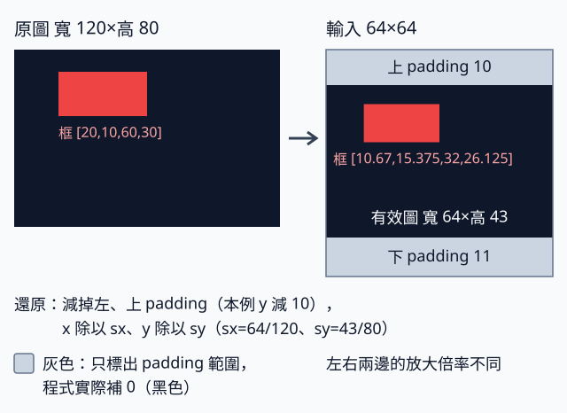

# 8.1 用自己的圖片：先把座標換算和類別順序弄對

[在 Colab 執行本節](https://colab.research.google.com/github/birdhackor/learn_to_yolo/blob/lessons-v0.6.1/notebooks/08-own-images.ipynb){ .md-button }

前置：[完整推論](07-inference.md)、[座標轉換](04-coordinates.md)。本節處理單張非正方形圖片：讀取、RGB／CHW 轉換、letterbox、推論、框還原。它與「新增自己的類別」是兩件事；把照片放進模型不會讓紅／藍矩形模型自動認識汽車。

本節程式新建一個與第 7 章同架構的 grid MiniYOLO（紅／藍兩類、4×4 格），沒有改架構，也沒有下載預訓練權重（pretrained weights：別人先在大型資料集上訓練好的參數）。為了讓沒有照片的人也能跑，程式先畫一張寬 120、高 80、黑底加紅色矩形的 PNG，存到 `artifacts/lesson-08-own-images/`，再用 Pillow（Python 的讀圖套件，程式裡寫成 `from PIL import Image`）讀回來。這張圖就是下面「120×80 圖片怎麼進 64×64 網路」的例子。

接著程式在 CPU 上真的訓練 3 步，把模型存成 checkpoint，重新載入後再對圖片推論。checkpoint 是訓練時存下的檔案，含權重與設定，之後可以載回來推論或接著訓練。訓練 3 步，是為了讓存進檔案的是真的更新過的參數，又能很快走完「訓練 → 存檔 → 載入 → 推論」；3 步還學不會偵測。程式另外用一份手填的已知答案來驗證座標換算。所以本節的檢查只用來驗證權重的存檔與載入、讀圖流程與座標換算，不代表照片的偵測效果。



圖右整個正方形是 64×64 的輸入，中間深色部分是縮小後的原圖（寬 64、高 43）。圖中灰色只是用來標示 padding；程式實際補 0，也就是黑色。

## 120×80 圖片怎麼進 64×64 網路

原圖寬 120、高 80，紅框 `[20,10,60,30]`，寬高 40×20。影像 `[80,120,3]` uint8 經 `convert('RGB')`、`permute(2,0,1)`、除以 255，得到 `[3,80,120]` float32。透明圖或灰階圖同樣要先轉 RGB：帶透明度的 PNG 通常是 RGBA，有 4 個 channel；灰階圖只有 1 個 channel，讀成陣列時甚至只剩 `[H,W]` 兩個軸。模型第一層卷積固定吃 3 個 channel，不轉的話，後面的 `permute` 或第一層卷積就會報錯；`convert('RGB')` 會把它們統一成 3 個 channel。但它只是把透明度丟掉，不會鋪上背景色：透明的地方會露出檔案裡存的 RGB 值（常是黑色，但不保證）。要固定背景色，先建一張同尺寸、填滿指定顏色的 RGB 底圖（例如 `background = Image.new('RGB', image.size, (255, 255, 255))`），再以透明度當遮罩把圖貼上去（`background.paste(image, mask=image.getchannel('A'))`）。這裡的遮罩是 0 到 255 的比例：0 的地方保留底色，255 的地方用原圖，中間的值兩者按比例混合。

從讀檔到送進模型，shape 依序變成：

`[80,120,3]` uint8（HWC）→ `permute`、轉 float、除以 255 → `[3,80,120]` float32 → letterbox（見下方）→ `[3,64,64]` → `unsqueeze(0)` 加 batch 軸 → `[1,3,64,64]`

所以模型實際接收 `[1,3,64,64]` 的 NCHW：batch 大小為 1（NCHW 的 N 就是 batch，不是框的個數）、RGB、float32、值域 `[0,1]`。

等比例 letterbox 要讓整張圖放進 64×64，寬和高都不能超出，所以縮放比例取兩個方向中較小的一個：scale=min(64/120, 64/80)=min(0.5333, 0.8)。因此理想 scale=`64/120=.533333`，由較長的寬決定。寬剛好縮成 64，左右不補 padding；高理想為 42.6667，但影像高度必須是整數，實際取 43，所以實作儲存 `sx=64/120`、`sy=43/80=.5375`。高度還差 64−43=21 列：上方補 `21//2=10` 列，下方補剩下的 11 列，也就是上 padding=10，下 padding=11。

框的換算是先乘實際比例、再加 padding：

- x1=20×64/120+0≈10.67，x2=60×64/120+0=32
- y1=10×0.5375+10=15.375，y2=30×0.5375+10=26.125

所以輸入框約為 `[10.6667,15.375,32,26.125]`。

還原則反過來：x 減 left padding 再除以 sx，y 減 top padding 再除以 sy，得到原框 `[20,10,60,30]`。若只記理想 scale，把 y 也除以 0.533333，就會出現取整造成的誤差：y1 會算成 (15.375−10)/0.5333≈10.08、y2≈30.23，而不是 10、30；整張圖的下緣 53 會算成約 80.6，超出原圖高度 80。x 方向的寬 120×64/120 剛好是 64，sx 就等於理想 scale，所以不受影響。誤差的來源是高度 42.67 先被取整成 43，實際比例變成 0.5375。

letterbox 回傳的 metadata 裡兩種順序並存，取值時要看欄位名稱：`original_size`、`resized_size` 是先高後寬的 `(H,W)`，本例是 (80,120)、(43,64)；`padding` 是 `(left,top)`、`scale_xy` 是 `(sx,sy)`，都是先 x 後 y，本例是 (0,10)、(0.5333,0.5375)。metadata 裡的 `scale` 是理想比例；有 `scale_xy` 時，還原用的是 `scale_xy`。本節用的是 `miniyolo.geometry` 的 letterbox，欄位名稱和第 4 章程式裡自己寫的版本不同（例如第 4 章的 `original_hw`，在這裡叫 `original_size`），意思相同。必須讓每張圖帶自己的 metadata，不能拿 batch 第一張的去還原全部圖片。

下面是推論核心步驟的簡化版，改寫自 `scripts/detect_image.py` 的 `detect_image()`，逐行加了註解（用到的 import 與完整程式開頭相同）：

```python
# 'my.png' 換成你的圖片；.copy() 複製成可寫入的陣列，避免 torch.from_numpy 發出警告
rgb = np.asarray(Image.open('my.png').convert('RGB')).copy()  # 本例 [80,120,3] uint8（HWC）
image = torch.from_numpy(rgb).permute(2,0,1).float() / 255  # [3,80,120] float32，值域 [0,1]
# input_image 是 [3,64,64]；_ 是換算後的框，這裡傳入空框，所以它也是空的
input_image, _, meta = letterbox(image, torch.empty(0,4), size=64)
with torch.inference_mode():
    # model 是載入好的模型，載入方法見下方「實際載入模型，推論指定圖片」
    # unsqueeze(0) 在最前面加 batch 軸：[3,64,64] → [1,3,64,64]
    # 64、.25、.5 依序是 image_size、score_threshold、nms_iou
    # decode_grid 回傳「每張圖一個 dict」的 list；[0] 取第一張（也是唯一一張）
    pred = decode_grid(model(input_image.unsqueeze(0)),64,.25,.5)[0]
original_boxes = undo_letterbox(pred['boxes'], meta)  # 用這張圖自己的 meta 還原到原圖座標
```

傳空框表示推論時沒有 GT，不表示原圖裡沒有物件。模型看到的是補過 padding 的 64×64 圖，decoder 輸出的也是這個座標系的 pixel xyxy。最後才還原到原圖、裁切到原圖範圍內並畫框。

## 可核對的快速實驗

可以用頁首的「在 Colab 執行本節」按鈕執行，或在 repo 根目錄執行 `PYTHONPATH=. python lesson_cases/08-own-images.py`。輸出共 7 行，依序對應下面四項檢查：

1. 第 1–2 行是往返（roundtrip）：框先經 letterbox 換到輸入座標，再用 undo_letterbox 還原。應看到原圖 shape `(3,80,120)`、上面算出的輸入框與 metadata，最後回到 `[20,10,60,30]`。float32 的計算有極小的捨入誤差（例如 60 實際算出 59.999996…），所以程式把框座標四捨五入到小數第 4 位才印出；assert 也用 `torch.allclose`，只檢查還原的框和原框非常接近，不要求完全相等。
2. 第 3–5 行是存檔、重新載入與推論：程式先在 CPU 上做 3 次參數更新，存成 checkpoint，再用 `weights_only=True` 讀回（意思見下方「實際載入模型，推論指定圖片」），確認重新載入前後的 logits 逐值相等。接著用 `scripts/detect_image.py` 的 `detect_image()` 真正讀取 PNG 推論：只留 score 至少 0.25 的框（0.25 是顯示門檻，決定要畫出哪些框），存下 PNG（原圖疊上留下的框，沒有框時就是原圖）與記錄原圖座標的 JSON。程式檢查 `detect_image()` 回傳的報告（也就是寫進 JSON 的內容）記下的 `score_threshold` 是 0.25，而且每個框的 score 都至少 0.25。第 3 行最後印出留下的框數與這個門檻，第 4 行是 PNG 與 JSON 的路徑，第 5 行是固定的提醒：這些只證明流程接得通，不代表照片的偵測品質。3 步模型還學不會偵測，所以框數不論多少都不算偵測結果，也不能用來判斷權重有沒有套用（那是前面「logits 逐值相等」這項檢查的工作）；兩種 score 門檻的差別，見下方「CLI 的步驟與預設門檻」。
3. 第 6 行：類別數與設定（config）不一致的 checkpoint 必須被拒絕。程式故意存一個有 3 個類別名稱、config 卻寫 2 類的檔案，載入時應報錯。
4. 第 7 行是手填的已知答案：程式做一份「完美」的模型輸出。負責紅框的那一格：框值設成解碼後剛好得到輸入座標裡的紅框，objectness logit 填 10，類別 logits 填 10 與 −10（紅類較高）。其他格的 objectness logit 都填 −20。這份輸出經過 decode 和 undo_letterbox 後，應回到約 `[20,10,60,30]` 的原框。

## 實際載入模型，推論指定圖片

第 7 章的訓練程式是一個 CLI（command-line interface，命令列程式：在終端機或 Colab cell 打指令、加參數來執行的程式）。它存下的 checkpoint 讀回來是一個 Python dict，分成幾個欄位：`model_state_dict` 是權重；`config` 記錄 image_size、grid_size、width 等設定；`class_names` 是照順序排好的類別名稱；另外還有 optimizer 狀態等推論用不到的欄位。

`model_state_dict` 本身也是 dict，稱為 state_dict：key 是參數的名稱，value 是對應的 tensor（有 BatchNorm 的模型還會存 `running_mean` 這類不是參數的 buffer；本書的模型沒有 buffer，所以這裡全是參數）。例如兩類、width 8 的模型，`head.weight` 對應一個 shape 為 `[7,32,1,1]` 的 tensor。state_dict 只存這些數字，不存模型結構（有哪些層、層與層怎麼接），所以要先用 config 和類別數新建一個同結構的 GridDetector，再用 `load_state_dict` 依參數名稱把數字填回去。要傳進去的是 `checkpoint['model_state_dict']`，不能把整個 checkpoint dict 直接送進 `load_state_dict`。image_size 不必給模型，它是給 letterbox 和 decode 用的。`scripts/detect_image.py` 的載入函式 `load_grid_checkpoint()` 就是這樣重建與載入的；下面摘錄它的關鍵幾行，`...` 是省略的檢查（見後文）：

``` { .python data-excerpt="scripts/detect_image.py" }
def load_grid_checkpoint(path):
    checkpoint = torch.load(path, map_location='cpu', weights_only=True)
    ...
    config, classes = checkpoint['config'], checkpoint['class_names']
    ...
    model = GridDetector(num_classes=len(classes),grid_size=config['grid_size'],width=config['width'])
    model.load_state_dict(checkpoint['model_state_dict'], strict=True)
    ...
    model.eval()
    return model, config, classes
```

`map_location='cpu'` 把檔案裡的 tensor 都載到 CPU，所以在 GPU 上存的檔，沒有 GPU 的電腦也能讀。`weights_only=True` 不是「只讀權重」，而是只允許還原 tensor、數字、字串、list、dict 這類單純的資料。`torch.load` 底層用 pickle（Python 把物件存成檔案的格式），來路不明的檔案可能夾帶會被執行的程式碼。這個設定只還原允許清單裡的型別；檔案要求呼叫清單以外的函式或類別時，會直接報錯、不執行。PyTorch 官方的說法是「就目前所知是安全的」，所以來路不明的檔案，最好只在隔離的環境（例如容器或虛擬機）中載入。config 與 class_names 也是這類單純資料，所以照樣讀得到。

`load_state_dict` 依參數名稱（key）填值。`strict=True` 要求名稱一一對上：檔案缺了模型需要的參數（或 buffer），或多出模型沒有的，都會報錯。shape 對不上時，不論 strict 怎麼設都會報錯；例如用 3 個類別名稱建模型，新模型的 `head.weight` 是 `[8,32,1,1]`，就對不上檔案裡兩類模型的 `[7,32,1,1]`。

`load_grid_checkpoint()`（CLI 和本節完整程式都用它）在上面 `...` 省略的地方還多做幾項檢查，例如：config 的 image_size、grid_size、width 都要是正整數；類別名稱不能是空的，也不能重複；config 若有 num_classes，必須等於名稱個數。上面快速實驗第 6 行那個故意做壞的檔案（config 寫 2 類，卻有 3 個類別名稱），就是被 num_classes 這一項擋下的，還沒走到 `load_state_dict`。

類別名稱的順序必須和訓練時相同。class id 照 class_names 的索引對應：id 0 永遠是訓練時的第 0 類（紅矩形），id 1 是藍矩形。若把 class_names 改成 `['car','person']`，上面的檢查照樣全部通過，結果只是把紅矩形標成 car，模型並不會因此認得汽車。程式檢查不出這種錯，名稱順序要靠使用者自己對好。

`scripts/detect_image.py`（包括 `load_grid_checkpoint()`）只接受本書 GridDetector 的存檔格式。如果檔案裡只有 `model.state_dict()`（沒有 config 和 class_names），要另外提供同樣的設定（config），以及照訓練順序排好的類別名稱。其他 YOLO 的權重（例如網路上下載的）模型結構不同，不能交給它。

在 repo 根目錄可先建立第 7 章的 160 步模型，再用完整的圖片 CLI 推論：

```bash
python -m miniyolo.train --steps 160 --samples 32 --device cpu
python scripts/detect_image.py --image my.png --checkpoint artifacts/runs/grid-learning/checkpoint.pt
```

把 `my.png` 換成你的圖片路徑，jpg 也可以；也可以把 `--image` 指定為訓練 CLI 輸出的 `artifacts/runs/grid-learning/validation-00.png`，先核對紅／藍合成圖。手機照片常把拍攝方向記在 EXIF（Exchangeable Image File Format，可交換影像檔案格式）標籤裡；Pillow 讀檔時不會照這個標籤轉正，所以輸出的圖和座標，都以檔案實際存的像素方向為準。方向和相簿看到的不同時，先用 `PIL.ImageOps.exif_transpose()` 轉正、另存一張，再交給 CLI。兩行都不必加 `PYTHONPATH=.`：`python -m` 會從目前資料夾（repo 根目錄）找到 `miniyolo`，`scripts/detect_image.py` 則會自己把 repo 根目錄加進 Python 找模組的路徑。

兩行的輸出預設都在 git 不追蹤的 `artifacts/runs/` 底下。第一行把 checkpoint、報告 `report.json` 等存在 `artifacts/runs/grid-learning/`，第二行讀的就是這裡的 checkpoint。第二行把疊框 PNG 存成 `artifacts/runs/predictions/my-image.png`，同檔名的 `my-image.json` 放在旁邊，記錄原圖座標的框、score、類別與所用的門檻；要換位置或檔名，就加 `--output`。CLI 最後印出一行摘要，含框數 `boxes`、`score_threshold`、`nms_iou`、輸出路徑 `output` 與 `class_names`。

### 在 Colab 用自己的照片

本節 notebook 裡沒有上面這兩行指令，可以照下面的步驟自己加：

1. 先執行 notebook 最上方的環境格。它會把目前資料夾切換到下載好的 repo，之後的指令都在 repo 根目錄執行。
2. 點左側的「檔案」面板（資料夾圖示），上傳你的照片。上傳的檔案通常放在 `/content/` 底下，例如 `/content/my.jpg`；不確定時，可以在檔案面板裡從該檔案的選單複製完整路徑。
3. 另開一個 code cell，訓練第 7 章的 160 步模型；同一個執行階段只要跑一次。開頭的 `!` 表示把這一行交給命令列執行：

    ```python
    !python -m miniyolo.train --steps 160 --samples 32 --device cpu
    ```

4. 再開一個 cell，對照片推論並顯示結果（`--image` 換成你的照片路徑）：

    ```python
    !python scripts/detect_image.py --image /content/my.jpg --checkpoint artifacts/runs/grid-learning/checkpoint.pt
    from IPython.display import display
    from PIL import Image
    display(Image.open('artifacts/runs/predictions/my-image.png'))
    ```

    框的座標、分數與類別存在同資料夾的 `my-image.json`。

### CLI 的步驟與預設門檻

CLI 內部依序做這些事：

1. 載入 checkpoint，重建模型（就是上面的 `load_grid_checkpoint()`）。
2. 用 Pillow 讀圖，轉成 RGB。
3. 轉成 CHW 排列的 `[3,H,W]` float32（除以 255）。
4. 依 checkpoint 的 image_size 做 letterbox。
5. 加上 batch 軸。
6. 用載入好的模型 forward。
7. decode：只留 score 至少為 score 門檻的候選，再按類別分開做 NMS。
8. 用 undo_letterbox 還原到原圖座標，刪掉面積為 0 的框。
9. 存下疊框 PNG（框畫成橘色，左上方標類別名稱與 score），以及同檔名的 JSON（例如 `my-image.png` 配 `my-image.json`）。

沒有框時，仍會存下原圖和空的框陣列。完全落在 padding 裡的框，還原後面積是 0，會在第 8 步被刪掉。例如輸入框 `[20,2,30,8]` 整個落在上方 padding（y 小於 10）：還原後 y1=(2−10)/0.5375≈−14.9、y2=(8−10)/0.5375≈−3.7。undo_letterbox 會把座標裁到原圖範圍（x 在 0～120、y 在 0～80），兩者都變成 0，高度為 0，CLI 就把這種框丟掉。前面第一段範例程式沒有這一步，完整 CLI（`scripts/detect_image.py`）才有。

??? note "量測速度時"

    若要量測速度，讀檔、縮放、模型、後處理要一起列出，而不是只報模型 forward。後處理指模型輸出之後的步驟：decode、score 篩選、NMS，以及把框還原到原圖座標。

CLI 用兩個門檻。score 門檻預設是本書常用的顯示門檻 0.25（`scripts/detect_image.py` 裡的常數 `DISPLAY_SCORE_THRESHOLD`，和 `decode_grid` 的預設值相同），可用 `--score-threshold` 改。NMS 的 IoU 門檻預設用 checkpoint 設定（config）裡的 `nms_iou`，第 7 章的訓練 CLI 與本節程式存的都是 0.5；config 沒有這一項時也用 0.5，可用 `--nms-iou` 改。config 裡另外還存了 score 門檻 0.05（`score_threshold`），那是評估用的候選截斷門檻：算 AP 前只先刪掉分數極低的候選。它刻意設得很低，讓低分的候選也能留下來參與評估（見[獨立資料評估](07-heldout.md)）；CLI 畫框不用它。

為什麼不拿 0.05 畫框？未訓練的模型 objectness 的 bias 起點是 −2（見[三步訓練](07-training.md)）。score 是 sigmoid(obj) 乘上最大的類別機率，兩類的機率起初都約 0.5，所以每格 score 約 sigmoid(−2)×0.5≈0.06，本來就略高於 0.05。在 0.05 門檻下，就算完全沒訓練，或忘了用 `load_state_dict` 載入權重，4×4 的 16 格也全部通過，畫出來是一堆低分框，看不出模型學到了什麼。框數也不能用來判斷權重有沒有套用；權重已套用，靠的是快速實驗第 3 行的 exact logits（重新載入前後的 logits 逐值相等）。本節程式檢查每個留下的框 score 都至少 0.25，就是為了確定框是用顯示門檻篩出來的，不是用 checkpoint 裡的 0.05。

要看更低分的候選，可以用 `--score-threshold` 調低，例如 `--score-threshold .05`；`--nms-iou` 也能另外指定。兩個門檻都要在 0 到 1 之間，否則 CLI 會報錯。實際用的值都會印在 CLI 的摘要裡，也記在 JSON 的 `score_threshold`、`nms_iou` 欄位。

這個模型只學過紅／藍矩形。一般照片可以用來檢查讀圖和座標，但照片上的框不代表它認得汽車、行人等類別。要學自己的新類別，接下一節重新建立資料與訓練。

## letterbox 還是直接拉伸？

letterbox 的收益是物件不變形：40×20 的紅框縮完約 21.3×10.75，仍約 2:1。代價是 padding 占掉輸入：本例 64×64 的輸入裡，只有寬 64、高 43 的部分是原圖內容，小物件也被縮小；原圖長寬比越極端，真正來自原圖的畫素越少。

直接拉成正方形沒有 padding，但物件會被壓扁或拉長：本例寬乘 64/120、高乘 64/80=0.8，40×20 的框會變成約 21.3×16。兩種做法只要記下實際的 sx、sy（letterbox 另外還要記下 left、top padding），都能把框還原。訓練用哪一種，推論就要用同一種；要比較兩者，得各自從訓練到推論都用同一種做法之後再比。

本節程式補的 padding 值是 0，也就是黑色；第 7 章的合成訓練圖本身就是 64×64，沒有經過 letterbox，背景是 0 到 0.04 之間的隨機值，接近黑色。

## 常見錯誤

- 只 resize 圖，沒有跟著換算框。
- 把「傳入空 GT」當成「圖片裡沒有物件」。
- 先在補了 padding 的圖上畫框，再把那些框當成原圖座標。
- 拿另一張圖的 metadata 來還原。

## 自主練習

練習 1：原圖 `[0,0,120,80]` 的整張框，換算到輸入中是什麼？

??? note "參考答案"

    `[0,10,64,53]`，不包括上下 padding。換算一樣是先乘實際比例、再加 padding：x1=0×64/120+0=0、x2=120×64/120+0=64；y1=0×0.5375+10=10、y2=80×0.5375+10=53。上方 0～10、下方 53～64 是 padding。

練習 2：反過來，輸入框 `[32,32,48,48]` 還原到原圖是多少？

??? note "參考答案"

    約 `[60,40.93,90,70.70]`。還原是先減 padding、再除以實際比例：x1=(32−0)/(64/120)=60、x2=(48−0)/(64/120)=90；y1=(32−10)/0.5375≈40.93、y2=(48−10)/0.5375≈70.70。四個值都在原圖範圍內，不必裁切。

下一節才增加類別、標註與重新訓練。

## 查看本節輸出檔

跑完本節程式後，輸入圖 `my_image.png`、3 步 checkpoint `checkpoint.pt`、`detect_image()` 存下的 `prediction.png` 與 `prediction.json`，以及快速實驗第 6 行故意做壞的 `wrong-class-count.pt`，都會留在 `artifacts/lesson-08-own-images/`；PNG 與 JSON 的路徑印在輸出第 4 行。`prediction.png` 是原圖疊上 score 至少 0.25 的框，沒有框時就和原圖一樣。`prediction.json` 記錄原圖座標的框 `boxes`、分數 `scores`、類別 `labels`，以及所用的門檻 `score_threshold`、`nms_iou`；沒有框時，這三個陣列都是空的。這些檔案只存在你自己執行的電腦，或這次的 Colab 執行階段裡；這個資料夾列在 .gitignore（git 不追蹤的檔案清單）中，不會被提交進 repo。Colab 執行階段結束後，檔案就會消失，要保留請先下載。在 Colab 可另開 cell 查看：

```python
from IPython.display import display
from PIL import Image
import json
from pathlib import Path
display(Image.open('artifacts/lesson-08-own-images/prediction.png'))
print(json.loads(Path('artifacts/lesson-08-own-images/prediction.json').read_text()))
```

`prediction.png` 出自只訓練 3 步、還學不會偵測的模型，只用來確認流程接得通；頁首那張圖是依座標畫的示意圖，不是模型的預測結果。

<!-- curriculum-evidence:start -->

## 實際執行紀錄

本節的完整程式於 2026-10-08 在 AMD EPYC 9V74 80-Core Processor（2 個執行緒）上用 PyTorch 2.9.1+cpu 執行，程式裡的 assert 全部通過。下面是那次印出的原始輸出；輸出裡若有計時或訓練得到的數字，換一台電腦會略有不同。每個數字的意思，以本頁正文的說明為準。[完整紀錄（JSON）](https://github.com/birdhackor/learn_to_yolo/blob/main/artifacts/checks/curriculum/08-own-images.json)

??? example "展開本次實際輸出"

    ```text
    original CHW (3, 80, 120) input box [[10.6667, 15.375, 32.0, 26.125]]
    metadata {'original_size': (80, 120), 'scale': 0.5333333333333333, 'scale_xy': (0.5333333333333333, 0.5375), 'padding': (0, 10), 'resized_size': (43, 64)} roundtrip [[20.0, 10.0, 60.0, 30.0]]
    3-step checkpoint safely reloaded: exact logits; original-space box count 0 at score threshold 0.25
    prediction PNG and JSON saved: artifacts/lesson-08-own-images/prediction.png artifacts/lesson-08-own-images/prediction.json
    pipeline evidence only, not photo detection quality
    class/config mismatch rejected
    artificial known box restored [[20.0, 10.0, 60.0, 30.0]]
    ```

<!-- curriculum-evidence:end -->
