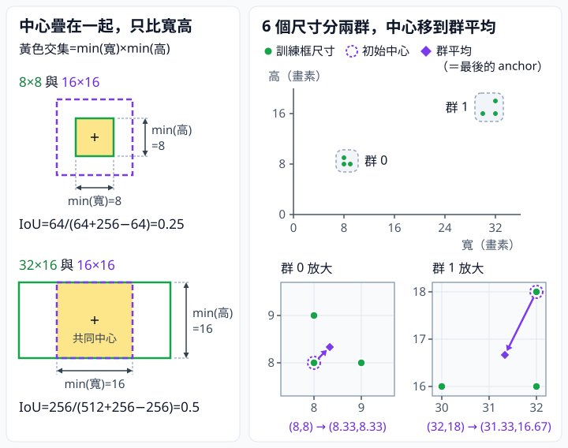

# 9.2 尺寸聚類：先驗由哪一份資料決定

[在 Colab 執行本節](https://colab.research.google.com/github/birdhackor/learn_to_yolo/blob/lessons-v0.4.0/notebooks/09-anchor-clustering.ipynb){ .md-button }

上一節的 anchor 寬高是手填的（標題的「先驗」指的就是 anchor）。本節改從訓練資料找 anchor，用的方法是聚類（clustering，也叫分群）：把相近的資料分成幾群，每群用一個代表值。這裡的資料是訓練框的寬高，每群的代表寬高就當一個 anchor。讀完你能用 1−IoU 當距離手算一次聚類，並用一個數字比較幾組 anchor 和訓練框的形狀有多接近。

前置：[anchor 參數化](09-anchors.md)，也就是上一節的 tw、th（寬高相對 anchor 的修正量）與尺寸 IoU。其餘沿用上一節：每格 A=2 個 anchor 槽（4×4 格共 32 個候選）、相同的中心解碼、模型其餘部分不變；本節只改 anchor 寬高怎麼選。

本節的對照組是兩個 anchor 都填 16×16。這是刻意選的弱基線（baseline，拿來比較的起點）：兩個槽一樣大，在尺寸上等於只有一種形狀。它不是上一節的設定；上一節的 16×16＋8×8 也會一起比。

問題是：若資料多為 8×8 小方形和 32×16 寬矩形，從 16×16 出發，模型要回歸（預測連續數值，這裡指 tw、th）的修正量有多大？由上一節的 tw=ln(物件寬/anchor 寬)（th 同理）可以算出：以 16×16 為起點，32×16 要 tw=ln2≈0.693、th=0，8×8 要 tw=th=ln(1/2)≈−0.693。若改用本節聚類得到的 31.33×16.67 與 8.33×8.33，32×16 只需要約 (tw,th)=(0.021,−0.041)，8×8 只需要約 (−0.041,−0.041)。修正量越接近 0，通常越好學。

歷史來源：[YOLO9000](https://arxiv.org/abs/1612.08242) 論文把這個做法稱為 dimension clusters（尺寸聚類）：用 k-means（最常見的一種聚類方法，下面會手做一次）把訓練框的寬高分成幾群，每群的代表寬高當 anchor，距離用 `1−IoU`（下一小節說明原因）。本節只用 6 個框的小例子示範這個做法。

??? note "本節沒有做的事"

    - 不重現原論文的資料（VOC、COCO）、群數 k=5（k 是要分成幾群，也就是產生幾個 anchor）或結果。
    - 沒有做 k-means 實務上常見的多次隨機初始化：隨機挑幾組不同的起始代表寬高，各跑一次，留下距離總和最小的那次。本節只用 6 個已知寬高、固定的初始值與平均更新，示範一個 k-means 風格的程式。
    - 只比較 anchor 和框的形狀有多接近，不訓練模型，也不測偵測 AP。聚類得到的 anchor 要不要正式採用，得用新、舊 anchor 各訓練一個模型，在沒參與訓練的 held-out 資料上比較 AP 才能決定。

## IoU 在這裡比較什麼

輸入是訓練框經過和模型輸入相同的前處理（例如縮放）之後的寬高，在完整程式裡是形狀 [N,2] 的 `sizes`，單位 pixel。N 是框的數量（本例 6），第 0 欄是寬、第 1 欄是高。這裡只有寬高，沒有位置資訊。

和上一節選 best anchor 時一樣，把兩個框的中心疊在一起，只比寬高。中心對齊時，窄框的左右兩側都落在寬框內，所以交集寬是 \(\min(w_1,w_2)\)；交集高同理是 \(\min(h_1,h_2)\)。兩個面積相加時，交集被算了兩次，要扣掉一次才是聯集：

\[
\mathrm{IoU}=\frac{\min(w_1,w_2)\times\min(h_1,h_2)}{w_1h_1+w_2h_2-\min(w_1,w_2)\times\min(h_1,h_2)}
\]



左圖：兩框的中心疊在一起後，黃色交集的寬取兩框寬的較小者、高取兩框高的較小者，兩例的 IoU 分別是 0.25 與 0.5。右圖對應下一小節〈手做一次聚類〉：橫軸是寬、縱軸是高，6 個尺寸分成兩群，放大圖裡的紫色箭頭是群中心從初始值移到群平均。

IoU 越接近 1，兩個形狀越像，所以聚類用 1−IoU 當兩個尺寸的距離。8×8 與 16×16：交集 64，IoU=64/(64+256−64)=64/256=0.25，距離=0.75。8×8 與 9×8：IoU=64/72≈0.888889，距離≈0.111111。

兩個框的寬和高都乘同一個倍數（例如都乘 10），IoU 不變：交集和兩個面積都變成 100 倍，比值不變。所以 8×8 對 9×8、80×80 對 90×80 的 IoU 都是 0.888889。

普通（歐氏）距離則是把 (寬,高) 當平面上的點，用兩點距離公式計算：\(\sqrt{(9-8)^2+(8-8)^2}=1\)，\(\sqrt{(90-80)^2+(80-80)^2}=10\)。兩組形狀一樣接近，大框的距離卻大 10 倍；聚類時，大框的誤差會主導總和。1−IoU 兩組都是 0.111，大小框一視同仁。YOLO9000 論文也是這樣說的：用歐氏距離做標準 k-means 時，大框產生的誤差比小框多。論文想要的是能讓 IoU 高的 anchor，而 IoU 不受框的整體大小影響（見上面都乘 10 的例子）。

1−IoU 看的是相對尺寸的差異；它只描述形狀是否接近，不含物件顏色、類別與定位能力。

## 手做一次聚類

k-means 先放 k 個群中心（每一群的代表寬高，也就是 anchor 尺寸；它是 (寬,高) 平面上的點，不是圖上的位置），再反覆做兩件事，直到不再改變：

- 歸群：每筆資料歸給距離最近的群中心。
- 更新：每個群中心移到自己那群資料的平均（mean）。

名字裡的 k 是群數，means 指平均。每筆資料被歸到第幾群，叫歸群結果（cluster assignment，和第 5 章訓練用的 assignment 不同）。要產生幾個 anchor 就分幾群。本節只有一種 4×4 格子，每格都用這 k 個 anchor，所以 k 就是每格 anchor 數 A，k=A=2。

6 個 train 尺寸（寬,高）為 `[8,8]、[9,8]、[8,9]、[32,16]、[30,16]、[32,18]`。一般 k-means 的初始群中心常是隨機挑的，每次執行的結果可能不同；本例固定用第一筆與最後一筆，避免每次執行看到不同答案。所以初始 anchor 是 [8,8] 與 [32,18]，下面叫 anchor0、anchor1。

1. 對每個尺寸算到兩個 anchor 的距離 1−IoU，歸到距離小的那一群。第 1 輪的距離：

    | 尺寸 | 到 anchor0 [8,8] | 到 anchor1 [32,18] |
    | --- | --- | --- |
    | 8×8 | 0 | 0.8889 |
    | 9×8 | 0.1111 | 0.8750 |
    | 8×9 | 0.1111 | 0.8750 |
    | 32×16 | 0.8750 | 0.1111 |
    | 30×16 | 0.8667 | 0.1667 |
    | 32×18 | 0.8889 | 0 |

    示範一列：30×16 對 32×18，交集 30×16=480，聯集 480+576−480=576，IoU=480/576≈0.8333，所以距離≈0.1667。

2. 結果：前三個離 anchor0 較近，歸群 0；後三個歸群 1。
3. 更新：群 0 的平均寬高為 `[25/3,25/3]=[8.3333,8.3333]`；群 1 為 `[94/3,50/3]=[31.3333,16.6667]`。它們就是新的 anchor0、anchor1。
4. 用新 anchor 重複第 1～3 步，直到兩個 anchor 的寬高不再變，或到第 10 輪。本例第 2 輪的歸群結果和兩個 anchor 都不變，所以停止。

歸群和上一節選 best anchor 一樣，都是挑尺寸 IoU 最大（也就是距離最小）的 anchor。但歸群是訓練前聚類的一部分：整個聚類只在訓練前做一次，用來統計 anchor 尺寸，產出的 anchor 再交給偵測器。群編號 0、1 不是正／負／ignore 標籤；訓練時哪個候選負責哪個 GT（標註真值），是另一個步驟。

下面是完整程式裡的 `cluster()`，只加了中文註解：

``` { .python data-excerpt="lesson_cases/09-anchor-clustering.py" }
def cluster(sizes, initial, steps=10):
    # sizes：[N,2] 的寬高，本例 N=6；initial：[2,2] 的初始 anchor
    anchors = initial.clone()
    for _ in range(steps):  # 最多 steps=10 輪
        # size_iou 回傳 [N,2]：第 i 列第 j 欄是第 i 個尺寸對第 j 個 anchor 的尺寸 IoU
        # argmin(1)：沿第 1 軸找最小值的位置，也就是每一列距離最小的是第幾欄＝群編號
        assignment = (1-size_iou(sizes,anchors)).argmin(1)  # 歸群結果，形狀 [N]
        updated = anchors.clone()  # 先複製舊值：空群（沒分到資料的群）就保留舊 anchor
        for k in range(len(anchors)):  # 這裡的 k 是群編號 0、1，不是群數
            selected = sizes[assignment==k]  # 用布林 mask 選出第 k 群的尺寸
            if len(selected):  # 這一群有分到資料才更新
                updated[k] = selected.mean(0)  # 沿第 0 軸（樣本）平均，得到 [平均寬,平均高]
        if torch.allclose(updated,anchors):  # 新舊 anchor 幾乎相同：不再變，停止
            return updated,assignment
        anchors = updated
    return anchors,assignment
```

`size_iou` 就是上面的尺寸 IoU 公式，定義在完整程式開頭。`main()` 用 `anchors, groups = cluster(sizes,sizes[[0,-1]])` 呼叫它：`sizes[[0,-1]]` 取出第一筆與最後一筆當初始 anchor；回傳的歸群結果 `assignment`，在 `main()` 裡叫 `groups`。

## 怎麼衡量 anchor 選得好

一組 anchor 好不好，要看每個訓練框能不能找到一個形狀很像的 anchor。本節用**平均最佳尺寸 IoU**（mean best size IoU）衡量：

1. 每個框對每個 anchor 算尺寸 IoU，取最大的那個，也就是這個框和最像的 anchor 有多像。
2. 把所有框的這個最大值平均。

結果在 0 到 1 之間，越接近 1，表示每個框都有一個很像的 anchor。它只看形狀。程式輸出裡的 `mean best size IoU` 和 `coverage`（覆蓋）都是指它；本頁之後一律叫它平均最佳尺寸 IoU。

用弱基線算一次。兩個 anchor 都是 16×16，所以每個框的最大值就是它對 16×16 的尺寸 IoU。小框整個落在 16×16 裡，分母（聯集）是 256；大框把 16×16 整個包住，分母就是大框的面積：

- 8×8：64/256=0.25
- 9×8、8×9：各 72/256=0.28125
- 32×16：256/512=0.5
- 30×16：256/480≈0.5333
- 32×18：256/576≈0.4444

六個值的和約 2.2903，平均約 0.3817。上一節的 16×16＋8×8 照同樣算法：前三個小框改配 8×8，最大值變成 1、0.8889、0.8889，後三個不變，平均約 0.7093。

## 執行結果與比較

可以用頁首的「在 Colab 執行本節」按鈕執行，或在 repo 根目錄執行 `PYTHONPATH=. python lesson_cases/09-anchor-clustering.py`。輸出的 `groups` 應為 `[0,0,0,1,1,1]`，anchor 為上面算出的 [25/3,25/3] 與 [94/3,50/3]（程式印成小數）。完整程式印出結果前，會先用斷言（assert）核對這兩項，也核對聚類 anchor 的平均最佳尺寸 IoU 高於兩個 16×16。

完整程式另外試了逐維中位數（median）：沿用上面同一組歸群，每群的寬、高各自排序後取中間值。例如群 0 的寬 [8,9,8] 排成 [8,8,9]，取 8。兩群得到 [8,8] 與 [32,16]。

下表的四個平均最佳尺寸 IoU 都是程式印出的：前兩列是輸出第 2 行箭頭前後的兩個數，後兩列分別在第 3、4 行（0.9340 印成 0.934）。

| anchor 來源 | anchor 寬高 | 拿來評估的框 | 平均最佳尺寸 IoU |
| --- | --- | --- | --- |
| 弱基線 | [16,16]、[16,16] | 六個 train 框 | 0.3817 |
| 聚類＋平均 | [25/3,25/3]、[94/3,50/3] | 六個 train 框 | 0.9119 |
| 同一組歸群，改取逐維中位數 | [8,8]、[32,16] | 六個 train 框 | 0.9340 |
| 聚類＋平均 | [25/3,25/3]、[94/3,50/3] | 新來源 [4,40]、[40,4] | 0.1975 |

上一節手填的 16×16＋8×8，前面手算過平均最佳尺寸 IoU 約 0.7093，介於弱基線與聚類＋平均之間：它的 8×8 照顧到三個小框，三個寬矩形卻仍只能配 16×16，最佳尺寸 IoU 只有約 0.44～0.53。

這些都是尺寸統計，只說明 anchor 和框的形狀有多像，不是偵測 AP，也不表示 AP 會提升。

表中最後一列的新來源是兩個 1:10 的細長框，模擬換了資料來源後出現的新形狀。它們對兩個聚類 anchor 的最佳尺寸 IoU 只有約 0.170 與 0.225，平均 0.1975。像這樣和訓練框形狀差很多的新形狀，聚類 anchor 多半照顧不到。

完整程式最後還把六個尺寸和 anchor 同時乘 2，用斷言確認尺寸 IoU 不變，也就是上面說的縮放不變。

## 平均更新不保證最好

表中逐維中位數的 0.9340 比平均的 0.9119 高。為什麼取平均不一定最好？先說聚類想讓什麼變小。本節的目標（目標函數：希望越小越好的總量）是每個框到所屬群中心的 1−IoU 加總。

標準 k-means 用平方距離（兩點距離的平方）。這時群中心取平均，正好讓群內的平方和最小，理由如下。一個框到群中心的平方距離，是寬相差的平方加上高相差的平方；群中心的寬只出現在前一項、高只出現在後一項，所以寬和高可以分開求最小。以寬為例：設群內 n 個框的寬是 \(x_1,\dots,x_n\)、群中心的寬是 \(c\)，平方和展開成 \(\sum_i (x_i-c)^2=nc^2-2c\sum_i x_i+\sum_i x_i^2\)。這是 \(c\) 的二次函數，開口向上，頂點在 \(c=\frac{1}{n}\sum_i x_i\)，正好是這些寬的平均，所以平方和在這裡最小；高也一樣。

因此，更新那一步（群中心移到平均）不會讓總和變大；歸群那一步讓每筆找最近的群中心，也不會讓總和變大。所以標準 k-means 每輪的目標不增。

換成 1−IoU 就沒有這個保證：取平均不一定讓固定歸群內的距離總和最小，也不保證每輪目標下降。所以本例的平均更新只是容易手算的啟發式（heuristic：實用、通常有效，但不保證得到最佳解的做法）。逐維中位數也一樣，不能宣稱是這個目標的一般最佳解；完整程式在檢查「中位數較高」的斷言旁也註明，這只對這組資料成立，不是一般定理。

??? note "本例的數字與一個反例"

    歸群固定為前三個一群、後三個一群時，把六個框到自己群中心的 1−IoU 加起來：

    - 用平均 [25/3,25/3]、[94/3,50/3]：約 0.529，也就是 6×(1−0.9119)。
    - 用逐維中位數 [8,8]、[32,16]：約 0.396，也就是 6×(1−0.9340)。

    本例每個框的最佳 anchor 剛好就是自己那群的 anchor，所以總距離等於 6×(1−平均最佳尺寸 IoU)。

    平均更新甚至可能讓目標變大。看一個只有兩筆資料、只分一群（k=1）的例子：資料 [1,10]、[10,1]，初始群中心 [1,10]。[1,10] 和群中心相同，距離 0；[10,1] 對 [1,10] 的交集是 1×1=1，聯集是 10+10−1=19。這時總距離是 0＋(1−1/19)≈0.9474。取平均更新成 [5.5,5.5] 後，[1,10] 對它的交集是 1×5.5=5.5，聯集是 10+30.25−5.5=34.75。[10,1] 只是寬高對調，對正方形的 [5.5,5.5] 結果相同。所以兩筆對新群中心的 IoU 都是 5.5/34.75≈0.1583，總距離變成 2×(1−0.1583)≈1.6835，反而變大。

    這兩個例子只說明取平均沒有保證，不表示中位數比較好。

真實使用時，還要比較不同的初始值（例如開頭摺疊區〈本節沒有做的事〉提到的多次隨機初始化）、空群怎麼處理，以及 k 選多少。空群是某個群中心一筆資料都沒分到；本例讓它保留舊 anchor，不憑空生成一個先驗。k 越大，框通常越容易找到像的 anchor，但候選也越多，見下面〈收益與代價〉。

## 只用 train 聚類的理由

標題問先驗由哪一份資料決定，答案是只用 train。若用 validation 或 test 的框一起選先驗，等於挑設定時已經偷看了評估資料的分佈，之後的評估就不再獨立。正確順序是：先固定來源切分，再把 train 框按實際的 resize／letterbox 轉到模型輸入的 pixel，最後才收集寬高。來源切分見第 8 章〈[用自己的資料](08-own-data.md)〉：同一個來源的圖整批放在 train、validation 或 test 其中一組。

anchor 不屬於任何類別。若各類別的尺寸差很多，可以把每一類的框分開算平均最佳尺寸 IoU，看哪一類沒被照顧到；但不要因此把某個 anchor 綁給某一類：每個 anchor 槽仍要輸出全部 C 類的分數（上一節最後一軸 5+C 裡的 C）。

## 收益與代價

收益：anchor 更貼近訓練框的形狀，tw、th 的修正量變小，較少需要大幅的 exp 修正。本例六筆配聚類 anchor 時，|tw|、|th| 最大約 0.077；以 16×16 為起點時最大約 0.693。

代價：

- 要另寫統計程式；換資料或輸入尺寸就要重算，anchor 數值也要和其他設定一起保存。
- 本節群數 k 就是每格 anchor 數 A（見〈手做一次聚類〉）。k 從 2 增為 3，候選數由 4×4×2=32 變成 4×4×3=48，GT 配對與後處理都要多算。
- 遇到新的攝影距離、極端長寬比或不同輸入尺寸，聚類出的 anchor 可能不合，例如上面新來源只有 0.1975。
- 平均最佳尺寸 IoU 高，也不保證小物件有足夠的特徵：就算 anchor 形狀完全吻合，4×4 特徵圖的每格仍對應 16×16 pixel 的區域，8×8 小物件的局部訊號容易被壓縮。第 10 章會加一個較細、8×8 格的預測 head（stride 8），不是放大輸入圖片。

## 練習與常見錯誤

常見錯誤：

- **拿 xyxy 四個座標直接聚類**：xyxy 含位置。[0,0,16,16] 與 [40,40,56,56] 都是 16×16，卻可能因為位置不同被分到不同群；anchor 只管寬高，應先把 xyxy 換成寬高（wh：寬、高兩個數）再聚類。
- **收集原圖 pixel，卻用在 64×64 輸入**：兩者尺度不同。例如原圖 128×128 縮成 64×64 時，32×16 的框只剩 16×8；用原圖統計的 anchor 會大兩倍。
- **把 held-out 標註當免費資訊**：held-out 的標註一旦拿來選 anchor，就不再是獨立的評估資料。
- **把平均最佳尺寸 IoU 稱為 mAP**：它只看形狀；mAP 要看預測框與分數。

自主練習（手算即可，不必改程式；先自己想，再展開答案）：

1. 中位數 anchor 在這六筆的平均最佳尺寸 IoU 較高（0.9340 對 0.9119）。這足以選它，或宣稱 AP 改善嗎？
2. 把整張圖等比放大成 128×128（物件在 pixel 上也變 2 倍），anchor 要怎麼改？如果不改，32×16 的物件會怎樣？

??? note "參考答案"

    **第 1 題**：都不足。0.9340 只表示這六個訓練框的形狀更像 anchor。要知道 AP 有沒有改善，得用兩組 anchor 各訓練一個模型，再在同一份固定、沒參與訓練的資料上評估並比較 AP；不能讓 train 的尺寸統計代替泛化。

    **第 2 題**：anchor 的寬高也一起乘 2，尺寸 IoU 就保持一致（物件和 anchor 的寬高同乘一個倍數，IoU 不變；完整程式最後一個斷言檢查的就是這件事）。若只放大影像、不改 anchor，尺寸回歸的起點就不同了：32×16 物件變成 64×32，對 [31.33,16.67] 的尺寸 IoU 從約 0.941 掉到 0.255，tw、th 從約 (0.021,−0.041) 變成 (0.714,0.652)。anchor 乘 2 成 [62.67,33.33] 後，又回到約 0.941 與 (0.021,−0.041)。

<!-- curriculum-evidence:start -->

## 實際執行紀錄

本節的完整程式已於 2026-10-02 用 PyTorch 2.9.1+cpu 在 CPU 上執行過，程式裡的 assert 檢查全部通過。下面是那次印出的原始輸出；每個數字的意思，以本頁正文的說明為準。[完整紀錄（JSON）](https://github.com/birdhackor/learn_to_yolo/blob/main/artifacts/checks/curriculum/09-anchor-clustering.json)

??? example "展開本次實際輸出"

    ```text
    groups [0, 0, 0, 1, 1, 1] anchors pixel [[8.333333015441895, 8.333333015441895], [31.33333396911621, 16.66666603088379]]
    train mean best size IoU 0.3817 -> 0.9119
    median anchors [[8.0, 8.0], [32.0, 16.0]] train coverage 0.934
    new-source shape coverage 0.1975 not detector AP
    ```

<!-- curriculum-evidence:end -->
