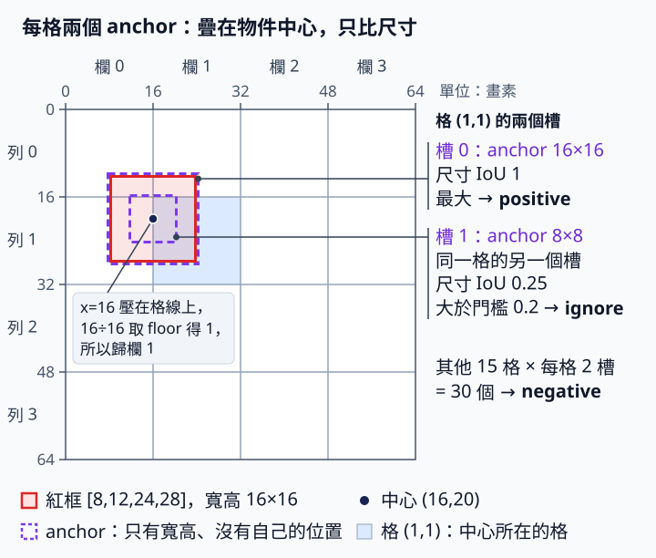

# 9.1 YOLOv2 機制：anchor 是尺寸起點

[在 Colab 執行本節](https://colab.research.google.com/github/birdhackor/learn_to_yolo/blob/lessons-v0.4.0/notebooks/09-anchors.ipynb){ .md-button }

本節把第 7 章的寬高寫法換成 YOLOv2 的 anchor 寫法（簡化版），每格也從一個槽變成兩個槽。槽（slot）是第 5 章介紹過的概念，指一個可以輸出框的位置。讀完你能手算一個框在新寫法下的四個數 tx、ty、tw、th，也能說出全部 32 個槽（4×4 格，每格 2 個）中，哪個負責學物件、哪個不算 loss、哪些學背景。

前置：第 7 章的 [grid targets](07-targets.md)（標註框怎麼變成每格的訓練目標）與 [loss](07-loss.md)（三項 loss 怎麼算）。

第 7 章讓每格直接回歸 normalized 寬高。回歸（regression）是讓模型輸出連續的數值去逼近目標，和高中統計「迴歸直線」的迴歸是同一個英文詞。normalized 寬高是寬、高各除以整張圖邊長 64 的比例，例如紅框寬 16/64=0.25。

可是真實資料裡，物件的形狀常集中在幾種，例如車多半寬扁、行人多半瘦高。本節要問：如果先備好幾個常見寬高當起點，模型只回歸修正量，由它決定起點要放大或縮小幾倍，會不會比較合適？這些事先給定、訓練中不更新的參考寬高叫 anchor（錨框），YOLOv2 論文稱為先驗（prior）。anchor 只管尺寸，沒有綁定某一類。

歷史機制：[YOLO9000: Better, Faster, Stronger](https://arxiv.org/abs/1612.08242) 這篇論文提出改良版偵測器 YOLOv2，以及能偵測 9000 多類物件的延伸版 YOLO9000。和本節有關的是 YOLOv2 引入的三項設計：尺寸聚類（把訓練框的寬高分成幾群，用每群的代表尺寸當 anchor；下一節詳講）、anchor 框，以及限制中心在格內的框參數化。參數化是指決定用哪幾個數字、什麼公式來描述一個框。

本節簡化：64×64 圖、4×4 格，每格兩個以 pixel 為單位的 anchor `[16,16]`、`[8,8]`（寬, 高）。只用一個人工物件學習責任分配與 offset（中心在格內的偏移），不重現 Darknet-19（YOLOv2 論文用的主幹網路，有 19 個卷積層；本節用不到）或完整 YOLOv2 訓練。

本節的設計只改兩件事：寬高怎麼表示，以及每格有幾個槽、由哪個槽負責。第 10 章的多尺度（用不同解析度的格子分別預測大小物件）先不加。另外，本節程式把中心、寬高、objectness、類別四項 loss 直接相加，沒有沿用第 7 章框 loss 乘 5 的權重；這不影響本頁的任何數字，但也是和第 7 章不同的地方。anchor 是否真能讓偵測變好，本節沒有證據；要用同一份資料、相同設定（包括 loss 權重）各訓練一次再比較才知道。

## 同一個紅框，換成 anchor 寫法是哪幾個數字

這裡說的「數字」不是模型權重，而是描述一個框的四個數 tx、ty、tw、th，也就是上面說的框參數化。先看這四個數怎麼還原成框（decode）：

\[
c_x=(g_x+\sigma(t_x))\times16,\qquad c_y=(g_y+\sigma(t_y))\times16,
\]

\[
w=a_w\times e^{t_w},\qquad h=a_h\times e^{t_h}.
\]

\(c_x\)、\(c_y\) 是框中心，w、h 是寬高，單位都是 pixel。σ 是 sigmoid（不是統計的標準差）。\(g_x\)、\(g_y\) 是這個槽所在格的整數格座標（第幾欄、第幾列，從 0 起算）；下面紅框的例子裡，這一格就是負責格 (1,1)。\(a_w\)、\(a_h\) 是這個槽的 anchor 寬、高。16=64/4，是每格的 pixel 寬，也就是 stride（相鄰兩格在圖上相隔的 pixel 數）。這是特徵圖的 stride，就是第 1 章算感受野時說的「間距」；它和第 1 章介紹卷積、pooling 時「視窗每次移動幾格」的 stride 意思不同，兩種意思並列在[術語快速查](../glossary.md)的 stride 條目（①②）。\(e^{t_w}\) 也寫成 exp(tw)；完整程式用 `.exp()` 計算。

中心公式和第 7 章相同；本節改的是寬高表示與每格的槽數。

本節的 log（例如程式裡的 `torch.log`、輸出的 log wh）都是自然對數 ln：以 e≈2.718 為底，不是高中課本不寫底數時的以 10 為底。exp(t)=\(e^t\) 是 ln 的反函數，例如 ln2≈0.693，所以 \(e^{0.693}\approx2\)。

為什麼寬高要用 exp？模型輸出的 tw 可以是任何實數，但寬一定要是正數。\(e^{t_w}\) 永遠大於 0，所以寬高不會算成負的。tw=0 時 \(e^0=1\)，框剛好等於 anchor，這就是「起點」的意思。tw=ln2≈0.693 時倍率是 2：預測寬 = anchor 寬 16 × 2 = 32，anchor 本身仍是 16。tw=−ln2 時倍率是 0.5，預測寬縮成 8。倍率一定為正，但修正值 tw 可正可負；放大 2 倍和縮小一半的 tw 大小相同，只差正負號。

接著用紅框 `[8,12,24,28]`（xyxy，單位 pixel）一步一步算出它的 target，順序和完整程式相同：

1. **中心與寬高**：中心 ((8+24)/2, (12+28)/2) = (16,20)，寬高 (24−8, 28−12) = (16,16)。
2. **負責格**：中心除以格寬 16 得 (1, 1.25)，取 floor（向下取整）得 gx=1、gy=1，和第 7 章是同一格。gx、gy 是整數格座標。
3. **格內比例**：ox = cx/16 − gx = 16/16 − 1 = 0，oy = cy/16 − gy = 20/16 − 1 = 0.25。decode 時要讓 σ(tx)=ox、σ(ty)=oy。注意 tx、ty 是模型的原始 logits，不是格內比例，所以本節另用 ox、oy 表示比例。若誤把比例 0 當成 tx=0，sigmoid(0)=0.5，中心 x 就會解成 (1+0.5)×16=24，而不是 16。
4. **選 anchor**：本節的 anchor 只有寬高、沒有自己的位置（框的中心由格子與 tx、ty 決定），所以把物件和 anchor 的中心疊在一起，只比寬高。這樣算的 IoU 叫尺寸 IoU。中心重合時，交集 = min(w₁,w₂) × min(h₁,h₂)，尺寸 IoU = 交集 ÷ (w₁h₁ + w₂h₂ − 交集)。紅框 16×16 對 `[16,16]` 是 1；對 `[8,8]` 是 64/(256+64−64) = 0.25，所以尺寸 IoU 是 [1, 0.25]。尺寸 IoU 最大的 anchor 叫 best anchor，這裡是第 0 個，所以 best=0，選 `[16,16]`。

    

    圖中兩個紫色虛線框是格 (1,1) 兩個槽的 anchor，比尺寸時中心都疊在紅框中心 (16,20)：16×16 和紅框重合，尺寸 IoU 1 最大，所以是 positive；8×8 是同一格的另一個槽，尺寸 IoU 0.25 大於 0.2，所以是 ignore。這兩種狀態的規則見下方〈一格兩槽，不等於兩種類別〉。

5. **tw、th**：把 \(w=a_w\times e^{t_w}\) 兩邊除以 \(a_w\)，得 \(e^{t_w}=w/a_w\)；再取 ln，得 \(t_w=\ln(w/a_w)\)。th 同理。選 `[16,16]` 時，tw = ln(16/16) = 0、th = ln(16/16) = 0；若選 `[8,8]`，則是 ln(16/8) = ln2 ≈ 0.693147。都是同一個物件，只是起點不同。
6. **encode 再 decode，驗算回原框**：encode 是 decode 的反方向，由真值框算出模型該輸出的數。寬高的 encode 就是第 5 步的 ln。中心要從 σ(tx)=ox 反解出 tx，用的是 sigmoid 的反函數 logit(p)=ln(p/(1−p))。logit 這個函數把比例 p 換回對應的原始分數，所以這樣算出的 tx、ty，就是模型該輸出的 logits。

    p 越接近 0，logit(p) 越往負無限大跑；p=0 時 ln 0 沒有定義，得不到有限的 tx。所以程式先用 clamp（把數夾在 [下限, 上限] 之間：小於下限取下限，大於上限取上限）把 0 換成 0.0001，寫成 `tx=logit(clamp(ox,1e-4,1-1e-4))`，y 同理。結果 tx = ln(0.0001/0.9999) ≈ −9.21024，ty = ln(0.25/0.75) = ln(1/3) ≈ −1.09861。

    再 decode 回去：cx = (1+0.0001)×16 = 16.0016，所以 x1 = 16.0016 − 8 = 8.0016；四個座標還原成 [8.0016, 12, 24.0016, 28]。有限的 logit 無法得到精確的比例 0，本例用 0.0001 近似，還原誤差約 0.0016 pixel。

程式用 logit 做 encode，只是為了驗證 encode 再 decode 能回到原框；訓練時用不到 logit 這個函數。訓練時，中心 loss 直接比較 sigmoid(raw tx, ty) 和比例 target (0, 0.25)，這裡的 raw 指模型的原始輸出。寬高則不經 sigmoid：loss 直接拿 raw tw、th 和 target \(\ln(w/a_w)\)、\(\ln(h/a_h)\)（本例都是 0）做 MSE（均方誤差）。這點和第 7 章不同：第 7 章的 tw、th 要先經 sigmoid，才和 0.25 這種比例 target 比較。框 loss 和類別 loss 都只算負責的那個槽，也就是下面說的 positive 槽。

??? note "如果 anchor 改用「格」當單位"

    本節的 anchor 和解碼出的寬高都以 pixel 為單位，所以「寬 ÷ anchor 寬」這個比值沒有單位。若改用 feature-map 單位，也就是以「格」為單位，1 格 = stride = 16 pixel：16 pixel 的 anchor 寫成 1，8 pixel 寫成 0.5，decode 時再乘 stride 換回 pixel。這時 anchor 必須一併除以 stride=16；不能用 pixel 的 anchor 再多乘一次 stride。例如 decode 寫成 w = anchor × exp(tw) × 16，anchor 卻誤填 pixel 的 16，tw=0 時寬會變成 16×1×16 = 256 pixel，比整張 64 pixel 的圖還大。

## 一格兩槽，不等於兩種類別

輸出的形狀是 `[B,4,4,A,5+C]`，本例 A=2、C=2。A 是每格的槽數，等於 anchor 數；C 是類別數，B 是圖片數。每格的槽 0 固定用 `[16,16]` 解碼，槽 1 固定用 `[8,8]` 解碼。五個軸依序是 [圖片, 格列 y, 格欄 x, 槽, 7 個數]。7 個數就是 5+C：4 個框數、1 個 obj（objectness logit：這個槽有沒有負責的物件）、C=2 個類別 logits，依序是 tx、ty、tw、th、obj、class0、class1。

每個槽的 7 個數裡，最後兩個就是類別 logits，所以兩個槽都可以預測紅類或藍類：槽和類別互不綁定。候選數從 16 格增加到 4×4×2=32 個槽；類別數改成 3 時，候選數仍是 32，只是最後一軸由 7 變 8。

推論時沒有真值可以用來選 anchor。這時 32 個槽都用自己的 anchor 解碼成候選框，再像第 7 章一樣過 score 門檻（拿每個候選自己的分數去比）與 NMS。本節程式不含推論。

訓練時才用真值決定哪個槽負責。本節採用的責任規則：

- **positive**：第 4 步選出的 best anchor 對應的槽，負責學這個物件。本例是格 (1,1) 的槽 0。
- **ignore**：同一格的其他槽，若和物件的尺寸 IoU 大於 0.2，就什麼 loss 都不算。本例格 (1,1) 的槽 1（8×8，尺寸 IoU 0.25）就是 ignore。
- **negative**：其餘的槽，只學「這裡沒有物件」。

為什麼要 ignore？8×8 槽和物件在同一格，尺寸也有幾分像（尺寸 IoU 0.25）。把它當 negative，等於要它的 objectness 學「這裡沒有物件」，但這一格明明有物件。本節選擇讓它不計任何 loss。0.2 是本節為了示範三種狀態設的教學值。這條 ignore 規則是本節自訂的，和原版不同：YOLOv2 論文沒有說明 ignore 規則。官方 Darknet 程式（[region_layer.c](https://github.com/pjreddie/darknet/blob/f6afaabcdf85f77e7aff2ec55c020c0e297c77f9/src/region_layer.c#L236-L306)）把每個槽解碼後的預測框（含位置）和圖中每個 GT 算一般的 IoU；最大值超過 0.6（[yolov2-voc.cfg](https://github.com/pjreddie/darknet/blob/f6afaabcdf85f77e7aff2ec55c020c0e297c77f9/cfg/yolov2-voc.cfg#L257) 的 thresh）的槽不算 objectness loss，範圍不限同一格，比的也不是 anchor 尺寸。唯一的例外是負責學某個 GT 的槽（相當於本節的 positive）：不論 IoU 多大，它都照常計算 objectness loss。本節的規則也不代表原版其他訓練細節。

因此本例有 1 個 positive、1 個 ignore、30 個 negative。各自算哪些 loss：

| 狀態 | 本例的槽 | 個數 | objectness loss | 框 loss | 類別 loss |
| --- | --- | --- | --- | --- | --- |
| positive | 格 (1,1) 的槽 0 | 1 | 算，目標 1 | 算 | 算 |
| ignore | 格 (1,1) 的槽 1 | 1 | 不算 | 不算 | 不算 |
| negative | 其他 15 格 × 每格 2 槽 | 30 | 算，目標 0 | 不算 | 不算 |

ignore 不參與 objectness loss，所以 objectness BCE 是對 31 個槽（1 positive + 30 negative）取平均，不是第 7 章單張圖的 16 格。

??? note "手算：零 logit 時的 objectness 梯度"

    本節程式的 raw 初值全為 0，所以每個 obj logit 都是 0，sigmoid(0)=0.5。BCE 對 obj logit 的梯度是 (sigmoid(logit) − 目標) ÷ 參與平均的槽數，本例分母是 31：

    - positive 槽：(0.5 − 1)/31 ≈ −0.0161
    - negative 槽：(0.5 − 0)/31 ≈ +0.0161
    - ignore 槽：0，因為它不在平均裡

    第 7 章單張圖的分母是 16 格，所以是 ±0.03125。

    上面三種槽的 obj 梯度都是手算的，完整程式不會印出；它的斷言（assert）只核對其中 ignore 槽的 0。想親眼看到 ±0.0161，可以在完整程式 `loss.backward()` 的下一行加上這一行，縮排和 `loss.backward()` 對齊：

    ```python
    print(raw.grad[0,1,1,:,4].tolist(), raw.grad[0,0,0,:,4].tolist())
    ```

    `raw.grad` 是 backward 存在 raw 上的梯度，形狀和 raw 一樣是 [1,4,4,2,7]。`[0,1,1,:,4]` 依序取第 0 張圖、格列 y=1、格欄 x=1、兩個槽全取（`:`），最後的 4 是 7 個數裡的編號（從 0 起編：0 到 3 是 tx、ty、tw、th，4 是 obj）。所以它是格 (1,1) 兩個槽的 obj 梯度，約為 [−0.0161, 0]：槽 0 是 positive，槽 1 是 ignore。`[0,0,0,:,4]` 是格 (0,0) 兩個 negative 槽的 obj 梯度，約為 [0.0161, 0.0161]。加上的這一行會最先印出，排在完整程式本身的四行輸出之前。

下面是依完整程式改寫的簡化版，只列選 anchor、寬高 loss 與 objectness loss；中心 loss 和類別 loss 沒有列出。有幾個變數名稱和完整程式不同，對應關係寫在註解裡。

```python
# gt_wh 是紅框的寬高 [16,16]，在完整程式裡叫 wh；形狀 [2]
# gt_wh[None]：在最前面加一個軸，形狀變成 [1,2]
# size_iou 回傳形狀 [1,2] 的尺寸 IoU（本例 [[1,.25]]），argmax 取最大者的編號（本例 0，即 16×16）
best = size_iou(gt_wh[None], anchors).argmax()
# tw、th 的 target，本例 [0,0]；完整程式沒有 target_log_wh 這個名字，直接寫 torch.log(wh/anchors[best])
target_log_wh = torch.log(gt_wh / anchors[best])
# pos：形狀 [1,4,4,2] 的布林 mask，只有 positive 槽是 True
# raw[pos][:,2:4] 取出 positive 槽的 tw、th；不經 sigmoid，直接和 target 做 MSE
# 完整程式沒有 wh_loss：這一項和中心 loss 相加，叫 regression
wh_loss = F.mse_loss(raw[pos][:,2:4], target_log_wh[None])
# ~ 是布林取反：ignore 以外的 31 個槽才算 objectness
valid = ~ignore
# raw[...,4]：每格每槽的 obj logit，形狀 [1,4,4,2]；obj_target 在 positive 槽為 1、其餘為 0
# obj_loss 在完整程式裡叫 objectness
obj_loss = F.binary_cross_entropy_with_logits(raw[...,4][valid], obj_target[valid])
```

可以用頁首的「在 Colab 執行本節」按鈕執行，或在 repo 根目錄執行 `PYTHONPATH=. python lesson_cases/09-anchors.py`。

本節程式沒有 CNN，也沒有輸入圖片。它直接建立一個形狀 [1,4,4,2,7]、全為 0 的 tensor raw，假裝它是模型輸出，並用 `torch.nn.Parameter` 包起來，讓 optimizer 直接更新這 224 個數字。anchor `[16,16]`、`[8,8]` 是固定常數，不會被訓練。

應看到四行輸出，裡面的數都在上面算過：第 1 行是尺寸 IoU `[1.0, 0.25]`、best anchor `0` 與 log wh `[0.0, 0.0]`；第 2 行是格內比例 `[0.0, 0.25]` 與 encode 出的兩個 logits（約 −9.21024、−1.09861）；第 3 行是 positive／ignore／negative 的槽數 `1 1 30`；第 4 行是 decode 回來的框，約 [8.0016, 12, 24.0016, 28]。

第 4 行最後的 `one slot update completed` 是直接寫在 print 裡的字樣，不是計算結果；印到這裡時，raw 已做完一次 SGD 更新。這次更新改變的不只一個槽：positive 槽的 tx、ty、obj 與兩個類別 logits，以及 30 個 negative 槽的 obj 都會變。ignore 槽不參與任何 loss，所以不變；positive 槽的 tw、th 一開始就等於 target 0，梯度是 0，這一步也不變。

印出這些結果之前，完整程式會先用斷言（assert：條件不成立就報錯停下，用來自動核對答案）核對七項，全部通過才會印出。其中三項核對手算的數：尺寸 IoU 是 [1, 0.25]；兩個 logits 約是 −9.21024 與 −1.09861；這兩個 logits 經 sigmoid 後是 0.0001 與 0.25，也就是 clamp 後的格內比例。另外四項是：

1. encode 再 decode 回到 [8,12,24,28]，誤差在 0.02 pixel 以內。
2. ignore 槽的 7 個輸出梯度全為 0，因為它不參與任何 loss。
3. 非 positive 槽的 tx、ty、tw、th 梯度全為 0，因為只有負責的槽學框。
4. 做一次 SGD 更新後，raw 的數值確實改變。

這些檢查都通過，只表示框的編碼、mask 與梯度在這個例子裡接對了；不代表已做出會看圖的 anchor 偵測器，也沒有 AP（平均精確率）可報告。

## 收益與代價

好的先驗讓尺寸修正量更接近 0。tw=0 時 exp(0)=1，框就等於 anchor；anchor 越接近真實尺寸，要學的修正量越小（本例選 16×16 時 target tw=0，選 8×8 就要學到 ln2≈0.693），通常比較好學。資料形狀越集中，越容易挑到這樣的 anchor，所以這種做法適合形狀集中的資料。本節程式的 raw 初值全為 0，起點正好就是 anchor 尺寸。

多槽也增加每格容量。例如同一格有 16×16 與 8×8 兩個物件（本節程式只處理一個物件，這是概念上的例子）：照尺寸 IoU，前者選槽 0、後者選槽 1，兩個物件各由一個槽負責；第 7 章每格只有一個槽，同一格遇到第二個物件就會拋 ValueError。但若兩個物件都是 16×16，都會選槽 0，仍然衝突。anchor 不保證任何兩個物件都能分開。

代價是 anchor 的個數與尺寸、責任分配（assignment）規則和 ignore 規則都要自己設定。候選數增加，也提高後處理（模型輸出之後的 decode、score 門檻、NMS 等步驟）的成本。exp 也增長得很快：tw=5 時 e⁵≈148，16 pixel 的 anchor 會變成約 2375 pixel，遠超過 64 pixel 的圖。訓練時要記錄 tw、th 的範圍，並檢查 loss 和輸出是否仍是有限值（不是 inf 無限大，也不是 NaN 這種算不出來的無效值）。

常見錯誤：

- **把槽 0（anchor 0）固定為紅類**：槽和類別互不綁定；每個槽都有自己的一份類別 logits，都要能預測任何類別。
- **該只比尺寸的地方用了位置 IoU**：選 best anchor 和下一節的尺寸聚類，都該把兩框中心疊在一起、只比寬高；若改用會受兩框位置影響的一般 IoU 就錯了。本節的 anchor 只存寬高、沒有自己的位置，混入位置會讓中心偏移影響選哪個槽。
- **在 exp 前多套 sigmoid**：exp(sigmoid(tw)) 只能落在 1 到 e≈2.718 之間，框永遠不會比 anchor 小，也放大不超過約 2.7 倍。例如 8×8 物件配 16×16 anchor 需要 0.5 倍，就學不到。
- **先驗單位不一致**：例如 anchor 存的是 pixel 值，decode 卻當成「格」單位再乘一次 stride。數字例見上方摺疊區〈如果 anchor 改用「格」當單位〉。

自主練習（手算即可，不必改程式；先自己算，再展開答案）：

1. 一個寬 32、高 16 的物件，配 16×16 anchor 時，target 的 tw、th 是多少？若改配 8×8 anchor 呢？
2. 假設它是圖中唯一的物件。它對兩個 anchor 的尺寸 IoU 各是多少？哪個槽是 positive？有沒有 ignore？positive／ignore／negative 各幾個？

??? note "參考答案"

    **第 1 題**：配 16×16 時，tw = ln(32/16) = ln2、th = ln(16/16) = 0，也就是 `[ln2,0]`。若換 8×8 anchor，則 tw = ln(32/8) = ln4、th = ln(16/8) = ln2，也就是 `[ln4,ln2]`。

    **第 2 題**：對 16×16，交集 = min(32,16) × min(16,16) = 256，尺寸 IoU = 256/(512+256−256) = 0.5。對 8×8，交集 = 8×8 = 64，尺寸 IoU = 64/(512+64−64) = 0.125。所以 best=0，槽 0（16×16）是 positive。槽 1 的 0.125 沒有大於 0.2，不設 ignore，是 negative。計數是 1／0／31：同格的槽 1 加上其他 15 格 × 每格 2 槽，共 31 個 negative。

下一節只改 anchor 尺寸的選法：用尺寸聚類，從訓練資料的框尺寸找出 anchor。

<!-- curriculum-evidence:start -->

## 實際執行紀錄

本節的完整程式於 2026-10-05 在 INTEL(R) XEON(R) PLATINUM 8573C（2 個執行緒）上用 PyTorch 2.9.1+cpu 執行，程式裡的 assert 全部通過。下面是那次印出的原始輸出；輸出裡若有計時或訓練得到的數字，換一台電腦會略有不同。每個數字的意思，以本頁正文的說明為準。[完整紀錄（JSON）](https://github.com/birdhackor/learn_to_yolo/blob/main/artifacts/checks/curriculum/09-anchors.json)

??? example "展開本次實際輸出"

    ```text
    size IoU [1.0, 0.25] best anchor 0 log wh [0.0, 0.0]
    ratio offsets [0.0, 0.25] encoded logits [-9.210240364074707, -1.0986123085021973]
    positive/ignore/negative 1 1 30
    decoded [8.00160026550293, 12.0, 24.00160026550293, 28.0] one slot update completed
    ```

<!-- curriculum-evidence:end -->
