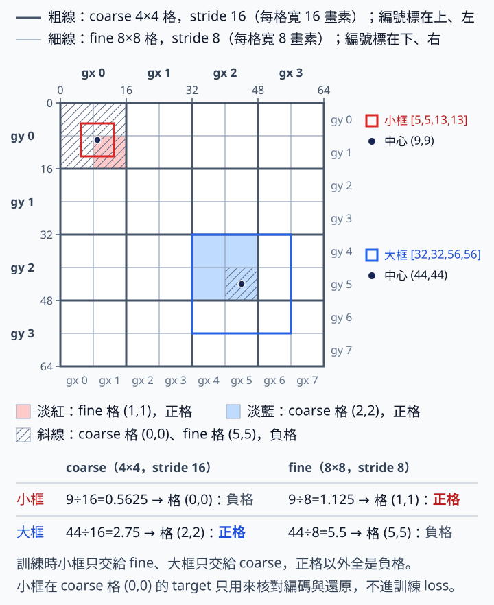
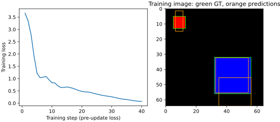

# 10 YOLOv3 機制：同一個 pixel 框看兩種尺度

[在 Colab 執行本節](https://colab.research.google.com/github/birdhackor/learn_to_yolo/blob/lessons-v0.4.1/notebooks/10-multiscale.ipynb){ .md-button }

只用 4×4 的格子預測時，8×8 pixel 的小物件容易被背景淹沒。本節試著多加一個較細、8×8 格的預測 head。讀完你能算出同一個框在兩種格子下的 target，說出兩個 head 各學什麼，也知道推論時怎麼合併兩個 head 的框、去掉重複。

前置：第 7 章的 [grid targets](07-targets.md)（標註框怎麼變成每格的訓練目標）、第 9 章的 [anchor](09-anchors.md)。本節本身不用 anchor；列出它，是為了對照原版 YOLOv3 怎麼用 anchor 決定物件由哪個尺度負責（見下方摺疊區）。

為什麼 4×4 不夠？整張圖是 64×64，4×4 格的相鄰位置相隔 16 pixel，每格負責 16×16=256 個 pixel 的範圍（物件中心落在這裡，就歸這一格）。這格的特徵實際受影響的範圍（感受野）還更大，本例理論上是 31×31（見下方〈同一個小框的兩種 target〉）。8×8 的小物件只有 64 個 pixel，只占負責範圍的 1/4，在感受野裡占得更少；它要和周圍的背景一起被概括成同一組數字，訊號容易被稀釋。本節先看 shape、encode／decode 與成本，再問這個 8×8 head 是否值得留下。

整體分工：模型同時有兩個預測 head，4×4（stride 16，粗格）與 8×8（stride 8，細格）。訓練時，本例的小物件只交給細格、大物件只交給粗格；推論時，兩個 head 的框先換回 pixel 座標、合在一起，再做一次 NMS 去掉重複。下文把細格那一支叫 fine（細尺度），粗格那一支叫 coarse（粗尺度），程式變數也照這個命名。

歷史機制：[YOLOv3: An Incremental Improvement](https://arxiv.org/abs/1804.02767) 在三個尺度上預測（論文第 2.3 節 Predictions Across Scales；第 2.5 節的 multi-scale training 是訓練時隨機改變輸入尺寸，是另一件事，本節沒有做）。本節是簡化版，不重現原版的完整配置：只用 stride 8／16 兩個尺度，並沿用第 7 章 grid 版本的每格單框、互斥兩類，以及 target、grid loss、decode 的規則。與原版的差異集中在下方摺疊區〈與原版 YOLOv3 的差異〉。

模型則換成新寫的小網路，完整程式裡定義這個兩尺度模型的 Python class 就叫 TwoScale。它的 channel 數、得到 4×4 的方式、head 初始化都和第 7 章的 GridDetector 不同，所以本節不是「對 GridDetector 原封不動多接一個 head」的對照。本節也只加多尺度預測、不做特徵融合（把深層特徵放大後，和淺層特徵合在一起再預測）；融合在第 11 章〈[特徵融合](11-fusion.md)〉單獨介紹，避免把效果同時歸因給兩件事。

??? note "與原版 YOLOv3 的差異"

    - **尺度與 anchor**：原版在三種格子大小上預測（stride 32、16、8），每種各配 3 個 anchor（共 9 個），每格預測 3 個框。本節只有 stride 16、8 兩種，每格 1 個框，不用 anchor。
    - **誰負責哪個尺度**：原版用尺寸聚類（k-means，見第 9 章〈[尺寸聚類](09-anchor-clustering.md)〉）得到 9 個 anchor，依大小平均分給 3 個尺度，最小的 3 個在最細的尺度。每個 GT（真值框）只交給 9 個 anchor 中尺寸 IoU 最高的那一個（尺寸 IoU 見第 9 章：把中心疊在一起、只比寬高），由那個 anchor 所在的尺度、GT 中心所在的那一格負責。所以物件由哪個尺度負責，是經由 anchor 間接決定的，不是直接設一個尺寸門檻。本節則是人工把兩個物件各自指定給一個 head。
    - **ignore**：原版對「不是最佳、但與某個 GT 重疊超過門檻」的預測設 ignore，不計 objectness loss；官方程式比的是解碼後的預測框（含位置）和 GT 的一般 IoU。論文寫的門檻是 0.5，官方 Darknet 的 cfg/yolov3.cfg 設為 ignore_thresh = .7。本節沒有 ignore，正格以外全是負格，後果見下方〈兩個 head 的實際連線〉。第 9 章的 ignore 是本書自訂的教學規則（同格另一槽的尺寸 IoU 大於 0.2），和原版不同。
    - **類別分數**：本節兩類用 softmax，兩類機率加起來是 1，一個框只能屬於一類（單標籤）。原版對每個類別各做 sigmoid（也叫 logistic 函數），用二元交叉熵（BCE）訓練，各類分數互相獨立，所以同一個框可以同時是 Woman（女人）和 Person（人），這是論文舉的例子。兩種 head 輸出的意義不同，不能直接互換。
    - **特徵融合**：原版較細的尺度，會把深層、格子較少的特徵放大 2 倍（upsample），再和淺層、格子較多的特徵沿 channel 接起來（concat），然後才預測。這叫特徵融合，本節不做，第 11 章才做。
    - **主幹網路**：原版的主幹網路（backbone，負責抽取特徵的前段網路）是 Darknet-53（論文說它有 53 個卷積層，這包含 ImageNet 分類用的最後一層；YOLOv3 偵測時去掉分類層，用其餘 52 個）。本節不用，改用自己寫的小網路 TwoScale。
    - **推論的 NMS**：原版官方程式把三個尺度的框收齊後，只做一次逐類別的 NMS。本節重用第 7 章的 `decode_grid`，各尺度內會先各做一次 NMS，合併後再做一次。框連鎖重疊時（A 與 B、B 與 C 的 IoU 都超過門檻，A 與 C 沒有），兩種做法留下的框可能不同。

## 同一個小框的兩種 target

原框 `[5,5,13,13]`，中心 `(9,9)`、寬高 `(8,8)`，單位 pixel。64×64 輸入下，4×4 grid 的 stride=16；8×8 grid 的 stride=8。stride 表示相鄰特徵位置相隔多少輸入 pixel，不是說感受野（特徵受原圖多大範圍影響）剛好等於 stride。依第 1 章的算法，本例 fine 特徵的理論感受野是 15×15、coarse 是 31×31（架構見下方〈兩個 head 的實際連線〉的表）：每層都是 3×3、stride 2 的卷積，範圍每層增加 (3−1)×間距，間距每層加倍（1、2、4、8），所以範圍依序是 1→3→7→15，再一層是 15+2×8=31。



圖說：粗線是 coarse 的 4×4 格，細線是 fine 的 8×8 格；紅色小框的中心 `(9,9)` 在 coarse 落在格 `(0,0)`、在 fine 落在格 `(1,1)`，就是下表 cell `(gx,gy)` 那一列的兩個值。淡色是訓練時的兩個正格：小框只交給 fine，藍色大框（下方〈兩個 head 的實際連線〉的大物件）只交給 coarse。斜線標出有物件中心、卻仍是負格的兩格：coarse 格 `(0,0)` 與 fine 格 `(5,5)`；其餘白格也都是負格。兩種格子疊在同一張圖上，所以斜線會疊到淡色上：coarse 格 `(0,0)` 整格畫斜線，它的右下四分之一就是 fine 格 `(1,1)`，那一塊淡紅加斜線，但 fine 格 `(1,1)` 仍是 fine 的正格；fine 格 `(5,5)` 落在淡藍的 coarse 格 `(2,2)` 裡，也是同樣的疊法。

| 項目 | 4×4／stride16 | 8×8／stride8 |
| --- | --- | --- |
| center ÷ stride | `(.5625, .5625)` | `(1.125, 1.125)` |
| cell `(gx,gy)` | `(0,0)` | `(1,1)` |
| 格內 xy | `(.5625, .5625)` | `(.125, .125)` |
| normalized wh（÷64） | `(.125, .125)` | `(.125, .125)` |
| decode cx | `(0 + .5625) × 16 = 9` | `(1 + .125) × 8 = 9` |
| decode w | `.125 × 64 = 8` | `.125 × 64 = 8` |

這張表只比較同一個框在兩種格子下怎麼編碼、能否還原。實際訓練時，本例小框只交給 8×8 那一支；4×4 那欄不進訓練 loss，完整程式只用它核對表中數值，以及後面「兩尺度都預測同一小框」的人工 decode 檢查。

注意 wh 仍除以全圖 64，不跟 grid 變。本節不用 anchor，wh 沿用第 7 章的寫法：sigmoid 後乘全圖 64，兩個尺度的 target 都是 0.125，都還原為 8 pixel。兩種 target 都應還原到同一個框，不能讓小框因尺度不同被放大兩倍。

若改用第 9 章的 anchor 寫法（anchor×exp(tw)），每個尺度的 anchor 都必須寫明單位：8 pixel 的 anchor 在 stride 8 是 1 格，在 stride 16 是 0.5 格。單位一亂就會出錯，例如 wh 記成格數（fine 是 1 格），decode 時卻乘上 coarse 的格寬 16，就會得到 16 pixel，變成原本 8 pixel 的兩倍。本節沒有混用這兩種參數化（第 7 章的 sigmoid×64 與第 9 章的 anchor×exp(tw)）。

## 兩個 head 的實際連線

完整程式的 TwoScale 有 `early`、`deep`、`fine_head`、`coarse_head` 四段。一張圖經過它們時，shape 變化如下；`early` 與 `deep` 的卷積都是 3×3、stride 2、padding 1，可用第 1 章的公式驗算 64→32→16→8→4。

| 步驟 | 輸出 shape | 說明 |
| --- | --- | --- |
| 輸入影像 | `[1, 3, 64, 64]` | 1 張 RGB 圖 |
| `early`：三次 3×3 卷積 | `[1, 16, 8, 8]` | 細尺度特徵 fine feature：8×8 格，stride 8 |
| `deep`：再一次 3×3 卷積 | `[1, 32, 4, 4]` | 粗尺度特徵 coarse feature：4×4 格，stride 16 |
| `fine_head`：1×1 卷積，再 permute | `[1, 8, 8, 7]` | 每格 7 個數，共 64 個候選 |
| `coarse_head`：1×1 卷積，再 permute | `[1, 4, 4, 7]` | 每格 7 個數，共 16 個候選 |

1×1 卷積的輸出是 `[1,7,8,8]` 與 `[1,7,4,4]`，permute 把通道軸移到最後。最後一軸的 7 個數依序是 `[tx,ty,tw,th,obj_logit,class0_logit,class1_logit]`：4 個框值、1 個物件分數、2 個類別分數。decode 時 xy、wh 都先經 sigmoid，wh 變成占全圖寬高的比例。每格只出一個框，所以 fine 可看成 `[1,64,7]`、coarse 可看成 `[1,16,7]`，合計 80 個位置。80 是 score 篩選與 NMS 之前的候選數，不是最後顯示的框數。

本節只用一張 64×64 黑底圖：紅色小方塊 `[5,5,13,13]`（class 0，就是前面表中的小框），以及藍色大方塊 `[32,32,56,56]`（class 1，中心 `(44,44)`、寬高 24×24）。完整程式把 8×8 的小物件只交給 fine，24×24 的大物件只交給 coarse。本節沒有用尺寸門檻自動分配，而是人工把兩個物件各自指定給一個 head；這不是原版的最佳 anchor 分配（best anchor assignment，見上方〈與原版 YOLOv3 的差異〉）。

驗算大物件的位置：44÷16=2.75，落在 coarse 格 `(2,2)`，格內 xy (0.75, 0.75)、wh (0.375, 0.375)。44÷8=5.5，落在 fine 格 `(5,5)`，但本節不把它分配給 fine。

前面那張 shape 表走過的每一步，在完整程式裡都寫在 TwoScale 的 `forward`；兩個 head 的 loss 則在 `main` 裡相加。下面摘出這幾行，中文註解是本頁加的（`...` 表示省略的行）。同樣的名字用了兩次：`forward` 裡的 `fine`、`coarse` 是兩張特徵圖，`main` 裡的 `fine`、`coarse` 則是 `model(image)` 傳回的兩個 head 輸出。

``` { .python data-excerpt="lesson_cases/10-multiscale.py" }
class TwoScale(nn.Module):
    ...
    def forward(self,x):
        fine = self.early(x)        # 三次 stride 2 卷積 → 細尺度特徵 [1,16,8,8]
        coarse = self.deep(fine)    # 再一次 stride 2 → 粗尺度特徵 [1,32,4,4]
        # permute(0,2,3,1)：把通道軸移到最後，例如 [1,7,8,8] → [1,8,8,7]
        return (self.fine_head(fine).permute(0,2,3,1),
                self.coarse_head(coarse).permute(0,2,3,1))


def main():
    ...
    fine,coarse = model(image)      # 兩個 head 的輸出，不是 forward 裡的特徵圖
    assert fine.shape == (1,8,8,7) and coarse.shape == (1,4,4,7)
    ...
    # fine_small 是小物件的 8×8 target，coarse_large 是大物件的 4×4 target
    loss = grid_loss(fine,fine_small)['total'] + grid_loss(coarse,coarse_large)['total']
```

反向傳播時，`early` 同時收到兩項 loss 的梯度；`deep`、`coarse_head` 只收到 coarse 那一項，`fine_head` 只收到 fine 那一項。

fine 只在格 `(gx=1,gy=1)` 標 obj=1、class 0；coarse 只在格 `(2,2)` 標 obj=1、class 1。沒分配給某個 head 的物件，在那個 head 不形成正格。大物件中心所在的 fine 格 `(5,5)` 仍是負格（其實大框蓋到的 9 個 fine 格全是負格）：fine head 被教成「這裡沒有物件」，這些格也不學框與類別。小物件中心所在的 coarse 格 `(0,0)` 同理，也是負格。

這種分法的代價是：某個 head 在另一種尺寸的物件上報出物件時，會被 objectness loss 當成錯誤懲罰。這是本節簡化的尺寸責任規則，沒有 ignore 設計，不能當成完整 YOLOv3 的監督方式（訓練時規定每一格學什麼）；原版的 ignore 見上方〈與原版 YOLOv3 的差異〉。

這種人工分配只依物件大小（小的給 fine、大的給 coarse），和類別編號（class id）無關；兩個 head 都能預測 class 0、class 1 兩類。完整程式把小物件的類別改成 1，用斷言（assert）確認 fine 的正格位置不變。本節類別為 softmax 互斥單標籤：兩類機率加起來是 1，一個框只能屬於一類。這和原版 YOLOv3 的類別分數不是同一種 head 定義（見上方〈與原版 YOLOv3 的差異〉）。

**訓練時**，負格讓每個尺度都學到哪裡是背景。

**推論時**沒有 GT 尺寸可查，不能先按真實物件大小刪掉另一個 head 的輸出，而是讓各 head 的分數與共同的 NMS 來處理候選。步驟是：先將所有尺度 decode 到同一套輸入 pixel 座標，再串接 boxes／scores／labels，最後做一次分類別 NMS（按預測類別分組、各組各做一次 NMS，也就是 6.1 節〈[人工框解碼與 NMS](06-decode-nms.md)〉的 class-wise NMS）。這裡有兩件事不能做：

- 不能直接串接不同尺度的格子索引（cell 索引）。fine 的格 (1,1) 代表 x 在 8–16 pixel，coarse 的格 (1,1) 代表 x 在 16–32 pixel；同樣叫 (1,1)，位置卻不同。所以每個尺度要先用自己的 stride decode 成 pixel 框，再串接。
- 不能只做各尺度內部的 NMS，否則會漏掉跨尺度的重複框。

真實模型不會完美遵守「小的歸細格、大的歸粗格」，同一個物件可能兩個 head 都給出高分框。完整程式用人工 logits（不經模型、直接手填的輸出值），模擬兩個 head 都輸出同一個小框，這是最需要去重的情況。兩份人工 logits 的框值，分別由前面〈同一個小框的兩種 target〉表中 4×4、8×8 兩欄的 target 換算而來：框值用 `torch.logit`（sigmoid 的反函數）從 target 換回；正格的 obj 與 class 0 填 10、class 1 填 −10，其他格的 obj 填 −20，所以每個尺度 decode 後只剩那一個框。完整程式 `main` 裡的這幾行，先保留各尺度完整的 decode 結果，再沿第 0 軸（每一列是一個候選框）接起來（中文註解是本頁加的）：

``` { .python data-excerpt="lesson_cases/10-multiscale.py" }
# decoded_scales：兩個尺度（先 coarse、後 fine）各自用 decode_grid 解碼的結果，
# 每個都含 boxes、scores、labels；本例每個尺度只有 1 個框
boxes = torch.cat([p['boxes'] for p in decoded_scales],dim=0)  # [2,4]
scores = torch.cat([p['scores'] for p in decoded_scales],dim=0) # [2]
labels = torch.cat([p['labels'] for p in decoded_scales],dim=0) # [2]
assert boxes.shape == (2,4) and scores.shape == labels.shape == (2,)  # 核對上面三個 shape
selected = []
for label in labels.unique():                # unique()：列出出現過的類別，本例只有 0
    # where(條件) 對每個軸各回傳一份位置；labels 只有一軸，[0] 取出這一類候選的列號
    indices = torch.where(labels==label)[0]
    # nms 回傳的是在子集 boxes[indices] 裡的位置，用 indices[...] 換回原本的列號
    selected.append(indices[nms(boxes[indices],scores[indices],iou_threshold=.5)])
selected = torch.cat(selected)               # 各類別留下的列號接成一串
assert len(selected) == 1                    # 兩個重複框只留下一個
# 留下的就是小框 [5,5,13,13]
assert torch.allclose(boxes[selected],small['boxes'],atol=1e-4)
```

兩框同類、座標相同（都還原成 `[5,5,13,13]`），IoU 為 1，所以合併後的分類別 NMS 只留一個，數量 2→1。注意 `decode_grid` 內部本來就會在單一尺度內先做一次分類別 NMS（第 7 章〈[完整圖片推論](07-inference.md)〉）。但這個小例子每個尺度只有一個框，尺度內 NMS 沒有東西可刪；2→1 完全來自合併後那一次跨尺度 NMS，尺度內的 NMS 代替不了它。本節程式的完整流程是：各尺度 decode（先用 score 門檻篩掉 score 太低的候選框，再做尺度內 NMS）→ 串接 → 再做一次分類別 NMS（原版只做最後這一次，見上方〈與原版 YOLOv3 的差異〉）。

執行[本節 Colab](https://colab.research.google.com/github/birdhackor/learn_to_yolo/blob/lessons-v0.4.1/notebooks/10-multiscale.ipynb)，或在 repo 根目錄執行 `PYTHONPATH=. python lesson_cases/10-multiscale.py`。應核對：

- 表內兩個 target：輸出第 2、3 行的 4 個數，依序是表中的格內 x、y 與 normalized w、h。
- 兩個 head 的輸出 shape，以及候選數 `64+16=80`（輸出第 4 行）。
- 兩個 head 都有非零梯度，並做了一次更新。
- 人工 logits 分別經兩種尺度 decode，都還原成同一個小框；再實際用 `torch.cat` 串接 boxes／scores／labels 並做分類別 NMS，跨尺度重複框 2→1（輸出第 1 行）。

輸出第 5 行是寫在 print 裡的固定字樣，不是量出來的結果；前面的斷言（assert）全部通過才會印到這裡。這是機制驗證，沒有小物件 AP 提升證據。

## 收益、代價與適用條件

較細特徵提供更多空間位置：8 pixel 寬的小框在 stride 8 下約占一格，而不是 stride 16 下的半格，可能更容易保留細節，也減少某些同格碰撞（兩個物件中心落進同一格）。代價是候選數從 16 增加到 80，logits 元素從 112（4×4×7）增加到 560（8×8×7+4×4×7），額外的 head 與變多的候選也增加計算及記憶體。不過本例的 8×8 feature 本來就是 `deep` 的輸入，只留 coarse head 也要算；網路裡新增的只有 1×1 的 `fine_head`（119 個參數）。若像第 11 章〈[特徵融合](11-fusion.md)〉那樣在 8×8 上再加卷積，計算及記憶體才會明顯增加。細尺度沒有憑空增加原圖的畫素：若原圖小物件已被 resize 到 2 pixel，增加 head 仍不能恢復消失的資訊。

多尺度適合同一份資料裡同時有很小和很大物件的情況；如果物件大小都差不多，只選一個合適的尺度可能就夠。例如物件都不小、原本的 4×4 已經夠用時，多出的 64 個候選就只是成本。

正式比較單尺度與兩尺度時，資料的來源切分（第 8 章）、訓練步數與評估門檻都要固定相同，並分別回報小物件與大物件的品質（例如 AP）、候選數，以及端到端時間（從輸入圖片到輸出最終框的總時間，含 decode 與 NMS）。如果加 head 的同時也延長訓練或改了輸入尺寸，就分不出改善來自多尺度還是其他改變。本節保留兩個 head 的接法，不代表兩尺度的效果比較好。第 11 章〈[特徵融合](11-fusion.md)〉的融合模組，是設計給這種 8×8 fine head 用的；該節用隨機張量檢查接法，沒有接回本節模型訓練。

常見錯誤：

- xy 索引對調。target 的格子索引順序是先 gy（列）、再 gx（欄）。
- 把 fine 的 wh 除以 8。wh 一律除以全圖 64，不跟格子變。
- 某個 head 沒有 loss，卻期待它學會。例如只算 fine 的 loss，`deep` 與 `coarse_head` 就收不到梯度。

自主練習（手算即可，不必改程式；先自己算，再展開答案）：

1. 中心 `(28,20)` 在 stride 8 下落在哪一格？格內 xy 是多少？若這個框寬高是 16×16，兩個尺度的 wh target 各是多少？
2. 同一個中心在 stride 16 下落在哪一格？格內 xy 是多少？

??? note "參考答案"

    **第 1 題**：28÷8=3.5、20÷8=2.5，所以落在 `(gx=3,gy=2)`，格內 xy `(.5,.5)`。在程式裡讀這格的 target，索引要寫 `[0,2,3]`（第 0 張圖、先 gy=2、再 gx=3），例如 `target['box'][0,2,3]`；寫成 `[0,3,2]` 會讀到另一格。wh 為 16×16 時，兩個尺度都使用 `.25,.25`（16÷64=0.25，不跟格子變）。

    **第 2 題**：28÷16=1.75、20÷16=1.25，所以落在 `(gx=1,gy=1)`，格內 xy `(.75,.25)`；wh 仍是 `.25,.25`。

## 從單步接線到 40 步實際預測

前面的完整程式只做一次更新，用來確認接線。這一段改用補充腳本 `scripts/run_multiscale_learning.py`：沿用同一個 TwoScale 模型和前面那張圖（紅色小方塊、藍色大方塊各一個），seed 7、Adam、學習率 0.01，把訓練延長到 40 步。每一步兩個 head 都收到有限、非零的梯度。把全部 8702 個參數「訓練後減訓練前」的差平方相加再開根號（也就是權重變化的 L2 長度），得到 6.504；它只證明權重真的變了，大小不代表學得好壞。loss（fine 與 coarse 兩項相加）在第 1 次更新前是 3.6594，到第 40 次更新前降到 0.0703。



圖說：左圖是訓練 loss 曲線，橫軸是第幾次更新，每一點都在該次更新之前量；縱軸是 fine 與 coarse 兩項 loss 相加。右圖是 40 次更新全部完成後，模型在同一張訓練圖上的預測，座標單位是 pixel：綠色虛線是 GT，橙色實線是預測框，框旁的「類別 c score s」寫出這個預測框的類別編號 c 與 score s。下面的框與 AP 也都是在 40 次更新全部完成後評估的。

右圖的橙框，是模型輸出的 logits 經兩尺度 decode、合併、分類別 NMS 後得到的框，沒有人工塞入高分答案。這裡為了算 AP，decode 用的候選截斷門檻（比的是候選框自己的 score）是 0.05，比第 7 章〈完整圖片推論〉的顯示門檻 0.25 低，所以低分的框也會留下來。

本次在同一張訓練圖上的 mAP50 為 0.5000，表示還沒完整學會本例：

- **class 0（紅色小物件）的 AP50 為 0。** 小物件的預測框約 [6.3,1.4,11.4,14.8]，寬約 5、高約 13.4 pixel，比 GT 窄而高。它和 GT [5,5,13,13] 的 IoU 約 0.44，未達配對 IoU 門檻 0.5（比的是預測框和 GT 的重疊），所以算 FP（誤報），小物件算漏檢。
- **class 1（藍色大物件）的 AP50 為 1。** 大物件的預測框和 GT 的 IoU 約 0.86。
- **mAP50 是這兩類 AP 的平均**，(0+1)÷2=0.5。本例每類只有一個物件，才能讀成「小物件 0、大物件 1」；一般說的小物件 AP 要按物件面積分組另算，和按類別平均不是同一件事。
- **另有一個分數約 0.13 的類別 1 框**（圖右下，一半以上壓在藍色方塊的下半部，其餘落在黑底；它的標籤寫在框的左側、圖的底部）。它和大物件 GT 的 IoU 約 0.30，未達配對 IoU 門檻 0.5，算 FP。它和保留下來的大框 IoU 約 0.28，低於 NMS 的 IoU 門檻 0.5（比的是兩個預測框），所以 NMS 沒刪它。它的分數排在正確的大框之後，所以沒有拉低 class 1 的 AP。

loss 已經降到 0.07，小框的 IoU 為什麼還不到 0.5？用紀錄裡的框座標算，小框的中心只偏不到 1 pixel，讓 IoU 掉下來的主要是寬（窄了約 3 pixel）和高（高了約 5.4 pixel）。框 loss 裡的寬高是除以全圖 64 的比例，差幾個 pixel，平方後只有約 0.002 和 0.007，在 loss 裡很小；但對只有 8 pixel 的小框，同樣的偏差已足以讓 IoU 跌破 0.5。中心則不同：fine 的格內 xy 以格寬 8 pixel 為尺，中心偏 1 pixel 就差 0.125，平方後約 0.016，比寬高那兩項都大。所以 loss 下降不保證小框 IoU 達標。這個落差有一部分來自本節的寬高寫法：原版 YOLOv3 的寬高 target 是相對 anchor 的對數比例 ln(GT 寬 ÷ anchor 寬)，官方程式還把框 loss 的權重乘上 2−w·h（w、h 是 GT 寬高占全圖的比例，框越小權重越大），所以小框差幾個 pixel，在原版 loss 裡的分量大得多。第 11 章的 IoU 類 loss 直接拿 IoU 當目標，也是針對這種落差。

這只是固定訓練圖的檢查，**不是獨立資料的小物件 AP 提升證據**，也沒有與單尺度做品質對照。若要只比較多 head 的品質，應固定 TwoScale 的 backbone（主幹網路）、初始化和訓練預算（訓練步數、資料量等），另做只留 coarse head 的對照。

想自己重跑：先執行本節 Colab 的環境格（最上面那個準備環境的程式格），再另開一個程式碼儲存格（code cell），執行 `!python scripts/run_multiscale_learning.py`。腳本會印出報告內容（逐步的 loss 除外），並把 `report.json` 與 `learning.svg` 寫在 `artifacts/runs/multiscale-learning/`；可用 `from IPython.display import SVG, display; display(SVG(filename="artifacts/runs/multiscale-learning/learning.svg"))` 查看這次跑出的圖。notebook 裡〈可選：兩尺度 40 步與實際預測〉那段，也附有這兩步的程式。換一台電腦，loss 與框座標的小數可能和紀錄不同，請以自己那次的報告為準。加上 `--record` 才會另外寫入網站用的紀錄與圖（`artifacts/checks/curriculum/10-multiscale-learning.json`、`docs/assets/diagrams/10-multiscale-learning.svg`），那是產生網站紀錄時才用的，自己重跑不必加。

本節 40 步實驗的 loss、權重變化、AP、預測框座標與分數都取自[完整紀錄](https://github.com/birdhackor/learn_to_yolo/blob/main/artifacts/checks/curriculum/10-multiscale-learning.json)；文中的 IoU 是用紀錄裡的框座標算出來的。

<!-- curriculum-evidence:start -->

## 實際執行紀錄

本節的完整程式於 2026-10-05 在 INTEL(R) XEON(R) PLATINUM 8573C（2 個執行緒）上用 PyTorch 2.9.1+cpu 執行，程式裡的 assert 全部通過。下面是那次印出的原始輸出；輸出裡若有計時或訓練得到的數字，換一台電腦會略有不同。每個數字的意思，以本頁正文的說明為準。[完整紀錄（JSON）](https://github.com/birdhackor/learn_to_yolo/blob/main/artifacts/checks/curriculum/10-multiscale.json)

??? example "展開本次實際輸出"

    ```text
    cross-scale duplicate boxes before/after class-wise NMS 2 -> 1
    stride16 small target [0.5625, 0.5625, 0.125, 0.125]
    stride8 small target [0.125, 0.125, 0.125, 0.125]
    head shapes (1, 8, 8, 7) (1, 4, 4, 7) candidates before score/NMS 80
    both heads received gradients; one update; scale encode/decode checked
    ```

<!-- curriculum-evidence:end -->
