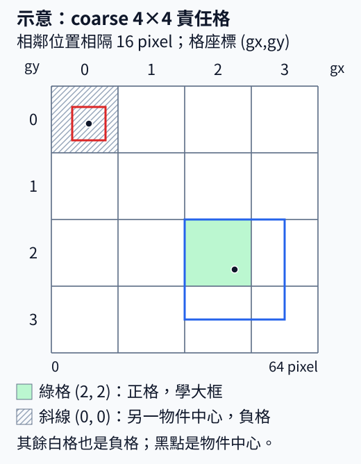
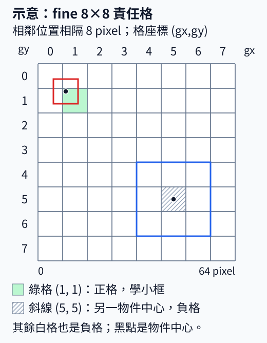
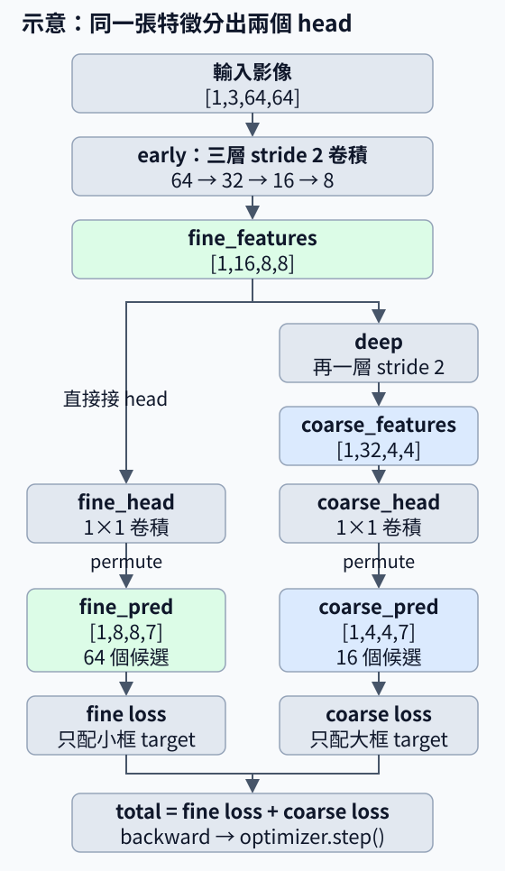
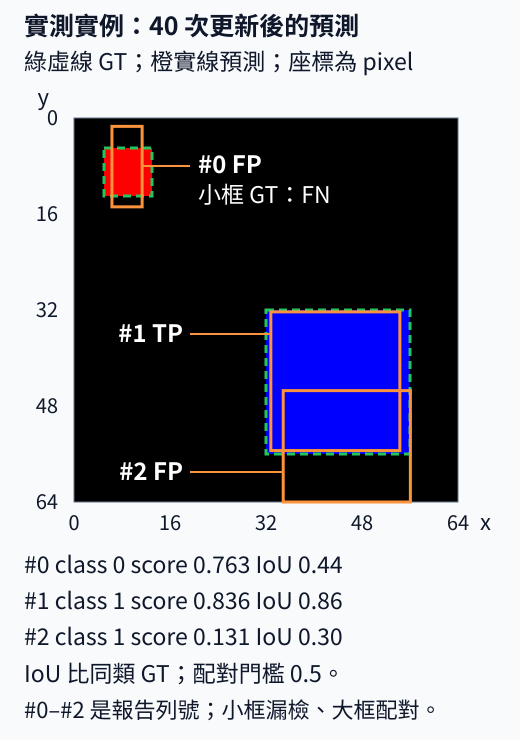

# C.10 YOLOv3 機制：同一個 pixel 框看兩種尺度

[在 Colab 執行本節](https://colab.research.google.com/github/birdhackor/learn_to_yolo/blob/lessons-v0.6.1/notebooks/10-multiscale.ipynb){ .md-button }

現在 anchor 可以先提供常見尺寸，但框的尺寸起點合適，還不等於網路留得住小物件的訊號。64×64 圖只用 4×4 特徵預測時，相鄰位置隔 16 pixel；一個 8×8 物件要和周圍背景一起被概括，細節可能被稀釋。我們希望同一張圖裡的小框、大框都有可用的預測位置，因此保留粗網格，再讓較早的細特徵也接一個 head。

本節的兩支分別叫 **fine（細）**、**coarse（粗）**：fine 在 8×8 特徵上預測，stride 8；coarse 在 4×4 上預測，stride 16。stride 是位置在輸入圖上的間距，不是框寬高。

保留粗特徵也有用途。本例 fine 每個位置的理論感受野是 15×15；coarse 再經一層卷積，擴成 31×31，一個反應能綜合更廣區域的線索。較大物件的不同部分可能跨較遠位置，粗特徵提供較廣的讀取範圍；細特徵則保留較密的位置。兩支讓預測能用到這兩種材料，不代表細支不能找大框，也不保證粗支一定找得更準。下例的小、大框分工是手工設定，用來看清兩條監督路徑。

這是 YOLOv3 多尺度預測的簡化主例：不用第 9 章的 anchor，寬高沿用第 7 章的 sigmoid×全圖 64；小網路 `TwoScale` 的通道、初始化與取得 4×4 的方式也不同於 `GridDetector`。我們能學接法與成本，不能把本節與第 7 章分數當成「原模型只加一支」的品質對照。

## 同一張圖，兩支各學哪個物件

材料是黑底的 64×64 圖。紅色小框 `[5,5,13,13]` 為 class 0，中心 `(9,9)`、寬高 8×8；藍色大框 `[32,32,56,56]` 為 class 1，中心 `(44,44)`、寬高 24×24。**本例人工指定小框給 fine、大框給 coarse**；兩個 head 仍都能預測兩類，這不是按類別分支。





綠格是該支的正格。斜線格雖有另一物件的中心，但沒分給這支，所以與白格一樣學 objectness=0。本例沒有 ignore，這會壓低另一尺度對同一物件的預測；它是為了清楚看責任而採用的教學規則，與原版 YOLOv3 不同。

把同一小框中心除以各自 stride，整數部分是格座標 `(gx,gy)`，小數部分是格內比例。兩套表示都必須還原成原框：

| 項目 | 4×4／stride 16 | 8×8／stride 8 |
| --- | --- | --- |
| center ÷ stride | `(.5625,.5625)` | `(1.125,1.125)` |
| cell `(gx,gy)` | `(0,0)` | `(1,1)` |
| 格內 xy | `(.5625,.5625)` | `(.125,.125)` |
| normalized wh（÷64） | `(.125,.125)` | `(.125,.125)` |
| decode cx | `(0+.5625)×16=9` | `(1+.125)×8=9` |
| decode w | `.125×64=8` | `.125×64=8` |

網格改了，中心在哪格和格內比例都改；寬高仍除以**全圖 64**，兩尺度的 target 都為 0.125。若把 fine 的 w 除以 8，就換了表示，不能再用第 7 章的 decoder。本例實際只用 fine 那欄訓練小框，coarse 那欄用來核對編解碼及後面的重複候選。

大框則有 `44÷16=2.75`，所以 coarse 正格是 `(2,2)`、格內 xy `(0.75,0.75)`、wh `(0.375,0.375)`。張量索引一律先列 y 再欄 x；例如 fine 小框格 `(1,1)` 在 `[0,1,1]`。

??? note "stride、感受野與 anchor 單位"

    stride 不是感受野。`early` 是三層 3×3、stride 2 卷積；每層的範圍增加 `(3−1)×上一層間距`，間距依序為 1、2、4，所以 fine 理論感受野為 1→3→7→15。`deep` 再增加 2×8，得到 coarse 的 31×31。它們都比各自負責的格範圍大。

    本節用 sigmoid×64 表示寬高，不用 anchor。若改成第 9 章的 anchor×exp(tw)，必須寫明 anchor 單位：8 pixel 的 anchor 在 fine 是 1 格、在 coarse 是 0.5 格。把 fine 的「1 格」誤乘 coarse 的格寬 16，就會把 8 pixel 的框解成 16 pixel。

## 兩個 head 的實際連線

一張圖先經過 `early` 得到 `[1,16,8,8]` 特徵。一支直接接 `fine_head`；另一支經 `deep` 得到 `[1,32,4,4]`，再接 `coarse_head`。較細特徵本來就是繼續算粗特徵的材料，新增 head 是把這份中間材料也拿來預測。



`_features` 表示特徵、`_pred` 表示預測。特徵軸是 `[圖片,channel,列,欄]`；1×1 head 把每個位置的通道組合成七項，再用 permute 搬到最後，得到 `[圖片,列,欄,7]`。七項為 `[tx,ty,tw,th,obj_logit,class0_logit,class1_logit]`。

```python
fine_features = model.early(image)                    # [1,16,8,8]
coarse_features = model.deep(fine_features)            # [1,32,4,4]
fine_pred = model.fine_head(fine_features).permute(0,2,3,1)
coarse_pred = model.coarse_head(coarse_features).permute(0,2,3,1)
# fine_small：小框的 8×8 target；coarse_large：大框的 4×4 target
loss = grid_loss(fine_pred,fine_small)['total'] + grid_loss(coarse_pred,coarse_large)['total']
```

fine 有 64 個候選、coarse 有 16 個，共 80 個，是 score 篩選與 NMS 前的數量。兩支 loss 相加，反傳時 `early` 接到兩項梯度，`deep`與`coarse_head`只接粗尺度那項，`fine_head`只接細尺度那項。只接 head 卻沒算它的 loss，並不會讓那支學會。

??? note "完整程式的原始命名"

    完整 `forward` 的 `fine`／`coarse` 是特徵；`main` 收到的 `fine`／`coarse` 是兩個 head 的 prediction。上面的 `_features`／`_pred` 只區分這兩種角色，沒有更動執行程式。

    ``` { .python data-excerpt="lesson_cases/10-multiscale.py" }
    def forward(self,x):
        fine = self.early(x)
        coarse = self.deep(fine)
        return (self.fine_head(fine).permute(0,2,3,1),
                self.coarse_head(coarse).permute(0,2,3,1))
    ...
    fine,coarse = model(image)
    ...
    loss = grid_loss(fine,fine_small)['total'] + grid_loss(coarse,coarse_large)['total']
    ```

## 合併候選前，先回到同一張 pixel 圖

推論沒有 GT 尺寸可查，不能照訓練時的分工先刪另一支。兩支都先解碼，用各自 stride 把中心換回輸入 pixel；再把 boxes、scores、labels 串接，最後依類別做 NMS。fine 格 `(1,1)` 是 x 的 8～16 範圍，coarse 同名格卻是 16～32，格索引不能直接混在一起。

還要跨尺度去重。完整程式先造兩份人工 logits，讓兩支都還原成紅小框 `[5,5,13,13]`；它們沒有經模型學習。同類、相同座標，IoU=1：各尺度內各一框，單獨 NMS 仍各留一框，合併後才由**2→1**。這檢查的是跨尺度流程。

??? note "人工 logits 與合併程式細節"

    框值由 target 經 `torch.logit` 反解；正格的 obj／class 0 填 10、class 1 填 −10，其餘 obj 填 −20。每個尺度 decode 後只剩同一小框。下面保留原程式的名稱；NMS 回傳子集位置，再用 `indices[...]` 換回合併後的列號。

    ``` { .python data-excerpt="lesson_cases/10-multiscale.py" }
    # decoded_scales：兩個尺度（先 coarse、後 fine）各自用 decode_grid 解碼的結果，
    # 每個都含 boxes、scores、labels；本例每個尺度只有 1 個框
    boxes = torch.cat([p['boxes'] for p in decoded_scales],dim=0)  # [2,4]
    scores = torch.cat([p['scores'] for p in decoded_scales],dim=0) # [2]
    labels = torch.cat([p['labels'] for p in decoded_scales],dim=0) # [2]
    assert boxes.shape == (2,4) and scores.shape == labels.shape == (2,)  # 核對上面三個 shape
    selected = []
    for label in labels.unique():                # unique()：列出出現過的類別，本例只有 0
        # where(條件) 對每個軸各回傳一份位置；labels 只有一軸，[0] 取出這一類候選的列號
        indices = torch.where(labels==label)[0]
        # nms 回傳的是在子集 boxes[indices] 裡的位置，用 indices[...] 換回原本的列號
        selected.append(indices[nms(boxes[indices],scores[indices],iou_threshold=.5)])
    selected = torch.cat(selected)               # 各類別留下的列號接成一串
    assert len(selected) == 1                    # 兩個重複框只留下一個
    # 留下的就是小框 [5,5,13,13]
    assert torch.allclose(boxes[selected],small['boxes'],atol=1e-4)
    ```

本書重用的 `decode_grid` 已在尺度內做過 NMS，合併後再做一次；原版 YOLOv3 先收齊三尺度，只做一次逐類 NMS。框連鎖重疊時兩種流程可能不同，完整差異在頁末。

執行 `PYTHONPATH=. python lesson_cases/10-multiscale.py` 或頁首 Colab，可核對兩套小框 target、兩個 prediction shape、80 候選、人工重複框 2→1，以及兩 head 都有非零梯度並更新一步。輸出末行是通過斷言後的固定摘要。這一步證明兩支接通，還沒回答學得好不好。

## 從單步接線到 40 步實際預測

接著沿用同一 `TwoScale`、同一紅小框與藍大框圖，seed 7、Adam、learning rate0.01，實際訓練 40 步。兩 head 每步的梯度有限且非零；全部 8702 個參數的權重變化 L2 長度為 6.504。fine＋coarse loss 從第 1 次更新前 3.6594 降到第 40 次更新前 0.0703。

下面看**40 次更新完成後，同一張訓練圖**的輸出。logits 經各尺度 decode、合併與分類別 NMS 得到三個框，沒有手填答案。為計算 AP，score 門檻用 0.05，低於畫框常用的 0.25。



綠虛線為 GT、橙實線為預測。#0～#2 是報告的 `prediction` 列號，**不是分數排名**。配對按 score 由高到低，每個 GT 只用一次；IoU 與同類 GT 比較。

| 框 ID | class／score | 同類 GT IoU | IoU≥0.5 配對結果 |
| --- | --- | --- | --- |
| #0 | 0／0.763 | 0.44 | FP；紅小框為 FN |
| #1 | 1／0.836 | 0.86 | TP，配到藍大框 |
| #2 | 1／0.131 | 0.30 | FP；藍 GT 已由#1 配對 |

class 0 的 AP50=0，class 1 的 AP50=1，mAP50=(0+1)÷2=0.5000。#2 與#1 的 IoU 約 0.28，小於 NMS 門檻 0.5，仍留下；它排在 TP 後，所以這次沒有拉低 class 1 的 AP。本圖每類只有一物件；一般小物件 AP 應按面積分組，不能拿 class 0 AP 代替。

這次最值得看的是失敗：loss 已約 0.07，小框仍未達 IoU0.5。#0 約 `[6.3,1.4,11.4,14.8]`，中心只偏不到 1pixel，但比 8×8GT 窄約 3、高約 5.4pixel。寬高 MSE 比的是除以 64 的比例，這些差在 loss 裡很小，卻已改變小框很大一部分面積。增加細 head 沒有自動讓定位達標，loss 下降也不保證 IoU 達標。

??? note "查看逐步 loss 與寬高誤差的細算"

    

    曲線每點都在該次更新前量，縱軸是 fine＋coarse loss；右圖則在 40 次更新全部完成後量。上方靜態預測圖用同一次保存的報告重畫，另加配對標示；框座標與分數沒有更改。

    小框寬高差約 3、5.4 pixel，除以 64 再平方約 0.002、0.007；fine 中心偏 1 pixel 則是格內比例差 1/8=0.125，平方約 0.016。因此本例 loss 對寬高偏差較寬容。原版 YOLOv3 用相對 anchor 的 ln 比例，官方框 loss 還乘 `2−w·h`（GT 寬高除以全圖的比例；框越小權重越大），不是本例這套寬高 loss。〈[IoU 類 loss](11-iou-loss.md)〉則直接用 IoU 度量定位誤差。

??? example "重跑 40 步與報告來源"

    在 repository 根目錄執行 `python scripts/run_multiscale_learning.py`；Colab 則先執行環境格，再另開 code cell 執行 `!python scripts/run_multiscale_learning.py`。輸出在 `artifacts/runs/multiscale-learning/`：`report.json` 保存逐步 loss、指標、框與分數，`learning.svg` 是本次生成圖。

    ```python
    from IPython.display import SVG, display
    display(SVG(filename="artifacts/runs/multiscale-learning/learning.svg"))
    ```

    notebook 的〈可選：兩尺度 40 步與實際預測〉也有這兩步。不同機器的末位可能不同，以自己報告為準；自行重跑不必加 `--record`。這個選項才會改寫網站的 JSON 與原生成圖，不會重畫本頁新增的靜態配對圖。

    本頁使用的[完整紀錄](https://github.com/birdhackor/learn_to_yolo/blob/main/artifacts/checks/curriculum/10-multiscale-learning.json)保存 loss、權重變化、AP、`prediction` 框與分數。IoU 由同份框座標算出；GT 來自同次腳本固定的兩個框。

## 收益、代價與適用條件

細特徵多保留空間位置：8pixel 小框在 stride 8 下約佔一格，在 stride 16 下只有半格寬；也可能減少兩中心同格的碰撞。但新增 head 不會增加原圖畫素，resize 只剩 2pixel 的物件無法靠它恢復細節。

候選從 16 增到 80，logits 從 112 增到 560。本例 8×8 特徵本來就要算，真正新增的只是 119 參數的 1×1 `fine_head`；若再在 8×8 上加捲積，成本才會明顯增加。後面的[特徵融合](11-fusion.md)將整理這份細特徵，該節另用隨機張量檢查，沒有接回本例訓練。

物件大小都差不多時，一個適合的尺度可能已足夠。正式比較需固定 backbone、初始化、來源切分、輸入尺寸、訓練預算與 decode／NMS 門檻，再回報大小物件品質、候選數及包含後處理的端到端時間。本次 40 步沒有 held-out 結果，也沒有單尺度品質對照，所以不能說小物件 AP 已提升。

自主練習（手算即可，不必改程式；先自己算，再展開答案）：

1. 中心 `(28,20)` 在 stride 8 下落在哪一格？格內 xy 是多少？若這個框寬高是 16×16，兩個尺度的 wh target 各是多少？
2. 同一個中心在 stride 16 下落在哪一格？格內 xy 是多少？

??? note "參考答案"

    **第 1 題**：28÷8=3.5、20÷8=2.5，所以落在 `(gx=3,gy=2)`，格內 xy `(.5,.5)`。在程式裡讀這格的 target，索引要寫 `[0,2,3]`（第 0 張圖、先 gy=2、再 gx=3），例如 `target['box'][0,2,3]`；寫成 `[0,3,2]` 會讀到另一格。wh 為 16×16 時，兩個尺度都使用 `.25,.25`（16÷64=0.25，不跟格子變）。

    **第 2 題**：28÷16=1.75、20÷16=1.25，所以落在 `(gx=1,gy=1)`，格內 xy `(.75,.25)`；wh 仍是 `.25,.25`。

??? note "與原版 YOLOv3 的差異"

    [YOLOv3: An Incremental Improvement](https://arxiv.org/abs/1804.02767) 的第 2.3 節是三尺度預測；第 2.5 節 multi-scale training 則是隨機改變輸入尺寸，本例沒有做。

    - **尺度與 anchor**：原版在三種格子大小上預測（stride 32、16、8），每種各配 3 個 anchor（共 9 個），每格預測 3 個框。本節只有 stride 16、8 兩種，每格 1 個框，不用 anchor。
    - **誰負責哪個尺度**：原版用尺寸聚類（k-means，見第 9 章〈[尺寸聚類](09-anchor-clustering.md)〉）得到 9 個 anchor，依大小平均分給 3 個尺度，最小的 3 個在最細的尺度。每個 GT（真值框）只交給 9 個 anchor 中尺寸 IoU 最高的那一個（尺寸 IoU 見第 9 章：把中心疊在一起、只比寬高），由那個 anchor 所在的尺度、GT 中心所在的那一格負責。所以物件由哪個尺度負責，是經由 anchor 間接決定的，不是直接設一個尺寸門檻。本節則是人工把兩個物件各自指定給一個 head。
    - **ignore**：原版對「不是最佳、但與某個 GT 重疊超過門檻」的預測設 ignore，不計 objectness loss；官方程式比的是解碼後的預測框（含位置）和 GT 的一般 IoU。論文寫的門檻是 0.5，官方 Darknet 的 cfg/yolov3.cfg 設為 ignore_thresh = .7。本節沒有 ignore，正格以外全是負格，後果見前文〈兩個 head 的實際連線〉。第 9 章的 ignore 是本書自訂的教學規則（同格另一槽的尺寸 IoU 大於 0.2），和原版不同。
    - **類別分數**：本節兩類用 softmax，兩類機率加起來是 1，一個框只能屬於一類（單標籤）。原版對每個類別各做 sigmoid（也叫 logistic 函數），用二元交叉熵（BCE）訓練，各類分數互相獨立，所以同一個框可以同時是 Woman（女人）和 Person（人），這是論文舉的例子。兩種 head 輸出的意義不同，不能直接互換。
    - **特徵融合**：原版較細的尺度，會把深層、格子較少的特徵放大 2 倍（upsample），再和淺層、格子較多的特徵沿 channel 接起來（concat），然後才預測。這叫特徵融合，本節不做，第 11 章才做。
    - **主幹網路**：原版的主幹網路（backbone，負責抽取特徵的前段網路）是 Darknet-53（論文說它有 53 個卷積層，這包含 ImageNet 分類用的最後一層；YOLOv3 偵測時去掉分類層，用其餘 52 個）。本節不用，改用自己寫的小網路 TwoScale。
    - **推論的 NMS**：原版官方程式把三個尺度的框收齊後，只做一次逐類別的 NMS。本節重用第 7 章的 `decode_grid`，各尺度內會先各做一次 NMS，合併後再做一次。框連鎖重疊時（A 與 B、B 與 C 的 IoU 都超過門檻，A 與 C 沒有），兩種做法留下的框可能不同。

<!-- curriculum-evidence:start -->

## 實際執行紀錄

本節的完整程式於 2026-10-08 在 AMD EPYC 9V74 80-Core Processor（2 個執行緒）上用 PyTorch 2.9.1+cpu 執行，程式裡的 assert 全部通過。下面是那次印出的原始輸出；輸出裡若有計時或訓練得到的數字，換一台電腦會略有不同。每個數字的意思，以本頁正文的說明為準。[完整紀錄（JSON）](https://github.com/birdhackor/learn_to_yolo/blob/main/artifacts/checks/curriculum/10-multiscale.json)

??? example "展開本次實際輸出"

    ```text
    cross-scale duplicate boxes before/after class-wise NMS 2 -> 1
    stride16 small target [0.5625, 0.5625, 0.125, 0.125]
    stride8 small target [0.125, 0.125, 0.125, 0.125]
    head shapes (1, 8, 8, 7) (1, 4, 4, 7) candidates before score/NMS 80
    both heads received gradients; one update; scale encode/decode checked
    ```

<!-- curriculum-evidence:end -->
