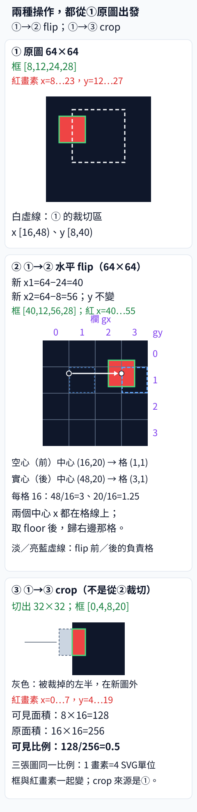
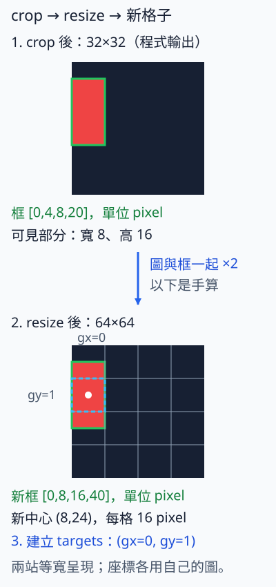

# 11.3 增強：畫素怎麼變，框就怎麼變

[在 Colab 執行本節](https://colab.research.google.com/github/birdhackor/learn_to_yolo/blob/lessons-v0.6.1/notebooks/11-augmentation.ipynb){ .md-button }

前兩節（CSP、特徵融合）改的是模型；本節換到資料這一側，模型和 loss 都不動，只改訓練資料的變換。

資料增強（data augmentation）是在訓練時把圖片翻轉、裁切等變換後，當成新的訓練樣本。框和 labels 也要跟著處理：畫素移到哪裡，框就跟到哪裡；框被刪掉時，它的 label 也要一起刪。資料增強不是把畫質變好。用意是不必多標註，就能讓模型看到位置、大小或外觀不同的物件。

但若框沒跟著圖片走，正確的標註就會變成錯誤監督。例如把本節的圖（第 7 章的紅色矩形）左右翻轉、框卻不改：紅框還停在 `[8,12,24,28]`，那裡已經是黑色背景；紅色本身移到了 x=40…55，卻沒有框。這等於教模型把黑色背景當成紅色物件，又把真正的紅色當成背景。

本節只做固定的水平翻轉與裁切。先做可逆、可手算的水平翻轉（flip：左右鏡射），再做會裁掉物件一部分的裁切（crop：從原圖切出一塊矩形當新圖）。

實際訓練時，通常每讀一張圖就隨機決定要不要翻（例如 YOLOv5 v6.0 預設 fliplr=0.5，也就是每張圖有一半的機率左右翻轉）；裁切的位置通常也是隨機選的。本節把它們固定，是為了讓你能手算核對。若要接進訓練，增強要放在讀出圖片和標註之後、建立 targets（每格要學的訓練目標）之前；本書的 MiniYOLO 訓練程式並沒有接上增強。

讀完本節，你能手算翻轉、裁切後的新框，判斷裁切後的框該不該留，也知道要用哪些檢查確認圖、框、labels 有沒有一起變對。

前置：[資料契約](07-data.md)（圖片、框、labels 的格式約定；框採半開區間）、[自己的資料](08-own-data.md)（把自己的圖片和框寫成本書的標註格式）。

??? note "歷史來源與進階增強"

    [YOLOv4](https://arxiv.org/abs/2004.10934) 討論了 bag of freebies（免費贈品包），包括 Mosaic 等訓練策略。YOLOv4 把 bag of freebies 定義成只改訓練方法或只增加訓練成本、但不增加推論成本的改進：訓練時多花工夫，模型實際使用時速度不變，所以像是免費的。資料增強就是最常見的一種。Mosaic 把 4 張訓練圖拼成 1 張，各張圖的框也跟著換算到拼接後的位置。

    [YOLOv5 v6.0 augmentations.py](https://github.com/ultralytics/yolov5/blob/956be8e642b5c10af4a1533e09084ca32ff4f21f/utils/augmentations.py) 提供程式實作，收的是 mixup、隨機透視、letterbox 等函式：

    - mixup：把兩張圖按比例疊在一起；YOLOv5 的版本會保留兩張圖的所有框。
    - 隨機透視（random perspective）：隨機做旋轉、平移、縮放、斜切、透視等幾何變形，框也跟著一起變換。變換後再用 `box_candidates` 刪框：寬、高都要大於 2 畫素，面積和照同樣倍率縮放的原框相比要大於 0.1，長寬比要小於 20；每個框和它的類別存在同一列，所以會一起被刪掉。
    - letterbox：等比例縮放後補邊（見第 4 章）。

    Mosaic 和訓練時整張圖的左右翻轉不在這個檔案，而在同版本的 [v6.0 datasets.py](https://github.com/ultralytics/yolov5/blob/956be8e642b5c10af4a1533e09084ca32ff4f21f/utils/datasets.py)：Mosaic 在 `load_mosaic`；左右翻轉在 `__getitem__`，依 `fliplr` 的機率執行。YOLOv5 在這一步用的是除以圖寬後的中心 x（正規化中心 x），所以翻轉時把它改成 1−x。這和本節的 W−x 是同一件事：中心 cx 翻轉後是 W−cx，除以 W 就是 1−cx/W。

    這些來源包含多種策略，不等於本節的兩個操作。本節簡化成人工固定的水平翻轉（horizontal flip）與裁切（crop），沒有 Mosaic 四圖拼接、mixup 或隨機透視。

    要不要在訓練中保留某種增強，應該用固定預算（budget）的對照來決定：在相同的訓練步數或計算量下，有、無這種增強分別訓練，再比較結果。本節沿用第 7 章 64×64 圖上的紅框例子，只檢查圖、框、labels 是否同步變換，沒有訓練；flip、crop 與 Mosaic、mixup 都沒在相同訓練步數下比較過效果。

## Flip：框邊界用 W−x，畫素編號用 W−1−x

紅框 `[8,12,24,28]` 在寬 W=64 的圖上水平翻轉。原本的紅色畫素 x=8…23，翻轉後變成 x=55…40，所以新框是 `[40,12,56,28]`。公式是 `new_x1=W−old_x2`、`new_x2=W−old_x1`，y 不變。



綠線是紅色物件的框，也就是本頁說的紅框。① → ② 是水平翻轉：紅色畫素和框一起移到右邊，負責格從淡藍虛線的 (gx=1, gy=1) 換成亮藍虛線的 (gx=3, gy=1)；① → ③ 是下一小節的裁切：③ 從 ① 的白虛線區切出，灰色是紅色被裁掉的那一半。

框座標代表畫素之間的格線（半開區間，見第 4 章；每 1 畫素一條，不是圖 ② 裡每 16 畫素一條的 4×4 格線），不是單個畫素的編號，所以框不用 W−1；畫素編號的翻轉才是 W−1−x，兩者切勿混淆。為什麼差 1？

- **畫素**：畫素 i 占據格線 i 到 i+1 之間的那一段。左右鏡射把位置 u 送到 W−u：格線 i 變成 W−i，格線 i+1 變成 W−1−i。所以這個畫素翻轉後從 W−1−i 到 W−i，也就是畫素 W−1−i（畫素的編號是它左邊那條格線）。代入：畫素 23 → 40、畫素 8 → 55。
- **框**：x1、x2 本身就是格線，直接套 W−u。鏡射會讓左右對調，所以新的左邊來自舊的右邊：新 x1 = 64 − 舊 x2 = 64 − 24 = 40，新 x2 = 64 − 舊 x1 = 64 − 8 = 56。紅畫素 40…55 正好占 [40,56)。

完整程式的 `horizontal_flip` 就照這個公式寫。以下摘自完整程式，中文註解是本頁加的：

``` { .python data-excerpt="lesson_cases/11-augmentation.py" }
def horizontal_flip(image,boxes):
    width = image.shape[-1]         # 圖寬，也就是本頁的 W；CHW 的最後一軸是寬
    result = boxes.clone()          # 讀舊 boxes，寫獨立副本；否則算 x2 時會讀到已改成 40 的 x1
    result[:,0] = width-boxes[:,2]  # 新 x1 = W − 舊 x2
    result[:,2] = width-boxes[:,0]  # 新 x2 = W − 舊 x1；y1、y2 不動
    return image.flip(-1),result    # 圖沿最後一軸（寬）左右鏡射，和新框一起回傳
```

labels 不變，紅矩形仍是 class 0，所以 `horizontal_flip` 只需要圖和框。

連做兩次 flip，應逐值恢復原圖和原框。這是必要條件，不是充分條件：寫對的 flip 一定會還原，但會還原不代表寫對。用 W−1（得 `[39,12,55,28]`）、忘了交換 x1 和 x2（得 `[56,12,40,28]`）或翻錯軸，翻兩次一樣會還原。真正抓得到這些錯的，是翻一次後對照手算答案 `[40,12,56,28]`，並核對紅色畫素正好落在新框內。完整程式兩種都有斷言（assert）：翻轉後的框必須等於 `[[40,12,56,28]]`；翻轉後的圖必須等於「只在畫素 x=40…55、y=12…27 塗紅」的預期圖。

注意：若類別和方向有關，flip 可能改變它的意思，例如左轉箭頭翻過來就成了右轉箭頭。這時有兩種做法：一是重新定義標籤怎麼跟著變，例如翻轉時把類別「左轉箭頭」同時改成「右轉箭頭」；二是不用這種增強：若沒有可對應的類別（例如文字、左右不對稱的標誌），就不要對這類資料做水平翻轉。

框變了，負責的格子也跟著變。用第 7 章的 4×4 格（每格 16 畫素）來看：flip 前中心 (16,20) 由 (gx=1, gy=1) 負責；flip 後中心是 (48,20)，48/16=3、20/16=1.25，取 floor 得 (gx=3, gy=1)，改由這一格負責。這個改變是對的：物件移到哪裡，監督就該跟到哪一格。

## Crop 會改座標，也會改可見面積

這段先留在裁切後的 32×32 座標，算新框和 keep；再處理刪框後的監督；最後才把圖與框接回 64×64 模型。

### 在 32×32 座標裁框、判斷 keep

從原圖裁切（crop）出 left=16、top=8、width=32、height=32 的區域。裁切區在原圖占 x [16,48)、y [8,40)（含頭不含尾），裁切後的圖 shape 是 `[3,32,32]`。紅框占 x [8,24)，左半邊在裁切區外。框分兩步換算：

1. 把原點移到裁切區左上角：x 減 left=16、y 減 top=8，得 `[-8,4,8,20]`。x1=−8 表示框的左邊超出新圖左緣 8 個畫素。
2. 把座標夾回（clamp）新圖的邊界 0 和 32 之間：小於 0 改成 0、大於 32 改成 32，得 `[0,4,8,20]`。

這裡的 clamp 和 7.5 節〈[把輸出接回圖片](07-inference.md)〉說的「標註超出圖片，不能用 clamp 蓋過去」不衝突：原圖上的標註本身合法，是裁切讓物件有一部分落到新圖外；夾回後的框，正好框住留在新圖裡的那塊畫素。若原圖上的標註本來就超出 0～64，那仍是資料錯誤，要回頭修資料。

框減掉的正是裁切區左上角 (16, 8)，圖片也是從這個角開始切，所以畫素和框仍然對得上。剩下寬 8、高 16，可見面積 = 8×16 = 128；原面積 16×16 = 256，可見比例 = 128/256 = 0.5。

要確認畫素和框真的對得上，只看框內的畫素還不夠。假設裁切圖片時從 x=12 開始（比 left=16 偏左 4 個畫素），框卻照 (16, 8) 平移：紅色在新圖占 x=0…11，框內 128 個畫素照樣全是紅色，框外 x=8…11、y=4…19 卻多出一塊寬 4、高 16 的紅色，畫素和框就對不上了。所以和翻轉時一樣，完整程式對裁切也有這兩種斷言：裁切後的框必須等於 `[[0,4,8,20]]`；裁切後的整張圖必須等於 shape `[3,32,32]`、「只在畫素 x=0…7、y=4…19 塗紅」的預期圖。比對用的是 `torch.equal`：兩個 tensor 的 shape 相同、每個值也都相同，才算相等，所以裁切後的圖 shape 不對也會被抓到。

本例規定「可見面積大於 0，且可見比例 ≥ 0.5 才保留」；這個 0.5 是可見比例的門檻（threshold）。它和第 6 章的 score 門檻、IoU 門檻都不同：比的是同一個框裁切後還看得到多少，不是兩個框的重疊。本例比例剛好 0.5，程式用 `>=`，所以保留；寫成 `>` 就會刪掉，邊界要寫清楚。若門檻改成 0.6，就移除這個框。判斷結果存成 keep（每個框一個 True／False 的布林遮罩）；labels 要用同一個 keep 篩，不能只有 boxes 變少。

為什麼還要另寫「可見面積大於 0」？只要門檻大於 0，比例條件就已保證可見面積大於 0。另寫這個條件（下面程式裡的 `visible > 0`，`visible` 是可見面積），是為了門檻設成 0 時也不會留下零面積框。零面積框不是合法標註。第 7 章的 build_targets（把框轉成每格訓練目標的函式）遇到這種框，會拋出 ValueError。

完整程式把裁圖、框的兩步換算和保留規則都寫在 `crop` 函式裡，`main()` 再呼叫它裁出本例。這個 `crop` 只處理完全落在原圖內的裁切區（0 ≤ left、left+width ≤ W，0 ≤ top、top+height ≤ H）：圖是用切片取的，裁切區超出原圖時切出來的圖會變小，框卻仍夾到 width、height，兩者對不上，也不會報錯；隨機選裁切位置時，要在這個範圍內選。以下摘自完整程式，中文註解是本頁加的；單獨一行的 `...` 表示中間省略了程式，`main()` 裡摘出的兩行之間也省略了一行斷言：

``` { .python data-excerpt="lesson_cases/11-augmentation.py" }
def crop(image,boxes,left,top,width,height,min_visibility=.5):  # min_visibility 是可見比例門檻
    # 原點移到裁切區左上角：x 減 left、y 減 top
    shifted = boxes-torch.tensor([left,top,left,top],dtype=boxes.dtype)
    clipped = shifted.clone()
    # [:,[0,2]] 一次取 x1、x2 兩欄；clamp 把小於 0 的改成 0、大於 width 的改成 width
    clipped[:,[0,2]] = clipped[:,[0,2]].clamp(0,width)
    clipped[:,[1,3]] = clipped[:,[1,3]].clamp(0,height)  # y1、y2 同理
    # [x2,y2]−[x1,y1] 是 [寬,高]；prod(-1) 沿最後一軸相乘，得到寬×高
    area = (boxes[:,2:]-boxes[:,:2]).prod(-1)  # 原面積
    # 可見面積；clamp(min=0) 先把負的寬、高改成 0（框的 x2<x1 或 y2<y1 時才會是負的）
    visible = (clipped[:,2:]-clipped[:,:2]).clamp(min=0).prod(-1)
    keep = (visible > 0) & (visible/area >= min_visibility)  # 每個框一個 True／False
    # 裁圖：CHW 先切 y 再切 x；回傳裁切後的圖、只留 keep 為 True 的框，以及 keep
    return image[:,top:top+height,left:left+width],clipped[keep],keep
...
# main() 裡：本例切的是 image[:,8:40,16:48]，cropped 是 [3,32,32]；這裡的 clipped 是留下的框
cropped, clipped, keep = crop(image,boxes,16,8,32,32,.5)
cropped_labels = labels[keep]  # labels 用同一個 keep 篩
```

### 用同一個 keep 篩 labels，檢查剩下的監督

這一步仍在 32×32 裁切圖上：刪除標註不會刪掉畫素。

本例只有一個框，看不出漏篩 labels 的後果。換成三個框：`labels=[0,1,0]`、`keep=[True,False,True]`，boxes 剩兩個，labels 也要用同一個 keep 變成 `[0,0]`。若 labels 沒篩，boxes 剩 2 個、labels 仍有 3 個，數量對不上，本書的 build_targets 會拋出 ValueError；不檢查長度的程式則會把類別配錯框。

門檻是訓練標註策略的選擇。門檻 0.6 時紅框被刪，但裁切後的圖左邊仍有一塊寬 8、高 16 的紅色。若把這張圖連同空的標註拿去訓練：第 7 章的 build_targets 不設 ignore 格（忽略、不算 loss 的格子），這張圖又沒有框，所以每一格的 objectness 目標都是 0，等於教模型「這塊紅色是背景」。這就是未標註前景：看得到物件（前景），卻沒有框。門檻設太低，又會留下只露出一小角、很難學的框，所以要依任務選。刪掉的框越多，不代表增強越有效。

### 從 32×32 接回 64×64，重新分配格子

裁切後，圖和框都在 32×32 的座標裡。若模型仍要求 64×64 輸入，接著要同時 resize（縮放）或 letterbox 圖片與框。若不縮放、直接用 32×32 的圖，呼叫 build_targets 時要傳 `image_size=32`：它只收框，預設 image_size=64，框會被當成 64×64 圖上的座標，格子和寬高都會算錯，卻不會報錯。letterbox 是等比例縮放後補邊；框也要乘縮放比例並加補邊偏移，見[座標轉換](04-coordinates.md)。再用新的框中心建立 targets（由新框算出的每格訓練目標，見[建立 targets](07-targets.md)），不能沿用增強前的格子。

本節程式沒有做這一步，以下是手算：32×32 等比例放大到 64×64，比例是 2，不必補邊。框 `[0,4,8,20]` 乘 2 變成 `[0,8,16,40]`，中心 (8,24)；8/16=0.5、24/16=1.5，取 floor 落在 (gx=0, gy=1)。可見的紅色也跟著放大，寬、高都變成 2 倍，這就是增強帶來的大小（尺度）變化。



這是依座標畫出的示意圖。兩站使用不同的畫素座標：上站對應 crop 程式產生的 32×32 圖，下站是正文手算的 resize 結果。下站才疊上第 7 章的 4×4 targets 網格；藍色虛線標出新中心 (8,24) 所屬的 (gx=0, gy=1)。先決定 resize 後的圖與框，再建立 targets，不能沿用原圖中心 (16,20) 所屬的 (gx=1, gy=1)。

## 執行完整程式

[在 Colab 執行完整程式](https://colab.research.google.com/github/birdhackor/learn_to_yolo/blob/lessons-v0.6.1/notebooks/11-augmentation.ipynb)（和頁首按鈕相同），或在 repo 根目錄執行 `PYTHONPATH=. python lesson_cases/11-augmentation.py`。這是資料幾何實驗，不需 backward，也沒有 AP 結論。開頭的 `torch.manual_seed(7)`、`torch.set_num_threads(2)` 是各節程式共用的設定；本節的翻轉與裁切參數都直接寫在程式裡，沒有抽任何亂數。預期輸出四行：

```text
flip box [[40.0, 12.0, 56.0, 28.0]] double flip is identity
crop box [[0.0, 4.0, 8.0, 20.0]] visible area 128/256=.5
labels after visibility .5/.6 [0] []
no-object image: boxes [0,4], labels Long[0], pixels stay zero
```

- 第 1 行：翻轉後的框是 `[40,12,56,28]`；double flip is identity 表示連翻兩次能還原。
- 第 2 行：裁切後的框是 `[0,4,8,20]`；`visible area 128/256=.5` 是簡寫，意思是可見面積 128、原面積 256，可見比例 128/256 = 0.5。
- 第 3 行：可見比例門檻 0.5 和 0.6 時，用 keep 篩出的 labels。0.5 時是 `[0]`：labels 剩一個元素，值是 0（紅色的類別）。0.6 時是 `[]`：框被刪掉，labels 的形狀變成 `[0]`（長度 0）。boxes 的形狀變成 `[0,4]`（0 個框）、labels 的 dtype 仍是 long，這兩項沒有印出來，是完整程式用斷言檢查的。
- 第 4 行：空圖檢查。空圖是畫面上真的沒有物件的圖；完整程式用全零畫素、形狀 `[0,4]` 的 boxes、形狀 `[0]` 的 long labels。翻轉、裁切後，畫素仍全為零（pixels stay zero），boxes 仍是 `[0,4]`，用 keep 篩過的 labels 仍是長度 0（Long[0]）。斷言檢查的是篩選後的長度；dtype 檢查的是篩選前的 labels，用布林遮罩篩選不會改變 dtype（上面 0.6 那組的斷言也核對了篩選後仍是 long）。

畫面上有紅矩形、標註卻是空的圖，不能拿來代替空圖：那是漏標，會教模型把紅色當成背景。

印出這四行之前，完整程式已用斷言逐值核對過：翻轉、裁切後的框都等於手算答案，整張圖也都等於預期圖，所以紅色正好落在新框 `[40,12,56,28]`、`[0,4,8,20]` 內，框外沒有紅色。四行裡，第 1、2 行的框和第 3 行的 labels 是程式算出來的值，labels 是用 keep 篩出來的；`double flip is identity`、`visible area 128/256=.5` 和整個第 4 行則是直接寫在 print 裡的固定文字，不是當場算出來的。它們印得出來，表示前面的斷言都已通過：任何一個斷言不成立，程式就會停在那裡並報 AssertionError，這四行一行也不會印出。

## 收益與代價

同步增強讓模型看到新的位置、尺度（大小）和外觀，可能減少它對固定背景和固定位置的依賴。代價有三：每張圖多一段變換程式，也多花處理時間；要多訂規則（例如可見比例門檻、有方向的類別能不能翻）；被裁到只剩一部分的物件比完整物件難辨認，可能讓訓練較難收斂（收斂：loss 降下來並趨於穩定）。

驗證集、測試集（validation／test）用固定的前處理，通常不使用隨機的訓練增強，否則每次算出的指標都在變。

epoch（一輪）指把整份訓練資料都用過一次。固定 seed（亂數種子）讓整串亂數在每次重跑時都一樣，有助於重現結果；但在同一次訓練裡，同一張圖在第 1 輪和第 2 輪抽到的翻轉、裁切通常並不相同，這正是增強要的變化。所以固定 seed 不等於每個 epoch 都要用完全相同的增強。本書的 ShapeDataset 每次讀同一個索引，都用同一個固定 seed 重新產生那張圖；要在裡面加隨機增強，不能沿用那個亂數產生器，否則每一輪抽到的翻轉、裁切都一樣。正式實驗要記錄用了哪些隨機增強、機率與訓練預算（例如訓練步數）。

常見錯誤：

- **翻錯軸**：寫成 `image.flip(0)` 會翻到 channel 軸，R、B 對調，紅色變藍，類別意義也跟著錯（紅是類別 0、藍是類別 1）；而且圖沒有左右翻，色塊仍在 x=8…23，框卻照公式移到 `[40,12,56,28]`，框住的是黑色背景。寫成 `image.flip(1)` 會翻到 height 軸，圖變成上下顛倒：紅色移到 y=36…51、x 仍是 8…23，框卻是照左右翻算出的 `[40,12,56,28]`，兩者完全不重疊。這兩種錯，完整程式都會停在「翻轉後的圖必須等於預期圖」的斷言；只看翻兩次能不能還原，抓不到。
- **用 W−1 變換框邊界**：得 `[39,12,55,28]`，比紅色畫素（x=40…55）偏左 1 個畫素。雙 flip 抓不到這個錯。
- **先修改 x1 再用它算 x2**：沒有 clone、直接改 boxes 時，x1 先變成 64−24=40，算 x2 時讀到的就是 40，得 64−40=24，框變成 `[40,12,24,28]`，x2 比 x1 還小。
- **crop 後留下零面積框**：例如門檻設成 0、又少了 `visible > 0`；build_targets 遇到這種框會拋出 ValueError。
- **漏掉 labels 的 keep**：boxes 篩了、labels 沒篩，數量對不上，或類別配錯框（見上面三個框的例子）。

自主練習（手算即可；先自己算，再展開答案）：

1. 寬 64 的圖上，整張圖大小的框 `[0,0,64,64]` 翻轉後是多少？
2. 紅框裁切後，可見面積只剩原本的一半時，是否一定會被刪除？
3. 同樣的裁切（left=16、top=8、32×32）套在藍框 `[40,36,56,52]` 上，框會變成多少？可見比例多少？門檻 0.5 時留不留？若紅、藍兩框在同一張圖上，keep 和 labels 會變成什麼？

??? note "參考答案"

    **第 1 題**：new_x1 = 64 − 64 = 0、new_x2 = 64 − 0 = 64，y 不變，所以仍是 `[0,0,64,64]`。

    **第 2 題**：不一定，取決於明寫的可見比例門檻。本例比例剛好 0.5：門檻 0.5（程式用 `>=`）時保留，門檻 0.6 時刪除。

    **第 3 題**：減掉 (16, 8) 得 `[24,28,40,44]`；夾回（大於 32 的改成 32）得 `[24,28,32,32]`。可見面積 8×4 = 32，原面積 16×16 = 256，比例 32/256 = 0.125，小於 0.5，所以刪除。紅、藍兩框在同一張圖上時，`keep=[True,False]`，boxes 只剩 `[[0,4,8,20]]`，labels（紅 0、藍 1）只剩 `[0]`。

    想用程式核對第 3 題，可以在 Colab 執行完完整程式後，新增一格執行；在自己的電腦上，則執行 `PYTHONPATH=. python -i lesson_cases/11-augmentation.py`，程式跑完出現 `>>>` 提示後再貼上：

    ```python
    both = torch.tensor([[8., 12., 24., 28.], [40., 36., 56., 52.]])
    _, kept, keep = crop(torch.zeros(3, 64, 64), both, 16, 8, 32, 32)
    print(kept.tolist(), keep.tolist())  # [[0.0, 4.0, 8.0, 20.0]] [True, False]
    print(torch.tensor([0, 1])[keep].tolist())  # labels（紅 0、藍 1）只留 [0]
    ```

<!-- curriculum-evidence:start -->

## 實際執行紀錄

本節的完整程式於 2026-10-05 在 INTEL(R) XEON(R) PLATINUM 8573C（2 個執行緒）上用 PyTorch 2.9.1+cpu 執行，程式裡的 assert 全部通過。下面是那次印出的原始輸出；輸出裡若有計時或訓練得到的數字，換一台電腦會略有不同。每個數字的意思，以本頁正文的說明為準。[完整紀錄（JSON）](https://github.com/birdhackor/learn_to_yolo/blob/main/artifacts/checks/curriculum/11-augmentation.json)

??? example "展開本次實際輸出"

    ```text
    flip box [[40.0, 12.0, 56.0, 28.0]] double flip is identity
    crop box [[0.0, 4.0, 8.0, 20.0]] visible area 128/256=.5
    labels after visibility .5/.6 [0] []
    no-object image: boxes [0,4], labels Long[0], pixels stay zero
    ```

<!-- curriculum-evidence:end -->
