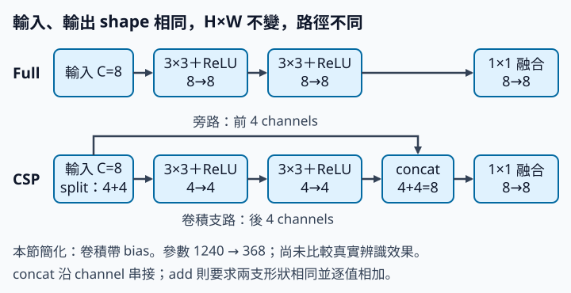

# 11.1 CSP：分一部分通道走較短的路

[在 Colab 執行本節](https://colab.research.google.com/github/birdhackor/learn_to_yolo/blob/lessons-v0.4.0/notebooks/11-csp.ipynb){ .md-button }

卷積網路常分成幾個 stage（階段）。同一個 stage 裡的特徵解析度相同，通常連續做好幾層卷積，每層都讓全部通道（channel）參與。一層 3×3 卷積的輸入、輸出都是 C 個通道時，參數與計算量大約和 C² 成正比。第 1 章提過：輸入、輸出通道數一起加倍，成本約變成 4 倍。所以讓全部通道走過每一層，成本很高。本節要問：能不能只讓一半通道做這串卷積，另一半直接繞過去，最後再把兩半接回來、混合一次，輸出仍保有原本的通道數？CSP 就是這樣做的。

讀完本節，你能追出兩條路的 shape，手算兩種 block 的參數數（1240 與 368），說出串接與逐值相加的差別，也看得懂程式印出的梯度檢查。

前置：[卷積 shape](01-small-cnn.md)（卷積輸出大小與參數數的算法）、[shortcut](03-identity.md)（把輸入逐值加回輸出的捷徑）、[1×1 卷積混合 channel](03-projection.md)。

本節的實驗不接偵測器，範圍很小。程式只拿隨機產生的特徵 tensor，單獨測一個輸入、輸出 shape 都是 `[B,8,8,8]` 的 block。起點是全部通道都做卷積的 Full（對照組），CSP 只改 block 內部的路徑。要檢查的是 shape、參數數、梯度有沒有接通，以及 fuse 的權重會不會更新；偵測 head、資料與偵測 loss 都用不到。這個 CSP block 只留作學習用的元件，沒有放進 MiniYOLO。CSP 值不值得放進偵測器，要做條件固定的對照實驗才知道：資料、訓練步數與評估方式都相同，只換這個 block。本節不做這個實驗。第 14 章的特徵模組會再用到「切分、串接、融合」的想法。

歷史機制：CSP 來自 [CSPNet](https://arxiv.org/abs/1911.11929)（Cross Stage Partial Network）論文。論文摘要報告，在 ImageNet（第 3 章提過的大型圖片分類資料集）上，計算量約減少 20%，準確率持平或更好；本節沒有重現這個結果。

??? note "歷史與版本"

    **CSPNet 的梯度說法**：CSPNet 論文認為，DenseNet（每一層都把前面各層的輸出串接起來當輸入的網路）這類網路在反向傳播時，不同層的權重更新會重複用到大量相同的梯度。論文稱這種現象為「重複的梯度資訊」（duplicate gradient information）。論文讓一部分通道直接跨到 stage 末端，說這樣能省下計算，也讓梯度路徑變成兩倍。要減少重複，論文認為關鍵在末端的融合順序：走完 dense block（DenseNet 裡層層串接的那一串卷積層）的那部分先經過一層 transition（過渡層，例如 1×1 卷積），再和跨過來的那部分串接。論文說這種排法截斷了梯度流（truncate the gradient flow），用來避免不同層學到重複的梯度資訊；這不是指梯度傳不回前面的層。論文也比較了先串接、再做 transition 的排法：也能省下計算，但論文說這樣仍會大量重用梯度資訊。本節的 block 是先串接、再用 1×1 融合，排法比較接近後者。本節只檢查兩條路都收得到梯度，不量測重複的程度。

    **YOLOv4**：[YOLOv4](https://arxiv.org/abs/2004.10934) 的 backbone（主幹）採用 CSPDarknet53，也就是在 YOLOv3 的主幹 Darknet-53 上加入 CSP 結構。YOLOv4 另外還有其他訓練技巧與 neck（夾在 backbone 與 head 之間整理特徵的部分）設計。

    **YOLOv5**：YOLOv5 由 Ultralytics 公司另行開發，以開源程式碼發布。可對照固定版本的[官方 v6.0 common.py](https://github.com/ultralytics/yolov5/blob/956be8e642b5c10af4a1533e09084ca32ff4f21f/models/common.py)（連結固定在 v6.0 tag 指向的 commit）：v6.0 是 YOLOv5 程式庫的版本號，不是 YOLOv6；common.py 是定義各種模組的程式檔。v6.0 的模型配置用的 CSP 模組是 C3，程式註解寫著「CSP Bottleneck with 3 convolutions」。C3 不用 chunk 切半，而是用兩個 1×1 卷積從同一個輸入各算出一支，每支的通道數是輸出通道數的一半（`e=0.5`），相當於本節的切半。其中一支再經過一個或多個 Bottleneck，然後兩支串接，由第三個 1×1 卷積融合；所以 C3 和本節一樣是先串接、再融合。Bottleneck 是先做 1×1、再做 3×3 卷積的小模組。建立 C3 時有個選項 `shortcut`，預設為 True，這時 Bottleneck 還會像第 3 章的 shortcut 那樣，把輸入逐值加到這兩層卷積算出的結果上。以 v6.0 的 [yolov5s 配置](https://github.com/ultralytics/yolov5/blob/956be8e642b5c10af4a1533e09084ca32ff4f21f/models/yolov5s.yaml)為例，backbone 的 C3 都用這個預設；backbone 之後的 C3 則設成 False，不做這個相加（YOLOv5 的設定檔把 neck 也寫在 `head:` 段落底下）。同一個檔案裡較早的 BottleneckCSP 與 YOLOv4 的 CSPDarknet53，則像論文那樣，在支路末端先接一層 1×1 卷積再串接。

    YOLOv4、YOLOv5 相對 YOLOv3 的改進不只 CSP 一項，不能全部歸功於 CSP。本節簡化為 8 通道的一次切分、兩個小卷積，再串接並用 1×1 融合，不重現完整的 CSPDarknet 或 C3。原版的每個卷積後面都接 BatchNorm（一種把每個 channel 的數值重新標準化的層）與激勵函數：YOLOv5 的 C3 由 `Conv` 模組組成（不帶 bias 的卷積 → BatchNorm → SiLU），YOLOv4 的 CSPDarknet53 每層卷積後接 BatchNorm 與 Mish。BatchNorm 會減掉每個 channel 的平均值，卷積的 bias 加了也會被減掉，所以原版不帶 bias。本節不加 BatchNorm、改用 ReLU，卷積保留 `nn.Conv2d` 預設的 bias；1240 與 368 只算卷積的權重與 bias。

## 先把兩條路的 shape 對起來

CSP 這個名字可以拆開理解。Partial（部分）指只有一部分通道進入這段卷積；Cross Stage（跨 stage）指另一部分直接接到 stage 末端，再和卷積的結果合併。原論文裡，這部分跨過的是整個 stage，中間可能有很多層卷積；本節把這整段縮成只有兩個 3×3 卷積。

輸入 `x` 的 shape 是 `[B,8,8,8]`（NCHW：B 筆、8 個 channel、高 8、寬 8）。`x.chunk(2,dim=1)` 沿第 1 軸平均切成 2 份。軸從 0 數起：第 0 軸是 batch、第 1 軸是 channel、第 2 軸是高、第 3 軸是寬，所以 dim=1 是沿 channel 切。第一份是前 4 個通道，第二份是後 4 個通道，各為 `[B,4,8,8]`。本節固定用兩個名字稱呼這兩份：

- **旁路（bypass）**：前 4 個通道（第 0 到 3 個）。不做卷積，原值直接送到串接的地方。
- **卷積支路（branch）**：後 4 個通道（第 4 到 7 個）。經過兩個 3×3 卷積，每個卷積後接 ReLU；stride 1、padding 1，所以仍是 `[B,4,8,8]`。

通道編號只是排列順序，前 4 個、後 4 個通道並沒有事先約定代表邊緣或顏色。

兩路接著沿 channel 軸串接（concat）：通道數相加，4+4=8，得到 `[B,8,8,8]`。最後經過 fuse（融合用的 1×1 卷積，8→8）混合兩路：每個輸出通道是同一位置 8 個輸入通道的加權和，再加 bias。少了 fuse，輸出的前 4 個通道就是輸入原值；下一個同樣的 block 又讓前 4 個通道走旁路，這些值就一直沒經過 3×3。有了 fuse，每個輸出通道都混到兩路的資訊。這裡的「融合」只在同一位置混合通道；下一節〈[特徵融合](11-fusion.md)〉合併的是不同尺度的特徵。

下面是依完整程式的 `CSP` class 簡化改寫的版本：程式裡寫成 `self.branch`、`self.fuse`，這裡省略 `self.`；`forward` 最後那行 `return self.fuse(...)` 在這裡拆成三行，方便標出 shape。

```python
# 卷積支路：3×3 卷積 → ReLU → 3×3 卷積 → ReLU，[B,4,8,8] → [B,4,8,8]
branch = nn.Sequential(nn.Conv2d(4,4,3,padding=1),nn.ReLU(),
                       nn.Conv2d(4,4,3,padding=1),nn.ReLU())
fuse = nn.Conv2d(8,8,1)  # 融合用的 1×1 卷積：[B,8,8,8] → [B,8,8,8]

bypass, transformed = x.chunk(2,dim=1)        # 各 [B,4,8,8]：前 4 個通道（旁路）、後 4 個通道（還沒轉換，要送進卷積支路）
processed = branch(transformed)               # 卷積支路的輸出：[B,4,8,8]
joined = torch.cat([bypass,processed],dim=1)  # 沿 channel 串接：[B,8,8,8]
y = fuse(joined)                              # [B,8,8,8]
```

ReLU 沒有參數，不影響參數數。`nn.Conv2d` 預設帶 bias（每個輸出通道一個可學的加數），本節的卷積都用預設值。



## 串接不是相加

先自己算一個例子，再看程式核對：a 的兩個通道是 `[1,2]`，b 的兩個通道是 `[10,20]`，shape 都是 `[1,2,1,1]`。沿 channel 串接與逐值相加，各會得到什麼 shape 和數值？

??? note "答案"

    沿 channel 串接得到 shape `[1,4,1,1]`，值 `[1,2,10,20]`：通道數 2+2=4。逐值相加得到 shape `[1,2,1,1]`，值 `[11,22]`：通道數不變。第 3 章 identity 那節也用過這組數字。

完整程式一開始就用斷言（assert）核對這兩個結果，通過後印在頁尾執行紀錄的第一行。

串接是把通道接在一起，不是 shortcut 的逐值相加。這個差別讓第 3 章的一個結論不能直接搬過來。第 3 章 ResNet identity 那節的 block 相加後沒有 ReLU，寫成 \(y=x+F(x)\)：\(F(x)=0\) 時 y 剛好等於 x，整個 block 是 identity（恆等映射：輸出完全等於輸入）。CSP 沒有這種保證。就算卷積支路的輸出全是 0，串接後也只剩 [前 4 個通道的原值, 0,0,0,0]，後 4 個通道的原值已經不在了。旁路雖然沒經過兩個 3×3，最後仍要經過可學的 fuse 混合。所以整個模組不保證 \(y=x\)。

## 梯度怎麼分回兩路

梯度是 loss 對某個數值的變化率；backward 計算這些變化率，讓模型有更新方向。`x.grad` 存的是 loss 對輸入各元素的變化率。完整程式建立 x 時設了 `requires_grad=True`（第 3 章 identity 那節用過），PyTorch 才會把 loss 對輸入的梯度存進 `x.grad`；這裡用它檢查輸入的前、後 4 個通道是否都連到 loss。

反向傳播時，梯度先經過 fuse，回到串接後的 8 個通道。串接再把梯度按通道分回兩路：前 4 個通道的梯度直接回到旁路，也就是輸入的前 4 個通道；後 4 個通道的梯度要先經過卷積支路，才回到輸入的後 4 個通道。

因此程式分別印出輸入前 4 個與後 4 個通道的梯度絕對值總和。先取絕對值再加總，是為了避免正負抵消、加起來看起來像 0。兩個總和都有限且非零，說明輸入的前、後 4 個通道都連到了 loss。

只看這兩個數，還不能確定卷積支路接上了。假設 `forward` 漏呼叫 `branch`，把後 4 個通道直接送進 fuse：後 4 個通道照樣會經 fuse 收到梯度，兩個總和仍然非零。所以程式另外檢查每個參數都收到梯度。漏呼叫 `branch` 時，卷積支路兩個卷積的參數沒有參與 loss 的計算，backward 後梯度仍是 `None`，這項檢查就會報錯停下。

??? note "頁尾紀錄裡，CSP 的兩個數為什麼差很多？"

    頁尾紀錄中，Full 的兩個數很接近；CSP 的第一個數（前 4 個通道）卻比第二個數（後 4 個通道）大很多。差別來自兩路到 loss 要穿過的層數不同：

    - 前 4 個通道（旁路）只隔一層 1×1 的 fuse 就到 loss。
    - 後 4 個通道（卷積支路）還要穿過兩層 3×3 卷積與 ReLU。PyTorch 預設的初始權重偏小（這裡 4→4 的 3×3 卷積，每個權重落在 ±1/6 之間），梯度每穿過一層卷積就縮小一截；ReLU 在輸入為負的位置，傳回的梯度是 0。所以穿過這兩層後，梯度小很多。

    所以剛初始化時，兩個數差很多。這是初始化當下的現象，不是品質指標，也不是 CSPNet 論文說的重複梯度資訊。Full 的 8 個通道都走同一種路（兩層 3×3 卷積與 ReLU，再到 fuse），所以兩數接近。另外，兩個模型各自重新抽一份隨機輸入，Full 與 CSP 的數字不能互相比較。

## 參數成本可以逐項手算

作為對照的 Full block 讓 8 個通道全部經過兩個 3×3 卷積（各接 ReLU），再接同樣 8→8 的 1×1 fuse。帶 bias 的卷積參數數是 `out×in×k²+out`：out、in 是輸出、輸入通道數，k 是 kernel（濾鏡）的邊長（3×3 時 k²=9），最後的 +out 是每個輸出通道各一個 bias。

| 模組 | 兩個 3×3 | 最後 1×1 | 合計 |
| --- | --- | --- | --- |
| Full（3×3 為 8→8） | `2×(8×8×9+8)=1168` | `8×8+8=72` | 1240 |
| CSP（3×3 支路 4→4，整體 8→8） | `2×(4×4×9+4)=296` | 72 | 368 |

兩個 3×3 卷積的輸入、輸出通道都減半，權重從 8×8×9 變成 4×4×9，剛好是 (1/2)²=1/4；加上 bias，這部分從 1168 降到 296。fuse 的 72 不變，合計從 1240 降到 368，約剩三成。這是單一 block 的參數比例；CSPNet 論文的「計算量約減少 20%」是整個網路的計算量，兩者不能直接比。

這和把整個 block 改窄成 4 個通道不同：CSP 的輸出仍有 8 個通道，旁路那 4 個通道的原值也會送進 fuse，和卷積支路處理過的 4 個通道一起混合。

輸入、輸出 shape 相同，但兩者的容量與中間計算都不同。容量指模型能表示多少種不同輸入→輸出關係的能力，大致隨參數量與寬度增加，但參數多不保證學得好。參數變少不等於更準，也不等於更快。

## 執行與核對

[在 Colab 執行](https://colab.research.google.com/github/birdhackor/learn_to_yolo/blob/lessons-v0.4.0/notebooks/11-csp.ipynb)，或在 repo 根目錄執行 `PYTHONPATH=. python lesson_cases/11-csp.py`。程式先核對串接與相加的小例子，再對 Full 與 CSP 各做一輪：

1. forward：把隨機輸入（shape `[2,8,8,8]`）送進模型。
2. 算 loss：把輸出的每個值平方後取平均，等於以全 0 為目標的 MSE（均方誤差）。
3. backward：算出輸入與參數的梯度。
4. 用 SGD 更新一次參數。

完整程式用斷言核對下列各項，任何一項不成立就報錯停下：

- 參數數是 `[1240,368]`。
- 輸出 shape 是 `[2,8,8,8]`，和輸入相同。
- 輸入的梯度都是有限值（不是 inf 或 NaN）；前 4 個與後 4 個通道的梯度絕對值總和都大於 0。程式會印出這兩個總和。
- 每個參數的梯度都不是 `None`、都是有限值，而且不全為 0（梯度全為 0 時，SGD 這一步不會改動這個參數）。第 2 章〈[訓練診斷](02-diagnostics.md)〉說過，backward 後梯度仍是 `None` 的參數，表示它這次沒有接進反向傳播。
- 做完一次 SGD 後，fuse 的權重確實改變。

每個模型印出的第二行 `output (2, 8, 8, 8) finite backward and step`，表示上面這些檢查都通過了：輸出 shape 正確、梯度都是有限值，SGD 也更新了一步。

??? note "本節能驗證／不能驗證"

    **能驗證**：上面的檢查全部通過，表示在這個隨機例子裡，輸出 shape 與參數數符合預期；輸入前、後 4 個通道都收得到有限且非零的梯度，也就是都連到 loss；每個參數（包括 CSP 卷積支路那兩個 3×3 卷積的權重與 bias）都收到有限且不全為 0 的梯度，表示這兩個卷積確實參與了 loss 的計算；fuse 的權重也確實會更新。

    **不能驗證**：

    - 這些梯度檢查只說明路徑接通；不能證明 CSPNet 論文說的重複梯度資訊減少，也不能證明偵測訓練會變好。
    - 參數少不代表準確度（偵測品質，例如 AP）一樣，也不代表實際硬體上的延遲會按比例下降（切分與串接搬動記憶體也要時間）。
    - 本節只比參數數。若要問「參數量相同時，哪種結構比較準」，得另把 Full 調窄到參數相近再訓練比較，本節沒有做。
    - 隨機特徵上的平方 loss 和偵測無關，所以不報告 AP。
    - 要回答「CSP 放進偵測器好不好」，正式實驗應在偵測器的同一個位置替換 block，固定資料、訓練步數與評估方式，並同時報告參數、時間與品質。

## 收益、代價與常見錯誤

收益是部分通道走較少的卷積，本例的參數從 1240 降到 368。代價有三項：

1. 要多做設計決定：切分比例是多少、在哪裡合併。
2. 切分（split）與串接會多一些記憶體搬移。
3. 只有一半通道經過 3×3，表達能力（容量）可能下降。通道本來就很少、資料又很難時，讓太多通道走旁路（只留少數通道做 3×3）未必合適。

常見錯誤：

- **沿寬切，而不是沿 channel 切**：誤寫成 `x.chunk(2,dim=3)`，會把每張特徵圖沿寬切成兩份 `[B,8,8,4]`。在本節程式中，這會把 8 個通道全送進 `Conv2d(4,4,…)`，因通道數不符而報錯。
- **兩支的高、寬不同還要串接**：`torch.cat` 規定除了接合的那一軸，其他軸的長度都要相同，否則報錯。例如卷積支路的 3×3 漏寫 `padding=1`，8×8 會縮成 4×4，`[B,4,4,4]` 就無法和旁路的 `[B,4,8,8]` 串接。
- **把串接說成相加**：串接後通道數相加（4+4=8），逐值相加後通道數不變。
- **把單一 block（局部）的參數減少，當成整個 YOLO 都會變快**。

## 自主練習

手算即可，不必改程式；先自己算，再展開參考答案。

1. 輸入改成 C=10 個通道，平均切成兩路、每路 5 個通道，fuse 改成 10→10。CSP 的參數是多少？空間 shape 會變嗎？
2. 如果把串接改成逐值相加，兩個 `[B,4,8,8]` 相加後是什麼 shape？fuse 還能用 8→8 的 1×1 卷積嗎？

??? note "參考答案"

    **第 1 題**：兩個 5→5 的 3×3 卷積各是 5×5×9+5=230，fuse 是 10×10+10=110，共 230×2+110=570。空間 shape 仍不變。對照：同樣 C=10 的 Full 是 2×(10×10×9+10)+110=1930；570/1930≈0.30，和 C=8 時的 368/1240≈0.30 差不多，因為各部分的參數都大約和通道數的平方成正比。

    **第 2 題**：逐值相加後是 `[B,4,8,8]`，只剩 4 個通道。8→8 的 fuse 要求輸入 8 個通道，不能直接用；要把 fuse 的輸入通道改成 4，例如 `nn.Conv2d(4,8,1)`，輸出才會回到 `[B,8,8,8]`。

<!-- curriculum-evidence:start -->

## 實際執行紀錄

本節的完整程式已於 2026-10-02 用 PyTorch 2.9.1+cpu 在 CPU 上執行過，程式裡的 assert 檢查全部通過。下面是那次印出的原始輸出；每個數字的意思，以本頁正文的說明為準。[完整紀錄（JSON）](https://github.com/birdhackor/learn_to_yolo/blob/main/artifacts/checks/curriculum/11-csp.json)

??? example "展開本次實際輸出"

    ```text
    concat (1, 4, 1, 1) [1.0, 2.0, 10.0, 20.0] add (1, 2, 1, 1) [11.0, 22.0]
    full input gradient abs sums first4/last4 0.033093 0.029087
    full output (2, 8, 8, 8) finite backward and step
    CSP input gradient abs sums first4/last4 0.255476 0.019409
    CSP output (2, 8, 8, 8) finite backward and step
    parameters full/CSP [1240, 368] capacity differs; no accuracy comparison
    ```

<!-- curriculum-evidence:end -->
