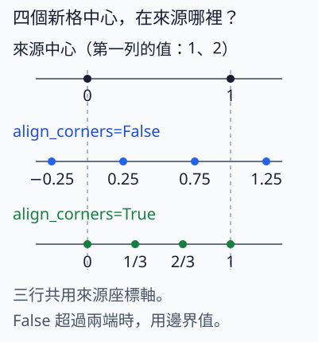

# 11.2 特徵融合：把深層資訊送回細網格

[在 Colab 執行本節](https://colab.research.google.com/github/birdhackor/learn_to_yolo/blob/lessons-v0.6.1/notebooks/11-fusion.ipynb){ .md-button }

第 10 章加了 8×8 的細 head，讓細格子也能輸出框。但細 head 只拿到淺層特徵，而淺層特徵的「語義」可能不足。本節把深層特徵的資訊送回 8×8 的細網格，和淺層特徵合在一起，這就是特徵融合。讀完你能一步步追出融合時每一步的 shape，說出 concat（串接）需要什麼條件，並手算這個融合模組的參數與記憶體。

這裡的「語義」指特徵能判斷「這一塊是什麼東西」的程度。以第 10 章的 TwoScale 模型為例：64×64 的輸入經過三次 3×3、stride 2 的卷積，得到 8×8 的淺層特徵（第 10 章叫 fine feature），每一格的理論感受野是 15×15 pixel。感受野是原圖中可能影響這一格的範圍（第 1 章）。再多一層卷積，得到 4×4 的深層特徵（coarse feature），每格的理論感受野是 31×31 pixel。深層每格看得較廣，比較有機會分辨這一塊是物件還是背景；但每格間距 16 pixel，位置比較粗。FPN（Feature Pyramid Network，特徵金字塔網路，下面會介紹）論文也這樣描述：淺層特徵的語義較弱，但位置較準。融合就是讓 8×8 的每一格，同時拿到淺層的細位置和深層看得較廣的判斷。

本節只加入這一條從深層到淺層的融合，不同時改 anchor、資料增強（augmentation：訓練時對圖片做翻轉等變化，框也跟著變；下一節介紹）或 loss。

前置：第 10 章的[多尺度 head](10-multiscale.md)（8×8 細 head 與 4×4 粗 head 怎麼接），以及第 1 章的[卷積 shape](01-small-cnn.md)（卷積後的 shape、感受野與參數怎麼算）。

## 融合放在哪裡：neck 與特徵金字塔

偵測模型可以分成三段：backbone（主幹，從圖片提取特徵的前段網路）把圖片變成特徵；head（輸出框與類別的預測器）把特徵變成每格的輸出；neck 夾在兩者之間，負責整理或融合特徵。本節的融合模組就是一個很小的 neck。

談 neck 時常說「特徵金字塔」。同一張圖在網路不同深度會得到多張特徵圖，越深的越小、格子越粗。把它們由大到小疊起來，就像一座下大上小的金字塔，最深、最粗的一層在塔頂。下面幾個方向名稱，都是照這座金字塔的上下來取的：

- **top-down（由上而下）**：從塔頂（深、粗）往塔底（淺、細）送資訊，也就是本節的深→淺方向。
- **bottom-up（由下而上）**：反過來，從淺層往深層送。
- **lateral connection（橫向連接）**：把 backbone 裡同一網格大小的特徵橫著接過來，和 top-down 送來的特徵合併。本例就是 8×8 的淺層特徵，也就是下圖中綠色的 lateral 橫向線。

本節只示範一次深→淺融合：1×1 reduce → nearest 上取樣 → concat → 3×3 mix。圖把深、粗的特徵放上方，淺、細的特徵放下方，所以 top-down 的箭頭也由上往下。橫向接入的 shallow，就是 lateral connection。

程式沒有圖片與 backbone，也沒有接 head：`shallow`、`deep` 是互不相關的隨機張量，shape 分別是 `[1,8,8,8]`、`[1,16,4,4]`。圖中實線只畫本節真的計算的四步；backbone、head 與 PAN 完整路徑另放下方的選讀比較。本節只確認 shape、梯度與參數，不測融合是否改善偵測。

本例借用第 10 章 stride 8／16 的尺度概念，channel 則從第 10 章的 16／32 改成 8／16。它不是完整的 FPN、PANet 或 YOLOv4／v5 neck：這裡用 concat 和單一 3×3 mix，沒有 BatchNorm、SiLU、C3、第三個尺度或 bottom-up 路徑。若接回第 10 章，只有細 head 改吃融合特徵；粗 head 仍直接接 deep，本節不動它。


看圖時先沿藍線追 Deep → reduce → nearest → concat → mix，再看綠線：Shallow 保持 8×8，直接橫向接入 concat。兩路在同一個 8×8 網格合流；輸出是融合特徵，還不是 head 的框預測。

## 為什麼不能直接 concat

在真實網路裡，同一張 64×64 的輸入經過 backbone，總 stride 8 的淺層特徵有 8×8 格，總 stride 16 的深層特徵有 4×4 格。總 stride 是從輸入到這一層、各層 stride 的乘積：例如三次 stride 2 就是 2×2×2=8，代表相鄰兩格在原圖相隔 8 pixel。兩層的總 stride 本來就不同（8 和 16）。

本節程式裡，淺層特徵是變數 `shallow`，形狀 `[B,8,8,8]`，也就是 8 個 channel、8×8 格（`[B,C,H,W]` 依序是 batch、channel、高、寬）。它的角色對應第 10 章 stride 8 的 fine feature，但只有 8 channel（第 10 章是 16）。深層特徵是變數 `deep`，形狀 `[B,16,4,4]`：16 個 channel、4×4 格，角色對應第 10 章 stride 16 的 coarse feature（第 10 章是 32 channel）。淺層格子細、位置準；深層 channel 較多、網格較粗。

沿 channel 軸（dim=1）concat 時，其他軸都要一樣長。兩者的最後兩軸 H、W 不同（8×8 對 4×4），所以不能直接接。必要的一步是把深層特徵放大到 8×8，這叫上取樣（upsample）：把較粗的特徵圖放大成更多格。本節用最簡單的 nearest（最近鄰）：每個新格子直接抄來源對應格的值。放大 2 倍時，輸出的第 0、1 列都抄來源第 0 列，第 2、3 列都抄來源第 1 列，以此類推，欄也一樣。放大後格子數對上了，但深層的內容仍是每 2×2 格同一個值，細節並沒有變多（後面「用四個數看上取樣」會示範）。

整個融合分成四步：

1. **reduce**（1×1 卷積）：`[B,16,4,4]` → `[B,8,4,4]`。1×1 只改 channel，不改 4×4 格。這一步不是 concat 的必要條件，下方說明為什麼仍然要做。
2. **nearest 上取樣**：`[B,8,4,4]` → `[B,8,8,8]`，把深層特徵放大到淺層的網格大小。
3. **concat**：`[B,8,8,8]` 接 `[B,8,8,8]` → `[B,16,8,8]`。channel 是 8+8=16，H、W 仍是 8×8。
4. **mix**（3×3 卷積）：`[B,16,8,8]` → `[B,8,8,8]`，把兩路混合成 8 channel。

沿 channel 軸 concat 的必要條件是 channel 以外的軸（B、H、W）都相同。本例兩者的 B 一樣，H、W 不同，所以一定要先上取樣到 8×8；channel 數則不必相同。不先減 channel 也能合法 concat：深層直接上取樣成 `[B,16,8,8]`，和淺層接成 `[B,24,8,8]`；只是 mix 要改成 24 channel 輸入，成本也跟著改變。完整程式裡的斷言（assert）也確認了這件事。

那為什麼還要先減 channel？好處之一是參數比較少：不減的話，mix 要從 24 channel 混成 8，參數 8×24×9+8=1736；先減的話，reduce 加 mix 只要 136+1160=1296（後面「參數與記憶體可以手算」會逐項算）。減完之後兩路都是 8 個 channel，若要改用逐值相加，channel 數也已經對齊（見後面改用相加的說明）。

??? note "先 1×1 或先上取樣，有差嗎？"

    nearest 只是複製，1×1 卷積又是每一格各自計算，所以兩者交換先後，結果完全相同。差別在計算量。乘加次數＝格數×輸入 channel×輸出 channel：先做 1×1，只要在 4×4 的 16 格上算，16×16×8=2048 次；先上取樣再做 1×1，就要在 8×8 的 64 格上算，64×16×8=8192 次，是 4 倍。

若改用相加（add），兩支的整個 shape 都必須相同，包括 channel 數：逐值相加後仍是 `[B,8,8,8]`，mix 要改成 8 channel 輸入。concat 則把兩組並排保留成 16 channel。

## 對照完整程式的 Fusion

完整程式把這四步寫成 `Fusion` 類別，在 `__init__` 裡建了兩層：

- `self.reduce = nn.Conv2d(16,8,1)`：1×1 卷積，把 16 channel 減成 8。
- `self.mix = nn.Conv2d(16,8,3,padding=1)`：3×3 卷積，把 16 channel 混成 8。`padding=1` 讓 8×8 仍是 8×8；沒有 padding 會變成 6×6。

下面是它的 `forward()`，和完整程式相同，只加了中文註解：

``` { .python data-excerpt="lesson_cases/11-fusion.py" }
def forward(self,shallow,deep,inspect=False):
    # shallow：[B,8,8,8]（8 channel、8×8 格）；deep：[B,16,4,4]（16 channel、4×4 格）
    reduced = self.reduce(deep)  # [B,8,4,4]：1×1 只改 channel，4×4 格不變
    # shallow.shape[-2:] 取最後兩軸 (H,W)，也就是 (8,8)
    up = F.interpolate(reduced,size=shallow.shape[-2:],mode='nearest')  # [B,8,8,8]
    # 沿 dim=1（channel 軸）接起來：[B,8+8=16,8,8]
    concat = torch.cat([shallow,up],dim=1)
    # mix 是 3×3、padding=1，輸出仍是 8×8：[B,8,8,8]
    output = self.mix(concat)
    # inspect=True 時連三個中間張量一起傳回，否則只傳回 output
    return (output,reduced,up,concat) if inspect else output
```

第一行除了兩個輸入，還有一個檢查用的參數 `inspect`，預設是 `False`。最後一行的意思是：`inspect` 是 `False` 時，只傳回融合輸出 `output`，所以平常寫 `model(shallow,deep)`，拿到的就是它；設成 `True` 時，會把 `output` 連同中間的 `reduced`、`up`、`concat` 一起傳回。完整程式寫的是 `output,reduced,up,concat = model(shallow,deep,inspect=True)`，等號左邊的四個變數依序接住傳回的四個張量。後面算 loss、做 backward 用的就是這次的 `output`；執行時印出的每一步 shape，量的也是這四個張量。所以印出的 shape，就是真正算出 loss 的那次 forward 裡的 shape（見後面「執行與核對」）。

`size=shallow.shape[-2:]` 直接要求「放大成和淺層一樣的高、寬」，比假定放大 2 倍更明確。另一種寫法是 `scale_factor=2`：不指定輸出大小，而是長、寬各放大 2 倍。有些輸入尺寸會讓兩種寫法的結果不同。例如輸入改成 100×100，照第 10 章 TwoScale 的做法經過三次 3×3、stride 2、padding 1 的卷積，依序得到 50、25、13，淺層是 13×13；再一次得到深層 7×7。`scale_factor=2` 會放大成 14×14，和 13×13 concat 時會報錯；寫 `size=shallow.shape[-2:]` 則直接得到 13×13。

??? note "延伸：FPN 也在合併後接 3×3 卷積"

    只是混合 channel 的話，1×1 卷積就做得到（上一節 CSP 就用 1×1 混合兩路）；3×3 除了混合兩路的 channel，還會看相鄰的格子。FPN 原論文在合併後也接一個 3×3 卷積，論文給的理由只有一句：減少上取樣造成的混疊（aliasing）效應，沒有再說明。常見的理解是放大後出現的假紋路，例如 nearest 複製出的 2×2 方塊邊界。本節沒有比較 mix 用 1×1 或 3×3 的差別，也沒有驗證這個效果。

??? note "進階：shape 對了，位置不一定對"

    shape 一致，不代表兩張特徵圖的同一格對到原圖的同一個位置（pixel 對齊）。要追蹤的是每一層每一格的中心落在原圖哪裡（格點位置），以及各層的 stride 與 padding。

    例如某條路上有一層 3×3 卷積沒有 padding：8×8 會變成 6×6，新的第 0 格的中心其實在原本的第 1 格。再用 `size=(8,8)` 把它放大回 8×8，shape 對了，但有些格子會對到相鄰一格的位置。裁切（把特徵圖邊緣切掉幾格；和前面章節把框夾回原圖範圍的裁切不是同一件事）造成的位移也一樣，不會因為 shape 一致就消失。

    本節的 `shallow`、`deep` 是隨機張量，沒有對應的原圖位置，所以不會遇到這個問題。接上真實的 backbone 時，就要逐層追蹤 stride、padding 與裁切。

## 用四個數看上取樣

單 channel 的 2×2 特徵 `[[1,2],[3,4]]`，用 nearest 放大成 4×4：

```text
1 1 2 2
1 1 2 2
3 3 4 4
3 3 4 4
```

每個來源值被複製成 2×2 共四格。若 loss 是所有輸出的總和，每個來源的梯度恰為 4。可以用第 3 章的推法：把某個輸入加一點點，看 loss 增加多少。把來源的 1 改成 1.001，4×4 裡的四個 1 都變成 1.001，總和增加 0.004，所以這個來源的梯度是 0.004÷0.001=4；四個來源都一樣。

這裡的「複製」不是生成四份新細節：深層特徵仍只有原本四個值。細位置的資訊來自淺層特徵，3×3 的 mix 學習怎麼使用兩路。

本節程式只用 nearest。另一種 bilinear（雙線性插值）會依距離混合相鄰來源值，產生中間值；方法與設定會影響結果和梯度，不能當成完全一樣。這裡的插值指由已知格算出放大後的新格，和第 6 章算 AP 時的插值是兩回事。以下座標與梯度比較不影響本節四步主例，可先跳過。

??? note "選讀：bilinear 的來源座標、align_corners 與梯度"

    仍用 `[[1,2],[3,4]]` 這張 2×2 特徵圖，放大到 4×4。來源格子的中心座標是 0、1；新格子的中心要先換回來源座標，再依距離分配權重。`align_corners` 決定的是這個對應，不是有沒有保留原本的數字。

    

    **`align_corners=False`（PyTorch 預設）**：第一列四個新格的中心換回來源座標是 −0.25、0.25、0.75、1.25。超出來源中心範圍時用邊上的值；介於 0 和 1 時依距離加權。因此第一列是 1、0.75×1+0.25×2＝1.25、0.25×1+0.75×2＝1.75、2。

    **`align_corners=True`**：第一個與最後一個新格中心對齊來源的兩端中心，中間兩點位於 1/3、2/3，所以第一列是 1、4/3、5/3、2。圖只畫水平方向；垂直方向也照相同規則換算。

    **loss 換了，梯度也會換。** 若 loss 剛好是全部輸出總和，bilinear 每個來源的梯度也仍是 4。這是這個例子的特例，不能推成兩種方法的梯度永遠相同。

    若 loss 改成 16 個輸出平方的平均，nearest 的每個來源值 s 被複製 4 次，梯度是 4×2s/16＝s/2，也就是 `[[0.5,1],[1.5,2]]`。預設設定的 bilinear 則是 `[[0.78125,1.09375],[1.40625,1.71875]]`。完整程式對融合輸出用的就是平方平均，但沒有拿這個 2×2 例子比較 bilinear；這裡是補充算例。因此實驗紀錄要同時寫插值方法與 `align_corners` 等設定。

## 參數與記憶體可以手算

卷積的參數用第 1 章的公式 \(C_{out}(C_{in}k^2+1)\)。乘開就是 \(C_{out}\times C_{in}\times k^2\) 個權重，加上 \(C_{out}\) 個 bias（每個輸出 channel 一個），所以下面都寫成「輸出×輸入×k²＋輸出」（1×1 時 k²=1，省略不寫）。本例：

- reduce（1×1，16→8）：`8×16+8=136`
- mix（3×3，16→8）：`8×16×9+8=1160`
- 合計 1296。

1296 是本節這個教學用迷你 neck 自己的參數，不是直接加在第 10 章模型上的成本。若接回第 10 章（淺層 16 channel、深層 32 channel）：

- reduce 把 32 channel 減成 16：`16×32+16=528`
- concat 後是 16+16=32 channel
- mix 把 32 channel 混成 16：`16×32×9+16=4624`
- 這份 neck 合計 5152 個參數。

mix 輸出 16 channel，原本吃 16 channel 的 `fine_head` 才不必改。

記憶體也會增加。concat 後的中間特徵有 `B×16×8×8` 個數，比單路 8 channel 多。以 float32、B=1 為例：16×8×8=1024 個數，每個 float32 占 4 bytes，僅這張 concat 就是 4096 bytes（4 KiB）。實際訓練時，還要暫存其他層的中間輸出和梯度。這些中間輸出也叫 activation，這裡指各層輸出的張量，反向傳播時要用到。它和第 3 章的激勵函數（activation function，例如 ReLU）不是同一個意思；本例的 `Fusion` 其實沒有 ReLU。

## 執行與核對

可以用頁首的「在 Colab 執行本節」按鈕執行，或在 repo 根目錄執行 `PYTHONPATH=. python lesson_cases/11-fusion.py`。應核對四件事：

1. 輸出第一行的 `nearest example`：2×2 例子放大後的 4×4 矩陣和手算相同。
2. 同一行的 `source gradient`：2×2 例子的來源梯度全為 4。
3. 第二行的 `shapes`：先是兩個輸入 shallow `(1, 8, 8, 8)`、deep `(1, 16, 4, 4)`，接著依序是 reduce `(1, 8, 4, 4)`、nearest `(1, 8, 8, 8)`、concat `(1, 16, 8, 8)`、mix `(1, 8, 8, 8)`，和上面「整個融合分成四步」一致（這裡 B=1）。後四項量的是 `inspect=True` 那次 forward 傳回的 `reduced`、`up`、`concat`、`output`。最後的 mix `(1, 8, 8, 8)` 就是融合輸出 `[1,8,8,8]`（同一個 shape，只是印法不同），程式也用斷言 `assert output.shape == (1,8,8,8)` 核對。
4. 第三行的 `parameters`：參數共 1296。

此外，完整程式用「輸出平方的平均」當 loss，對融合輸出做一次 backward。這個 loss 沒有偵測上的意義，只是把輸出收成一個數，好呼叫 `backward()` 算梯度。斷言確認 `shallow`、`deep` 兩個輸入的梯度都是有限值（不是 inf 或 NaN）而且不全為 0，表示兩條路都真的連到輸出。接著實際做一次 SGD 更新，並用斷言確認 mix 的權重確實改變了。

只看輸入的梯度還不夠。假如把 `forward()` 裡 `F.interpolate(reduced,…)` 的 `reduced` 換成 `deep[:,:8]`（深層的前 8 個 channel），融合輸出就不再經過 reduce；可是 shape 照樣對得上，兩個輸入也照樣收到梯度。所以程式也斷言 reduce 與 mix 的每個參數（權重與 bias）的梯度都不是 `None`、都是有限值，而且不全為 0。第 2 章〈[訓練診斷](02-diagnostics.md)〉說過，backward 後梯度仍是 `None` 的參數，表示它這次沒有接進反向傳播；上面那樣改，reduce 的參數就是這種情況，這個斷言會失敗。

完整程式的斷言全都寫在三個 `print` 之前，所以三行都印出來，就表示斷言全部通過。第三行後半的 `both branches backward and one step` 是固定印出的字，摘要的就是上面這些梯度與更新的斷言。

這個實驗只檢查特徵怎麼接，沒有訓練偵測器，所以沒有小物件 AP 或速度的結論。

## 選讀：FPN、PAN 與 YOLO 的完整連線

歷史機制：

- [FPN](https://arxiv.org/abs/1612.03144)：用 top-down 路徑與 lateral connection 建構特徵金字塔。它把深層特徵放大後，和 lateral 那一支逐值相加，所以兩支的 channel 數必須相同；每次合併前，新接進來的 lateral（淺層）那一支先經過 1×1 卷積調整 channel。
- [PANet](https://arxiv.org/abs/1803.01534)（Path Aggregation Network，路徑聚合網路；本頁文字與圖中簡稱 PAN）：在 FPN 之外再增加一條 bottom-up 路徑。
- [YOLOv4](https://arxiv.org/abs/2004.10934) 與固定版本 [YOLOv5 v6.0 模型配置](https://github.com/ultralytics/yolov5/blob/956be8e642b5c10af4a1533e09084ca32ff4f21f/models/yolov5s.yaml)：都在 FPN 式的 top-down 路徑之後，再接一條 PAN 式的 bottom-up 路徑；YOLOv4 還把 PAN 原本的相加改成 concat。YOLOv5 v6.0 的配置檔裡（寫在 `head:` 底下），每次 top-down 合併都是 1×1 卷積 → nearest 放大 2 倍 → concat（直接接 backbone 的淺層特徵）→ C3 模組，和本節的四步同型。

??? note "PAN 為什麼還要一條淺→深的路？"

    backbone 本身就是從淺層算到深層，但這條路很長。PANet 論文指出，在 FPN 的 backbone 裡，淺層的資訊要傳到最深層，可能得經過上百層。PANet 另加一條不到 10 層的 bottom-up 短路徑，讓淺層較準的位置資訊比較容易傳到深層。本節沒有實作這條路徑。

上面這幾個設計不是同一篇論文提出的一個模組。本節簡化成一條深→淺的路徑：先用 1×1 減少深層的 channel，再放大、concat，最後用 3×3 卷積混合；上方四步主例已逐步示範。也就是只做一次 FPN 式的深→淺融合，不是完整的 PANet，也不聲稱重現完整的 YOLOv4／v5 neck：相對 YOLOv5，本節的 mix 只是一個 3×3 卷積而不是 C3，卷積後沒有 BatchNorm 與 SiLU，也沒有第三個尺度與 bottom-up 路徑。

和原始 FPN 相比，有幾處不同要分清楚。一是用 concat 代替相加：兩路的 channel 各自保留，交給後面的 3×3 卷積學怎麼混。二是 lateral 那一支沒有 1×1，淺層特徵直接接進 concat。這兩處都和 YOLOv3、YOLOv5 v6.0 的 top-down 合併相同：深層先接 1×1、再上取樣，然後直接和 backbone 的淺層特徵 concat。深層那一支的 1×1（本節的 reduce）FPN 也有：FPN 讓 backbone 每個尺度（stage）的輸出各接一個 1×1，最深那個尺度的 1×1 輸出就是 top-down 路徑的起點；之後每次合併，只有新接進來的 lateral 那一支接 1×1，從上面送下來的那一支不再接。另外，FPN 最深那個尺度的 1×1 輸出，也會再經過 3×3 卷積交給它自己的 head；本節的 reduce 只用在 top-down，粗 head 仍直接接 deep。相加與 concat 哪個比較好，本節沒有比較。

## 收益與代價

收益是細 head 可以同時利用淺層的空間細節，以及深層看得較廣的判斷。代價有三項：多了卷積層的參數與計算；多了要暫存的中間特徵（activation）；還要追蹤兩路的格子有沒有對齊（見上方〈進階：shape 對了，位置不一定對〉）。

深層的低解析度資訊，不一定救得回小物件：深層每格間距 16 pixel、看的範圍更大，小物件的訊號在那一格可能已被周圍背景沖淡；放大回 8×8 只是複製同一個值，補不回細節。融合做得不好，也可能把背景的訊號帶進細 head，使它在背景上多報框。正式比較時，應固定輸入、資料、訓練預算（例如步數）與 decode／NMS 的設定，只換 neck，再分別看小物件的表現與背景誤報。

## 常見錯誤

- **`torch.cat` 寫成 `dim=3`**：兩個 `[B,8,8,8]` 會沿寬度接成 `[B,8,8,16]`，這一步不會報錯；要到 mix 才因為輸入 channel 是 8、不是 16 而報錯。
- **改了 reduce 的輸出 channel，卻沒同步改 mix 的輸入 channel**：例如 reduce 改成輸出 12 channel，concat 後變成 8+12=20 channel，mix 卻仍寫 16 輸入，執行到 mix 就報錯。
- **把上取樣當成框座標的換算**：上取樣只是把特徵圖放大成更多格，框的座標不會因此跟著乘 2。接在融合特徵後面的細 head，解碼仍照它自己的 stride 8：例如格 (1,1)、格內偏移 0.5 的中心在 (1+0.5)×8＝12 pixel；誤用深層的 stride 16，就會算成 24 pixel。
- **先對整張特徵圖做 global pooling，又期待之後能定位**：global pooling（全域池化，例如第 4 章的 global average pooling）把每個 channel 的整張 H×W 壓成一個數，不再保留「哪一格」的空間排列。第 4 章示範過：特徵圖只有一格是 1、其餘是 0 時，不論這格在左邊或右邊，平均出來都一樣。放到本節：若先把深層特徵 global pooling 成 1×1 再上取樣回 8×8，64 格拿到的深層值全都一樣，深層那一路不帶任何「哪一格」的資訊。pooling 前的特徵就算因為圖邊、padding 等原因帶著一些位置資訊，也只是間接、不可靠的線索，不宜靠它定位（見第 4 章）。

## 自主練習

手算即可，不必改程式。先自己算，再展開答案。

1. 若淺層特徵是 `[2,12,10,10]`，深層先用 1×1 減到 12 channel，再上取樣，concat 之後的 shape 是多少？mix 的輸入 channel 要設成多少？
2. 承上題，若深層原本是 `[2,32,5,5]`：reduce 用 1×1 把 32 channel 減到 12，mix 用 3×3（padding=1），輸入 channel 用第 1 題的答案，輸出 12 channel。這個 neck 共有幾個參數？

??? note "參考答案"

    **第 1 題**：上取樣後深層是 `[2,12,10,10]`，沿 channel 軸 concat 得到 `[2,24,10,10]`；mix 的輸入 channel 必須是 24。

    **第 2 題**：reduce 是 12×32+12=396；mix 是 12×24×9+12=2604；合計 3000 個參數。

<!-- curriculum-evidence:start -->

## 實際執行紀錄

本節的完整程式於 2026-10-05 在 INTEL(R) XEON(R) PLATINUM 8573C（2 個執行緒）上用 PyTorch 2.9.1+cpu 執行，程式裡的 assert 全部通過。下面是那次印出的原始輸出；輸出裡若有計時或訓練得到的數字，換一台電腦會略有不同。每個數字的意思，以本頁正文的說明為準。[完整紀錄（JSON）](https://github.com/birdhackor/learn_to_yolo/blob/main/artifacts/checks/curriculum/11-fusion.json)

??? example "展開本次實際輸出"

    ```text
    nearest example [[1.0, 1.0, 2.0, 2.0], [1.0, 1.0, 2.0, 2.0], [3.0, 3.0, 4.0, 4.0], [3.0, 3.0, 4.0, 4.0]] source gradient [[4.0, 4.0], [4.0, 4.0]]
    shapes shallow (1, 8, 8, 8) deep (1, 16, 4, 4) -> reduce (1, 8, 4, 4) -> nearest (1, 8, 8, 8) -> concat (1, 16, 8, 8) -> mix (1, 8, 8, 8)
    parameters 1296 both branches backward and one step
    ```

<!-- curriculum-evidence:end -->
