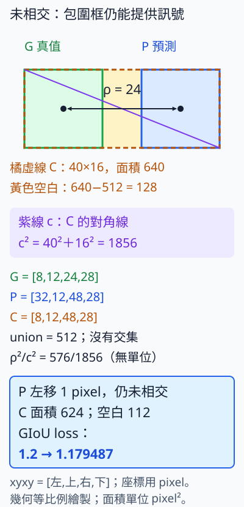

# C.11.4 IoU 類 loss：沒有重疊時還能往哪裡移

[在 Colab 執行本節](https://colab.research.google.com/github/birdhackor/learn_to_yolo/blob/lessons-v0.6.1/notebooks/11-iou-loss.ipynb){ .md-button }

第 10 章的小框在同一張訓練圖上，loss 已很低，IoU 卻沒有達到 0.5。這提醒我們，訓練比較的四個數字與評估要求的重疊，可能對同一錯誤給不同份量。第 7 章用座標 MSE，評估的 AP50 則要求預測與 GT 的 IoU 至少 0.5；第 4 章也看過，同樣偏 2pixel 對小框的 IoU 損失更大，正規化座標 MSE 卻可以相同。

現在希望定位 loss 直接回應「框與真值重疊得好不好」。自然的起點是 **1−IoU**：IoU 越高，loss 越小，完全重合為 0。但訓練初期預測可能完全沒碰到真值，附近移一點仍 IoU=0，這個 loss 沒有方向。本頁沿用一對人工框，比較 GIoU、DIoU、CIoU 加入的幾何訊號，手算四項 loss，再看真的更新一步會往哪裡走。

## 兩個 16×16 框，卻完全不碰

G 仍是紅物件的 `[8,12,24,28]`、中心 `(16,20)`；P 是 `[32,12,48,28]`、中心 `(40,20)`，單位 pixel。各面積 256，左右間隙 8。

先只讓 P 的中心 `(cx,cy)` 可更新，G 與 P 寬高固定，所以 P=`[cx−8,cy−8,cx+8,cy+8]`。四種 loss 都從這一對框起步，head、責任與增強不參與本次比較。



綠框 G 按全書慣例表示 GT，雖然物件是紅色。藍框 P 在右；橙虛線 C 是能框住兩者的最小矩形，union 是聯集。ρ標兩中心距離，紫線小寫 c 標 C 的對角線長，勿把 C 當類別數。

交集寬 `min(24,48)−max(8,32)=−8`，以 clamp(min=0)取 0；交集面積 0，聯集 512，所以 IoU=0，`L_IoU=1`。P 小幅移動仍沒有交集，loss 在附近是一塊平地，中心梯度 `[∂L/∂cx,∂L/∂cy]=[0,0]`。

這不是座標 MSE 沒有方向。直接比 pixel xyxy，誤差 `[24,0,24,0]`，MSE=288，中心梯度為 `[24,0]`，會往左推。MSE 的問題是沒有直接衡量重疊，而非不能處理分離框。288 的單位為 pixel²，第 7 章正規化 MSE 沒有單位，IoU 比例也沒有單位，三種 loss 大小不能直接相比。

IoU 算式的 min、max、clamp 會在區間邊界折彎。這裡分開的附近梯度為 0；左移 8pixel 剛好碰到 G 時，是不可微轉折點，不能沿用同一斜率。下文上下緣對齊也有折角，PyTorch 會依實作給一個梯度值。

## 包圍框與中心距離補上訊號

### GIoU：扣掉包圍框裡的空白

**GIoU（Generalized IoU，廣義 IoU）**多看 C 裡沒被兩框佔據的空白。這例 C=`[8,12,48,28]`，寬 40、高 16，面積 640；空白是 640−512=128，佔 20%。

\[
\mathrm{GIoU}=\mathrm{IoU}-\frac{\mathrm{area}(C)-\mathrm{union}}{\mathrm{area}(C)}=-0.2,
\qquad L_{\mathrm{GIoU}}=1-\mathrm{GIoU}=1.2.
\]

GIoU 的負值保留了分離程度，不應 clamp 成 0。P 左移 1pixel，C 寬變 39，空白減少到 112，loss 變 `1+112/624≈1.179487`；兩框仍沒重疊，卻已有下降。這就補上單純 IoUloss 在當前狀態缺少的訊號。

沿 x 的手算梯度是 0.02，SGD 減去學習率乘梯度：本例 lr=50，中心從 40 變 39，恰好左移 1pixel。y 方向位在上下緣對齊的折角，往上下都使 C 變高，PyTorch 此處給 0，故中心梯度是 `[0.02,0]`。

GIoU 補的只是一種訊號。小 P 若整個在 G 裡，C 與聯集都是 G，空白項為 0；P 在 G 內小幅移動時 IoU 也不變，就不能幫中心靠近。要對這種位置差提供訊號，可以直接比較中心距離。

??? note "GIoU 的負值、局部梯度與轉折點細算"

    本例 GIoU＝−0.2，是因為兩框分開、C 裡有 20% 是空白。反過來不一定成立：兩框有重疊、但 C 很大時，GIoU 也可能是負的。例如兩個交叉的細長框 `[0,4,10,6]` 與 `[4,0,6,10]`：交集 2×2＝4、聯集 36，IoU 約 0.111；C＝`[0,0,10,10]`，面積 100，GIoU 約 0.111−64/100≈−0.529。而兩框剛好相接時（本例 P 左移 8 pixel），C 剛好由兩框拼成，沒有空白，GIoU 是 0。GIoU 介於 −1 和 1 之間，負值是合法的訊號；若把它 clamp 成 0，兩框分開時的方向就丟了。

    P 往左移 1 pixel，變成 `[31,12,47,28]`：交集仍是 0，聯集仍是 512；C 變成 `[8,12,47,28]`，寬 39、面積 624，空白變成 7×16＝112。代入同一個式子：

    \[
    L_{\text{GIoU}}=1-\Bigl(0-\frac{112}{624}\Bigr)=1+\frac{112}{624}\approx1.179487.
    \]

    loss 比 1.2 低，而兩框仍未碰到。IoU＝0 時，\(L_{\text{GIoU}}=1+(\text{area}(C)-\text{union})/\text{area}(C)=2-\text{union}/\text{area}(C)\)，所以這個值也可以寫成 \(2-512/624\)，完整程式的斷言（assert）就是這樣寫的。

    這個下降可以寫成梯度。在 \(c_y=20\)、P 在 G 右側且兩框不重疊時，C 的左界固定在 8，右界是 \(c_x+8\)，所以 C 的寬剛好是 \(c_x\)，面積是 \(16c_x\)：

    \[
    L_{\text{GIoU}}=2-\frac{512}{16c_x}=2-\frac{32}{c_x},
    \]

    \[
    \frac{\partial L_{\text{GIoU}}}{\partial c_x}=\frac{32}{c_x^2}=\frac{32}{40^2}=0.02.
    \]

    用實際左移 1 pixel 前後的 loss 相減（差分）對照也差不多：左移 1 pixel，loss 少了 1.2−1.179487≈0.0205。

    y 分量呢？\(c_y=20\) 時，P 與 G 的上下緣剛好對齊；P 不論往上或往下移，C 都會變高，所以這裡也是一個轉折點（折角），兩側的斜率不同。PyTorch 在這種點會給一個值，本例 y 分量給 0。所以本例 GIoU 的中心梯度是 `[0.02,0]`；其中的 0 是轉折點上取的值，不代表 y 方向沒有影響。

    SGD 的更新是「參數減去學習率×梯度」：x 梯度是正的，減掉之後 \(c_x\) 變小，P 往左移。完整程式真的用學習率 lr=50 做一步：50×0.02＝1，一步剛好左移 1 pixel，中心從 40 到 39，可以直接對照上面手算的 1.179487。lr=50 就是為了這個對照刻意挑的。

### DIoU：看中心距離相對於包圍框的尺度

**DIoU（Distance-IoU，距離 IoU）**在 1−IoU 後加 `ρ²/c²`。ρ是中心距離，c 是包圍框對角線；兩者單位同為 pixel，平方相除沒有單位，圖與框等比縮放時此項不變。兩中心都在 C 內，ρ不超過 c，所以此項在 0～1。

\[
\rho^2=(40-16)^2=576,\qquad c^2=40^2+16^2=1856,
\]

\[
L_{\mathrm{DIoU}}=1-\mathrm{IoU}+\rho^2/c^2=1+576/1856\approx1.310345.
\]

它在小 P 包含於 G 時仍會罰中心偏移，不依賴 C 中有空白。本例沿 x 梯度約 0.012485 為正；lr=100 的一步把中心移到約 `(38.7515,20)`，loss 降至 1.294497，間隙仍約 6.75，沒有靠「先碰到 GT」才開始移。

分母 c 也會跟著位置變，所以**DIoU 縮小的是ρ²/c²，不保證每個下降方向都縮小ρ本身**。下面每列都是改位置後重算 loss，不是三步 SGD：

| P 中心 | 中心項ρ²/c² | DIoU loss |
| --- | --- | --- |
| 起點 `(40,20)` | `576/1856` | 1.310345 |
| 左移 1pixel `(39,20)` | `529/1777` | 1.297693 |
| 往下 1pixel `(40,21)` | `577/1889` | 1.305453 |

往下時中心距離平方從 576 增加 577，但 C 高從 16 變 17，分母相對增幅更大，比例反而下降。三位置都沒有交集，所以總 loss 也下降。起點 y 仍在折角，完整程式實際取得 y 梯度為 0；不要把這個 0 讀成 y 不影響 loss。

??? note "DIoU 的 x 梯度與一步更新細算"

    P 往左移時中心距離變小，可是 c 也跟著變小，這個比例一定會降嗎？算梯度就知道。在 \(c_y=20\)、P 在 G 右側且兩框不重疊時，\(\rho^2=(c_x-16)^2\)、\(c^2=c_x^2+16^2\)（\(c_x\) 是 P 中心的 x 座標，不是 c 的分量，只是這裡剛好等於 C 的寬；16 是 C 的高），所以

    \[
    L_{\text{DIoU}}=1+\frac{(c_x-16)^2}{c_x^2+256},
    \]

    \[
    \frac{\partial L_{\text{DIoU}}}{\partial c_x}=\frac{2(c_x-16)(256+16c_x)}{(c_x^2+256)^2},
    \]

    這一步用商的微分 \((f/g)'=(f'g-fg')/g^2\)，其中 \(f=(c_x-16)^2\)、\(g=c_x^2+256\)，分子 \(2(c_x-16)(c_x^2+256)-2c_x(c_x-16)^2\) 提出 \(2(c_x-16)\) 後就是上式。代入 \(c_x=40\)：

    \[
    \frac{2\cdot24\cdot(256+16\cdot40)}{1856^2}=\frac{43008}{3444736}\approx0.012485>0.
    \]

    不會微分也能驗算：把 \(c_x\) 從 40 改成 39，\(L_{\text{DIoU}}\) 變成 \(1+529/1777\approx1.297693\)，少了約 0.0127，和 0.012485 接近。

    梯度是正的，往左走 loss 會下降，所以梯度下降有方向。完整程式用 DIoU 做一次真正的 SGD 更新，學習率 lr=100：一步左移 100×0.012485≈1.2485 pixel，中心從 40 到約 38.7515，\(L_{\text{DIoU}}\) 從 1.310345 降到約 1.294497。兩框的間隙從 8 變成約 6.75，走完一步仍未重疊。lr=100 只是為了讓位移看得見；這兩個學習率都只為這個只動中心的小實驗而挑，不能直接搬到偵測器的網路參數上。

??? note "GIoU 也有失靈的時候：一框整個在另一框裡"

    本例 GIoU 已經能把 P 往左推，為什麼還需要 DIoU？看一個 GIoU 失靈的情況（手算例子，完整程式沒有這一段）。把 8×8 的 P＝`[10,14,18,22]` 放進 G 裡面：P 的中心是 `(14,18)`，G 的中心是 `(16,20)`。P 整個在 G 裡，C 就是 G，空白項＝(256−256)/256＝0，GIoU 退化成 IoU：\(L_{\text{GIoU}}=L_{\text{IoU}}=1-64/256=0.75\)。P 在 G 裡小幅移動時，交集、聯集與 C 都不變，所以這兩個 loss 的中心梯度都是 `[0,0]`，不會把 P 往哪裡推。

    DIoU 多了中心項。C 就是 G，\(c^2=16^2+16^2=512\) 固定不變，中心項只剩 \(\rho^2/512\)。本例 \(\rho^2=2^2+2^2=8\)，\(L_{\text{DIoU}}=0.75+8/512=0.765625\)。ρ 越小 loss 越小，所以梯度下降會把 P 的中心推向 G 的中心 `(16,20)`。

    DIoU 論文指出：框有包含關係時，GIoU loss 會退化成 IoU loss；兩框不重疊時，GIoU loss 傾向先把預測框放大到和目標重疊；IoU 與 GIoU loss 也有收斂慢（要訓練更多步，loss 才會降下來並穩定）與框回歸不準的問題。

### CIoU：再比較寬高比

**CIoU（Complete IoU，完整 IoU）**再加寬高比差異 `αv`：`L_CIoU=L_DIoU+αv`。v 比較兩框寬÷高，比例相同為 0；α是依重疊調整的權重，重疊少時更側重拉近位置，重疊高時更重視形狀。本例兩框都是正方形，v=0，所以 CIoU 與 DIoU 同為 1.310345。

寬高比不同才用得到新增項；更完整的算式、為何反傳把α當固定權重，以及練習的不同寬高比例子放在下面。此實驗只學中心、寬高不動，v 不隨中心改變，所以也測不到 v 對寬高的梯度。

??? note "CIoU 的細節：v、α、detach 與程式（本例 v＝0；第 3 題會用到）"

    v 與 α 的式子如下；\(w_G,h_G\) 是 G 的寬、高，\(w_P,h_P\) 是 P 的寬、高：

    \[
    v=\frac{4}{\pi^2}\Bigl(\arctan\frac{w_G}{h_G}-\arctan\frac{w_P}{h_P}\Bigr)^2,
    \]

    \[
    \alpha=\frac{v}{(1-\text{IoU})+v}.
    \]

    為什麼用 arctan（反正切，程式裡寫 atan；r＞0 時，arctan r 是滿足 tan θ＝r、介於 0 和 π/2 之間的角 θ）？寬高比可以從接近 0 一直到無限大，直接相減的話，差值沒有上限。arctan 把正的寬高比變成 0 到 π/2 之間的角度，正方形是 arctan 1＝π/4。兩個角度的差介於 −π/2 和 π/2 之間，平方後小於 π²/4，乘上 4/π² 就讓 v 落在 0 到 1 之間（到不了 1）。

    α 是 v 的權重，和學習率 lr 無關。同樣的 v 之下，重疊越少（1−IoU 越大），α 越小，αv 的份量也越小，loss 主要用來拉近位置、增加重疊；IoU 接近 1 時 1−IoU 接近 0，α 才變大，開始重視寬高比。

    以下是改寫自完整程式的示意，不能單獨執行；atan 對應完整程式的 `torch.atan`：

    ```python
    center_penalty = squared_center_distance / squared_enclosing_diagonal  # ρ² / c²
    v = 4 / math.pi**2 * (atan(gt_ratio)-atan(pred_ratio))**2  # gt_ratio＝wG/hG，pred_ratio＝wP/hP
    alpha = (v / (1-iou+v).clamp(min=1e-6)).detach()  # α：分母下限 1e-6，再 detach
    ciou_loss = 1-iou + center_penalty + alpha*v
    ```

    `.detach()`（第 2 章說過：把 tensor 從計算圖剪下）讓 α 在反傳時被當成常數權重：梯度不會經過 α 的算式，αv 這一項的梯度只經過 v。[YOLOv5 v6.0 的 `bbox_iou`](https://github.com/ultralytics/yolov5/blob/956be8e642b5c10af4a1533e09084ca32ff4f21f/utils/metrics.py#L223-L227) 在 `torch.no_grad()` 下算 α，效果相同；DIoU 論文推導 v 的梯度時也把 α 當常數。論文另外說，它自己的實作把 v 梯度裡的 1/(w²+h²) 換成 1，以免 w、h 在 0～1 之間時梯度太大；本節程式沒有這樣做，用的是 autograd 算出的完整梯度。

    兩框完全相同時，IoU＝1、v＝0，α 的分母 (1−IoU)+v 是 0，會變成 0/0。`clamp(min=1e-6)` 把分母下限設成 epsilon（1e-6），α＝0/1e-6＝0，αv＝0，CIoU loss 也是 0。示意裡 α 分母的 clamp 和完整程式相同；完整程式在中心項的分母也加了同樣的 clamp，示意裡省略了。

[GIoU 原論文](https://arxiv.org/abs/1902.09630)提出包圍框項；[DIoU／CIoU 論文](https://arxiv.org/abs/1911.08287)提出中心與寬高比項。[YOLOv4](https://arxiv.org/abs/2004.10934)與[YOLOv5 v6.0 定位 loss](https://github.com/ultralytics/yolov5/blob/956be8e642b5c10af4a1533e09084ca32ff4f21f/utils/loss.py#L135-L136)使用 CIoU。這裡保留其幾何關係，沒有重現完整訓練。

## 兩次單步更新的核對

用頁首 Colab 或 `PYTHONPATH=. python lesson_cases/11-iou-loss.py`。GIoU 的 lr 50、DIoU 的 lr 100 兩次互相獨立，都從 `(40,20)` 起步；特大 lr 是為了讓只學兩個中心數值的位移可見，不可直接搬到網路權重。

輸出依序核對 GIoU 梯度與更新後 1.179487、四項初始 loss、普通 IoU 零梯度、DIoU 更新後中心與 loss，以及 P=G 時四 loss 為 0。字典鍵 iou／giou 存的是 loss，不是 IoU 本身。斷言還核對 GIoU 中心 `(39,20)`、DIoU 有限且 x 正梯度、中心左移及 loss 下降。

普通 IoU 與 GIoU 梯度用 `torch.autograd.grad(L,center,retain_graph=True)[0]` 直接回傳，沒有寫入 `.grad` 或更新；保留計算圖可再求其他 loss 梯度。真正的 SGD 更新是後面的 backward 與 step。真值先檢查有限與正寬高；分母 clamp 到 epsilon=1e-6 只能防除 0，不能修錯標註。

??? note "若寬高也可學，框還可能先變大"

    本例只學中心、寬高固定，而 v 只依寬高，所以不論兩框寬高比是否相同，CIoU 對中心的梯度都和 DIoU 相同；這個實驗測不到 v 的梯度。寬高固定，也藏起了 GIoU、DIoU 對寬高的梯度：若寬高也可學，本例起點 \(L_{\text{GIoU}}\) 對 P 的寬 w 的梯度是 −0.015，梯度下降會一邊左移、一邊把 P 加寬，讓 C 裡的空白變少；\(L_{\text{DIoU}}\) 對 w 的梯度約 −0.006688（P 變寬時 c 變長，ρ²/c² 變小），也會加寬。GIoU 論文推出同一個 \(2-\text{union}/\text{area}(C)\)，並說 IoU＝0 時最小化它，就是讓 C 變小、同時讓預測框變大。所以兩框不重疊時，這兩種 loss 除了把框往左推，也會把框撐大；把寬高接回可學參數時看到預測框先變大，是 loss 本身的行為。要驗證 v 與寬高的梯度，得把寬高也設成可學參數。α 的 detach 把 α 當固定權重，仍保留 v 與中心項的梯度，所以也不會從 α 多出一條對中心的梯度。

## 放進 MiniYOLO 時要注意

MiniYOLO 仍用第 7 章 MSE。若替換，先只取正格，再把預測與 target 從格內中心比例、全圖寬高比例，轉成同一座標系的 xyxy。預測側的轉換必須留在計算圖內：不能直接用含 no_grad、score 門檻與 NMS 的 `decode_grid`，也不能 detach，否則 loss 傳不回 head。

框 loss 不能取代 objectness 和類別，非正格仍不算定位；沒有正格時框 loss 為 0 的分支也要保留。MSE 與 IoU 類 loss 量尺不同，原框權重 5 不能照一個例子的比例直接換。IoUloss 在 0～1，GIoU 與 DIoUloss 在 0～2，需重新看它們與其他 loss 的份量、有限值及梯度。

這次確認了分離框也能得到幾何梯度，還需處理不可微轉折、分母與權重。若要採用到偵測器，固定來源切分、輸入與訓練預算，比 held-out AP 及收斂所需步數；不能從移動一個框推出品質提升或 CIoU 一定最好。

## 常見錯誤與自主練習

常見錯誤：

- xyxy 的次序反了（例如左右對調），算出負的寬高與面積。完整程式只檢查真值框；預測框的寬高會先 clamp 到至少 1e-6，所以左右對調時不會報錯，loss 照樣算得出來，意思卻錯了。
- 沒有 epsilon 時，寬或高為 0 的退化框可能讓分母變成 0。
- 把 GIoU 限制到 [0,1]，丟掉兩框分開時的負值訊號。
- 以為 IoU loss 能代替全部 objectness／class 的監督。

自主練習（紙筆題；先自己算，再展開答案）：

1. 若 P＝G＝`[8,12,24,28]`：C 的面積、聯集、ρ、v 各是多少？四個 loss 各是多少？
2. 若 P 只往左移 4 pixel，變成 `[28,12,44,28]`（中心 `(36,20)`，兩框仍隔 4 pixel）：\(L_{\text{IoU}}\) 與它的中心梯度是多少？再求 \(L_{\text{GIoU}}\)、\(L_{\text{DIoU}}\) 的值（這兩項只求 loss，不求中心梯度）。
3. **選讀題：先展開上方〈CIoU 的細節〉。** G 不變，P＝`[28,12,60,28]`（寬 32、高 16）：求 v、α 與 \(L_{\text{CIoU}}\)（arctan 2 請用計算機，約 1.107149）。

??? note "參考答案"

    **第 1 題**：C 就是 G，面積 256；聯集也是 256。兩個中心重合，ρ＝0；寬高比相同，v＝0。IoU＝1，所以四個 loss 都是 0。這時 α 的分母是 0，靠 `clamp(min=1e-6)` 避開 0/0（見上方 CIoU 的摺疊說明）。完整程式最後用斷言核對這個情況，並印出 `exact boxes: all four losses zero`。

    **第 2 題**：交集寬＝min(24,44)−max(8,28)＝24−28＝−4，取 0 後交集是 0。IoU 仍是 0，所以單純 IoU loss 仍是 1，梯度仍是 `[0,0]`。C＝`[8,12,44,28]`，面積 36×16＝576，\(L_{\text{GIoU}}=2-512/576\approx1.111111\)。ρ＝36−16＝20，\(c^2=36^2+16^2=1552\)，\(L_{\text{DIoU}}=1+400/1552\approx1.257732\)。完整程式裡的 `shifted_center` 就是這個例子，用斷言核對了 \(L_{\text{IoU}}\)、它的中心梯度與 \(L_{\text{DIoU}}\)。從起點總共左移 8 pixel（中心 `(32,20)`、P＝`[24,12,40,28]`）時會剛好碰到 G，那是轉折點，不能沿用這個零梯度結論。

    **第 3 題**：P 的中心是 `(44,20)`。交集寬＝min(24,60)−max(8,28)＝24−28＝−4，取 0 後 IoU＝0。P 的寬高比是 32/16＝2，G 是 1，所以 \(v=\frac{4}{\pi^2}(\arctan1-\arctan2)^2\approx0.041956\)，\(\alpha=v/(1+v)\approx0.040267\)。C＝`[8,12,60,28]`，\(c^2=52^2+16^2=2960\)，\(\rho^2=(44-16)^2=784\)，\(L_{\text{DIoU}}=1+784/2960\approx1.264865\)。最後 \(L_{\text{CIoU}}=L_{\text{DIoU}}+\alpha v\approx1.264865+0.001689\approx1.266554\)。

    完整程式的 `losses(predicted, target)` 有兩個參數，都是 xyxy 框：預測框在前，真值框在後。想用程式核對第 2、3 題，可以在 Colab 執行完完整程式後，新增一格執行；在自己的電腦上，則執行 `PYTHONPATH=. python -i lesson_cases/11-iou-loss.py`，程式跑完出現 `>>>` 提示後再貼上：

    ```python
    G = torch.tensor([8., 12., 24., 28.])
    for P in ([28., 12., 44., 28.], [28., 12., 60., 28.]):  # 第 2 題、第 3 題的 P
        result = losses(torch.tensor(P), G)
        print({name: round(value.item(), 6) for name, value in result.items()})
    ```

    印出的兩行依序是第 2、3 題的四個 loss，上面手算過的項目都對得上。v 與 α 不在 `losses` 回傳的字典裡，請對照上面的答案。

<!-- curriculum-evidence:start -->

## 實際執行紀錄

本節的完整程式於 2026-10-08 在 AMD EPYC 9V74 80-Core Processor（2 個執行緒）上用 PyTorch 2.9.1+cpu 執行，程式裡的 assert 全部通過。下面是那次印出的原始輸出；輸出裡若有計時或訓練得到的數字，換一台電腦會略有不同。每個數字的意思，以本頁正文的說明為準。[完整紀錄（JSON）](https://github.com/birdhackor/learn_to_yolo/blob/main/artifacts/checks/curriculum/11-iou-loss.json)

??? example "展開本次實際輸出"

    ```text
    GIoU gradient [0.02, 0.0] after 1-pixel real SGD move 1.179487
    initial losses {'iou': 1.0, 'giou': 1.2, 'diou': 1.310345, 'ciou': 1.310345}
    non-overlap plain IoU center gradient [0.0, 0.0]
    DIoU center after one real step [38.7515, 20.0] loss 1.294497
    exact boxes: all four losses zero
    ```

<!-- curriculum-evidence:end -->
