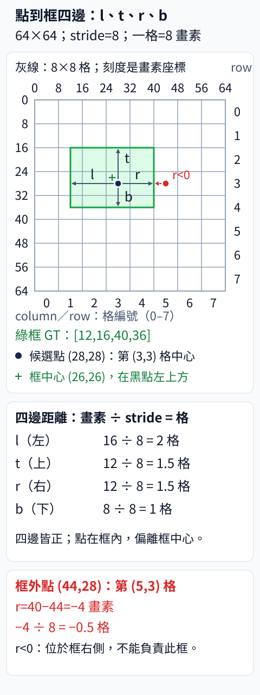

# 12.1 Anchor-free：從候選點量出四條邊

[在 Colab 執行本節](https://colab.research.google.com/github/birdhackor/learn_to_yolo/blob/lessons-v0.4.0/notebooks/12-anchor-free.ipynb){ .md-button }

一個候選點（特徵圖上可以各自輸出一個框的位置）一定要先選「寬 20、高 10」這類 anchor，再學偏移嗎？如果資料的長寬比改變，這組預先選好的尺寸還合適嗎？Anchor-free（不用 anchor）就是不使用這種預設的寬高模板；本節的做法是讓每個候選點直接預測它到框左、上、右、下四條邊的距離。本節換掉框的表示方式，但保留兩件事：候選點，以及「哪個候選點負責哪個物件」的規則（assignment）。讀完你能在框和四個距離之間來回換算，也能說明為什麼拿掉 anchor 之後仍然需要 assignment。

前置：[座標轉換與還原](04-coordinates.md)（框座標）、[Grid MiniYOLO targets](07-targets.md)（第 7 章的 grid MiniYOLO）、[YOLOv2 anchor](09-anchors.md)、[YOLOv3 多尺度](10-multiscale.md)（stride）。

歷史機制：YOLOv8 讓特徵圖上的每個候選點預測它到框四邊的距離，不需要預先給 anchor 尺寸。YOLOv8 是 Ultralytics 公司在 2023 年發布的版本，沒有發表正式論文；本節對照的是它的原始碼（頁尾連結）。用點到四邊的距離表示框，更早的 [FCOS](https://arxiv.org/abs/1904.01355)（2019）就用過。

本節從第 7 章直接預測框的 grid MiniYOLO 改起，簡化成一個候選點、四個正距離，用 Smooth L1（一種 loss，定義見下文）來學。實驗只確認兩件事：框和四個距離能互相換算（encode：框換成距離；decode：距離換回框），以及四個距離真的能用梯度下降學到；這不是重現整套 YOLOv8。下一節 [12.2 Decoupled head](12-decoupled-head.md) 沿用這種四邊距離表示；[12.4 節](12-dfl.md)的 DFL（Distribution Focal Loss）再把每條邊改成輸出一個機率分佈：距離是 0 格、1 格、2 格……各有多少機率，最後取期望值當距離。

## 一個物件的數字旅程

假想的輸入影像是 `64×64` 畫素，特徵圖 `8×8`，所以 stride 為 8 畫素／格，也就是相鄰兩格在輸入影像上相隔 8 畫素。這兩個大小只用來定出 stride=8，程式不會真的計算特徵圖。

候選點就是特徵圖每一格對應到輸入影像上的位置；程式裡叫 `point`，Ultralytics 的原始碼叫 `anchor_points`（這個名稱容易誤會，見後面的「名詞陷阱」）。真實的密集 head（特徵圖每一格都輸出一組預測的 head）通常取各格中心當候選點：`((column+.5)×stride,(row+.5)×stride)`，column、row 是第幾欄、第幾列，從 0 起算。本例的候選點是第 (3,3) 格（column=3、row=3）的中心：`((3+0.5)×8,(3+0.5)×8)=(28,28)`。

真值框 `xyxy=[12,16,40,36]`。把點記成 (px,py)=(28,28)，點到框左、上、右、下四邊的畫素距離是 `[px−x1,py−y1,x2−px,y2−py]=[28−12,28−16,40−28,36−28]=[16,12,12,8]`。各除以 stride 8，得到特徵格單位的 `ltrb=[2,1.5,1.5,1]`；ltrb 是 left、top、right、bottom 的縮寫，1 格＝8 畫素。距離不必是整數：格子只決定候選點放在哪裡，框邊不必落在格線上。



看圖時注意：黑點 (28,28) 在第 (3,3) 格的正中央，卻不在框的正中央。框的中心是 `((12+40)/2,(16+36)/2)=(26,26)`，黑點在它的右下方，所以箭頭左長右短（l=16、r=12 畫素）、上長下短（t=12、b=8 畫素）。框外紅點 (44,28) 是同一列第 (5,3) 格的中心，量到右邊則是 −4 畫素（−0.5 格）。點不必在框中心，只要在框內，四個距離都為正。

| 欄位 | shape | 意義與單位 |
| --- | --- | --- |
| candidate points（候選點） | `[P,2]` | 輸入影像（64×64）畫素 `x,y`，例中 `P=1` |
| distance output（距離輸出） | `[B,P,4]` | `left,top,right,bottom`，特徵格單位 |
| decoded boxes（解碼後的框） | `[B,P,4]` | 輸入影像畫素 `x1,y1,x2,y2` |
| class logits（類別 logits） | `[B,P,C]` | 每個候選點、每個類別的分類輸出；本節的實驗不含（見 12.2 節） |

其中 B 是圖片數、P 是候選點數、C 是類別數。表格列出完整 head 的輸出規格。候選點的位置只由特徵圖大小和 stride 決定，每張圖都相同，所以沒有 B 軸；8×8 特徵圖每格一個點時 P=64，多尺度時把各尺度的點數相加。本例相當於只有一張圖（B=1），但其實沒有真的圖片，只有一個點和一個真值框，所以程式省去 batch 軸。距離與框實際的 shape 都是 `[1,4]`，這個 1 是 P，不是四邊中的一項。

解碼（decode）是反過來：先把格單位的距離乘回 stride 變成畫素，再由點減去左、上距離，加上右、下距離。記 stride 為 s，四個式子是 `x1=px−l×s`、`y1=py−t×s`、`x2=px+r×s`、`y2=py+b×s`。代入本例：`x1=28−2×8=12`、`y1=28−1.5×8=16`、`x2=28+1.5×8=40`、`y2=28+1×8=36`，回到原框。完整程式的 `decode` 就是這四式：

``` { .python data-excerpt="lesson_cases/12-anchor-free.py" }
def decode(points, distances, stride):
    left_top, right_bottom = distances[..., :2], distances[..., 2:]  # [l,t] 和 [r,b]
    return torch.cat((points - left_top * stride, points + right_bottom * stride), -1)
```

點和解出的框要用同一種單位。Ultralytics 的原始碼把候選點存成格單位，先在格單位解出框，最後才把整個框乘 stride；本頁的點已經是畫素，只有距離要乘 stride，解出的框不能再乘一次。

完整程式的 `main()` 先設定候選點和真值框，用前面的公式算出格單位的距離 `distance`（後面訓練要學的 target），再用兩個斷言（assert）核對：`distance` 等於手算的 `[2,1.5,1.5,1]`，解碼回來等於原框。`torch.allclose` 逐項比較兩個 tensor，每一項的差距都在容許誤差內就算相等（[4.2 節](04-coordinates.md)用過）。

``` { .python data-excerpt="lesson_cases/12-anchor-free.py" }
point = torch.tensor([[28., 28.]])         # 候選點的畫素 x,y：第 (3,3) 格的中心
gt = torch.tensor([[12., 16., 40., 36.]])  # 真值框 xyxy，畫素
# gt[:, :2] 是 (x1,y1)，gt[:, 2:] 是 (x2,y2)
# point - gt[:, :2] = (px-x1, py-y1)：左、上；gt[:, 2:] - point = (x2-px, y2-py)：右、下
# -1：沿最後一軸串成 [l,t,r,b]；/ 8：除以 stride，換成格單位
distance = torch.cat((point - gt[:, :2], gt[:, 2:] - point), -1) / 8  # 由真值算出的 target
assert torch.allclose(distance, torch.tensor([[2., 1.5, 1.5, 1.]]))
assert torch.allclose(decode(point, distance, 8), gt)
```

## 為何仍要 assignment

本節規定四個距離都要是正數。理由是：四個距離都大於 0，就等於 `x1<px<x2`、`y1<py<y2`，框一定包住這個點；而且寬＝(l+r)×stride、高＝(t+b)×stride 一定是正的，不會解出左右或上下顛倒的框。

現在把點移到同一列的 `(44,28)`，也就是第 (5,3) 格的中心，它在真值框的右側。右邊距離會變成 `40−44=−4` 畫素（−0.5 格），違反「距離為正」的規定。本節的輸出經過 softplus，永遠大於 0，根本表示不了 −0.5 格；這個點本來就不該負責這個框。完整程式最後一個斷言檢查的就是這件事：框外點 `outside` 的四個畫素距離 `[32,12,−4,8]` 至少有一個小於 0；通過後印出 `outside point requires a negative distance: assignment is still necessary`。

更根本的原因是：一張圖有很多候選點，每個物件只該交給少數合適的點去學框，其他點學背景，和[第 5 章的責任分配](05-assignment.md)是同一個道理。挑點的規則有好幾種。最簡單的是只讓框內的點當正樣本（負責學這個框的點）；有些方法再縮到框中心附近的一小塊區域（中心區）；YOLOv8 則在框內的點中，依模型當下的分類分數，以及預測框和真值框的重疊程度（原始碼算的是第 11 章〈[IoU 類 loss](11-iou-loss.md)〉的 CIoU，並把負值截成 0，不是普通 IoU），動態挑選負責的點。這就是下一段說的動態 assignment，[12.3 節](12-assignment.md)會用簡化版示範。沒被挑中的點不學框，只在分類輸出學「這裡沒有物件」；本節沒有分類分支，所以沒有示範這部分。去掉尺寸 anchor，並不會去掉這個選點問題。

第 7 章的 grid MiniYOLO 同樣沒有 anchor 尺寸，但它的輸出是格內的中心 offset 加上全圖正規化的寬高（寬、高除以 64），而且每格只有一個槽（slot），只負責中心落在這格的物件。它的中心 offset 經 sigmoid 限在 0 到 1 之間，所以只有框中心所在的那一格能表示這個框；改成四邊距離後，框內任何點的四個距離都為正，可以讓不只一個點學同一個框。實際的 YOLOv8 還用了多尺度的候選點（第 10 章）、獨立的分類分支（12.2 節）和動態 assignment（12.3 節）。依「不用預設框尺寸」的定義，第 7 章的 grid MiniYOLO 也算 anchor-free；但只憑這個共同點，不能把它和 YOLOv8 當成同一種 detector。

## 真的更新四個距離

這個實驗沒有圖片也沒有 CNN，只拿四個數 `raw` 當要學的參數。`raw` 是 softplus 之前的原始值；第 7、9 章把這種還沒轉換的原始輸出叫 logits。`nn.Parameter` 是預設會算梯度的 tensor（`nn.Linear`、`nn.Conv2d` 裡的權重也是這種 tensor），程式把它直接交給 SGD 更新。四個 raw 都從 0 開始，經 softplus 變成正距離，再用 Smooth L1 和格單位的 target 比較。

softplus 把任意實數變成正數：softplus(x)=ln(1+exp(x))，而 1+exp(x) 一定大於 1，取 ln 後一定大於 0。x=0 時是 ln2≈0.693。

??? note "softplus 和第 9 章的 exp 有什麼不同"

    兩者的輸出都恆為正。exp 的值和斜率都隨 x 指數暴增，第 9 章就提過 exp 可能解出很大的框。softplus 在 x 很大時約等於 x，在 x 很負時趨近 0；它的斜率是 sigmoid(x)，介於 0 和 1 之間，不會超過 1。

Smooth L1 逐邊比較預測距離和 target。名稱裡的 L1 指誤差的絕對值，Smooth 是把誤差接近 0 的地方改成平滑的平方。設某一邊的誤差 d＝預測−target：

- `|d|<1` 時，這一邊的 loss 是 `0.5×d²`（平方）；
- `|d|≥1` 時，loss 是 `|d|−0.5`（線性）。

分界 1 是 PyTorch 的預設值；四邊各算一次，再取平均。兩段在 |d|=1 剛好接上：值都是 0.5，斜率也一樣（大小都是 1）。誤差大時斜率固定為 ±1，不像平方誤差那樣，誤差越大斜率越陡。

??? note "手算初始 loss 0.376236"

    初始四邊預測都是 softplus(0)≈0.6931，target 是 `[2,1.5,1.5,1]`，所以 d≈[−1.3069, −0.8069, −0.8069, −0.3069]。只有左邊 |d|≥1，取 |d|−0.5；其他三邊取 0.5×d²。各邊約 [0.8069, 0.3255, 0.3255, 0.0471]，加起來約 1.505，除以 4 約 0.376，就是執行紀錄的初值 0.376236。

本節每條邊直接輸出一個數，這叫連續回歸，是本節的選擇；YOLOv8 的距離分佈輸出留到 12.4 節的 DFL 介紹。用 Smooth L1 也是教學簡化：真實 YOLOv8 的框 loss 是 IoU 類 loss（CIoU，見 [11.4 節](11-iou-loss.md)）加上 DFL。

完整程式接著訓練這四個距離：

``` { .python data-excerpt="lesson_cases/12-anchor-free.py" }
raw = nn.Parameter(torch.zeros(1, 4))      # 四個要學的原始值，從 0 開始
optimizer = torch.optim.SGD([raw], lr=.5)
before = F.smooth_l1_loss(F.softplus(raw), distance).item()  # 更新前的 loss
for _ in range(80):                        # 更新 80 次
    optimizer.zero_grad()                  # 先清掉上一次的梯度，否則會累加
    # F.softplus(raw) 是四個正距離（格單位），和 target distance 比較
    loss = F.smooth_l1_loss(F.softplus(raw), distance)
    loss.backward()
    assert torch.isfinite(raw.grad).all()  # 梯度的每個數都有限
    optimizer.step()
after = F.smooth_l1_loss(F.softplus(raw), distance).item()   # 更新後的 loss
assert after < before / 100
```

注意程式的 `distance` 是由真值算出的 target；表格裡的 distance output 指模型的輸出，在這段程式裡就是 `F.softplus(raw)`。

一開始四邊預測都是 0.693（就是上面的 softplus(0)），和 target `[2,1.5,1.5,1]` 的每一邊都不相等，所以 loss 大於 0，梯度不為零。每一邊的梯度只和自己那一邊有關。本例一開始，差最多的左邊，梯度的絕對值最大；上、右兩邊的 target 都是 1.5，梯度也相同（數字見下方摺疊區）。所以四個預測距離會各自往自己的 target 靠近，學成不對稱的四邊長度。

??? note "初始梯度怎麼算"

    由連鎖律（chain rule），loss 對第 i 邊 raw 的梯度＝1/4 × Smooth L1 在 d 的斜率 × softplus 在 0 的斜率。1/4 來自四邊取平均；Smooth L1 的斜率在 |d|<1 時是 d，在 |d|≥1 時是 ±1；softplus 的斜率是 sigmoid(x)，在 0 是 0.5。

    - 左：1/4 × (−1) × 0.5 = −0.125（|d|≥1，斜率取 −1）
    - 上：1/4 × (−0.8069) × 0.5 ≈ −0.1009
    - 右：和上邊相同，≈ −0.1009
    - 下：1/4 × (−0.3069) × 0.5 ≈ −0.0384

    四個梯度都是負的。SGD 減去梯度，會把四個 raw 都調大，預測距離跟著變長，往 target 靠近。就算 target 是對稱的 `[1.5,1.5,1.5,1.5]`，梯度也是四個 −0.1009，不是零：梯度不為零是因為預測不等於 target，和 target 對不對稱無關。

迴圈裡每一步都斷言 `torch.isfinite(raw.grad).all()`：梯度的每個數都是有限的，不是正負無限大（inf、-inf）或 nan（算不出的值），和[第 2 章](02-diagnostics.md)的檢查相同。80 次更新後，再斷言 loss 小於初值的百分之一：`after < before / 100`，其中 `before`、`after` 是更新前、後各算一次的 loss；`.item()` 把只含一個數的 tensor 取成普通的 Python 數字（[第 0 章](00-warmup.md)用過）。接著把學到的距離解碼成畫素並印出。

如果只檢查輸出 shape 是 `[1,4]`，只能證明形狀對；這個實驗多確認了「真值框 → 距離 target → loss → 梯度 → 參數 → 解碼回框」整條路的方向和單位都對（左右沒有對調、格和畫素沒有混用）。它沒有圖片，不能證明模型能從圖片裡找到框。

執行 `PYTHONPATH=. python lesson_cases/12-anchor-free.py`。必須看到 target `[2.0,1.5,1.5,1.0]`、解碼真值 `[12,16,40,36]`、loss 下降，以及框外點需要負距離的訊息。學得的框四捨五入到小數第二位印出，和原框容許小誤差；斷言的重點是 loss 下降，以及真值框換成距離再解碼回來，和原框一致。本節不需要 GPU、資料下載或訓練好的權重。

## 收益、代價與容易搞錯的地方

省掉 anchor 尺寸清單後，不需因長寬比分佈變化重新聚類先驗（第 9 章的[尺寸聚類](09-anchor-clustering.md)）；代價轉移到候選密度、距離範圍與正樣本選擇（各舉一例，見下方摺疊區）。stride 太大時，小物件可能沒有合適點。密集候選仍可對同一物件輸出多框，推論的非極大值抑制（NMS）才處理這類重複。anchor 尺寸屬於框表示與候選設計，NMS 屬於推論篩選階段，因此 anchor-free 並不保證 NMS-free（推論時不用 NMS 也不會留下重複框，這是[第 13 章](13-nms-free.md)的主題）。這個小實驗沒有測 AP，也不能宣稱換表示一定更準。

??? note "三項代價的例子"

    - **候選密度**：候選點排得多密，由 stride 決定。64×64 的輸入在 stride 16 時，格中心的 x、y 只有 8、24、40、56；10×10 的小框 `[26,26,36,36]` 裡一個候選點都沒有，沒有任何候選點能用四個正距離表示它。改成 stride 8，格中心 `(28,28)`（就是本例的候選點）就落在框內。
    - **距離範圍**：物件越大，點到四邊的距離（以格計）越長，輸出必須表示得到。例如 12.4 節的 DFL 用 16 個 bin（距離刻度）時，stride 8 下最多只能表示 120 畫素。
    - **正樣本選擇**：哪些點該學這個框，就是上面「為何仍要 assignment」那一段的問題，12.3 節會再深入。

常見錯誤是把 `ltrb` 當成 `xyxy`、把特徵格單位當畫素、交換左右順序，或忘記框外候選點不可直接使用正距離 target。

名詞陷阱：Ultralytics 的原始碼（頁尾連結）把候選點叫做 `anchor_points`。這裡的 anchor 只是「參考點」的意思，不是第 9 章那種有預設寬高的 anchor 框；看到這個變數名，不代表 YOLOv8 又用回 anchor 尺寸。

自主練習：保持框不變，stride 改為 4，點改成 stride 4 的第 (5,5) 格中心 `(22,22)`（`(5+0.5)×4=22`）。先算距離，再修改程式。要改的是完整程式（`lesson_cases/12-anchor-free.py`，也就是 Colab 裡那份）`main()` 裡的這幾處，也可以先把 stride 集中成一個變數：

- `point` 改成 `[[22., 22.]]`；
- 算 `distance` 那一行的 `/ 8` 改成 `/ 4`；
- 第一個斷言 `assert torch.allclose(distance, ...)` 的預期值，改成你算出的格單位距離；
- 三處 `decode(..., 8)` 都改成 stride 4：一處在斷言裡，兩處在 `print` 裡。

其餘斷言不必改，本題沿用原本的 80 步就會通過；框外點 `outside` 那一段直接比較畫素座標，和 stride 無關，也不必改。若 `decode` 改用 stride 4，算 `distance` 時卻仍除以 8，target 只有正確值的一半，解出的框也縮小成 `[17,19,31,29]`，斷言會攔下這個錯。這是單位錯誤，不是模型能力問題。

??? note "參考答案"

    畫素距離：左 `22−12=10`、上 `22−16=6`、右 `40−22=18`、下 `36−22=14`，即 `[10,6,18,14]`。除以 stride 4 得格單位 `[2.5,1.5,4.5,3.5]`，所以第一個斷言的預期值改成 `[[2.5, 1.5, 4.5, 3.5]]`。解碼：`x1=22−2.5×4=12`、`y1=22−1.5×4=16`、`x2=22+4.5×4=40`、`y2=22+3.5×4=36`，仍是同一框 `[12,16,40,36]`。執行後第一行印出 `target ltrb in feature cells: [[2.5, 1.5, 4.5, 3.5]]`，第二行仍是 `decoded target pixels: [[12.0, 16.0, 40.0, 36.0]]`。

    延伸：再把 `gt` 的下邊 y2 從 36 改成 62，下邊距離就是 `(62−22)/4=10` 格，target 變成 `[2.5,1.5,4.5,10]`，第一個斷言的預期值也要跟著改。這時 80 步就不夠：`assert after < before / 100` 會失敗，要增加步數才會通過；框外點仍在框的右側，最後的斷言照樣通過。原因是 Smooth L1 在誤差大於 1 時梯度大小固定，距離每步的推進量約為 0.125×sigmoid(raw)²：0.125 來自 lr 0.5 × 四邊平均的 1/4 × 斜率 1；softplus 的斜率 sigmoid(raw)（不超過 1）則出現兩次，一次在連鎖律算梯度時，一次在把 raw 的變化換成距離的變化時。所以每步最多只推進約 0.125 格，而且起步遠低於這個上限：raw=0 時只有 0.125×0.5²≈0.031 格，要等 raw 變大才接近 0.125。光看上限，80 步最多能走 10 格，好像夠用；實際上每步走不滿，所以不夠。

參考來源：[Ultralytics Detect 的距離解碼與分支](https://github.com/ultralytics/ultralytics/blob/441632cdfd19e22e60a4b1b1999d46326ca51ec4/ultralytics/nn/modules/head.py)、[bbox2dist／dist2bbox 與候選點](https://github.com/ultralytics/ultralytics/blob/441632cdfd19e22e60a4b1b1999d46326ca51ec4/ultralytics/utils/tal.py)。本節的 softplus 小模型是教學選擇。

<!-- curriculum-evidence:start -->

## 實際執行紀錄

本節的完整程式已於 2026-10-02 用 PyTorch 2.9.1+cpu 在 CPU 上執行過，程式裡的 assert 檢查全部通過。下面是那次印出的原始輸出；每個數字的意思，以本頁正文的說明為準。[完整紀錄（JSON）](https://github.com/birdhackor/learn_to_yolo/blob/main/artifacts/checks/curriculum/12-anchor-free.json)

??? example "展開本次實際輸出"

    ```text
    target ltrb in feature cells: [[1.5, 1.0, 2.0, 1.5]]
    decoded target pixels: [[12.0, 16.0, 40.0, 36.0]]
    distance loss 0.376236 -> 0.000012
    learned box pixels: [[12.029999732971191, 16.059999465942383, 39.9900016784668, 35.970001220703125]]
    outside point requires a negative distance: assignment is still necessary
    ```

<!-- curriculum-evidence:end -->
