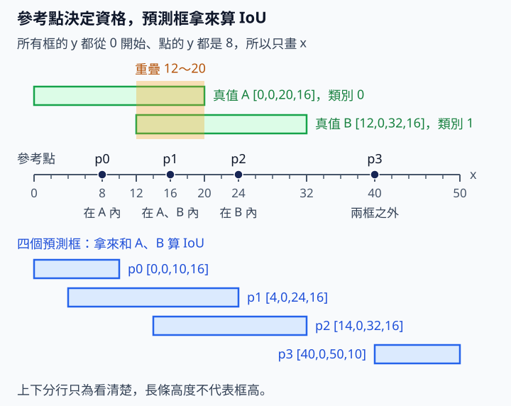

# 12.3 Sample assignment：哪個候選值得被教

[在 Colab 執行本節](https://colab.research.google.com/github/birdhackor/learn_to_yolo/blob/lessons-v0.4.0/notebooks/12-assignment.ipynb){ .md-button }

密集偵測器對一張影像輸出許多候選，標註卻可能只有兩個物件。訓練時要決定哪些候選當正樣本、各自學哪個物件，其餘的學背景；這一步叫樣本分配（sample assignment）。這裡的 sample 就是第 5 章說的正／負樣本，不是「範例」。第 5、7 章的規則是「物件中心所在的格負責」，只看標註，訓練前就能算好，而且永遠不變。本節的規則改用模型當下的分類分數和預測框，所以每訓練一步，誰當正樣本都可能改變。

物件的標註叫真值（ground truth，簡稱 GT：人工標註的框和類別）；候選是某個特徵位置輸出的一組預測。最簡單的想法是讓每個候選都學離它最近的 GT，或者只挑分類分數高的候選，但這會遇到兩種麻煩。第一，候選的參考點（量四邊距離的起點）可能在框外：[12.1 節](12-anchor-free.md)看過，這時有一條邊的距離是負的；12.1 節用 softplus 輸出距離，只會得到正數，所以學不了（16.1 節的 YOLO26 不接 softplus，輸出才可以是負數）。第二，候選可能分類分數很高、預測框卻很差：若只看分數就選它，等於要它很有信心地報出一個沒對準物件的框。下面例子裡的 p3，兩種麻煩都有。

讀完本節，你能手算一個小例子裡每個候選歸哪個 GT，並說明這個結果怎麼變成 loss 的 target。前置：12.1 節的候選點與四邊距離、IoU（兩框交集面積÷聯集面積），以及分類 logits（還沒經過 sigmoid 的分類分數）。

本節的挑法叫 task-aligned（任務對齊）：讓分類分數高的候選，剛好也是框最準的候選，也就是分類和定位兩個任務看中同一批候選。YOLOv8 使用的 task-aligned assignment（任務對齊分配）出自 [TOOD 論文](https://arxiv.org/abs/2108.07755)的 Task Alignment Learning（TAL，任務對齊學習）；task-aligned assignment 是 TAL 裡挑正樣本的那一部分。本節的規則分四步：

1. **資格**：候選的參考點要嚴格落在 GT 框內。
2. **品質**：品質（程式變數 `metric`）＝該 GT 類別的分類 score ×（預測框與 GT 的 IoU）²，越大越適合負責這個 GT。一般式是 score^α × IoU^β，本例取 α=1、β=2。
3. **名額（top-k）**：每個 GT 把合格的候選依品質由大到小排，只留前 k 名；本例 k=2，也就是 top-2。
4. **衝突**：一個候選被多個 GT 選中時，交給 IoU 最大的 GT。

官方實作還有不少細節，例如 α、β 的值和每個 GT 取幾名，所以本例只示範 TAL 的部分結構，不能稱為完整的 TAL。四步裡，TOOD 論文正文只寫了第 2、3 步：每個物件取品質最大的 m 個候選當正樣本（論文取 m＝13），其餘當負樣本；第 1 步的框內資格和第 4 步的解衝突規則來自實作，Ultralytics 解衝突時比的是 CIoU。差異整理在例子後的摺疊區「本例和官方實作差在哪」。本節不改變推論時的 NMS（刪除重複框的步驟）。

## 兩個真值、四個候選

每個候選帶著兩樣幾何資訊，各做一項檢查：

- **參考點**：位置固定，決定有沒有資格。參考點 (x,y) 必須嚴格落在 GT 框 [x1,y1,x2,y2] 內，也就是 x1<x<x2 且 y1<y<y2，等號不算。例如點 (20,8) 剛好在下面 A 框的右邊界上，不算在 A 內。
- **預測框**：模型為這個候選畫出的框，拿來和 GT 算 IoU。

這是兩項不同的檢查：預測框和 GT 重疊，不代表參考點在 GT 內。

真值 A 是 `[0,0,20,16]`、類別 0；B 是 `[12,0,32,16]`、類別 1，兩框有重疊。四個候選的參考點依序是 `(8,8),(16,8),(24,8),(40,8)`，稱為 p0、p1、p2、p3（從 0 開始編號，和程式的索引一致）。p0 只在 A 內，p1 同時在 A、B 內，p2 只在 B 內，p3 在兩框之外。所有框（包括下面的預測框）的 y 都從 0 開始，點的 y 都是 8，所以可以把它們畫在一條 x 數線上。



看圖時，從黑點（參考點）往上對照綠色的 A、B，就知道它在哪個框內；下方藍色長條是下文指定的四個預測框，只拿來和 A、B 算 IoU。例如 p2 的預測框和 A 在 x 14～20 重疊，參考點 (24,8) 卻不在 A 內。

shape 分別為 points `[P,2]=[4,2]`、GT `[G,4]=[2,4]`、品質表 `[G,P]=[2,4]`。P 是候選數，G 是真值物件數。

分類 score 表的每一列，取的是「該 GT 所屬類別」的分數。真實模型對每個候選輸出 C 個類別的 logits，各自經過 sigmoid 變成 0～1 的分數，形狀是 `[P,C]`（C 是類別數，本例 C=2）。例如模型對 p1 的分數是〔類別 0：0.7，類別 1：0.8〕。A 是類別 0，所以 A 列的 p1 填 0.7；B 是類別 1，所以 B 列的 p1 填 0.8。換句話說，表中同一欄就是同一個候選的各類分數；若兩個 GT 同類，這兩列會一模一樣。本例直接手填這張取好的 `[G,P]` 表。p1 的兩個分數加起來是 1.5，這也合法：每個類別各自經過 sigmoid，不要求同一候選各類機率相加為 1。

真實模型的預測框由 head 的輸出解碼而來；本例直接指定四個預測框：`[0,0,10,16]`、`[4,0,24,16]`、`[14,0,32,16]`、`[40,0,50,10]`。程式再用它們和每個 GT 真正算出 IoU，是框與框的 IoU，不是點與框。這四個框是人工指定、只用來算 IoU 的數字（同一欄的兩個 IoU 用同一個預測框算出），不一定是某個 head 真能解碼出的值。分類 score 與算得的 IoU 如下：

| 真值 | p0 的 score／IoU | p1 的 score／IoU | p2 的 score／IoU | p3 的 score／IoU |
| --- | --- | --- | --- | --- |
| A | 0.9／0.5 | 0.7／0.6667 | 0.1／0.1875 | 0.8／0 |
| B | 0.1／0 | 0.8／0.4286 | 0.7／0.9 | 0.9／0 |

以 p1 為例：對 A 相交 16×16=256，兩框面積各 320，IoU=`256/(640−256)=2/3`；對 B 相交 12×16=192，IoU=`192/(640−192)=3/7`。

p3 是刻意安排的反例，開頭說的兩種麻煩它都有。若照「學最近的 GT」，p3 離 B 的中心 (22,8) 比離 A 的中心 (10,8) 近，會去學 B；但它的參考點 (40,8) 在 B 框外，對 B 的右距離是 32−40=−8，學不了。若只看分數、不檢查資格，B 列最高的 0.9 正是 p3，它會被選去負責 B；但它的預測框完全沒碰到 B（IoU 是 0），等於要它很有信心地報出一個沒碰到 B 的框。在本節的規則下，p3 對兩個 GT 都沒有資格，品質也是 0，不會被選。

接著算品質，再乘上資格遮罩（mask：資格成立記 1、不成立記 0）。A 遮罩前的品質（score×IoU²）是 [0.225, 0.3111, 0.0035, 0]，乘上資格 [1,1,0,0] 之後是 `[0.225, 0.3111, 0, 0]`；B 遮罩後是 `[0, 0.1469, 0.567, 0]`。A 的 p2 預測框雖然和 A 重疊（IoU 0.1875，品質 0.1×0.1875²≈0.0035），參考點 (24,8) 卻不在 A 內（不滿足 0<x<20），所以被遮罩歸零。其他的 0（B 的 p0、兩列的 p3）則是 IoU 本來就是 0，參考點也不在框內。資格成立、品質又大於 0 的候選才算合格，才能進入 top-k 排名。本例沒有 ignore 候選（ignore：暫不計入某項 loss 的候選，見第 5 章）。

對 A 來說，p0 的分類分數較高（0.9>0.7），p1 的框較準（IoU 0.6667>0.5）；乘上 IoU² 後，p1 的品質 0.3111 反超 p0 的 0.225。所以要當選正樣本，分類分數和框都要不錯，不會只因其中一項高分就入選。不過本例每個 GT 只有兩個合格候選，k=2 時兩個都會入選，排名不影響結果；合格候選多於 k 時，排名才有作用（後面用 k=1 對照）。

## Top-k 與衝突是兩步

為什麼要限制名額？真實圖片裡，一個大物件的框內可能有上百個候選點。全部當正樣本，等於要框很歪的候選也報出這個物件。所以每個 GT 只留品質前 k 名當正樣本，其餘的學背景。

本例 A 選 p0、p1，B 選 p1、p2。p1 被兩個 GT 選中，但一個候選只有一組四邊距離和一個類別 target，不能同時代表兩個不同物件。因此本例比較 p1 對兩者的 IoU：對 A 為 2/3、對 B 為 3/7，交給 A。直覺上，框的 target 應該交給位置最對得上的物件。分配器（assigner）就是實作 assignment 規則的程式。Ultralytics 的分配器 TaskAlignedAssigner 在本例也會把 p1 交給 A，但規則不完全相同：它比的是 CIoU，而且是在參考點落在框內的所有 GT 之間比，不只比選中 p1 的 GT（見例子後的摺疊區）。本例只有兩個 GT，又都選了 p1，所以結果一樣。本例改比品質（A 的 0.3111 對 B 的 0.1469）也會交給 A，結論相同。[13.1 節（YOLOv10 dual assignment）](13-dual-assignment.md)的品質表小實驗改用最高品質解衝突；那是另一套衝突規則，不是本節這個 assigner。

最後 owner 為 `[0,0,1,-1]`。owner[p] 記錄候選 p 最後由哪個 GT 負責，存的是 GT 在清單中的編號（A=0、B=1），不是類別編號，本例只是剛好相同；−1 代表背景。所以 `[0,0,1,-1]` 讀作：p0、p1 學 A（框 `[0,0,20,16]`、類別 0），p2 學 B，p3 學背景。要拿類別，得再用 owner 去查該 GT 的類別。

top-2 是每個 GT 最多先選兩個；解衝突後不保證仍有兩個，也不保證每個 GT 都有正樣本。

k=2 看不出排名的作用，改成 k=1 就看得到。用品質排名時，A 選 p1（0.3111>0.225），B 選 p2（0.567>0.1469），沒有衝突，owner 變成 `[-1,0,1,-1]`；p0 雖在 A 內、品質也不是 0，仍成了背景。若資格照樣檢查、排名只看分類 score，A 選 p0（0.9），B 選 p1（0.8），owner 變成 `[0,1,-1,-1]`：和 B 的 IoU 高達 0.9 的 p2 反而成了背景，改由 IoU 只有 0.4286 的 p1 去學 B。

下面摘自完整程式 `assign` 函式的核心，從資格表 `inside` 到解衝突的迴圈，只加了中文註解：

``` { .python data-excerpt="lesson_cases/12-assignment.py" }
# points [P,2]、gt [G,4]；scores 與 overlaps（IoU 表）都是 [G,P]；k=2
# 在這之前，owner 已建成 4 個 -1（每個候選先當背景）

# 第 1 步，資格表 inside [G,P]：參考點嚴格在框內才是 True
inside = ((points[None] > gt[:, None, :2]) & (points[None] < gt[:, None, 2:])).all(-1)
# 第 2 步，品質 [G,P]＝score×IoU²（α=1、β=2 這一組是方便手算的教學值，不是原始設定）
# 原始設定：TOOD 論文用 α=1、β=6；YOLOv8 訓練時用 α=0.5、β=6
metric = scores * overlaps.square()  # teaching pair alpha=1, beta=2; TOOD uses 1, 6 and YOLOv8 0.5, 6
selected = torch.zeros_like(inside)  # [G,P]，全 False：GT g 有沒有選中候選 p
for g in range(len(gt)):  # 第 3 步：每個 GT 各挑前 k 名
    eligible = torch.where(inside[g] & (metric[g] > 0))[0]  # 合格候選的編號，A 得 [0,1]
    n = min(k, len(eligible))  # 合格的不到 k 個就全收
    if n:  # n=0（沒有合格候選）就跳過
        selected[g, eligible[metric[g, eligible].topk(n).indices]] = True
for p in range(len(points)):  # 第 4 步：逐個候選解衝突
    candidates = torch.where(selected[:, p])[0]  # 選中 p 的 GT 編號，p1 得 [0,1]
    if len(candidates):  # 沒有 GT 選它，owner[p] 保持 -1
        owner[p] = candidates[overlaps[candidates, p].argmax()]  # 交給 IoU 最大的 GT
```

??? note "逐行走查：用 A（g=0）和 p1 帶一次"

    先認兩個函式：`torch.where(條件)[0]` 回傳條件為 True 的位置編號；`.topk(n)` 取最大的 n 個值，`.indices` 是這些值所在的位置。名稱對照：`scores`＝分類 score 表、`overlaps`＝IoU 表、`inside`＝資格表、`metric`＝品質、`selected`＝哪個 GT 選中哪個候選的 True／False 表。下面 T＝True、F＝False。

    1. A（g=0）：`inside[0]`＝[T,T,F,F]，遮罩前的品質 `metric[0]`≈[0.225, 0.3111, 0.0035, 0]。兩個條件都成立的只有 p0、p1，所以 `eligible`＝[0,1]。
    2. `n`＝min(2, 2)＝2。
    3. `metric[0, eligible]`＝[0.225, 0.3111]。`.topk(2).indices`＝[1,0]：這是在 `eligible` 這個小清單裡的位置，較大的 0.3111 在位置 1，較小的 0.225 在位置 0。
    4. `eligible[[1,0]]`＝[1,0]，把清單裡的位置換回候選編號，於是 `selected[0,1]`、`selected[0,0]` 設成 True。
    5. B（g=1）同理：`eligible`＝[1,2]，品質 [0.1469, 0.567]，`.topk(2).indices`＝[1,0]，換回候選編號是 [2,1]。第一個迴圈跑完，`selected`＝[[T,T,F,F],[F,T,T,F]]。
    6. p1（p=1）：`selected[:,1]`＝[T,T]，所以 `candidates`＝[0,1]，A、B 都選了 p1。`overlaps[[0,1],1]`＝[0.6667, 0.4286]，`argmax()`＝0，這也是在 `candidates` 裡的位置，所以 `owner[1]`＝`candidates[0]`＝0，p1 歸 A。
    7. p3（p=3）：沒有 GT 選它，`candidates` 是空的，`owner[3]` 保持 −1。

完整程式裡，`assign` 的定義上方有 `@torch.no_grad()`：這段計算不記錄計算圖，也就不求梯度。開頭說過，真實訓練時的 score 和預測框，來自模型在目前這一個訓練步的輸出；Ultralytics 會先 detach（從計算圖切開），才交給 assigner。本例改用手填數字，下一小節另建 logits 示範反傳。為什麼不求梯度？「選或不選」是跳躍的決定：分數小幅變動時，選擇不變（斜率 0）；跨過名次時，又突然跳變。這和第 2 章〈[訓練診斷](02-diagnostics.md)〉的 argmax 一樣，沒有可用的梯度。target 定好之後，loss 照常對沒有 detach 的輸出反傳。不要把「算 target 時 detach」誤寫成「模型輸出全部 detach」，後者會讓 head 學不到東西。

## 把 owner 接回 loss

前景（foreground）指被分配到某個 GT 的候選，也就是 owner ≥ 0 的正樣本；owner＝−1 的是背景。上面的 score 表是手填的，只用來做 assignment。為了單獨看 owner 怎麼變成 loss 的 target，本例另外建立 4 個 logits，每個候選一個，從 0 開始，表示「是不是前景」，作用像第 7 章的 objectness。完整模型則會對同一個 head 沒有 detach 的輸出計算 loss。

本例把正樣本的 target 簡化成 1，所以前景 target 是 `[1,1,1,0]`。YOLOv8 沒有 objectness：正樣本的 target 寫在所屬 GT 類別的那一欄，而且官方的值是依品質縮放的 0～1 小數，不是固定的 1。

取平均的 BCE（二元交叉熵）對每個 logit 的梯度是 `(σ(z)−t)/4`。σ(z) 是 sigmoid(z)；四個 logits 都是 0，所以 σ(0)=0.5。t 是 target。4 是取平均的候選數，和第 7 章〈[Grid MiniYOLO loss](07-loss.md)〉的 (sigmoid−target)/格數是同一個式子。正樣本是 (0.5−1)/4=−0.125，背景是 (0.5−0)/4=+0.125，所以輸出的 `gradient` 那一行是 `[-0.125, -0.125, -0.125, 0.125]`。完整程式裡學習率是 1，一次 SGD 更新後，logits＝0−1×梯度＝[0.125, 0.125, 0.125, −0.125]（程式沒有印出這組數字，可自行驗算）：正樣本的 logit 上升，背景下降。完整 detector 的正樣本還要取 owner 對應的 GT 框和類別；背景不計框回歸 loss。

空影像也要合法。程式給 `G=0`，回傳四個 −1；所有候選都能提供背景訊號。不要因為沒有 GT 就略過整張影像；沒有正樣本時，也不要直接對空的正樣本取 mean，那會得到 NaN（0÷0 這類算不出的值）。本節的前景小例子沒有評估 AP，只有責任規則的可核對答案。

執行 `PYTHONPATH=. python lesson_cases/12-assignment.py`（不需下載資料），會依序印出六行：遮罩後的品質表、owner、前景 target、BCE 梯度、空影像的 owner，以及自主練習第 1 題的 owner。品質表四捨五入到小數第 3 位再印，所以正文的 0.3111、0.1469（4 位）印成 0.311、0.147。程式用四個斷言（assert）核對 owner、空影像的 owner、梯度和練習第 1 題的 owner；品質表只印出來，沒有斷言。想改數字試試看，請做本節最後的自主練習：先預測 owner 會不會變，再跑程式核對。

??? note "本例和官方實作差在哪"

    以本節最後「來源」連結的 Ultralytics 原始碼為準，主要差異如下：

    - **指數與名額**：品質一樣是 score^α × IoU^β，但 `loss.py` 設 α=0.5、β=6，每個 GT 取前 10 名；本例為了手算，用 α=1、β=2、前 2 名。
    - **重疊度**：官方算重疊度用的不是普通 IoU，而是第 11 章〈[IoU 類 loss](11-iou-loss.md)〉的 CIoU，並把負值截成 0；品質和解衝突都用它。本例為了手算，用普通 IoU。
    - **解衝突時比哪些 GT**：本例只在選中這個候選的 GT 之間比 IoU；官方則在參考點落在框內（小物件用放大後的框）的所有 GT 之間取 CIoU 最大者，所以候選可能交給一個沒在 top-k 選中它的 GT。本例只有兩個 GT，兩種比法結果相同。
    - **正樣本的 target**：官方不是 1，而是依品質縮放、介於 0～1 的小數；本例簡化成 1。
    - **跨尺度**：官方把幾種 stride（通常是 8、16、32）特徵圖上的候選點放在一起排名、挑前 k 名；本例只有一個尺度的四個點。
    - **整批計算**：官方把一個 batch 的圖片一起算。每張圖的 GT 數不同，就補齊到相同長度，再用遮罩標出哪些是真的 GT。本例只有一張圖，用 Python 迴圈逐一處理。
    - **小物件的候選**：官方選候選時，會把邊長小於 16 的 GT 框以中心暫時放大，讓小物件也有候選點（[16.3 節](16-training.md)的 STAL 會介紹，現在可以先跳過）；本節沒有套用。

## 收益、代價與常見錯誤

品質跟著模型當下的輸出走（開頭說的：每訓練一步，誰當正樣本都可能改變），所以責任會隨模型進步調整，比固定的中心規則更能利用好候選。代價是每一批都要計算 GT×候選的 IoU、排名、遮罩和衝突。初期預測都差時，排名也可能不穩；框內資格至少把候選限制在物件上，本節不處理其他的初期穩定做法。

β 越大，越偏好好框。例如 IoU 0.5 與 2/3（約 0.667），平方後是 0.25 與 0.444，差約 1.8 倍；6 次方（官方 β=6）後是 0.016 與 0.088，差約 5.6 倍。IoU 稍差的候選，品質掉得很快，所以 β 不是越大越好，而是取捨。

常見錯誤：

- **做 top-k 時忘了框內資格**：參考點在框外的候選也可能入選，它要學的四邊距離會有負值，用 12.1 節的 softplus 輸出學不了。
- **把 GT 類別的 score 取成另一類**：品質用錯了分數，排名可能跟著錯。例如 A 列誤取類別 1 那一欄，p0 的分數會從 0.9 變成 0.1。
- **讓一個候選擁有兩份 target**：同一組四邊距離和類別 target 要同時代表兩個物件，互相矛盾，所以要先解衝突。
- **把未選的候選都當成 ignore**：它們就不再學背景（本節未選的候選是負樣本，target 為 0），可能讓背景誤報變多。
- **把訓練的 assignment 和評估的配對混用**：訓練 assignment 允許一個 GT 有多個正樣本（A 有 p0、p1）。評估時的配對（matching，判斷預測框算不算 TP，也就是正確偵測）一個 GT 只配一次，重複框算 FP（誤報），見〈[人工框評估與 AP50](06-evaluation.md)〉。若評估也讓 A 配兩個，AP 會被高估。

官方設定與版本會變；本節只說明固定的教學規則。

自主練習（先自己算，再展開答案）：

1. 把 p1 的預測框改成 GT B 的 `[12,0,32,16]`，重新計算整欄 IoU，不只改一個 IoU 數字。提示：新框和 A 的交集寬是 20−12=8。A、B 各選誰？owner 變成什麼？這題手算即可；完整程式結尾已經做了這個修改，算完再對照輸出的最後一行。
2. 改一個分數：在 Colab 裡改「本節可修改的完整實驗」下面那一格程式；本機則改 `lesson_cases/12-assignment.py`，兩者是同一份程式。把 `main()` 裡 `scores` 第一列的第二個數，也就是 A 對 p1 的 `.7`，改成 `.1`。先預測：A 的品質、top-2 的選擇和 owner 會不會變？哪些斷言（assert）要跟著改？再執行核對。

??? note "參考答案"

    **第 1 題**：新框和 A 相交 8×16=128，兩框面積各 320，IoU=128/(640−128)=0.25；新框和 B 完全相同，IoU=1。品質分別為 0.7×0.25²=0.04375 與 0.8×1²=0.8。A、B 仍都選 p1，但解衝突時比 IoU（0.25<1），p1 改屬 B，owner 變成 `[0,1,1,-1]`。A 的正樣本數由 2 變 1。完整程式結尾已有這個修改的斷言：`assert moved_owner.tolist() == [0, 1, 1, -1]`。

    練習前後全批都是 3 個正樣本，只看總數會以為沒事，其實 A 少一個、B 多一個。物件彼此重疊很多的圖（擁擠場景）常出現這種搶候選的情況，所以要分別數每個 GT 有幾個正樣本。

    **第 2 題**：A 遮罩後的品質變成 [0.225, 0.0444, 0, 0]（0.1×(2/3)²≈0.0444；輸出第一行只印到小數第 3 位，是 0.044）。A 的合格候選仍只有 p0、p1，兩個都入選；B 仍選 p1、p2。衝突比的是 IoU（2/3>3/7），p1 仍歸 A，owner 不變，還是 `[0,0,1,-1]`。所有斷言都不必改，照樣通過。可見本例只改分數、而且改完仍大於 0 時，看不出變化：每個 GT 只有兩個合格候選，衝突又只看 IoU。若把某個合格候選的分數改成 0，它的品質也變成 0，就不再是那個 GT 的合格候選：例如把 A 對 p1 的 `.7` 改成 0，A 只剩 p0 合格，p1 改歸 B，owner 變成 `[0,1,1,-1]`，`main()` 的第一個斷言就不通過。

    延伸：分數維持 `.1`，再把 `assign` 裡解衝突的那一行改成比品質，也就是把 `owner[p] = candidates[overlaps[candidates, p].argmax()]` 的 `overlaps` 換成 `metric`。這時 A 對 p1 的品質 0.0444 小於 B 的 0.1469，p1 歸 B，owner 變成 `[0,1,1,-1]`。`main()` 裡的 `assert owner.tolist() == [0, 0, 1, -1]` 要改成 `[0, 1, 1, -1]`，其他斷言不變。兩種衝突規則在這裡給出不同答案。

參考來源：[TaskAlignedAssigner：品質、top-k、衝突與依品質縮放的 target](https://github.com/ultralytics/ultralytics/blob/441632cdfd19e22e60a4b1b1999d46326ca51ec4/ultralytics/utils/tal.py)、[loss.py：訓練時把 detach 後的預測交給 assigner，並設定 α、β 與 top-k](https://github.com/ultralytics/ultralytics/blob/441632cdfd19e22e60a4b1b1999d46326ca51ec4/ultralytics/utils/loss.py)。

<!-- curriculum-evidence:start -->

## 實際執行紀錄

本節的完整程式於 2026-10-05 在 INTEL(R) XEON(R) PLATINUM 8573C（2 個執行緒）上用 PyTorch 2.9.1+cpu 執行，程式裡的 assert 全部通過。下面是那次印出的原始輸出；輸出裡若有計時或訓練得到的數字，換一台電腦會略有不同。每個數字的意思，以本頁正文的說明為準。[完整紀錄（JSON）](https://github.com/birdhackor/learn_to_yolo/blob/main/artifacts/checks/curriculum/12-assignment.json)

??? example "展開本次實際輸出"

    ```text
    inside-masked score * IoU^2: [[0.225, 0.311, 0.0, 0.0], [0.0, 0.147, 0.567, 0.0]]
    candidate owner (-1 background): [0, 0, 1, -1]
    foreground target: [1.0, 1.0, 1.0, 0.0]
    gradient: [-0.125, -0.125, -0.125, 0.125]
    empty image owner: [-1, -1, -1, -1]
    exercise: move predicted box p1 to GT B; owner: [0, 1, 1, -1]
    ```

<!-- curriculum-evidence:end -->
