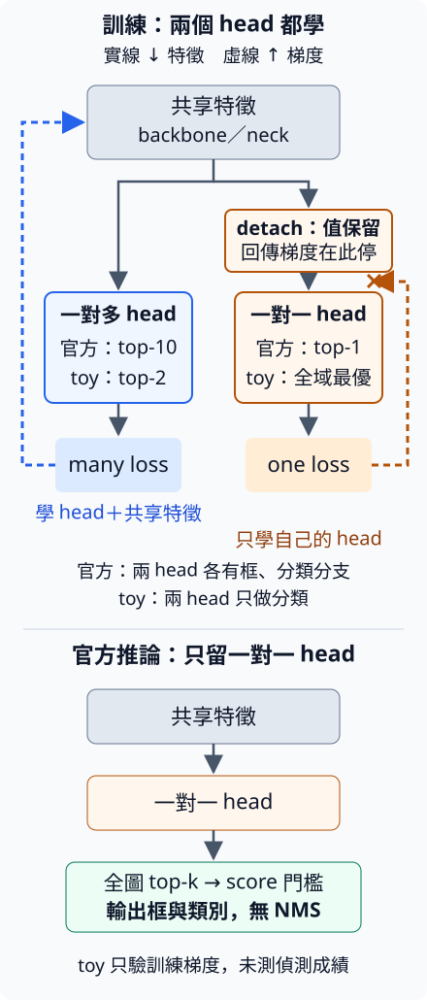

# 13.1 YOLOv10 dual assignment：訓練時多教，推論時少重複

[在 Colab 執行本節](https://colab.research.google.com/github/birdhackor/learn_to_yolo/blob/lessons-v0.6.1/notebooks/13-dual-assignment.ipynb){ .md-button }

一個物件附近常有好幾個候選都框得不錯。[12.3 的 assignment](12-assignment.md) 讓它們一起當正樣本，模型就能從多個位置學這個物件；到了推論，這些位置也可能一起報高分。於是 [NMS](06-decode-nms.md) 要在最後依重疊刪掉重複框。現在希望把這項工作往訓練移：教模型選出負責的候選，其餘候選學低分，讓推論少一個逐框刪除的步驟。

如果每個真值物件（GT）只教一個候選，正樣本又會變少。YOLOv10 因此保留兩種監督：一對多提供較多正樣本，一對一學少報重複。關鍵不只是「同時算兩個 loss」，而是兩份要求由誰學、又由誰訓練共用的特徵。我們先看這兩份要求有何不同，再追它們的梯度。

## 同一張圖，兩份監督要候選做不同的事

一對多（one-to-many）允許一個 GT 選多個正候選；一對一（one-to-one）以每個物件只選一個負責候選為目標。兩者都不是「整張圖只能有一個物件」。下面固定兩個 GT A、B 和三個候選 p0、p1、p2，用品質表看分配。shape 是 `[G,P]=[2,3]`；列是 GT，欄是候選，數字越大越適合負責該 GT。

| GT／候選 | p0 | p1 | p2 |
| --- | --- | --- | --- |
| A | 0.90 | 0.85 | 0.10 |
| B | 0.88 | 0.10 | 0.20 |

這是人工小表。先沿用 12.3 的「每個 GT 取前 k 名，再解候選衝突」來比較：

- **一對多取 top-2**：A 選 p0、p1；B 選 p0、p2。若衝突比表中品質，p0 因 0.90>0.88 歸 A，最後 p0、p1 教 A，p2 教 B。
- **一對一取 top-1**：A、B 的首選都是 p0。同樣比品質，p0 歸 A；B 不會自動補選第二名，所以這一步沒有正樣本。p1、p2 都是背景。

用 owner 記主人：每一格依序寫 p0、p1、p2 歸誰，0＝A、1＝B、−1＝背景。兩種結果分別是 `[0,0,1]` 與 `[0,-1,-1]`。例如 p1 在一對多被教成 A，在 top-1 示意卻被教成背景；若只用同一組 head 權重承接兩份 target，就會把相反要求壓到同一個輸出上。

YOLOv10 的 dual assignment（雙重分配）用兩組 head 分開學這兩份要求。它們都讀同一組 backbone／neck 特徵，但各有自己的權重；官方每組 head 裡面，還各有分類與框分支。因此這裡的「兩個 head」和 [12.2](12-decoupled-head.md) 把分類、定位拆成兩條分支，是不同層次的分工。

### 官方 top-1 的數量限制在哪裡？

官方一對一也是每個 GT 初選 top-1，一對多則取 top-10；上表把後者縮成 top-2，方便手算。不過官方解衝突比的是預測框和 GT 的重疊品質：負值截成 0 的 CIoU，而非表中整體品質。因此上面的 owner 是教學示意，不是官方程式輸出。

遇到衝突時，官方會在**所有 GT** 裡找重疊最大的主人，連原本沒選這個候選的 GT 也可能拿到它。一個 GT 可能失去首選；第三個 GT 也可能因此多拿一個。要記住的數量關係是：top-1 限制衝突前的初選，不能保證衝突後每個 GT 恰好、甚至至多一個正樣本；每個候選最後只屬於一個 GT，則仍成立。這會影響你解讀 target，也說明名稱「一對一」不能直接當成推論框數的保證。

### 為什麼兩份監督採同一種品質排名？

既然一對多負責教共用特徵，就希望一對一重視的候選也能從這份豐富監督受益。論文的 consistent dual assignments（一致的雙重分配）讓兩組 head 都用同一個品質公式：

\[
m=s\cdot p^{\alpha}\cdot\text{IoU}^{\beta}.
\]

s 表示候選點是否在 GT 內，內為 1、外為 0；p 是該 GT 類別的模型分數；IoU 表示框的重疊品質。12.3 的 `score×IoU²` 是 α=1、β=2；官方用 α=0.5、β=6，實作中的重疊值是截到非負的 CIoU。

若兩個 head 對同一候選算出相同的 p 與 IoU，使用相同公式時，一對一的首選也是一對多的第一名。這連起了兩份監督的方向。但各 head 會逐漸學出不同預測，品質表可能不同；即使表相同，衝突後的主人也未必相同。所以「一致」指排名設計的關係，不是兩份 target 必須相同。官方正樣本的類別 target 仍是依品質給的 0～1 軟值；本節可執行 toy 簡化成 0／1。

## 共用特徵由誰教，一對一 head 又如何學？

兩組 head 都需要有用的特徵，卻不必都把自己的 loss 傳回去。官方把一對一 head 的輸入先 `detach()`：保留特徵數值，切斷回到 backbone／neck 的梯度。一對多 loss 訓練共用特徵與自己的 head；一對一 loss 只訓練自己的 head。這樣一對一能在較多正樣本教出的特徵上，學另一份少報重複的要求。



圖中實線往下是前向的特徵與輸出，虛線往上是 loss 梯度。右路到 detach 為止，沒有再回到共用特徵；右側 head 仍連到 loss，仍能更新。下半是推論：一對多完成訓練用途後移除，只由一對一 head 輸出。本節程式只實作上半的分類 target 和梯度；沒有完整框預測。

這和 12.2 讓分類、框 loss 都教共用特徵不同，是新的梯度分工。detach 位於輸入也很重要：若移到 head 的輸出後，head 自己也學不到；若拿掉，one loss 就會一併改 backbone。這個 detach 來自官方 `head.py`，論文正文沒有寫出。

## 換成可完整求解的小配對，追一次梯度

為了讓兩個 GT 在小程式裡都取得一個正樣本，本節 toy 把一對一改成**全域最優配對**：每個 GT 恰好拿一個不同候選，讓總品質最大，並要求候選數足夠。這是為了在小表上清楚接起 owner、target、head 和梯度；它不是官方 top-1 分配器。

沿用上表，最佳配法是 A→p1、B→p0，總品質 0.85+0.88=1.73，owner 為 `[1,0,-1]`。若每步先拿剩下最大的數，會先給 A→p0，再讓 B→p2，只得 1.10。全域配對願意讓 A 少 0.05，換取 B 不必少掉 0.68。完整列舉和貪心規則放在下方選讀；這裡先看結果如何變成監督。

輸入是隨機三列候選特徵 `[3,4]`，線性 backbone 輸出仍為 `[3,4]`；兩個分類 head 各輸出 `[3,2]`。本例 A 是 class 0、B 是 class 1，所以 owner 中的 GT 編號剛好也是類別欄號。一般資料仍要先找到 GT，再查它的類別。

| 候選 | 一對多 toy target | 全域一對一 toy target |
| --- | --- | --- |
| p0 | `[1,0]`：A | `[0,1]`：B |
| p1 | `[1,0]`：A | `[1,0]`：A |
| p2 | `[0,1]`：B | `[0,0]`：背景 |

每類各用 sigmoid 與 BCE；target=1 鼓勵該欄高分，背景兩欄都是 0。這個表把「同一候選可能收到不同要求」直接顯示出來：p0 兩邊主人不同，p2 一邊正、一邊背景。這是訓練 assignment，與第 6 章用來判 TP／FP 的評估 matching 分開。

以下依完整程式簡化，省略 `targets()` 定義、拆開 logits 兩行，另加 `loss` 變數與中文註解：

```python
features = backbone(inputs)                 # [3,4] → [3,4]
many_logits = many_head(features)           # [3,2]
one_logits = one_head(features.detach())    # [3,2]；只剪斷回到 backbone 的梯度
many_loss = F.binary_cross_entropy_with_logits(many_logits, targets(many_owner))
one_loss = F.binary_cross_entropy_with_logits(one_logits, targets(one_owner))
loss = many_loss + one_loss
```

完整程式先只反傳 one loss，核對 backbone 的 `.grad is None`、one head 有非零梯度；清掉梯度後反傳總 loss，核對 backbone 與兩個 head 有梯度；最後 `optimizer.step()` 比較更新前後副本，確認兩個 head 權重都變了。這些檢查分別回答「loss 教到了誰」與「參數是否真的更新」。

在 repo 根目錄執行 `PYTHONPATH=. python lesson_cases/13-dual-assignment.py`。輸出的一對多 owner 是 `[0,0,1]`，**全域**一對一是 `[1,0,-1]`，總品質 1.73 對貪心 1.10；最後的兩個 BCE loss 是更新前的值。它沒有測偵測 AP 或無 NMS 的速度。

## 推論省掉的工作，需要訓練先接手

官方推論只用一對一 head，先取全圖分數最高的 k 個（框, 類別）組合，預設最多 300，再依 score 門檻過濾。它不再比較兩框 IoU 刪框，所以叫 NMS-free。這裡的 top-k 設輸出上限；訓練時的 top-1／top-10 則決定正樣本，兩者用途不同。

這套設計把「抑制同一物件的重複報出」交給一對一監督，同時用一對多保留共用特徵的訓練訊號。部署少掉 NMS 的順序刪框與 IoU 門檻，也少帶一組 head；代價是訓練要多算一組 head、assignment 和 loss。top-k 本身不識別重複，同一框多類也仍可能各占一筆。是否完成少重複的工作，要看沒參與訓練圖片上的重複 FP、漏檢與 AP；[下一節](13-nms-free.md)先用固定人工框，把「監督改分數」這一步單獨顯示出來。

## 選讀：官方 target、衝突與 toy 的求解

??? note "選讀：論文的排名假設與官方 target"

    論文讓一對一的 α、β 都是一對多的同一個正倍數 r，並假設兩個 head 的初始權重相同，對每對候選與 GT 得到相同的 p、IoU。此時一對一的 m 是一對多的 m 的 r 次方，排名不變；預設 r=1，公式完全相同。論文實驗顯示，相比參數不成比例時，一對一選中的候選更常落在一對多的前幾名，並非保證訓練全程排名相同。

    官方的正樣本分類 target 是 0～1 的軟值：m×（該 GT 正樣本中最大的 CIoU）÷（該 GT 正樣本中最大的 m）；其他欄與背景為 0。若某個 GT 最後只有一個正樣本，這個 target 是 `m×CIoU/(m+eps)`；eps 是避免除零的微小值，只有 m 遠大於 eps 時，才約等於該候選與 GT 的 CIoU。若衝突後它得到多個正樣本，仍要照上述公式逐個算（[官方 tal.py](https://github.com/THU-MIG/yolov10/blob/453c6e38a51e9d1d5a2aa5fb7f1014a711913397/ultralytics/utils/tal.py#L82-L86)）。本文的 toy 只用 0／1 target。

??? note "選讀：官方 top-1 為什麼仍可能留下兩個正樣本？"

    用三個 GT A、B、C 和兩個候選看衝突：A、B 都初選 p0，C 初選 p1；但 p0 與 C 的重疊比與 A、B 更大。官方解衝突時在所有 GT 中比較重疊，所以把 p0 交給 C。p1 原本就歸 C，最後 C 有兩個正樣本，A、B 沒有。名稱「一對一」描述的是設計目標與 top-1 初選，不是這份實作最終分配的嚴格數量保證。

    既有核對紀錄用[固定版本的官方 `select_highest_overlaps`](https://github.com/THU-MIG/yolov10/blob/453c6e38a51e9d1d5a2aa5fb7f1014a711913397/ultralytics/utils/tal.py) 在 CPU 實際核對了這個反例；[輸入、結果與重現程式](https://github.com/birdhackor/learn_to_yolo/tree/main/reviews/clear-tutorial/16f6910/technical/probes)保存 owner=`[2,2]`，A、B、C 的正樣本數為 `[0,0,2]`。這個結果只針對所連結的 YOLOv10 實作；第 16 章的 YOLO26 在衝突後還會再篩一次，規則不同。

??? note "選讀：同一張品質表，候選主人仍可能不同"

    把表改成 A＝0.95、0.90、0.10，B＝0.10、0.88、0.20，用本頁比品質的示意規則。一對多 top-2 時 A 選 p0、p1，B 選 p1、p2；p1 衝突後因 0.90>0.88 歸 A。一對一 top-1 時 A 取 p0、B 取 p1，p1 歸 B。每個 GT 的首選都一致，同一候選仍可在兩 head 收到不同 target。這不是官方 CIoU 衝突的實跑結果。

??? note "選讀：toy 如何求全域最優，為什麼貪心不一定對？"

    為什麼不把 A 最好的 p0 留給 A？先看貪心（greedy）的做法：每一步先拿眼前最大的數，拿了就不再改。全表最大的是 0.90（A→p0），先定下來；B 只剩 p1（0.10）和 p2（0.20），最多 0.20，總和 1.10。全域最優反而把 p0 讓給 B：A 從 p0 改用 p1 只少 0.05，B 從 p0 改用 p2 卻少 0.68，所以 A→p1、B→p0 的 1.73 比較大。這是可驗證的反例：每一步拿當下最大的值，不保證整體最好。

    完整程式的 `greedy_one_to_one` 函式照這個規則求貪心的配法：每一步只在還沒配到候選的 GT、還沒被拿走的候選之間找最大的一格，定下就不再改，直到每個 GT 都配到候選。斷言確認本表的貪心是 A→p0、B→p2、總和 1.10，也確認全域最優嚴格大於貪心。注意貪心比的是全表剩下的最大數，不是讓 A 先挑：另一個斷言用一張把 B 的 p0 改成 0.95 的小表檢查，這時最大的 0.95 屬於 B，所以 B 先拿 p0，A 再從剩下的 p1、p2 拿較大的 p1。

    完整程式的 `exact_one_to_one` 函式用列舉求全域最優，核心是這兩行（寫法略有簡化）：

    ```python
    best = max(permutations(range(P), G),
               key=lambda cols: sum(quality[g, c] for g, c in enumerate(cols)))
    ```

    以本例 P=3、G=2 逐段看：

    - `permutations(range(3), 2)`（Python 標準函式庫 `itertools` 的函式）依序列出從 3 個候選挑 2 個不同候選的所有排法：(0,1)、(0,2)、(1,0)、(1,2)、(2,0)、(2,1)。每組的第一個數是 A 拿到的候選欄，第二個數是 B 的；例如 (1,0) 表示 A→p1、B→p0。
    - `lambda cols: ...` 是寫在一行裡的臨時函式。輸入一種配法 `cols`，`enumerate(cols)` 依序給出（GT 編號 g, 候選欄 c），把 `quality[g, c]` 加起來，就是這種配法的總品質。例如 `cols=(1,0)` 時依序給出 (0,1)、(1,0)，總品質是 `quality[0,1]+quality[1,0]`，也就是 0.85+0.88=1.73。
    - `max(..., key=...)` 依 key 算出的總品質比大小，回傳總品質最大的那一組。

    | 配法 `cols` | A 拿 | B 拿 | 總品質 |
    | --- | --- | --- | --- |
    | (0,1) | p0 | p1 | 0.90+0.10=1.00 |
    | (0,2) | p0 | p2 | 0.90+0.20=1.10（就是貪心的結果） |
    | (1,0) | p1 | p0 | 0.85+0.88=1.73（最大） |
    | (1,2) | p1 | p2 | 0.85+0.20=1.05 |
    | (2,0) | p2 | p0 | 0.10+0.88=0.98 |
    | (2,1) | p2 | p1 | 0.10+0.10=0.20 |

    所以 `best=(1,0)`。注意方向：`best` 寫的是「每個 GT 拿哪個候選」，A 拿候選 1、B 拿候選 0。owner 反過來寫「每個候選歸哪個 GT」：p0 歸 B（1）、p1 歸 A（0）、p2 沒人拿（−1），所以是 `[1,0,-1]`；完整程式用 `owner[c] = i` 做這個翻譯（完整程式把 GT 編號寫成 i，就是上面簡化版的 g）。這題的 `best` 和 owner 前兩格剛好都是 1、0，看起來很像，方向卻相反；自己改表時，不要把 `best` 後面補一個 −1 就當成 owner。

    這種搜尋要試 `P!/(P−G)!` 種配法。本例 A 先有 3 個候選可選，B 剩 2 個，共 3×2=6 種，就是高中學的排列數。候選與 GT 變多時，這個數字增加得非常快。例如 640×640 的輸入用 stride 8、16、32 三層特徵圖，各有 80×80、40×40、20×20 格，每格一個候選，共 8400 個候選；圖上有 10 個 GT 時，要試 8400×8399×…×8391≈1.7×10³⁹ 種，不可能一一列舉。

    「每個 GT 配一個不同的候選，讓總品質最大」這類問題叫指派問題。匈牙利演算法（Hungarian algorithm）是指派問題的經典解法：不必列出全部組合，就能有效率地求出最佳解；DETR（DEtection TRansformer，偵測 Transformer；另一類也不用 NMS 的偵測器）訓練時就用它做一對一配對。YOLOv10 沒有用它：論文說，一對一改成每個 GT 只取第一名（top-1，沿用 12.3 那種 task-aligned 的品質排名），效果和匈牙利配對相當，額外的訓練時間更少。


## 選讀練習：改 toy 的品質表

在 Colab 裡改「本節可修改的完整實驗」下面那一格程式；本機則改 `lesson_cases/13-dual-assignment.py`，兩者是同一份程式。

1. 把 `main()` 裡 `quality` 的第二列 `[.88, .10, .20]` 改成 `[.88, .10, .95]`，也就是 B 對 p2 的品質改為 0.95。先手算：一對一的全域最優配法和總品質是多少？貪心呢？一對一、一對多的 owner 各變成什麼？完整程式的斷言寫死了原表的答案，直接執行會在斷言停下；想想哪幾個斷言要改、改成什麼。
2. 再把 GT 改成 4 個（`quality` 改成 4 列，每列 3 個數），候選仍是 3 個。執行時會發生什麼事？應該怎麼處理？

??? note "參考答案"

    **第 1 題**：六種配法的總品質依序是 1.00、1.85、1.73、1.80、0.98、0.20，最大的是 (0,2)：A→p0、B→p2，總和 0.90+0.95=1.85。`best=(0,2)` 翻成「每個候選歸誰」，一對一 owner 是 `[0,-1,1]`，不是 `[0,2,-1]`。一對多 owner 仍是 `[0,0,1]`：A 仍選 p0、p1，B 改選 p2、p0，p0 仍因 0.90 高於 0.88 歸 A。

    新表最大的數是 0.95，所以貪心先給 B→p2，再給 A→p0，總和同樣是 1.85。在原表不是最好的貪心，在這張表變成最好；一個成功的例子，不能證明貪心總是對的。

    完整程式裡要改三個斷言，依出現的順序是：

    - `assert one_owner.tolist() == [1, 0, -1]` 改成 `assert one_owner.tolist() == [0, -1, 1]`。
    - `assert greedy_cols == (0, 2) and abs(greedy_value - 1.10) < 1e-6` 改成 `assert greedy_cols == (0, 2) and abs(greedy_value - 1.85) < 1e-6`。`greedy_cols` 和 `best` 一樣寫「每個 GT 拿哪個候選」；新表的貪心仍是 A→p0、B→p2，只有總和變成 0.90+0.95。
    - `assert optimum > greedy_value + 1e-7` 檢查「全域最優嚴格大於貪心」。新表兩者相等，這行會失敗；改成 `assert abs(optimum - greedy_value) < 1e-6`，意思是兩者相等。

    其他斷言不用改。一對多 owner 仍是 `[0,0,1]`，所以 `assert many_owner.tolist() == [0, 0, 1]` 照樣成立；另外兩個把小表直接寫在括號裡的斷言（`one_to_many_owner(torch.tensor(...))` 與 `greedy_one_to_one(torch.tensor(...))` 那兩行）不讀 `quality`，也不受影響。

    三個都改好後執行，第三行印出 `global quality=1.85; greedy quality=1.85`；一對一的 target 變了，最後一行的 one loss 也會跟著變。程式裡的 0.90、0.95 以 float32 儲存，存進去時有極小的捨入，所以實際算出 1.8499999642…，印出時才四捨五入成 1.85。這裡 `optimum` 和 `greedy_value` 是同樣兩個數相加，結果完全相同；用 `abs` 比較只是保險，極小的捨入誤差不能算成「全域比貪心好」。

    **第 2 題**：3 個候選排不出 4 個不同的位置，`permutations(range(3), 4)` 什麼都不產生，`max()` 會報 `ValueError`（Python 3.12 的訊息是 `max() iterable argument is empty`）。程式一呼叫 `exact_one_to_one` 就停下，後面的一對多、貪心與訓練都不會執行。這個報錯是對的：一對一不可能讓 4 個物件各拿一個候選，至少有一個 GT 沒有一對一正樣本，也就是沒配到候選的 GT（unmatched GT）。不要為了讓錯誤消失，改成只配其中 3 個 GT 卻不記錄丟了誰，那會讓一個物件被默默忽略。建議先明確允許 GT 沒配到，並把它們列出來；或增加候選數。這是本節建議的做法，不是 YOLOv10 的規則。

    要在程式裡允許 GT 沒配到，不能只改 `exact_one_to_one`。`greedy_one_to_one` 和它一樣假設每個 GT 都拿得到不同的候選：4 個 GT、3 個候選時，它配完 3 個 GT 就沒有可選的格子，`max()` 會報同一個 `ValueError`。`targets()` 則直接把 GT 編號當類別欄號，這只在本例 A、B 剛好是類別 0、1 時成立：編號 2、3 的 GT 只要分到候選，就會超出只有 2 欄的 target，程式報 `IndexError`；要改成先由 owner 找到 GT，再取那個 GT 的類別。寫死原表答案的斷言，也要照新表的答案改。

參考來源：[YOLOv10 論文](https://arxiv.org/abs/2405.14458)、[官方 repository，固定 commit](https://github.com/THU-MIG/yolov10/tree/453c6e38a51e9d1d5a2aa5fb7f1014a711913397)、[雙 head 與 detach 實作](https://github.com/THU-MIG/yolov10/blob/453c6e38a51e9d1d5a2aa5fb7f1014a711913397/ultralytics/nn/modules/head.py)。

<!-- curriculum-evidence:start -->

## 實際執行紀錄

本節的完整程式於 2026-10-08 在 AMD EPYC 9V74 80-Core Processor（2 個執行緒）上用 PyTorch 2.9.1+cpu 執行，程式裡的 assert 全部通過。下面是那次印出的原始輸出；輸出裡若有計時或訓練得到的數字，換一台電腦會略有不同。每個數字的意思，以本頁正文的說明為準。[完整紀錄（JSON）](https://github.com/birdhackor/learn_to_yolo/blob/main/artifacts/checks/curriculum/13-dual-assignment.json)

??? example "展開本次實際輸出"

    ```text
    one-to-many owner: [0, 0, 1]
    global one-to-one owner: [1, 0, -1]
    global quality=1.73; greedy quality=1.10
    detached one-to-one branch trains its head; only many branch trains backbone
    loss many=0.6855, one=0.7065
    ```

<!-- curriculum-evidence:end -->
