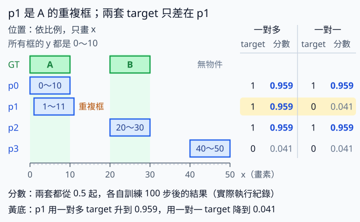

# 13.2 NMS-free：拿掉 NMS 前，重複候選學會了什麼

[在 Colab 執行本節](https://colab.research.google.com/github/birdhackor/learn_to_yolo/blob/lessons-v0.4.0/notebooks/13-nms-free.ipynb){ .md-button }

NMS-free 指推論時不跑 NMS，直接用 13.1 的一對一 head（把特徵轉成預測的輸出模組）算出的分數挑框。只看分數的篩選仍然保留，例如 score 門檻（分數不夠高就刪）和 top-k（只留分數最高的前 k 個）。要做到這點，訓練時就得讓每個物件只有一個候選拿高分。本節用四個框驗證：重複框 p1 在一對多訓練下分數約 0.96，改用一對一 target 訓練後只有約 0.04。

為什麼不能直接刪掉 NMS？假設一張圖有兩個物件，偵測器卻輸出三個高分框，其中兩個框住同一個物件。把 NMS 函式刪掉，框數只會變多，模型並沒有變好。所以本節固定框的位置，只改「哪個候選被教成正樣本」，親眼看分數怎麼變，再比較後處理。後處理指模型輸出之後的 decode、score 門檻、NMS 等步驟；本節比較的是其中決定留下哪些框的部分。讀完後，你能說明拿掉 NMS 之前，訓練要先改什麼，也能分辨 top-k 和 NMS 的差別。

前置：[NMS](06-decode-nms.md)（非極大值抑制：依分數由高到低，每輪保留一個框，再刪掉和它重疊太多的候選）、[13.1 的一對多／一對一監督](13-dual-assignment.md)（一對多讓同一物件的多個候選都學高分，一對一只教一個）。後面的手算評估會用到 [AP50](06-evaluation.md)（TP、FP 怎麼判定，AP 怎麼算）。

YOLOv10 的做法：訓練時有一對多、一對一兩個 head，共用同一組特徵（見 13.1）。推論時只用一對一 head 算出的分數：先取分數最高的前 k 個（官方預設最多 300 個），再刪掉低於 score 門檻的，就直接輸出。整個過程沒有 NMS 那一步，也就是不再「保留高分框，再刪掉和它 IoU 太高的候選」。

本節的簡化：真正的 YOLOv10 要靠 assignment（決定哪個候選負責哪個物件）挑出正樣本；本節沒有重現這些挑選步驟，而是直接指定正樣本。每個候選只有一個可以學的數字（logit，經過 sigmoid 就是分數）；四個 logit 本身就是參數，不學框，也不接 CNN。兩套 logits 分別在兩個獨立的對照實驗裡訓練，不是 13.1 那種共用特徵的兩個 head。兩者的訓練步數、學習率和初值都相同，所以分數的差別只來自 target。這個實驗只驗證「改 target 會改變重複框的分數」，不能稱作完整的 YOLOv10，也不代表已達到真實任務的偵測品質。

## 明確知道哪些框是重複

兩個真值框（GT）：A 在 `[0,0,10,10]`，B 在 `[20,0,30,10]`（xyxy：左、上、右、下）。候選 p0 恰好等於 A，p1 為 `[1,0,11,10]`（A 右移 1），p2 等於 B，p3 為沒有物件的背景 `[40,0,50,10]`。所有框都在同一列（y 從 0 到 10），只差在 x 的範圍：A 與 p0 在 0～10，p1 在 1～11，B 與 p2 在 20～30，p3 在 40～50。四個候選框的 shape 是 `[P,4]=[4,4]`（P 是候選數），四個 logits 的 shape 是 `[4]`。本例只有一類，分數為 `sigmoid(logit)`。

p0、p1 在 x 方向重疊 1～10，寬 9、高 10，相交面積 90；兩框各自面積 100，IoU 為 `90/(100+100−90)=90/110≈.8182`。這個值大於 NMS 的 IoU 門檻 0.5（比的是兩個預測框之間的重疊），所以 NMS 只會留下 p0、p1 中分數較高的那一個；兩者同分時，本節的 NMS 依輸入順序，留下排在前面的 p0。p0 和 p2 不重疊，分屬 A 與 B，NMS 不會讓它們互刪。理想的輸出是 A、B 各留一框；背景 p3 則應該因為分數低，被 score 門檻刪掉。

本節直接指定由 p0 負責 A（p0 與 A 完全重合）；這是本節的人工設定，不代表官方規則一定選 p0。

| 訓練用的 target | p0 | p1 | p2 | p3 | 訓練訊息 |
| --- | --- | --- | --- | --- | --- |
| 一對多 target | 1 | 1 | 1 | 0 | A 的兩個候選都被獎勵 |
| 一對一 target | 1 | 0 | 1 | 0 | A 只獎勵 p0；p1 雖也框住 A，仍學低分；p2 照樣由 B 獎勵，背景 p3 學低分 |

下文把用一對多 target 訓練出的 4 個分數叫「一對多分數」，用一對一 target 訓練出的叫「一對一分數」。本例沒有真的 head，只有四個可以學的 logit；程式輸出裡的 `many-head`、`one-head` 只是沿用 YOLOv10 的叫法，分別就是一對多分數與一對一分數。



左半依比例畫出兩個 GT 與四個候選的 x 範圍，p0、p1 都屬於 A。右半是兩套 target 與各自訓練 100 步後的分數（取自頁末的實際執行紀錄），黃底的 p1 是兩套唯一不同的地方。

兩套 logits 都從 0 開始，起點分數都是 sigmoid(0)=0.5。loss 是四個候選的 BCE（二元交叉熵）取平均（mean）。單一候選的 BCE 對自己 logit 的梯度是「分數減 target」；loss 對四項取平均，所以還要除以 4。因此每個 logit 的梯度是 `(sigmoid−target)/4`，只看自己的分數與 target。兩套都用學習率 lr=1 的 SGD 更新 100 步。以第一步為例：target=1 的候選，梯度是 (0.5−1)/4=−0.125，logit 由 0 變成 0−1×(−0.125)=0.125；target=0 的候選，梯度是 0.125，logit 變成 −0.125。

完整程式裡的 `fit_scores` 就做這件事（變數名照原檔，只加了中文註解）：

``` { .python data-excerpt="lesson_cases/13-nms-free.py" }
def fit_scores(target):
    logits = nn.Parameter(torch.zeros(4))  # 四個 logit 本身就是要學的參數，起點都是 0
    optimizer = torch.optim.SGD([logits], lr=1.)  # 學習率 lr=1
    for _ in range(100):  # 更新 100 步
        optimizer.zero_grad()  # 先清掉上一步的梯度（backward 會累加梯度）
        loss = F.binary_cross_entropy_with_logits(logits, target)  # 預設取四項平均（mean）
        loss.backward()  # 每個 logit 的梯度是 (sigmoid(logit) - target) / 4
        optimizer.step()  # logit = logit - lr * 梯度
    return logits.sigmoid().detach()  # 轉成分數；detach() 讓回傳的分數脫離計算圖
```

100 步後，target=1 的候選分數從 0.5 升到約 0.96，target=0 的降到約 0.04（此時 logit 約 ±3.14；sigmoid 只會接近 1，不會等於 1）。一對一分數裡 p1 的低分不是手動填的，而是 loss 真的教出來的。

本例四個 logit 互相獨立，所以給什麼 target 都一定學得會。真實偵測器裡，相鄰候選的分數由同一個網路從很相近的特徵算出來，要讓它們一高一低難得多；YOLOv10 論文也指出，只用一對一監督的訊號較弱，所以訓練時保留一對多 head（見 13.1）。

## 三條推論路徑比同一組答案

本節用到三種門檻，數值剛好都是 0.5，但比的東西不同：

- **score 門檻**：拿候選自己的分數去比，分數大於 0.5 才留下。完整程式裡是 `many > .5`、`one > .5` 這兩處。
- **NMS 的 IoU 門檻**：比兩個預測框之間的重疊。NMS 依分數排序，每輪保留剩下候選中排第一的框，再刪掉和這個已保留框 IoU 大於 0.5 的候選；已經被刪的框不會再刪別人。本例只有 p0、p1 互相重疊，所以兩框只留依分數排序排在前面的那個。完整程式裡是 `nms` 函式的 `threshold=.5`。
- **配對 IoU 門檻**（matching IoU）：比預測框與 GT 的重疊，決定 TP／FP。只在後面的手算評估用到。

完整程式（Colab 裡「本節可修改的完整實驗」下方那格，或本機的 `lesson_cases/13-nms-free.py`）的 `main` 用下面幾行跑三條推論路徑，再用斷言（assert）核對答案（中文註解是本頁加的）：

``` { .python data-excerpt="lesson_cases/13-nms-free.py" }
boxes = torch.tensor([[0., 0., 10., 10.], [1., 0., 11., 10.], [20., 0., 30., 10.], [40., 0., 50., 10.]])  # p0～p3
many = fit_scores(torch.tensor([1., 1., 1., 0.]))  # 一對多分數
one = fit_scores(torch.tensor([1., 0., 1., 0.]))  # 一對一分數
many_ids = torch.where(many > .5)[0].tolist()  # 一對多不做 NMS：分數大於 score 門檻的候選編號
one_ids = torch.where(one > .5)[0].tolist()  # 一對一不做 NMS
kept = nms(boxes[many_ids], many[many_ids])  # 一對多加 NMS；threshold 預設 .5，是 NMS 的 IoU 門檻
many_after_nms = [many_ids[i] for i in kept]  # 把 kept 的位置換回原本的候選編號
assert len(many_ids) == 3 and len(many_after_nms) == 2  # 框數
assert one_ids == [0, 2]  # 一對一不做 NMS 留下 p0、p2
assert 2 in many_after_nms and any(i in many_after_nms for i in (0, 1))  # 覆蓋斷言
```

用訓練出的分數，三條路徑的結果如下：

| 推論路徑 | 留下的候選 | 框數 | A、B 各一框？ |
| --- | --- | --- | --- |
| 一對多不做 NMS | p0、p1、p2 | 3 | 否：A 有 p0、p1 兩框，重複 |
| 一對多加 NMS | p0、p2 | 2 | 是 |
| 一對一不做 NMS | p0、p2 | 2 | 是 |

一對多加 NMS 為什麼留下 p0、刪掉 p1？一對多的 p0、p1、p2 起點、target、梯度都相同，100 步後分數完全一樣（約 0.959），也就是分數平手（tie）。`nms` 一開始用 `scores.argsort(descending=True, stable=True)` 把候選依分數由高到低排序（`argsort` 回傳的不是分數，而是依分數由高到低排好的位置）。`argsort` 預設不保證同分的元素排序後誰在前，所以這裡指定 `stable=True`，也就是穩定排序（stable sort）：分數相同的元素，排序後維持原本的先後。送進 `nms` 的順序是 p0、p1、p2，排序後仍是這個順序：第一輪保留 p0，p1 和 p0 的 IoU 是 0.8182，大於 0.5，被刪掉；第二輪保留 p2。所以輸出是 `many/NMS: [0, 2]`。第 6 章的 `class_nms` 和第 7 章 `decode_grid` 用的 NMS，也都這樣排序。

留下 p0 而不是 p1，只是平手時的排序規則決定的。NMS 不看 GT，並不知道 p0 和 A 完全重合；如果送進 `nms` 時 p1 排在 p0 前面，留下的就會是 p1。NMS 的任務是讓每個物件留下一個框，不是留下某個指定的框，所以對一對多加 NMS 這條路徑，斷言不指定 A 要留 p0，只檢查兩件事：框數是 2，以及「物件覆蓋」，也就是每個 GT 至少還留著一個框（B 有 p2，A 留 p0 或 p1 都可以）。上面最後一行就是檢查物件覆蓋的「覆蓋斷言」。只數框數不夠：像下面 top-2 的例子，框數也是 2，兩框卻都屬於 A。

NMS-free 仍然可以用 score 門檻篩選，也可以用 top-k。NMS 特有的步驟，是按兩框的幾何重疊（IoU）刪除候選；top-k 只依分數保留固定數量，不看框在哪裡。開頭說過，YOLOv10 推論時先取一對一 head 分數最高的前 k 個，再用 score 門檻刪掉低分的。k 是輸出上限，也就是每張圖最多輸出幾個框，不是物件數；推論時本來就不知道圖裡有幾個物件。所以能不能去掉重複，全靠分數本身。

下面用一組人工分數 `[.92,.90,.80,.05]` 示範。這組分數假設的是「一對一沒學好、重複框 p1 也拿到高分」的情況，不是前面訓練出的分數。取 top-2 得到 p0、p1，兩個都屬於 A，反而漏掉 B；注意這裡的 k=2 剛好等於物件數，還是漏了。這個反例說明 top-k 本身不具「每個物件只留一個」的能力；要讓 top-k 的結果不重複，需要適合的監督，以及足夠好的一對一 head。順帶一提，若對前面訓練出的一對多分數取 top-2，p0、p1、p2 三個分數完全平手；`topk` 沒有 `argsort` 那種 `stable` 選項，選到哪兩個沒有保證。

??? note "手算評估：重複框讓 AP 從 1 降到 5/6"

    這裡評的是不做 NMS 時留下 p0、p1、p2 三個候選的輸出（和一對多不做 NMS 留下的候選相同），分數改用上面的人工分數排序，三個分數各不相同。人工分數中 p3 的 0.05 低於 score 門檻 0.5，先被刪掉，不進評估。

    配對 IoU 門檻設 0.5，依分數由高到低逐筆判定，規則同[第 6 章](06-evaluation.md)（P 是 precision，R 是 recall）：

    | 排名 | 候選 | score | 判定 | P | R |
    | --- | --- | --- | --- | --- | --- |
    | 1 | p0 | 0.92 | TP：配對 A（IoU=1） | 1 | 1/2 |
    | 2 | p1 | 0.90 | FP：A 已被 p0 配對，p1 和 B 不重疊 | 1/2 | 1/2 |
    | 3 | p2 | 0.80 | TP：配對 B（IoU=1） | 2/3 | 1 |

    兩個 GT 都找到，所以漏檢 FN=0；最後 precision=`TP/(TP+FP)=2/3`，recall=`TP/(TP+FN)=1`。

    算 AP 前先取包絡：在每個 recall 位置，取「往右看拿得到的最高 precision」。recall 0 到 1/2 這段，往右看最高的是排名 1 的 precision 1，所以高度是 1；排名 2 的 FP 沒有增加 recall，不占寬度。recall 1/2 到 1 這段，高度是排名 3 的 2/3。all-points interpolated AP 的面積為 `.5×1+.5×(2/3)=5/6`。

    NMS 後（p1 被刪掉），或只留 p0、p2 的結果，都只剩兩個正確框，此例 AP=1。top-2 若留下 p0、p1，recall 反而只有 0.5。這是可以手算核對的人工評分，不是模型在獨立圖片上的效果。

    若像[第 7 章評估 held-out 圖片](07-heldout.md)時那樣，把候選截斷門檻設得很低（例如 0.01），p3 也會進入評估：它排第 4、是 FP，最終 precision 變成 2/4；但 recall 在排名 3 已經是 1，所以 AP 仍是 5/6。

執行 `PYTHONPATH=. python lesson_cases/13-nms-free.py`（或在 Colab 執行完整程式），核對輸出：

- 前兩行 `many-head scores:`、`one-head scores:` 分別是一對多分數與一對一分數，每行四個數依序對應 p0～p3，四捨五入到小數第 3 位，和上圖右半的數字相同。
- `many/no NMS:`（一對多不做 NMS）為 `[0, 1, 2]`，`many/NMS:`（一對多加 NMS）為 `[0, 2]`，`one/no NMS:`（一對一不做 NMS）為 `[0, 2]`。
- `duplicate IoU=0.8182`，也就是 p0、p1 的 IoU。
- `top-2 on duplicate-heavy scores: [0, 1]`，也就是 top-2 漏掉 p2（B）。

兩組分數都真的經過 backward 和 step 訓練出來。本例只用 CPU，框的位置完全已知，不需要下載資料或模型權重。

## 省了哪個成本，又增加哪個風險

拿掉 NMS 可以省下三件事：

1. 候選框兩兩計算 IoU 的工作。
2. 依分數排序後一個一個刪框的步驟。後面的框要不要刪，取決於前面留下了誰，所以必須照順序做。
3. 對部署工具的一項要求：不必再要求它支援 NMS 這種運算。部署工具指把模型轉成別的格式、在別的環境執行的工具，例如第 20 章的 ONNX／TensorRT。

候選越多，省得越多；實際速度仍受候選數、硬體與實作影響。注意 top-k 仍要依分數挑出前幾名，省掉的是逐一刪框，不是所有排序。

代價是訓練時要把「唯一負責的候選」學好。一對一的正樣本較少（每個物件只有一個候選的 target 是 1），正訊號較稀疏。同一物件的幾個候選條件接近時（例如 p0、p1），一對一要從中挑一個當唯一正樣本；挑中的候選若在訓練中變來變去，模型可能讓兩個都高分（重複）、兩個都低分（漏檢），或讓框得較差的那個勝出（選錯負責的候選）。兩個物件非常靠近時，也可能出現這些問題。不能只看「輸出框很少」，那也可能是所有分數都太低。

真正模型的完成條件應是：held-out（沒參與訓練的圖片）上的 AP、重複框造成的 FP 與漏檢都可接受；同時固定解析度、輸出上限、score 門檻與裝置，量測端到端時間。輸出上限是每張圖最多輸出幾個框，也就是 top-k 的 k；端到端時間是從輸入一張圖到拿到最終框的總時間，包含前處理、模型計算，以及 decode、篩選、NMS 等後處理，不只模型 forward。本節沒有做這個效果試驗，結論只限於「改 target 確實會改變重複框拿高分的傾向」。

常見錯誤：

- 把「每個 GT 只有一個正樣本」誤解成「每張圖只輸出一個框」。一對一是每個物件一個框；圖裡有三個物件，就該有三個框。
- 以一對一 head 做推論，評估時卻誤拿一對多 head 的輸出，又不做 NMS。重複框會全部算成 FP。
- 把 top-k 叫成 NMS。top-k 不看框的重疊，會像上面的 top-2 例子一樣漏掉 B。
- 兩個真實物件的框本來就互相重疊，卻希望系統刪掉其中一個。那是漏檢，不是去除重複。

NMS-free 的目標是同一物件不重複，不是所有互相重疊的物件只留下一個。

自主練習：在完整程式（Colab 裡「本節可修改的完整實驗」下方那格，或本機的 `lesson_cases/13-nms-free.py`）動手改，先預測結果，再執行核對。上面摘錄的三行斷言寫死了原題的答案；改了程式，答案不同的斷言就要跟著改成你預測的結果，否則程式會在那一行報錯停下。要改哪幾行、改成什麼，見參考答案。

1. 把一對一 target 那行 `one = fit_scores(torch.tensor([1., 0., 1., 0.]))` 改成 `[0., 1., 1., 0.]`，也就是改由 p1 負責 A。一對一不做 NMS 會留下哪幾個候選？評估時，A 留下的那個框還算 TP 嗎？
2. 回到原本的 target，只把兩處 score 門檻（`many > .5`、`one > .5`）提高到 0.99。三條推論路徑各剩幾框？recall 是多少？

??? note "參考答案"

    **第 1 題**：新的 target 讓 p1、p2 學高分，p0、p3 學低分。一對一仍有兩個高分候選，不做 NMS 留下 `[1, 2]`。斷言 `assert one_ids == [0, 2]` 要改成 `assert one_ids == [1, 2]`；其他斷言不用改。

    A 唯一的輸出是 p1，它和 A 的 IoU 是 0.8182，評估時仍要跟配對 IoU 門檻 0.5 比；有達到，所以還是 TP。一對一只保證每個物件由一個候選負責，不保證那個框和 GT 完全重合。若唯一留下的框和 GT 的 IoU 低於 0.5，評估時會同時多一個 FP、少找到一個物件（FN）。

    **第 2 題**：這次 100 步訓練出的兩組分數，最高只有約 0.96，沒有任何候選大於 0.99，所以三條推論路徑都是 0 框。沒有重複框，但兩個物件也都沒找到，recall=0。框少不代表成功；靠調高門檻讓框變少，不是架構成功的證據。

    程式要改的地方：

    - 只改兩處 score 比較：`many_ids = torch.where(many > .5)[0].tolist()` 與 `one_ids = torch.where(one > .5)[0].tolist()` 的 `.5` 改成 `.99`。**不要改 `nms` 的 `threshold=.5`**，那是 NMS 的 IoU 門檻。
    - 框數斷言改成 `assert len(many_ids) == 0 and len(many_after_nms) == 0`。
    - `assert one_ids == [0, 2]` 改成 `assert one_ids == []`。
    - 覆蓋斷言 `assert 2 in many_after_nms and any(i in many_after_nms for i in (0, 1))` 改成 `assert many_after_nms == []`。score 篩選後已經沒有框，不能再要求保留 p2 或 p0／p1。

參考來源：[YOLOv10 論文](https://arxiv.org/abs/2405.14458)、[官方 v10Detect 推論](https://github.com/THU-MIG/yolov10/blob/453c6e38a51e9d1d5a2aa5fb7f1014a711913397/ultralytics/nn/modules/head.py)（`v10Detect` 是官方程式中 YOLOv10 偵測 head 的類別名稱；`max_det = 300` 寫在這裡）、[postprocess 的 top-k（`v10postprocess`）](https://github.com/THU-MIG/yolov10/blob/453c6e38a51e9d1d5a2aa5fb7f1014a711913397/ultralytics/utils/ops.py)（postprocess 指模型輸出後挑框的後處理）、[預測時只取一對一 head 的輸出，top-k 後再用 score 門檻篩選](https://github.com/THU-MIG/yolov10/blob/453c6e38a51e9d1d5a2aa5fb7f1014a711913397/ultralytics/models/yolov10/predict.py)。

<!-- curriculum-evidence:start -->

## 實際執行紀錄

本節的完整程式已於 2026-10-02 用 PyTorch 2.9.1+cpu 在 CPU 上執行過，程式裡的 assert 檢查全部通過。下面是那次印出的原始輸出；每個數字的意思，以本頁正文的說明為準。[完整紀錄（JSON）](https://github.com/birdhackor/learn_to_yolo/blob/main/artifacts/checks/curriculum/13-nms-free.json)

??? example "展開本次實際輸出"

    ```text
    many-head scores: [0.9589999914169312, 0.9589999914169312, 0.9589999914169312, 0.04100000113248825]
    one-head scores: [0.9589999914169312, 0.04100000113248825, 0.9589999914169312, 0.04100000113248825]
    many/no NMS: [0, 1, 2] many/NMS: [0, 2] one/no NMS: [0, 2]
    top-2 on duplicate-heavy scores: [0, 1] (misses object at candidate 2)
    duplicate IoU=0.8182
    ```

<!-- curriculum-evidence:end -->
