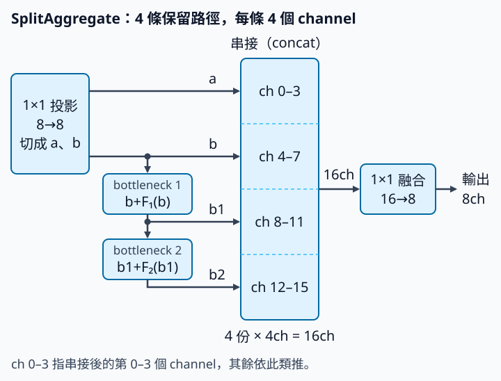

# 14 YOLO11 特徵模組：拆路徑、保留中間成果、再融合

[在 Colab 執行本節](https://colab.research.google.com/github/birdhackor/learn_to_yolo/blob/lessons-v0.6.0/notebooks/14-feature-module.ipynb){ .md-button }

本節想做到一件事：把轉換程度不同的特徵都留下來（有的只經過一層 1×1 卷積，有的轉換了好幾次），讓最後一層自己挑著用。對照一下：最普通的做法是直接疊兩層 `8→8` 的 3×3 卷積（後文稱 plain），每個值都經過同樣的兩層。第 11 章的 CSP 讓一半 channel 走旁路、不做卷積，但最後只串接「旁路＋最後結果」兩份。本節再進一步：另一半依序經過兩個殘差小塊，而且每一步的中間結果都留下，一起交給最後的 1×1 融合（fuse）。

YOLO11 官方配置裡的 C3k2 模組就用了這個想法（C3k2 和更早的 C2f 是什麼，見下方〈名字小抄〉）。本節從 C3k2 切入，只研究其中最核心、本節能完整拆開的「切分→轉換→串接」（split–transform–concatenate）機制。讀完本節，你能追出這個模組每一步的 shape，手算它的參數數（本例 800，plain 是 1,168），也知道這個小實驗能說明什麼、不能說明什麼。

前置：[residual 捷徑](03-identity.md)（`x+F(x)`：保留原值，再加上轉換結果）、[CSP](11-csp.md)，以及 channel concatenation（沿 channel 串接：channel 數相加，高、寬不變）。

本節的模組取名 `SplitAggregate`：先切開（split）、再彙整（aggregate）。這是本例自訂的名稱，不是官方模組名。輸入、輸出都是 8 個 channel 的特徵圖，中間分四步：

1. **投影再切開**：用 1×1 卷積投影（project），再沿 channel 切成兩半 a、b，各 4 個 channel。
2. **依序轉換**：a 直接留下；b 依序經過兩個殘差小塊（bottleneck），得到 b1、b2。
3. **全部串接**：a、b、b1、b2 四份特徵沿 channel 串接（concat），共 16 個 channel。
4. **融合**：用 1×1 卷積融合（fuse），回到 8 個 channel。



兩個名詞：

- **bottleneck**：本例指一個殘差小塊，輸出 `x+F(x)`。其中 F＝3×3 卷積 → ReLU → 3×3 卷積（padding=1，所以 shape 不變）；圖中的 F₁、F₂ 是第 1、2 個 bottleneck 的 F。bottleneck 直譯是「瓶頸」，名字來自中間變窄的設計。本例的「窄」是指它只處理 hidden=4 個 channel，比模組進出的 8 個少，裡面兩層都是 4→4。
- **hidden**：a、b、b1、b2 每一份的 channel 數，本例是 4。

??? note "名字小抄：C2f、C3k2、C3k"

    這些都是 Ultralytics 程式裡的類別名稱，不必背。

    - **C2f**：YOLOv8 用的模組。1×1 卷積後切兩半，一半依序經過多個 Bottleneck，每一步的輸出都串接起來，再用 1×1 融合。下方程式裡 `forward` 那五行，幾乎就是它的 forward。
    - **C3k2**：YOLO11 用的 C2f 變體，整體結構和 C2f 相同。參數 `c3k` 主要決定內部小塊用什麼：`False` 時用 Bottleneck，`True` 時改用 C3k（還有其他選項，本節不談）。
    - **C3k**：可自訂 kernel 大小的 C3。C3 是第 11 章 CSP 那節提過的 YOLOv5 模組。

??? note "與官方 C3k2 的差別"

    **歷史機制**：YOLO11 的官方配置採用 C3k2 等模組，但整體還有其他 backbone（主幹）、neck（夾在主幹與 head 之間整理特徵的部分）與 attention（注意力）設定，所以 YOLO11 的版本收益不能全部歸因於 C3k2。

    `SplitAggregate` 參考 C3k2／C2f 的做法，但簡化了下面幾項，所以不等同完整的 C3k2：

    - **官方的 Conv**：這是 Ultralytics 自己包的一層，依序是卷積（不含 bias）→ BN（BatchNorm，批次正規化，第 3 章介紹過）→ 激勵函數（activation，例如 ReLU、SiLU；官方預設用 SiLU）。本例改用一般的 `nn.Conv2d`（含 bias），不加 BN；投影與融合後面也不加激勵函數，整個模組只有 bottleneck 的 F 中間有 ReLU。
    - **Bottleneck 中間的 channel 數**：官方 C3k2（`c3k=False` 時）的 Bottleneck 預設把中間縮成一半 channel（e=0.5）；本例沿用 C2f 的寫法（e=1.0），兩層都是 hidden→hidden。
    - **C3k 內部結構**：官方 C3k2 可以用 `c3k` 參數把內部小塊換成 C3k；本例沒有這個選項。

## 用 channel 帳本理解路徑

輸入 shape `[B,C,H,W]=[2,8,8,8]`：B=2 筆、C=8 個 channel，高 H 與寬 W 都是 8。本例 C、H、W 剛好都是 8，追 shape 時要認清哪一個 8 是 channel（第 1 軸）。

以下摘自完整程式的 `SplitAggregate`，中文註解是本節加的。最後的 `return` 那行是本節合併改寫的：完整程式先存成 `joined`、`output` 兩個變數，再依檢查用的 `inspect` 參數決定傳回什麼（見下方〈進階〉摺疊區）；在預設的 `inspect=False` 下，兩種寫法算出的結果相同：

```python
# __init__：建立模組時執行一次（本例用預設值 channels=8、hidden=4、blocks=2）
self.project = nn.Conv2d(channels, 2 * hidden, 1)  # 1×1 投影：8→8
self.blocks = nn.ModuleList(Bottleneck(hidden) for _ in range(blocks))  # 兩個 bottleneck，各 4→4
self.fuse = nn.Conv2d((2 + blocks) * hidden, channels, 1)  # 1×1 融合：16→8

# forward：每次計算時執行
a, b = self.project(x).chunk(2, dim=1)  # a、b 各 [2,4,8,8]
paths = [a, b]
for block in self.blocks:
    paths.append(block(paths[-1]))  # 拿 paths 的最後一份，算出下一份
return self.fuse(torch.cat(paths, dim=1))  # 串接成 [2,16,8,8]，再融合回 [2,8,8,8]
```

`self.project`、`self.blocks`、`self.fuse` 是 `__init__` 存進模組的層，`forward` 計算時拿來用。迴圈第一輪的 `paths[-1]` 是 b，算出 b1 加進 `paths`；第二輪是 b1，算出 b2。最後 `paths` 是 `[a, b, b1, b2]`。

先以 1×1 卷積 `8→8` 投影。這層輸出的 channel 數其實是 2×hidden（程式裡寫成 `2 * hidden`），本例 2×4 剛好是 8，才看起來沒變。它先把 8 個輸入 channel 重新混合，所以 a、b 是學出來的組合，而不是固定拿輸入的前 4 個／後 4 個 channel。官方 C2f／C3k2 也是先做 1×1（官方程式叫 cv1）再切。接著 `chunk(2, dim=1)` 沿 channel 切成 a（第 0–3 個 channel）和 b（第 4–7 個），每份 `[2,4,8,8]`。

| 保留的特徵 | 深度 | channel 數 | 理論感受野（相對模組輸入） |
| --- | --- | --- | --- |
| a | 投影後直接留下 | 4 | 1×1 |
| b | 投影後直接留下 | 4 | 1×1 |
| b1 | 一個 bottleneck | 4 | 5×5 |
| b2 | 兩個 bottleneck | 4 | 9×9 |

感受野是一個特徵值可能受輸入多大範圍影響（見[第 1 章](01-small-cnn.md)）；這裡以模組輸入的特徵圖為準，不是原圖。a、b 只經過 1×1，每個值只看自己那一格。每經過一個 stride 1 的 3×3，邊長加 2：b1 經過兩個 3×3，是 5×5；b2 經過四個，是 9×9。和第 1 章一樣，這是理論範圍：本例輸入只有 8×8，比 9×9 還小，所以 b2 每一格的 9×9 視窗都有一部分落在 padding 補的 0 上；中央 2×2 格看得到整張 8×8，四個角落只看得到 5×5。

四份依 a、b、b1、b2 的順序沿 channel 串接成 `[B=2, C=16, H=8, W=8]`：channel 是 4+4+4+4=16，H、W 不變，不是把 H 或 W 擴大。最後 1×1 卷積 `16→8`，輸出回到 `[B=2, C=8, H=8, W=8]`，和輸入相同。所以網路裡輸入輸出都是 `[B,8,H,W]` 的某一部分，可以直接換成這個模組，前後的層都不用改。1×1 融合是學得的跨 channel 組合，並非直接平均四份特徵。

短路徑讓最後的 1×1 融合能直接讀到轉換較少的特徵，長路徑則提供較大的感受野。

??? note "進階：確認四份特徵都接進融合層（可先跳過）"

    訓練結束後，完整程式另做一次檢查用的 forward：`module(x, inspect=True)`。`inspect` 是完整程式的 `forward` 才有的參數（網頁摘錄省略了），設成 `True` 時會多傳回 `paths`（a、b、b1、b2）和串接結果 `joined`。程式對這五個 tensor 呼叫 `retain_grad()`。PyTorch 預設會替參數保留 `.grad`，中間算出來的 tensor 則不保留；要先呼叫 `retain_grad()`，backward 後才看得到它的梯度（[第 5 章](05-assignment.md)用過）。

    **段**（segment）：串接後的 16 個 channel 中，第 0–3 個是 a、4–7 是 b、8–11 是 b1、12–15 是 b2，每份特徵占一段。完整程式裡的變數 `segment`（一段的 channel 範圍）和印出的 concat-segment，指的都是這裡的段。程式會核對每份特徵和自己那一段的數值完全相同，確認串接順序是 a、b、b1、b2。

    **一個值用在兩處，梯度要相加**：例如 L=2u+3u，u 用在兩個地方，L 對 u 的梯度是 2+3=5，兩條路各貢獻一項。[第 11 章特徵融合那節](11-fusion.md)的 nearest 上取樣也是同一個道理：一個值被複製成 4 格，loss 是全部輸出的總和時，它的梯度是 1+1+1+1=4。

    **直接梯度與總梯度**：

    - 直接梯度：loss 對 concat 裡某一段的梯度，只算 concat → fuse 這一條路。
    - 總梯度：loss 對該特徵本身的梯度。

    a、b2 只進 concat，所以它們各自的直接梯度和總梯度相等。b、b1 還要餵給下一個 bottleneck，所以總梯度＝直接梯度＋經下一個 bottleneck 傳回的部分。backward 後，程式逐段檢查直接梯度不為 0，也檢查每份特徵的總梯度不為 0。

    為什麼要實際檢查？沒串接、也沒被後面用到的輸出，和 loss 沒有連線，梯度一定是 0。但反過來不成立：有連線也不保證梯度不為 0，所以程式另用斷言（assert）檢查算出來的值。

    為什麼不能只查總梯度？假設設計成不把 b1 交給 concat（例如只串 a、b、b2，fuse 改成 12→8），b1 仍會經 b2 收到梯度，第一個 bottleneck 也一樣。所以「b1 的總梯度不為 0」或「第一個 bottleneck 有梯度」，都證明不了 b1 直接接進了融合層。要確認這件事，得看 concat 裡 b1 該在的那一段（第 8–11 個 channel），而且下面兩項都要成立：

    - 這一段的數值和 b1 完全相同，表示這裡放的確實是 b1。上面只串 a、b、b2 的設計，第 8–11 個 channel 放的是 b2，這一項就不成立。
    - 這一段的直接梯度不為 0，表示 fuse 的輸出確實受這一段影響。若 b1 留在 concat 裡，fuse 卻用不到這 4 個 channel（例如先把它們乘上 0 再融合），第一項仍成立，b1 也仍經 b2 收到梯度，只有這一項不成立。

    所以「b1 那一段有直接梯度」和「b1 的總梯度不為 0」是兩個不同的檢查。

    執行紀錄最後一行的 gradient L1，是每一段直接梯度的絕對值加總，用來確認不為 0；它只是檢查用的數字，不是加進訓練的 L1 loss。

## 本次到底測什麼

完整程式固定隨機種子（seed=7）生成一組特徵 x，target 是 `x.roll(1, dims=-1)`：沿最後一軸（寬 W）把每個值往右循環平移一格，最右邊的值繞回最左邊。用一維來看，`[1,2,3,4]` 右移一格得 `[4,1,2,3]`。所以每格的答案是同一個 channel 裡左邊鄰格的值；最左欄例外，答案是最右欄的值。這是可控的局部轉換任務，用來驗證模組可以訓練。

這個模組學不成通用的右移規則（不論輸入是什麼都能正確右移），原因有兩個：

1. roll 的邊界是循環的，卷積的邊界卻是補 0（零 padding）。最左欄的答案在最右欄，但卷積在最左欄只看得到附近幾欄和補上的 0，看不到最右欄。
2. 看得到鄰格的只有 b1、b2，而它們都是由 b 的 4 個 channel 經 3×3 算出來的；a、b 只經過 1×1，只看自己那一格。8 個 channel 的左鄰資訊，只能靠 b 這 4 個 channel 傳過來，傳不全。

所以本例沒有要求 loss 為零。訓練部分只要求：對 `SplitAggregate` 重複 30 次「算 MSE（均方誤差）→ backward → SGD 更新」之後，loss 比初值小。參考值：同一組資料若全部輸出 0，MSE 就是 target 各值平方的平均，約 0.97（想驗算的話，在 `main()` 裡 `target = x.roll(1, dims=-1)` 那行之後加一行 `print(target.square().mean())`）。30 步後的 1.0049 還比它高，所以 loss 下降只表示模組接得上訓練流程，不表示學會了位移。本例沒有真實圖片、真值框（GT）或 AP，因此它不能證明 YOLO11 更準。

同時建立兩層 `8→8` 的 plain 3×3 模組（3×3 卷積 → ReLU → 3×3 卷積），但只統計它的參數，不拿未訓練的 plain 與訓練過的 split 比較 loss。split 指 `SplitAggregate`，程式輸出也用這個名字。本例的 `Conv2d` 都含 bias，參數數是 `out×in×kernel高×kernel寬+out`；例如 4→4、3×3 就是 144+4=148。

- plain：兩個 `8→8` 的 3×3，各 8×8×9+8=584，共 1,168。
- split：投影 8×8+8=72，四個 `4→4` 的 3×3 卷積共 4×148=592，融合 16×8+8=136，共 800。

參數減少來自 3×3 只在 hidden=4 個 channel 上做：四個 `4→4` 的 3×3 共 592，比 plain 的 1,168 少 576；投影與融合用 1×1，只多 72+136=208，所以總數仍較少。若改看計算量：卷積每算一個位置，要做的乘加次數（一次乘法、再把乘積加進總和，算一次）等於它的權重數 `out×in×kernel高×kernel寬`，不含 bias。每一筆輸入有 H×W＝8×8＝64 個位置：split 每個位置做 64（投影 8→8）＋4×144（四個 3×3）＋128（融合 16→8）＝768 次，共 64×768=49,152 次；plain 每個位置做 2×576＝1,152 次，共 64×1,152=73,728 次。這些都是本例 hidden=4 的結果，不能推廣成所有 split 模組都更省。

執行 `PYTHONPATH=. python lesson_cases/14-feature-module.py`，應看到輸入輸出同為 `(2,8,8,8)`、四份 4 channel 串接後 16→8、參數 1168／800、MSE 下降，以及串接順序、concat 每一段的直接梯度與各特徵總梯度的檢查通過（「段」與兩種梯度的意思，見上方〈進階：確認四份特徵都接進融合層〉摺疊區）。這是 CPU 小張量實驗，所需記憶體很小；實際的偵測延遲（latency）需另外量測。

## 收益和代價要一起記錄

保留不同深度的特徵，讓最後的 1×1 融合能挑選適合任務的訊號；窄 bottleneck 也可降低部分卷積成本。代價是 a、b、b1 這些中間特徵都得留在記憶體裡，等 b2 算完才能一起串接；串好的 `[2,16,8,8]` 又是一份新的暫存（2,048 個 float32，共 8 KiB）。這些中間特徵常被稱為 activation，指各層算出來的張量，和激勵函數不是同一個意思。

要自己決定的設定也變多了。每一項都可能改變參數量或效果，要另做實驗比較：

- b 這條分支要串幾個 bottleneck；
- bottleneck 裡要不要用 `x+F(x)` 捷徑（官方 C3k2 的 `shortcut` 參數；開關它不改參數量，但會改變算出來的結果）；
- hidden 用幾個 channel；
- 官方 C3k2 還可以設 `c3k=True`，把內部小塊換成更深的 C3k。

參數少不一定延遲短，因為不同裝置對小卷積與資料搬移的效率不同。

若想在 MiniYOLO 正式替換，先找一個輸入輸出 shape 相同的位置。例如[三步訓練與診斷那節](07-training.md)的表格裡，adaptive pool 之後那層 3×3 卷積（`[B,32,4,4]→[B,32,4,4]`，也是 backbone 的最後一層），可以換成 `SplitAggregate(channels=32, hidden=16)`。比較時保持輸入輸出 shape、相同的訓練／驗證資料劃分、訓練步數和 decode（第 6 章：把模型輸出換算成框），只改這個模組。再記錄 AP50（第 6 章的評估分數）、參數、端到端時間與失敗圖。完整 YOLO11 配置還有多項變動，這個局部替換的結果只能解釋本模組，不能代表整版收益。

常見錯誤：

- **把 chunk 當成交錯分組**：`chunk(2, dim=1)` 取的是連續的前半（第 0–3 個 channel）與後半（第 4–7 個），不是 0,2,4,6／1,3,5,7 交錯分。
- **concat 接在空間軸**：應沿 channel 軸（`dim=1`）串接，不是沿 H 或 W。
- **融合卷積的輸入 channel 仍寫 8**：串接後是 16 個 channel，fuse 應為 16→8。
- **讓 x 與 F(x) 的 shape 不同**：例如改了 bottleneck 裡卷積的 stride，或改了最後一層卷積輸出的 channel 數，`x+F(x)` 就不能直接相加。多半會報錯；但若對不上的軸都有一邊長度是 1，PyTorch 會 broadcast（自動把長度 1 的軸複製成另一邊的長度），不報錯，結果卻是錯的（見[第 3 章](03-identity.md)）。只改兩層卷積之間的 channel 數（像官方預設那樣把中間縮成一半，例如 4→2→4）時，F(x) 的 shape 不變，仍可相加。
- **把不同的 bottleneck 實作當成同一種**：ResNet 論文、Ultralytics 程式與本頁都叫 bottleneck，但層數與中間的 channel 數不同，比較時要寫明是哪一種。官方 `C3k2` 還能用 `c3k` 參數換掉內部小塊（見上方〈名字小抄〉），本例沒有那個開關。

**自主練習**：在 Colab 裡改「本節可修改的完整實驗」下面那一格；本機則改 `lesson_cases/14-feature-module.py`，兩者是同一份程式。把 `main()` 裡的 `module = SplitAggregate()` 改成 `module = SplitAggregate(blocks=3)`，hidden 維持 4。執行前先預測：

1. concat 後有幾個 channel？fuse 是幾→幾？
2. 總參數是多少？還比 plain 的 1,168 省嗎？

`__init__` 已用 `(2+blocks)×hidden` 自動設定 fuse 的輸入 channel；完整程式的斷言（assert）與印出的字串也依實際 block 數計算，都不必手改。

??? note "參考答案"

    多了一個 bottleneck，共五份 4 channel 的特徵：concat 後是 (2+3)×4=20 個 channel，fuse 是 20→8。印出的那行會是 `concatenated channels: 4 + 4 + 4 + 4 + 4 = 20; fuse 20 -> 8`。

    參數：投影 72＋六個 3×3 卷積 6×148=888＋融合 20×8+8=168，合計 1,128，印出 `parameters plain / split: 1168 1128`。1,128 已接近 plain 的 1,168，而且要保留更多中間特徵。MSE 那行的數字也會和 blocks=2 時不同，因為模型變了；斷言照樣通過。

    一般來說（channels=8、hidden=4），總參數＝投影 72＋bottleneck 296×blocks＋融合 (32×(2+blocks)+8)＝144+328×blocks：blocks=2 得 800，blocks=3 得 1,128，blocks=4 得 1,456，已經超過 plain。「拆路徑就更省」不是可用的普遍結論。

參考來源：[YOLO11 官方配置](https://github.com/ultralytics/ultralytics/blob/441632cdfd19e22e60a4b1b1999d46326ca51ec4/ultralytics/cfg/models/11/yolo11.yaml)、[C3k2／C2f／Bottleneck 定義](https://github.com/ultralytics/ultralytics/blob/441632cdfd19e22e60a4b1b1999d46326ca51ec4/ultralytics/nn/modules/block.py)。

<!-- curriculum-evidence:start -->

## 實際執行紀錄

本節的完整程式於 2026-10-05 在 INTEL(R) XEON(R) PLATINUM 8573C（2 個執行緒）上用 PyTorch 2.9.1+cpu 執行，程式裡的 assert 全部通過。下面是那次印出的原始輸出；輸出裡若有計時或訓練得到的數字，換一台電腦會略有不同。每個數字的意思，以本頁正文的說明為準。[完整紀錄（JSON）](https://github.com/birdhackor/learn_to_yolo/blob/main/artifacts/checks/curriculum/14-feature-module.json)

??? example "展開本次實際輸出"

    ```text
    input/output: (2, 8, 8, 8) (2, 8, 8, 8)
    concatenated channels: 4 + 4 + 4 + 4 = 16; fuse 16 -> 8
    parameters plain / split: 1168 800
    local transformation MSE 1.0722 -> 1.0049
    concat order, each direct concat-segment gradient, and each path total gradient: verified
    direct concat-segment gradient L1: [0.2967, 0.3349, 0.3481, 0.2779]
    ```

<!-- curriculum-evidence:end -->
