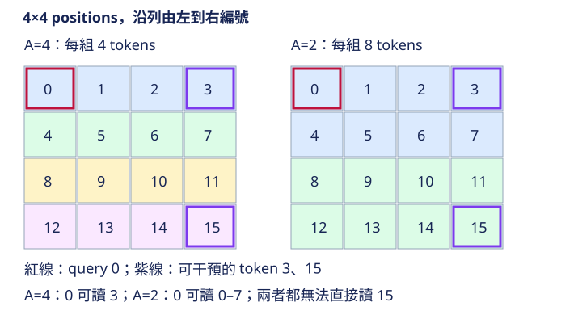

# 15.2 YOLOv12 Area Attention：互動範圍是一筆預算

[開啟 Colab](https://colab.research.google.com/github/birdhackor/learn_to_yolo/blob/lessons-v0.2.0/notebooks/15-area-attention.ipynb) · 原始碼：`lesson_cases/15-area-attention.py`

前置是上一節QK-softmax-V和N²成本。full attention讓每個位置讀全圖，feature map越大，pair越多。若把token分成數個區域，各自attention，再拼回原圖，會少哪些計算，又失去哪一些互動？本節不只數矩陣大小，也用干預一個遠處token檢查資訊能否跨區。

歷史機制是YOLOv12的Area Attention。作者實作對攤平後連續tokens reshape成多個area，區內計算attention；並含multihead、位置卷積與輸出投影。本次起點為full attention，使用同一份QKV權重，僅把areas從1改成4；簡化掉位置卷積及其他路徑，以隔離區域attention的互動限制。本節不是比較完整YOLOv12與CNN精度。

本例`num_heads=1`、`head_dim=C=2`，省略位置卷積與輸出投影；areas是空間分組數，不是head數。

## 區域的形狀由token順序決定



feature map為4×4，N=16，row-major順序每四個token是一列。tokensshape`[B,N,C]=[1,16,2]`，areas=4時reshape為`[B×A,N/A,C]=[4,4,2]`：四個area是四條水平帶。它們不是四個2×2方形window，因為程式沒有先按window重排空間位置。若想要方形區域，必須先明確相應permute與還原流程。

官方「area」不是固定等同某一幾何形狀；相同攤平reshape在不同H、W、area數下會得到不同連續片段。不能只看到area=4就畫成四象限。本例特意選4×4，讓區域邊界很好檢查。

```python
q, k, v = projection(tokens).chunk(3, dim=-1)
q, k, v = [t.reshape(B * areas, N // areas, C) for t in (q, k, v)]
weights = (q @ k.transpose(-2, -1) / math.sqrt(C)).softmax(-1)
output = (weights @ v).reshape(B, N, C)
```

QKV投影在full與area兩條路完全相同，沒有重新初始化；差別只有誰能互相讀。這種配對比較比各跑一份隨機模型更能將差異歸因於互動範圍。

## 計算和記憶體怎麼減少

full weights shape`[1,16,16]`，有256個數。area weights shape`[4,4,4]`，共64個數。一般A個同樣大小的區域，每head的pair為`A×(N/A)²=N²/A`；M個heads的weights元素數還要乘M與batch數。本例單head、B=1減少四倍。這是attention pair項，QKV投影仍需處理全部16個token，因此不能把總模型延遲直接宣稱為四分之一。

若輸入feature map邊長變兩倍，N變四倍，即使areas不變，pair仍變16倍。區域化控制互動預算，並沒有讓任意解析度都便宜。FlashAttention、資料型別、記憶體佈局、GPU kernel和投影成本都會影響實測時間；CPU小實驗的pair計數不能當成GPUbenchmark。

## 遠處資訊能不能傳過來

本例tokens從0/16到15/16，每份兩channel相同，QKV初始為identity。token0的query為零，所以對可讀來源權重均勻。full輸出第一channel為全體平均`7.5/16=.46875`；area輸出為第一帶平均`1.5/16=.09375`。

接著只把token15兩channel各加5。full token0讀取全體，輸出變化；area token0只讀取0到3，其輸出完全不變。程式用assert逐值驗證，而不是隻印「local attention」標籤。這也展示收益與限制：減少跨區域pair同時限制了本層的遠距資訊交換。實際網路的卷積、其他層和區域重組可讓資訊間接跨區，本實驗沒有那些路徑，不能斷言完整YOLOv12跨區永遠不互動。

最後對area輸出與原tokens計算MSE、backward及一次SGD，確認QKV權重有梯度。執行`PYTHONPATH=. python lesson_cases/15-area-attention.py`，應看到256／64、first-token full約.4688／area約.0938、干預影響full但不影響area，以及step成功。無需FlashAttention或GPU。

## 和CNN比較時要先固定問題

3×3CNN每層只讀鄰近位置，搭多層後感受範圍擴大；full attention直接讓全部tokens互動；本例area在一層內讓同帶四個token互動。CNN有區域性共享權重先驗，attention有內容依賴權重；它們的投影、通道寬度和深度成本不同。若要比較偵測收益，應對齊資料、訓練預算與儘可能清楚的計算預算，再看遠距關係或小物件等失敗型別。這裡只隔離full／area，沒有訓練CNN對照，不能編造其精度排名。

常見錯誤是N不能整除A仍reshape、把區域當multihead、復原時搞混B和B×A、忽略full與area使用不同權重的混雜，或將單層隔離等同整個模型隔離。原版位置卷積也會改變區域性訊息，本節刻意省略以使干預答案明確。

自主練習：只改`main()`的`areas=4`為2，保持N=16；兩次area計算、pair assertion與干預結果文字都從同一變數計算。答案是兩塊各8token，pair=`2×8²=128`，token0可讀0到7，仍讀不到15，首token輸出.21875。若areas=1則恢復full，pair256、首token.46875，此時token15會影響token0，動態assert也應通過。再將`changed_index=15`改為3、areas保持4：full與area都會影響token0。先預測兩點是否同區，再執行程式，不用刪掉原本的檢查來通過練習。

來源查覈：2026-10-02。[YOLOv12 論文](https://arxiv.org/abs/2502.12524)、[作者AAttn的area reshape、CPU attention與位置卷積](https://github.com/sunsmarterjie/yolov12/blob/2abab7153a065fb2925e8088e9ca2b19016ab7d6/ultralytics/nn/modules/block.py)。

query0的向量是[0,0]，與每個key的分數都是0；exp(0)=1，所以A=4時各來源權重均1/4。干預token15後full首值.46875→.78125，第一區area首值.09375→.09375；它無法跨區讀取這次改動。多head是把channel拆成多組，area則拆位置，兩種分軸不同；多head shape式可在理解本例[1,16,2]→[4,4,2]後再讀。

??? note "多head延伸（可跳讀）"

    若有M個heads，每head維度`D=C/M`，Q／K／V可表示為`[B×A,M,N/A,D]`，weights為`[B×A,M,N/A,N/A]`，縮放因子是`√D`。本例省去大小為1的M軸，所以weights只有三維，纔可以使用`√C`。

<!-- curriculum-evidence:start -->

## 本輪實際執行紀錄

本節範例已於 2026-10-02 使用 PyTorch 2.9.1+cpu 在 CPU 執行，程式中的斷言全部通過。以下是該次輸出；人工輸入、短步更新與模型效果的意義仍依本頁說明區分。[完整紀錄](https://github.com/birdhackor/learn_to_yolo/blob/main/artifacts/checks/curriculum/15-area-attention.json)

??? example "展開本次實際輸出"

    ```text
    full affinity shape/count: (1, 16, 16) 256
    area affinity shape/count: (4, 4, 4) 64
    first-token output full=0.4688, area=0.0938
    changing token 15 affects token 0: full=True, area=False; same area=False
    after intervention: full=0.7812, area=0.0938
    area-attention backward/step verified; loss=0.0048
    ```

<!-- curriculum-evidence:end -->
