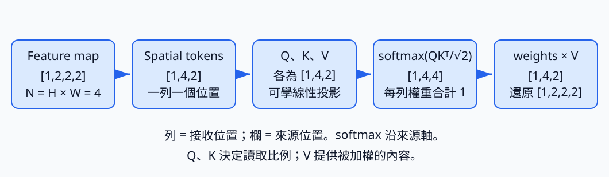

# C.15.1 Feature map 到 attention：四個位置怎麼互相讀取

[在 Colab 執行本節](https://colab.research.google.com/github/birdhackor/learn_to_yolo/blob/lessons-v0.6.1/notebooks/15-attention-bridge.ipynb){ .md-button }

前一節讓不同深度的卷積特徵一起送到融合層。卷積也能靠疊層逐漸讀到遠處，但在很大的特徵圖上，一層 3×3 仍只直接讀周圍 9 格。若希望某個位置依眼前內容，直接選擇從遠近各處讀多少資訊，就要改變位置之間交換資訊的做法。

attention（注意力）為每個接收位置算一份讀取比例，再把各來源的內容加權混合。比例來自當下輸入，不是固定的濾鏡係數。本節把圖縮到 2×2，完整追一次「一個位置如何選來源、讀內容，再放回原位」。小圖可以手算內容選擇；遠距互動的用途和成本則要放回較大的圖看。

## 先把同一位置的兩個 channel 放在一起

固定一張人工特徵圖，shape `[B,C,H,W]=[1,2,2,2]`。channel0 是 `[[1,0],[1,0]]`，channel1 是 `[[0,1],[1,0]]`，所以四個位置各有以下兩個值：

| 位置 | channel 向量 |
| --- | --- |
| 左上 | `[1,0]` |
| 右上 | `[0,1]` |
| 左下 | `[1,1]` |
| 右下 | `[0,0]` |

attention 要比較位置，所以把每個位置的 channel 向量排成一列，叫 token。本例有 N=H×W=4 個 token，shape `[B,N,C]=[1,4,2]`，順序採 row-major：逐列由左到右，即左上→右上→左下→右下。這只是換排法，尚未學到新特徵。

``` { .python data-excerpt="lesson_cases/15-attention-bridge.py" }
tokens = feature.flatten(2).transpose(1, 2)  # [1,2,2,2] → [1,2,4] → [1,4,2]
```

`flatten(2)` 合併第 2 軸 H 之後的軸，得到 `[1,2,4]`；`transpose(1,2)` 再交換 C、N，得到 `[1,4,2]`。不能直接用 `feature.reshape(1,4,2)` 代替：它只重新切段、不交換軸，會得到 `[[1,0],[1,0],[0,1],[1,0]]`，把同一 channel 一列的兩個值當 token。shape 看似一樣，位置與 channel 卻混在一起。還原時必須沿用現在的順序。

## 哪兩份向量決定讀取，哪一份真的被讀走？

同一 token 要做三份不同工作，所以先用可學矩陣轉出三份向量：

- Q＝query（查詢）：接收位置拿它去和來源比對。
- K＝key（鍵）：來源位置供比對的向量。
- V＝value（值）：來源真正供應的內容。

接收位置 i 的 Q 和來源位置 j 的 K 內積，得到這一對的讀取分數；同一接收者把所有來源分數做 softmax，得到和為 1 的比例；最後用比例加權各來源的 V。Q、K 負責選擇關係，V 負責內容，因此 V 不經 softmax。

為什麼不把三者永遠綁成同一份？決定「值得讀多少」的特徵，未必就是想傳給後面網路的數值；接收方拿來尋找資訊的表示，也不必和來源拿來被找到的表示相同。三份可學投影把這些工作分開。它提供的是可分工的表示，沒有保證每次訓練都會學成三種不同功能。

本例用 `qkv=nn.Linear(2,6,bias=False)` 一次算三份，再沿最後一軸切成各 2 維，Q、K、V 的 shape 都是 `[1,4,2]`。6×2 權重等於三個 2→2 線性層上下疊在一起。初值故意是三份 2×2 單位矩陣（`torch.eye(2).repeat(3,1)`），所以一開始 Q=K=V=token，方便手算；三塊權重仍可各自學習。這裡投影指乘可學矩陣，不是正射影。



圖沿直向追 shape：位置先變成 tokens，再分出 Q、K、V；QK 產生權重，V 直接到 `weights @ V`。下方小圖是左上那一列的讀取比例，不是四個模型參數。下面就把這四個比例與輸出算出來。

## 左上這一次讀多少、讀到什麼？

左上 query 是 `[1,0]`。四個 key 依序是 `[1,0]`、`[0,1]`、`[1,1]`、`[0,0]`。內積逐項相乘相加，所以得到 `[1,0,1,0]`。例如和左下的內積是 1×1+0×1=1，和右上則是 0。

每個 query／key 有 d=2 個元素，分數先除以 √d=√2，得 `[0.7071,0,0.7071,0]`；再用已在 [DFL](12-dfl.md) 用過的 softmax 把它們轉成比例：

1. 取 exp（e 的次方）：`[2.0281,1,2.0281,1]`。
2. 共同分母是四項之和，約 6.0562。
3. 各自除以分母，得 `[0.3349,0.1651,0.3349,0.1651]`。

這一列加起來是 1。左上讀自己和左下各 0.3349，讀右上和右下各 0.1651。內積同時看方向與長度，不是只看角度的 cosine：`[1,1]` 比 `[1,0]` 長，即使方向差 45°，內積仍和自己一樣是 1；可學 Q、K 投影會改變這些配對分數。

比例最後乘的是 V。本例 V 等於原 token，所以左上輸出是

\[
0.3349[1,0]+0.1651[0,1]+0.3349[1,1]+0.1651[0,0]
=[0.6698,0.5].
\]

第一 channel 來自自己與左下，第二 channel 來自右上與左下；輸出已經混入別處內容。比例是每次 forward 根據輸入重算的中間結果，會被訓練的是 `qkv.weight`，兩者不要混成同一種「權重」。

把所有接收位置同時計算時，流程如下。完整程式把 `similarity` 與 softmax 併成一行；這裡拆開以標出 shape：

```python
q, k, v = qkv(tokens).chunk(3, dim=-1)               # 切成 Q、K、V，各 [1,4,2]
similarity = q @ k.transpose(-2, -1) / math.sqrt(2)  # [1,4,4]
attention = similarity.softmax(-1)                   # 沿最後一軸（來源／key 軸）做 softmax
output_tokens = attention @ v                        # [1,4,2]
```

`@` 是矩陣乘法。K 最後兩軸轉置後是 `[1,2,4]`；每張圖分別算 `[4,2]@[2,4]=[4,4]`。表的第 i 列是接收位置 i，第 j 欄是來源位置 j；第 i、j 格就是 Qᵢ·Kⱼ/√2。softmax 沿來源軸，使**每列**是一份讀取比例。程式輸出把這張表叫 affinity。`attention @ v` 再算 `[4,4]@[4,2]=[4,2]`，每列各完成一次剛才的 V 加權和。

除以 √d 是為了向量很長時，內積不至於把 softmax 推成幾乎只讀一個來源、梯度極小的狀態。d=2 的手算看不出這項需要；d=64 的對照與變異數推導放在選讀。完整 4×4 表也可選讀，不影響剛才一列的流程。

## 把結果放回圖，再確認三份投影都能更新

`output_tokens` 是 `[1,4,2]`。`transpose(1,2)` 回到 `[1,2,4]`，再 `reshape_as(feature)` 得 `[1,2,2,2]`；row-major 的 token 重新放回左上、右上、左下、右下。形狀和原特徵相同，便能接回卷積網路。官方 YOLOv12 包住 attention 的 `ABlock` 還把結果加回原特徵，像第 3 章的 residual。

目前只算一次前向，尚未學習。完整程式接著用人工目標：channel0 原樣、channel1 乘 0.5，即四個目標 token `[1,0]`、`[0,0.5]`、`[1,0.5]`、`[0,0]`。MSE 比較輸出和目標的 8 個數，再 backward、SGD 更新一次：

``` { .python data-excerpt="lesson_cases/15-attention-bridge.py" }
optimizer = torch.optim.SGD(qkv.parameters(), lr=.1)
optimizer.zero_grad()
# 目標：feature 的 channel0 乘 1、channel1 乘 0.5
target = feature * torch.tensor([1., .5]).view(1, 2, 1, 1)
loss = F.mse_loss(output, target)
loss.backward()
# 梯度和 qkv.weight 一樣是 6×2，沿第 0 軸切成三塊 2×2：Q、K、V 各一塊
grad_q, grad_k, grad_v = qkv.weight.grad.chunk(3, dim=0)
assert all(part.abs().sum() > 0 for part in (grad_q, grad_k, grad_v))  # 每塊都不全為 0
assert not torch.allclose(grad_q, grad_k)  # 三塊兩兩不同
assert not torch.allclose(grad_q, grad_v)
assert not torch.allclose(grad_k, grad_v)
old = qkv.weight.detach().clone()  # 更新前的副本
optimizer.step()
assert not torch.equal(old, qkv.weight)  # 更新一步後，權重確實改變
```

`[1.,.5].view(1,2,1,1)` 讓倍數對齊 channel，再向 H、W 廣播。漏掉 view，`[2]` 會對齊最後一軸 W，把右欄縮半，變成另一個答案。這是一個重建目標：要求輸出接近經縮放的原特徵，沒有偵測意義。

梯度的 6×2 權重矩陣沿第 0 軸切成三塊 2×2，依序屬於 Q、K、V。程式檢查三塊都不全為 0、兩兩不相同，並比較更新前後的副本。這驗證「來源選擇和內容加權都接到 loss，三份投影能分別更新」，沒有驗證學到了對偵測有用的關係。

channel1 乘 0.5 的選擇有具體用途：本例輸入與三份單位矩陣初值很對稱；若直接用原 feature 當 target，Q、K 梯度會相同。縮半這個 channel 讓本次梯度可區分，完整理由與浮點比對放在選讀，練習 2 則讓你觀察這個差別。

執行 `PYTHONPATH=. python lesson_cases/15-attention-bridge.py`。tokens 對應上表；第一權重列是 `[0.3349,0.1651,0.3349,0.1651]`，第一輸出 `[0.6698,0.5]`；shape 路徑是 `(1,2,2,2)→(1,4,2)→(1,4,4)→(1,2,2,2)`。最後的 `backward/step through Q,K,V verified` 在斷言通過後才印，reconstruction loss 是更新前的 MSE。以 `exercise` 開頭的兩行是練習 1 答案，先手算再看。

## 放回大圖，長距互動與 N² 成本一起出現

2×2 圖上，一層 3×3 卷積在左上也能看到全部四格。所以剛才例子展示的是「比例由內容決定」，不能拿它證明 attention 比卷積讀得遠。換成 16×16：一層 3×3 每格仍只直接讀自己和周圍 8 格，full attention 則一層可讀全部 256 格。卷積濾鏡推論時固定，輸出仍會隨輸入而變；attention 多出的，是位置對位置的讀取比例也隨內容重算。卷積疊層同樣能擴大範圍，代價與路徑不同。

每個接收位置配全部 N 個來源，單 head 每圖有 N² 個分數。8×8 時 N=64，有 4,096 個；16×16 時 N=256，有 65,536 個。邊長兩倍，位置數四倍，配對數十六倍。3×3 每位置固定 9 格，對應的空間計算則約四倍。這解釋了直接長距讀取何以昂貴；QKV 投影本身也要計算。

FlashAttention 是 GPU 上的一種 attention 實作：分塊算分數、softmax 與加權，不把整張 N×N 表存下，結果和普通算法相同。它省記憶體和搬資料成本，仍算全部 N² 配對。本節 CPU 程式不需要它。[下一節](15-area-attention.md)會真正刪掉部分配對，觀察省下的工作與失去的資訊。

### 只靠這份讀取表，知道來源在哪裡嗎？

交換左下 `[1,1]`、右下 `[0,0]`，左上比例跟著變成 `[0.3349,0.1651,0.1651,0.3349]`，輸出仍是 `[0.6698,0.5]`。它仍同樣讀取 `[1,1]`，不會因位置換遠就少讀。這一層沒有使用座標或相對位置；前面卷積若留下位置線索，才會間接進入 token。

官方 YOLOv12 另有位置卷積：對 V 逐 channel 做卷積，再加回 attention 輸出，補上局部位置關係；也有多 attention head、區域化及其他投影。attention head 指一組 Q、K、V 及其讀取表，不是偵測 head。這裡只用單 head、2 channel、單位矩陣初值且沒有位置卷積，保留的是 QK 選來源、V 加權、還原與反傳流程，不能代表整個 YOLOv12 的行為或效果。

操作時先看軸：漏 K 轉置會使 `[4,2]@[4,2]` 不合法；反過來算 channel 對 channel，可能合法卻只得 2×2 表；softmax 沿 query 軸則變成每欄和為 1，都不符合每個接收者分配來源的意思。argmax 只挑一個來源且選擇沒有 QK 梯度，不能替代這裡的加權混合。某來源權重 0.3349 也只是這一層的讀取比例，不是對最後預測 33% 的因果貢獻，因為還有 V 的大小與後續運算。

## 選讀：完整讀取表、縮放與梯度對稱

??? note "完整的 4×4 權重表"

    程式只印出第一列；其他三列可以照上面的步驟手算。列是接收位置、欄是來源位置，順序都是左上、右上、左下、右下：

    | 接收＼來源 | 左上 | 右上 | 左下 | 右下 |
    | --- | --- | --- | --- | --- |
    | 左上 | 0.3349 | 0.1651 | 0.3349 | 0.1651 |
    | 右上 | 0.1651 | 0.3349 | 0.3349 | 0.1651 |
    | 左下 | 0.2212 | 0.2212 | 0.4486 | 0.1091 |
    | 右下 | 0.25 | 0.25 | 0.25 | 0.25 |

    每一列加起來是 1，這就是「沿 key 軸做 softmax」。每一欄加起來不必是 1：四欄依序是 0.9712、0.9712、1.3683、0.6893。表中數字四捨五入到小數第四位，直接相加可能差 0.0001（例如第三列得 1.0001、第三欄得 1.3684）。

    右下的 query 是 [0,0]，和每個 key 的內積都是 0，所以四個位置平均讀取，各 0.25。

??? note "為什麼除以 √d"

    假設 q、k 的每個元素互相獨立、平均 0、變異數 1。內積 q·k 是 d 項相加，第 i 項是對應元素的乘積 qᵢkᵢ。每一項的平均是 0、變異數是 1，理由如下（E[·] 表示平均，也就是高中機率的期望值）：

    - 變異數＝平方的平均－平均的平方。平均是 0 時，變異數就等於平方的平均，所以 E[qᵢ²]=E[kᵢ²]=1。
    - 兩個互相獨立的量，乘積的平均等於平均的乘積：E[qᵢkᵢ]=E[qᵢ]E[kᵢ]=0×0=0。
    - qᵢ²、kᵢ² 也互相獨立，同樣可以拆開：E[(qᵢkᵢ)²]=E[qᵢ²]E[kᵢ²]=1×1=1。qᵢkᵢ 的平均是 0，所以這個平方的平均就是它的變異數。

    互相獨立的量相加時，變異數也直接相加，所以內積的變異數是 d，標準差是 √d。除以 √d 之後，不管 d 是多少，分數的標準差都回到約 1。

    不除會怎樣？若 d=64，分數的標準差約 8。兩個位置的分數差 8 時，softmax([8,0])≈[0.9997,0.0003]，幾乎只讀一個位置。這時 softmax 已經飽和：分數小幅變動，比例幾乎不變，梯度也接近 0，Q、K 很難學。同樣兩個分數除以 √64=8 後是 [1,0]，softmax([1,0])≈[0.73,0.27]，仍會混合讀取。

    為什麼不除以 d？那樣分數的標準差變成 √d/d=1/√d，d 越大越縮向 0，權重就趨近平均，每個位置都讀得差不多。

    本例 d=2，看不出縮放的必要；它是為了 d 很大的時候。出處：[Attention Is All You Need](https://arxiv.org/abs/1706.03762) 3.2.1 節（Scaled Dot-Product Attention）。正文說，作者推測（原文 We suspect）d 很大時內積會變大，把 softmax 推到梯度極小的區域，所以把內積乘上 1/√d；上面的變異數推導出自該節的腳註。d=64 的數值例與「為什麼不除以 d」是本頁的補充。

??? note "選讀：為什麼選 channel1 乘 0.5，以及怎樣比梯度"

    channel1 乘 0.5，是為了讓 Q、K 兩塊的梯度分開。本例的輸入有一種對稱：把每個 token 的兩個 channel 對調，[1,0]、[0,1]、[1,1]、[0,0] 變成 [0,1]、[1,0]、[1,1]、[0,0]，還是同樣四個 token，只是左上、右上互換位置。目標若直接用原 feature，也有同樣的對稱；三塊投影又都從單位矩陣出發，這時 Q、K 兩塊收到的梯度數學上完全相同，更新一步後 Q、K 的投影也仍然相同（float32 計算時只差捨入誤差，見下一段）。程式用的目標（channel1 乘 0.5）沒有這個對稱，算出來三塊梯度兩兩不同；三塊投影都從同一個單位矩陣出發，各自減去 0.1 倍自己的梯度，所以更新一步後 Q、K、V 的投影就各不相同，也就是前面說的「三份分開學」。不過，不是任何打破對稱的目標都行：漏寫 `.view` 時的目標 [1,0]、[0,0.5]、[1,1]、[0,0] 同樣不對稱，算出來 Q、K 的梯度卻仍然相同。所以程式不靠推理，直接用斷言核對三塊梯度兩兩不同。

    比較梯度用 `torch.allclose`（逐項比較，每一項的差距都在容許誤差內就算相等，[4.2 節](04-coordinates.md)用過），不用 `torch.equal`（兩邊每個值都完全相同才算相等）。數學上相同的兩塊梯度，用 float32（PyTorch 預設的浮點數格式，約 7 位有效數字）計算時，可能因為捨入誤差而在最後幾位不同；改用 `torch.equal` 的話，`assert not torch.equal(...)` 可能照樣通過，放過 Q、K 梯度其實相同的情況。最後一條斷言比的是更新前後的權重：沒有更新時，權重的每個值都原封不動，所以用 `torch.equal` 就夠了。

## 自主練習與答案

**練習 1：右下換成 [2,0]。**把第四個 token（右下）從 `[0,0]` 改成 `[2,0]`，投影仍是單位矩陣。第一個位置（左上）的權重和輸出會變成多少？

1. 先手算：第一個 query [1,0] 和四個 key 的內積、除以 √2 後的四個分數、四個分子（exp）、共同分母、四個權重，以及第一個位置的輸出。
2. 再執行程式，對照輸出裡以 `exercise` 開頭的兩行。

這題不用改程式：完整程式（Colab 裡那份）已經寫好這段練習，也寫著答案（`expected_row` 那行和下面斷言裡的數字）。手算完之前先別看那幾行，也別直接 Run All（全部執行），拿輸出代替自己的預測。

程式改的是 tokens 的副本 `exercise_tokens`：`exercise_tokens[0, 3]` 是第 0 張圖、索引 3（第 4 個）的 token，也就是右下。不直接改最上面的 `feature`，是因為前面的斷言核對的是原本的 tokens 和 [0.3349,0.1651,0.3349,0.1651] 那一列，改了就會失敗。這段練習也放在 `optimizer.step()` 之前：step 之後投影已經不是單位矩陣，答案會不同。

??? note "參考答案"

    第四個 key 變成 [2,0]。第一個 query [1,0] 和四個 key 的內積是 [1,0,1,2]，除以 √2 得 [0.7071,0,0.7071,1.4142]。

    四個分子（exp）是 [2.0281,1,2.0281,4.1133]，共同分母 2×2.0281+1+4.1133≈9.1695。第一列權重約 [0.2212,0.1091,0.2212,0.4486]，對應程式印出的 `exercise fourth-token [2,0], first weight row`。

    用四位小數的權重手算，輸出＝0.2212×[1,0]+0.1091×[0,1]+0.2212×[1,1]+0.4486×[2,0]＝[1.3396,0.3303]。程式用的是沒有四捨五入的權重，得到 [1.3395,0.3302]，對應 `exercise first output`。差的 0.0001 只是權重四捨五入造成的。

    第四個位置的權重最大：[2,0] 和 [1,0] 方向相同、長度兩倍，內積 2 比跟自己的內積 1 還大（見上面 `similarity` 那段）。第四個 V 也是 [2,0]，又拿到最大的權重，所以第一 channel 從 0.6698 增加到 1.3395。只改了第四個 token，第一列的四個比例就全變了，這就是「讀多少由內容決定」。

    不能沿用舊權重 [0.3349,0.1651,0.3349,0.1651]、只把第四個 V 換成 [2,0]（那樣會算出 [1.0,0.5]）。第四個 token 同時也是第四個 key：它的分數從 0 變成 2/√2，分子從 1 變成約 4.1133，共同分母從 6.0562 變成約 9.1695，所以四個權重都要重算。

**練習 2：目標改用原 feature。**這題要改程式：在 Colab 裡改「本節可修改的完整實驗」下面那一格；本機則改 `lesson_cases/15-attention-bridge.py`，兩者是同一份程式。把 `target = feature * torch.tensor([1., .5]).view(1, 2, 1, 1)` 改成 `target = feature`，其他不動。先預測：程式會停在哪一條斷言？為什麼？原本的七行輸出，還會印出哪幾行？再執行核對。

??? note "參考答案"

    程式照常印出前六行（和原本相同），接著停在 `assert not torch.allclose(grad_q, grad_k)`，報 `AssertionError`，最後一行 `backward/step through Q,K,V verified` 不會印出。

    目標改用原 feature 後，輸入和目標都有 channel 對調的對稱，三塊投影又都從單位矩陣出發，所以 Q、K 兩塊收到的梯度相同（用 float32 計算，最多只差捨入誤差）。`torch.allclose` 判定兩者相等，加上 `not` 就不成立。前一條斷言照樣通過：三塊梯度都不全為 0，只是 Q、K 兩塊彼此相同。這就是目標要把 channel1 乘 0.5 的原因。

參考來源：[Attention Is All You Need](https://arxiv.org/abs/1706.03762)、[YOLOv12 作者 AAttn 實作](https://github.com/sunsmarterjie/yolov12/blob/2abab7153a065fb2925e8088e9ca2b19016ab7d6/ultralytics/nn/modules/block.py)（AAttn 是作者程式裡 area attention 模組的類別名稱）。

??? note "選讀支線：圖片直接交給 Transformer"

    主線接著讀 [15.2 Area Attention](15-area-attention.md)。如果已讀過 CNN 與 ResNet，也可以從 [21.1 圖片切成 patch](21-patches.md)分岔：沿紅／藍矩形例子，把本節的 Q／K／V 接成小 ViT，再理解 DINO（2021）的自監督特徵，最後接回單物件定位。這是第 21–23 章的 10 節選讀支線，不改主線順序；DINO（2021）與同名的 DETR 系列偵測器不同。完整安排見[閱讀路線](../learning-path.md)。

<!-- curriculum-evidence:start -->

## 實際執行紀錄

本節的完整程式於 2026-10-08 在 AMD EPYC 9V74 80-Core Processor（2 個執行緒）上用 PyTorch 2.9.1+cpu 執行，程式裡的 assert 全部通過。下面是那次印出的原始輸出；輸出裡若有計時或訓練得到的數字，換一台電腦會略有不同。每個數字的意思，以本頁正文的說明為準。[完整紀錄（JSON）](https://github.com/birdhackor/learn_to_yolo/blob/main/artifacts/checks/curriculum/15-attention-bridge.json)

??? example "展開本次實際輸出"

    ```text
    tokens: [[[1.0, 0.0], [0.0, 1.0], [1.0, 1.0], [0.0, 0.0]]]
    first attention row: [0.3349, 0.1651, 0.3349, 0.1651]
    first weighted value: [0.6698, 0.5]
    shape feature -> tokens -> affinity -> feature: (1, 2, 2, 2) (1, 4, 2) (1, 4, 4) (1, 2, 2, 2)
    exercise fourth-token [2,0], first weight row: [0.2212, 0.1091, 0.2212, 0.4486]
    exercise first output: [1.3395, 0.3302]
    backward/step through Q,K,V verified; reconstruction loss=0.1595
    ```

<!-- curriculum-evidence:end -->
