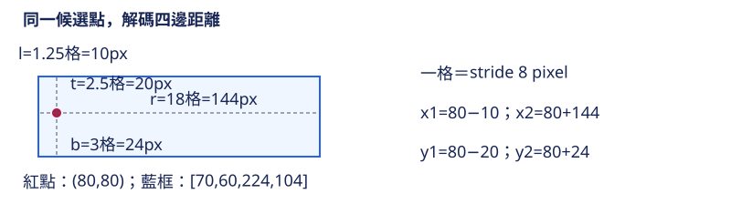

# 16.1 YOLO26 DFL-free：移除 bins，仍要把框學好

[在 Colab 執行本節](https://colab.research.google.com/github/birdhackor/learn_to_yolo/blob/lessons-v0.4.1/notebooks/16-dfl-free.ipynb){ .md-button }

若部署需求重視簡潔，可以直接預測四個距離嗎？第 12 章其實看過兩種做法。12.1 節讓每條邊直接輸出 1 個數，再經 softplus 變成正數。12.4 節的 DFL 改成每條邊輸出 K 個 logits，分別對應 0、1、…、K−1 格這 K 個距離刻度（bin），softmax 後取期望值當距離。DFL 多了相鄰兩個 bin 的監督（12.4 節的 DFL target），代價是 head 的輸出變多；匯出（export：把 PyTorch 模型轉成 ONNX、TensorRT 等部署格式，[第 20 章](20-deployment.md)實作）時，也多了幾種運算要處理。

YOLO26 是 Ultralytics 推出的 YOLO 版本，第 16 章逐項拆解它的設計。YOLO26 又改回每條邊 1 個數，而且不加 softplus。本節把「每條邊直接輸出一個距離數」叫做直接回歸。12.1 節叫它連續回歸，是同一種表示，只是 12.1 節另外加了 softplus。標題的 DFL-free，就是拿掉 DFL、改用直接回歸。讀完你能說明 YOLO26 怎麼關掉 DFL，能算出兩種表示涵蓋的距離範圍與輸出大小，也能說出拿掉 DFL 後官方還靠哪些 loss 學框。

本節結論：

1. **範圍**：K=16 的 DFL 只能表示 0～15 格，本例右邊的 18 格只有直接回歸學得到。YOLO26 的直接回歸不加 softplus，還能輸出負的距離。
2. **輸出大小**：K=16、2 個類別時，每個候選點的 raw 輸出（head 直接輸出、還沒做 softmax 或解碼的數）從 4×16＋2＝66 個數降到 4＋2＝6 個。
3. **框的 loss**：拿掉 DFL 不等於拿掉框的 loss。官方訓練仍用 CIoU（[11.4 節](11-iou-loss.md)的 IoU 類 loss）加正規化 L1，見後面〈官方訓練仍保留什麼〉。

前置：[四邊距離](12-anchor-free.md)和 [DFL 期望值](12-dfl.md)。ltrb 是候選點到框左、上、右、下四條邊的距離，本例的單位是特徵格，一格＝8 畫素；xyxy 是框的左上角 x、y 與右下角 x、y。

YOLO26 的官方設定檔（yolo26.yaml，連結見頁尾）寫 `reg_max: 1`。reg_max 是 Ultralytics 程式裡每條邊的 bin 數，也就是 12.4 節的 K；yaml 在這一行的註解就寫 `# DFL bins`。K=16 時 bins 是 0～15，最遠只能表示 15 格。這個名字容易誤會成「最大距離」，其實是 bin 的個數。負責最後輸出的 head 模組叫 `Detect`：reg_max>1 才接上 DFL；否則放一個 identity 層（`nn.Identity`），把輸入原樣傳出、不做計算，等於跳過 DFL。所以 YOLO26 把 reg_max 設成 1，程式就不建立 DFL。

本節的小實驗用 Smooth L1 當 loss，不是官方的 CIoU 加正規化 L1。直接回歸可以列為部署時的選項，但本節沒有證明它和 DFL 一樣準。

## reg_max=1：每條邊直接輸出 1 個數，不是只剩 1 個 bin

K=16 的 DFL，四條邊的 raw 輸出共 64 個 logits，分成 `[4,16]`：每條邊 16 個，bin0～bin15 分別代表 0～15 格。softmax 後，每條邊得到 16 個機率 p0、p1、…、p15，期望距離＝0×p0＋1×p1＋…＋15×p15。每個機率都 ≥0，總和又是 1，所以期望距離是 0～15 的加權平均，一定落在 `[0,15]` 格之間。

如果硬把 K=1 套進 DFL：softmax 只有一個數 z，機率恆為 e^z／e^z＝1；唯一的 bin0 代表 0 格，所以期望距離永遠是 1×0＝0。四個距離都是 0，框就縮成一點。官方不是這樣做。reg_max（即 K）＝1 時，程式跳過 softmax 與期望值，head 每條邊輸出的那 1 個數本身就是距離（單位：格），直接交給下面的距離解碼。

本例的真值是 `ltrb=[1.25,2.5,18,3]` 格，stride 8 時換成畫素是 `[10,20,144,24]`。第三條邊（右邊）18 格，超過 16 個 bin 的最大期望距離 15 格。直接回歸沒有這個由 bin 數造成的上限，程式學得到 18。這個例子只示範表示範圍，不代表 DFL 處理不了 144 畫素的邊。DFL 最遠可表示 15×stride 畫素，stride 8／16／32 分別是 120／240／480 畫素；同樣 144 畫素，在 stride 32 只有 4.5 格，16 個 bin 放得下。YOLO26 官方的輸出層正是 stride 8、16、32 三種；本例故意只用 stride 8，讓「超過 15 格」看得見。

兩種表示最後都用同一套四邊距離解碼：DFL 先算出期望距離，直接回歸則直接用輸出的數。候選點和 12.1 節一樣取格的中心：從 0 起算第 10 欄、第 10 列那一格（column=10、row=10）的中心是 `((10+0.5)×8,(10+0.5)×8)=(84,84)` 畫素。解碼同樣用 stride 8：`x1=84−1.25×8=74`、`y1=84−2.5×8=64`、`x2=84+18×8=228`、`y2=84+3×8=108`，得到 xyxy `[74,64,228,108]`。程式也把學到的距離解碼，用斷言（assert）逐值核對這個框。



圖中紅點是候選點 (84,84)；從紅點到藍框四邊的四個雙箭頭，就是 l、t、r、b 四個距離。x＝204（84＋15×8）的橘色虛線，是 K=16 的 DFL 在 stride 8 時，從紅點往右能表示的最遠位置；藍框右邊在 x＝228，超出這條線。

再看左邊的 1.25 格。DFL 的 target 把它拆給相鄰的 bin1 與 bin2，權重 0.75 與 0.25（12.4 節的做法）。把這組權重當機率算期望值（按機率加權的平均），`1×.75+2×.25=1.25`，正好還原 1.25 格。直接回歸則只要讓一個數接近 1.25。程式另外算了一組未訓練的 DFL：16 個 bin 的 logits 全是 0。這時 16 個 bin 的機率相等，每個都是 `1/16=.0625`，期望值剛好是 0～15 的正中間 7.5 格，可用來核對公式。

DFL 的期望值只會落在 0～15，12.1 節的 softplus 也只輸出正數。YOLO26 官方 head 在 reg_max（即 K）＝1 時，輸出後不接任何函數（就是上面的 identity），所以輸出可以是負數。這種可正可負的距離叫帶符號距離：負值表示框邊在候選點的另一側。能輸出負數有實際用途：YOLO26 選候選時，會把很小的真值框暫時放大，再看哪些點落在放大後的框內（[16.3 節](16-training.md)的 STAL），所以原框外的點也可能被選上。被選上的點要學的仍是到原框的距離；點在原框外，至少有一邊的目標距離是負的。12.1 節為了教學方便使用 softplus，是另一種設計選擇，不能說 YOLO26 也採用它。少了「不能為負」和「最多 15 格」這兩個限制，框合不合理就要透過 loss 學出來。負距離怎麼解碼，見自主練習第 3 題。

## 真正測一次學習與輸出大小

這裡沒有網路，要學的就是四個數本身，也沒有 softplus：四個數從 0 開始，直接拿去和 target 算 loss。下面摘錄完整程式（Colab 裡那份，或本機的 `lesson_cases/16-dfl-free.py`）`main()` 裡的學習部分，加上中文註解。`...` 表示省略的行：初始 loss 的計算與斷言，以及只在第一步（`step == 0`）執行的斷言與 print。

``` { .python data-excerpt="lesson_cases/16-dfl-free.py" }
target = torch.tensor([[1.25, 2.5, 18., 3.]])  # 四邊真值 [l,t,r,b]，單位：格
distance = nn.Parameter(torch.zeros(1, 4))     # 1 個候選點 × 4 條邊，從 0 開始；要學的就是這四個數
optimizer = torch.optim.SGD([distance], lr=.5)
...
for step in range(300):                        # 更新 300 次
    optimizer.zero_grad()                      # 清掉上一步的梯度，否則會累加
    loss = F.smooth_l1_loss(distance, target)  # 四邊各算 Smooth L1，再取平均
    loss.backward()                            # 算出 loss 對四個數的梯度
    ...
    optimizer.step()                           # 新值 = 舊值 - lr × 梯度
    ...
```

PyTorch 的 Smooth L1 預設 beta=1；beta 是平方段與線性段的分界，就是 12.1 節的分界 1。令某一邊的誤差 e＝distance−target，這一邊的 loss 是：

- |e|≥1 時，|e|−0.5（線性段）；
- |e|<1 時，0.5×e²（平方段）。

一開始四個 distance 都是 0，e＝[−1.25, −2.5, −18, −3]，四項 loss 是 `[.75,2,17.5,2.5]`，平均 5.6875。四個 e 都小於 −1，都在線性段。這時單項 loss＝|e|−0.5＝target−distance−0.5，對 distance 的斜率是 −1。也就是說，distance 比 target 小，把它調大會讓 loss 變小，所以梯度是負的。loss 是四項的平均（每項乘 1/4），所以每個 distance 的梯度＝−1/4＝−0.25。SGD 的更新是新值＝舊值−lr×梯度＝0−0.5×(−0.25)＝0.125，四邊都一樣。程式印出這兩個數（輸出的 `first Smooth L1 gradient`、`first SGD distance` 兩行），並用斷言核對。

總共更新 300 次後，loss 接近 0，四邊接近 `[1.25,2.5,18,3]`。右邊 18 格為什麼要比較多步？在線性段，不論誤差多大，梯度都固定是 −0.25，每步只前進 0.5×0.25＝0.125 格。右邊要走 136 步，誤差才從 18 降到 1，第 137 步後才小於 1、進入平方段；左邊 1.25 只要 3 步。進入平方段後，單項斜率是 e，梯度是 e/4；每步 distance 改變 −0.5×e/4＝−e/8，所以誤差變成原來的 7/8，四邊都一樣。右邊慢，是慢在線性段每步只走 0.125 格。

接著比較輸出大小，算法沿用 12.4 節。固定 B=1 張圖、P=100 個候選點、C=2 個類別，並假設只比較 raw 框與類別輸出：

| 表示 | 每候選數值 | 全部數值 | float32 bytes（每個數 4 bytes） |
| --- | --- | --- | --- |
| DFL，K=16 | `4×16+2=66` | 6,600 | 26,400 |
| 直接回歸 | `4+2=6` | 600 | 2,400 |

執行 `PYTHONPATH=. python lesson_cases/16-dfl-free.py`（或在 Colab 執行完整程式），核對輸出：

- `direct learned distances`：直接回歸學到 18；
- `finite-bin expectation range: [0, 15]`：有限個 bin 的期望值上界是 15；
- `raw head values DFL / direct: 6600 600` 與 `float32 raw head bytes: 26400 2400`：表格的兩組數字；
- loss 低於 `1e-6`：由完整程式的斷言核對；印出的 `Smooth L1 5.687500 -> 0.000000` 只顯示到小數第 6 位。

只需要 CPU，不必下載模型。

## 這個小實驗能證明／不能證明什麼

能證明：

- 直接回歸的四個數真的學得到 18 格，超過 K=16 的 DFL 期望值上限 15 格。
- 學到的距離經同一套解碼，得到 `[74,64,228,108]`。

不能證明：

- **模型的定位準確度**：本例只把四個自由參數從 0 擬合到一組 target，沒有特徵輸入，也沒有訓練 CNN head；也沒有對應的輸入圖片，只研究座標。它只證明這種表示涵蓋得到 18 格。
- **直接回歸和 DFL 一樣準**：本節沒有比較兩者的定位品質。前面全 0 logits 的 7.5 格也不是訓練過的 DFL，不能拿來和直接回歸的結果比較準確度。
- **官方 loss 下的表現**：本例只用教學用的 Smooth L1，沒有跑官方的 CIoU 加正規化 L1（見後面〈官方訓練仍保留什麼〉）。
- **YOLO26 實際訓練的收斂速度**：上面 137 步、7/8 這些數字，只描述四個獨立參數的優化。
- **整個模型的記憶體、參數量或延遲**：表格只是最後 raw 輸出的大小。如果 DFL 版和直接回歸版 head 的中間層 channel 數（hidden 寬度）不同，卷積計算量也會不同。本節沒有量測整個模型的速度。
- **DFL 遇到 18 格時的 loss**：18 格的 DFL target 要用 bin18 和 bin19，但 K=16 只有 bin0～bin15，程式要去讀不存在的 bin，會直接報錯（官方做法是先把 target 截到 14.99 格，見 12.4 節）。所以本例不拿這種 target 和直接回歸比較 loss。

## 官方訓練仍保留什麼

官方程式用 `BboxLoss` 這個模組計算框 loss。在本書查核的版本裡，reg_max（即 K）>1 時，它算 CIoU 加 DFL；DFL-free（reg_max=1）時仍計算 CIoU，只是把 DFL 換成正規化 L1。正規化 L1 的做法是：先把預測和 target 的格單位距離都乘 stride 換成畫素；左、右距離除以圖寬，上、下距離除以圖高；再對四邊取 |預測−目標| 的平均（這就是 L1 loss）。例如 640×640 的輸入，右邊 18 格×8＝144 畫素，正規化後是 144/640＝0.225。

以上是一個正樣本的值。合計全部正樣本時，每個正樣本的值先乘上它的類別 target（[12.2 節](12-decoupled-head.md)提過：依預測品質給的 0～1 分數），加總後再除以這些類別 target 的總和；CIoU 那一項也用同樣的加權。最後整項再乘超參數 `dfl`（預設 1.5）：DFL-free 時要調這個 L1 的比重，調的就是 `dfl`。

原始程式中這一項的變數仍叫 `loss_dfl`，超參數也仍叫 `dfl`，但這個分支實際算的是 L1，訓練時印出的 loss 名稱是 `l1_loss`；閱讀程式要看運算，不只看名稱。權重、正樣本品質與 assignment（哪些候選點負責哪個物件）也會影響訓練。不能把框 loss 全部刪掉，還指望框自己變準。

## 收益、代價與常見錯誤

收益：每條邊不再需要 16 個 bin 的 logits、softmax 與期望值，也沒有 15 格的距離上限。推論時的運算圖（模型依序執行的那串運算，[第 20 章](20-deployment.md)的用詞；不是第 0、2 章為 backward 記下的計算圖，也不是畫出來的結果圖）少了幾步：把每條邊重排成 16 個 bin、做 softmax、乘上 0～15 再加總。匯出時，轉換工具與硬體要支援的運算也比較少。

代價：失去相鄰 bin 的分佈監督，要另外確認直接回歸的尺度、梯度與定位表現。少了幾個運算，不代表每種裝置都一定更快；要在目標裝置上把兩種 head 都實際匯出、量測延遲才能比較。第 20 章示範匯出與量測延遲的做法，但那裡匯出的是第 7 章的 GridDetector，檢查的是同一種模型換成不同執行程式（PyTorch、ONNX Runtime、TensorRT）後輸出是否一致，並量各自的執行時間；本書沒有做 DFL 與直接回歸的延遲對照。

常見錯誤：

- **對 K=1 仍做 softmax**：期望距離永遠是 0。
- **把 reg_max（即 K）當成最遠距離**：會誤以為 reg_max=1 只能表示 1 格。
- **把 DFL-free 當成 NMS-free**：YOLO26 設定檔另有 `end2end: True`，控制一對一分支（[16.2 節](16-inference-head.md)）；它和 `reg_max` 是兩個不同的設定。移除 DFL 改的是框的表示方式；能不能省掉 NMS，改的是監督與推論路徑。兩件事要分開驗證。
- **head 的框輸出已改成每個候選點 4 個數，loss 卻仍照 DFL 把它重排成每條邊 16 個 bin**：程式會報錯；或者數值總數剛好能被每組的個數（例如 DFL 每個候選點的 4×16＝64 個）整除，就不報錯，卻被默默分錯組。

## 自主練習

先自己算，再展開參考答案。第 2 題要改完整程式（Colab 裡那份，或本機的 `lesson_cases/16-dfl-free.py`）。

1. 紙筆題：右邊改成 8 格，K 仍是 16。DFL 放得下嗎？直接回歸呢？這時還能用「DFL 放不下」來支持直接回歸嗎？
2. 把完整程式 `main()` 裡 `target` 的右邊從 18 改成 8。還有哪幾個斷言要跟著改、改成什麼？沒跟著改的斷言會在那一行報錯停下。初始的平均 loss 變成多少？
3. 程式裡另有一個帶符號例子 `[-1,2,3,4]`。用同一點 (84,84)、stride 8 解碼，會得到什麼框？候選點在框的哪一側？再試 `[-3,2,2,4]`，解出的框合法嗎？一般來說，四個距離要滿足什麼條件，框才合法？

??? note "參考答案"

    **第 1 題**：8 格在 0～15 之內，DFL 和直接回歸都放得下。所以這時不能再以「DFL 放不下」支持直接回歸。

    **第 2 題**：連 `target` 在內，要同步改四處，不能沿用 18 格的檢查：

    - `target = torch.tensor([[1.25, 2.5, 18., 3.]])` 的 `18.` 改成 `8.`（也就是 `target[0,2]`）；
    - `initial_terms` 斷言的預期值 `[[.75, 2., 17.5, 2.5]]`，第 3 項 `17.5` 改成 `7.5`；
    - 範圍斷言 `assert expected.max() <= k - 1 and target.max() > k - 1` 的後半，改成 `target.max() <= k - 1`（程式裡的 k 是小寫）；
    - `decoded` 斷言的預期值 `[[74., 64., 228., 108.]]`，x2 的 `228.` 改成 `148.`（84＋8×8＝148）。

    初始平均 loss 會自動變成 (0.75＋2＋7.5＋2.5)/4＝3.1875，計算式不用改。其他斷言不用改：四個誤差仍都小於 −1，第一步梯度仍是 −0.25；300 步後 loss 也仍低於 `1e-6`。新的 target 在 DFL 範圍內，原題的 18 格則不在。

    **第 3 題**：`[-1,2,3,4]` 解碼成 x1＝84−(−1)×8＝92、y1＝84−2×8＝68、x2＝84＋3×8＝108、y2＝84＋4×8＝116，也就是 `[92,68,108,116]`。x1＝92 比候選點的 x＝84 還大，所以候選點在框的左側（框外），卻仍能構成合法框；程式也用斷言確認 `x1<x2`、`y1<y2`。

    但不是任意負距離都合法。框寬＝x2−x1＝(l＋r)×stride，框高＝(t＋b)×stride，所以只要 `l+r>0` 且 `t+b>0`，框就合法（`x1<x2`、`y1<y2`）。反例 `[-3,2,2,4]`：x1＝84＋24＝108、x2＝84＋16＝100，`x1>x2`，不是合法框。

參考來源：[YOLO26 官方配置](https://github.com/ultralytics/ultralytics/blob/441632cdfd19e22e60a4b1b1999d46326ca51ec4/ultralytics/cfg/models/26/yolo26.yaml)、[Detect 的 DFL/identity 分支](https://github.com/ultralytics/ultralytics/blob/441632cdfd19e22e60a4b1b1999d46326ca51ec4/ultralytics/nn/modules/head.py)、[DFL-free BboxLoss](https://github.com/ultralytics/ultralytics/blob/441632cdfd19e22e60a4b1b1999d46326ca51ec4/ultralytics/utils/loss.py)、[超參數 dfl 的預設值](https://github.com/ultralytics/ultralytics/blob/441632cdfd19e22e60a4b1b1999d46326ca51ec4/ultralytics/cfg/default.yaml)。

<!-- curriculum-evidence:start -->

## 實際執行紀錄

本節的完整程式於 2026-10-05 在 INTEL(R) XEON(R) PLATINUM 8573C（2 個執行緒）上用 PyTorch 2.9.1+cpu 執行，程式裡的 assert 全部通過。下面是那次印出的原始輸出；輸出裡若有計時或訓練得到的數字，換一台電腦會略有不同。每個數字的意思，以本頁正文的說明為準。[完整紀錄（JSON）](https://github.com/birdhackor/learn_to_yolo/blob/main/artifacts/checks/curriculum/16-dfl-free.json)

??? example "展開本次實際輸出"

    ```text
    first Smooth L1 gradient: [[-0.25, -0.25, -0.25, -0.25]]
    first SGD distance: [[0.125, 0.125, 0.125, 0.125]]
    direct learned distances: [[1.25, 2.5, 18.0, 3.0]]
    Smooth L1 5.687500 -> 0.000000
    decoded direct box pixels: [[74.0, 64.0, 228.0, 108.0]]
    signed-distance example box pixels: [[92.0, 68.0, 108.0, 116.0]]
    untrained DFL probability per bin: [0.0625, 0.0625, 0.0625, 0.0625, 0.0625, 0.0625, 0.0625, 0.0625, 0.0625, 0.0625, 0.0625, 0.0625, 0.0625, 0.0625, 0.0625, 0.0625]
    untrained DFL expected distances: [[7.5, 7.5, 7.5, 7.5]]
    DFL target for 1.25: bins 1/2 weights .75/.25; direct target is the value 1.25
    finite-bin expectation range: [0, 15] ; direct target reaches 18.0
    raw head values DFL / direct: 6600 600
    float32 raw head bytes: 26400 2400
    DFL-free still requires box supervision; this experiment uses Smooth L1
    ```

<!-- curriculum-evidence:end -->
