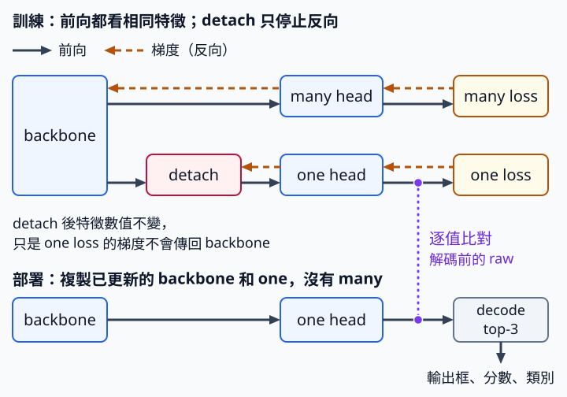

# 16.2 YOLO26 推論 head：把訓練用的分支從部署模型真正拿掉

[在 Colab 執行本節](https://colab.research.google.com/github/birdhackor/learn_to_yolo/blob/lessons-v0.6.0/notebooks/16-inference-head.ipynb){ .md-button }

訓練時有兩個 head，不代表部署時也要執行兩個。部署是把訓練好的模型放到實際使用的環境（例如伺服器、手機），只做推論、不再訓練。本節用一個小模型示範：怎樣把 YOLO26 這類雙 head 模型訓練用的輔助 head，從部署模型真正拿掉，並確認留下的部分算出的數和原本一致。讀完本節，你能把雙 head 模型改寫成只含推論所需部分的部署模型，也能用參數名稱、逐值比對和手算例子，確認沒有拿錯權重、也沒有解錯框。

先固定兩個名字，沿用 [13.1 節](13-dual-assignment.md)的雙 head：many 是一對多監督的輔助 head，one 是一對一監督的 head。本節走 NMS-free（推論時不跑 NMS）的部署路徑，只留 backbone 和 one。下文只用 many、one 這兩個名字。

為什麼不直接部署訓練用的雙 head 模型（程式裡的 `DualToy`），只讀它回傳的 `['one']` 就好？因為它每次 forward 仍會白算一次 many，模型也多帶 many 的 54 個參數。所以本節另外建立只裝 backbone 和 one 的部署模型（程式裡的 `DeployToy`），再核對四件事：

1. **many 真的不在了**：部署模型的參數名稱裡沒有 many，參數總數從 332 降到 278。
2. **權重沒有拿錯**：部署模型在解碼前的輸出，和原雙 head 模型的 one 輸出逐值完全相同。
3. **解碼的單位與 channel 順序正確**：人工例子解出的框、分數、label（類別編號）都對。
4. **回傳格式正確**：部署模型回傳三個 tensor，shape 依序是 `[B,3,4]`、`[B,3]`、`[B,3]`（B 是圖片張數）。

這些項目大多由完整程式（Colab 裡那份，或本機的 `lesson_cases/16-inference-head.py`）裡的斷言（assert）核對；332／278 和 labels 的 shape 只印出來，沒有斷言。

前置：13.1 節的一對多／一對一雙 head、[16.1 節](16-dfl-free.md)的 DFL-free（每條邊直接輸出一個距離數），以及[第 0 章](00-warmup.md)的 train／eval 模式。

先複習 13.1 節。一對多（one-to-many）讓每個真值物件分配到多個正候選，提供較密集的訓練訊號；一對一（one-to-one）的目標是讓 one 學著減少重複，13.1 的 YOLOv10 用 top-1 初選；其衝突後的數量並非嚴格保證。本章的 YOLO26 則在衝突後再篩一次（16.3 的 `topk2=1`），最終每個 GT **至多**一個正候選，也可能沒有。這兩個名稱描述的是監督關係，不是說整張圖只准輸出一框。在本節的 NMS-free 部署路徑上，many 只在訓練時幫忙；推論只用 one，再用 top-k（只留分數最高的前 k 個）選出輸出，省掉 NMS 那種「兩框 IoU 太高就刪掉一個」的步驟。前提是 one 已經學好適合的分數。

本例的起點是一個雙 head 小 CNN，並把問題縮到最小：單一尺度、兩個類別、16 個候選，輸出用單標籤 top-3（每個候選只保留分數最高的一個類別，再從 16 個候選挑分數最高的 3 個）。這是教學用的小模型：softplus 距離、簡單卷積和人工平方 loss 都不是官方 YOLO26，loss 也沒有實作任何 assignment，所以模型沒有學到「一個物件只出一個框」；本節只驗證部署流程，不驗證偵測效果。

??? note "官方 YOLO26 怎麼做"

    以下關於官方程式的說法，都以頁尾參考來源連到的那一版官方程式為準。已核對三件事：

    - **兩組分支都參與訓練**：設定檔 `yolo26.yaml` 寫 `end2end: True`（end-to-end，端到端）。偵測 head 因此除了 many 那組分支，還多建一組 one 分支，供不跑 NMS、直接輸出最後框的推論使用；訓練時兩組都算 loss。
    - **推論前拿掉用不到的分支**：官方偵測 head（`Detect`）有個 `fuse()` 方法，會把這次推論用不到的那一組分支拿掉。它和「卷積／BN 融合」不是同一件事，差別見下文〈收益、代價與部署檢查〉。
    - **兩種「預設」要分開看**：[原論文](https://arxiv.org/abs/2606.03748) §3.2.1 把 one-to-one head 標為預設（default）。但在本書固定的官方版本裡，官方的預測函式 `model.predict()`（已包好前處理與後處理）預設走 many 加 NMS；要傳 `nms=False`，才改走 one、不做 NMS，見[官方訓練說明](https://github.com/ultralytics/ultralytics/blob/441632cdfd19e22e60a4b1b1999d46326ca51ec4/docs/en/guides/yolo26-training-recipe.md)。

    本節模擬的是 `nms=False` 這條 NMS-free 路徑。論文的設計和預測函式的預設值是兩回事；自己部署時，要明確設定 `nms`，不要假設它預設走哪條路。

## 訓練輸出與部署輸出格式不同，不能混用

輸入是 `[B,3,64,64]`，也就是 B 張 64×64 的 RGB 圖。小 backbone 只有三層：3×3 卷積（3→8 channel、stride 2、padding 1），把 64×64 變成 32×32；ReLU；`AdaptiveAvgPool2d(4)`，不論輸入多大，都把每個 channel 平均成 4×4（第 1 章的 GAP 就是 `AdaptiveAvgPool2d(1)`）。所以 backbone 輸出 `[B,8,4,4]`，每格對應輸入的 64/4＝16 畫素，這就是 stride 16。

`DualToy` 的 many 和 one 都是 8→6 的 1×1 卷積，各輸出 `[B,6,4,4]`。六個 channel 依序是 `[l,t,r,b,class0,class1]`。前四項 raw（head 直接輸出、還沒轉換的數）經 softplus（\(\text{softplus}(r)=\ln(1+e^{r})\)，可把任意數變成正數）後，才是以特徵格為單位的四邊距離；後兩項是兩個類別的 logits。`DualToy` 回傳 dict `{'many': ..., 'one': ...}`；部署模型 `DeployToy` 真正回傳的，則是 `(top_boxes, top_scores, top_labels)` 三個 tensor：

| 部位 | shape，B=2 | 單位 | 是否為部署模型的回傳值 |
| --- | --- | --- | --- |
| raw 候選 | `[2,16,6]` | 四邊 raw＋兩類 logits | 否，forward 內部中間值 |
| decoded boxes | `[2,16,4]` | 64×64 輸入的畫素 xyxy | 否，forward 內部中間值 |
| top-3 boxes | `[2,3,4]` | 64×64 輸入的畫素 xyxy（從 decoded boxes 依分數挑前三個） | 是，第一項 |
| top-3 scores／labels | `[2,3]`／`[2,3]` | sigmoid 分類分數／整數類別 | 是，第二／三項 |

完整程式的 `main()` 在人工例子之後，建立 `DualToy` 並做一次假的更新：

``` { .python data-excerpt="lesson_cases/16-inference-head.py" }
# main() 內
model = DualToy()
image = torch.rand(2, 3, 64, 64)  # B=2 張 64×64 的隨機圖
optimizer = torch.optim.SGD(model.parameters(), lr=.02)
optimizer.zero_grad()
output = model(image)  # DualToy 回傳的 dict：{'many': ..., 'one': ...}
loss = output['many'].square().mean() + output['one'].square().mean()
loss.backward()
before = model.one.weight.detach().clone()  # 更新前 one 權重的副本
optimizer.step()
# one 的權重必須真的變了；否則更新前的 one 副本也能通過後面的逐值比對
assert not torch.equal(before, model.one.weight)
```

loss＝mean(many²)＋mean(one²)：把兩個 head 的 raw 各自平方再平均，等於要所有輸出往 0 靠，沒有任何物件標註。這一步的目的有兩個：一是確認 forward、backward、step 跑得通；二是讓 one 的權重離開初始值。它不是在教偵測，不能用來證明 NMS-free 偵測成功。

第二個目的由最後的斷言核對，做法和[第 2 章](02-diagnostics.md)比較 body 更新前後的副本相同：step 之前用 `.detach().clone()` 存一份 one 權重的副本 `before`（clone 複製出獨立的數字，step 改了權重，`before` 也不會跟著變），step 之後斷言兩者不再相同。`torch.equal(a, b)` 只在兩個 tensor 的 shape 相同、每個數也都相同時回傳 True，所以 `not torch.equal(...)` 要求至少有一個數變了。若忘了呼叫 step、把學習率設成 0，或 loss 漏掉 one 那一項，one 的權重會原封不動，程式就停在這個斷言。這個斷言只看 one 的權重 `model.one.weight`，不看 one 的 bias，也不看 backbone。one 的權重真的變了，之後部署模型若誤複製到更新前的 one 權重，逐值比對才會失敗。

`DualToy` 的 one 讀的是 `features.detach()`（backbone 特徵切斷梯度後的版本），所以 one loss 只更新 one head，只有 many loss 會更新 backbone。detach 只擋反向傳播，不改前向算出的數值，所以部署模型不需要它；它也不會讓 one 自動學會「一個物件只出一個框」。



圖中實線箭頭是前向，虛線箭頭是梯度，one loss 的梯度到 detach 就停止；點線標出兩個 one head 輸出的逐值比對。

## 真正移除而不是只是忽略

要讓 many 真正離開部署模型，做法是另建一個根本沒有 many 的 module。`DeployToy` 只有 `self.backbone` 和 `self.head` 兩個子模組，沒有 `self.many`。建立時，它從已更新的 `DualToy` 複製 backbone 和 one：

``` { .python data-excerpt="lesson_cases/16-inference-head.py" }
# DeployToy.__init__ 內：trained 是傳進來、已更新的 DualToy
self.backbone = copy.deepcopy(trained.backbone)
self.head = copy.deepcopy(trained.one)  # 只複製 one；many 不複製
```

為什麼要用 `copy.deepcopy`？若只寫 `self.head = trained.one`，兩個模型會共用同一組權重；之後再訓練 `model`，部署模型也會跟著變。`copy.deepcopy` 會連同權重複製出獨立的一份。這和[第 0 章](00-warmup.md)的道理相同：`alias = model.weight` 只是別名，要 `clone()` 才是副本。

完整程式的 `main()` 接著建立部署模型，再逐值比對：

``` { .python data-excerpt="lesson_cases/16-inference-head.py" }
# main() 內：model 就是同一個 DualToy
deploy = DeployToy(model).eval()  # model 傳進去，就是 __init__ 裡的 trained
with torch.no_grad():
    reference = model(image)['one']  # 原雙 head 模型的 one 輸出：[B,6,4,4]
    deploy_raw = deploy.head(deploy.backbone(image))  # 部署模型解碼前的 raw：[B,6,4,4]
    assert torch.equal(reference, deploy_raw)  # 逐值完全相同，沒有容差
```

比對時不呼叫 `deploy(image)`，因為它會解碼，而且只回傳 top-3。這裡另外呼叫 `deploy.head(deploy.backbone(image))`，在解碼前取得還沒攤平的 `[B,6,4,4]`；這樣才和原模型的 `['one']` 同形狀，可以逐值比較。所以比的是 raw，不是三個 top-k 回傳值。

`deploy` 切到 eval，兩邊都在 `no_grad`（不記錄計算圖）下比較；`model` 則沒有切 eval。本例沒有 BatchNorm、Dropout 這類在 train 和 eval 模式行為不同的層，所以 `model` 沒切 eval，結果也一樣；換成有這些層的模型，兩邊都要先 `.eval()`。

斷言用的也是 `torch.equal`：`reference` 和 `deploy_raw` 的每個數都要完全相等才算通過，沒有容差（允許的誤差範圍）。能要求完全相等，是因為 `copy.deepcopy` 複製出的權重和原本的每個數完全相同，兩邊又在同一個程式裡、對同一張圖做同樣的運算。有容差的比較，例如第 4 章〈[座標轉換與還原](04-coordinates.md)〉用過的 `torch.allclose`，可能放過「部署權重只差一點點」的錯；`torch.equal` 則只要有一個數不同就失敗。反過來說，只要運算方式變了，例如下文〈收益、代價與部署檢查〉提到的卷積／BN 融合，或把模型交給別的執行程式（第 20 章），結果的最後幾位就可能不同，這時只能改用有容差的比較。

本例 backbone 有 3×3×3×8＋8＝224 個參數：8 個輸出 channel，每個有 3×3×3 個權重和 1 個 bias。每個 8→6 的 1×1 head 有 8×6＋6＝54 個參數：6 個輸出 channel，每個有 8 個權重和 1 個 bias。訓練模型共 224＋54＋54＝332 個，部署模型 224＋54＝278 個，少了 54/332≈16%。這個比例只屬於本例，不能拿來預測 YOLO26 全模型能省多少。

完整程式也用斷言檢查部署模型的參數名稱，防止「輸出不用它，但模型檔仍帶著它」：

``` { .python data-excerpt="lesson_cases/16-inference-head.py" }
assert not any('many' in name for name, _ in deploy.named_parameters())
```

`named_parameters()` 會列出每個參數的名稱。部署模型只有 `backbone.0.weight`、`backbone.0.bias`、`head.weight`、`head.bias` 四個，都沒有 many。

## 從 16 個位置到前三個

部署模型的 forward 要把 head 的 raw 變成最後的三個框。4×4 特徵圖的每一格是一個候選，共 16 個。沿 x 或 y 方向，第 i 格（i＝0～3）的中心在 (i＋0.5)×16 畫素，所以兩個方向的中心都是 8、24、40、56；16 個中心點就是 x、y 各取這四個值的組合。

forward 先把 head 輸出的 `[B,6,4,4]` 攤成 `[B,16,6]`：`flatten(2)` 把最後兩軸的 4×4 攤成 16，得 `[B,6,16]`；`transpose(1, 2)` 交換第 1、2 軸，得 `[B,16,6]`，每一列是一個候選的 6 個 raw。

攤平時一列一列排：先排最上面一列，由左到右 4 格，再排下一列，依此類推。所以第 k 個候選（k＝0～15）在第 k//4 列、第 k%4 欄（k//4 是 k 除以 4 的商，k%4 是餘數，都從 0 數），中心點 (x,y)＝((k%4＋0.5)×16, (k//4＋0.5)×16)。例如 (24,40) 在第 2 列第 1 欄，k＝2×4＋1＝9。程式產生 16 個中心點時用同一個順序，所以 raw 的第 k 列和第 k 個中心點對得上。

DFL 通常每邊輸出多個 bins，softmax 後取期望距離；DFL-free 每邊只直接輸出一個值。本例再用 softplus 把這個值限制為正數，這是教學用的設計選擇；官方 `reg_max=1` 時，可直接回歸帶符號（可正可負）的值。距離乘 16 換成畫素，再由中心點加減，得到畫素 xyxy。分類使用獨立的 sigmoid，沒有另外的 objectness（物件分數 obj），所以不能沿用第 7 章早期 grid detector 的 `obj×softmax(class)` 分數公式。

下面是 `DeployToy.forward`，程式和完整程式相同，只把註解換成中文：

``` { .python data-excerpt="lesson_cases/16-inference-head.py" }
def forward(self, image):  # image：[B,3,64,64]
    # head 輸出 [B,6,4,4]；flatten(2) → [B,6,16]；transpose(1, 2) → [B,16,6]
    raw = self.head(self.backbone(image)).flatten(2).transpose(1, 2)  # B,16,6
    # 前四項經 softplus 變成正的距離：[B,16,4]，單位是格（教學選擇，不是官方 YOLO26 的做法）
    distance = F.softplus(raw[..., :4])
    axis = (torch.arange(4, device=image.device, dtype=image.dtype) + .5) * 16  # [8,24,40,56]
    y, x = torch.meshgrid(axis, axis, indexing='ij')  # 各 [4,4]：y 由上到下變，x 由左到右變
    points = torch.stack((x, y), -1).reshape(1, 16, 2)  # [1,16,2]：第 k 個中心點對應 raw 的第 k 列
    boxes = decode_ltrb(points, distance, stride=16)  # [B,16,4]：64×64 輸入的畫素 xyxy
    # 後兩項是兩類 logits：各自做 sigmoid，每個候選只留最高分的類別（簡化）；scores、labels 各 [B,16]
    scores, labels = raw[..., 4:].sigmoid().max(-1)
    top_scores, ids = scores.topk(3, dim=1)  # 分數前三名與它們的候選編號，各 [B,3]
    # 依 ids 取出那三個候選的框與類別：[B,3,4]、[B,3]（gather 見下方摺疊區）
    return boxes.gather(1, ids[..., None].expand(-1, -1, 4)), top_scores, labels.gather(1, ids)
```

`decode_ltrb` 是完整程式開頭的小函式，算的是 x1＝x−l×stride、y1＝y−t×stride、x2＝x＋r×stride、y2＝y＋b×stride。

??? note "gather 怎麼從 16 個框挑出 3 個"

    `scores.topk(3, dim=1)` 回傳每張圖分數前三名的分數 `top_scores`，以及它們的候選編號 `ids`，shape 都是 `[B,3]`。假設第 0 張圖的 `ids[0]` 是 `[9,2,5]`，我們要的就是 `boxes[0,9]`、`boxes[0,2]`、`boxes[0,5]` 這三個框。

    `gather(1, index)` 沿第 1 軸（候選軸），依 index 裡的編號取值；輸出的 shape 和 index 相同。對三維的 boxes 來說，結果的 `[b,j,c]` 等於 `boxes[b, index[b,j,c], c]`。我們要的輸出是 `[B,3,4]`（每框 4 個座標），所以 index 也要是 `[B,3,4]`：

    - `ids[..., None]` 在最後加一軸：`[B,3]` → `[B,3,1]`。
    - `.expand(-1, -1, 4)` 把長度 1 的最後一軸擴成 4（-1 表示該軸長度不變）：`[B,3,1]` → `[B,3,4]`。四個座標用同一個候選編號。expand 不真的複製資料，4 個位置讀的都是 `ids` 裡同一個數；這裡只讀不改，所以沒問題，要改其中的值，得先 `clone()`。

    所以結果的 `[b,j,c]` 就是 `boxes[b, ids[b,j], c]`：第 0 張圖依序取出候選 9、2、5 的四個座標。labels 每個候選只有一個數，`labels.gather(1, ids)` 直接用 `[B,3]` 的 ids，得到 `[B,3]`。

程式先用一組人工指定的測試輸入核對解碼，再看隨機 head 的輸出。取點 (x,y)＝(24,40)，也就是第 9 個候選的中心；stride 16；softplus 後的距離 [l,t,r,b]＝[1,0.5,2,1.5] 格。乘 16 得 [16,8,32,24] 畫素，所以 x1＝24−16＝8、y1＝40−8＝32、x2＝24＋32＝56、y2＝40＋24＝64，框是 [8,32,56,64]。

類別 logits 是 [0,ln3]：\(\text{sigmoid}(0)=1/2\)，\(\text{sigmoid}(\ln 3)=1/(1+e^{-\ln 3})=1/(1+1/3)=3/4\)，所以分數是 [0.5,0.75]，應取 label 1、score 0.75。0.5＋0.75≠1，因為兩類各自做 sigmoid，不像 softmax 要加總為 1。程式用 float32 計算：ln 3 存成 float32 時已經捨入過，sigmoid 的計算也會捨入，所以算出的分數不一定剛好是 0.75（第 4 章〈[座標轉換與還原](04-coordinates.md)〉講過這種極小的捨入誤差）。因此完整程式用有容差的 `torch.allclose` 核對分數，印出前再四捨五入到小數第 4 位。

這組 raw 要倒算出來，softplus 後才會剛好是指定的距離 d：

\[
\text{softplus}(r)=d \iff \ln(1+e^{r})=d \iff e^{r}=e^{d}-1 \iff r=\ln(e^{d}-1).
\]

程式寫成 `log(expm1(distance))`：`expm1(d)` 就是 \(e^{d}-1\)（d 很小時，比先算 \(e^{d}\) 再減 1 精確）。例如 d＝1 時 r≈0.541，d＝0.5 時 r≈−0.433：raw 可以是負的，經 softplus 後仍是正距離。這組 raw 是人工倒算的，不是模型學到的。

完整程式用斷言逐值核對框、分數與 label，所以驗證的是單位和 channel 順序，不只是 shape。這個人工例子直接呼叫 `decode_ltrb` 和 sigmoid，沒有經過 `DeployToy.forward`，所以不檢查 16 個候選的排列順序；排列順序靠上面 flatten 和中心點用同一種順序來保證。

本例先讓每個候選只取最大的類別分數，再取 top-3，所以同一個候選只會輸出一個類別。官方 head 在 NMS-free 模式的預設做法不同，分兩階段取 top-k：先依每個候選的最高類別分數，取前 k 個候選；接著把這 k 個候選在各類別的分數全部攤平，從中取前 k 個（每個是一組「候選, 類別」）。所以同一個位置可能以兩個類別各出現一次。例如某候選 class0＝0.8、class1＝0.7：官方的兩筆都可能輸出，本例只輸出 (class0, 0.8) 一筆。兩種做法都不看兩框的 IoU 刪框：這裡沒有 NMS，但仍有依分數的挑選，以及輸出數的上限 k。

執行 `PYTHONPATH=. python lesson_cases/16-inference-head.py`（或在 Colab 執行完整程式），核對輸出。開頭兩行印在人工例子的斷言之後，其餘各行印在全部斷言之後；任何一個斷言不成立，程式都會在那裡報錯停下，後面的行就不會印出。

- `manual ltrb decode box: [[8.0, 32.0, 56.0, 64.0]]`：人工例子解出的框，和上面手算的 [8,32,56,64] 相同。
- `manual class probabilities: [[0.5, 0.75]] ; winner label=1, score=0.75`：兩類的 sigmoid 分數，以及程式從中取出的最高分類別 label 和它的分數 score；分數都四捨五入到小數第 4 位才印，和手算一致。
- `training output keys: ['many', 'one']`：`DualToy` 回傳的 dict 有 many、one 兩個 key。
- `deploy boxes / scores / labels: (2, 3, 4) (2, 3) (2, 3)`：部署模型三個回傳值的 shape。
- `parameters training / deploy: 332 278`：參數從 332 降到 278。
- `retained one-head raw output vs reference, max abs difference: 0.0`：部署模型解碼前的 raw 和原模型 one 輸出逐值相減、取絕對值後的最大值，由程式當場算出。這行印在 `torch.equal` 斷言之後，兩邊已確定完全相同，所以印出的一定是 0.0。
- `top-k has no pairwise IoU/NMS; random toy predictions are not accuracy evidence`：固定印出的提醒，意思是 top-k 不比較兩框的 IoU，也沒有 NMS；隨機小模型的預測不能當成準確度的證據。

top-3 一定輸出三個候選，即使它們都是背景。實際使用時，還要加上 score 門檻（拿候選自己的分數去比，太低的丟掉；top-k 本身不做這件事），並檢查失敗的樣本。這個隨機小模型的輸出，不能拿來判斷圖裡有幾個物件。

## 收益、代價與部署檢查

收益：部署模型只保留必要的分支，權重和 forward 的運算都變少。匯出（export：把 PyTorch 模型轉存成其他程式也能執行的格式，例如通用的模型檔格式 ONNX）時，模型的輸入與輸出也更明確。

代價：多一個轉換步驟（從雙 head 模型建出部署模型）；而且 `DeployToy.forward` 把中心點 8、24、40、56 和 stride 16 寫死，只適用 64×64 輸入。若複製錯 head（例如把 `trained.one` 寫成 `trained.many`），轉換本身照樣能執行（many 和 one 形狀相同，PyTorch 不會報錯），結果卻是錯的；本節完整程式是靠前面的逐值比對斷言抓出這種錯。

官方程式裡叫 `fuse()` 的方法不只一個，這裡要分清楚其中兩個。偵測 head（`Detect`）的 `fuse()` 只把這次推論用不到的那一組分支設成 None 拿掉。拿掉哪一組由設定決定：推論走 one（NMS-free）時拿掉 many，走 many 加 NMS 時拿掉的是 one。本節的 `DeployToy` 等於手動拿掉 many，也就是 NMS-free 那一種。整個模型的 `fuse()` 除了呼叫 `Detect` 的 `fuse()`，還會做卷積／BN 融合：把 BatchNorm（第 0 章提過、把數值標準化的層）的縮放乘進前一層卷積的權重、平移併進它的 bias，推論時就少算一層。本例沒有 BN，也沒做這種融合。所以不能只看到方法名叫 fuse，就認定每一層運算都已融合。

常見錯誤：

- **以為 `.eval()` 會刪掉 many**：`.eval()` 只切換模式，many 仍在模型裡，參數仍是 332。
- **複製到更新前的 one 權重**：部署模型和原模型的 one 輸出對不上，逐值比對的斷言失敗。
- **部署時仍拿雙 head 模型回傳的 dict（只讀 `['one']`）來解碼**：數字可能對，但 many 還在模型裡，每次 forward 都白算、也多帶 54 個參數。
- **把 64×64 的 stride 16 用在其他尺寸**：程式不報錯，框卻全錯；例如輸入 128×128 時，每個座標都只剩正確值的一半。
- **對 sigmoid 分數再乘一次不存在的 objectness**（照搬第 7 章的 `obj×softmax(class)`）：本例沒有 obj 這個輸出；再乘一個數，分數就不再是原本的 sigmoid 類別分數，意義跟著錯了。

第 20 章會示範把模型匯出成 ONNX，並用 ONNX Runtime（執行 ONNX 格式模型的程式，不需要 PyTorch）執行，逐值比對它和 PyTorch 的輸出。那裡匯出的是第 7 章的 GridDetector，不是本節的部署 head。兩章比對的都是解碼前的 raw，判準卻不同：本節的部署模型是 deepcopy 出來的副本，和原模型在同一個 PyTorch 裡做同樣的運算，所以能用 `torch.equal` 要求完全相同；第 20 章換了執行程式，卷積的實作與加總順序可能不同，最後幾位就可能不一樣，只能用有容差的比較。本節先把部署模型的輸出格式固定下來。

自主練習：在完整程式（Colab 裡那份，或本機的 `lesson_cases/16-inference-head.py`）動手改，先預測結果，再執行核對。完整程式的斷言寫死了原題的答案；改了程式，答案不同的斷言要跟著改，否則程式會在那一行報錯停下。

1. 把 `DeployToy.forward` 裡的 `top_scores, ids = scores.topk(3, dim=1)` 改成取前 5 個。三個回傳值的 shape 會變成什麼？`main()` 裡哪個斷言要跟著改、改成什麼？參數數會變嗎？
2. 把 `main()` 裡的 `image = torch.rand(2, 3, 64, 64)` 改成 128×128，其他先不改；backbone 仍用 `AdaptiveAvgPool2d(4)`。程式會報錯嗎？這時每格對應幾畫素、stride 應是多少？16 個中心點的 x、y 變成哪些值？`DeployToy.forward` 要改哪幾處，才能解出正確的框？

??? note "參考答案"

    **第 1 題**：改成 `scores.topk(5, dim=1)` 後，三個回傳值的 shape 變成 `[2,5,4]`、`[2,5]`、`[2,5]`。`main()` 的斷言 `assert boxes.shape == (2, 3, 4) and scores.shape == (2, 3)` 要改成 `assert boxes.shape == (2, 5, 4) and scores.shape == (2, 5)`，否則程式會在這一行報錯停下。labels 的 shape 沒有斷言，印出會變成 `(2, 5)`。參數數不變，仍是 332／278，因為 top-k 只是挑選，沒有權重。

    **第 2 題**：不會報錯，所有斷言也都照樣通過。128×128 經 stride 2 的卷積變成 64×64，`AdaptiveAvgPool2d(4)` 仍輸出 4×4，所以每格對應 128/4＝32 畫素，stride 應是 32，中心點的 x、y 都變成 16、48、80、112。`DeployToy.forward` 要改兩處：

    - `axis = (torch.arange(4, device=image.device, dtype=image.dtype) + .5) * 16` 最後的 `16` 改成 `32`。
    - `boxes = decode_ltrb(points, distance, stride=16)` 的 `stride=16` 改成 `stride=32`。

    卷積本來就接受任何尺寸，不用改。若不改這兩處，中心點和距離都還按 16 換算，程式照樣執行，但所有框的座標都只剩正確值的一半。

參考來源：[YOLO26 配置的 end2end 與 reg_max](https://github.com/ultralytics/ultralytics/blob/441632cdfd19e22e60a4b1b1999d46326ca51ec4/ultralytics/cfg/models/26/yolo26.yaml)、[Detect forward、postprocess、get_topk_index 及 fuse](https://github.com/ultralytics/ultralytics/blob/441632cdfd19e22e60a4b1b1999d46326ca51ec4/ultralytics/nn/modules/head.py)、[整個模型的 fuse（BaseModel.fuse：卷積／BN 融合，再呼叫 Detect 的 fuse）](https://github.com/ultralytics/ultralytics/blob/441632cdfd19e22e60a4b1b1999d46326ca51ec4/ultralytics/nn/tasks.py)。

<!-- curriculum-evidence:start -->

## 實際執行紀錄

本節的完整程式於 2026-10-05 在 INTEL(R) XEON(R) PLATINUM 8573C（2 個執行緒）上用 PyTorch 2.9.1+cpu 執行，程式裡的 assert 全部通過。下面是那次印出的原始輸出；輸出裡若有計時或訓練得到的數字，換一台電腦會略有不同。每個數字的意思，以本頁正文的說明為準。[完整紀錄（JSON）](https://github.com/birdhackor/learn_to_yolo/blob/main/artifacts/checks/curriculum/16-inference-head.json)

??? example "展開本次實際輸出"

    ```text
    manual ltrb decode box: [[8.0, 32.0, 56.0, 64.0]]
    manual class probabilities: [[0.5, 0.75]] ; winner label=1, score=0.75
    training output keys: ['many', 'one']
    deploy boxes / scores / labels: (2, 3, 4) (2, 3) (2, 3)
    parameters training / deploy: 332 278
    retained one-head raw output vs reference, max abs difference: 0.0
    top-k has no pairwise IoU/NMS; random toy predictions are not accuracy evidence
    ```

<!-- curriculum-evidence:end -->
