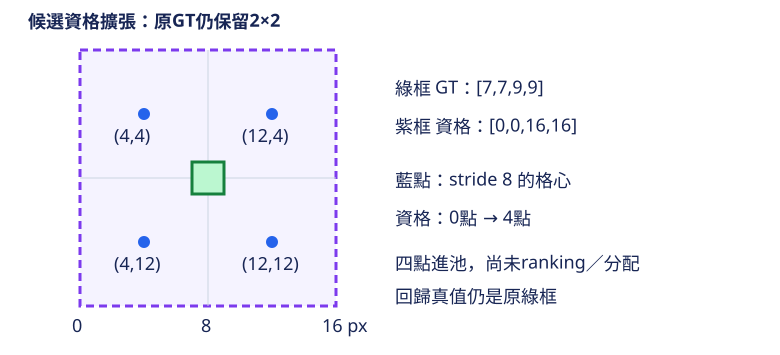

# 16.3 YOLO26 訓練補強：Progressive Loss、STAL 與 MuSGD

[在 Colab 執行本節](https://colab.research.google.com/github/birdhackor/learn_to_yolo/blob/lessons-v0.5.0/notebooks/16-training.ipynb){ .md-button }

YOLO26 官方介紹了三個訓練技巧：Progressive Loss、STAL 和 MuSGD。本節逐一說明三者在做什麼，只對第一個做實驗。讀完本節，你能說出兩個分支的 loss 權重怎麼隨訓練移動，能手算一步加了 loss 權重的 SGD 更新，能用 loss 權重總量相同的對照組分辨差距從哪裡來，也能說明小物件為什麼要放寬候選資格。

前置知識是 [13.1](13-dual-assignment.md) 的雙 head：訓練時有一對多（one-to-many，下面簡稱 many）和一對一（one-to-one，簡稱 one）兩個 head，本節也把它們叫做兩個分支。另外要知道 loss 權重（總 loss 裡每一項 loss 乘上的倍數）和 SGD。

NMS-free 推論（論文的預設；官方 API 要設 `nms=False`，見 [16.2](16-inference-head.md)）只用 one-to-one head，但這不表示訓練時兩分支的 loss 權重要從頭到尾固定不變。小物件也可能因為候選點排得太疏，一個候選都分不到，得不到正樣本的訓練訊號。三個技巧各管一件事：

- **Progressive Loss**（漸進調整兩分支的 loss 權重）：訓練中把總 loss 的比重，從 many 分支慢慢移到推論用的 one 分支。這是本節的主實驗。
- **STAL**（Small-Target-Aware Label Assignment，照顧小物件的候選分配）：小框裡可能一個候選點都沒有，所以選候選時暫時把小框放大。本節只算一個資格例子。
- **MuSGD**（Muon 與 SGD 混合的優化器）：改變矩陣參數的更新方式。[YOLO26 論文](https://arxiv.org/abs/2606.03748)（§3.3.1、§4.3.2）說它讓訓練更穩定、收斂更快：從零訓練 COCO 時，MuSGD 500 個 epoch 的 COCO mAP（IoU 0.50～0.95 的平均，百分制）是 47.4，SGD 600 個 epoch 是 47.0。本節沒有驗證，只做說明。

不要看到三個名稱就一次全加入，否則不知道結果由誰造成。本節的實驗只是兩個線性 head 的小例子，不是完整的 YOLO26 訓練；做了什麼、沒做什麼，整理在下面的摺疊區。

??? note "本節做了什麼、沒做什麼"

    - 文中的官方機制，以查核日（2026-10-02）固定版本的官方原始碼為準。
    - 實驗是兩個線性 head 的小例子，三次訓練只差在 loss 權重。
    - 官方發布的 checkpoint（訓練好的模型檔）還用了預訓練、資料增強、超參數與內部設定；一段小實驗不能宣稱完整重現它。
    - 小實驗的 MSE 差距只展示 loss 權重的作用，不能當成 YOLO26 的 AP 增益。
    - 沒有執行 MuSGD，只做文字說明。
    - STAL 只檢查一個例子的資格遮罩（mask：標出哪些候選點有資格），沒有用 STAL 訓練偵測器，所以沒有小物件 AP 的結論。
    - MuSGD 和 STAL 都沒有混入 loss 權重對照的結果。

## Progressive Loss：總 loss 往推論分支移動

13.1 說過：one-to-many 讓每個真值物件可以有多個正候選；one-to-one 的目標是減少重複，YOLOv10 用 top-1 初選。本章的 YOLO26 在衝突後還用 `topk2=1` 再篩一次，因此最終每個 GT 至多一個正候選，可能零個；這和 13.1 的最終分配規則不同。訓練早期，many 分支提供較密集的學習訊號；後期加重 NMS-free 推論模式所用的 one 分支。這就是這項排程的動機。代價是後期分給 many 的 loss 權重變少，而且要自己選轉移的速度與終點；不能假設同一種排程適合所有資料。

官方的排程寫在 `E2ELoss` 裡。`E2ELoss` 是官方程式中同時計算 many、one 兩分支 loss 的 Python class；E2E 是 end-to-end（端到端），指 one-to-one 分支可以直接輸出最終的框，不需要 NMS。查核版本的 `E2ELoss` 一開始給 many 的 loss 權重 0.8、one 0.2；訓練中 many 線性遞減到 0.1，one 升到 0.9。

寫成公式前，先定義符號。epoch（一輪）是把整份訓練資料用過一次（[11.3](11-augmentation.md) 說過）。本例只有 4 筆資料，一次就算完，所以一輪就是一次 SGD 更新，共 30 輪。e 是第幾輪（0～29），E=30 是總輪數。a、b 分別是 many、one 的 loss 權重，不是直線的斜率與截距：

\[
a(e)=\max\!\left(1-\frac{e}{E-1},\ 0\right)\times(0.8-0.1)+0.1,\qquad b(e)=1-a(e).
\]

分母用 E−1，是為了讓最後一輪 e=29 時，a 剛好降到 0.1。max(…,0) 只在 e 超過 E−1 時起作用，讓 a 停在 0.1；本例 e 最大是 29，用不到。每過一輪，a 減少 0.7/29≈0.024：第 0 輪是 0.8/0.2，第 15 輪約 0.438/0.562，第 29 輪是 0.1/0.9。官方也是在每個 epoch 結束時才調一次 a、b；真實訓練的一個 epoch 有很多步，這些步都用同一組 a、b。

loss 權重改變的，是兩個分支在 loss 和梯度裡各占多少。總 loss 是

\[
L=a\,L_{\text{many}}+b\,L_{\text{one}}.
\]

記 θ 為 one head 的參數（本例是 w 與 bias）。\(L_{\text{many}}\) 只由 many head 算出，不含 θ，所以 \(\partial L_{\text{many}}/\partial\theta=0\)：

\[
\frac{\partial L}{\partial\theta}
=a\,\frac{\partial L_{\text{many}}}{\partial\theta}+b\,\frac{\partial L_{\text{one}}}{\partial\theta}
=b\,\frac{\partial L_{\text{one}}}{\partial\theta}.
\]

第 0 輪 b=0.2，第 29 輪 b=0.9。若兩個時刻的 \(\partial L_{\text{one}}/\partial\theta\) 一樣大，後者每步走 4.5 倍遠。但 one head 越接近答案，\(\partial L_{\text{one}}/\partial\theta\) 本身會變小，所以後期每一步實際走多遠，不一定比前期大。

本例的兩個 head 都是 `Linear(1,1)`：每筆輸入 1 個數，預測 wx+bias。輸入 features 的 shape 是 `[4,1]`（4 筆、每筆 1 個數），數值為 −1、0、1、2；target 是 2x+1，也就是 −1、1、3、5。兩個 head 的輸出也是 `[4,1]`，各用 MSE（均方誤差：誤差平方的平均）算 loss。實驗跑三次：每輪固定 0.8/0.2、上面的排程（下面稱 progressive），以及每輪固定 0.45/0.55 的等總量對照組。等總量對照組的 b 每輪都是 0.55，30 輪加起來是 16.5，和排程 30 輪的 b 總和相同（下面會算）。三次開始前都把亂數種子（seed）設成 7，所以初始參數相同；資料、SGD 更新次數（30 次）和學習率 0.05 也都相同。兩個線性 head 互不相連，學同一個 target；沒有不同的 assignment，也沒有共享的 backbone。

本例的 SGD 是最基本的版本：每步只做「新參數＝舊參數−學習率×梯度」，沒有加其他機制（例如 MuSGD 段會說明的動量）。所以每一步，one head 的參數減去 \(0.05\times b\times\partial L_{\text{one}}/\partial\theta\)，效果等於 one head 用 0.05×b 當學習率。progressive 的這個有效學習率從 0.01 增加到 0.045；固定 0.8/0.2 一直是 0.05×0.2=0.01，等總量對照組一直是 0.05×0.55=0.0275。

完整程式的 `train` 函式每呼叫一次，就從頭訓練一次，回傳 30 次更新後 one 的 MSE、每輪的紀錄 `history` 和首步紀錄 `first_step`：

``` { .python data-excerpt="lesson_cases/16-training.py" }
def train(progressive, epochs=30, final_many=.1, fixed_weights=(.8, .2)):
    torch.manual_seed(7)  # 每次呼叫都重設 seed，所以三次的初始參數相同
    features = torch.tensor([[-1.], [0.], [1.], [2.]])
    target = 2 * features + 1
    many, one = nn.Linear(1, 1), nn.Linear(1, 1)
    optimizer = torch.optim.SGD(list(many.parameters()) + list(one.parameters()), lr=.05)
    history = []
    first_step = {}
    for epoch in range(epochs):  # epochs 就是 E=30
        # progressive=True 用上式的 a(e)、b(e)；False 則每輪都用同一組 fixed_weights
        a, b = weights(epoch, epochs, final_many) if progressive else fixed_weights
        optimizer.zero_grad()  # 清除上一輪累積的梯度
        lm = F.mse_loss(many(features), target)  # 上式的 L_many
        one_prediction = one(features)
        lo = F.mse_loss(one_prediction, target)  # 上式的 L_one
        # 下面三處 ... 省略的，都是只在第 0 輪執行、把首步數值記進 first_step 的程式
        ...
        loss = a * lm + b * lo
        loss.backward()
        assert many.weight.grad is not None and one.weight.grad is not None
        ...
        optimizer.step()
        ...
        history.append((a, b, float(lo.detach())))  # 每輪記下 a、b 和這輪更新前 one 的 MSE
    return F.mse_loss(one(features), target).item(), history, first_step
```

`main()` 用這個函式跑三次。`progressive=True` 用上式的排程；`progressive=False` 每輪都用參數 `fixed_weights` 給的固定權重，跑兩次：一次用預設的 0.8/0.2，一次用由排程算出的等總量對照組權重 `matched_weights`：

``` { .python data-excerpt="lesson_cases/16-training.py" }
def total_one_weight(history):
    """Sum of the one-head loss weight b over all epochs of one run."""
    return sum(b for _, b, _ in history)  # history 每輪一筆 (a, b, one 的 MSE)，這裡只加 b


def main():
    ...  # 省略：設定 seed 與執行緒數
    final_many = .1  # 自主練習只改這個值
    fixed, fixed_history, _ = train(False)  # 固定 0.8/0.2（fixed_weights 的預設值）
    progressive, history, first_step = train(True, final_many=final_many)  # 上式的排程
    # 排程的首末端點：第 0 輪 a=0.8，最後一輪 a=final_many
    assert abs(history[0][0] - .8) < 1e-7 and abs(history[-1][0] - final_many) < 1e-7
    matched_one = total_one_weight(history) / len(history)  # 排程 30 輪 b 的平均
    matched_weights = (1 - matched_one, matched_one)  # 本例是 (0.45, 0.55)
    matched, matched_history, _ = train(False, fixed_weights=matched_weights)  # 等總量對照組
    assert abs(total_one_weight(matched_history) - total_one_weight(history)) < 1e-9
    ...  # 省略：核對首步表的斷言、印出結果與 STAL 例子
```

排程的 b 從 0.2 起每輪增加 0.7/29，到 0.9 為止，是等差數列：30 輪的和是 30×(0.2+0.9)/2=16.5，平均 `matched_one` 是 16.5/30=0.55。所以等總量對照組每輪都用 many/one 為 0.45/0.55 的權重，30 輪的 b 總和同樣是 16.5；摘錄裡最後一個斷言（assert）核對這兩個總和相等。progressive 和固定 0.8/0.2 有兩處不同：b 的總和（16.5 對 6），以及 b 每輪怎麼變（逐輪增加對每輪相同）。progressive 和等總量對照組只差在第二處。

progressive 的第一步（第 0 輪，b=0.2）可以逐值核對：

| one 分支計算 | 數值 |
| --- | --- |
| 初始 w／bias | 0.318423／0.313781 |
| 四筆 forward `wx+bias` | −0.004643、0.313781、0.632204、0.950627 |
| MSE | `mean((prediction−[-1,1,3,5])²)=5.866377` |
| 已乘 b=0.2 的 dw／dbias | −1.146190／−0.610803 |
| SGD 更新後 w／bias | 0.375733／0.344321 |

表中數字四捨五入到小數第 6 位。用表列數字手算，最後一位可能差 1，例如第一筆會得到 −0.004642。

表中的梯度怎麼來？MSE 來自平方，所以導數有 2；四筆取平均，所以除以 4；最後再乘 one 的 loss 權重 b=0.2。預測 wx+bias 對 w 的變化率是 x，所以 dw 要乘 x；對 bias 的變化率是 1，所以 dbias 不用乘：`dw=.2×(2/4)×sum((prediction−target)×x)=−1.146190`，`dbias=.2×(2/4)×sum(prediction−target)=−.610803`。更新時減去學習率乘梯度，例如 `w_new=.318423−.05×(−1.146190)=.375733`。

完整程式用斷言核對這張表的參數、MSE 與梯度，並印出這份首步紀錄（`one-head first forward/backward/step` 那一行）；兩者都取自 progressive 那一次。固定 0.8/0.2 那一次的第一步，表中每個數都和它相同，因為 seed、資料和第 0 輪的 b=0.2 都一樣。等總量對照組第 0 輪的 b 是 0.55：初始 w／bias、forward 和 MSE 和表中相同，乘了 b 的 dw、dbias 卻是表中的 0.55/0.2=2.75 倍，更新後的 w／bias 也就不同。

首步紀錄裡的 `one_gain` 是第 0 輪的 b，印成 0.19999999999999996 而不是 0.2：排程的 b 是用 1−a 算的，而 0.8 在電腦裡存不成剛好的 0.8（第 4 章〈[座標轉換與還原](04-coordinates.md)〉講過這類極小的捨入誤差）。最後報告的 MSE，則是 30 次更新都做完後重新 forward 算出來的（`train` 最後的 `return` 那一行），不是沿用最後一次更新前的 loss。

執行 `PYTHONPATH=. python lesson_cases/16-training.py`。`main()` 在印出結果之前，先用斷言核對三件事：排程第 0 輪與第 29 輪 many 的 loss 權重是 0.8 與 0.1（one 是 1 減去它，也就是 0.2 與 0.9）；等總量對照組和排程的 b 總和相等；首步表中的參數、MSE 與梯度。印出的前兩行是排程第 0 輪與第 29 輪的 many/one loss 權重。第三到五行是三次訓練，依序以 `fixed many/one (0.8, 0.2)`、`progressive`、`matched fixed many/one (0.45, 0.55)` 開頭，接著是 `sum of b`（30 輪 b 的總和）和 30 次更新後 one 的 MSE（`one-head MSE`）。

標籤裡的權重和 `sum of b` 只是 a、b 的算術，每台電腦都一樣：固定 0.8/0.2 是 0.2×30=6.000，progressive 和等總量對照組都是 16.500。one MSE 是訓練結果：固定 0.8/0.2 是 0.663，progressive 是 0.016；等總量對照組和 progressive 很接近，只略高一點（三個數字都在頁尾的執行紀錄裡）。這些數字只對本例成立。

差距從哪裡來？本例兩個 head 互不相連，a 完全不影響 one head 的更新；三次訓練的 seed、資料和學習率又都相同，所以 one 的結果只會因每輪的 b 而不同。

- **progressive 和固定 0.8/0.2 的差距，幾乎全來自 b 的總和**：30 輪分給 one 的 loss 權重，progressive 加起來是 16.5，固定 0.8/0.2 只有 6。等總量對照組的總和和 progressive 一樣，one MSE 就和 progressive 很接近，同樣遠低於 0.663。
- **progressive 和等總量對照組的那一點差距，來自 b 每輪大小不同**：progressive 的 b 從 0.2 到 0.9 有大有小，對照組每輪都是 0.55。這不是「前期多給 many」的好處：a 根本不進入 one 的更新；而且照下方摺疊區的推導，30 輪的 b 不管怎麼排順序，one 的結果都一樣。

所以本例看不到「前期多給 many」的好處。官方 YOLO26 的 one 分支讀的是 detach 後的特徵（梯度傳不回 backbone），backbone 只由 many 分支訓練；這種結構下排程有什麼作用，本例沒有測。本例支持的結論是：改變某分支的 loss 權重，會改變該分支學得多快。它不支持「所有場景都該使用這個排程」。

??? note "為什麼 b 每輪大小不同，one MSE 會略低一點"

    記 \(d=(w-2,\ \text{bias}-1)\)，也就是 one head 的參數離正確答案 w=2、bias=1 還差多少。這時 prediction−target 等於 \((w-2)x+(\text{bias}-1)\)，照上面算 dw、dbias 的方法（四筆 x 的和是 2、平方和是 6），還沒乘 b 的梯度是 \(Hd\)，其中

    \[
    H=\begin{bmatrix}3&1\\1&2\end{bmatrix}.
    \]

    所以每一輪的更新是 \(d\leftarrow d-0.05\,b\,Hd\)。

    H 有兩個特別的方向：\(u_1=(1,\ 0.618)\) 乘上 H，只會變成 3.618 倍；\(u_2=(1,\ -1.618)\) 乘上 H，只會變成 1.382 倍（都是近似值）。線性代數把這種方向叫特徵向量（eigenvector），倍數 λ 叫特徵值（eigenvalue）；這裡的特徵值和特徵圖上的特徵值是兩回事。把 d 寫成 \(c_1u_1+c_2u_2\)，每一輪的更新就只是把 \(c_1\) 乘上 \(1-0.05\,b\times3.618\)、把 \(c_2\) 乘上 \(1-0.05\,b\times1.382\)。三次訓練中最大的 \(0.05\,b\,\lambda\) 是 \(0.05\times0.9\times3.618\approx0.16\)，所以這些倍數都介於 0 和 1 之間。30 輪後，每個分量都乘上

    \[
    (1-0.05\,b_0\lambda)(1-0.05\,b_1\lambda)\cdots(1-0.05\,b_{29}\lambda),
    \]

    其中 \(b_e\) 是第 e 輪的 b，λ 是 3.618 或 1.382。由這個乘積可以看出兩件事：

    1. 乘法可以交換順序，30 個 b 不管怎麼排，乘積都一樣，所以 b 先小後大本身沒有好處。本節程式沒有跑把 b 倒過來排的對照，這一點是由推導得出的。
    2. b 的總和固定是 16.5 時，這 30 個倍數的總和也固定，是 \(30-0.05\lambda\times16.5\)。算幾不等式（正數的算術平均不小於幾何平均）說：總和固定的正數，全部相等時乘積最大。等總量對照組每輪的 b 都是 0.55，兩個分量都縮得最少；progressive 的 b 有大有小，縮得多一點。

    最後把 MSE 也寫成 \(c_1\)、\(c_2\)。用四筆 x 的和 2、平方和 6 展開平方可以驗證，one 的 MSE 是 \(\tfrac12\,d\cdot(Hd)\)（\(d\) 與 \(Hd\) 內積的一半）。代入 \(d=c_1u_1+c_2u_2\)、\(Hd=3.618\,c_1u_1+1.382\,c_2u_2\) 展開，含 \(c_1c_2\) 的項都乘著 \(u_1\cdot u_2=1\times1+0.618\times(-1.618)\approx0\)（兩個方向互相垂直），所以消失；one 的 MSE 等於 \(c_1^2\)、\(c_2^2\) 各乘一個固定的正數再相加。三次訓練開始時的 \(c_1\)、\(c_2\) 相同，progressive 的兩個分量都縮得比等總量對照組多，所以 progressive 的 one MSE 略低於等總量對照組。

## STAL（Small-Target-Aware Label Assignment）：擴張候選資格，不放大真值框

先看問題。stride 8 的特徵圖每 8 畫素才有一個格心（每一格的中心點，也就是候選點），x、y 座標都是 4、12、20、…。2×2 畫素的小框可能一個格心都框不到。照 [12.3](12-assignment.md) 的資格規則，候選點要嚴格落在 GT（ground truth，人工標註的真值框）內才有資格；框裡沒有格心，這一層就沒有任何候選能學這個物件。STAL 的做法是：只在選候選這一步，把小框暫時放大。下圖是本節的例子。



圖用影像座標：x 向右、y 向下增加，所以 (4,12) 在 (4,4) 下方。

數字例子：真值框 `[7,7,9,9]` 只有 2×2 畫素，中心 `(8,8)`。圖中四個藍色格心 `(4,4)`、`(12,4)`、`(4,12)`、`(12,12)` 都不在真值框內。本例只看 stride 8 這一層；官方三層（stride 8、16、32）一起選候選時，stride 16 的格心 (8,8) 本來就在原框內。把候選資格框（只用來判斷資格的框）的邊長擴到 16，變成 `[0,0,16,16]`，四個格心都有了資格。程式以 assert 檢查資格點數由 0 變 4，同時確認原 GT 仍是 `[7,7,9,9]`。回歸真值不能被換成 16×16，否則會教模型畫大框。

這四個格心都在原框外。其中某一點若被選為正樣本，它要回歸的仍是原框，距離會有負值。以 (4,4) 為例，它對原框的四邊距離 ltrb（點到框的左、上、右、下邊）是 [4−7, 4−7, 9−4, 9−4]=[−3,−3,5,5] 畫素，左、上是負距離；四個點各有兩邊為負。[16.1](16-dfl-free.md) 說過，YOLO26 的 reg_max=1（每條邊直接輸出一個距離，不經過 DFL）可以表達帶符號的距離，這裡正好用得上。

官方的規則在 `TaskAlignedAssigner.select_candidates_in_gts` 裡，也就是 12.3 提過的分配器負責選候選的函式。查核版本只在選候選這一步，把 GT 寬或高小於 16 畫素的那一邊暫時改成 16，以中心為基準向外擴張，中心不動。寬、高各自判斷，例如 2×40 的框會變成 16×40，不是 16×16。16 取自三層特徵 stride `[8,16,32]` 的第二項。算 loss 時仍用原框。

四個格心只是進入候選池（通過資格檢查、可以參加後面挑選的候選）。之後還有品質排序（ranking：依預測品質由高到低排）、top-k 和衝突處理（見 12.3），本例都沒有執行；不是所有進入擴張框的點都會成為正樣本。查核版本中，one-to-many 分支每個 GT 取品質前 10 名；one-to-one 分支先取前 7 名並解決衝突，最後每個 GT 最多只留品質最高的 1 個（程式參數 topk2=1）。

[YOLO26 原論文](https://arxiv.org/abs/2606.03748)的 STAL 公式 (5) 寫的是邊長小於 8 才替換成 16；本節固定的官方程式碼用的是小於 16 的門檻。兩者範圍不同，這裡以固定程式碼為準。本例邊長 2 同時滿足兩者，0→4 的數字不受這個差異影響。

收益是小物件比較容易有候選進入候選池。代價是：框外的點也會參與（像上面四個格心；它們若成為正樣本，回歸距離有負值）；品質排序和衝突處理變得更重要；也可能增加錯誤的正樣本訊號。只有資格增加，不代表四個點全被分配，也不保證每個小物件最後都有正樣本。

## 延伸查證（可跳讀）：MuSGD

主例不需要實作這個優化器。MuSGD 除了沿梯度更新，也會整理矩陣參數的更新方向；這裡只說明它和 SGD 的差別。

動量（momentum）是把前幾步的梯度加權記下來，讓更新不只取決於當下這一次的梯度。Muon 是另一種只處理矩陣參數的優化器。MuSGD 的 Muon 部分先整理矩陣參數這一步的更新方向與大小（做法見下方摺疊區），再和 SGD 的動量更新組合，目的在於改變矩陣參數的更新幾何：每一步往哪些方向走、各走多遠。

哪些參數算矩陣？線性層的 `weight` 本來就是 2 維矩陣。卷積層的 `weight` shape 是 [輸出 channel, 輸入 channel, kh, kw]（kh、kw 是 kernel 的高與寬），可以攤平成 [輸出 channel, 其餘三軸相乘] 的矩陣。bias 這類一維參數不走 Muon，只用 SGD 更新。官方用矩陣近似運算（Newton–Schulz）實作 Muon，並替 SGD 那部分另外存一份動量。還有三項設定也會影響結果：

- 參數分組：哪些參數走 Muon、哪些只用 SGD。
- 混合比例：Muon 與 SGD 兩種更新各乘的比例。
- 權重衰減（weight decay）：每步把參數往 0 拉一點，和 loss 權重的遞減無關。

??? note "Muon 怎麼整理更新量"

    Muon 的名稱來自 MomentUm Orthogonalized by Newton–Schulz，意思是「用 Newton–Schulz 正交化的動量」。

    它先把梯度做動量平均，得到這一步的更新矩陣。再把這個矩陣「正交化」：保留各個方向，把各方向的伸縮倍率（線性代數叫奇異值）都拉到接近 1，避免少數方向獨占這一步。例如更新矩陣是 \(\begin{bmatrix}3&0\\0&0.1\end{bmatrix}\) 時，第一個方向的倍率是 3，第二個方向只有 0.1，這一步幾乎只動第一個方向。理想的正交化結果是單位矩陣，兩個倍率都是 1。

    Newton–Schulz 只用矩陣乘法反覆計算幾次，來近似正交化。官方固定迭代 5 次，結果只是大致接近正交：上面的例子用官方程式實際得到約 \(\begin{bmatrix}0.69&0\\0&1.13\end{bmatrix}\)（官方程式用 bfloat16 計算，這是只用 16 位元存一個數、精度較低的格式；改用一般的 float32 照樣算 5 次，第一個倍率約是 0.70），兩個倍率都拉到 1 附近，但不是精確的 1。

    最後，MuSGD 再加上另一份動量的一般 SGD 更新，兩種更新各乘一個比例後相加。

額外的矩陣計算、多存的一份動量、分組與混合設定，會增加運算、記憶體和調參成本。在自己的資料與模型上是否換得更好的收斂，要另做配對實驗。本節沒有執行 MuSGD，不能從兩個線性 head 的 MSE 宣稱這個優化器較好。

這些細節在官方程式碼裡都讀得到，但本節不自行拼出未驗證的 MuSGD 簡化版，也不聲稱重現官方發布模型的整套訓練配方（recipe：資料、預訓練、增強、超參數與步數等全部設定）。官方訓練指南說，發布的模型先在 Objects365（有 365 類物件的大型偵測資料集）預訓練，再用 COCO 微調（以預訓練好的參數為起點，在新資料上繼續訓練）。部分內部超參數（例如 many 分支的 loss 權重）只能在實驗用的程式碼分支上設定。這種分支是 Git branch（同一份程式碼另外開出的平行版本），放在 Ultralytics 的 GitHub 上、沒有併入主線（main），和 many／one 分支無關；一般安裝的套件不接受這些設定。所以前面的 0.8→0.1 是固定版本程式的預設，不代表發布模型的實際設定。

正式比較優化器時，要固定資料、初始化、步數、增強和排程，再記錄收斂、參數更新尺度與成本。拿預訓練過的模型和從零開始訓練的 MiniYOLO 比最終 AP，差距不能歸因於優化器。

## 常見錯誤與自主練習

常見錯誤：

- **以為真實模型改 a、b，只等於調一個學習率**：本例兩個 head 互相獨立，才剛好等於調 one 的學習率。查核版本中，one 分支讀 detach 後的特徵，所以 a 縮放的是 backbone 與 many head 的梯度，b 只縮放 one head 的梯度；再加上動量、MuSGD 和權重衰減，效果不等於只調一個學習率。
- **三項同時改，卻只報總 loss**：分不出是誰造成差異。
- **只和一組固定權重比，就把差距算在排程頭上**：固定 0.8/0.2 和 progressive 不只 b 每輪怎麼變不同，b 的總和也不同（6 對 16.5）。要看「b 每輪怎麼變」本身有沒有作用，得和 b 總和相同的對照組比；本例 progressive 和等總量對照組只差一點，那一點來自 b 每輪大小不同。
- **把 STAL 的資格框當成標註框**：16×16 的資格框只用來選候選，回歸真值仍是原框。
- **沒用 MuSGD 做配對實驗，就宣稱它比較好**：本節沒有執行 MuSGD，兩個線性 head 的 MSE 說明不了優化器的好壞。

自主練習：在完整程式（Colab 裡那份，或本機的 `lesson_cases/16-training.py`）只改 `main()` 裡的 `final_many = .1`，改成 `.3`，其他不動。先回答下面四題，再執行核對：

1. 第 29 輪的 many/one loss 權重是多少？
2. 第 0 輪的首步數值（上面那張表）會變嗎？為什麼？
3. 程式印出的 progressive `sum of b` 會變成多少？等總量對照組的 many/one 權重會變成多少？progressive 的 one MSE 會變大還是變小？
4. STAL 讓四個格心進入候選池後，YOLO26 的 one-to-one 分支最後每個 GT 最多有幾個正樣本？

??? note "參考答案"

    1. 0.3/0.7。e=29 時 \(a=0\times(0.8-0.3)+0.3=0.3\)，b=1−0.3=0.7。
    2. 不變。\(a(0)=1\times(0.8-0.3)+0.3=0.8\)，和終點無關，b 仍是 0.2；資料、seed 和初始參數也都沒變，所以首步數值和改之前（`final_many = .1`）完全相同。排程、核對終點的 assert 和印出的結果都用同一個 `final_many` 變數，不必改任何 assert。等總量對照組的權重 `matched_weights` 也由排程的 b 算出，會自動跟著變，程式照樣 assert 它和排程的 b 總和相等。
    3. progressive 印出 `sum of b=13.500`（改之前是 16.500）：b 改成從 0.2 線性增加到 0.7，30 輪的和是 30×(0.2+0.7)/2=13.5，第 1 輪起每一輪都比改之前小。等總量對照組自動變成 `matched fixed many/one (0.55, 0.45)`，`sum of b` 也是 13.500；固定 0.8/0.2 那一行完全不變。progressive 的 one MSE 變大，因為 one 的有效學習率從第 1 輪起每輪都比改之前小。等總量對照組的 one MSE 仍和 progressive 很接近、略高一點：b 總和相同時，b 每輪大小不同的 progressive 會略低（推導見正文的摺疊區）。多留給 many 的 loss 權重，在本例對 one 沒有幫助，因為兩個 head 互不相連。在真實模型（例如官方 YOLO26，backbone 只由 many 分支訓練）上值不值得這樣分配，要另做配對實驗才知道。
    4. 最多 1 個。4 只是有資格進池的點數；查核版本的 one-to-one 分支，最後每個 GT 最多只留品質最高的 1 個（topk2=1）。本例沒有做品質排序，說不出會是哪一個。

參考來源：[E2ELoss 排程](https://github.com/ultralytics/ultralytics/blob/441632cdfd19e22e60a4b1b1999d46326ca51ec4/ultralytics/utils/loss.py)、[每個 epoch 結束才更新排程（trainer 呼叫 criterion.update）](https://github.com/ultralytics/ultralytics/blob/441632cdfd19e22e60a4b1b1999d46326ca51ec4/ultralytics/engine/trainer.py)、[one 分支讀 detach 後的特徵（Detect.forward）](https://github.com/ultralytics/ultralytics/blob/441632cdfd19e22e60a4b1b1999d46326ca51ec4/ultralytics/nn/modules/head.py)、[小物件資格與 top-1 篩選（topk2）](https://github.com/ultralytics/ultralytics/blob/441632cdfd19e22e60a4b1b1999d46326ca51ec4/ultralytics/utils/tal.py)、[MuSGD 公開實作](https://github.com/ultralytics/ultralytics/blob/441632cdfd19e22e60a4b1b1999d46326ca51ec4/ultralytics/optim/muon.py)、[官方訓練配方（recipe）與重現範圍](https://github.com/ultralytics/ultralytics/blob/441632cdfd19e22e60a4b1b1999d46326ca51ec4/docs/en/guides/yolo26-training-recipe.md)。

<!-- curriculum-evidence:start -->

## 實際執行紀錄

本節的完整程式於 2026-10-05 在 INTEL(R) XEON(R) PLATINUM 8573C（2 個執行緒）上用 PyTorch 2.9.1+cpu 執行，程式裡的 assert 全部通過。下面是那次印出的原始輸出；輸出裡若有計時或訓練得到的數字，換一台電腦會略有不同。每個數字的意思，以本頁正文的說明為準。[完整紀錄（JSON）](https://github.com/birdhackor/learn_to_yolo/blob/main/artifacts/checks/curriculum/16-training.json)

??? example "展開本次實際輸出"

    ```text
    many/one weight first: (0.8, 0.2)
    many/one weight last: (0.1, 0.9)
    fixed many/one (0.8, 0.2): sum of b=6.000, one-head MSE=0.663073
    progressive: sum of b=16.500, one-head MSE=0.016285
    matched fixed many/one (0.45, 0.55): sum of b=16.500, one-head MSE=0.016882
    one-head first forward/backward/step: {"weight": 0.31842339038848877, "bias": 0.3137805461883545, "prediction": [-0.004642844200134277, 0.3137805461883545, 0.6322039365768433, 0.950627326965332], "one_mse": 5.866377353668213, "one_gain": 0.19999999999999996, "weighted_dw": -1.1461899280548096, "weighted_dbias": -0.6108031272888184, "updated_weight": 0.3757328987121582, "updated_bias": 0.34432071447372437}
    small-object eligible points original / expanded: 0 4
    GT regression box remains: [7.0, 7.0, 9.0, 9.0]
    not a full YOLO26/STAL/MuSGD training reproduction
    ```

<!-- curriculum-evidence:end -->
