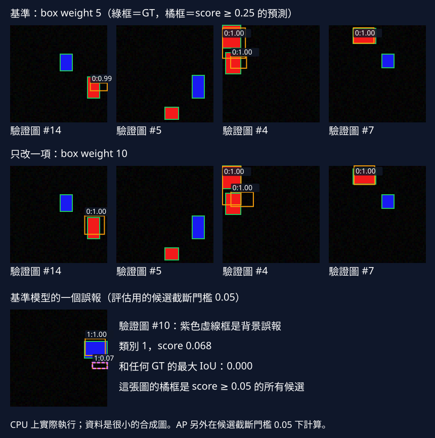

# 17 靜態偵測結業：用一次有理由的改動交付結果

[開啟 Colab](https://colab.research.google.com/github/birdhackor/learn_to_yolo/blob/lessons-v0.2.0/notebooks/17-capstone.ipynb) · 原始碼：`lesson_cases/17-capstone.py`

前置是[資料切分與held-out](07-heldout.md)、[grid loss](07-loss.md)、[AP50](06-evaluation.md)與[完整圖片推論](07-inference.md)。現在不再以版本名稱選模型，而是接到一個具體需求：辨識64×64圖片中的紅、藍矩形，可能有零至兩個物件，CPU單張處理要能測量。先從最小grid MiniYOLO從零訓練，確認失敗落在哪裡，再只改一項。這份範例交付真實跑出的數字與失敗圖，也保留不能下結論的範圍。

本例紅矩形為class0、藍矩形為class1；圖上`0:1.00`表示class0、score1.00。

本次baseline是每格一框、4×4候選的GridDetector，沒有預訓練或下載資料。理由是資料每個物件中心刻意在不同cell，簡單head已能表示；若真實資料常有同格多物件，這份選擇就要重做。本次只把box loss權重5改10，模型架構、assignment、optimizer、資料與step都不變，不混入attention或DFL。

## 先寫下協議，後看結果

train32張seed1100、validation16張seed2200、test16張seed3300，三份由獨立隨機序列生成。這些是不同圖片，但仍是相同幾何生成分佈，不能代表真實相機的泛化。每次重設模型seed7，batch8、Adam lr.01、160steps，輸入`[8,3,64,64]`，head為`[8,4,4,7]`：四個框參數、objectness與兩個類別。

loss為`wbox×box_MSE+objectness_BCE+class_CE`。box只對正格四座標平均，objectness對全部格平均，class只對正格平均。改wbox是改梯度的相對監督預算，不是改圖的pixel單位，也不能直接比較兩條不同權重的總loss高低來判斷誰更好。

評估固定class-wise NMS IoU .5、候選score cutoff .05、matching IoU .5、all-points interpolated AP；兩類都有GT，因此map是兩類AP平均，也就是本節mAP50。顯示圖另設score .25，避免大量低分框遮住畫面。圖上看不到的低分候選仍可能參與評估，兩個閾值不能混淆。

## 由失敗提出可測的假設

baseline validation有17個GT。其中9個至少有同類候選IoU≥.5，4個最佳同類IoU在.1到.5，另4個低於.1或沒有同類候選。這是GT覆蓋診斷，不是TP matching：它逐GT看最佳框，不實施一個預測只能匹配一個GT，因此不能直接當recall。

案例另輸出`baseline_errors`與`changed_errors`，讓「定位、分類或背景」能實際檢查。逐GT同時看不限類別及同類別的最佳IoU：同類低於.5、但有錯類候選IoU≥.5，才記為`wrong_class_gt_cases`。接著把score≥.05的預測依分數排序，用同類、IoU≥.5的一對一matching；剩餘預測是FP。FP與所有GT的最佳IoU低於.1記為`background`，.1至.5為`localization`；≥.5但類別錯為`wrong_class`，同類GT已被較高分框配走則為`duplicate`。這是可重查的小診斷規則，不是完整錯誤分析工具。

本次baseline的5個FP中，4個是定位未過.5、1個是背景；weight10剩3個FP，為2個定位與1個背景。兩次可確認的錯類覆蓋及錯類FP都是0，但沒候選的GT仍不能據此判為「分類正確」。report的`false_positive_cases`列出validation圖片編號、預測編號、class、score與最佳IoU，能循編號回查。圖下方顯示validation #10的實際背景FP：score約.068、與所有GT的IoU為0；它低於一般顯示門檻.25，卻仍影響.05門檻的評估。

假設是定位監督相對弱，提高box權重可能把近失敗推過IoU .5；若問題其實是分類或漏候選，增加box權重可能無效。先宣告保留規則：validation mAP50至少提高.01才保留。這個門檻是範例決策規則，並非統計顯著性。test在選擇完畢後只評估chosen一次，不能拿test反覆調weight。

```python
loss = box_weight * losses['box'] + losses['objectness'] + losses['classification']
loss.backward()
optimizer.step()
keep = changed_val['map'] >= baseline_val['map'] + .01
chosen = changed if keep else baseline
```

## 本次CPU實跑的結果

以下是PyTorch2.9.1 CPU、2threads、seed7的一次實跑；時間受同機工作、warmup與硬體影響，重新執行可能不同，品質數字也需以當次report為準。

| validation指標 | box weight5 | 唯一改動：weight10 |
| --- | --- | --- |
| class0 AP50 | .3333 | .6250 |
| class1 AP50 | .5556 | .7778 |
| mAP50 | .4444 | .7014 |
| precision／recall | .6429／.5294 | .8000／.7059 |
| GT覆蓋IoU≥.5 | 9／17 | 12／17 |
| GT最佳IoU .1至.5 | 4／17 | 2／17 |
| GT最佳IoU低於.1 | 4／17 | 3／17 |



圖的前兩列挑baseline最困難的四張，不挑最好看的圖；綠框是真值、橘框是score≥.25的預測，標籤為class與score。下方診斷圖改用score .05，紅框標出該背景FP。由表和圖能看到一部分定位改善，也仍有未解決失敗。達到事前規則，因此本次保留weight10。chosen在獨立test的mAP50為.4452、precision .6364、recall .5385，低於validation；16張小split的波動很大，不能將.7014宣傳為穩定效果。

兩條模型都是15,511參數。當次160steps約0.51秒與0.45秒，差異可能包含首次啟動warmup，並不能說加大loss權重讓訓練更快。chosen端到端median約1.05毫秒，範圍為uint8 RGB→tensor→model→decode/NMS→畫框，batch1、12次計時、3次warmup，不含檔案或影片解碼。這是小合成模型的當次CPU數值，不是一般YOLO的速度承諾。

## 交付、停止條件與下一個檢查

執行`PYTHONPATH=. python lesson_cases/17-capstone.py`，得到`artifacts/lesson-17/report.json`和上方實際validation SVG。程式assert loss有限且下降、baseline held-out mAP大於.05；若不透過，先查資料、target與訓練更新，不繼續宣稱完成。這個快速路徑共320steps，透過後即可停止；正式比較應增加資料、不同模型seed和需求相關的真實場景。

收益是改動有明確理由、對照只改一項、test不參與選擇；代價是每個候選方案都要重新訓練與看失敗，而且一次小split可能誤導。若本次沒有改善，仍可交付「不保留」及診斷，不必為了完成作業改評估門檻或捏造提升。

常見錯誤是把map變高全部歸因於定位、用train結果當held-out、挑test最好的weight，以及比較不同score cutoff的precision。自主練習：把`main`的`changed_weight=10`改為2，baseline_weight仍為5，保持其他設定。fit、report的`box_weights`與圖題都會使用本次參數；交付前應確認它們都是`[5,2]`，不能沿用本頁weight10的結果表。依當次`keep_change`交付保留／不保留；若validation未提高.01，答案就是保留baseline。再交付兩份coverage、`wrong_class_gt_count`與`false_positive_counts`，並從`false_positive_cases`挑一例，以圖片編號、score與IoU說明下一個假設；先不把第二次改動混進同一個實驗。

計時的畫圖也包含放大到192×192與GT標註，只代表這個診斷視覺化流程，不能當成純產品推論。

本機命令需先依[README環境步驟](https://github.com/birdhackor/learn_to_yolo#readme)安裝固定依賴，並在repository根目錄執行；Colab則先跑本節環境格。

<!-- curriculum-evidence:start -->

## 本輪實際執行紀錄

本節範例已於 2026-10-02 使用 PyTorch 2.9.1+cpu 在 CPU 執行，程式中的斷言全部通過。以下是該次輸出；人工輸入、短步更新與模型效果的意義仍依本頁說明區分。[完整紀錄](https://github.com/birdhackor/learn_to_yolo/blob/main/artifacts/checks/curriculum/17-capstone.json)

??? example "展開本次實際輸出"

    ```text
    {
      "data_seeds": [
        1100,
        2200,
        3300
      ],
      "train_samples": 32,
      "validation_samples": 16,
      "test_samples": 16,
      "steps_per_run": 160,
      "box_weights": [
        5,
        10
      ],
      "score_threshold": 0.05,
      "display_threshold": 0.25,
      "eval_iou": 0.5,
      "baseline_validation": {
        "ap_per_class": {
          "0": 0.3333333333333333,
          "1": 0.5555555555555556
        },
        "map": 0.4444444444444444,
        "precision": 0.6428571428571429,
        "recall": 0.5294117647058824
      },
      "changed_validation": {
        "ap_per_class": {
          "0": 0.625,
          "1": 0.7777777777777778
        },
        "map": 0.7013888888888888,
        "precision": 0.8,
        "recall": 0.7058823529411765
      },
      "baseline_coverage": {
        "covered_iou50": 9,
        "iou10_to_50": 4,
        "below_iou10": 4
      },
      "changed_coverage": {
        "covered_iou50": 12,
        "iou10_to_50": 2,
        "below_iou10": 3
      },
      "baseline_errors": {
        "score_threshold": 0.05,
        "matching_iou": 0.5,
        "background_iou_below": 0.1,
        "wrong_class_gt_count": 0,
        "wrong_class_gt_cases": [],
        "true_positives": 9,
        "false_positive_counts": {
          "background": 1,
          "localization": 4,
          "wrong_class": 0,
          "duplicate": 0
        },
        "false_positive_cases": [
          {
            "image": 4,
            "prediction": 0,
            "kind": "localization",
            "class": 0,
            "score": 1.0,
            "best_any_iou": 0.49179601669311523,
            "best_same_class_iou": 0.49179601669311523
          },
          {
            "image": 4,
            "prediction": 1,
            "kind": "localization",
            "class": 0,
            "score": 0.9999768733978271,
            "best_any_iou": 0.3034302294254303,
            "best_same_class_iou": 0.3034302294254303
          },
          {
            "image": 5,
            "prediction": 0,
            "kind": "localization",
            "class": 1,
            "score": 0.2382209151983261,
            "best_any_iou": 0.2817534804344177,
            "best_same_class_iou": 0.2817534804344177
          },
          {
            "image": 10,
            "prediction": 1,
            "kind": "background",
            "class": 1,
            "score": 0.06800812482833862,
            "best_any_iou": 0.0,
            "best_same_class_iou": 0.0
          },
          {
            "image": 14,
            "prediction": 0,
            "kind": "localization",
            "class": 0,
            "score": 0.9869535565376282,
            "best_any_iou": 0.22750438749790192,
            "best_same_class_iou": 0.22750438749790192
          }
        ]
      },
      "changed_errors": {
        "score_threshold": 0.05,
        "matching_iou": 0.5,
        "background_iou_below": 0.1,
        "wrong_class_gt_count": 0,
        "wrong_class_gt_cases": [],
        "true_positives": 12,
        "false_positive_counts": {
          "background": 1,
          "localization": 2,
          "wrong_class": 0,
          "duplicate": 0
        },
        "false_positive_cases": [
          {
            "image": 4,
            "prediction": 1,
            "kind": "localization",
            "class": 0,
            "score": 0.9965824484825134,
            "best_any_iou": 0.25703832507133484,
            "best_same_class_iou": 0.25703832507133484
          },
          {
            "image": 10,
            "prediction": 1,
            "kind": "background",
            "class": 1,
            "score": 0.0727023109793663,
            "best_any_iou": 0.0,
            "best_same_class_iou": 0.0
          },
          {
            "image": 14,
            "prediction": 0,
            "kind": "localization",
            "class": 0,
            "score": 0.9985516667366028,
            "best_any_iou": 0.49281632900238037,
            "best_same_class_iou": 0.49281632900238037
          }
        ]
      },
      "keep_change": true,
      "chosen_test": {
        "ap_per_class": {
          "0": 0.2571428571428571,
          "1": 0.6333333333333333
        },
        "map": 0.4452380952380952,
        "precision": 0.6363636363636364,
        "recall": 0.5384615384615384
      },
      "parameters": 15511,
      "train_seconds": [
        0.5060329449999585,
        0.4532946130000255
      ],
      "chosen_end_to_end_median_ms": 1.0529329776763916,
      "timing_scope": "uint8 RGB -> tensor -> model -> decode/NMS -> drawing; CPU, batch1, threads2; no file I/O",
      "limits": "single initialization, tiny synthetic rectangles; no real-image or multi-seed evidence"
    }
    actual validation panel: docs/assets/diagrams/17-capstone.svg
    ```

<!-- curriculum-evidence:end -->
