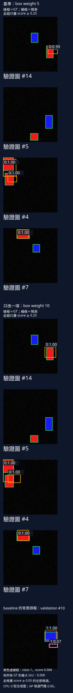

# 17 靜態偵測結業：用一次有理由的改動交付結果

[在 Colab 執行本節](https://colab.research.google.com/github/birdhackor/learn_to_yolo/blob/lessons-v0.6.1/notebooks/17-capstone.ipynb){ .md-button }

你已經能把圖片送進偵測器、解出框，也能用 AP50 評分。現在要交付一個選擇：這個模型錯在哪裡，你因此改了什麼，改完之後有沒有足夠的理由留下它？交付內容要讓另一個人沿著資料、失敗和評估規則，重做同一個決定。

這次的工作是辨識 64×64 圖片中的紅、藍矩形，每張零到兩個物件；另外在 CPU 上量出單張圖片從輸入到畫好框的時間。這個小任務要求時間量得出來、範圍說得清楚，沒有速度上限。若最後的改動沒改善，交付「保留原模型」和失敗診斷，一樣完成工作。

## 先留下一個能重做的基準

紅矩形是 class 0，藍矩形是 class 1。我們先訓練一個 baseline（基準：作為後續對照的原版本），用的是第 7 章的 GridDetector：4×4 格、每格一個框，共 16 個候選，box loss 權重為 5。資料刻意讓物件中心落在不同格，因此每格一框足以表示本次答案；真實資料若常有兩個中心落在同一格，就得重新選模型，不能靠調 loss 權重補上缺少的候選。

模型從零開始訓練，不讀預訓練權重，也不下載資料。先固定三份圖片：train 更新參數，validation 用來看失敗與選設定，test 留到選定模型後才評一次。這延續了[獨立資料與評估](07-heldout.md)的分工。

手機上可左右滑動表格，查看完整欄位。

| 資料 | 張數 | 資料 seed（亂數種子） | 用途 |
| --- | --- | --- | --- |
| train | 32 | 1100 | 更新模型參數 |
| validation | 16 | 2200 | 診斷失敗、決定保不保留改動 |
| test | 16 | 3300 | 選定模型後只評一次 |

不同 seed 產生不同圖片，但三份仍出自同一套畫矩形的規則。這些成績只回答合成矩形任務，不回答真實相機照片的品質。

兩個版本還要從同一個起點出發：

| 訓練設定 | 值 |
| --- | --- |
| 模型 seed | 7，每次訓練前都重設 |
| batch | 8，固定順序取圖，不洗牌 |
| optimizer | Adam，學習率 0.01 |
| 步數 | 每次 160 步 |
| 輸入 shape | `[8,3,64,64]` |
| head 輸出 shape | `[8,4,4,7]`：每格 4 個框參數、1 個 objectness、2 個類別 |

`fit()` 每次開始都重設 seed 7，讓兩個模型的初始權重相同；固定取圖順序讓每一步看到同樣的 8 張圖。稍後只改一項設定，其餘都沿用這張表。

評估也要固定，才知道差別來自哪裡。從[完整圖片推論](07-inference.md)得到候選後，先丟掉 score<0.05 的候選，再按類別做 NMS：每輪保留最高分框，刪掉和它 IoU>0.5 的同類框，繼續處理剩餘候選。已刪掉的框不再參與刪除。這裡的 0.5 比的是兩個預測框。

接著按[AP50 的配對規則](06-evaluation.md)，把預測依 score 排序，和同圖、同類、尚未配走的 GT（真值框）一對一配對，IoU≥0.5 才算 TP。這個 0.5 比的是預測和 GT，和 NMS 的對象不同。AP 用第 6 章的 all-points 插值；兩類都有 GT，mAP50 是兩類 AP 的平均，report 中的欄位叫 `map`。

畫圖另用 score≥0.25，只是為了讓畫面好讀。score 在 0.05 到 0.25 之間的候選仍參與評估；不能因圖上沒畫出來，就把它當成不存在。把資料、訓練、評估和保留條件先寫下、不在看到改動結果後更改，這份規則就叫實驗協議（protocol）。

## 從 baseline 的失敗決定要改什麼

先看 baseline 的 validation。16 張圖片共有 17 個 GT；對每個 GT，找通過截斷與 NMS 後、IoU 最高的同類預測，得到以下覆蓋診斷（coverage，report 的 `baseline_coverage`）：

- 9 個的最佳 IoU≥0.5，已有夠準的同類框。
- 4 個在 0.1 到 0.5 之間，有框碰到但不夠準，以下稱近失敗（near miss）。
- 4 個低於 0.1，或沒有同類候選，幾乎沒被同類框碰到。

這個診斷問「附近有沒有可用的框」，不等於正式 recall。它允許同一個預測替多個 GT 提供最佳 IoU，正式評估卻只准配走一個 GT。所以覆蓋數≥TP 數，覆蓋數÷17 只是 recall 的上限。本次 9 個覆蓋 GT 各有一個成功配對的預測，才剛好得到 TP=9、recall=9/17≈0.5294；擁擠物件若共用一個框，就未必相等。

只有 GT 端的診斷，還不知道多畫的框錯在哪裡。程式再把正式配對後剩下的 FP（誤報）分成四種。每個 FP 先找它和所有 GT、不分類別的最佳 IoU，再依序判斷：

| 最佳 IoU 與類別情況 | FP 種類 | 解讀 |
| --- | --- | --- |
| 低於 0.1 | 背景 `background` | 與所有物件重疊都很低 |
| 0.1 到 0.5 之間 | 定位 `localization` | 碰到物件，但框不夠準 |
| ≥0.5，且同類最佳 IoU 也≥0.5 | 重複 `duplicate` | 同類 GT 已被較高分框配走 |
| ≥0.5，但達標的只有別類 GT | 錯類 `wrong_class` | 位置對，類別錯 |

「背景」是這份診斷的名稱，不保證框完全落在空地。框遠大於或小於物件時，即使有重疊，IoU 也可能低於 0.1；只有 IoU=0 才表示完全沒重疊。GT 端另外檢查錯類覆蓋：同類最佳 IoU<0.5，卻有別類框 IoU≥0.5。個數在 `wrong_class_gt_count`，明細在 `wrong_class_gt_cases`。

baseline 的 5 個 FP 是 4 個定位、1 個背景；錯類 FP、重複 FP、錯類覆蓋都是 0。這使「框不夠準」成為值得先查的方向，但不能說分類全對：沒有任何候選的 GT 根本不會出現在這幾項錯類計數裡。

明細 `false_positive_cases` 留下圖片編號、預測編號、class、score 與最佳 IoU，能逐筆回查。例如 validation 圖片 #14（從 0 起算）的 class 0 框，最佳 IoU 約 0.23，是定位 FP。另一例 #10 是背景 FP，score 約 0.068、IoU=0，雖低於畫圖門檻 0.25，仍超過評估的 0.05。baseline precision 是 9/(9+5)=9/14≈0.6429；若刪掉這個低分 FP，會變成 9/13≈0.6923。

AP 還要看排序。#10 的 FP 排在 class 1 的所有 TP 後面，因此這次沒有改變 AP；排在 TP 前面的高分 FP 才會壓低本例的 AP，像 #4 的兩個 class 0 定位 FP，score 都約 1.00。#4、#10、#14 都是圖片編號，不是框的序號。程式也檢查 TP+FP 等於候選總數，避免診斷漏算候選。

## 把失敗變成一項可測的改動

未覆蓋的 8 個 GT 中有 4 個近失敗，5 個 FP 中有 4 個定位錯誤。我們因此提出假設：box 項在 loss 裡的相對份量太弱，增加它可能讓一部分近失敗跨過 IoU 0.5。這是要用結果檢查的假設；若問題是沒有候選或類別錯，增加 box 權重未必有用。

[第 7 章的 loss](07-loss.md)由三項組成：正格的 box MSE、全部格子的 objectness BCE、正格的 class CE，各自按原規則取平均。本次唯一改動是 box 權重 5→10：

\[
L=w_{\text{box}}L_{\text{box}}+L_{\text{obj}}+L_{\text{cls}}
\]

它改變的是同一個網路收到的三項梯度的相對份量。在相同參數下，box 梯度的係數變成兩倍；Adam 仍會調整每個參數的步伐，所以不代表每次更新量加倍。模型架構、責任分配、optimizer、資料、步數都不變。

框座標仍用正規化的 0～1 比例，沒有改成 pixel。改了權重後，總 loss 的刻度也變了：同一個模型若 box MSE=0.01，乘 5 貢獻 0.05，乘 10 貢獻 0.10，總 loss 憑空多 0.05。兩次訓練因此不能用總 loss 高低決勝，要回到相同評估規則的 mAP50。

在看改動版前，先約定：validation mAP50 至少比 baseline 高 0.01，才保留。baseline 為 0.4444，因此改動版至少要到 0.4544。這是範例的絕對差門檻，沒有做顯著性檢定；validation 只有 17 個 GT，找到或漏掉一個就讓 recall 差 1/17≈0.059，0.01 並不足以證明改善穩定。穩定性要用更多圖片或不同 seed 的重複實驗回答。

假設的預測也先寫好：近失敗和定位 FP 應該減少。mAP50 決定留下誰，這兩項診斷則用來查改動是否朝預期方向發生。test 此時還不看。

完整程式中，`fit()` 每一步先選好 8 張 train 圖，`ids` 是圖片編號，`target` 是[每格訓練目標](07-targets.md)。以下摘錄接起更新、評估與選擇；`...` 是省略的中間程式。

``` { .python data-excerpt="lesson_cases/17-capstone.py" }
# fit() 裡的每一步訓練
optimizer.zero_grad()
# losses 是 grid_loss 回傳的 dict；這裡只取未乘權重的三項，不用 losses['total']（它固定把 box 乘 5）
losses = grid_loss(model(images[ids]), target)
loss = box_weight * losses['box'] + losses['objectness'] + losses['classification']
assert torch.isfinite(loss)  # 每一步都檢查 loss 是有限值（不是無限大或 NaN）
loss.backward()
optimizer.step()
...
# main() 裡：兩次 160 步訓練，各自在 validation 上評估
baseline, base_seconds = fit(train_x, train_y, baseline_weight)
base_metrics, base_preds = evaluate(baseline, val_x, val_y)
changed, change_seconds = fit(train_x, train_y, changed_weight)
change_metrics, change_preds = evaluate(changed, val_x, val_y)
...
# 兩次都評估完，才照事先的規則做一次決定
keep = change_metrics['map'] >= base_metrics['map'] + .01
chosen = changed if keep else baseline  # keep 為 True 就選改動版，否則選 baseline
test_metrics, _ = evaluate(chosen, test_x, test_y)  # test 只評估選定的模型這一次
```

## 用同一組 validation 判斷改動

下表沿用本頁執行紀錄那一次 CPU 實跑：PyTorch 2.9.1、2 個 CPU 執行緒、模型 seed 7。重新執行以當次 report 為準；硬體負載會影響時間，浮點數加總順序也可能讓門檻附近的框改變計數。

| validation 指標 | baseline：box 權重 5 | 改動版：box 權重 10 |
| --- | --- | --- |
| class 0 AP50 | 0.3333 | 0.6250 |
| class 1 AP50 | 0.5556 | 0.7778 |
| mAP50 | 0.4444 | 0.7014 |
| precision | 0.6429 | 0.8000 |
| recall | 0.5294 | 0.7059 |
| TP | 9 | 12 |
| 定位 FP | 4 | 2 |
| 背景 FP | 1 | 1 |
| 同類最佳 IoU≥0.5（覆蓋） | 9（共 17） | 12（共 17） |
| 最佳 IoU 在 0.1 到 0.5（近失敗） | 4（共 17） | 2（共 17） |
| 最佳 IoU<0.1（含無同類候選） | 4（共 17） | 3（共 17） |

兩次錯類 FP、重複 FP、錯類覆蓋都為 0。改動版 precision=12/(12+2+1)=0.8，recall=12/17≈0.7059；這次 12 個覆蓋 GT 也各自成功配對，所以覆蓋數剛好等於 TP。

先用下圖把數字接回圖片。每張先看 baseline，再看緊接著的改動版，兩格吃的是同一張 validation 圖。



四對由上到下是 #14、#5、#4、#7；「基準」就是 baseline。綠框是 GT、橘框是預測，橘框左上角的深色標籤是 `class:score`，例如 `0:1.00`。四對只畫 score≥0.25 的框，低分候選仍可能列在評估中。這些圖片按 baseline 未被 IoU≥0.5 覆蓋的 GT 數，由多到少選出；同數取圖片編號較大者，沒有挑最好看的結果。圖只重排同次實跑的像素、框與分數。

高 score 不能代替定位。對照 #4 baseline 的上下兩個橘框，以及 #14 的前後兩格：

| 圖片／模型／框 | 同類最佳 IoU | 判定 |
| --- | --- | --- |
| #4／baseline／上方橘框 | 0.4918 | 定位 FP |
| #4／baseline／下方橘框 | 0.3034 | 定位 FP |
| #14／baseline | 0.2275 | 定位 FP |
| #14／改動版 | 0.4928 | 仍是定位 FP |

它們都是 class 0、score 約 0.99–1.00，卻都沒到 IoU 0.5。#14 改動版很接近，原值仍是 0.4928，四捨五入約 0.49；表格數值來自 `false_positive_cases`。最下方 #10 改用 score≥0.05 畫出全部候選，紫色虛線圈出「背景誤報」：那裡只有雜訊，標籤 `1:0.07` 對應 class 1、score 0.068。

近失敗 4→2、定位 FP 4→2，和假設的預測一致。但最佳 IoU<0.1 的 GT 也從 4→3，改動的影響沒有只落在近失敗上。三項 loss 共用網路，改 box 權重後，objectness、類別分數與排序也會跟著變；AP 看排序，因此不能把全部 mAP50 提升歸因於框更準。改動版仍有 5 個 GT 未覆蓋，#14 也仍未配對成功。

是否保留只照先前規則：0.7014≥0.4544，所以這次留下改動版，`keep_change=true`。

## 選定之後，才報 test 與成本

選定模型只測一次 test，得到 mAP50 0.4452、precision 0.6364、recall 0.5385。test 是另一批 16 張圖，不能拿 0.4452 和 baseline 的 validation 0.4444 比。程式刻意不測 baseline 的 test，避免看完 test 又回頭選模型。test 只有 13 個物件，recall=7/13；多找或漏一個就差 1/13≈0.077，所以這次選擇不代表在所有新圖上都更好。

小資料切分本身也會造成大差距：[第 7 章的 160 步實驗](07-heldout.md)訓練設定和這個 baseline 相同，資料 seed 為 7／700／7000，validation mAP50 是 0.80；本次 seed 1100／2200／3300 得到約 0.44。要判斷改動，必須在同一份 validation 上比，不能拿別頁的分數決勝。

兩個版本都是 15,511 個參數。兩次 160 步訓練約 0.57 秒、0.56 秒，只計 `fit()` 的訓練迴圈，不含模型建立、target 準備。正式訓練前，程式先用 baseline 設定訓練 10 步暖機，做掉第一次執行的準備工作，訓練出的模型隨後丟掉。`fit()` 每次重設 seed，所以暖機不改兩次正式模型；若省略，先跑的 baseline 時間會多算首次準備。兩次每步運算相同，只換 loss 前的一個係數，而且各量一次，所以這個差距不能解讀成 box 權重造成加速。

選定模型的診斷管線中位數約 2.24 毫秒，量的是 uint8 RGB（值為 0～255 的整數）→tensor→模型→score 0.05 的 decode／NMS→畫框。B=1、CPU 2 執行緒，先暖機 3 次，再量 12 次取中位數，不含讀檔、影片解碼。畫框還包含放大到 192×192、GT 與 score≥0.25 的預測，這是診斷視覺化的成本，不是只跑模型的時間，也不是一般 YOLO 的速度承諾。

計時用選定模型在 validation 留下最多候選的那張圖（`timed_validation_image`），並要求計時路徑確實有候選（`timed_image_candidates>0`），才會量到 NMS 和畫框的工作。這個候選數可能與選圖時不同：選圖一次跑 16 張、像素是 0～1；計時一次跑一張，還先轉 uint8 再轉回來，末位差異可能讓接近 score 0.05 的候選改變去留。12 次中位數取排序後第 6、7 小兩值的平均。

## 把自己的執行整理成可交付結果

本機先依 [README 環境步驟](https://github.com/birdhackor/learn_to_yolo#readme)安裝固定依賴，在 repo 根目錄執行 `PYTHONPATH=. python lesson_cases/17-capstone.py`；Colab 先執行環境格，再跑完整實驗。程式產生 `artifacts/lesson-17/report.json` 和 `validation.svg`，最後一行印出圖路徑。程式輸出仍是橫排圖；本頁按同圖片配對重排，沿用原結果。

用當次 report 交付四件事：失敗支持哪個假設、唯一改動與保留規則、同份 validation 的比較與所選模型的 test 成績、參數量和計時範圍。把還沒解決的失敗一起交付，另一個人才知道下一次該查什麼。

程式的停止條件是：暖機與兩次正式訓練，每步 loss 都有限、最後 loss 低於第一步；baseline validation mAP50>0.05；計時圖有候選。這裡 mAP50 的 0.05 是學到一點東西的下限，和 score 截斷 0.05 沒關係。通過這條快速路徑（10+160+160=330 步）即可完成本題；若要形成正式採用決策，再增加資料、不同初始化 seed 與需求相關的真實場景。

若斷言失敗，先找資料、target、更新或推論的問題。只有錯誤明確指向 `main()` 的暖機呼叫 `fit(train_x, train_y, baseline_weight, steps=10)` 時，才按下面的說明排除暖機誤判。

??? note "暖機的 loss 檢查失敗時怎麼辦"

    最後 loss 低於第一步，是比較不同批的 8 張圖，不是同一批。1 步時兩者相同，必然失敗；2 步時只更新一次，資料難度差異可能大於改善。10 步後已更新 9 次，誤判較少，但仍可能發生。

    看 traceback（錯誤訊息）中 `in main` 那層：notebook 會列出附近幾行，只有行號前的箭頭（例如 `-->`）指向暖機呼叫才算，不是那行出現在訊息裡就算。將該行開頭加 `#`，再跑一次。`fit()` 仍會重設 seed，所以兩次正式模型不變，但 baseline 時間會包含首次準備；此時不能沿用原本公平暖機的計時解讀。

    若兩次 160 步都通過原檢查，這是暖機那次的誤判；若仍有斷言失敗，就查資料、target 與更新，不要繼續宣稱完成。

??? note "補充：權重係數與更新路徑的核對"

    三項共用參數 θ，所以總梯度是

    \[
    \frac{\partial L}{\partial\theta}
    =w_{\text{box}}\frac{\partial L_{\text{box}}}{\partial\theta}
    +\frac{\partial L_{\text{obj}}}{\partial\theta}
    +\frac{\partial L_{\text{cls}}}{\partial\theta}.
    \]

    loss 有限或下降，仍不能單獨證明每一步梯度都傳到模型。既有[補充檢查](https://github.com/birdhackor/learn_to_yolo/blob/main/reviews/clear-tutorial/full-review-2026-10-06/reproduction/check_capstone_updates.py)在每次 Adam 更新前檢查各參數梯度有限、合併梯度 L2 長度>0；更新後檢查權重有限，並比較訓練起訖副本。

    | 訓練 | 每步梯度 L2 長度範圍 | 起訖最大的單一權重差 |
    | --- | --- | --- |
    | 暖機 10 步 | 0.1461～1.1577 | 0.0922 |
    | baseline 160 步 | 0.0748～1.4340 | 0.6971 |
    | 改動版 160 步 | 0.0988～2.7302 | 0.8617 |

    這三次既有觀察支持更新路徑接通、權重確實改變，不能證明新圖答對。[完整紀錄](https://github.com/birdhackor/learn_to_yolo/blob/main/reviews/clear-tutorial/full-review-2026-10-06/rechecks/capstone-updates.json)保存每步結果與來源。它是另一次帶額外檢查的執行，沒有寫進原 notebook，耗時不能替換前面的正常訓練時間。

這種交付的代價是每個候選方案都要重訓、重看失敗；收益是選擇有依據，test 不參與選擇。不要為了交出提升而更改門檻，也不要把 train 成績當成未見圖片的成績。若兩次 score 截斷不同，precision 也不能直接相比。

## 自主練習

把改動版的 box 權重從 10 改成 2（baseline 仍是 5，其他設定都不變），重跑一次，交付你的結論。

1. 在 notebook〈本節可修改的完整實驗〉標題下方的程式格裡，找到 `def main(baseline_weight=5, changed_weight=10):`，把 10 改成 2 再執行；其他程式（包括斷言）都不用改。
2. 先確認改動有生效：report 的 `box_weights` 是 `[5, 2]`，圖第二列的標題寫「只改一項：box weight 2」。第 1 步的程式格只會印出 report 和圖的檔案路徑，不會直接顯示圖；要看圖，就在 notebook 裡新增一個程式格，執行 `from IPython.display import SVG; SVG(filename='artifacts/lesson-17/validation.svg')`（環境格已把目前目錄切到 repo 根目錄，所以這個相對路徑找得到檔案）。之後只看這次的 report，不要沿用本節 box 權重 10 的結果表。
3. 照當次 report 的 `keep_change`（是否保留改動），交付「保留」或「不保留」。若 validation mAP50 沒有比 baseline 高至少 0.01，答案就是保留 baseline。
4. 交付兩次訓練的診斷（清單見下方）。
5. 從 FP 明細（`false_positive_cases`）挑一例，用它的圖片編號、score 與 IoU，寫出下一個假設。先不要把第二個改動混進同一個實驗。

第 4 步要交付的診斷（baseline 與改動版各一份，都在 report 裡）：

- 覆蓋診斷（`baseline_coverage`、`changed_coverage`）：同類最佳 IoU≥0.5、0.1 到 0.5、低於 0.1 的 GT 各有幾個，欄位依序是 `covered_iou50`、`iou10_to_50`、`below_iou10`。
- 錯類覆蓋數（`baseline_errors`、`changed_errors` 裡的 `wrong_class_gt_count`）：位置找對、類別卻錯的 GT 數。
- 各種 FP 的個數（同樣在這兩份錯誤診斷裡的 `false_positive_counts`）：背景、定位、錯類、重複 FP 各幾個。

??? note "參考答案"

    這題沒有可以照抄的標準數字：答案以你當次的 report 為準，也不要預設「改小權重一定變差」。照下面的順序判讀：

    1. **確認改對了參數。** `box_weights` 要是 `[5, 2]`。baseline 的設定沒變，所以 `baseline_validation`、`baseline_coverage`、`baseline_errors` 應該和本節相同；換了機器可能有小差異。
    2. **保不保留只看規則。** 比較 `changed_validation` 的 `map` 是否至少比 `baseline_validation` 的 `map` 高 0.01。你的結論要和 `keep_change` 一致；若不一致，先重新檢查自己的計算。
    3. **回頭對照假設。** 本節的假設是「box 項的份量太弱」。把改動版的近失敗數（`changed_coverage` 的 `iou10_to_50`）和定位 FP 數（`changed_errors` 裡 `false_positive_counts` 的 `localization`）拿來和 baseline 比，記下是變多、變少還是不變。不論哪一種，都只是這組資料、這一次訓練的觀察，不能當成穩定的規律。
    4. **下一個假設要從一筆具體的 FP 出發。** 寫出圖片編號、score、和所有 GT 的最佳 IoU，以及它屬於哪一種 FP；再說明打算改哪一個設定、預期哪個數字會變。寫法示範（用的是本節 box 權重 10 的資料，不是本題答案）：「改動版在 #14 有一個定位 FP，score 約 1.00，和所有 GT 的最佳 IoU 是 0.49，只差一點就過 0.5。下一個假設：box loss 用的是座標的 MSE，不直接以 IoU 為目標；改用第 11 章的 IoU loss，可能把這類框推過 0.5。下一次實驗仍只改這一項。」

<!-- curriculum-evidence:start -->

## 實際執行紀錄

本節的完整程式於 2026-10-08 在 AMD EPYC 9V74 80-Core Processor（2 個執行緒）上用 PyTorch 2.9.1+cpu 執行，程式裡的 assert 全部通過。下面是那次印出的原始輸出；輸出裡若有計時或訓練得到的數字，換一台電腦會略有不同。每個數字的意思，以本頁正文的說明為準。[完整紀錄（JSON）](https://github.com/birdhackor/learn_to_yolo/blob/main/artifacts/checks/curriculum/17-capstone.json)

??? example "展開本次實際輸出"

    ```text
    {
      "data_seeds": [
        1100,
        2200,
        3300
      ],
      "train_samples": 32,
      "validation_samples": 16,
      "test_samples": 16,
      "steps_per_run": 160,
      "box_weights": [
        5,
        10
      ],
      "score_threshold": 0.05,
      "display_threshold": 0.25,
      "eval_iou": 0.5,
      "baseline_validation": {
        "ap_per_class": {
          "0": 0.3333333333333333,
          "1": 0.5555555555555556
        },
        "map": 0.4444444444444444,
        "precision": 0.6428571428571429,
        "recall": 0.5294117647058824
      },
      "changed_validation": {
        "ap_per_class": {
          "0": 0.625,
          "1": 0.7777777777777778
        },
        "map": 0.7013888888888888,
        "precision": 0.8,
        "recall": 0.7058823529411765
      },
      "baseline_coverage": {
        "covered_iou50": 9,
        "iou10_to_50": 4,
        "below_iou10": 4
      },
      "changed_coverage": {
        "covered_iou50": 12,
        "iou10_to_50": 2,
        "below_iou10": 3
      },
      "baseline_errors": {
        "score_threshold": 0.05,
        "matching_iou": 0.5,
        "background_iou_below": 0.1,
        "wrong_class_gt_count": 0,
        "wrong_class_gt_cases": [],
        "true_positives": 9,
        "false_positive_counts": {
          "background": 1,
          "localization": 4,
          "wrong_class": 0,
          "duplicate": 0
        },
        "false_positive_cases": [
          {
            "image": 4,
            "prediction": 0,
            "kind": "localization",
            "class": 0,
            "score": 1.0,
            "best_any_iou": 0.49179601669311523,
            "best_same_class_iou": 0.49179601669311523
          },
          {
            "image": 4,
            "prediction": 1,
            "kind": "localization",
            "class": 0,
            "score": 0.9999768733978271,
            "best_any_iou": 0.3034302294254303,
            "best_same_class_iou": 0.3034302294254303
          },
          {
            "image": 5,
            "prediction": 0,
            "kind": "localization",
            "class": 1,
            "score": 0.2382209151983261,
            "best_any_iou": 0.2817534804344177,
            "best_same_class_iou": 0.2817534804344177
          },
          {
            "image": 10,
            "prediction": 1,
            "kind": "background",
            "class": 1,
            "score": 0.06800812482833862,
            "best_any_iou": 0.0,
            "best_same_class_iou": 0.0
          },
          {
            "image": 14,
            "prediction": 0,
            "kind": "localization",
            "class": 0,
            "score": 0.9869535565376282,
            "best_any_iou": 0.22750438749790192,
            "best_same_class_iou": 0.22750438749790192
          }
        ]
      },
      "changed_errors": {
        "score_threshold": 0.05,
        "matching_iou": 0.5,
        "background_iou_below": 0.1,
        "wrong_class_gt_count": 0,
        "wrong_class_gt_cases": [],
        "true_positives": 12,
        "false_positive_counts": {
          "background": 1,
          "localization": 2,
          "wrong_class": 0,
          "duplicate": 0
        },
        "false_positive_cases": [
          {
            "image": 4,
            "prediction": 1,
            "kind": "localization",
            "class": 0,
            "score": 0.9965824484825134,
            "best_any_iou": 0.25703832507133484,
            "best_same_class_iou": 0.25703832507133484
          },
          {
            "image": 10,
            "prediction": 1,
            "kind": "background",
            "class": 1,
            "score": 0.0727023109793663,
            "best_any_iou": 0.0,
            "best_same_class_iou": 0.0
          },
          {
            "image": 14,
            "prediction": 0,
            "kind": "localization",
            "class": 0,
            "score": 0.9985516667366028,
            "best_any_iou": 0.49281632900238037,
            "best_same_class_iou": 0.49281632900238037
          }
        ]
      },
      "keep_change": true,
      "chosen_test": {
        "ap_per_class": {
          "0": 0.2571428571428571,
          "1": 0.6333333333333333
        },
        "map": 0.4452380952380952,
        "precision": 0.6363636363636364,
        "recall": 0.5384615384615384
      },
      "parameters": 15511,
      "train_seconds": [
        0.571469356000307,
        0.563046855997527
      ],
      "train_timing_scope": "only the training loop of each run, after one untimed 10-step warm-up fit; CPU, 2 threads",
      "chosen_end_to_end_median_ms": 2.2357749985530972,
      "timed_validation_image": 2,
      "timed_image_candidates": 2,
      "timing_scope": "uint8 RGB -> tensor -> model -> decode/NMS at score .05 -> drawing, on the validation image with the most candidates; CPU, batch 1, 2 threads; median of 12 runs after 3 warm-up runs; no file I/O",
      "limits": "single initialization, tiny synthetic rectangles; no real-image or multi-seed evidence"
    }
    actual validation panel: artifacts/lesson-17/validation.svg
    ```

<!-- curriculum-evidence:end -->
