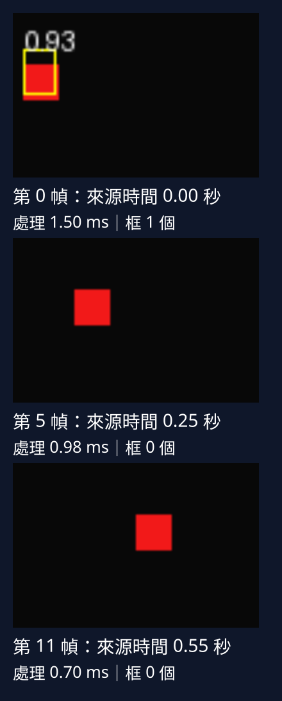
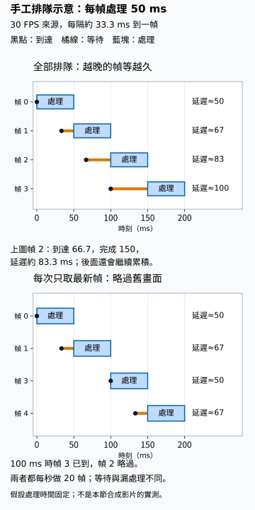

# D.18 影片串流：處理每一幀，並分清 FPS 與延遲

[在 Colab 執行本節](https://colab.research.google.com/github/birdhackor/learn_to_yolo/blob/lessons-v0.6.1/notebooks/18-video.ipynb){ .md-button }

單張圖片的框已經能還原到原圖。現在來源換成影片：畫面會持續送來，我們要在每張畫面上使用同一個偵測器，並保留「這是影片的哪個時刻」。影片中的一張畫面叫幀（frame）；影片串流就是依序取得、處理這些幀。

先讓一段短影片走過「畫面→前處理→模型→解碼與框還原→畫框」。看到結果後，再問處理速度能否跟上來源、結果會不會已經太舊。這兩個問題需要不同的時間紀錄。

## 用移動的紅方塊檢查逐幀工作

本次來源由程式畫出：深色底、14×14 畫素紅方塊，第 i 幀左上角是 x=4+4i、y=20，每幀右移 4 畫素。畫面寬 96、高 64，是 uint8 RGB，array shape 為 `[64,96,3]`（高、寬、通道）。來源有 12 幀、20 FPS（frames per second，每秒幀數），因此每幀代表 50 毫秒。

這些畫面不是相機錄影，來源時間是 i/20 秒，不是用時鐘量出的擷取時間。第 0 幀時間為 0，最後第 11 幀為 11/20=0.55 秒；12 幀的播放時長是 12/20=0.6 秒，因為最後一幀還占一個播放間隔。幀號 11 因此不能讀成 11 毫秒。

偵測器仍用 GridDetector。完整程式從零訓練它：32 張合成矩形圖、資料 seed 4100、模型 seed 7、160 步、batch 8、Adam、學習率 0.01，不讀既有 checkpoint。之後所有幀共用這個模型，不重建 optimizer、不做 backward。影片只是換了使用時的輸入，不是在每一幀重新訓練。

## 讓畫面帶著幀號與來源時間進來

每張畫面包成一個 `Frame`，把影像和它的來源位置綁在一起：

``` { .python data-excerpt="lesson_cases/18-video.py" }
@dataclass
class Frame:
    index: int          # 第幾幀：從 0 開始遞增的整數
    timestamp_s: float  # 來源時間（秒）：這一幀在影片中的時刻，不是處理花了多久
    rgb: np.ndarray     # 畫面：uint8、HWC（高、寬、通道）、RGB 順序
```

`@dataclass` 讓 Python 自動建立物件的初始化程式；`Frame(i, i / fps, rgb)` 建立一幀，`frame.index`、`frame.timestamp_s`、`frame.rgb` 取出三個欄位。這裡的時間戳回答「它在來源裡是何時」，稍後另外計時才回答「程式處理它花多久」。

來源逐幀交出 `Frame`，處理端逐幀交出結果，兩邊不必先把整段影片載進記憶體。Python 的 generator（產生器）適合做這件事：函式以 `yield` 交出一筆後暫停，外面要下一筆時才繼續。先看小例子：

```python
def count_up():
    for i in range(3):
        print('準備', i)
        yield i                        # 交出 i 後暫停，等外面要下一筆
for x in count_up(): print('拿到', x)  # 每要一筆，函式才往下跑到下一個 yield
```

輸出依序是準備 0、拿到 0、準備 1、拿到 1、準備 2、拿到 2。只呼叫 `count_up()` 不會執行函式本體，得到的是尚未開始的 generator 物件；for 迴圈要資料時才會開始。`run_stream(frames, model)` 也遵守這個約定，必須真的取它的結果才會處理影片。

## 一幀照原本的圖片流程走完

這張寬圖先沿用[自己的圖片推論](08-own-images.md)與[座標轉換](04-coordinates.md)的做法。HWC uint8→CHW float32，再除以 255，得到 `[3,64,96]`。letterbox 到 64×64 時，理想比例 min(64/64,64/96)=2/3：寬縮成 64，高約 42.67，取整為 43，所以上補 10 列、下補 11 列。實際 x 比例是 2/3、y 比例是 43/64，框還原要用這一幀自己的 metadata。

加 batch 軸後是 `[1,3,64,64]`，模型 raw 為 `[1,4,4,7]`。decode／NMS 得到的是 64×64 畫布上的框，還原後才可畫回 96×64 原幀。下列核心片段省略完整程式的斷言、計時與畫框，結果 dict 也只留三個欄位；完整程式另交出疊框的 `image` 和各段時間 `ms`。

```python
@torch.no_grad()
def run_stream(frames, model):
    for frame in frames:
        # .copy()：保險起見，複製成獨立、可寫的陣列
        # permute 把 HWC 換成 CHW，除以 255 把值縮到 [0,1]：[64,96,3] uint8 → [3,64,96] float32
        tensor_rgb = torch.from_numpy(frame.rgb.copy()).permute(2, 0, 1).float() / 255
        # 推論時沒有 GT 框，所以傳 shape [0,4] 的空框；回傳的 image 是 [3,64,64]
        image, _, metadata = letterbox(tensor_rgb, torch.empty(0, 4), size=64)
        raw = model(image[None])  # image[None] 在最前面加上 batch 軸：[1,3,64,64]
        # score 門檻 0.1、NMS 的 IoU 門檻 0.5；[0] 取這唯一一張圖的結果
        prediction = decode_grid(raw, score_threshold=.1, nms_iou=.5)[0]
        # 用這一幀自己的 metadata，把框還原到寬 96、高 64 的來源座標
        prediction['boxes'] = undo_letterbox(prediction['boxes'], metadata)
        yield {'index': frame.index,  # 交出這一幀的結果，然後暫停
               'source_timestamp_s': frame.timestamp_s,
               'prediction': prediction}
```

此處為了分清轉換前後，把 letterbox 前的 tensor 叫 `tensor_rgb`；完整程式兩者都叫 `image`。傳進來的 model 已設為 eval，`@torch.no_grad()` 讓推論不記錄計算圖。`frames` 只要能被 for 逐筆取出即可，可以是 list，也可以是產生合成畫面的 `synthetic_frames` generator。

本節 score 截斷用 0.1，NMS IoU 門檻用 0.5。score 門檻比第 7 章畫圖的 0.25 低，是因為這個只訓練 160 步的模型，在 letterbox 畫面上多數幀的最高分不到 0.25；留下較弱的候選，才能觀察管線和失敗。它仍是模型真的 forward 結果，沒有把 GT 填成預測；留下多少框也不是準確率。

示範最後以 `list(run_stream(...))` 收齊 12 幀來存 GIF。長影片則要一筆筆寫出：每筆包含一張疊框畫面，全部留在 list 會累積記憶體。1920×1080 RGB 一幀約 6.2MB；10 分鐘、30 FPS 有 18000 幀，只算像素就至少 112GB。

??? note "generator 的 no_grad 放在哪裡"

    `@torch.no_grad()` 在 generator 往下執行時關閉梯度，`yield` 暫停時恢復原狀，外面的 for 不受影響。若改成在 generator 內用 `with torch.no_grad():` 包住整個迴圈，暫停時外面也會留在不記錄計算圖的狀態。這是本節把它寫成 decorator 的原因。

## 看結果：處理了這一幀，不代表找到了物件

[](../assets/diagrams/18-video-readable.svg)

三格由上到下是第 0、5、11 幀。紅方塊是畫面裡的物件，不是 GT 框；黃框是預測，白字是 score。每格下方第一行寫幀號、來源時間戳；第二行的「處理 … ms」是這一幀全流程的單次時間，「框 … 個」是留下的框數。像素、框、數值沿用同次程式輸出，只把三格排直。

本次框數是 `[1,1,0,0,0,0,1,1,0,0,0,0]`。12 幀都已處理，卻有 8 幀沒留下 score≥0.1 的框，這叫漏檢；若來源幀沒被處理就跳過，才叫掉幀。每幀的第 0 個框也不表示同一個物件，它只是該幀結果的序號；要延續物件身份，需接[下一節的追蹤器](19-tracking.md)。

留下框也不保證準。[影片檔案實測紀錄](https://github.com/birdhackor/learn_to_yolo/blob/main/artifacts/checks/curriculum/video-file.json)保存的第 0、1、6、7 幀框，與紅方塊的 IoU 約 0.50、0.47、0.30、0.46。這份紀錄用無損影片讀回同一批像素，做法在頁末補充。

失敗可以形成下一次實驗的問題。訓練圖是沒有 padding 的 64×64，框寬高 8～15、完整落在一個 16×16 格內；影片經 letterbox 後有 padding，框也可能跨格。模型輸入中的紅方塊約寬 9.3、高 9.4（14×2/3、14×43/64），仍在訓練大小範圍內，因此大小不是這兩份材料的明顯差異。

輸入的 y 約 23.4～32.8（20×43/64+10 到 34×43/64+10），每幀都略跨 y=32。x 乘上 2/3 後，第 2–4、8–10 幀還跨 x=16 或 32，這 6 幀都無框；第 0、1、6、7 幀沒橫跨 x 格線且有框。但第 5、11 幀也沒橫跨 x 格線，仍無框。因此 padding、跨格是待檢查的可能原因，本節沒有對照實驗證明它們造成漏檢，跨格更不能解釋全部失敗。

## 先量處理工作，再談能否跟上影片

圖中第 0 幀有框，需要 NMS、畫框與分數文字；第 5、11 幀無框，這些工作較少。逐幀時間首先受工作量影響。還有另一種成本只在首次執行出現：準備工作。完整程式先處理另外產生的第 0 幀來暖機，要求它確實有框，讓 NMS 和畫框也先走過一次；暖機時間不進統計。

``` { .python data-excerpt="lesson_cases/18-video.py" }
# main() 內，model 是剛訓練好的偵測器
warmup = list(run_stream([next(synthetic_frames(count=count, fps=fps))], model))  # 暖機：只處理 1 幀
assert len(warmup) == 1 and len(warmup[0]['prediction']['boxes']) > 0, 'warm-up must reach NMS and drawing'
results = list(run_stream(synthetic_frames(count=count, fps=fps), model))  # 正式的 12 幀
...
# ms 的每一項（preprocess、model、postprocess、drawing、total）各取 12 幀的中位數
timing = {key: float(np.median([r['ms'][key] for r in results])) for key in results[0]['ms']}
```

`next(synthetic_frames(...))` 只向新來源要第一幀，`[...]` 包成一幀來源，最外層 `list()` 要完結果才真正執行暖機。`results` 另建來源，重新從 0 開始，因此正式 12 幀仍完整保留。report 的 `warmup_frames` 記 1；report 會印出並存到 `artifacts/lesson-18/report.json`。

每幀分前處理、模型、後處理、畫框四段，在各段前後讀 `time.perf_counter()`，相減乘 1000 得毫秒。CPU 是算完才返回，這樣能量到工作時間。若改在 GPU 上計時，工作會先排隊再執行：每次讀 CPU 計時器前，包含各段開頭與結尾，都要 `torch.cuda.synchronize()` 等工作完成，或用 CUDA events 並等事件完成再讀時間，否則模型時間可能被算到後面才等結果的步驟。

本次 PyTorch 2.9.1、CPU 2 執行緒，`median_ms` 是正式 12 幀各項時間的中位數，包含已暖機後的第 0 幀：

| 階段 | 中位數（毫秒） | 包含 |
| --- | --- | --- |
| 前處理 | 0.189 | uint8→tensor、縮放、padding |
| 模型 | 0.190 | 一次 forward |
| 後處理 | 0.343 | score 篩選、NMS、框還原 |
| 畫框 | 0.047 | PIL 影像與文字框 |
| 全流程 | 0.791 | 每幀以上四段的總時間 |

每幀內四段相加等於該幀總時間；表中的中位數卻可能各取自不同幀，所以 0.189+0.190+0.343+0.047=0.769 不必等於總時間中位數 0.791。12 是偶數，中位數取排序後第 6、7 小的平均。這些數字不含影片解碼、磁碟、網路、螢幕更新、相機佇列。「影片解碼」是把壓縮檔還原成像素，不是把模型 raw 解成框的 decode。

??? note "兩段中位數為什麼不能相加"

    假設三幀前處理是 1、2、5 毫秒，模型是 5、1、2：兩項中位數都是 2，相加為 4。每幀總時間卻是 6、3、7，中位數為 6。先加再取中位數，和先各取中位數再加，不是同一個操作。

### 處理速率與延遲是兩回事

來源幀率問每秒送來幾幀；處理速率（throughput）問每秒完成幾幀；延遲（latency）問一幀從擷取到完成等了多久，包含排隊。本例 0.791 毫秒倒數約是 1000/0.791≈1264 幀／秒，只是用典型計算時間的粗估。持續處理速率要用完成幀數÷總耗時實測，接相機後還受解碼、排隊、相機幀率限制，不會超過相機送來的速率。

本例合成來源一要就立刻產生，沒有 `time.sleep` 等 50 毫秒；時間戳雖按 20 FPS 標，並沒有模擬真實排隊，所以不能由它量出相機延遲。

想像 30 FPS 相機每 33.3 毫秒來一幀，處理卻要 50 毫秒。若全部排隊，處理速率仍是 20 幀／秒，結果卻越來越舊。保留全部幀適合不能漏掉畫面的離線工作；即時畫面可選擇丟舊幀、只處理最新一幀，或降低解析度讓處理時間少於 33.3 毫秒。代價分別是等待、漏處理或少掉影像細節。要知道完成時畫面有多舊，需記下真正擷取、排隊與完成的時間。



沿同一幀看黑點到藍塊末端，就是到達到完成的延遲，橘線只畫等待。上圖幀 2 在約 66.7 ms 到達，150 ms 才做完；下圖 100 ms 時直接拿剛到的幀 3，幀 2 沒被處理。兩路都每 50 ms 做完一幀，差在畫面有多舊，以及有沒有略過畫面。這是上述假設的示意；本節的 20 FPS 合成來源沒有這種排隊實測。

??? note "算算看：延遲怎麼累積"

    相機每 1000/30=100/3≈33.3 毫秒送來一幀，所以第 k 幀（k 從 0 起）在 100k/3 毫秒到達。處理一幀固定 50 毫秒，程式一刻不停。

    全部排隊時，第 k 幀要等前面 k 幀都做完，在 50(k+1) 毫秒才做完。延遲=完成時刻−到達時刻=50(k+1)−100k/3=50+50k/3 毫秒，約 50+16.7k：

    - 第 0、1、2 幀：50、66.7、83.3 毫秒。
    - 第 30 幀（1 秒時拍到）：550 毫秒。
    - 第 300 幀（10 秒時拍到）：5050 毫秒，約 5 秒。

    每多一幀，延遲就多約 16.7 毫秒，不會停下來；處理速率卻始終是每秒 1000÷50=20 幀。

    只處理最新一幀時，每做完一幀，就拿當下最新到達的那一幀，沒輪到的舊幀丟掉：

    - 0～50 毫秒：處理第 0 幀，延遲 50 毫秒。
    - 50 毫秒時，最新的是第 1 幀（33.3 毫秒到達）：做到 100 毫秒，延遲 66.7 毫秒。
    - 100 毫秒時，第 3 幀剛好到達：做到 150 毫秒，延遲 50 毫秒；第 2 幀被跳過。
    - 之後照這個規律重複。

    延遲不再累積；本例在 50～67 毫秒之間，代價是約每 3 幀有 1 幀沒處理。一般來說，這種做法的延遲最多是處理時間加一個來源間隔。


## 換來源時，沿用同一份 Frame 約定

影片檔或相機不用重寫推論，只要 adapter（轉接函式）逐幀交出相同的 `Frame`。完整程式提供 `opencv_frames(source)`，用 OpenCV（Open Source Computer Vision Library，Python 模組名 `cv2`）開啟來源，將讀到的 BGR 轉 RGB，再交出幀。忘了轉色，紅色會被讀成藍色，與本書類別順序相反。

OpenCV 的 `VideoCapture` 打開檔案或相機後會占用資源，結束要 `capture.release()`。adapter 用 `try…finally` 保證檔尾、自身出錯或被關閉時釋放。外面的 for 若 `break` 或推論出錯，generator 可能仍停在 `yield`，未立即關閉；若變數或 Colab traceback 還留著它，相機會一直被占用。下面用 `closing` 明確關閉，不依賴 Python 何時回收物件。

??? note "完整程式裡的 `opencv_frames`（加了中文註解）"

    ``` { .python data-excerpt="lesson_cases/18-video.py" }
    def opencv_frames(source):
        """Optional real file/camera adapter. Never called by this lesson's main()."""
        import cv2  # optional: pip install opencv-python-headless
        capture = cv2.VideoCapture(source)  # source：檔名（字串）或相機編號（例如 0）
        try:
            if not capture.isOpened():  # 開不起來就報錯；finally 仍會執行
                raise RuntimeError(f'Cannot open video source: {source}')
            fps = capture.get(cv2.CAP_PROP_FPS)  # 影片記錄的幀率；下面只在大於 0 時採用
            started, index = time.perf_counter(), 0  # 從這裡開始計時，幀號從 0 起
            while True:
                ok, bgr = capture.read()  # 讀下一幀；讀不到（例如到了檔尾）時 ok 是 False
                if not ok:
                    break
                # 來源是字串而且 fps 大於 0：用 index/fps；否則用開啟後經過的秒數
                timestamp = index / fps if isinstance(source, str) and fps > 0 else time.perf_counter() - started
                yield Frame(index, timestamp, cv2.cvtColor(bgr, cv2.COLOR_BGR2RGB))  # 轉成 RGB 再交出
                index += 1
        finally:
            capture.release()  # 讀到檔尾、被中途關閉，或 try 裡面出錯，最後都會走到這裡
    ```


adapter 的時間戳分兩種情況：

| 來源 | 時間戳 | 它代表什麼 |
| --- | --- | --- |
| 字串來源，且讀得到正的 FPS | index/fps | 按固定幀率推算的影片時刻 |
| 其他，例如相機 0 或 FPS 不可用 | 開啟後 `perf_counter()` 經過秒數 | 程式拿到幀的時刻 |

`perf_counter()` 是單調計時器，往前走、不受校時影響。但程式拿到的時間不等於相機感光元件拍攝時間。可變幀率影片或網路串流應讀每幀 PTS（presentation timestamp，播放時該幀應出現的時刻），不能一律用 index/fps。本 adapter 沒實作 PTS，也不會自動辨別可變幀率；字串加正 FPS 就採固定算法。

### 換成自己的影片

本機先依 [README 環境步驟](https://github.com/birdhackor/learn_to_yolo#readme)裝好固定依賴，再在 repo 根目錄 `python -m pip install -r requirements-video.txt`，把 `clip.mp4` 放在根目錄。這裡安裝的是 `opencv-python-headless`，可以讀影片、存結果，沒有開視窗功能，適合 Colab。本課不需要 GUI，也不呼叫 `cv2.imshow`。

四種 OpenCV 套件共用 `cv2`：`opencv-python`、`opencv-contrib-python` 及各自的 headless 版，同一環境只裝一種。若已有其他版，先 `python -m pip uninstall -y opencv-python opencv-contrib-python opencv-python-headless opencv-contrib-python-headless` 全部移除，再裝課程指定版；Colab 的指令前加 `!`。

以下在新 Python 工作階段也能處理檔案。`runpy.run_path` 執行數字開頭、帶連字號、不能普通 import 的程式檔，回傳檔內名稱的 dict；以 `video['fit_detector']` 取得函式。它不把 `__name__` 設成 `'__main__'`，所以不會呼叫檔尾 `main()`。`fit_detector()` 每呼叫一次就訓練 160 步，這裡只呼叫一次。

```python
import runpy
import torch
from contextlib import closing
torch.set_num_threads(2)  # PyTorch 的 CPU 運算只用 2 個執行緒（和完整程式一樣）；OpenCV 解碼另有自己的執行緒
video = runpy.run_path('lesson_cases/18-video.py')  # 執行完整程式檔，回傳裝著檔內名稱的 dict
model = video['fit_detector']()  # 取出函式再呼叫：重新訓練 160 步，得到合成矩形模型
with closing(video['opencv_frames']('clip.mp4')) as frames:  # 離開 with 時自動呼叫 frames.close()
    for result in video['run_stream'](frames, model):  # for 每要一筆，才處理一幀
        print(result['index'], len(result['prediction']['boxes']))  # 印出幀號與框數
```

`closing` 在離開 with 時呼叫 `frames.close()`，即使 break 或出錯也會執行 adapter 的 finally。`source=0` 可以指定第一支相機，但本節沒有開啟或驗證實體相機；Colab 的瀏覽器相機也不能直接當成這台執行機的相機 0。這段程式仍是合成矩形模型，換成真影片不會讓它自動認識照片裡的新物件；要先備有符合來源與類別的模型。

在 Colab 跑完整程式格後，函式留在同一工作階段，可直接呼叫；本機執行程式結束後，另開 Python 就要像上面重新載入。長影片逐幀寫出或使用結果，避免收進整段 list。

## 跑完這條短管線，要核對什麼

預設不開相機，也不需要 GPU。在 repo 根目錄執行 `PYTHONPATH=. python lesson_cases/18-video.py`，或 Colab 先跑環境格再完整實驗。160 步訓練後暖機 1 幀、正式推論 12 幀；程式檢查暖機有框、12 筆結果的 index 為 0～11、最後時間戳 0.55 秒、輸出畫面都是寬 96 高 64。

它產生 `artifacts/lesson-18/stream.gif`、`report.json`、`panel.svg`。本頁圖沿用頁尾紀錄那次的 panel，再改直式排列。完整處理、漏檢數與計時範圍要分別報告；只量 model forward 不能當成從擷取到完成的延遲。這條入口讓同一個圖片模型接不同來源，新增成本則是影片讀取、排隊、寫出或顯示結果。

??? note "進階：用無損影片檔驗證 adapter"

    先說明幾個名詞。FFV1（FFmpeg Video Codec 1）是一種無損影片編碼：交給它的像素會原樣存回來。本實驗用 OpenCV 寫入 8 位元 BGR 畫面，OpenCV 讓 FFV1 直接存 RGB 類的格式，所以讀回後每個畫素都不變，能逐值比對；若先把畫面轉成 YUV 4:2:0（把顏色資訊縮成四分之一解析度的格式）再編碼，即使用 FFV1，顏色也已經變了。AVI（Audio Video Interleave，音訊與影片交錯儲存）是裝影片的檔案格式（容器）。MP4 常用的 H.264 除了有損壓縮會丟掉一些細節，通常也會先轉成 YUV 4:2:0，所以讀回的畫素會略有不同。

    同一個 adapter 已用 12 幀的 FFV1 無損 AVI 檔實測：把前面 `synthetic_frames` 產生的畫面轉成 BGR 寫入檔案，再用 adapter 讀回成 RGB，畫素與原本完全相同；模型的框、分數、類別與疊圖也都相同。12 幀的時間戳仍是 0 至 0.55 秒。程式也核對了三種情況：讀到檔尾、中途關閉 generator、檔案打不開，OpenCV 的影片物件都已關閉。[檔案實測紀錄](https://github.com/birdhackor/learn_to_yolo/blob/main/artifacts/checks/curriculum/video-file.json)保留了影片的 SHA-256（檔案指紋）與結果。這次沒有測實體相機，也不能保證有損 MP4 編解碼後的畫素完全相同。

    可自己重跑這段不用下載的檔案實驗（環境裡已經有別的 OpenCV 套件時，先照〈接真影片的同一個入口〉的說明移除）：

    ```bash
    python -m pip install -r requirements-video.txt
    PYTHONPATH=. python scripts/verify_video_file.py
    ```

    結果寫在 `artifacts/runs/video-file/result.json`。上面連結的檔案實測紀錄，是同一支程式加上 `--record artifacts/checks/curriculum/video-file.json` 產生的。

    `verify_video_file.py` 還會產生 `artifacts/runs/video-file/lossless-fixture.avi` 及疊圖，也把真實預測接給第 19 章的 tracker（追蹤器）。這段影片處理的計時包括開啟影片、讀取與解碼、前後處理、模型、畫框及收集結果；不含先前的訓練、影片編碼、寫入磁碟、顯示或網路佇列。不要把這 12 幀的小測試當成影片的正式效能。

## 自主練習

練習 1、2 要改的是完整程式的最後一行 `main()`（在 `if __name__ == '__main__':` 底下，前面的縮排要保留）：在 Colab 是最後一個程式格的最後一行，在本機是 `lesson_cases/18-video.py` 的最後一行。完整程式的斷言不需要修改：和幀數、時間戳有關的斷言，以及 summary 與 GIF 每幀時長，都用 `count`、`fps` 計算，會自動跟著改。

練習 1：把最後一行改成 `main(count=24)`（fps 保持 20）。先自己算：最後一幀的時間戳與總播放時間各是幾秒？紅方塊從第幾幀開始被右邊界裁切？哪一幀完全看不到？最後一幀若沒有預測框，算不算模型漏檢？靜態圖 `artifacts/lesson-18/panel.svg` 選第 0 幀、中間幀與最後一幀，中間幀由 `save_panel` 裡的 `(len(results)-1)//2` 決定（`//` 是整數除法，捨去小數），這次是哪三幀？

??? note "參考答案"

    - 時間戳：最後一幀是第 23 幀，時間戳 23/20=1.15 秒；24 幀的總播放時間是 24/20=1.2 秒。
    - 裁切：第 i 幀紅方塊的左緣 x=4+4i，寬 14。右緣 x+14 超過 96 就會被裁：4+4i+14>96，得 i>19.5，所以從第 20 幀開始。第 20、21、22 幀的 x 是 84、88、92，只剩 12、8、4 畫素寬。第 23 幀的 x=96，已經在畫面外，看不到紅方塊；report 的 `object_visible_per_frame` 最後一個值是 false。
    - 漏檢：不算。第 23 幀畫面裡沒有物件，沒有東西可漏。
    - 靜態圖：中間幀=⌊(24−1)/2⌋=11，所以是第 0、11、23 幀，不沿用預設 12 幀時的 0、5、11（⌊(12−1)/2⌋=5）。

練習 2：把最後一行改成 `main(fps=10)`（count 保持 12，紅方塊每幀仍右移 4 畫素）。最後時間戳、總播放時間、GIF 每幀時長、紅方塊每秒移動幾畫素，各變成多少？每幀的框數會變嗎？

??? note "參考答案"

    - 最後時間戳是 11/10=1.1 秒，總播放時間是 12/10=1.2 秒。
    - GIF 每幀時長：`round(1000/fps)`=100 毫秒，原本是 50 毫秒。
    - 每一幀的畫面都和 fps=20 時一模一樣，模型的框也與 fps=20 時相同。改變的只是每一幀代表的時間：同樣 4 畫素的位移現在花 0.1 秒，所以每秒從 80 降為 40 畫素。這與模型的計算速度無關。
    - GIF 以 1/100 秒為單位記錄每一幀的顯示時間，50、100 毫秒剛好存得下；30 FPS 時 `round(1000/30)`=33 毫秒，會被存成 30 毫秒，播放略快。

練習 3：30 FPS 的相機、處理一幀要 50 毫秒，來不及處理的幀全部排隊。3 秒時拍到的第 90 幀，什麼時候處理完？延遲多少？改成只處理最新一幀，延遲大約多少？

??? note "參考答案"

    全部排隊時，第 k 幀在 50(k+1) 毫秒做完，所以第 90 幀在 50×91=4550 毫秒做完。它在 90÷30=3 秒，也就是 3000 毫秒時到達，延遲=4550−3000=1550 毫秒=1.55 秒；代入〈算算看：延遲怎麼累積〉的 50+50k/3 也一樣：50+1500=1550。這段時間處理速率一直是每秒 20 幀。

    只處理最新一幀時，延遲不再累積，本例在 50～67 毫秒之間；代價是約每 3 幀有 1 幀沒處理。

<!-- curriculum-evidence:start -->

## 實際執行紀錄

本節的完整程式於 2026-10-08 在 AMD EPYC 9V74 80-Core Processor（2 個執行緒）上用 PyTorch 2.9.1+cpu 執行，程式裡的 assert 全部通過。下面是那次印出的原始輸出；輸出裡若有計時或訓練得到的數字，換一台電腦會略有不同。每個數字的意思，以本頁正文的說明為準。[完整紀錄（JSON）](https://github.com/birdhackor/learn_to_yolo/blob/main/artifacts/checks/curriculum/18-video.json)

??? example "展開本次實際輸出"

    ```text
    {
      "frames": 12,
      "source_fps": 20,
      "source_duration_s": 0.6,
      "source_last_timestamp_s": 0.55,
      "gif_frame_duration_ms": 50,
      "source_size_hw": [
        64,
        96
      ],
      "object_visible_per_frame": [
        true,
        true,
        true,
        true,
        true,
        true,
        true,
        true,
        true,
        true,
        true,
        true
      ],
      "model_input_hw": [
        64,
        64
      ],
      "boxes_per_frame": [
        1,
        1,
        0,
        0,
        0,
        0,
        1,
        1,
        0,
        0,
        0,
        0
      ],
      "warmup_frames": 1,
      "median_ms": {
        "preprocess": 0.18935699335997924,
        "model": 0.19011749827768654,
        "postprocess": 0.3427379997447133,
        "drawing": 0.04718600393971428,
        "total": 0.7907010003691539
      },
      "camera_adapter": "provided, not executed",
      "limits": "synthetic lazy producer; no capture/codec/display/network queue latency measured"
    }
    GIF: artifacts/lesson-18/stream.gif; actual static panel: artifacts/lesson-18/panel.svg
    ```

<!-- curriculum-evidence:end -->
