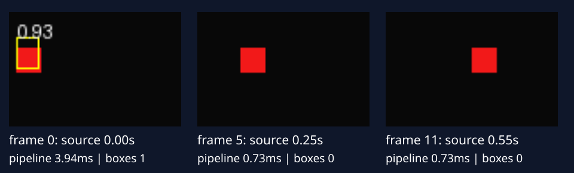

# 18 影片串流：處理每一幀，並分清FPS與延遲

[開啟 Colab](https://colab.research.google.com/github/birdhackor/learn_to_yolo/blob/lessons-v0.2.0/notebooks/18-video.ipynb) · 原始碼：`lesson_cases/18-video.py`

前置是[完整圖片推論](07-inference.md)與[letterbox座標轉換](04-coordinates.md)。影片並不要求換掉圖片detector，而是把「讀一張圖→前處理→模型→後處理→畫框」放進連續迴圈。真正新問題是幀的時間、來源大小、資源釋放與佇列。本節先使用可控連續幾何畫面，測一條真實推論管線，再提供可替換的影片／相機adapter；預設不使用相機許可權。

本次從零訓練GridDetector，32張合成矩形、seed4100、160steps、batch8、Adam lr.01；不依賴前一節checkpoint。影片來源是12幀、20FPS、每幀64×96 RGB，紅矩形每幀向右4畫素。這不是攝影機錄製，時間戳是生成來源的邏輯時間；模型預測是實際forward結果，沒有用真值框冒充偵測。

## 先固定frame介面

`Frame(index,timestamp_s,rgb)`包含遞增整數index、秒為單位的來源時間與uint8 HWC RGB。第0幀時間0、第11幀.55秒，12個50毫秒影格總播放時間.6秒。時間戳最後值與總播放時長不同，因為最後一幀仍佔一個播放間隔。

來源array shape`[64,96,3]`轉為float32 CHW`[3,64,96]`、除255；letterbox到64×64，比例為64/96=2/3，內容高度約43、其餘padding在上下。加入batch為`[1,3,64,64]`，model raw為`[1,4,4,7]`。decode產生64×64座標的框，再用metadata還原96×64來源，畫在原始frame，而不是直接把輸入座標畫回寬圖。

以下是`run_stream`函式內的核心片段，省略畫框與計時。`model`在迴圈外已設為eval，整個函式使用no_grad：

```python
for frame in frames:
    tensor_rgb = torch.from_numpy(frame.rgb.copy()).permute(2, 0, 1).float() / 255
    image, _, metadata = letterbox(tensor_rgb, torch.empty(0, 4), size=64)
    raw = model(image[None])
    prediction = decode_grid(raw, score_threshold=.1)[0]
    prediction['boxes'] = undo_letterbox(prediction['boxes'], metadata)
    yield {'index': frame.index,
           'source_timestamp_s': frame.timestamp_s,
           'prediction': prediction}
```

generator每次`yield`交出一幀結果，下游要求下一筆才繼續處理。`run_stream`接受任意Frame iterable（可逐筆取得的來源），來源不必一次載入。主程式為存12幀GIF而收集少量輸出；正式長影片應逐幀寫出，不能`list()`整段影片。模型在eval/no_grad模式；每幀不重建model或optimizer，也不做backward。需要追蹤身份時另接第19章，不把每幀框序號當固定物件ID。

## 把管線時間拆開量

程式用`perf_counter()`記前處理、模型、decode/NMS/還原與畫框，CPU計算為同步。本次PyTorch2.9.1 CPU、2threads，略過第一幀的median如下；數字是這次小模型實測，不是速度保證。

| 階段 | median毫秒 | 包含 |
| --- | --- | --- |
| 前處理 | 0.187 | uint8→tensor、縮放、padding |
| 模型 | 0.199 | 一次forward |
| 後處理 | 0.367 | score篩選、NMS、框還原 |
| 畫框 | 0.049 | PIL影像與文字框 |
| 全流程 | 0.841 | 上述各項的逐幀總時間 |

各分項median相加不一定等於total median，因為每項的中位幀可能不同。這裡未包含影片解碼、網路、磁碟、螢幕重新整理或相機佇列；因此不能用`1000/0.841`推算相機實際輸出FPS。來源本來只有20FPS，也沒有sleep模擬實際到達。

對30FPS相機，來源間隔約33.3毫秒。若每幀處理50毫秒，無限排隊會讓畫面越來越舊，即使程式仍持續輸出約20FPS。應決定保留全部幀、丟棄舊幀或降低解析度。FPS描述一段時間處理幾幀，latency描述一幀從取得到完成多久；要量實際畫面年齡，還需同時記擷取時間、排隊時間與完成時間。

## 真實預測，也保留失敗



本次每幀框數為`[1,1,0,0,0,0,1,1,0,0,0,0]`。12幀全都完成處理，卻有8幀沒有高於.1的框；這是模型漏檢，不是stream掉幀。訓練資料框都在cell內、影像是正方形，而影片加入寬圖padding、跨cell移動和縮小物件，已造成分佈差異。本節沒有為好看而填入GT框，也不將低閾值的框數當準確率。

執行`PYTHONPATH=. python lesson_cases/18-video.py`，檢查12個index、.55秒最後時間戳與96×64輸出大小；產生`artifacts/lesson-18/stream.gif`、`report.json`與頁面靜態圖。這條路可無相機、無GPU獨立完成，快速驗證只需160訓練steps加12次推論。

## 接真影片的同一個入口

案例提供`opencv_frames(source)`adapter（把來源轉成Frame的介面），需額外安裝`opencv-python-headless`；讀檔使用`cv2.VideoCapture('clip.mp4')`、BGR轉RGB，最後`finally: capture.release()`。可用`run_stream(opencv_frames('clip.mp4'),model)`替換來源。相機來源可傳0，但本次沒有開啟或驗證相機。檔案的frame時間用index/fps，相機用取得時的monotonic時間；可變frame rate或網路串流應改讀可靠的媒體PTS（影格呈現時間戳），不把固定FPS推算當真實擷取時間。

收益是圖片模型可接不同來源、保留座標與時間契約；代價是解碼、格式、佇列與輸出資源。常見錯誤是OpenCV BGR未轉RGB、每幀重新載入權重、未還原padding、將frame index當毫秒，或只測forward就報端到端延遲。

自主練習：將`main(count=12,fps=20)`的count改24，fps保持20。來源、長度／index／timestamp斷言、summary與GIF每幀時長都跟隨這兩個參數；最後timestamp為23/20=1.15秒，總播放時間1.2秒。物件保持每幀向右4畫素，第20至22幀會被右邊界逐漸裁切，第23幀已完全離場，沒有紅色物件；report的`object_visible_per_frame`會顯示最後一幀false。末幀沒有預測框不能算模型漏檢。靜態圖選本次第0、中間與最後一幀，24幀時為0、11、23，不沿用預設的0、5、11。

若把fps改10、位置步長保持4，每秒位移從80降到40畫素，GIF也由每幀50毫秒改為100毫秒播放；12幀的最後時間戳是1.1秒、總播放時間1.2秒。單幀推論shape不變，這是來源運動速度改變，不是模型加速。GIF時長以`round(1000/fps)`毫秒設定，本題10／20FPS可精確表示；任意FPS需留意GIF播放器的時間精度。

真影片adapter沒有在本輪測試；以下是實際消費generator的最小接法。先`pip install opencv-python-headless`，把檔案放在目前目錄，且已執行本節完整case以定義各函數：

```python
model = fit_detector()
for result in run_stream(opencv_frames('clip.mp4'), model):
    print(result['index'], len(result['prediction']['boxes']))
```

只呼叫run_stream不會开始逐幀工作，for迴圈才消費它。這份合成圖模型仍不能直接辨識任意照片物件；換真實來源前要有對應模型与類別。

本機命令需先依[README環境步驟](https://github.com/birdhackor/learn_to_yolo#readme)安裝固定依賴，並在repository根目錄執行；Colab則先跑本節環境格。

<!-- curriculum-evidence:start -->

## 本輪實際執行紀錄

本節範例已於 2026-10-02 使用 PyTorch 2.9.1+cpu 在 CPU 執行，程式中的斷言全部通過。以下是該次輸出；人工輸入、短步更新與模型效果的意義仍依本頁說明區分。[完整紀錄](https://github.com/birdhackor/learn_to_yolo/blob/main/artifacts/checks/curriculum/18-video.json)

??? example "展開本次實際輸出"

    ```text
    {
      "frames": 12,
      "source_fps": 20,
      "source_duration_s": 0.6,
      "source_last_timestamp_s": 0.55,
      "gif_frame_duration_ms": 50,
      "source_size_hw": [
        64,
        96
      ],
      "object_visible_per_frame": [
        true,
        true,
        true,
        true,
        true,
        true,
        true,
        true,
        true,
        true,
        true,
        true
      ],
      "model_input_hw": [
        64,
        64
      ],
      "boxes_per_frame": [
        1,
        1,
        0,
        0,
        0,
        0,
        1,
        1,
        0,
        0,
        0,
        0
      ],
      "median_ms_excluding_first": {
        "preprocess": 0.18675100000109524,
        "model": 0.19888899998932175,
        "postprocess": 0.36744300001601005,
        "drawing": 0.04854299999124123,
        "total": 0.8406750000062857
      },
      "camera_adapter": "provided, not executed",
      "limits": "synthetic lazy producer; no capture/codec/display/network queue latency measured"
    }
    GIF: artifacts/lesson-18/stream.gif; actual static panel: docs/assets/diagrams/18-video.svg
    ```

<!-- curriculum-evidence:end -->
